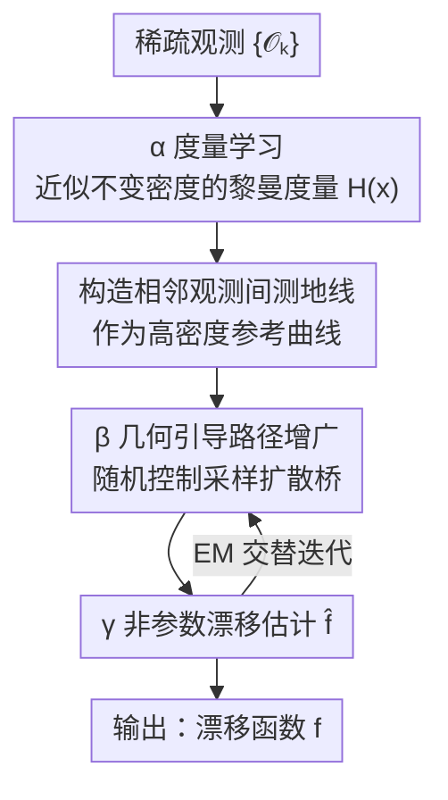

# From Geometry to Dynamics: Learning Overdamped Langevin Dynamics from Sparse Observations with Geometric Constraints

**会议**: ICML2026  
**arXiv**: [2512.23566](https://arxiv.org/abs/2512.23566)  
**代码**: 待确认  
**领域**: 物理 / 随机动力学 / 系统辨识  
**关键词**: 朗之万动力学, 稀疏观测, 随机控制, 黎曼几何, 路径增广

## 一句话总结
针对"只能稀疏采样轨迹时无法准确反推随机动力学"的难题，本文把推断重写成一个随机控制问题，用系统不变密度的几何（黎曼度量 + 测地线）来引导重建未观测路径，从而在极度欠采样的过摆朗之万系统上把漂移函数 $\mathbf{f}$ 估得比现有方法准得多。

## 研究背景与动机

**领域现状**：许多自然过程（花粉布朗运动、化学反应、种群动力学、细胞生长）都服从朗之万方程或随机微分方程（SDE）$\mathrm{d}\mathbf{X}_t=\mathbf{f}(\mathbf{X}_t)\,\mathrm{d}t+\boldsymbol{\sigma}\,\mathrm{d}\mathbf{W}_t$，其中漂移 $\mathbf{f}$ 刻画确定性长期演化、扩散 $\boldsymbol{\sigma}$ 表示未解析自由度的随机贡献。从离散观测反推 $\mathbf{f}$ 是随机系统辨识的核心问题。

**现有痛点**：现有数据驱动方法分两大流派且各有死穴。**时间方法**靠观测的时间次序、用状态增量回归来估漂移（$\hat{\mathbf{f}}(\mathbf{x})=\langle \mathrm{d}\mathbf{X}_t/\tau \mid \mathbf{X}_t=\mathbf{x}\rangle$），但只在观测间隔 $\tau$ 很小时成立；$\tau$ 一大，欧氏距离忽略了相邻观测间隐藏连续路径的曲率，短时近似（如 Euler–Maruyama 的高斯增量假设 $\mathbf{X}_{t+\tau}\mid\mathbf{X}_t\approx\mathcal{N}(\mathbf{X}_t+\mathbf{f}\tau,\boldsymbol{\sigma}\boldsymbol{\sigma}^\top\tau)$）就崩了，因为真实转移密度本质上非高斯。**几何方法**则近似系统的不变密度或扩散生成元的本征结构，但只适用于**保守力系统**（$\mathbf{f}=-\nabla V$）或解耦变量。

**核心矛盾**：稀疏采样下逆问题严重欠约束——多个不同的漂移能在稀疏观测间诱导出相似的转移统计。要准确恢复 $\mathbf{f}$，必须引入与数据相容的额外归纳偏置。而时间方法（通用但要密采样）和几何方法（容忍稀疏但只限保守系统）这两套优势从没被统一过。

**本文目标**：在**大观测间隔 $\tau$** 这个困难设定下，把两派优势融合——既要时间方法的普适性（不限保守系统），又要几何方法对稀疏采样的容忍度。

**切入角度**：观测被约束在状态空间的一个低维结构（不变密度诱导的"经验流形"）上或附近；未观测路径很可能落在连接相邻观测的**测地线**附近。把这个几何先验当成归纳偏置，就能在欠约束时偏好那些"可能路径沿不变密度高密度区走"的漂移假设。

**核心 idea**：把"补全未观测路径"重写成一个**随机控制问题**，控制项把近似路径分布引导着穿过观测、又贴着测地线走；再把这套几何引导的路径增广嵌进 EM 框架，与非参数漂移估计交替迭代。

## 方法详解

### 整体框架

输入是一组按时间排序、间隔 $\tau$ 较大的稀疏观测 $\{\bm{\mathcal{O}}_k\dot=\mathbf{X}_{t_k}\}_{k=1}^K$；输出是漂移函数 $\mathbf{f}$ 的非参数估计。核心难点是 $\tau$ 大时观测之间隔着一大段没看见的连续轨迹，直接用增量回归会被路径曲率带偏。

本文的解法是三步走、其中后两步在 EM 框架里**交替迭代**：(α) 用度量学习近似系统不变密度诱导的黎曼几何；(β) 在该几何引导下估计相邻观测之间的（隐）系统状态，即"路径增广"；(γ) 用增广出来的稠密路径做数据驱动的漂移估计。直觉上，几何先告诉你"路径该往哪些高密度区走"，路径增广据此采样出合理的中间状态，漂移估计再吃这些稠密化的轨迹，反过来给下一轮更好的增广先验。

### 关键设计

**1. 经验流形的度量学习：用不变密度的几何替代"维度估计"**

几何方法以往要先估出低维流形的维数，但系统涨落让维数很难定。本文换了个等价但更好用的视角（借鉴 Fröhlich 等）：不去显式找低维子流形，而是把整个观测空间 $\mathbb{R}^d$ 当作一个被黎曼度量 $\bm{\mathfrak{h}}$ 扭曲的光滑流形 $\mathcal{M}\dot=\mathbb{R}^d$，不变密度的非线性几何全部体现在这个度量里。度量以非参数形式在位置 $\mathbf{x}$ 处取加权局部对角协方差的逆：

$$H_{dd}(\mathbf{x})=\Big(\sum_{k=1}^K w_k(\mathbf{x})\big(\mathcal{O}^{(d)}_k-x^{(d)}\big)^2+\epsilon\Big)^{-1},\quad w_k(\mathbf{x})=\exp\!\Big(-\frac{\|\bm{\mathcal{O}}_k-\mathbf{x}\|_2^2}{2\sigma_\mathcal{M}^2}\Big).$$

观测密集（高密度）处协方差小、度量值小（"距离短"），稀疏处度量值大。这样既绕开了维数估计，又让"观测密度"自然地塑造空间里的距离——这是把不变密度几何注入推断的关键载体。$\sigma_\mathcal{M}$ 控制近似流形的曲率，$\epsilon$ 保证对角非零。

**2. 相邻观测间的测地线：给路径增广提供高密度参考曲线**

有了度量 $\mathbf{H}(\mathbf{x})$，就在经验流形上求相邻观测 $\bm{\mathcal{O}}_k,\bm{\mathcal{O}}_{k+1}$ 之间的**测地线** $\bm{\gamma}^{k}_{t'}$——即在该度量下连接两点的最小能量曲线，$\bm{\gamma}^{k*}=\arg\min\int_0^1 L_\mathcal{M}(\bm{\gamma},\dot{\bm{\gamma}})\,\mathrm{d}t'$，其中 $\int_0^1 L_\mathcal{M}\,\mathrm{d}t'=\tfrac12\int_0^1\|\dot{\bm{\gamma}}^{k}_{t'}\|_{\mathfrak{h}}^2\,\mathrm{d}t'$。它等价于曲线长度泛函的极小子，即真测地线，解一个二阶 ODE（带边界条件 $\bm{\gamma}_0^k=\bm{\mathcal{O}}_k,\bm{\gamma}_1^k=\bm{\mathcal{O}}_{k+1}$），用概率 ODE 求解器算。测地线给出的是穿过经验几何高密度区的几何参考曲线，后续作为状态估计的**软邻近约束**——这正是几何方法"沿高密度路径走"的具象化，但不再要求系统保守。

**3. 几何引导的路径增广 = 随机控制问题：让扩散桥既穿过观测又贴着测地线**

这是把"补全未观测路径"重写成随机控制的核心。给定先验扩散过程（漂移 $\hat{\mathbf{f}}$、扩散 $\sigma$），构造一个近似过程，要求它 (i) 穿过两端观测、(ii) 尊重不变密度的局部几何（由测地线代表）。条件过程仍是同扩散常数的扩散过程，但带一个有效漂移 $\mathbf{g}(\mathbf{x},t)$：

$$\mathrm{d}\mathbf{X}_t=\big(\widehat{\mathbf{f}}(\mathbf{X}_t)+\mathbf{u}(\mathbf{X}_t,t)\big)\,\mathrm{d}t+\sigma\,\mathrm{d}\bar{\mathbf{W}}_t,$$

其中时变控制项 $\mathbf{u}(\mathbf{x},t)$ 把近似路径分布引导着穿过观测、同时停留在对应测地线附近。$\mathbf{g}$ 由一个变分问题（最小化相应泛函）解出。和常用的布朗桥/OU 桥相比，那些桥用线性化或简化的桥动力学，$\tau$ 一大就越来越偏离真实未观测路径；而这里的桥是**非线性、几何约束**的，直接对齐真实转移密度的几何结构——这是大 $\tau$ 下能赢的根本。

**4. EM 框架交替迭代：路径增广 ↔ 非参数漂移估计**

路径增广（β）和漂移估计（γ）在 Expectation–Maximisation 框架里交替进行：E 步用当前漂移先验采样几何约束的扩散桥、补出稠密的隐状态路径；M 步用这些稠密路径做模型无关的非参数漂移估计，更新 $\hat{\mathbf{f}}$；再回到 E 步。每一轮增广都用上一轮更准的漂移，路径越补越像真路径、漂移越估越准。论文还给了理论支撑：大 $\tau$ 时短时近似的偏差由涉及向量场曲率的高阶项控制，这正解释了纯时间方法为何随 $\tau$ 增大而退化，也佐证了引入几何曲率信息的必要性。

### 损失函数 / 训练策略

漂移估计用非参数函数逼近（模型无关），整体在 EM 框架下交替优化；度量学习是非参数的（局部加权协方差逆），测地线由概率 ODE 求解器解二阶 ODE，路径增广由变分推断求最优控制漂移。关键超参是控制流形曲率的 $\sigma_\mathcal{M}$ 和扩散幅度 $\sigma$。

## 实验关键数据

### 主实验

在 Van der Pol 系统（非保守、含极限环，是几何方法传统失效的例子）上，用加权均方根误差 wRMSE 评估，扫不同观测间隔 $\tau$ 和噪声 $\sigma$。对比 GP、SVISE、KM-basis、LatentSDE、GSBM、[SF]²M、MFM$_\text{LAND}$ 等。结果（$T=500$，$\mathrm{d}t=0.01$，wRMSE↓）：

| 方法 | $\sigma$ | $\tau{=}80$ | $\tau{=}160$ | $\tau{=}240$ | $\tau{=}280$ |
|------|------|------|------|------|------|
| GP | 0.25 | 0.642 | 1.083 | 1.399 | 1.528 |
| SVISE | 0.25 | 1.465 | 0.740 | 0.587 | 0.824 |
| KM-basis | 0.25 | **0.368** | 0.671 | 1.744 | 1.732 |
| **Geometric (本文)** | 0.25 | 0.474 | **0.514** | 0.687 | 0.993 |
| GP | 0.50 | 0.691 | 1.114 | 1.409 | 1.542 |
| KM-basis | 0.50 | 0.495 | 0.890 | 1.744 | 1.732 |
| **Geometric (本文)** | 0.50 | **0.462** | **0.621** | **0.750** | **0.865** |

随 $\tau$ 增大，时间类方法（GP、KM-basis）误差单调爆炸（$\tau{=}280$ 时 GP 已 >1.5）；本文方法在大 $\tau$、各噪声下几乎全面最优，尤其 $\sigma{=}0.50$ 时 $\tau{=}80\to280$ 全程领先。本文只用 $T=500$ 时长就压过用 $T=1500$ 的 [SF]²M、MFM$_\text{LAND}$。

### 消融实验

Figure 2 展示几何路径增广迭代两次后的漂移恢复质量（力场角度估计），可视为对"增广迭代"的消融：

| 配置 | 漂移恢复质量 | 说明 |
|------|------------|------|
| 高斯似然（无增广） | 最差 | 等价于短时高斯近似，大 $\tau$ 下力场方向偏差明显 |
| + 第 1 次几何增广 | 显著改善 | 路径开始贴合真实曲率，wRMSE 下降 |
| + 第 2 次几何增广 | 最佳 | 力场与真值高度吻合，仅两次迭代即收敛 |

### 关键发现
- **几何增广在大 $\tau$ 才显威力**：小 $\tau$ 时本文与 KM-basis 等接近（KM-basis 在 $\tau{=}80$、$\sigma{=}0.25$ 还略优），但 $\tau$ 一大，时间方法雪崩、本文几乎不退化——验证了曲率信息正是稀疏采样下缺失的归纳偏置。
- **迭代收敛极快**：仅两次几何增广就让力场估计从明显偏差收敛到与真值吻合。
- **打破保守系统限制**：在非保守的 Van der Pol 上做到这点，正面回应了"几何方法只限保守系统"的老问题。
- **数据效率高**：$T=500$ 即胜过对手 $T=1500$ 的设定，说明几何先验大幅降低了对观测量的需求。

## 亮点与洞察
- **把路径补全重写成随机控制**：用一个时变控制项把扩散桥同时约束到"穿过观测"和"贴测地线"，比布朗桥/OU 桥的线性化更贴合真实非高斯转移密度——这是大 $\tau$ 制胜的核心，思路可迁移到任何需要桥采样的 SDE 推断。
- **用"扭曲整个空间的度量"代替"估流形维数"**：不去显式找低维流形，而是把不变密度的几何全塞进黎曼度量，绕开了系统涨落下维数难估的痛点，工程上更稳。
- **统一时间派与几何派**：第一个把两派优势（普适性 + 抗稀疏）真正融进同一框架的工作，且给了曲率高阶项的理论解释，说清了"时间方法为何随 $\tau$ 退化"。
- **几何归纳偏置换数据量**：在稀疏/欠采样这种实验科学常见困境里，用几何先验换取数据效率，对真实观测受限的场景很实用。

## 局限与展望
- **聚焦过摆朗之万 + 加性常扩散**：方法在过摆朗之万系统、扩散常数已知（或为常数 $\sigma$）的设定下验证，状态依赖扩散、欠摆/惯性系统未涉及。
- **依赖不变密度结构**：核心前提是观测被约束在不变密度诱导的低维几何附近；远离平稳态或多稳态切换的瞬态，几何先验是否仍有效存疑。
- **度量为局部对角形式**：度量学习用加权局部对角协方差的逆，强各向异性或强耦合维度间的几何能否被对角近似充分捕捉，论文未深究。
- **高维可扩展性待验证**：测地线 ODE 求解与扩散桥采样在高维 $d$ 下的计算成本和稳定性，实验主要在低维基准（如 Van der Pol）上展示。

## 相关工作与启发
- **vs 时间方法（GP-drift / Kramers–Moyal / 增量回归）**: 它们靠短时高斯近似从增量回归漂移，$\tau$ 小才准；本文不假设短时、用几何桥补全路径，在大 $\tau$ 下大幅领先。
- **vs 几何方法（不变密度/生成元本征结构）**: 它们容忍稀疏但只限保守力或解耦变量；本文把几何只当"路径增广的引导先验"，从而在非保守的 Van der Pol 上也成立。
- **vs 布朗桥/OU 桥增广（如 Batz 等）**: 它们用线性化桥动力学，$\tau$ 大时桥越来越偏离真路径、改善有限；本文用非线性、测地线约束的扩散桥，直接对齐真实转移密度几何。
- **vs LatentSDE / GSBM / [SF]²M 等深度 SDE/桥方法**: 这些方法在稀疏大 $\tau$ 设定下 wRMSE 高且不稳；本文以更少数据（$T=500$ vs 1500）取得更低误差，凸显几何归纳偏置的价值。

## 评分
- 新颖性: ⭐⭐⭐⭐⭐ 把稀疏 SDE 推断重写成几何引导的随机控制、统一时间派与几何派，角度新且自洽。
- 实验充分度: ⭐⭐⭐⭐ 系统扫 $\tau/\sigma$、对比七类基线、迭代消融到位，但主要在低维非保守基准上验证。
- 写作质量: ⭐⭐⭐⭐⭐ 两派对比—矛盾—融合的逻辑链清晰，几何直觉与公式配合得当。
- 价值: ⭐⭐⭐⭐ 对观测稀疏的实验科学（生物、化学）随机系统辨识有实际意义，高维落地待补。

<!-- RELATED:START -->

## 相关论文

- [\[ICML 2026\] Speculative Sampling for Faster Molecular Dynamics](speculative_sampling_for_faster_molecular_dynamics.md)
- [\[ICML 2026\] Understanding Catastrophic Forgetting In LoRA via Mean-Field Attention Dynamics](understanding_catastrophic_forgetting_in_lora_via_mean-field_attention_dynamics.md)
- [\[ICML 2026\] Teaching Molecular Dynamics to a Non-Autoregressive Ionic Transport Predictor](teaching_molecular_dynamics_to_a_non-autoregressive_ionic_transport_predictor.md)
- [\[CVPR 2025\] Improve Representation for Imbalanced Regression through Geometric Constraints](../../CVPR2025/physics/improve_representation_for_imbalanced_regression_through_geometric_constraints.md)
- [\[AAAI 2026\] PIMRL: Physics-Informed Multi-Scale Recurrent Learning for Burst-Sampled Spatiotemporal Dynamics](../../AAAI2026/physics/pimrl_physics-informed_multi-scale_recurrent_learning_for_burst-sampled_spatiote.md)

<!-- RELATED:END -->
