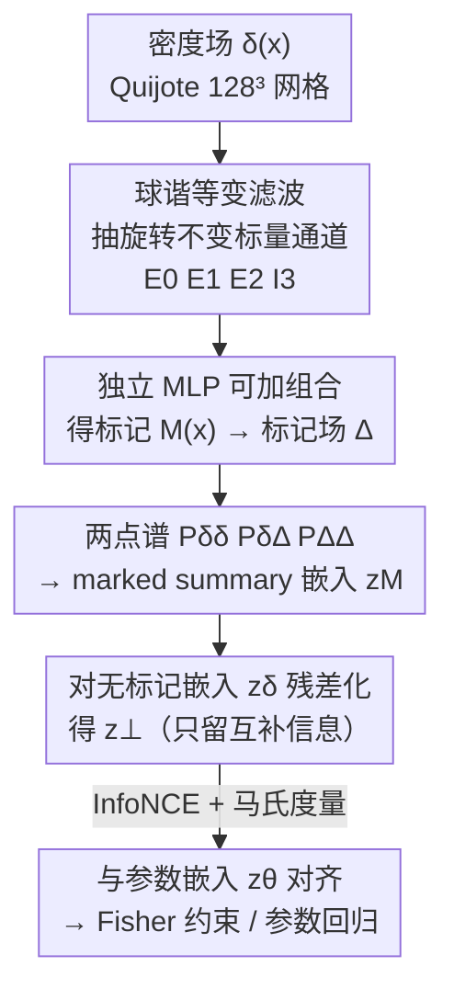

# Interpretable Equivariant Marks for Contrastive Cosmological Inference

**会议**: ICML 2026  
**arXiv**: [2606.11295](https://arxiv.org/abs/2606.11295)  
**代码**: 论文中提供（"The code developed for this analysis can be found here"，链接以原文为准）  
**领域**: 物理 / 宇宙学推断 / 等变表示学习 / 对比学习  
**关键词**: 标记统计量、球谐等变滤波、对比学习、Fisher 信息、可解释 summary

## 一句话总结
这篇论文把宇宙学里"标记统计量（marked statistics）"中手工设计的标记函数，换成一个**可解释、等变约束的神经标记**——用三个局部 SO(3) 等变的球谐滤波器抽出旋转不变的形态学描述子，再用对比学习（InfoNCE + 残差化）把标记后的两点谱和宇宙学参数对齐，在 Quijote N-body 模拟上把 $\sigma_8$ 的边缘约束收紧 $2.9\times$、$\Omega_m$ 收紧 $1.8\times$，并打破经典的 $\Omega_m$–$\sigma_8$ 简并。

## 研究背景与动机

**领域现状**：下一代大尺度结构（LSS）巡天（DESI、Euclid、SPHEREx）会给出上百万星系的三维分布。从中提取宇宙学信息的"金标准"是功率谱（power spectrum），它是高斯场的最优 summary，在准线性尺度上有成熟的微扰论建模。

**现有痛点**：晚期物质密度场在非线性尺度上是显著非高斯的，大量信息藏在高阶关联里，而功率谱这种两点统计量原则上**看不到**这些信号。直接往上爬 $n$ 点关联阶梯（三点、四点谱）在位形空间里计算昂贵、微扰论在非线性区失效、且背后的高斯似然假设越来越站不住。

**核心矛盾**：要么用场级（field-level）神经 summary / 仿真推断（SBI），它们约束力强但把驱动约束的特征变成黑箱、还需要海量高保真模拟；要么用标记统计量——给密度场乘一个空间权重 $M(\mathbf{x})$，让标记场的两点谱"折叠"进原场的高阶关联，输出仍是一个功率谱、便宜又好建模。但经典标记的**标记函数是手工设计、形式被窄参数化死死框住**（如基于平滑密度的幂律），而且通常绑定在某一个固定的宇宙学参考点上。

**本文目标**：在保住"输出仍是两点谱"这个好处的前提下，把标记函数从手工设计升级成**可学习、宇宙学无关、且仍然可读**的形式，并能直接解释"信息增益来自哪类形态学结构"。

**切入角度**：作者不预设"哪类环境特征最重要"，而是让网络去学；但又通过**物理动机的架构约束**（局部 SO(3) 等变、旋转不变标量通道、可加分解）把可解释性硬编码进结构里——训练完的标记可以在位形空间里被"打开"逐通道读。

**核心 idea**：用"等变球谐滤波抽形态学不变量 + 对比学习对齐参数 + 对无标记谱做残差化"三件套，替代手工标记函数，学出一个既增约束力又可解释的标记。

## 方法详解

### 整体框架
方法由两大组件串成。前半是**可学习标记模块**：把密度场 $\delta(\mathbf{x})$ 经球谐等变滤波分解成几个旋转不变的局部描述子，再用独立 MLP 把它们组合成标记 $M(\mathbf{x})$；标记场 $\Delta(\mathbf{x})=M(\mathbf{x})[1+\delta(\mathbf{x})]-\langle M(1+\delta)\rangle$ 的两点谱 $\{P_{\delta\delta},P_{\delta\Delta},P_{\Delta\Delta}\}$ 就携带了原场的高阶信息。后半是**对比训练**：把标记 summary 嵌入向量 $\mathbf{z}_M$ 和宇宙学参数嵌入 $\mathbf{z}_\theta$ 投到同一个隐空间，用 InfoNCE 对齐；关键的一步是把 $\mathbf{z}_M$ 对无标记嵌入 $\mathbf{z}_\delta$ 做**残差化**，只奖励标记带来的"增量信息"。整条管线训练完后，标记是一个固定、可逐通道读的密度场变换。

### 关键设计

**1. 等变球谐标记模块：用形态学不变量替代手工标记函数**

经典标记 $M(\mathbf{x})=\big(\tfrac{1+\delta_s}{1+\delta_s+\delta_R(\mathbf{x})}\big)^p$ 只依赖一个平滑密度 $\delta_R$，形式被幂律和饱和参数 $\delta_s$ 框死，只能表达"上权欠密区/下权过密区"这类一维偏好。本文把标记换成对密度场做球谐滤波后的标量响应。具体地，对 $\ell\in\{0,1,2\}$ 在傅里叶空间做滤波 $F_{\ell m}(\mathbf{x})=\mathcal{F}^{-1}[\tilde\delta(\mathbf{k})\,W_{\mathrm{MAS}}^{-1}\,T_{\mathrm{tap}}\,G_\ell(k)\,i^\ell Y_{\ell m}(\hat{\mathbf{k}})]$，其中 $G_\ell(k)$ 是可学习的高斯带通径向轮廓、$Y_{\ell m}$ 是实球谐、$W_{\mathrm{MAS}}^{-1}$ 去掉质量分配窗、$T_{\mathrm{tap}}$ 是抑制混叠的 Nyquist taper。这些方向相关分量再收缩成**旋转不变标量**：$E_0=F_{00}$（带符号单极/密度型响应）、$E_1=(\sum_m F_{1m}^2+\epsilon)^{1/2}$（梯度/矢量幅度）、以及由 $\ell=2$ 的五个分量映射成无迹对称张量 $Q$ 后取的两个不变量 $E_2=[\mathrm{Tr}(Q^2)+\epsilon]^{1/2}$（各向异性强度）和 $I_3=\mathrm{Tr}(Q^3)/(E_2^3+\epsilon)$（区分扁/长四极形状）。

之所以这样有效：每个 $\ell$ 通道在标记里是**独立可加**的——$\eta(\mathbf{x})=\sum_a h_a(f_a(\mathbf{x}))+h_\times(E_0,E_2,I_3)$，$M=\mathrm{softplus}[\eta]$。这意味着训练完后可以把标记**精确拆**成各通道贡献（不是 saliency 近似），逐项读"网络偏好哪类局部形态"。标记初始化在 $M(\mathbf{x})\simeq 1$，于是训练从无标记场起步。这套架构让标记既比幂律标记表达力强得多，又保住了"在位形空间里可读"的可解释性。

**2. 残差化的对比对齐：只奖励标记带来的互补信息**

如果直接让标记 summary 去拟合参数，网络很容易学到一个"复刻 $P_{\delta\delta}$ 里已有信息"的退化解——多花力气却没增量。作者在隐空间里把标记嵌入对无标记嵌入做正交投影：

$$\mathbf{z}_\perp=\mathbf{z}_M-\frac{\mathbf{z}_M\cdot\mathbf{z}_\delta}{\mathbf{z}_\delta\cdot\mathbf{z}_\delta+\epsilon}\,\mathbf{z}_\delta$$

把和 $\mathbf{z}_\delta$ 平行的分量减掉，只留下与无标记谱**互补**的部分 $\mathbf{z}_\perp$，再拿它去和参数对齐。对齐用 InfoNCE：$\mathcal{L}_i=-\log\frac{\exp s(\mathbf{z}_{\perp,i},\mathbf{z}_{\theta,i})}{\sum_{j\in\mathcal{N}_i^+}\exp s(\mathbf{z}_{\perp,i},\mathbf{z}_{\theta,j})}$。负样本设计很巧：因为生成参数嵌入 $\mathbf{z}_{\theta,j}$ 只需要参数向量、不需要配对的密度场，所以能廉价采样三类负例——训练集里的真实负例（batch 内共享）、覆盖全先验体积的全局合成负例、以及在锚点宇宙学周围壳层采的局部合成负例。局部负例逼着 summary 去**区分邻近宇宙学**，而这本来要靠额外模拟才能做到。

**3. 学习的马氏度量 + 自举训练：让隐空间几何对齐参数几何**

InfoNCE 里的相似度不是普通内积，而是带可学习下三角因子 $L$ 的马氏距离：

$$s(\mathbf{z}_\perp,\mathbf{z}_\theta)=-\tau^{-1}(\mathbf{z}_\perp-\mathbf{z}_\theta)^T LL^T(\mathbf{z}_\perp-\mathbf{z}_\theta)$$

它允许隐空间做旋转和拉伸，让 summary 几何更好地对齐参数几何，同时仍对任意方向的大距离施罚。训练顺序也有讲究：先**预训练无标记分支**让 $P_{\delta\delta}$ 与参数嵌入对齐、再**冻结** $P_{\delta\delta}$-embedder 去训标记模块；参数 embedder 用无标记构型初始化但允许微调，所以最终几何不被无标记 summary 钉死。作者强调，没有这步自举，无标记 embedder 可能塌缩，让"互补性约束"失去意义。

### 损失函数 / 训练策略
核心损失是上面的残差化 InfoNCE（公式 14），相似度用马氏距离（公式 15），温度 $\tau$ 固定。训练分两阶段：阶段一对齐 $P_{\delta\delta}$ 与参数并冻结其 embedder；阶段二训练标记模块 + 微调参数 embedder。$G_\ell(k)$ 参数化为共享中心 $r_0$、宽度 $\sigma$ 的可学习高斯带通，加上每个 $\ell$ 的零初始化残差 MLP（作用在对数频率特征上）。详细超参在原文附录 B.1。

## 实验关键数据

数据集为 Quijote BSQ 套件的 5000 个 N-body 模拟，5 个变化的宇宙学参数 $\boldsymbol\theta=(\Omega_m,\Omega_b,h,n_s,\sigma_8)$；密度场分配到 $128^3$ 网格（cell 尺寸 $7.8\,h^{-1}\mathrm{Mpc}$，$k_{\mathrm{Nyq}}\simeq 0.4\,h\,\mathrm{Mpc}^{-1}$）。对比训练只用到 $k\simeq 0.3\,h\,\mathrm{Mpc}^{-1}$ 以内的谱，避免接近 Nyquist 的混叠伪迹。

### 主实验

在 $k_{\max}=0.20\,h\,\mathrm{Mpc}^{-1}$（mass-assignment 伪迹可忽略、标记仍活跃的区间）评估两类任务：固定参考宇宙学的 Fisher 约束、以及全参数体积上的留出泛化。

| 任务 / 指标 | 对比对象 | 学习标记的相对增益 |
|------|------|------|
| Fisher 边缘约束 $\sigma_8$ | 经典标记 (Massara 2021, $R=10\,h^{-1}\mathrm{Mpc}$) | 收紧 $2.9\times$ |
| Fisher 边缘约束 $\Omega_m$ | 经典标记 | 收紧 $1.8\times$ |
| $\Omega_m$–$\sigma_8$ 简并 | 仅 $P_{\delta\delta}$ | 等高线旋转，**打破**经典简并 |
| 留出参数 MSE（先验全体） | 最优经典标记 | 降低约 $1.45\times$ |

Fisher 协方差由 10,000 个参考模拟估计、导数由每参数 500 个有限差分模拟估计，且这些与对比训练集、留出 Latin-hypercube 测试集互不相交。留出泛化用一个 MLP 从各 summary 回归到 5 维参数向量，学习标记的 MSE 全面优于无标记基线和最优经典标记，$\sigma_8$ 上增益最大。

### 消融 / 分析实验

| 配置 / 分析 | 关键指标 | 说明 |
|------|---------|------|
| 完整标记 vs $\ell_{\max}=0$ 各向同性消融 | Fisher 边缘约束 | $E_0$ 通道贡献绝大部分增益，各向异性通道在此设置下做精细修正（附录 A） |
| 隐空间 $\mathbf{z}_\perp$ 有效秩 | $\approx 3.4$ | $D=16$ 空间里前两主成分占约 85% 方差，与参数内在维一致 |
| 主成分 vs 参数方向 | PCA 对齐 | 前两 PC 几乎完美对齐 $\sigma_8$ 与 $\Omega_m$，正是约束增益主导的两个参数 |
| 参数检索 recall@k | R@1=66.5%，R@5=96.1% | 随机基线 R@1=$1/N$=0.05%（2000 个 Latin-hypercube 模拟） |

### 关键发现
- **增益主要来自小尺度各向同性响应**：mark introspection 显示在该分辨率/$k_{\max}$ 下 $E_0$ 主导，训练出的 $G_0(k)$ 表现为高通滤波，网络本质上学到了一个"非线性重加权的密度"；各向异性通道（dipole/quadrupole）只在结构边界和细长区做次主导修正，$I_3$ 贡献最弱。因为标记是可加分解，这个"$E_0$ 主导"是训练标记本身的性质，不是可视化伪影。
- **可解释性可读到形态学**：$E_1$ 在 void/filament 边界处峰值、$E_2$ 在细长丝状区、$I_3$ 在固定 $E_2$ 下区分扁/长四极构型——标记被打开后能直接读出"偏好哪类形态"。
- **高 $k_{\max}\ge 0.3$ 时优势减弱**：球谐滤波在立方网格上需要的抗混叠 taper 会削掉经典像素空间标记保留的功率，此时部分经典标记重新有竞争力；作者称后续基于形态学滤波的扩展能恢复一致优势。

## 亮点与洞察
- **把可解释性写进架构而非事后归因**：标记的可加分解 $\eta=\sum_a h_a(f_a)+h_\times$ 让"逐通道贡献"是精确恒等式而非 saliency 代理——这是它敢叫"interpretable"的硬底气，比黑箱场级网络的事后解释扎实得多。
- **残差化是点睛之笔**：把标记嵌入对无标记嵌入做正交投影，直接在目标里写死"只为增量信息买单"，避免了"学了半天只是复刻功率谱"的退化，思路可迁移到任何"在已有 baseline 上加增量特征"的表示学习场景。
- **借多模态对比学习的工具进物理**：用 InfoNCE + 可学习马氏度量把"summary↔参数"当成图文对齐问题，且负样本只需参数向量、不需配对模拟，大幅降低了采样成本——这种"廉价合成负例"的设计在仿真昂贵的科学领域尤其有价值。
- **隐空间几何自带物理读数**：训练后嵌入的前两主成分自动对齐 $\sigma_8$、$\Omega_m$，等于无监督地"发现"了宇宙学信息的主轴，是简并被打破在表示层面的印证。

## 局限与展望
- 作者承认在 $k_{\max}\ge 0.3\,h\,\mathrm{Mpc}^{-1}$ 时抗混叠 taper 削功率，使部分经典标记重新有竞争力，当前框架并非全程一致占优；需要等后续的形态学滤波扩展。
- 各向异性通道（$\ell=1,2$）在当前分辨率/尺度下贡献偏弱，方法的"形态学可解释性"卖点在此设置里更多体现为 $E_0$ 主导，丰富的张量结构红利尚未充分兑现。
- 全部实验都在 $z=0$ 的模拟密度场上、且用了理想化的周期盒；真实巡天的红移空间畸变、选择函数、星系偏置等系统效应尚未纳入。
- 作者展望把同一套思路用于**原初非高斯性**等本质需要高阶统计才能约束的参数，以及引入更丰富的几何不变量来进一步提升约束力与可解释性。

## 相关工作与启发
- **vs 经典标记统计量（White 2016 / Massara 2021 / Cowell 2024）**: 它们把标记函数固定为平滑密度的窄参数化形式（幂律 + 饱和），甚至只在固定参考宇宙学下用 Fisher 最大化优化形状；本文把标记换成等变神经网络，宇宙学无关、表达力更大，同时通过可加架构保住可解释性，约束力全面占优。
- **vs 场级 / 仿真推断神经 summary（Charnock 2018 / Makinen 2021 / Lemos 2024）**: 它们直接把模拟映射到后验、约束力强但特征是黑箱、且要海量高保真模拟；本文牺牲一点极限约束力换来"输出仍是可建模的两点谱 + 标记可读"，更便于理解信息来源。
- **vs 混合策略（Makinen 2025 / Bairagi 2026）**: 混合方法把神经 summary 拼到传统统计上、神经部分仍不透明；本文的整个标记都可被打开逐通道读，可解释性更彻底。

## 评分
- 新颖性: ⭐⭐⭐⭐⭐ 把等变球谐可解释标记 + 残差化对比学习引入宇宙学标记统计量，跨界且自洽。
- 实验充分度: ⭐⭐⭐⭐ Quijote 上 Fisher + 留出泛化 + 隐空间几何三角验证扎实，但仅限 $z=0$ 模拟、未触及真实巡天系统效应。
- 写作质量: ⭐⭐⭐⭐ 方法层次清晰、可解释性论证有力，部分公式（如 $F_{\ell m}$ 滤波）对非宇宙学读者门槛偏高。
- 价值: ⭐⭐⭐⭐ 为下一代 LSS 巡天提供了"既增约束力又可解释"的 summary 设计范式，残差化与等变可加分解思路可外溢到其他科学 ML 任务。

<!-- RELATED:START -->

## 相关论文

- [\[ICML 2026\] EqGINO: Equivariant Geometry-Informed Fourier Neural Operators for 3D PDEs](eqgino_equivariant_geometry-informed_fourier_neural_operators_for_3d_pdes.md)
- [\[ICML 2026\] Foundation Inference Models for Ordinary Differential Equations](foundation_inference_models_for_ordinary_differential_equations.md)
- [\[NeurIPS 2025\] Vision Transformers for Cosmological Fields: Application to Weak Lensing Mass Maps](../../NeurIPS2025/physics/vision_transformers_for_cosmological_fields_application_to_weak_lensing_mass_map.md)
- [\[ICML 2026\] Distribution Transformers: Fast Approximate Bayesian Inference With On-The-Fly Prior Adaptation](distribution_transformers_fast_approximate_bayesian_inference_with_on-the-fly_pr.md)
- [\[ICML 2025\] Compact Matrix Quantum Group Equivariant Neural Networks](../../ICML2025/physics/compact_matrix_quantum_group_equivariant_neural_networks.md)

<!-- RELATED:END -->
