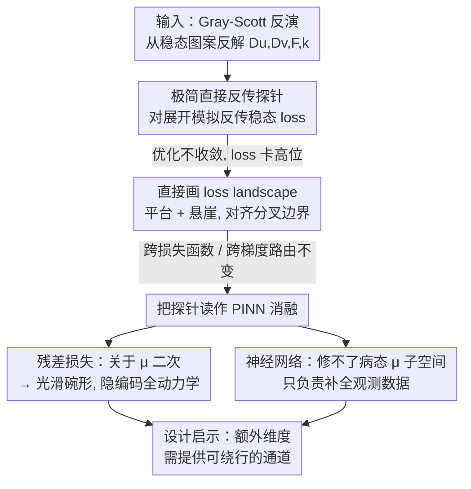

# Loss Landscape Diagnosis for Gradient-Based Gray-Scott System Inversion: Disentangling the Roles of PINN Components

**会议**: ICML 2026  
**arXiv**: [2606.11258](https://arxiv.org/abs/2606.11258)  
**代码**: https://github.com/Yan-Yang-bot/bp_inversion  
**领域**: 物理（科学机器学习 / PINN）  
**关键词**: 物理信息神经网络, 反应扩散, 反问题, 损失曲面, 分叉, 梯度优化

## 一句话总结
作者用最极简的方式——直接对展开的 Gray-Scott 模拟反传稳态损失来反解 PDE 参数，不加任何代理模型或神经网络——发现优化彻底失败，并直接把损失曲面画出来定位病灶（**平台 + 悬崖，悬崖恰对齐分叉边界**）；再把这个极简探针读作 **PINN 的一次消融**，从而首次明确拆开 PINN 两个组件的分工：**残差损失**单靠自己就能把曲面变光滑（因为它隐式编码了全套 PDE 动力学），而**神经网络**修不了病态参数子空间、只负责补全观测数据。

## 研究背景与动机
**领域现状**：从观测反推动力系统的控制参数（反问题）在发育生物学、计算神经科学等领域都很常见。反应扩散系统是其中一类典型问题——参数决定了斑点、条纹、迷宫等定性不同的图案。机器学习处理这类反演时，主流是绕开"直接反传"，改用代理模型（surrogate）或 PINN 这类神经网络增强方法。

**现有痛点**：直接反传（backprop）其实是机器学习里最基础、信息流最高效的优化机制，但在物理系统反演里几乎被回避。大家的"默认假设"是：非线性反应扩散的"参数→解"映射太不规则，直接梯度走不通。然而**这条直接路线到底为什么走不通、走不通到什么程度、现有方法是否真的对症**，从没被系统研究过。

**核心矛盾**：问题可能出在三个层面——损失函数设计、梯度回传方式、还是参数空间本身的几何。如果不把它们一一隔离，就分不清"PINN 为什么有效"究竟是神经网络的功劳还是别的东西。

**本文目标**：用一个**完全可检视**的测试台（四参数 $D_u,D_v,F,k$ 的 Gray-Scott，可网格搜索）把直接梯度优化的行为彻底摸清，再回答"PINN 的哪个组件在真正解决问题"。

**切入角度**：作者故意采用最小化（minimalist）设置——只对展开的模拟步反传稳态损失，不加代理、不加神经网络。这样一旦失败，病因只能归于 PDE 参数子空间本身的几何，而不会被别的模块掩盖。

**核心 idea**：把"极简直接反传"当作一把诊断探针，**把它视为 PINN 的彻底消融**——去掉了 PINN 里的神经网络和数据损失，只剩参数子空间——从而反推出 PINN 各组件的真实角色。

## 方法详解

### 整体框架
这不是一篇"提出新模型"的论文，而是一篇**诊断 + 拆解**的分析论文，逻辑分三步走。第一步搭一个极简探针：对时间展开的 Gray-Scott 步进算法整段反传，目标是从一批 512 张 $128\times128$ 的稳态目标图案里反解出四个参数（真值 $D_u=0.16, D_v=0.08, F=0.035, k=0.065$）。第二步发现优化不收敛后，**直接把损失曲面画出来**，定位失败的几何成因，并验证它跨损失函数、跨梯度回传方式都不变。第三步把这个极简探针**重读为 PINN 的消融实验**，分别分析"残差损失"和"神经网络"各自能做什么、不能做什么，最后给出 PINN 设计启示与一条更一般的启发式。

### 关键设计

**1. 极简直接反传探针：把 PDE 结构本身当成可微模拟器**

针对"大家凭直觉回避直接反传却没人真去查"的痛点，作者把 Gray-Scott 的时间步进算法整段写成可微计算图（$\Delta t=\Delta x=\Delta y=1$），对所有展开步**不做截断**地反传稳态损失，只优化四个 PDE 参数。为保证数值稳定，加了三道护栏：自适应学习率缩放到不产生 $\mathrm{NaN}/\mathrm{Inf}$ 或越界的 $v$；用 $\mathrm{softplus}$ / $\mathrm{sigmoid}$ 重参数化把 $D_u,D_v,F,k$ 约束到合理范围；扩散系数满足二维 CFL 稳定条件 $D\Delta t(\tfrac{1}{\Delta x^2}+\tfrac{1}{\Delta y^2})\le\tfrac12$。目标与训练共享同一套初始条件生成机制，把任务最大化简成"只找四个参数"。这个设计的价值在于：它把所有干扰（代理、神经网络、数据缺失）都剥掉，**一旦失败就只能怪参数子空间的几何**。

**2. 直接可视化 loss landscape：平台 + 悬崖，且跨损失函数、跨梯度路由都不变**

针对"失败原因到底在哪"的问题，作者不靠间接指标，而是**直接把损失曲面切片画出来**。训练时损失长期卡在 245.0–270.0 的高带里、没有下降趋势，偶尔孤立骤降又几步内爬回；而且低损失并不可靠——两个损失相近的配置，一个匹配目标图案、一个完全不匹配。沿 $k,F,D_u,D_v$ 各单参数及 $F\text{-}D_v$、$F\text{-}k$ 二维切片画出来，曲面被**大片平台（梯度信号几乎为零）+ 锐利悬崖**主导，悬崖位置惊人地贴合文献里 Gray-Scott 的**分叉边界**（鞍结/Hopf 分叉），把图案区与均匀解区分开。作者还换了三种损失——非加窗 2D 功率谱、加窗 2D 功率谱（强制各 $16\times16$ 子区贡献均衡）、以及 VGG-19 Gram 矩阵风格损失——结论一致：平台+悬崖始终在，**病灶在几何、不在损失函数**。作者进一步推断：无论梯度怎么回传（展开反传、隐式微分、还是"参数→稳态图"的前向代理），都会继承这个病态曲面。

**3. 把探针读作 PINN 消融：拆开残差损失与神经网络的分工**

这是全文最核心的贡献。既然各种"修曲面"的补救（更好的损失、时间增广代理、中间步监督）都在试图改造同一个病态曲面，一个更根本的问题是：**现成的 PINN 是不是早就绕过了这个病灶？** 把极简探针看成"删掉了神经网络和数据损失的 PINN"，作者分别分析两个组件。

对**残差损失**：在 PINN 里把 PDE 参数也设为可学习，总损失分解为 $L(\theta,\mu)=L_{\text{data}}(\theta)+L_{\text{res}}(\theta,\mu)$，其中 $\theta$ 是网络参数、$\mu$ 是 PDE 参数，两子空间正交。固定 $\theta$ 后网络输出 $u,v$（以及 $\Delta u,\Delta v,uv^2$）都固定，椭圆型 Gray-Scott 残差**关于 $\mu$ 是线性的**，于是残差损失是 $\mu$ 的**二次函数**，给出光滑的碗形曲面（图 6 实测证实）。关键洞察是：残差损失比较的不是"某个初始条件演化出的最终图案"，而是隐式比较 PDE 真正应当产出的东西——它**一次性编码了横跨所有初始条件的完整演化动力学**，因此拿到了远比单条轨迹稳态更丰富的信息，正好是前面三条补救想费劲挖出来的中间步信息。

对**神经网络**：作者反过来问，若 $\mu$ 子空间本身病态，加一个网络 $\theta$ 和数据损失能不能救？答案是不能。总损失梯度拆成 $\nabla L=(\nabla_\theta L_{\text{data}}+\nabla_\theta \tilde L_{\text{res}},\ \nabla_{\tilde\mu}\tilde L_{\text{res}})$。一方面，在某个 $\mu$ 处沿 $\theta$ 的移动无法平移到邻近 $\mu$（每个 $\mu$ 定义不同的目标图案、从而不同的 $\theta$-曲面，$\mu$ 上的不连续会让 $\theta$-曲面突变）；另一方面，无论 $\theta$ 怎么动，$\tilde L_{\text{res}}(\theta,\cdot)$ 在 $\mu$ 上的恶劣几何都被继承，$\nabla_{\tilde\mu}\tilde L_{\text{res}}$ 仍无信息。结论是：**PINN 虽然把搜索空间升维，却没在病态结构周围提供可绕行的通道**，神经网络只能负责**补全观测数据**，修不了参数子空间。由此引出一条超越 PDE 的设计启发式——当某个参数子空间的曲面病态时，新增的辅助维度必须能提供绕过病灶的"可导航的弯路"，否则升维只是徒增自由度。

## 实验关键数据

### 三种损失函数的曲面对比

| 损失函数 | 取值范围 | 均匀解区 | 图案区 | 是否可导航 |
|----------|----------|----------|--------|-----------|
| 非加窗 2D 功率谱 | $0\sim200+$ | 高位主导平台 | 低位平台 | 否（平台+悬崖） |
| 加窗 2D 功率谱 | 同量级 | 高位平台 | 略高于目标 | 否（分离度略好但无可用梯度） |
| VGG-19 Gram 损失 | $0\sim100$ | 中位平台 | 有波动 | 否（波动又引入新悬崖） |

三者几何高度相似：均匀解区与图案区之间始终被**锐利悬崖**隔开、两侧平台几乎无梯度，证实病灶与具体损失无关。

### 训练行为与组件分工

| 现象 / 组件 | 观察 | 结论 |
|------|---------|------|
| 训练损失 | 长期卡 245–270，无下降趋势 | loss 不提供收敛信号 |
| 低损失配置 #3 vs #7 | 损失相近，一个匹配一个不匹配 | 低损失 ≠ 正确拟合 |
| 残差损失（固定 $\theta$） | 关于 $\mu$ 二次 → 光滑碗形 | 单靠残差损失已避开病灶 |
| 神经网络 $\theta$ 子空间 | 病态 $\mu$ 子空间无法被修复 | 网络只补全数据、不修曲面 |

### 关键发现
- **悬崖对齐分叉**：损失悬崖的位置与文献中 Gray-Scott 的鞍结/Hopf 分叉边界惊人吻合——优化器被困在均匀解（或准均匀的极限环）区，偶尔窜入图案区又被窄而陡的悬崖弹回，这正解释了损失长期卡高位。
- **残差损失反直觉地"免费"解决问题**：它无需神经网络贡献就把曲面变成光滑碗，因为它隐式比较的是横跨所有初始条件的全套动力学，而非单条轨迹的稳态。
- **升维 ≠ 解题**：神经网络把搜索空间升维，但若不提供绕过病灶的通道就毫无帮助，这条启发式可推广到 PDE 之外的病态参数反演。

## 亮点与洞察
- **"用极简失败当探针"的方法论很漂亮**：故意把所有模块剥光，让失败的病因无处遁形，再把这个失败重读为 PINN 的消融，一举回答了"PINN 哪个组件在起作用"。
- **首次把 PINN 两组件的分工讲清楚**：残差损失负责"让 $\mu$ 曲面光滑"（因隐含全动力学），神经网络负责"补全数据"——这个分工此前从未被显式指出，对设计精简版 PINN 有直接指导意义。
- **可迁移的启发式**：病态子空间下"额外维度必须提供可导航弯路"这条原则，适用于一切想靠升维绕开坏曲面的场景，而非仅限 PDE 反演。

## 局限与展望
- **结论限于稳态单帧设定**：残差损失在 $\theta$ 子空间是否始终良态、尤其在完整时空问题里（Sitzmann 与 Krishnapriyan 的证据相互冲突），作者坦言留待未来，目前对 $\theta$-曲面良态性主要靠类比论证而非本设定下的直接可视化验证。
- **匹配配置 #3 是"撞上"的**：它在损失骤降瞬间被人工打断才被发现，并未观察其是否会爬回高带，作者也预期会——说明即便偶遇低损失也不可靠。
- **补救方向与重设计只点到为止**：更好的损失、时间增广代理、中间步监督，以及针对"数据补全"角色重设计网络，作者称已有详细方案但留待后续论文，本文未给实证。

## 相关工作与启发
- **vs 代理模型（Schnörr & Schnörr）**：他们学"图案→参数"的反向映射来回避病态曲面，但只做粗估计、且会把不同初始条件混在一起训练，导致表示被相互冲突的样本拉扯；本文直接在原始损失空间上诊断，不回避问题本身。
- **vs 视觉嵌入损失 / 进化搜索（Najarro et al.）**：他们用视觉嵌入距离应对"同参数不同噪声初值"，与本文 VGG 损失一致，且在离散参数点上有区分度；但离散点可区分 ≠ 连续曲面可导航，且其方法纯靠进化搜索、不利用梯度、代价高。
- **vs 标准 PINN（Raissi et al.）/ PINN 失败模式（Krishnapriyan et al.）**：本文把 PINN 拆成残差损失 + 网络两件事，指出前者才是解决参数曲面病态的关键；并借 Krishnapriyan 对 $\theta$-子空间的刻画支撑"网络只补数据"的判断。

## 评分
- 新颖性: ⭐⭐⭐⭐⭐ "极简失败当探针 + 重读为 PINN 消融"的视角新颖，首次显式拆开 PINN 组件分工
- 实验充分度: ⭐⭐⭐⭐ 多损失、多切片、残差损失碗形均有可视化，但完整时空设定与重设计仅留待未来
- 写作质量: ⭐⭐⭐⭐⭐ 诊断→几何→消融→启发式层层递进，论证清晰且自洽
- 价值: ⭐⭐⭐⭐ 给 PINN 类方法的精简与设计提供了原则性指导，并给出可迁移的升维启发式

<!-- RELATED:START -->

## 相关论文

- [\[ICLR 2026\] Stretching Beyond the Obvious: A Gradient-Free Framework to Unveil the Hidden Landscape of Visual Invariance](../../ICLR2026/physics/stretching_beyond_the_obvious_a_gradient-free_framework_to_unveil_the_hidden_lan.md)
- [\[ICML 2026\] Hermite-NGP: Gradient-Augmented Hash Encoding for Learning PDEs](hermite-ngp_gradient-augmented_hash_encoding_for_learning_pdes.md)
- [\[ICLR 2026\] MOSIV: Multi-Object System Identification from Videos](../../ICLR2026/physics/mosiv_multi-object_system_identification_from_videos.md)
- [\[ICML 2026\] Quiver: Quantum-Informed Views for Enhanced Representations in Large ML Models](quiver_quantum-informed_views_for_enhanced_representations_in_large_ml_models.md)
- [\[ICML 2026\] From Geometry to Dynamics: Learning Overdamped Langevin Dynamics from Sparse Observations with Geometric Constraints](from_geometry_to_dynamics_learning_overdamped_langevin_dynamics_from_sparse_obse.md)

<!-- RELATED:END -->
