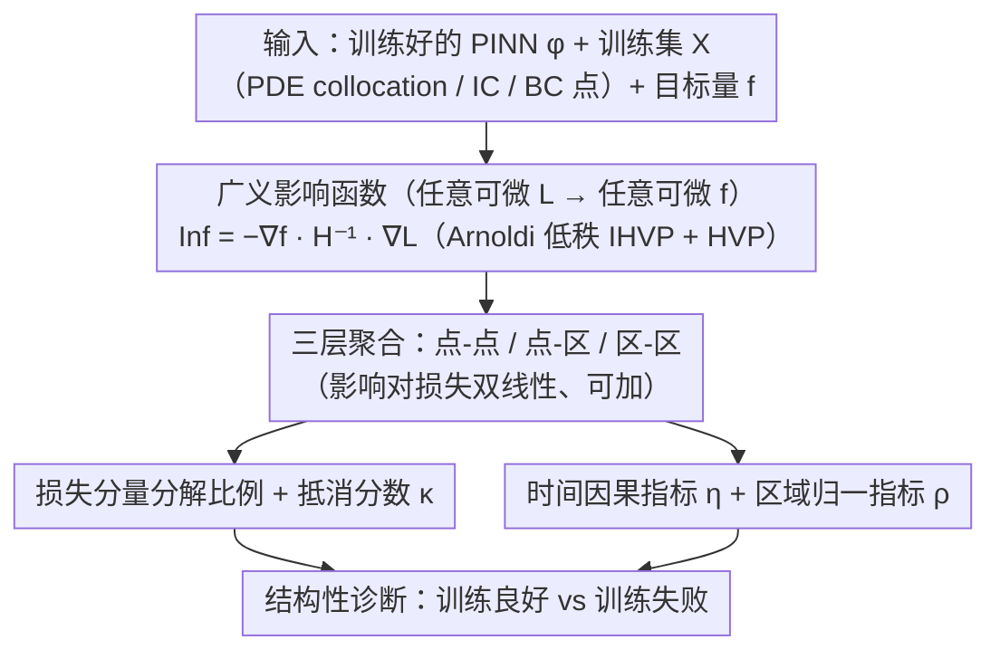

# PINNfluence: Interpreting PINNs Through Influence Functions

**会议**: ICML 2026  
**arXiv**: [2409.08958](https://arxiv.org/abs/2409.08958)  
**代码**: https://github.com/aleks-krasowski/pinnfluence  
**领域**: 科学计算 / 物理信息神经网络 / 可解释性  
**关键词**: PINN 诊断, 影响函数, 训练数据归因, 损失分解, 时间因果指标

## 一句话总结
本文把训练数据归因方法 Influence Functions 推广到物理信息神经网络 (PINN) 上，提出 PINNfluence——通过线性化的留一样本扰动估计，把 PINN 的预测/损失/物理量同时归因到每一个训练点和每一个损失分量上，并基于此构造一套诊断指标（损失分量比例、抵消分数、时间因果指标等），在 5 个时间相关 PDE 上稳定区分"训练良好 vs 训练失败"两类 PINN，给出残差分析看不到的结构性诊断。

## 研究背景与动机
**领域现状**：PINN (Raissi 2019) 把 PDE 残差作为软约束嵌入 NN 训练目标，用统一损失 $\mathcal{L}(\theta)=\lambda_\text{pde}\!\sum L_\text{pde}+\sum_k\lambda_{bc,k}\!\sum L_{bc,k}$ 学一个 $\phi(x;\theta)$ 去逼近 IBVP 的解。它已经在流体、电磁、传染病、光学等领域被广泛用，但训练失败（propagation failure、初值过强、ill-conditioned loss landscape 等）极常见，社区一直靠"现象学诊断"凑合。

**现有痛点**：(1) 几乎所有理解工作都基于**训练动力学**（梯度流分析、NTK、loss 重权重）而非**后验可解释性**——告诉你"这个模型有问题"，但不告诉你"为什么这个预测来自这块训练数据 / 哪个损失项主导了它"。(2) 传统的 verification 思路在 PINN 上失效：训练损失很低**不等于** PDE 解对——PINN 经常收敛到残差很低但解很错的 trivial solution（Daw 2023、Rohrhofer 2023），残差检查发现不了这种"病理结构"。(3) XAI 在 vision/NLP 已经成熟（LRP、IF、SAE），但**PINN 还没有任何专用的 post-hoc 解释方法**。

**核心矛盾**：PINN 的失败往往是**结构性**的（initial-condition 过度依赖、边界传播失败、信息在某个时间断面断开），但 loss 或 residual 等标量量都把这种结构压平了；要想看清结构，必须把"哪个训练点、哪个损失项、哪个时空区域"三个轴都展开。

**本文目标**：(1) 推广经典 Koh & Liang (2017) 影响函数到 PINN 的**复合损失** + **任意可微目标量**；(2) 给出一套基于影响的诊断指标，能在结构层面区分"训练良好"与"训练失败"模型；(3) 在多种 PDE、多种优化器上验证指标的稳定性。

**切入角度**：作者注意到，PINN 损失天然就是多个损失分量加权和，而 IF 在损失参数上是**线性**的——这意味着只要算一次 Hessian-vector product，就能把影响"自动"拆到每个 $L_i$。再加上"训练点 → 区域"和"区域 → 训练点"两种聚合方向，就能构造点-点、点-区、区-区三种粒度的归因图。

**核心 idea**：把 IF 从"损失到损失"的归因推广到"任意可微复合损失 $L$ 到任意可微输出 $f$"的归因 $\operatorname{Inf}_{\theta_0}^{L\to f}(x,z)=-\nabla_\theta f(z;\theta_0)^\top \mathcal{H}_{\theta_0}^{-1}\nabla_\theta L(x;\theta_0)$，并利用**线性性 + 可加性**直接拆解到 PINN 的每个损失分量、每个时空区域。

## 方法详解
PINNfluence 不动 PINN 的训练流程——它是一个 post-hoc 分析框架：给一个**已经训练好的** PINN $\phi(\cdot;\theta_0)$ 和它的训练集 $\mathcal{X}=\mathcal{X}_\text{pde}\cup\bigcup_k\mathcal{X}_{bc,k}$，计算 $\operatorname{Inf}$ 然后聚合成诊断指标。

### 整体框架
- **输入**：训练好的 PINN $\phi$、训练集 $\mathcal{X}$（包含 PDE collocation 点和 IC/BC 点）、感兴趣的目标量 $f$（可以是预测 $\hat{u}$、某个损失分量 $L_i$、物理观测量）、测试点/区域。
- **核心计算**：把对 $\theta$ 的 IHVP $\mathcal{H}_{\theta_0}^{-1}\nabla_\theta L(x;\theta_0)$ 与 $\nabla_\theta f(z;\theta_0)$ 配对——通过 low-rank Arnoldi 近似 + Hessian-vector product 避免显式构造 Hessian。
- **三层分析粒度**：
    - 点-点：$\operatorname{Inf}_{\theta_0}^{L\to f}(x,z)$；
    - 点-区 / 区-点：对 $z$ 或 $x$ 在区域上求和；
    - 区-区：双重求和，配合归一化得到比例指标。
- **输出**：(1) 点对点影响热力图（看哪个训练点最影响哪个测试点）；(2) 损失分量分解比例 $r_{L_i}$ 与抵消分数 $\kappa$；(3) 时空区域指标，如时间因果指标 $\eta$。

整条 pipeline 是一个"算一次影响、分流成多种诊断"的结构：唯一的核心计算是广义影响函数 $\operatorname{Inf}^{L\to f}$，它先在三种粒度上聚合，再分流成"损失分量"与"时空区域"两族诊断指标，最后汇合成"训练良好 vs 训练失败"的结构性判断。

### 关键设计

**1. 从"损失到损失"扩展到"任意可微目标量 + 任意复合损失"**

经典影响函数（Koh & Liang 2017）只能回答"加/删一个训练点对训练损失的影响"，对 PINN 不够用——PINN 的失败要看"哪个损失项、哪个时空区域主导了某个预测"。作者把归因推广成

$$\operatorname{Inf}_{\theta_0}^{L\to f}(x,z)=-\nabla_\theta f(z;\theta_0)^\top\mathcal{H}_{\theta_0}^{-1}\nabla_\theta L(x;\theta_0),$$

其中 $f$ 可以是预测值 $\hat u$、某个分量损失、任意物理观测量，并证明它一阶近似留一重训练效果（Thm 2.2）。一个关键松弛是把 Koh & Liang 的"严格极小点 + 强凸"放宽成"非退化稳定点 + Hessian 可逆"——因为 NN 训练通常落到 saddle point 而非 global minimum，ill-conditioned 的 PINN 更甚，不松弛理论就直接失效。这一步让 IF 能同时拆解 PINN 的复合损失 $\mathcal{L}=\lambda_\text{pde}L_\text{pde}+\sum_k\lambda_{bc,k}L_{bc,k}$ 和解释"$\hat u(z)$ 在哪学错了"，是后面所有诊断指标的代数基础。

**2. 损失分量分解 + 抵消分数 $\kappa$**

IF 在 $L$ 参数上是线性的（推论 2.3）：$\operatorname{Inf}^{\sum_i\alpha_iL_i\to f}=\sum_i\alpha_i\operatorname{Inf}^{L_i\to f}$，所以总影响能"免费"拆到每个损失分量。据此定义相对贡献 $r_{L_i}(x,z)=\frac{|\operatorname{Inf}^{L_i\to f}|}{\sum_j|\operatorname{Inf}^{L_j\to f}|}$ 和抵消分数

$$\kappa(x,z)=1-\frac{\big|\sum_j\operatorname{Inf}^{L_j\to f}\big|}{\sum_j|\operatorname{Inf}^{L_j\to f}|}.$$

PINN 失败的常见模式是"某个边界条件实际被忽略"或"IC 主导一切"，这是残差分析永远看不到的结构信息（损失值正常但权重失衡）。$\kappa$ 的作用是判断分解可不可信：若分量影响互相抵消（$\kappa$ 大），单看 $r_{L_i}$ 容易误导；若几乎不抵消，$r_{L_i}$ 就是清晰的贡献比例。

**3. 时间因果指标 $\eta$ + 区域归一指标 $\rho$**

把训练点时间坐标 $x_t$ 与测试点时间坐标 $z_t$ 的先后关系编码进指标，量化"PINN 是否真从过去看向未来"：

$$\eta_{\theta_0}^{L\to f}(R_\text{tr},R_\text{te})=1-\frac{1}{|R_\text{te}|}\sum_{z\in R_\text{te}}\frac{\sum_{x\in R_\text{tr}:x_t\le z_t}|\operatorname{Inf}^{L\to f}(x,z)|}{\sum_{x\in\mathcal{X}_\text{train}}|\operatorname{Inf}^{L\to f}(x,z)|},$$

$\eta$ 小意味着影响主要来自过去（因果对齐），大意味来自未来，和训练数据均时 $\bar t$（均匀采样下约 0.5）对照可纠偏。直觉上"训练得好的 PINN 应有 PDE 因果性"，但论文实证发现相反：训练良好的模型 $\eta\approx\bar t$（接近均匀），训练失败的反而显示强"过去支配"（IC 影响异常持续）——说明 PINN 是全局学解而非顺序传播。这条反直觉结论残差分析根本看不到，正凸显结构指标的诊断价值；$\rho$ 则对偶地把任意训练子区域影响除以全域影响。

### 损失函数 / 训练策略
**不引入新训练损失**——PINNfluence 只在已经训练好的 PINN 上做后验分析。实现层面的关键工程：用 PyHessian 风格的 HVP + Schioppa 2022 的 Arnoldi 低秩近似估 $\mathcal{H}^{-1}$，避免 $O(p^2)$ 显式 Hessian。论文还用 PBRF（Bae 2022 的 proximal Bregman response function）作 IF 一阶近似的可靠性校验，并验证在 NNCG（Rathore 2024）、SOAP（Vyas 2025）两种 PINN 专用优化器下指标依然稳定。

## 实验关键数据

设置：5 个时间相关 PDE（Heat、Allen-Cahn、Burgers'、Wave、Drift-Diffusion）+ 2 个稳态 PDE（Poisson、Navier-Stokes，附录）。每个问题各做"训练良好" vs "训练失败"两套配置，每套 10 个 seed。

### 主实验

| 问题 | $\bar{t}$ (基线) | Well-trained $\eta$ (pred) | Poorly-trained $\eta$ (pred) | 诊断结论 |
|------|:------:|:------:|:------:|------|
| Heat | 0.46 | 0.33 ± 0.02 | 0.26 ± 0.06 | 失败模型更偏向过去（IC 主导）|
| Allen-Cahn | 0.43 | 0.50 ± 0.02 | 0.32 ± 0.05 | 失败模型 $\eta$ 显著下降 |
| Burgers' | 0.43 | 0.41 ± 0.02 | 0.28 ± 0.02 | 同上 |
| Drift-Diffusion | 0.46 | 0.46 ± 0.04 | 0.21 ± 0.06 | 失败模型 IC 影响压倒一切，与 propagation failure 现象对应 |
| Wave | 0.43 | 0.41 ± 0.03 | **0.11 ± 0.02** | 差距最大，失败模型几乎完全被 IC 锚住 |

→ 全部 5 个问题上**训练失败模型的 $\eta$ 都显著低于训练良好模型**，10 个 seed 标准差小，区分稳定。

### 消融实验

| 维度 | 实验设置 | 关键发现 |
|------|---------|---------|
| 损失分量分解 $\bar{r}_{L_\text{ic}}$ | 5 个 PDE × 50 个时间 bin | Well-trained: IC 占比从 $\approx 0.25$ 起步、随时间衰减；Poorly-trained: IC 占比始终偏高，且 $t\approx 0.4$ 后 plateau，与 trivial output 同步出现 |
| 训练点数量扫描 | Drift-Diffusion 等 5 题 | PINNfluence 指标随训练点增加平滑过渡（从"失败模式"指标 → "成功模式"指标），且过渡曲线**形状与问题相关**——揭示每个 PDE 的数据需求结构 |
| 优化器无关性 | 同问题分别用 Adam / NNCG (Rathore 2024) / SOAP (Vyas 2025) | 三种优化器下 $\eta$、$\bar{r}_{L_i}$ 的"好坏区分"模式一致——指标对优化器选择鲁棒 |
| Hessian 近似可靠性 | 低秩 Arnoldi vs PBRF (Bae 2022) vs gradient-only (Charpiat 2019) | Arnoldi 在 PINN ill-conditioned Hessian 下仍能忠实恢复投影逆 Hessian，并与 PBRF 给出的"局部微调"行为对齐；显著优于纯梯度基线 |
| 抵消分数 $\kappa$ | 各 PDE 的损失项分解 | 在大多数测试点 $\kappa$ 偏小，说明 $r_{L_i}$ 是稳健的；高 $\kappa$ 点对应"竞争性约束"区，提示损失权重设计问题 |

### 关键发现
- **结构信号 >> 残差信号**：失败模型的 PDE 残差大、但残差告诉不了你"为什么大"；PINNfluence 直接定位"是因为 IC 影响过度持续"或"边界条件被实际忽略"。
- **反直觉的因果结论**：训练良好的 PINN **不**遵循物理因果（$\eta$ 接近均匀基线），失败的 PINN 才"因果对齐"。原因：PINN 是全局优化解，不是时间步进——强因果对齐恰恰是初值过拟合的副产物。
- **跨任务一致性**：5 个性质截然不同的 PDE 上 IC 影响衰减模式一致区分好坏，使该指标具有**通用诊断**潜力。
- **优化器/Hessian 噪声鲁棒**：传统认知是 IF 在深网络上脆弱（Basu 2020），但 PINN 上经低秩 + PBRF 校验后仍可靠，且对优化器选择稳健。

## 亮点与洞察
- **把 IF 从单输入单输出推广为"任意可微 $L$ → 任意可微 $f$"是最关键的一步**：让"训练点 → 任意物理量"的归因变成一行 IHVP，瞬间把 IF 从分类器调试工具变成科学计算诊断工具。这个推广形式上微小、实用上巨大，几乎所有有复合目标的 sci-ML 模型都能套（神经算子、Operator Learning、PI-DeepONet）。
- **$\kappa$ 抵消分数是"分解可信度自检"**：分量影响相加可能因符号抵消而误导，这个细节作者直接给了量化分数。可迁移到 LRP/Shap 等任意"线性分解可解释性"方法。
- **结构性诊断 ≠ 因果**：作者反复强调影响是 "sensitivity"，不是"physical causality"——这种谨慎对科学应用很重要，避免了"可解释性 → 因果"的常见过度解读。
- **跨优化器稳定 + 低秩 Arnoldi 实现**：解决了 IF "Hessian 病态时不可靠"的老问题，对其他 ill-conditioned 问题（diffusion ODE 训练、神经 ODE 训练）的可解释性研究有直接借鉴价值。
- **反直觉的"训练好的 PINN 不因果"洞察**：让人重新思考 PINN 的本质——它是 PDE 解的全局变分逼近，不是 ODE 时间步进器，因此期待它表现出物理因果的"sensitivity 模式"反而是错的。这对 sequential PINN / causal PINN 等近期工作是一个 sanity check。

## 局限与展望
- **依然是一阶近似**：定理 2.2 是 $O(1/N^2)$ 余项，大扰动或极端 ill-conditioned 下偏差未控制；论文承认这是 IF 的内禀限制。
- **PINN Hessian 严重病态**：低秩 Arnoldi 能近似投影逆，但近奇异方向上仍可能放大误差，复杂 PDE 上可靠性需要逐题验证。
- **计算开销线性 in $|\mathcal{X}_\text{train}|\times|R_\text{te}|$**：虽然通常比 PINN 训练本身快，但大规模 collocation 集（如 3D 时变 PDE）依然吃力。
- **绝对值聚合丢符号**：以 $|\operatorname{Inf}|$ 为主防止符号噪声，但代价是丢失"促进 vs 抑制"的方向信息，$\kappa$ 只能部分补偿。
- **指标设计需领域知识**：$\eta$、$\rho$、区域指标都依赖具体 PDE 的时空结构定义，"通用诊断仪表盘"还需更多原型；作者给了 practitioner's guide 缓解这个问题。
- **改进方向**：(1) 把高影响训练点直接反馈给 collocation 重采样，做"诊断驱动的训练"；(2) 用 $\bar{r}_{L_i}$ 自动调 $\lambda_{bc,k}$，让损失权重在影响均衡处自适应；(3) 推广到非时变 PDE、稳态 PDE、逆问题 PINN；(4) 与 sparse autoencoder / mechanistic interpretability 工具结合。

## 相关工作与启发
- **vs Koh & Liang (2017)**：原版 IF 只做"loss → loss"归因，假设严格极小 + 强凸，且未考虑复合损失；PINNfluence 放宽到非退化稳定点、推广到任意 $f$、显式处理复合损失分量。
- **vs PINN 训练动力学分析 (Wang 2022, Rathore 2024, Ryck 2024)**：这些工作研究"训练过程为什么失败"，PINNfluence 研究"训练完的模型在数据层面如何失败"，是后验视角，互补。
- **vs PINN 失败模式专用方法 (Krishnapriyan 2021, Daw 2023)**：那些工作识别 propagation failure 等具体 failure mode；PINNfluence 给出一个**通用、可量化、跨任务**的 failure 指标家族。
- **vs 神经算子可解释性 (MacMillan 2025, Fear 2025)**：他们用 SAE + linear probing 分析 neural operator 的内部表示；PINNfluence 走的是训练数据归因路线，关注"哪个 data + 哪个约束"而非"哪个 latent feature"，是不同切面，可组合。
- **vs 可解释架构 (KAN, GINN-KANs)**：他们做"架构层面可解释"，PINNfluence 做"任意已训练 PINN 的 post-hoc 可解释"，两条路线互不替代。

## 评分
- 新颖性: ⭐⭐⭐⭐⭐ PINN 领域首个训练数据归因框架，IF 形式推广也具普适价值
- 实验充分度: ⭐⭐⭐⭐ 5 个时变 PDE + 稳态 PDE + 多优化器 + 多 seed，已经很扎实；唯独缺大规模 3D 案例
- 写作质量: ⭐⭐⭐⭐⭐ 定义—定理—指标—实验—局限层层递进，写得很 mature
- 价值: ⭐⭐⭐⭐⭐ 直接补上 sci-ML 可解释性的空白，且诊断驱动训练的下游可能性巨大

<!-- RELATED:START -->

## 相关论文

- [\[ICLR 2026\] Supervised Metric Regularization Through Alternating Optimization for Multi-Regime PINNs](../../ICLR2026/physics/supervised_metric_regularization_through_alternating_optimization_for_multi-regi.md)
- [\[ICML 2026\] Generative Neural Operators Through Diffusion Last Layer](generative_neural_operators_through_diffusion_last_layer.md)
- [\[NeurIPS 2025\] Neural Green's Functions](../../NeurIPS2025/physics/neural_greens_functions.md)
- [\[NeurIPS 2025\] Scaling Laws and Pathologies of Single-Layer PINNs: Network Width and PDE Nonlinearity](../../NeurIPS2025/physics/scaling_laws_and_pathologies_of_single-layer_pinns_network_width_and_pde_nonline.md)
- [\[ICLR 2026\] HyperKKL: Enabling Non-Autonomous State Estimation through Dynamic Weight Conditioning](../../ICLR2026/physics/hyperkkl_enabling_non-autonomous_state_estimation_through_dynamic_weight_conditi.md)

<!-- RELATED:END -->
