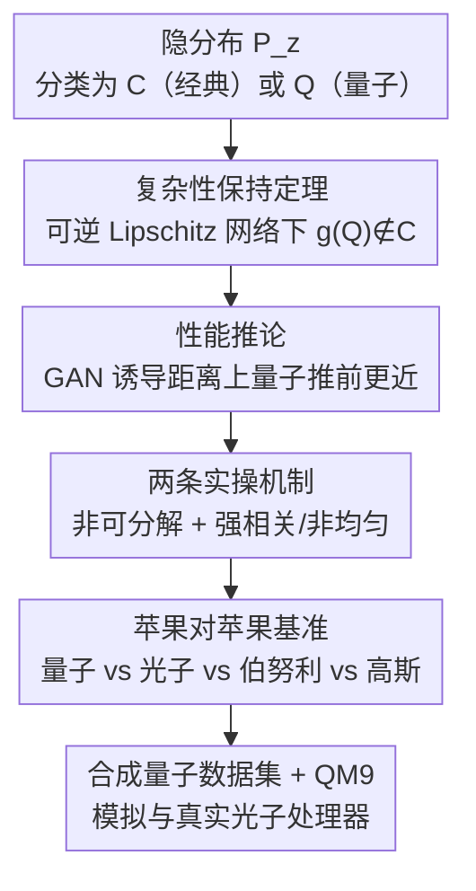

# Quantum latent distributions in deep generative models

**会议**: ICML2026  
**arXiv**: [2508.19857](https://arxiv.org/abs/2508.19857)  
**代码**: 无（基于改进版 MolGAN，未公开）  
**领域**: 量子机器学习 / 深度生成模型 / 光子量子计算  
**关键词**: 量子隐空间分布, 玻色采样, 生成对抗网络, 计算复杂性, QM9 分子生成

## 一句话总结
研究「用量子处理器产生的隐空间分布」何时、为何能提升深度生成模型：理论上证明在一定网络假设下，量子隐空间分布能让生成器产出经典隐分布无法高效产生的数据分布；实验上用真实/模拟光子量子处理器在合成量子数据集与 QM9 分子数据集上做苹果对苹果的对照，发现源自量子干涉的统计量确实带来更好的生成性能。

## 研究背景与动机

**领域现状**：GAN、隐扩散、流匹配等成功的深度生成模型，本质都是把一个低维**隐空间分布（latent distribution）** $P_z$ 映射到高维数据分布 $P_x$。隐分布的结构对性能影响巨大——已有工作表明，让生成器隐分布的结构去匹配数据结构（如 GAN、流匹配）能显著提升表现。

**现有痛点**：因为算法设计被限制在「CPU/GPU 能高效实现的函数」范围内，实践中几乎都用**简单隐分布**（如经神经网络变换的多元高斯）。但「简单隐分布 + 有限容量网络」对建模复杂数据是个瓶颈：很多量子过程无法被经典方法高效模拟，用经典生成模型 + 简单隐分布去学这类数据分布天然吃力。

**核心矛盾**：隐分布的表达力受限于「经典可高效采样」这个枷锁；而有些目标数据分布恰恰需要经典难以高效产生的相关结构（多模态、强相关、非可分解）。简单高斯这类无相关结构的隐分布，难以捕捉复杂数据里的相关特征——文中 figure 1 显示，把高斯映射到 2D 高斯混合最多要 7 层网络才成功，主要失败模式是在不同模态之间错误插值。

**切入角度**：量子计算机（尤其光子玻色采样系统）能高效产生**经典难以模拟的高度相关分布**。已有零散经验工作（多在 GAN 上）观察到量子隐分布能提升性能，但大多停在「可行性演示」，缺两样东西：① 量子分布为何/何时能帮上忙的**理论理解**；② 与多种经典分布做控制变量的**苹果对苹果基准**（很多旧工作拿「训练过的量子分布」对比「未训练的经典基线」，结论不可推广）。

**核心 idea**：用计算复杂性类把隐分布分成经典可高效采样的 $\mathcal{C}$ 与量子可采样但经典不可的 $\mathcal{Q}$，研究「隐分布的复杂性类」如何决定「生成分布的复杂性类」，从而刻画量子隐分布带来优势的充分条件；再用「可关掉量子干涉的光子分布」作为对照，把多光子量子干涉这一单一因素隔离出来做实验。

## 方法详解

### 整体框架

工作由「理论刻画」和「受控基准实验」两半组成，靠一个核心度量串起来。理论侧：定义经典采样类 $\mathcal{C}$（多项式 $\mathrm{Poly}(n,1/\epsilon)$ 时间经典可近似采样）和量子类 $\mathcal{Q}$（量子可、经典不可），借助 [26] 引入的 GAN 诱导距离

$$D^G(P_z,P_x)=\inf_{g\in G}D(P_{g(z)},P_x),$$

其中 $G$ 是有界复杂度（宽度/深度/Lipschitz 常数受限）的网络族、$P_{g(z)}$ 是把隐分布经 $g$ 推前（pushforward）得到的分布。该距离可视为判别器损失：$P_z$ 越能在 $G$ 内逼近 $P_x$，距离越小。实验侧：固定模型只变隐分布，在合成量子数据集与 QM9 上对比四种隐分布（量子 / 光子 / 伯努利 / 高斯），用「可关掉量子干涉的光子分布」隔离多光子干涉的贡献。

整条逻辑链可概括为：

### 关键设计

**1. 复杂性保持定理：给出量子隐分布经网络变换后仍非经典的充分条件**

这条针对「量子分布过一遍网络后会不会退化成经典」的核心疑问。先给一个简单观察（Remark 1）：若 $P_z\in\mathcal{C}$ 且 $g$ 是 Lipschitz 连续的，则推前分布 $P_{g(z)}\in\mathcal{C}$——经典进、经典出。但反方向不一定成立：量子分布过网络后可能变经典（极端如网络输出常数）。**Theorem 1** 给出充分条件：若 $g\in G$ 的逆 $g^{-1}$ 存在、经典可高效实现且 Lipschitz 连续，且 $P_z\in\mathcal{Q}$，则推前分布 $P_{g(z)}\notin\mathcal{C}$。

证明直觉很干净：若 $P_{g(z)}$ 是经典可高效采样的，那么对它的样本施加经典可高效的 $g^{-1}$ 就能高效采到 $P_z$，于是 $P_z\in\mathcal{C}$，与 $P_z\in\mathcal{Q}$ 矛盾。作者还能**显式构造**满足假设的深网：用线性层逐层增宽、配可逆 LeakyReLU 激活的多层感知机，其输入可通过解一组线性方程从输出高效重构——QM9 实验正是采用这一架构。即便不严格满足条件，该定理也给出一种合理推断：很多现代网络（多 Lipschitz 连续，且「生成器反演」在实践中常可解）都能把非经典分布映到非经典分布。

**2. GAN 诱导距离上的性能推论：量子推前分布可被经典隐分布无法逼近**

针对「复杂性不退化到底对性能意味着什么」。**Corollary 1**：在满足 Theorem 1 的 $g$ 与量子隐分布 $P_{z_\mathcal{Q}}\in\mathcal{Q}$ 下，用 Wasserstein 距离时一方面 $D^G(P_{z_\mathcal{Q}},P_{g(z_\mathcal{Q})})=0$（定义即得），另一方面对任意经典隐分布 $P_{z_\mathcal{C}}\in\mathcal{C}$ 存在 $\epsilon>0$ 使 $D^G(P_{z_\mathcal{C}},P_{g(z_\mathcal{Q})})>\epsilon$。即量子隐分布在某些条件下能达到的那类推前分布，**任何经典隐分布都无法逼近**。

据此按数据分布分情形（figure 2）：若目标分布落在「经典隐分布（仍属 $\mathcal{C}$）的推前分布」里（D1），量子无理论优势；但若目标分布**不在**经典推前可达范围内——由于生成器容量有限、隐空间维度小于数据空间，这其实是常见情形——则某些量子推前分布在 GAN 诱导距离下会比任何经典推前分布更近，**即使目标数据本身是经典分布，量子隐分布也可能带来优势**。

**3. 两条实操机制：把抽象的复杂性分离落到「为何真数据上变好」**

理论条件偏抽象，作者补两条可操作的直觉机制，把量子隐分布理解为「统计性质与数据匹配的结构化先验」而非严格的计算分离。**其一，非可分解性（non-factorizability）**：多粒子纠缠使量子分布无法分解成相互独立的变差因子，从而阻止模型学到「可分解表示」。可分解表示虽更可解释，但在多模态数据上常表现差；非可分解的行列式点过程已被用于改善 GAN/流匹配的多样性。量子分布表现出强形式的非可分解——不同于经典可高效计算概率、仍可经累积变换/拒绝采样转成可分解的分布，量子分布一般**不存在**这种高效变换。**其二，高度非均匀 + 多阶强相关**：量子分布天然高度非均匀、在多个阶上强相关，对具有类似性质的数据集（尤其源自量子力学的物理过程）提供有益的归纳偏置。但作者诚实指出：非均匀和强相关并非量子独有，所以才设计「关掉量子干涉的光子分布」作对照来检验「源自量子力学的统计量」是否真有用。

**4. 四隐分布的苹果对苹果对照：把多光子量子干涉隔离成唯一变量**

针对旧工作「拿训练量子分布比未训练经典基线」不可推广的硬伤。所有实验**只变隐分布、其余全同**。四种隐分布产出长度 $d_z=L$ 的样本：**量子**——不可区分光子送入 $L$ 维干涉仪，受多光子量子干涉塑形、一般不可分解为单光子独立贡献；**光子**——可区分光子送入同样干涉仪，每个光子独立路由、自干涉仍在但无多光子干涉；**伯努利**——离散均匀比特串 $z\in\{0,1\}^L$；**高斯**——常用连续 $z\sim\mathcal{N}(0,I)$。量子与光子样本都是 $L$ 个输出通道上的光子计数向量（每样本计数和为输入光子数 $N$），二者**唯一差别就是多光子量子干涉**——这个对照把量子干涉的具体贡献单独拎出来评估。为保证差异来自分布的一般性质而非特定电路实现，干涉电路每个种子重新随机采样；电路本可训练但本文不训练，以免对静态高斯/伯努利基线造成不公平优势。

### 损失函数 / 训练策略
基于 MolGAN [16] 改进的 GAN：生成器是前馈网络（各层非递减 + 可逆 LeakyReLU，按 Theorem 1 的可逆性要求设计），判别器是关系图卷积网络（relational GCN）。合成实验用「输出与最近整数的平均 L1 距离」衡量（数据离散，越小越好）；QM9 用 Frechet 化学距离（FCD，越低越好）、10k 次生成中有效且唯一的分子数（# Valid）、其中不在训练集的新分子数（# Novel）。每个实验 12 或 20 个随机种子。

## 实验关键数据

### 主实验

**合成数据集（L1 距离，越小越好，12 次运行）**：量子数据集由 8 个不可区分光子在 16 通道随机光路干涉模拟产生；伯努利数据集由 16 维伯努利分布产生。隐空间与数据分布的光路独立采样，避免平凡恒等映射。

| 数据集 | 高斯 | 伯努利 | 光子 | 量子 |
|--------|------|--------|------|------|
| 量子数据集 | 0.061±0.001 | 0.065±0.001 | 0.041±0.002 | **0.036±0.001** |
| 伯努利数据集 | **0.012±0.002** | 0.020±0.013 | 0.017±0.002 | 0.015±0.002 |

在更难的量子数据集上，量子隐分布最优、且优于可区分光子（说明量子干涉统计是有用资源）；在更易的经典伯努利数据集上各隐分布差距小、高斯最优——印证「数据源自量子过程时量子隐分布才显著占优」。

**QM9 数据集（20 个种子，Haar 随机光路，输入光子数 = 通道数一半）**：

| 隐分布 | $d_z$ | FCD ↓ | # Valid & unique ↑ | # Novel ↑ |
|--------|------|-------|--------------------|-----------|
| 量子 | 16 | **1.160±0.06** | **2522±65** | **1331±37** |
| 光子 | 16 | 1.333±0.07 | 1954±103 | 1067±54 |
| 高斯 | 16 | 1.529±0.08 | 1814±115 | 1017±64 |
| 伯努利 | 16 | 1.822±0.09 | 1244±102 | 702±56 |
| 量子 | 32 | **1.536±0.08** | **1791±106** | **951±37** |
| 高斯 | 32 | 1.823±0.07 | 1320±53 | 768±35 |
| 量子 | 48 | 1.696±0.08 | **1528±65** | **856±40** |
| 光子 | 48 | 1.713±0.06 | 1307±77 | 746±43 |

### 消融实验

| 配置 | 关键指标 | 说明 |
|------|---------|------|
| 量子 vs 光子（同干涉仪） | 量子全面更优 | 隔离多光子量子干涉这一唯一变量，证明其确实有益 |
| 隐空间维度 16 vs 32 vs 48 | 16 维量子优势最大 | $d_z$ 越大整体性能下降、量子优势收窄，但 48 维量子仍在有效唯一分子数上领先经典 |
| 光路类型：Haar vs 延迟线 1-1 / 1-3-9 | 量子均优于对应光子 | 优势不限于 Haar 随机光路，是光子干涉统计的一般性质 |

### 关键发现
- **量子干涉是真资源**：量子始终优于「可区分光子（关掉多光子干涉）」，说明性能增益来自量子力学统计量本身，而非仅「非均匀/强相关」这类非独占特征。
- **小隐空间优势最大**：$d_z=16$ 时量子在所有指标上全面碾压；随 $d_z$ 增大优势收窄、整体性能下降，提示量子隐分布在「容量受限」场景最有用——与「数据空间维度大于隐空间」时经典推前不可达的理论情形吻合。
- **数据需与量子统计匹配才占优**：合成实验里量子数据集上量子隐分布大胜、经典伯努利数据集上则无明显优势——优势是数据/模型相关的，不是普适加速。
- **优势跨光路类型稳健**：Haar 随机与延迟线（1-1、1-3-9）光路下量子都优于光子，说明不是特定电路实现的偶然。

## 亮点与洞察
- **「关掉量子干涉的光子分布」是点睛之笔**：用可区分光子做对照，把「多光子量子干涉」从「非均匀 + 强相关」等可被经典分布共享的属性里干净剥离出来——这是过去经验工作普遍缺失的控制变量，让「量子到底有没有用」第一次可被严谨回答。
- **复杂性类语言串起理论与实验**：用 $\mathcal{C}$/$\mathcal{Q}$ 和 GAN 诱导距离把「隐分布复杂性 → 推前分布复杂性 → 性能」连成一条可证明的链，并显式构造满足定理假设的可逆网络（增宽线性层 + 可逆 LeakyReLU），让理论不悬空。
- **非可分解性的论证可迁移**：把量子分布的优势归到「强形式非可分解，无高效变换转成可分解」，与行列式点过程改善多样性的经验呼应——提示「非可分解先验」是一类值得迁移到其他生成任务的归纳偏置。
- **真机 + 模拟双轨基准**：在模拟与真实光子处理器上都验证，且光子系统只受光子损耗、不受退相干（退相干会把输出推向经典均匀分布、抹平差异），让光子玻色采样成为观察量子优势的合适平台。

## 局限与展望
- **优势数据/模型相关，非普适**：作者明确量子隐分布的性能优势依赖数据集和模型，不是对所有任务都成立——QM9 属于哪个复杂性类也无严格论证，只是「源自量子力学」的启发式选择。
- **优势随隐空间增大收窄**：$d_z=48$ 时量子优势已不明显，可扩展性存疑；大尺寸隐空间下整体性能也下降。
- **只在 GAN 上验证**：作者承认 GAN 已非多数数据的 SOTA，选它是因为隐→数据映射直接、便于苹果对苹果，但结论能否迁移到扩散/流匹配未验证。
- **未训练量子电路**：为公平对照而不训练干涉电路，但训练后的量子电路是否带来更大（或不公平）优势是开放问题；量子电路训练本身常 scaling 差。
- **理论是充分条件 + 直觉**：Theorem 1 给充分非必要条件，实操机制（非可分解、强相关）是「直觉/假设」而非严格证明能解释真数据上的全部增益。

## 相关工作与启发
- **vs [26]（GAN 诱导距离的提出者）**：他们引入隐空间与数据空间间的距离来量化隐分布对生成任务的适配度；本文把该形式主义扩展到「隐分布的计算复杂性如何影响性能」，并用它推出量子隐分布的优势条件。
- **vs 早期量子 GAN 经验工作 [36,28,62,52,64,27]**：多数停在可行性演示、且常拿「训练量子分布」对比「未训练经典基线」，结论不可推广；本文既补理论又做严格的苹果对苹果对照（含关掉干涉的光子基线）。
- **vs 经典隐分布研究 [29] 等**：经典工作论证「无相关隐分布不适合捕捉相关特征」；本文进一步用复杂性类刻画，并以量子分布的强非可分解性给出更强的不可逼近性结论。
- **vs 玻色采样 / 随机电路采样 [1,7,25,44]**：本文不追求量子采样优越性本身，而是把光子玻色采样产出的经典难解分布当作生成模型的隐空间资源来用，是量子采样能力的下游应用。

## 评分
- 新颖性: ⭐⭐⭐⭐⭐ 首次为量子隐分布给出复杂性类层面的理论刻画 + 用「关干涉光子」隔离量子干涉贡献
- 实验充分度: ⭐⭐⭐⭐ 合成 + QM9、模拟 + 真机、多尺寸多光路、20 种子，但只限 GAN、规模偏小
- 写作质量: ⭐⭐⭐⭐⭐ 理论—直觉—实验三段衔接清晰，控制变量设计交代得很诚实
- 价值: ⭐⭐⭐⭐ 把「量子隐分布有没有用」从经验观察推进到可论证，量子 ML 与生成模型交叉的扎实一步

<!-- RELATED:START -->

## 相关论文

- [\[ICML 2026\] Quiver: Quantum-Informed Views for Enhanced Representations in Large ML Models](quiver_quantum-informed_views_for_enhanced_representations_in_large_ml_models.md)
- [\[NeurIPS 2025\] Physics-Constrained Flow Matching: Sampling Generative Models with Hard Constraints](../../NeurIPS2025/physics/physics-constrained_flow_matching_sampling_generative_models_with_hard_constrain.md)
- [\[ICML 2026\] Generative Neural Operators Through Diffusion Last Layer](generative_neural_operators_through_diffusion_last_layer.md)
- [\[ICML 2025\] Rethink the Role of Deep Learning towards Large-scale Quantum Systems](../../ICML2025/physics/rethink_the_role_of_deep_learning_towards_large-scale_quantum_systems.md)
- [\[ICML 2026\] Spectrally Regularized Latent Flow Matching for Turbulence Generation](spectrally_regularized_latent_flow_matching_for_turbulence_generation.md)

<!-- RELATED:END -->
