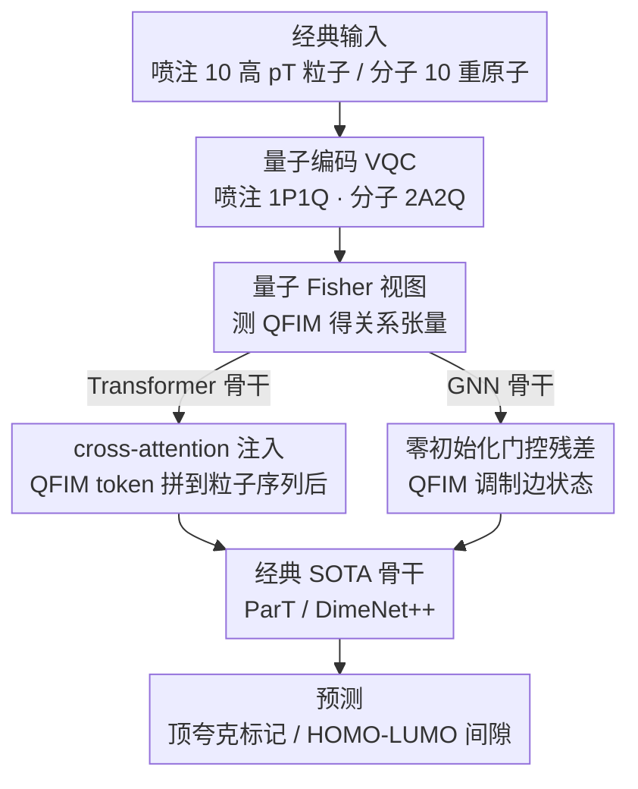

# Quiver: Quantum-Informed Views for Enhanced Representations in Large ML Models

**会议**: ICML 2026  
**arXiv**: [2606.02785](https://arxiv.org/abs/2606.02785)  
**代码**: 无 (论文未公布代码仓库)  
**领域**: 物理 / 量子-经典混合学习 / 高能物理 + 分子化学  
**关键词**: 变分量子电路, 量子 Fisher 信息矩阵, 多模态表征, Particle Transformer, DimeNet++  

## 一句话总结
Quiver 把分类输入额外送进一个变分量子电路 (VQC)，提取其量子 Fisher 信息矩阵 (QFIM) 作为「量子几何视图」，再用 cross-attention（对 Transformer）或残差门控（对 GNN）注入到经典骨干里，在 JetClass 顶夸克标记与 QM9 HOMO-LUMO 间隙回归两个完全不同的物理任务上都拿到了稳定提升。

## 研究背景与动机

**领域现状**：高能物理的喷注鉴别（jet tagging）和分子化学的性质预测（QM9）都是高维结构化数据问题，主流方法分别是 Particle Transformer (~2.14M 参数) 和 DimeNet++ 等几何/等变 GNN，已经在各自基准上接近 SOTA。

**现有痛点**：这些模型完全在经典特征空间里训练，对「需要更高阶或非局部关联才能区分」的样本（如 color-singlet $W$ 喷注 vs color-connected QCD 喷注、QM9 中依赖多体相关的电子结构属性）只能靠模型容量隐式学习这些关联，而不能把它们直接「暴露」给模型。

**核心矛盾**：经典特征构造（动力学量、结构描述子）天然不擅长表达多体相干相关；单纯堆模型容量或数据量并不能高效弥补这块结构性盲区。需要一种从根本上不同的几何视角，与经典特征互补而不是冗余。

**本文目标**：拆解为两个子问题 —— (1) 如何用量子电路把「几何相关结构」从经典输入里挤出来，并形成一个紧凑、与体系无关的张量；(2) 如何把这个张量以最小参数代价、最物理对齐的方式融进现有 SOTA 经典骨干。

**切入角度**：变分量子电路 $|\psi(\boldsymbol{\Theta})\rangle=U(\boldsymbol{\Theta})|0\rangle^{\otimes N}$ 把输入编码进 Hilbert 空间后，参数流形上自然带有 Fubini-Study 度量，而它（差一个 4 倍因子）等于量子 Fisher 信息矩阵 (QFIM)。QFIM 的对角项是「单参数敏感度」，非对角项是「相干耦合」—— 这恰恰是「多体相关」的几何编码，且可在经典模拟器（PennyLane）上算出来。

**核心 idea**：用「量子 Fisher 视图」作为与经典视图互补的第二模态，融合后让经典骨干能直接消费量子几何信息，而不必从零隐式学习。

## 方法详解

### 整体框架
Quiver = 经典输入 → 任务专用 VQC → 测量 QFIM → 模态融合层 → 经典 SOTA 骨干。两个应用各自配套一个量子编码：喷注用 1P1Q（每个粒子一个 qubit），分子用全新的 2A2Q（每对成键原子一个二量子比特块）。融合方式按骨干类型差异化设计：Transformer 用 cross-attention 通过序列拼接实现，GNN 用 QFIM 调制的残差门控边状态。整个 VQC 在 PennyLane 上经典模拟，QFIM 一次性预计算缓存。

### 关键设计

**1. 量子 Fisher 视图：用 VQC 抽出经典特征难表达的多体相干结构**

经典特征（动力学量、结构描述子）天生不擅长表达多体相干相关，堆容量也补不上这块盲区。Quiver 把经典输入 $x$ 映成参数化量子态 $|\psi(\boldsymbol{\Theta}(x),\boldsymbol{\theta})\rangle$，在固定参考点 $\boldsymbol{\theta}_0$ 处算量子 Fisher 信息矩阵

$$F_{ij}(\boldsymbol{\theta};x)=4\,\mathrm{Re}\big[\langle\partial_i\psi|\partial_j\psi\rangle-\langle\partial_i\psi|\psi\rangle\langle\psi|\partial_j\psi\rangle\big],$$

得到一个由输入决定的紧凑关系张量。它的物理意义很直接：对角 $F_{ii}$ 是电路对 $\theta_i$ 的局部敏感度（按 qubit 的动态重要度），非对角 $F_{ij}$ 非零当且仅当两方向作用在重叠 qubit 子系统上，因此直接编码了输入维度间的相干耦合。1P1Q 编码下 10 粒子 × 每 qubit 3 旋转 → 30×30 实对称阵，存为 90 通道 × 10 粒子；2A2Q 下 10 qubit × 2 层 × 3 旋转 → 60×60 阵，按 10×10 个 6×6 子块组织、子块 $Q_{ij}$ 对应原子对耦合。QFIM 是参数流形的内在几何、不依赖测量基，非对角元天然标记"联合行为"，所以这个视图和经典视图本质互补而非冗余。

**2. 2A2Q 分子编码：把化学键信息融进纠缠操作、保持平移旋转不变**

单原子单 qubit 直接编 Cartesian 坐标会引入参考系依赖，对 QM9 这种几何任务很致命。2A2Q 改成成对编码：每个重原子分配一个 qubit，先做单原子 embedding $R_Y(w_{\text{atom}}^j)|0\rangle$；对每对成键且 $d_{ij}<d_{\text{CUTOFF}}=1.7\,\text{Å}$ 的原子，用三个角度 $\omega_1^{(ij)}=e_{d_1}(1-d_{ij}/d_{\text{CUTOFF}})\cos\theta_{ij}$、$\omega_2^{(ij)}=e_{\text{bond}}^{(ij)}\pi$、$\omega_3^{(ij)}=e_{d_2}(1-d_{ij}/d_{\text{CUTOFF}})\cos\phi_{ij}$ 联合编码并纠缠 $\mathcal{U}_{ij}=(I_{YY}(\omega_3)I_{ZZ}(\omega_2)I_{XX}(\omega_1))(R_Y\otimes R_Y)|00\rangle$，最后每 qubit 接 $R_Z R_Y R_Z$。把"编码 + 纠缠"合并成成对操作后，配对距离 $d_{ij}$ 天然不变、角度只剩残余依赖，从而避开坐标系问题；而 $e_{\text{bond}}$ 让纠缠强度学习化学键类型，使 QFIM 子块直接反映键合相关。

**3. 架构差异化注入：Transformer 走 cross-attention、GNN 走零初始化门控残差**

QFIM 模态要以最小参数代价融进不同骨干，且必须能撇清"提升是否只是参数变多"。对 Particle Transformer，把每个粒子槽的 90 个 QFIM 通道用 ParT 风格 MLP 嵌成 128 维 token $q_i=\mathrm{MLP}_{\text{QFIM}}(\mathbf{Q}[:,i])$，追加到经典粒子 token 序列后组成长度 $2P$ 输入（Lorentz 配对偏置只对原 $P$ 个粒子算、其余零填充）——Transformer 天然有 cross-attention，序列拼接是最自然的多模态融合。对 DimeNet++ 这种没有内建跨模态机制的 GNN，改用残差门控 $\tilde{x}_{ij}^{(l)}=(1+\alpha\cdot\Theta(Q_{ij}))x_{ij}^{(l)}$ 调制边状态，其中 $\alpha$ 是初始为零的全局可学标量、$\Theta(Q_{ij})\in[-1,1]$ 由小 CNN 处理 6×6 QFIM 子块再过 $\tanh$ 得到。零初始化的门是关键巧思：它严格保证 $\alpha=0$ 时与 baseline 完全等价，任何提升只能来自 QFIM 信息本身，从而堵死"靠参数容量提升"的解释。

### 损失函数 / 训练策略
JetClass 二分类用标准交叉熵；QM9 用 Huber 损失（对异常值鲁棒，结合 $\ell_2$ 和 $\ell_1$）。VQC 在 PennyLane 经典模拟，QFIM 用其标准实现计算。两任务都跑多种子（JetClass 5 种子、QM9 10 种子）。

## 实验关键数据

### 主实验 1：JetClass 顶夸克 vs QCD 二分类

| 特征集 | 模型 | 参数量 | AUC ↑ | 1/ε_B @ ε_S=0.5 ↑ |
|------|------|------|------|------|
| Kin | ParT | 5M | 0.97832 ± 0.00004 | 176 ± 1 |
| Kin | **Quiver** | 5M | **0.98070 ± 0.00003** | **240 ± 1** |
| Full | ParT | 5M | 0.99235 ± 0.00003 | 1306 ± 8 |
| Full | **Quiver** | 5M | **0.99244 ± 0.00003** | **1362 ± 28** |
| Full | ParT | 0.1M | 0.98875 ± 0.00008 | 570 ± 13 |
| Full | **Quiver** | 0.1M | **0.98893 ± 0.00005** | **590 ± 7** |

仅动力学特征下，5M 参数的 Quiver 把 QCD 拒绝率从 176 提到 240（+36%）；全特征 + 5M 参数下从 1306 提到 1362（+4%）。参数代价仅 +7%（2.14M → 2.29M）。

### 主实验 2：QM9 HOMO-LUMO 间隙回归

| 模型 | 参数量 | 测试 MAE (meV) ↓ | 配对 Δ MAE (meV) | 相对降幅 |
|------|------|------|------|------|
| DimeNet++ | 1.886M | 72.42 ± 1.52 | — | — |
| **𝒬DimeNet++ (Quiver)** | 1.891M | **67.92 ± 1.98** | **4.50 ± 2.46** | **6.21%** |

参数仅增 0.27%，10 种子配对 $t$-test 得 $t_9=5.78$，$p<10^{-3}$，统计上显著。

### 关键发现
- 两个任务的提升都「持久」：JetClass 训练曲线显示 𝒬DimeNet++ 与 DimeNet++ 的 Δ MAE 在所有训练 epoch 上都为正，开局就拉开差距并持续到收敛。
- 提升随经典模型扩容而不消失：JetClass 在 0.1M / 0.5M / 5M 三个量级、Kin / Full 两种特征下 Quiver 都更好，说明 QFIM 不是「补容量」，而是「补信息」。
- 极小参数代价（+0.27% 到 +7%）就能拿到几个百分点的相对提升，这是「量子优势 ≠ 量子加速」的另一种实证 —— 即使用经典模拟 VQC，量子几何特征本身就有信息价值。
- 两套架构（Transformer cross-attention + GNN 门控残差）都奏效，证实 Quiver 的「架构无关」声明站得住脚。

## 亮点与洞察
- **QFIM 作为模态而非辅助 loss**：以前量子-经典混合多是把 VQC 当成 end-to-end 链路的一部分，Quiver 则把 QFIM 独立抽出来当成「数据」预计算，让经典 SOTA 模型直接消费。这种解耦让方法不依赖 NISQ 硬件，今天就能在 PennyLane 经典模拟上跑。
- **零初始化门控的实验设计**：$\alpha$ 初始化为 0 强保证 baseline 等价，让「Quiver 的提升只能源自 QFIM 信息」这一论断在方法层面就严密，比起事后做对照实验更可信，这种「设计上即可证伪」的思路值得在其他模态融合工作中复用。
- **2A2Q 把化学键编码进纠缠**：用 $e_{\text{bond}}$ 让纠缠强度学习键类型、用残余截断让相互作用稀疏化，把量子电路当成「物理结构感知的特征提取器」，比通用 VQC 更贴合任务。
- **跨域稳定性**：高能物理喷注（Transformer + 序列拼接）和分子化学（GNN + 边状态门控）两个完全不同领域、不同对称性、不同特征空间的任务都能稳定提升，强烈暗示量子 Fisher 几何确实编码了某种「领域无关的多体相关结构」。
- **「未来的预先收获」**：在还没有容错量子硬件的今天，仅用经典模拟 VQC 就能为大模型带来可量化的性能改进，给「NISQ 之前」时期的量子机器学习研究提供了一个可立刻落地的方向。

## 局限与展望
- 经典模拟开销限制 qubit 数 ≤ 10，导致只能用 10 个高 $p_T$ 粒子或 10 个重原子，JetClass 丢掉了 150 个粒子里的大部分，QM9 也丢掉了氢原子信息 —— 这也解释了为什么 $\mathcal{Q}$DimeNet++ 绝对精度比原 DimeNet++ 论文报的数略低；扩展需要多 GPU 节点跑大 qubit 模拟或真实量子硬件。
- VQC 用的是固定参考 $\boldsymbol{\theta}_0$ 计算 QFIM，没有与下游模型联合优化；作者把「同时优化 VQC 与大型神经模型」列为未来工作，但技术挑战在于以 QFIM 测量值（而非可观测期望）为目标做反向传播。
- 论文没充分讨论 QFIM 预计算的存储/时间成本，对工业级数据集（如完整 JetClass）的可扩展性论证不足。
- 经典基线对比相对窄（只对了 ParT 和 DimeNet++ 两个 SOTA），缺少与其他「显式高阶相关」方法（如 EFN、PointNet++ 等）的横向对比。

## 相关工作与启发
- **vs Bal et al. 2025 (1P1Q)**：本文沿用了他们的 1P1Q 喷注编码，但创新点在于不是直接用 VQC 做预测，而是把 QFIM 当成视图融合进经典骨干，绕开了「VQC 单独性能弱于经典 SOTA」的问题。
- **vs 经典多模态融合**：Quiver 与图像/文本多模态最大的区别是「第二模态由第一模态通过物理可解释的变换生成」，所以没有跨模态对齐难题，纯粹是「同一份输入的不同几何视角」。
- **vs 增加模型容量**：附录给的「同参数量加宽 baseline」对比和 𝒬DimeNet++ 0.27% 的参数增量都证明，提升不是来自参数堆叠，而是来自信息内容本身，这是量子-经典融合工作里少见的严谨证据。

<!-- RELATED:START -->

## 相关论文

- [\[ICML 2026\] Softplus Attention with Re-weighting Boosts Length Extrapolation in Large Language Models](softplus_attention_with_re-weighting_boosts_length_extrapolation_in_large_langua.md)
- [\[ICML 2026\] TriForces: Augmenting Atomistic GNNs for Transferable Representations](triforces_augmenting_atomistic_gnns_for_transferable_representations.md)
- [\[ICML 2026\] Quantum latent distributions in deep generative models](quantum_latent_distributions_in_deep_generative_models.md)
- [\[ICML 2025\] L2D: Large Language Models to Diffusion Finetuning](../../ICML2025/physics/large_language_models_to_diffusion_finetuning.md)
- [\[AAAI 2026\] SAOT: An Enhanced Locality-Aware Spectral Transformer for Solving PDEs](../../AAAI2026/physics/saot_an_enhanced_locality-aware_spectral_transformer_for_solving_pdes.md)

<!-- RELATED:END -->
