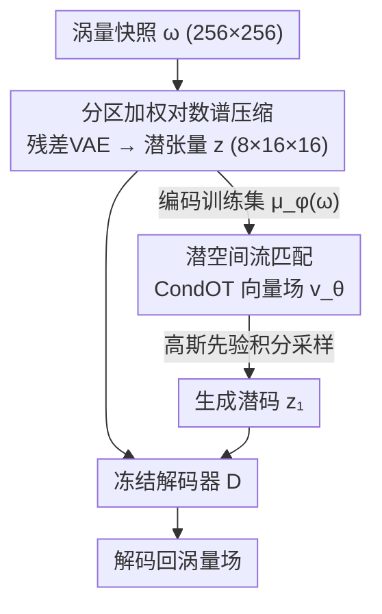

# Spectrally Regularized Latent Flow Matching for Turbulence Generation

**会议**: ICML 2026  
**arXiv**: [2606.11691](https://arxiv.org/abs/2606.11691)  
**代码**: 待确认  
**领域**: 科学计算 / 生成模型 / 湍流生成  
**关键词**: 湍流生成, 潜空间流匹配, 谱正则化, 变分自编码器, 耗散区

## 一句话总结
把潜空间流匹配生成湍流时常用的 MSE 压缩 VAE 换成"分区加权对数谱"目标，专治高波数耗散区幅值被系统性压低的顽疾——重建时深耗散区保留谱功率从 25% 拉到 94%，无条件生成时从 20% 拉到 79%，且只用 20 步积分就突破了 MSE 潜空间无法逾越的质量天花板。

## 研究背景与动机
**领域现状**：用生成模型造合成湍流场，可以替代昂贵的直接数值模拟（DNS）去做不确定性量化、集合统计、闭合模型训练等下游任务。当前主流做法是"潜空间生成管线"：先用 VAE 把湍流场压成低维潜表示，再在潜空间上训练扩散或流匹配模型。

**现有痛点**：这些模型有一个顽固的失效模式——当 VAE 用逐点重建目标（MSE）训练时，会系统性地低估耗散区（高波数）的幅值。而高波数动力学恰恰主导着拟涡量耗散、强烈影响下游流动物理的演化，丢掉它等于丢掉了湍流最关键的细节。

**核心矛盾**：问题的根源在于尺度间的幅值悬殊。在本文的二维湍流数据里，惯性区（IR）涡量幅值是 $O(\pm 7.5)$，而深耗散区（DD）只有 $O(\pm 0.4)$，量级相差约 $20\times$；在 $\ell_2$ 逐点损失下，平方误差权重的失衡被放大到约 $400\times$。于是 MSE 目标几乎只关心大尺度结构，把细尺度内容当噪声压掉——这不是算法 bug，而是损失函数本身的结构性偏置。

**本文目标**：在不改架构、不改生成器的前提下，单独修正"压缩目标"，让耗散区幅值在重建和生成两端都被忠实保留，同时搞清楚这个增益究竟发生在编码器还是解码器、为什么 MSE 会失败。

**切入角度**：作者意识到，潜空间生成里编码器不只是压缩数据分布，它还在塑造采样和传输所发生的潜流形几何。换掉压缩目标，可能同时改变生成保真度和采样效率。

**核心 idea**：用一个分区加权的对数谱重建目标替换 MSE，让损失在傅里叶壳层上显式补偿 IR/DO/DD 三个区的幅值差异，把"被抑制的高波数"重新拉回来。

## 方法详解

### 整体框架
方法是一条两阶段管线，把"表示学习"和"潜空间生成传输"分开。**Stage 1** 是一个残差 VAE，把涡量快照 $\omega\in\mathbb{R}^{1\times256\times256}$ 压成结构化潜张量 $z\in\mathbb{R}^{8\times16\times16}$（空间体积压缩 $32\times$）再重建回去；本文唯一的改动就在这一阶段的训练目标。**Stage 2** 冻结解码器，用编码器均值 $\mu_\phi(\omega)$ 把训练集编码成潜表示，再在潜流形上训练一个无条件的 CondOT 流匹配生成器；采样时从高斯先验出发积分学到的向量场，把终点潜码送进冻结解码器还原成涡量场。

为隔离效应，作者实例化两个架构、超参完全相同、只差压缩目标的模型：**Model A** 用标准 MSE-VAE 目标，**Model B** 用分区加权对数谱目标。整条 Stage 2 生成器、数据集、网络结构两边一模一样，差别只在压缩目标和它塑造出的潜空间几何。

### 关键设计

**1. 分区加权对数谱压缩目标：用谱空间惩罚直接补偿 $400\times$ 的幅值失衡**

这是全文唯一的架构级改动，针对的就是"MSE 把高波数压没了"。作者先把分辨谱划成三个区：惯性区 IR（$k=6\text{–}40$）、耗散起始区 DO（$k=41\text{–}65$）、深耗散区 DD（$k=66\text{–}85$）。对每个整数波数壳层 $\mathcal{S}_k$ 定义壳平均涡量功率 $Z_\omega(k)=\frac{1}{|\mathcal{S}_k|}\sum_{(k_x,k_y)\in\mathcal{S}_k}|\hat\omega(k_x,k_y)|^2$，再在对数谱空间上对每个区算均方误差：

$$\mathcal{L}_z=\frac{1}{|\mathcal{K}_z|}\sum_{k\in\mathcal{K}_z}\big[\log(Z_{\hat\omega}(k)+\epsilon)-\log(Z_\omega(k)+\epsilon)\big]^2.$$

完整目标在标准 VAE 损失 $\mathcal{L}_A$（MSE + KL）之上叠加三个区的加权谱惩罚 $\mathcal{L}_B=\mathcal{L}_A+\lambda_{\mathrm{IR}}\mathcal{L}_{\mathrm{IR}}+\lambda_{\mathrm{DO}}\mathcal{L}_{\mathrm{DO}}+\lambda_{\mathrm{DD}}\mathcal{L}_{\mathrm{DD}}$。取对数是为了让幅值悬殊的三个区在同一尺度上比较，分区加权（贝叶斯搜索得到 $\lambda_{\mathrm{IR}}:\lambda_{\mathrm{DO}}:\lambda_{\mathrm{DD}}=1:4:6$）则把更多权重压到最容易被忽视的高波数区。值得注意的是，该目标约束的是傅里叶模的幅值（壳层模长），对单模相位、模间相对相位、壳内能量分布都不敏感——这为后文"S3 残差缺口"埋下了伏笔。

**2. 编码器–解码器互换诊断：证明增益来自编码器侧的潜空间重组**

光知道 Model B 更好还不够，作者想定位增益究竟住在编码器还是解码器。于是把 $\{\mathcal{E}_A,\mathcal{E}_B\}\times\{\mathcal{D}_A,\mathcal{D}_B\}$ 四种配对都跑一遍。结果很尖锐：只有匹配的 $\mathcal{D}_B\circ\mathcal{E}_B$ 在三个区同时保持低偏差；交叉配对 $\mathcal{D}_A\circ\mathcal{E}_B$（谱编码器配 MSE 解码器）反而比 baseline 更差（DD 偏差 $-0.96$），说明 $\mathcal{E}_B$ 把潜表示重组成了一种 $\mathcal{D}_A$ 根本读不懂的形式；反向 $\mathcal{D}_B\circ\mathcal{E}_A$ 能部分恢复 DD（$-0.23$ vs baseline $-0.61$）但在 IR/DO 退化。结论是：增益是编码器–解码器**协同适配**的，但锚点不对称——编码器侧的潜空间重组是更根本的部分，解码器只提供有限的互补恢复能力。这条诊断把"换损失"这个黑箱操作落实到了具体的架构位置。

**3. 支持–幅度分解：揭穿逐点损失"保守抑制"的失效本质**

这里要解释一个反直觉现象：Model B 谱保真度高得多，DD 区逐点 MSE 却反而略大（$6.7\times10^{-3}$ vs $6.2\times10^{-3}$）。作者把带通 DD 场按真值幅值的第 $p$ 百分位阈值化成二值支持掩码，再把模型预测拆成真阳（TP）、假阴（FN）、假阳（FP）。两条管线行为截然不同：Model A 是**保守抑制模型**——在稀疏的 DD 区域直接预测近零，几乎不付 MSE 代价，却系统性地把真实支持和幅值压低约 $2\times$（幅值比 $\approx 0.44$）；Model B 是**恢复模型**——以略大的逐点误差为代价，把大部分真实支持和幅值预算找回来（幅值比 $\approx 0.91$，IoU、召回都更高）。这条分解的洞见是：细尺度间歇结构上"低 MSE"可能根本不是忠实重建，而是抑制——逐点指标在这种稀疏间歇信号上会骗人。

## 实验关键数据

数据集：用 jax-cfd 在 $256^2$ 网格上解二维不可压 Navier–Stokes（涡量形式），$\nu=10^{-3}$，强迫波数 $k_f=4$，$Re_f\approx 2250$；丢掉前 1000 个瞬态快照后取 5000 个统计平稳场，按时间切成 4500 训练 / 500 测试。评价核心指标是各区的"保留谱功率" $\text{ret.}=100\times 10^{\text{bias}}$（越接近 100% 越好），$\text{bias}=\log_{10}[Z_{\omega,\text{model}}(k)/Z_{\omega,\text{true}}(k)]$。

### 主实验：重建与生成两端的保留谱功率

| 阶段 | 区 | Model A（MSE）保留功率 | Model B（谱正则）保留功率 |
|------|----|----|----|
| Stage 1 重建 | IR | 90.8% | 97.1% |
| Stage 1 重建 | DO | 54.1% | 92.3% |
| Stage 1 重建 | DD | 24.8% | 93.6% |
| Stage 2 生成 | IR | 79.8% | 92.5% |
| Stage 2 生成 | DO | 43.8% | 79.6% |
| Stage 2 生成 | DD | 20.0% | 79.4% |

Stage 1 的谱增益完整传播到了 Stage 2 的生成分布：DD 区生成保留功率从 20% 提到 79%，DO 从 44% 提到 80%，IR 也从 80% 提到 93%。两条管线生成的样本视觉上都很可信，但只有 Model B 在三个区同时贴近真值。作者还核对了流匹配采样的微弱欠扩散校正因子 $T_A=1.157$ 与 $T_B=1.170$ 几乎相同，排除了"是校准而非潜空间几何带来差异"的可能。

### 消融：编码器–解码器互换（DD 区谱偏差，越接近 0 越好）

| 配置 | IR bias | DO bias | DD bias | 说明 |
|------|---------|---------|---------|------|
| $\mathcal{D}_A\circ\mathcal{E}_A$ | $-0.042$ | $-0.267$ | $-0.606$ | MSE 基线，DD 严重欠表示 |
| $\mathcal{D}_B\circ\mathcal{E}_B$ | $-0.013$ | $-0.035$ | $-0.029$ | 匹配谱模型，三区均低偏差 |
| $\mathcal{D}_A\circ\mathcal{E}_B$ | $-0.286$ | $-0.702$ | $-0.961$ | 谱编码器配旧解码器，全面崩坏 |
| $\mathcal{D}_B\circ\mathcal{E}_A$ | $-0.171$ | $-0.321$ | $-0.228$ | 仅部分恢复 DD |

### 关键发现
- **采样质量天花板**：MSE 训练的潜空间存在一个无法逾越的天花板——Model A 的 Heun 积分器从 NFE=20 起就饱和在 DD 偏差 $-0.70$，再加积分步数也突破不了；而 Model B 在仅 20 次函数评估（约 $3.4$ ms/NFE）就达到 DD 偏差 $-0.117$ 并保持。问题不在积分器，在潜空间几何本身。
- **谱保真 ≠ 低逐点误差**：DD 区 Model B 的 MSE 反而略大，但这恰恰说明 MSE 在稀疏间歇结构上会奖励"抑制"。
- **级联方向无监督即得**：两条管线都恢复了二阶结构函数 $S_2(r)$ 和三阶结构函数 $S_3(r)$ 的正确符号（级联方向正确），且无需对结构统计量做显式监督；但 $S_3$ 的**幅值**仍有残差缺口，谱正则化补不上——因为壳平均谱惩罚对模间相位组织、三元组相干天然不敏感。

## 亮点与洞察
- **把"换损失"做成了可控对照实验**：除压缩目标外架构、数据、生成器全部冻结，干净地隔离出谱正则化的效应，这种实验设计本身就很有说服力。
- **诊断工具可迁移**：谱分区、编码器–解码器互换、支持–幅度分解这三件套，可直接用于湍流超分辨、子网格闭合等任何"高波数被压"的潜空间生成场景。
- **"低 MSE 是抑制不是重建"是个普适警示**：凡是处理稀疏/间歇信号（医学影像病灶、稀疏事件、细纹理）的生成模型，都该警惕逐点指标把抑制误判为成功。
- **相位是与幅值正交的新轴**：作者诚实指出 $S_3$ 幅值缺口源于谱目标对相位不敏感，把相位相干三元组组织点名为未来生成式湍流模型的下一个方向，而非和幅值保真竞争的对立项。

## 局限与展望
- **只验证了二维、中等雷诺数**（$Re_f\approx 2250$，$256^2$ 网格、$k_{\max}/k_f\approx 21$ 的有限级联），三维、高雷诺数、更宽级联区下谱失衡更极端，方法是否同样有效未知。
- **无条件生成场景**：本文造的是从潜先验涌现的完整场，不涉及粗到细重建或条件生成；条件化（如给定边界/初值）下的表现待验证。
- **相位/三元组相干未解决**：壳平均谱惩罚结构上管不到相位组织，$S_3$ 幅值残差缺口提示需要相位敏感的目标（如 bispectrum 或显式三元组约束）才能补齐。
- **分区与权重靠贝叶斯搜索**（$1:4:6$），换数据集/物理体系是否需要重调、对权重多敏感，正文未充分展开。

## 相关工作与启发
- **vs CoNFiLD / Parikh 等潜扩散/流匹配湍流模型**：它们同样用潜压缩，但都依赖逐点 MSE 重建目标，因而系统性欠分辨耗散区；本文不换生成器、只换压缩目标就让增益从重建传播到生成，指出问题出在压缩瓶颈而非生成器。
- **vs 神经算子的谱损失（混沌系统预测、算子增强扩散）**：前人把谱损失当作"预测惩罚"用在前向算子上；本文把谱正则化放到生成模型的压缩瓶颈处，并用对数谱分区显式针对惯性区与耗散区的幅值差异。
- **vs 子网格闭合 / 湍流超分辨**：那两条线做的是从滤波 DNS 或粗场恢复高波数（条件式），本文做的是无条件生成——耗散区结构必须从潜先验里涌现，且失效模式是结构性（压缩目标诱导）而非算法性。

## 评分
- 新颖性: ⭐⭐⭐⭐ 把谱正则化下沉到压缩瓶颈 + 三件套机制诊断，角度新颖且分析扎实
- 实验充分度: ⭐⭐⭐⭐ 可控双管线对照、互换诊断、支持–幅度分解都到位，但限于二维中雷诺数单数据集
- 写作质量: ⭐⭐⭐⭐⭐ 动机—机制—诊断逻辑清晰，对自身局限（相位缺口）极为诚实
- 价值: ⭐⭐⭐⭐ 对生成式科学计算社区有直接借鉴意义，诊断工具可复用

<!-- RELATED:START -->

## 相关论文

- [\[NeurIPS 2025\] Physics-Constrained Flow Matching: Sampling Generative Models with Hard Constraints](../../NeurIPS2025/physics/physics-constrained_flow_matching_sampling_generative_models_with_hard_constrain.md)
- [\[NeurIPS 2025\] High-order Equivariant Flow Matching for Density Functional Theory Hamiltonian Prediction](../../NeurIPS2025/physics/high-order_equivariant_flow_matching_for_density_functional_theory_hamiltonian_p.md)
- [\[ICML 2026\] Quantum latent distributions in deep generative models](quantum_latent_distributions_in_deep_generative_models.md)
- [\[ICLR 2026\] Accelerating Eigenvalue Dataset Generation via Chebyshev Subspace Filter](../../ICLR2026/physics/accelerating_eigenvalue_dataset_generation_via_chebyshev_subspace_filter.md)
- [\[NeurIPS 2025\] Balanced Conic Rectified Flow](../../NeurIPS2025/physics/balanced_conic_rectified_flow.md)

<!-- RELATED:END -->
