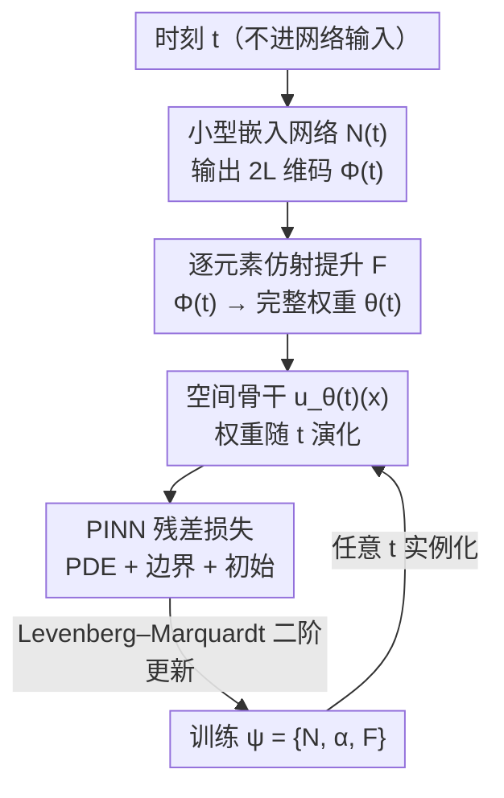

# TINNs: Time-Induced Neural Networks for Solving Time-Dependent PDEs

**会议**: ICML 2026  
**arXiv**: [2601.20361](https://arxiv.org/abs/2601.20361)  
**代码**: https://github.com/CYDai-ml/TINN  
**领域**: 科学计算 / 物理信息神经网络 (PINN)  
**关键词**: 时变 PDE、PINN、时间纠缠、超网络、Levenberg–Marquardt

## 一句话总结
针对标准时空 PINN 把时间当成额外输入、全程共享一套权重导致"时间纠缠"的问题，TINNs 把网络权重本身写成时间的函数 $u_{\theta(t)}(\mathbf{x})$，让空间表征随时间演化，并用一个紧凑的逐层时间嵌入避免超网络的参数爆炸，再配 Levenberg–Marquardt 二阶优化器，在多个时变 PDE 上把相对 $L^2$ 误差压低最多 $4\times$、收敛快约 $10\times$。

## 研究背景与动机
**领域现状**：物理信息神经网络 (PINN) 用一个可微、无网格的神经网络 $u_\theta(\mathbf{x},t)$ 拟合 PDE 解，通过最小化 PDE 残差 + 边界条件 + 初始条件的加权平方和来训练，可以在定义域内任意点查询解，特别适合复杂几何、高维、反问题等传统有限差分/有限元吃力的场景。对时变 PDE，主流做法是"时空 PINN"——把时间 $t$ 当作和空间坐标并列的一个额外输入维度，喂给同一个网络。

**现有痛点**：时变解的空间复杂度往往随时间剧烈变化。以黏性 Burgers 方程为例，解从一条光滑曲线逐渐演化出 $x=0$ 附近极陡的过渡层——整体形状相似，但后期的空间梯度比前期大得多。共享权重的时空 PINN 只能用同一组深层特征去同时表示"早期平滑"和"后期陡峭"两种截然不同的动态，造成表征相互干扰，且联合施加 PDE/边界/初始约束时优化很不稳定。

**核心矛盾**：作者把它命名为**时间纠缠 (time-entanglement) 问题**。用一个一维仿射玩具例子 $u_\theta(x,t)=U(wx+vt+b)$ 就能看穿瓶颈：它的空间导数 $\partial_x u = U'(wx+vt+b)\,w$，时间 $t$ 只能通过加性平移 $vt$ 影响网络，而控制空间陡度的缩放因子 $w$ 对所有时刻是固定的。于是模型无法直接"随时间把空间特征拉陡"，只能靠把激活函数的自变量平移到更陡的区域去间接实现——这种"只能平移"的控制方式在实践中很脆弱。加深网络也救不了，因为同样的纠缠依然存在。

**本文目标 + 切入角度**：与其在优化层面打补丁（自适应采样、损失重加权、因果课程），不如直接改架构——把"时间如何进入网络"这件事本身重做。作者的观察是：既然空间尺度需要随时间显式变化，那就别让时间挤在输入端，而应让它去调制**参数**。

**核心 idea**：把时变解表示为参数空间中的一条轨迹 $u_{\theta(t)}(\mathbf{x})$——同一个空间骨干网络，但权重 $\theta(t)$ 随时间平滑变化。这样玩具例子变成 $u_{\theta(t)}(x)=U(w(t)x+b(t))$，空间导数 $\partial_x u = w(t)\,U'(\cdot)$，时间可以通过 $w(t)$ **直接**改变空间陡度，恰好补上了标准 PINN 缺的那个自由度。

## 方法详解

### 整体框架
TINN 的输入是时空配点（但时间不再进网络输入），输出是 PDE 在任意 $(\mathbf{x},t)$ 的解。核心思路分三步：(1) 把解参数化为 $u_{\theta(t)}(\mathbf{x})$，让空间骨干捕捉空间结构、让 $\theta(t)$ 编码时间动态；(2) 为了不让 $\theta(t)$ 引入海量额外参数，用一个**紧凑的逐层时间嵌入** $\Phi(t)\in\mathbb{R}^{2L}$ 加逐元素仿射提升来生成完整权重向量；(3) 用 **Levenberg–Marquardt (LM)** 二阶优化器训练，吃下 PINN 损失天然的非线性最小二乘结构。训练的真正可学变量是 $\psi=\{\mathcal{N},\alpha,\mathbf{F}\}$（嵌入网络、门控、仿射映射），训练完即可在任意 $t$ 实例化出 $\theta(t)$ 进而得到 $u_{\theta(t)}$。

### 关键设计

**1. 时间进参数空间：把解写成参数轨迹 $u_{\theta(t)}(\mathbf{x})$**

这是全文的根。标准时空 PINN 把 $t$ 塞进输入、全程共享一套 $\theta$，导致时间纠缠；TINN 反其道而行——从网络输入里**移除**时间，转而让一组随时间平滑变化的权重 $\theta(t)$ 去承载时间动态，即 $u(\mathbf{x},t):=u_{\theta(t)}(\mathbf{x})$。在这个视角下，骨干网络 $u_\theta$ 只负责空间结构，时间演化变成参数空间里的一条轨迹 $t\mapsto\theta(t)$，产生一族"按时间索引的空间网络"。它的好处在玩具例子里看得最清楚：空间导数变成 $w(t)U'(w(t)x+b(t))$，时变缩放 $w(t)$ 让模型可以**显式**地随时间调节空间陡度，而不是像标准 PINN 那样只能靠激活自变量的平移去间接逼近——这正是解梯度随时间变陡时 TINN 更准更稳的根本原因。作者还在 $x=0$ 处对比了空间导数的绝对误差：普通 MLP 在激波形成后误差急剧上升，TINN 全程保持小且稳定。

**2. 紧凑逐层时间嵌入：用 $2L$ 维码 + 逐元素仿射避开超网络的参数爆炸**

直接用一个全连接超网络去输出 $\theta(t)\in\mathbb{R}^{N_D}$ 是行不通的：若时间网络隐藏宽度为 $h$，仅最后一层就要 $\mathcal{O}(N_D h)$ 个参数，而 $N_D$ 随空间骨干宽度增长，这部分开销会迅速吞掉整个模型。简单的函数形式（线性轨迹 $\theta(t)=wt+b$、单神经元轨迹）虽省参数，但太死板——表 1 显示线性形式在 Allen–Cahn 上还行、在 Burgers 上和单神经元差不多，都不够灵活。作者提出折中方案：一个小网络 $\mathcal{N}(t)$ 只输出 $2L$ 维的逐层编码 $\Phi(t)$（每层一对，对应权重组和偏置组），再通过逐元素仿射"提升"到完整的 $N_D$ 维 $\theta(t)$。编码定义为门控混合

$$\Phi(t)=(\mathbf{1}-\alpha)\,t+\alpha\odot\mathcal{N}(t),$$

其中 $\alpha\in\mathbb{R}^{2L}$ 是可学门控；提升时同一参数组内所有元素共享同一时间坐标 $\Phi_\ell(t)$，但各自保留独立的仿射系数 $w_\ell^{ij}(t)=a^{ij}\Phi_\ell(t)+b^{ij}$，整体写成 $\theta(t)=\mathbf{F}(\Phi(t))$。这个设计同时满足两个建模需求：**宏观一致性**——当解在某个 $t^\star$ 附近剧变时，许多参数能被协调地同步拉动；**微观多样性**——即便在 $t^\star$ 附近，不同层仍能各自走不同的时间尺度。参数量为 $2N_D+\mathcal{O}(Lh)$，因为通常 $N_D\gg L$ 且 $h>2$，远小于超网络的 $\mathcal{O}(N_D h)$。

**3. Levenberg–Marquardt 二阶训练：吃下 PINN 损失的非线性最小二乘结构**

PINN 损失天然是非线性最小二乘——PDE 残差、边界、初始三项平方和：

$$L(\theta)=\frac{\lambda_r}{N_r}\sum_i\|\mathcal{L}(u_\theta)(\mathbf{x}_i^r,t_i^r)\|_2^2+\frac{\lambda_b}{N_b}\sum_i\|\mathcal{B}(u_\theta)\|_2^2+\frac{\lambda_{ic}}{N_{ic}}\sum_i\|\mathcal{I}(u_\theta)\|_2^2.$$

多数 PINN 用 Adam 或 L-BFGS 这类一阶/拟牛顿方法，它们不显式利用最小二乘结构，对各残差项之间的尺度失配很敏感。TINN 采用 LM 算法——一种在梯度下降和高斯–牛顿之间通过自适应阻尼插值的标准二阶最小二乘求解器，每步基于堆叠的 PDE/边界/初始残差求解一个阻尼线性化子问题，能更好地平衡相互竞争的约束、提升稳定性。LM 的单步代价随可训练参数数增长，对近期那些大网络 PINN 基线并不实用；但 TINN 恰恰参数高效又足够表达，把 LM 控制在可承受范围内，二者结合带来更快更稳的收敛。

### 损失函数 / 训练策略
TINN 沿用与标准时空 PINN 完全相同的物理信息损失（上式），唯一区别在于参数化方式 $u_{\theta(t)}(\mathbf{x})$，以保证公平对比。骨干用 MLP（遵循 PINN 文献惯例以隔离时间嵌入结构的影响，但方法不限于 MLP）。优化器为 LM，超参与训练点、迭代数、随机种子在对比实验中对齐，并匹配各方法的参数预算。

## 实验关键数据

### 主实验
在四个时变 PDE（Burgers、Allen–Cahn、Klein–Gordon、Korteweg–De Vries）上，单张 A6000，报告 5 次运行的相对 $L^2$ 误差、训练时间、参数量。TINN 用约 1185 个参数就全面领先用 30 万～53 万参数的基线，且训练时间最短。

| 方程 | 方法 | 相对 $L^2$ 误差 ↓ | 时间 ↓ | 参数量 |
|------|------|------|------|------|
| Burgers | PINN | 2.19E-04 | 1.24hr | 309440 |
| Burgers | PirateNet SOAP | 1.97E-06 | 1.70hr | 534853 |
| Burgers | **TINN** | **6.89E-07** | **0.75hr** | **1145** |
| Allen–Cahn | PINN | 4.65E-01 | 0.95hr | 309760 |
| Allen–Cahn | PirateNet SOAP | 8.32E-06 | 1.50hr | 534981 |
| Allen–Cahn | **TINN** | **3.85E-06** | **0.78hr** | **1185** |
| Klein–Gordon | CoPINN* | 6.61E-06 | 0.70hr | 212832 |
| Klein–Gordon | **TINN** | **4.78E-06** | **0.67hr** | **1185** |
| Korteweg–De Vries | PirateNet SOAP | 4.26E-04 | 1.86hr | 534981 |
| Korteweg–De Vries | **TINN** | **1.53E-04** | **0.69hr** | **1185** |

相对最强基线，TINN 在 Burgers 上误差约降至 $1/2.9$，相对原版 PINN 的累计提升 (acc. IMP) 高达数百到 $10^5$ 倍量级；同时参数量小两个数量级、训练时间最短。

### 消融实验
表 1 比较 $\theta(t)$ 的不同参数化方式（在匹配参数预算、固定训练点/迭代/种子下）：

| 方程 | $\theta(t)$ 形式 | 相对 $L^2$ 误差 ↓ | 参数量 |
|------|------|------|------|
| Burgers | 线性轨迹 | 2.65E-06 | 1144 |
| Burgers | 单神经元 | 2.93E-06 | 1188 |
| Burgers | **TINN 逐层嵌入** | **5.67E-07** | 1145 |
| Allen–Cahn | 线性轨迹 | 3.25E-06 | 1188 |
| Allen–Cahn | 单神经元 | 1.47E-05 | 1242 |
| Allen–Cahn | **TINN 逐层嵌入** | **2.73E-06** | 1185 |

### 关键发现
- 简单参数化（线性/单神经元）表现随 PDE 漂移：线性在 Allen–Cahn 好、在 Burgers 与单神经元持平，说明固定函数形式不够通用；而紧凑逐层嵌入在两者上都最优，验证"宏观一致 + 微观多样"的设计价值。
- TINN 用约千级参数即可达到甚至超过数十万参数基线的精度，"时间进参数空间"带来的是表征效率而非单纯堆容量。
- 与显式分离空间/时间再用经典 ODE 积分器推进的混合方法相比，TINN 保持端到端、连续、物理信息训练：在一个 transport 方程上 TINN 相对 $L^2$ 误差 $8.42\times10^{-10}$，分离法 $3.04\times10^{-8}$，避免了数值积分误差累积。

## 亮点与洞察
- 把"时间该放在哪"重新提问：现有工作大多在优化/采样上修补，TINN 指出时间纠缠是**架构**层面的结构性缺陷，并给出"时间→参数空间"这一干净且与已有优化策略正交的答案，可叠加使用。
- 逐层时间嵌入 $\Phi(t)=(1-\alpha)t+\alpha\odot\mathcal{N}(t)$ 这个门控混合很巧妙：$t$ 项保证退化时仍是合理的线性时间，$\mathcal{N}(t)$ 项提供灵活性，门控 $\alpha$ 让模型自己决定何处需要非线性，参数量只 $2N_D+\mathcal{O}(Lh)$。
- 参数高效反过来"解锁"了二阶优化：正因为 TINN 小，LM 这种单步随参数量增长的方法才变得可行，二者形成正向耦合——这条"小模型 + 强优化器"的思路可迁移到其他需要高精度的科学计算网络。

## 局限与展望
- 实验集中在 1D 空间、规则域上的经典时变 PDE；高维、复杂几何、强非线性/多尺度耦合系统下的可扩展性与稳定性仍待验证。
- 逐层嵌入维度 $2L$ 与骨干层数绑定，对极深骨干或需要"层内更细粒度时间多样性"的问题，是否仍够表达存疑。
- LM 单步代价随参数量增长，方法当前依赖"骨干足够小"这一前提；若问题本身需要大骨干，LM 的可行性会受限，可能需要近似/分块策略。
- 骨干主要用 MLP 做隔离实验，附录提到可扩展到 ResNet/modified-MLP/SPINN 等，但这些架构上的时间纠缠与嵌入效果还需系统评估。

## 相关工作与启发
- **vs 因果 PINN (Causal PINN)**：因果 PINN 靠时间自适应损失重加权、优先早期误差来缓解误差传播，但仍用单一时空网络、把时间当输入坐标；TINN 改的是"时间如何进入网络"，与因果重加权正交，可组合。
- **vs 空间/时间分离 + ODE 积分（如 datar2025）**：分离法固定（常随机初始化）空间特征、只学时变系数，再用经典 ODE 求解器推进，速度快但脱离端到端、需额外机制施加初边值，且误差常被数值积分累积主导；TINN 采纳"分离"视角却保持连续、物理信息、端到端训练，不冻结空间特征、不依赖离散时间积分。
- **vs 朴素超网络**：超网络直接输出 $N_D$ 维 $\theta(t)$ 需 $\mathcal{O}(N_D h)$ 参数易爆炸；TINN 的逐层码 + 仿射提升把参数压到 $2N_D+\mathcal{O}(Lh)$。

## 评分
- 新颖性: ⭐⭐⭐⭐⭐ 把"时间纠缠"诊断为架构缺陷并给出"时间进参数空间"的干净解法，视角新。
- 实验充分度: ⭐⭐⭐⭐ 覆盖四类经典时变 PDE + 多组消融，但限于低维规则域。
- 写作质量: ⭐⭐⭐⭐⭐ 玩具例子→机理→设计→实验逻辑链清晰，动机讲得透。
- 价值: ⭐⭐⭐⭐ 千级参数达到数十万参数基线精度，且与现有 PINN 优化策略正交可叠加。

<!-- RELATED:START -->

## 相关论文

- [\[ICLR 2026\] Sublinear Time Quantum Algorithm for Attention Approximation](../../ICLR2026/physics/sublinear_time_quantum_algorithm_for_attention_approximation.md)
- [\[ICLR 2026\] A Two-Phase Deep Learning Framework for Adaptive Time-Stepping in High-Speed Flow Modeling](../../ICLR2026/physics/a_two-phase_deep_learning_framework_for_adaptive_time-stepping_in_high-speed_flo.md)
- [\[AAAI 2026\] SAOT: An Enhanced Locality-Aware Spectral Transformer for Solving PDEs](../../AAAI2026/physics/saot_an_enhanced_locality-aware_spectral_transformer_for_solving_pdes.md)
- [\[ICML 2026\] EqGINO: Equivariant Geometry-Informed Fourier Neural Operators for 3D PDEs](eqgino_equivariant_geometry-informed_fourier_neural_operators_for_3d_pdes.md)
- [\[ICLR 2026\] DGNet: Discrete Green Networks for Data-Efficient Learning of Spatiotemporal PDEs](../../ICLR2026/physics/dgnet_discrete_green_networks_for_data-efficient_learning_of_spatiotemporal_pdes.md)

<!-- RELATED:END -->
