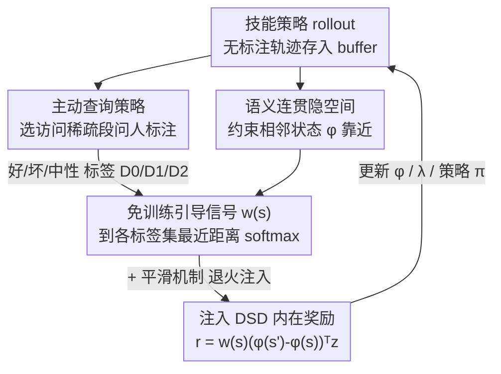

# COLLIE: Guiding Skill Discovery in Semantically Coherent Latent Space

**会议**: ICML 2026  
**arXiv**: [2606.00950](https://arxiv.org/abs/2606.00950)  
**代码**: https://github.com/iiiiii11/COLLIE  
**领域**: 强化学习 / 技能发现  
**关键词**: 无监督技能发现、引导式技能发现、语义连贯隐空间、免训练引导信号、人在回路

## 一句话总结
本文提出 **COLLIE**——一种引导式技能发现（GSD）框架，用大量无标注数据先构建一个"语义连贯"的技能隐空间（隐空间里靠得近的状态人类期望度也相近），从而仅凭稀疏的人类"好/坏"标签就能 **免训练** 地传播出一个稠密引导信号 $w(s)$，把无监督探索导向安全、任务相关的区域，避免学出危险或无用技能，且无需训练任何额外的引导网络。

## 研究背景与动机

**领域现状**：无监督技能发现（USD）想在没有奖励函数的情况下，学一组可区分、能覆盖状态空间的多样行为，供下游任务复用（如分层策略的底层技能、或零样本选技能最大化任务奖励）。典型做法是最大化技能 $z$ 与访问状态 $s$ 的互信息 $I(s,z)$，或更进一步用 **距离最大化技能发现（DSD）**：约束隐空间 $\phi(s)$ 反映状态距离，并最大化在隐空间里走过的距离。

**现有痛点**：USD 的 **均匀探索** 策略在复杂环境里会学出大量无用甚至危险的技能——广阔状态空间里塞着很多无关或有害区域，盲目覆盖既浪费算力又限制实用性。引导式技能发现（GSD）想借人类意图把探索聚焦到有用区域，但现有 GSD 有两个老毛病：① 依赖 **预定义规则或专家示范**，复杂环境里这些很难拿到；② 需要 **训练额外的引导网络** 来编码人类意图，而在线收集的人类反馈本就稀疏，小数据训出来的网络容易过拟合，给出不可靠的引导。

**核心矛盾**：引导信号的可靠性需要大量人类标注来支撑，但人类反馈在线收集时天然稀疏——"要可靠就要多标"和"人只愿少标"之间存在根本张力；而现有方法把这个负担压在一个需要训练的引导网络上，稀疏数据下必然不稳。

**本文目标**：在 **只有稀疏、在线收集、非专家** 的人类反馈下，构造一个可靠的引导信号，且不引入任何需要额外训练的引导模型。

**切入角度**：作者的关键观察是——如果能让 **隐空间本身语义连贯**（靠得近的状态人类期望度也相近），那么少量标签就能在隐空间里平滑传播，无需再训一个分类器去拟合稀疏标签。而隐空间的连贯性可以从 **大量无标注数据** 里免费学到（轨迹中相邻状态期望度相近），刚好补上稀疏人类反馈的不足。

**核心 idea**：用稠密无监督数据构建语义连贯隐空间 → 在该空间里靠"到各标签集的最近距离 + softmax"**免训练** 地传播出稠密引导信号 $w(s)$ → 把 $w(s)$ 作为距离调制因子注入 DSD 的内在奖励，把探索导向人类期望区域。

## 方法详解

### 整体框架
COLLIE 要解决的是"稀疏人类反馈下如何得到可靠引导"。它建立在 DSD 框架上，整体在一个 epoch 循环里把四件事串起来：**学语义连贯隐空间**（约束轨迹相邻状态在隐空间里靠近，让"邻近=期望度相近"成立）→ **免训练传播引导信号**（用少量"好/坏/中性"标签，按到各标签集的最近距离 softmax 出 $w(s)$）→ **主动查询补标签**（优先让人标注访问稀疏的状态段，保证标签覆盖）→ **把 $w(s)$ 注入 DSD 内在奖励** 更新隐空间、拉格朗日乘子和策略。每轮收到新反馈就在线更新 $w(s)$，无需训练任何额外网络。

### 关键设计

**1. 语义连贯隐空间：让"邻近=期望度相近"，使稀疏标签可传播**

免训练传播标签的前提，是隐空间得满足一个性质——靠得近的状态人类期望度也相近。作者把它形式化为 **语义连贯性**：对期望度函数 $g(s):\mathcal{S}\to\{0,1,2\}$，称隐空间连贯当 $\forall\epsilon>0,\exists\delta>0$ 使得 $\|\phi(s_1)-\phi(s_2)\|_2\le\delta \Rightarrow P[g(s_1)=g(s_2)]\ge 1-\epsilon$。为什么必须显式构造它？因为 **原始状态空间天生不连贯**：机器人在同一位置 $(x,y)$ 既可能稳定（期望）也可能摔倒（不期望），两者在状态空间里仅差几个关节角却期望度完全相反，欧氏距离根本测不出语义相似性。直接满足上式很难，作者退而用一个 **代理约束**——利用"轨迹中相邻状态期望度相近"这一观察，约束相邻状态对的嵌入靠近：$\|\phi(s')-\phi(s)\|_2\le\delta_0,\ \forall(s,s')\in\mathcal{S}_{\text{adj}}$。如 Park et al. (2024) 所证，这个局部约束会蕴含一个关于 **时序距离** 的全局 Lipschitz 条件 $\|\phi(s_1)-\phi(s_2)\|\le\delta_0 d_{\text{temp}}(s_1,s_2)$，从而让隐空间真正按"几步能到达"来组织，使期望度可平滑传播。

**2. 免训练引导信号 $w(s)$：靠最近距离 + softmax 直接传播标签，不训分类器**

有了连贯隐空间，引导信号就不必再训网络。核心想法是：任意状态 $s$ 的期望度，可由它在隐空间里到各标签集的距离推断。给定少量人标状态 $\mathcal{D}=\mathcal{D}_0\cup\mathcal{D}_1\cup\mathcal{D}_2$（坏/中性/好），先算 $s$ 到每个标签集的最小 L2 距离 $d_\phi(s,\mathcal{D}')=\min_{s_0\in\mathcal{D}'}\|\phi(s_0)-\phi(s)\|$，再用对距离取负后的 softmax 加权三个期望度等级：

$$w(s)=\text{softmax}\big([-d_\phi(s,\mathcal{D}_i)]_{i=0}^{2}\big)[0,1,2]^\top$$

直觉上，离"好"区越近 $w(s)$ 越大、离"坏"区越近越小，恰好反映相对期望度。这不只是直觉——作者证明（Proposition 3.1）把 $w(s)$ 当分类器看时，其渐近错误率被 **两倍贝叶斯错误率** 界住：$P(\hat g(s)\ne g(s))\le 2P^*(s)-\tfrac{3}{2}[P^*(s)]^2$，从理论上担保了这个免训练信号的可靠性。和"训练引导网络"相比，它在稀疏数据下不会过拟合，且只需缓存少量标签嵌入、算距离即可，计算开销很小。

**3. 把 $w(s)$ 解耦注入 DSD 内在奖励：避免信号耦合进隐空间导致的不稳定**

引导信号要真正影响探索，得进 DSD 的目标。最自然的做法是把 $w(s)$ 塞进隐空间约束当距离调制：$\|\phi(s')-\phi(s)\|_2\le w(s),\forall(s,s')\in\mathcal{S}_{\text{adj}}$——大 $w(s)$ 放松约束、鼓励在期望区广探索，小 $w(s)$ 收紧约束、抑制不期望区探索。但直接这么优化有问题：$w(s)$ 嵌在约束里、直接影响 $\phi$ 的更新，而 $w(s)$ 又随人类反馈动态变化，这种耦合会带来不稳定。作者借 Kim et al. (2024) 做了一次 **变量替换** $\phi'(s)=\phi(s)/w(s)$，导出一个近似等价但更实用的目标：把约束还原成 $\|\phi(s')-\phi(s)\|_2\le 1$，而把 $w(s)$ 移到目标函数里当 **内在奖励的缩放因子** $r(s,z,s')=w(s)(\phi(s')-\phi(s))^\top z$。这一步把引导信号从隐空间学习里 **解耦** 出来，保住了原 DSD 的稳定性和隐空间结构，只通过缩放内在奖励来注入人类意图。

**4. 主动查询 + 信号平滑：保证标签覆盖、并避免反馈带来的突变**

免训练信号的精度取决于标签集 $\mathcal{D}$ 是否充分覆盖状态空间，否则最近邻推断会失真。为此作者提出 **主动查询策略**：优先让人标注 **访问稀疏** 的状态——用基于粒子的状态熵估计 $H_{\text{state}}(s)\approx\log(1+\tfrac{1}{k}\sum_{j=1}^k\|s-s^{(j)}\|)$（$s^{(j)}$ 是 $s$ 在已标注集里的第 $j$ 近邻）衡量稀缺度，段的查询得分 $I(\sigma)=\sum_{s\in\sigma}H_{\text{state}}(s)$ 越高越优先送标。另一个工程问题是：每轮反馈后 $w(s)$ 会 **突变**，在早期隐空间和策略都还不成熟时尤其伤训练。作者用一个 **平滑机制** $w_e(s)=(1-\beta_e)w(s)+\beta_e\cdot 1$，其中 $\beta_e=\max(0,1-k_\beta\cdot e/T^e)$ 随 epoch 退火——早期 $\beta_e$ 大、$w_e$ 接近 1（接近纯无监督探索），后期 $\beta_e\to 0$、引导逐渐生效，实现从纯探索到引导探索的平滑过渡（$k_\beta=\infty$ 退化为纯 GSD，$k_\beta=0$ 退化为纯 USD）。

### 损失函数 / 训练策略
完整目标在 DSD 上注入缩放后的内在奖励：隐空间 $\phi$ 最大化 $\mathcal{J}^\phi=\mathbb{E}[w(s)(\phi(s')-\phi(s))^\top z+\lambda\min(\epsilon,1-\|\phi(s')-\phi(s)\|_2^2)]$，拉格朗日乘子 $\lambda$ 最小化对应约束项，策略 $\pi$ 最大化累计内在奖励 $r=w(s)(\phi(s')-\phi(s))^\top z$。每隔 $K$ 个 epoch 做一次反馈，总反馈数 $N_{\text{total}}$，多数任务用 40 段长度 $H=20$ 的标注段。

## 实验关键数据

### 主实验
在 5 类机器人运动环境（状态型 Ant / HalfCheetah / Safety-Gym，像素型 Quadruped / Humanoid）上评测，对比 USD 基线（DIAYN/LSD/METRA）、GSD 基线（DoDont*/DDG* 在线变体）和 Oracle（手工设计 $w(s)$ 的上界）。指标为 **安全状态覆盖**（避开危险区的同时覆盖状态空间）。COLLIE 在多数任务上接近 Oracle、超过所有基线，且在像素任务上同样有效（仅 100 条反馈）：

| 任务 | DIAYN | METRA | DoDont* | **COLLIE** | Oracle |
|------|-------|-------|---------|-----------|--------|
| Ant North | -4.20 | -1425.80 | 1307.20 | **1333.20** | 1381.40 |
| HalfCheetah Right | 0.00 | -8.40 | 82.80 | **102.20** | 97.80 |
| Quadruped North（像素） | -4.20 | -200.80 | 115.20 | **128.40** | 112.60 |
| Humanoid Hole（像素） | 3.60 | 21.60 | 75.80 | **80.60** | 75.20 |
| Safety-Gym Hazard | -34.80 | -34.80 | -37.60 | **-16.00** | -20.80 |

下游任务上，COLLIE 学到的技能同样最强（HalfCheetah 分层控制器选冻结技能，平均性能）：

| 方法 | DIAYN | LSD | METRA | DoDont* | **COLLIE** | Oracle |
|------|-------|-----|-------|---------|-----------|--------|
| Performance | 10.43 | 32.73 | 21.58 | 30.44 | **45.26** | 47.46 |

### 消融实验

| 配置 | 关键指标（Ant North 安全覆盖） | 说明 |
|------|---------|------|
| COLLIE（完整，40 标签，无噪） | 1333.20 | 完整模型 |
| 噪声 $R_{\text{error}}=0.5$ | 1184.60 | 边界带随机错标，仍鲁棒 |
| 噪声 $R_{\text{error}}=1$ | 1084.20 | 噪声加大，性能温和下降 |
| 标签数 20 | 1035.60 | 反馈减半，仍对齐人类意图 |
| 标签数 10 | 801.40 | 极稀疏，仍能引导 |
| COLLIE-L2（去语义连贯，用原始欧氏距离） | 更差 | 凸显连贯隐空间的必要性 |

### 关键发现
- **语义连贯隐空间是地基**：去掉它（COLLIE-L2 用原始状态欧氏距离）性能明显变差——印证了"原始状态空间不连贯、需显式构造"的动机。
- **稀疏反馈下依然有效**：仅 10~20 条标签就能对齐人类意图，标签越多越好，说明免训练信号不像引导网络那样在小数据上崩。
- **对噪声鲁棒**：边界带随机错标（$R_{\text{error}}=0.5/1$）下性能只温和下降，证明最近距离 + softmax 的传播机制不脆弱。
- **训练引导网络的基线吃亏**：DoDont* 依赖训练好的指令网络，在有限反馈下不稳定，普遍弱于 COLLIE——直接支持"免训练优于训网络"的核心主张。

## 亮点与洞察
- **把"引导难"转化成"隐空间连贯性"**：最巧的一步是认识到——只要隐空间语义连贯，引导信号就退化成一个 KNN 式的距离传播问题，根本不用训分类器。这把 GSD 的复杂度从"训一个鲁棒引导网络"降成"构造一个好隐空间 + 算距离"。
- **理论担保的免训练信号**：用两倍贝叶斯错误率界住免训练 $w(s)$ 的错误率，让"不训网络也可靠"从直觉变成有保证的结论，这种"用结构换训练"的思路可迁移到其他人在回路任务。
- **变量替换解耦**：$\phi'=\phi/w$ 把动态变化的引导信号从隐空间约束里挪到奖励缩放上，是一个保稳定性的漂亮工程技巧，值得在"动态约束耦合"类问题里复用。
- **平滑退火当探索→引导的开关**：用 $\beta_e$ 退火统一了纯 USD（$k_\beta=0$）和纯 GSD（$k_\beta=\infty$），早期多探索、后期多引导，缓解早期不成熟隐空间被引导信号带偏。

## 局限与展望
- **依赖"轨迹相邻状态期望度相近"假设**：语义连贯性是通过相邻状态约束的代理来近似的，若环境中相邻状态期望度会剧烈跳变（如瞬时陷阱），这个代理可能失效。
- **oracle teacher 评测**：实验用基于规则的 oracle 老师模拟人类反馈，虽注入了噪声鲁棒性实验，但真实人类反馈的偏差/不一致性可能更复杂。
- **任务局限于机器人运动**：评测集中在 Ant/HalfCheetah/Quadruped/Humanoid 类 locomotion，操作类（manipulation）或长时序任务上的有效性未验证。
- **三级离散标签**：好/中性/坏的三分类反馈较粗，能否扩展到连续偏好或更细粒度的人类意图编码仍待探索。

## 相关工作与启发
- **vs USD（DIAYN / LSD / METRA）**: 它们均匀探索、无人类意图，复杂环境里学出无用/危险技能；COLLIE 在 DSD（LSD/METRA 同族）基础上注入引导信号，把探索导向安全区，安全覆盖大幅领先。
- **vs 训练引导网络的 GSD（DoDont / DDG）**: 它们需训练指令网络编码人类意图、依赖专家数据，稀疏反馈下过拟合不稳；COLLIE **免训练** 传播标签，稀疏/带噪反馈下更可靠，实验中稳定优于 DoDont*/DDG*。
- **vs 偏好式 RL**: COLLIE 用"好/中性/坏"段标签而非成对偏好（附录 F 讨论了这一选择），更适配"安全区/危险区"这类绝对期望度的引导语义。
- **vs Park et al. (2024)（METRA 的 temporal Lipschitz）**: COLLIE 复用了其"局部相邻约束蕴含全局时序 Lipschitz"的结论，但把它从纯无监督扩展为承载语义连贯性、支撑标签传播的载体。

## 评分
- 新颖性: ⭐⭐⭐⭐ "语义连贯隐空间 → 免训练引导信号"是对 GSD 范式的实质简化，且带理论担保
- 实验充分度: ⭐⭐⭐⭐ 覆盖状态/像素、多种引导类型、噪声/标签数/连贯性消融齐全，但限于 locomotion
- 写作质量: ⭐⭐⭐⭐ 动机—性质—信号—注入的推导链条清晰，理论与工程细节交代到位
- 价值: ⭐⭐⭐⭐ 在稀疏非专家反馈下实现可靠安全引导，对人在回路 RL 与安全探索有实用价值

<!-- RELATED:START -->

## 相关论文

- [\[ICLR 2026\] SUSD: Structured Unsupervised Skill Discovery through State Factorization](../../ICLR2026/reinforcement_learning/susd_structured_unsupervised_skill_discovery_through_state_factorization.md)
- [\[ICLR 2026\] Self-Improving Skill Learning for Robust Skill-based Meta-Reinforcement Learning](../../ICLR2026/reinforcement_learning/self-improving_skill_learning_for_robust_skill-based_meta-reinforcement_learning.md)
- [\[ICML 2026\] Global Policy-Space Response Oracles for Two-Player Zero-Sum Games](global_policy-space_response_oracles_for_two-player_zero-sum_games.md)
- [\[ICML 2026\] Space-sampled Value Decay: Forgetting Mechanisms for Non-stationary Deep Reinforcement Learning](space-sampled_value_decay_forgetting_mechanisms_for_non-stationary_deep_reinforc.md)
- [\[ACL 2026\] SpiralThinker: Latent Reasoning through an Iterative Process with Text-Latent Interleaving](../../ACL2026/reinforcement_learning/spiralthinker_latent_reasoning_through_an_iterative_process_with_text-latent_int.md)

<!-- RELATED:END -->
