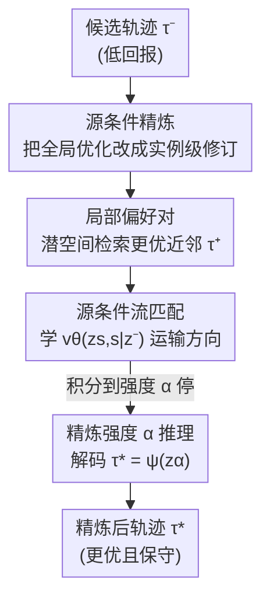

# Counterfactual Transport Flows for Offline Conservative Trajectory Refinement

**会议**: ICML2026  
**arXiv**: [2606.09115](https://arxiv.org/abs/2606.09115)  
**代码**: 待确认  
**领域**: 强化学习 / 离线RL  
**关键词**: 离线强化学习, 轨迹精炼, 条件流匹配, 反事实, 保守性

## 一句话总结
给定一条"低回报"的候选轨迹，本文不重新生成动作，而是在潜在轨迹空间里检索附近"更优"的轨迹作为弱监督，用源条件流匹配（source-conditioned flow matching）学一个"实例专属"的精炼方向，并用一个精炼强度参数 $\alpha$ 控制改多少，从而在"保留原行为"和"提升回报"之间连续权衡。

## 研究背景与动机

**领域现状**：离线强化学习（offline RL）只用历史日志数据改进策略，主流做法两类——一类用值函数惩罚把策略约束在数据分布内（CQL、IQL、TD3+BC），一类用扩散/流模型直接生成新行为（Diffuser、Diffusion-QL）。还有一支工作靠"反事实数据增强"扩充离线数据，但基本停在**单步 transition** 层面。

**现有痛点**：这些方法要么学一个全局策略、要么学一个全局轨迹分布，**都没有显式回答"这一条具体的低回报轨迹，本可以怎样被局部修改才会更好"**。标准 RL 把策略压成"状态→动作"的反应式映射，速度快但不可解释，看不出"哪一步改了就成功了"。

**核心矛盾**：全局优化追求"整体更优"，但离线设定下评估任意新轨迹需要环境交互或可靠动力学模型，二者都没有；而直接拿"更优的邻居轨迹"替换掉源轨迹，又会偏离原行为太远（不保守），改得面目全非。**提升幅度与保守性之间存在 trade-off**。

**本文目标**：把离线改进重新表述为**源条件轨迹精炼（source-conditioned trajectory refinement）**：给定低回报轨迹 $\tau^-$，在数据支撑范围内把它局部修订到一个回报更高的近邻 $\tau^*$，并让"改多少"可控。

**切入角度**：作者借鉴对世界模型的批评——有目的的 agent 应支持"对可行动可能性的假设性推理"，而非纯反应式。于是不学全局方向，而学**以源轨迹本身为条件**的局部精炼流；这和"reward-conditioned 生成"（条件是想要的回报水平）本质不同，后者是"凭空生成一条高回报轨迹"，前者是"针对你这条轨迹给出专属修改建议"。

**核心 idea**：用条件流匹配学一个"从源轨迹指向其局部更优近邻"的向量场，把离线改进变成在潜在轨迹空间里的一次**可控的、保守的运输（transport）**。

## 方法详解

### 整体框架
方法整体是一条"编码 → 配对 → 学流 → 可控解码"的管线。训练时：先用轨迹编码器 $\phi$ 把整条轨迹压成潜在向量 $z=\phi(\tau)$；对每条源轨迹 $\tau^-$ 在潜空间里做 top-$k$ 近邻检索，挑出"足够近且回报更高"的目标 $\tau^+$ 组成弱偏好对；在这对的潜向量之间做线性插值，用流匹配学一个**以源 $z^-$ 为条件**的向量场 $v_\theta(z_s,s\mid z^-)$。推理时：只给一条候选轨迹 $\tau^-$，把它编码后从 $z^-$ 出发沿向量场积分，到精炼强度 $\alpha$ 处停下得到 $\tilde z=z_\alpha$，再用解码器 $\psi$ 解回轨迹 $\tau^*$。$\alpha$ 越大改得越狠，$\alpha=0$ 就是原轨迹。

### 关键设计

**1. 源条件精炼表述：把"全局优化"换成"对这一条轨迹的局部修订"**

直接动机是前面的核心矛盾——全局策略优化在离线下评估不了任意新轨迹，且看不出单条轨迹该怎么改。作者把目标写成一个理想的"最小改动"反事实优化：

$$\tau^*=\arg\min_{\tau'\in\mathcal{T}_{\text{feas}}} d_\tau(\tau',\tau^-)\quad\text{s.t.}\quad R(\tau')\ge R(\tau^-)+\delta$$

即在所有"行为上仍可信"（落在离线数据分布内）且回报至少提升 $\delta$ 的轨迹里，挑离原轨迹最近的那个。$R(\tau)$ 是"世界反馈"（return、安全性、任务成功率等可测标量），$d_\tau$ 是轨迹级偏离度。这个目标离线下不可解，于是退化为学一个局部精炼算子 $\tau^*=T_\theta(\tau^-)$，把"局部改进模式"摊还（amortize）进一次前向。和旧方法的根本区别在于：条件是**源轨迹自身**而非"想要的回报值"，因此给出的是实例专属的修改方向。

**2. 局部偏好对：从离线数据里"挖"出弱监督的反事实目标**

理想目标里的 $\mathcal{T}_{\text{feas}}$ 没法枚举，本设计用数据中**真实存在**的近邻来近似它。对源轨迹 $\tau^-$ 定义潜空间局部邻域

$$\mathcal{N}(\tau^-)=\{\tau\in\mathcal{D}: d_\tau(\tau,\tau^-)\le\epsilon\}$$

其中 $\epsilon$ 控制"局部性"。在邻域里选满足改进裕量的最近目标：$\tau^+=\arg\min_{\tau\in\mathcal{N}(\tau^-)} d_\tau(\tau,\tau^-)$ s.t. $R(\tau)\ge R(\tau^-)+\delta$，组成偏好对 $(\tau^-,\tau^+)$。这些对不是真正的反事实最优，而是**弱监督**——其成立依赖一个假设：同一邻域内回报的差异主要来自轨迹级决策的不同，而非未观测因素。作者明确说这里的"反事实"是轨迹精炼意义上的"同样条件下本可以怎么做得更好"，扎根于观测数据，而非结构因果模型。把候选限制在"实际见过的近邻"，正是保证保守性、不外推到数据外的关键。

**3. 源条件流匹配：学"实例方向"而不是"全局朝高回报区漂"**

有了偏好对，为什么不直接训一个 $z^-\to z^+$ 的一步预测器？因为那只给一个端点，既看不到中间精炼结构、也无法控制精炼强度。本设计改用连续运输：对每个偏好对在潜向量间线性插值 $z_s=(1-s)z^-+s z^+,\ s\sim\mathcal{U}(0,1)$，目标速度 $u_s=z^+-z^-$，并把向量场**以源 $z^-$ 为条件**，用流匹配目标训练：

$$\mathcal{L}_{\text{FM}}=\mathbb{E}_{z^-,z^+,s}\big[\|v_\theta(z_s,s\mid z^-)-(z^+-z^-)\|_2^2\big]$$

"以 $z^-$ 为条件"这一步是要害：它把运输锚定在"正在被精炼的这条轨迹"上，让模型学的是"这条源该怎么局部修订"，而不是一个"指向高回报区域"的全局平均方向。学到的向量场是偏好对诱导的实例条件精炼方向，既非奖励梯度，也非全局优化目标。

**4. 精炼强度 $\alpha$：推理时一个旋钮换来保守↔提升的连续权衡**

推理时只需一条候选 $\tau^-$（可来自基策略、规划器、启发式控制器、序列模型，甚至人类决策），编码为 $z^-$ 后从 $z_0=z^-$ 沿 $\frac{dz_s}{ds}=v_\theta(z_s,s\mid z^-)$ 积分，**在 $\alpha\in[0,1]$ 处停下**得 $\tilde z=z_\alpha$，解码 $\tau^*=\psi(\tilde z)$。$\alpha=0$ 还原原轨迹，$\alpha$ 越大沿改进方向走得越远。这个旋钮把"改多少"从训练期硬编码挪到了推理期，用户可按对保守性的需求即时调节——这正是直接邻居替换给不出的能力（替换是离散、一步到位、无法少改一点）。此外，向量场显式描出"从源到改进近邻"的路径，天然带来轨迹级可解释性：能给出"低回报行为本可如何修订"的反事实式解释。

### 损失函数 / 训练策略
训练只优化流匹配损失 $\mathcal{L}_{\text{FM}}$（式 2），轨迹自编码器 $\phi,\psi$ 提供潜空间。全程仅用世界反馈 $R$，**不需要人类偏好标注，也不需要单独训练奖励模型**。主实验默认 $k=3$（近邻数，经验上精炼质量与保守性权衡最佳）、推理强度 $\alpha=1.0$。

## 实验关键数据

### 主实验
在 D4RL 的 AntMaze 与 MuJoCo（HalfCheetah）轨迹上评估，**只评轨迹精炼质量与流的保守性，不做闭环策略部署**。Feedback $\Delta$ 用一个独立训练的回报预测器在留出轨迹上测"回报提升"，Action/Latent Dev 测精炼前后偏离（越小越保守）。

| 方法 | AntMaze Feedback Δ↑ | AntMaze Action Dev↓ | AntMaze Latent Dev↓ | MuJoCo Feedback Δ↑ | MuJoCo Action Dev↓ | MuJoCo Latent Dev↓ |
|------|------|------|------|------|------|------|
| Nearest improved Neighbor | +62.50 | 1.83 | 38.70 | +1050.30 | 2.14 | 42.50 |
| Random improved Trajectory | +117.50 | 2.18 | 62.50 | +1820.40 | 2.56 | 68.20 |
| Non-local Flow Matching | −11.48 | 1.89 | 57.30 | −210.70 | 1.92 | 52.10 |
| **Ours ($k=3$)** | **+69.44** | **1.41** | **27.00** | **+1180.20** | **1.58** | **31.40** |

关键读法：直接替换型基线（Random improved）能拿到更大的"生回报提升"（AntMaze +117.50），但偏离也最大（Action 2.18 / Latent 62.50），说明"拿更优邻居替换"并不保守。本文在两域上都拿到**最低的 Action 与 Latent Dev**，同时回报提升正且可观，取得最佳"提升–偏离"权衡。

### 消融实验

| 配置 | 作用 | 现象 |
|------|------|------|
| Ours ($k=3$) | 局部 + 源条件 + 连续运输 | 提升正、偏离最低，权衡最佳 |
| Random improved Trajectory | 去掉"最近邻目标选择"（随机选更优轨迹） | 提升大但偏离暴涨，不保守 |
| Non-local Flow Matching | 去掉目标构造的局部性约束 | 回报反而下降（AntMaze −11.48），偏离仍大 |

### 关键发现
- **局部性是稳定精炼方向的前提**：Non-local Flow Matching 同样是源条件流模型，仅去掉局部约束，回报就由正转负（−11.48 / −210.70），说明全局平均的运输动态学不出稳定方向。
- **保守性来自"近邻目标 + 源条件"而非流模型本身**：随机更优目标即便也用流框架思路，仍把偏离推高，证明"挑最近的更优近邻"这一步对保守性贡献最大。
- $k=3$ 在精炼质量与保守性间最优（附录 Table 2）；$\alpha$ 越大改动越强（附录 Table 3），可按需调。

## 亮点与洞察
- **把"改进"重构成"运输"**：不生成、不替换，而是沿学到的向量场把轨迹"运"一点点过去，$\alpha$ 一个旋钮就把保守性变成连续可调——这套思路可迁移到任何"已有候选 + 想小改"的序列决策场景（治疗方案、组合配置、推荐序列）。
- **零奖励模型、零人类标注**：监督完全来自历史世界反馈构造的弱偏好对，避免了奖励模型误差与标注成本，这在医疗/金融等"反馈天然可测"的场景特别实用。
- **天然可解释**：向量场画出"从源到改进近邻"的显式路径，给出反事实式"本可怎么改"的解释，是大多数离线 RL 方法不具备的。

## 局限与展望
- **评估不闭环**：只在留出轨迹上用回报预测器测 Feedback $\Delta$，没有环境交互验证精炼轨迹真能在真实动力学下执行并兑现提升——预测器误差可能掩盖外推风险。
- **弱监督假设较强**：依赖"邻域内回报差异主要来自决策差异、而非未观测因素"，在高随机性环境里该假设容易破。
- **依赖潜空间质量**：检索、配对、运输全在自编码器潜空间进行，编码器学得差则邻域与方向都不可靠；论文未深入探讨潜空间的鲁棒性。
- **改进思路**：可把回报预测器换成带不确定性的集成、对高方差邻域降权；或引入闭环 rollout 做二次校验。

## 相关工作与启发
- **vs 值约束类离线 RL（CQL / IQL / TD3+BC）**：它们学全局策略并惩罚分布外动作；本文不学策略，而学单条轨迹的局部精炼方向，可解释、可控改动强度。
- **vs 扩散/流生成式离线 RL（Diffuser / Diffusion-QL）**：它们从噪声生成完整轨迹分布；本文以源轨迹为条件做保守运输，目标是"小改这一条"而非"凭空生成一条好的"。
- **vs 反事实数据增强（CoDA 等）**：它们在 transition 层面造反事实样本扩充数据；本文在**整条轨迹**层面做反事实精炼。
- **vs reward-conditioned 生成（Decision Transformer 类）**：条件是"想要的回报水平"；本文条件是"源轨迹本身"，给出实例专属而非"通用高回报"的指引。

## 评分
- 新颖性: ⭐⭐⭐⭐⭐ 把离线改进重构成"源条件轨迹运输 + 可控强度"，视角独特且可解释
- 实验充分度: ⭐⭐⭐ 仅 AntMaze/MuJoCo 两域、且不闭环评估，规模偏小
- 写作质量: ⭐⭐⭐⭐ 动机与公式清晰，trade-off 论证到位
- 价值: ⭐⭐⭐⭐ "已有候选小改"范式在医疗/金融/推荐等可测反馈场景有现实意义

<!-- RELATED:START -->

## 相关论文

- [\[ICML 2026\] Offline Reinforcement Learning with Generative Trajectory Policies](offline_reinforcement_learning_with_generative_trajectory_policies.md)
- [\[ICML 2026\] Video-Based Optimal Transport for Feedback-Efficient Offline Preference-Based Reinforcement Learning](video-based_optimal_transport_for_feedback-efficient_offline_preference-based_re.md)
- [\[ICML 2026\] Trajectory-Level Data Augmentation for Offline Reinforcement Learning](trajectory-level_data_augmentation_for_offline_reinforcement_learning.md)
- [\[ICML 2026\] Beyond the Proxy: Trajectory-Distilled Guidance for Offline GFlowNet Training](beyond_the_proxy_trajectory-distilled_guidance_for_offline_gflownet_training.md)
- [\[ICLR 2026\] ReFORM: Reflected Flows for On-support Offline RL via Noise Manipulation](../../ICLR2026/reinforcement_learning/reform_reflected_flows_for_on-support_offline_rl_via_noise_manipulation.md)

<!-- RELATED:END -->
