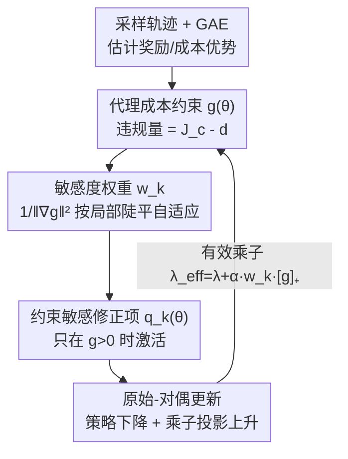

# CSPO: Constraint-Sensitive Policy Optimization for Safe Reinforcement Learning

**会议**: ICML2026  
**arXiv**: [2606.14415](https://arxiv.org/abs/2606.14415)  
**代码**: https://github.com/serval-uni-lu/CSPO  
**领域**: 安全强化学习 / 约束策略优化  
**关键词**: 安全RL, CMDP, 原始-对偶, 约束敏感, 拉格朗日乘子

## 一句话总结
针对安全 RL 里原始-对偶方法"对偶滞后→约束修正延迟→在边界附近震荡"的老毛病，CSPO 把"到安全边界的最短带符号距离"作为约束敏感的修正项加进策略更新，按约束梯度范数自适应地调节纠偏力度，从而更快更稳地回到可行域，且不改变原约束问题的 KKT 解。

## 研究背景与动机
**领域现状**：安全 RL 通常用约束马尔可夫决策过程（CMDP）建模——在最大化回报的同时让累计成本低于阈值。主流有三条路线：二阶信赖域法（CPO/PCPO/C-TRPO，理论强但要算 Fisher 矩阵求逆、昂贵）、一阶原始-对偶拉格朗日法（PPO-Lag 等，联合更新策略和乘子，扩展性好）、以及惩罚法（把成本罚项并进奖励）。

**现有痛点**：① 惩罚法要精调（往往很大的）惩罚因子，否则要么过度保守、要么持续违规；② 原始-对偶法有臭名昭著的**对偶滞后（dual-lag）**——乘子小时不安全、乘子大时又过度保守，学习动态呈震荡；③ 更关键的是，所有现有方法都**无视约束函数的局部敏感度**：平坦区域需要更强的纠偏才能回到可行域，陡峭区域则需要更谨慎的小步以免过冲，但现有方法对违规一律均匀惩罚，在陡边界附近就会过冲、震荡、低效。

**核心矛盾**：拉格朗日乘子是个**全局、慢变**的标量，它跟不上策略在参数空间里游走时约束局部几何（陡/平）的快速变化——一个慢变的全局旋钮没法同时照顾陡区和平区。

**本文目标**：在保留一阶原始-对偶简洁性的前提下，显式利用约束的**局部一阶信息**，让纠偏力度随局部约束敏感度自适应，加速且平滑地回到可行域，同时不破坏原问题的可行集与最优解。

**核心 idea**：把"到安全边界的最短带符号距离"编码成一个**只在违规时激活、按约束梯度范数缩放**的可微修正项，相当于给乘子加一个"约束敏感的有效增量"，补偿对偶滞后。

## 方法详解

### 整体框架
CSPO 是标准 PPO 式原始-对偶安全 RL 的"增项"改造。每个 episodic 迭代里：采样轨迹 → 用 GAE 估计奖励/成本优势 → 构造代理成本约束 $g(\theta)$ → 在原始目标上加一个约束敏感修正项 $q_k(\theta)$ → 对策略做梯度下降、对乘子做投影梯度上升。整条流水线和 PPO-Lag 几乎一样，唯一的新增是那个由"最短距离公式"导出的修正项及其敏感度权重 $w_k$。

### 关键设计

**1. 最短带符号距离：把"回到边界要走多远"算成约束敏感的修正量**

痛点是均匀惩罚不分陡平。作者从一阶几何出发：在违规时，求"回到安全边界的最小参数更新"。把约束做一阶展开 $g(\theta_{k+1})\approx g(\theta_k)+\nabla g(\theta_k)^\top\Delta\theta$，解最小范数投影问题 $\min_{\Delta\theta}\tfrac12\|\Delta\theta\|^2$ s.t. $g(\theta_k)+\nabla g(\theta_k)^\top\Delta\theta=0$，得到

$$\Delta\theta^\star=-\frac{g(\theta_k)}{\|\nabla g(\theta_k)\|^2}\nabla g(\theta_k),\qquad \|\Delta\theta^\star\|=\frac{g(\theta_k)}{\|\nabla g(\theta_k)\|}$$

这个 $\|\Delta\theta^\star\|$ 就是从当前参数到可行集的**最短带符号距离**。关键洞察藏在分母里：修正幅度**反比于约束梯度范数** $\|\nabla g\|$——梯度大（陡边界）就走小步防过冲，梯度小（平区）就走大步快回可行。为避免一步打满在随机梯度下太激进，作者改成"按比例缩减违规" $g(\theta_{k+1})\le\sigma g(\theta_k)$，引入缩减因子 $\alpha=1-\sigma\in[0,1]$，更新幅度按比例缩为 $\alpha\,g/\|\nabla g\|$。

**2. 约束敏感目标：把几何修正步变成可微目标，且在可行点恒为零**

直接把上面的一步更新硬塞进训练不优雅、也不可微。作者把这套几何编码成一个平滑可微目标：

$$q_k(\theta)=\frac{\alpha}{2}\,w_k\,[g(\theta)]_+^2,\qquad w_k=\frac{1}{\|\nabla_\theta g(\theta_k)\|^2+\epsilon}$$

其中 $[x]_+=\max(x,0)$ 保证修正**只在违规 $g(\theta)>0$ 时激活**，$w_k$ 就是约束敏感权重（陡区小、平区大），$\epsilon$ 是数值稳定项。这个设计有两个妙处：一是 $q_k$ 在 $\theta_k$ 处的梯度**恰好复现**最短距离公式 (11) 给的更新，把"几何恢复步"变成可用 Adam 等一阶优化器求解的目标；二是它在可行点处恒等于零，从而**不改变原约束问题**——这就引出下一个设计。

**3. 有效乘子与 KKT 等价：用约束敏感增量补偿对偶滞后，又不动最优解**

把 $q_k$ 并进拉格朗日量 $\mathcal{L}_k(\theta,\lambda)=-L_R(\theta)+q_k(\theta)+\lambda g(\theta)$，对其求策略梯度，整理出

$$\nabla_\theta\mathcal{L}_k=-\nabla_\theta L_R+\big(\underbrace{\lambda+\alpha w_k[g(\theta)]_+}_{\lambda_{\mathrm{eff}}}\big)\nabla_\theta g$$

也就是说 CSPO 等价于用一个**有效乘子** $\lambda_{\mathrm{eff}}=\lambda+\alpha w_k[g]_+$ 在做更新：一旦违规，$\lambda_{\mathrm{eff}}$ 立刻被那个约束敏感增量顶起来加强纠偏，而慢变的 $\lambda$ 仍负责长期约束满足——这正是对"对偶滞后"的直接补偿。同时作者用命题证明：由于修正项在可行点为零，CSPO 的增广问题 (13) 与原约束问题 (6) **共享同一组 KKT 解和同一可行集**，所以是"免费"的加速而非改变了优化目标。收敛性上，在光滑性与有界假设下，迭代以 $O(L^3G^2\lambda_{\max}^2/\varepsilon^6)$ 速率逼近 $\varepsilon$-稳定点（非凸-凹 minimax）。CSPO 还自然扩展到多约束：每个约束 $g_i$ 配各自的 $q_k^{(i)}$ 和 $w_k^{(i)}$，各约束按自身局部敏感度独立纠偏。

### 损失函数 / 训练策略
实际实现套用 PPO 的截断代理：奖励项 $\hat L_R$ 用 $\min$ 截断、成本项 $\hat L_C$ 用 $\max$ 截断，代理约束 $\hat g(\theta)=J_c-d+\tfrac{1}{1-\gamma}\hat L_C$。最终目标

$$\mathcal{L}_{\mathrm{CSPO}}(\theta)=-\hat L_R(\theta)+\frac{\alpha}{2}w[\hat g(\theta)]_+^2+\lambda\hat g(\theta)$$

权重 $w$ 在每个策略更新步开头用当前参数算一次、随后 **detach 当常数**（并加截断与 EMA 平滑稳住它），乘子按 $\lambda_{k+1}=[\lambda_k+\eta_\lambda(J_c-d)]_+$ 投影更新。计算开销几乎为零——只比一阶拉格朗日基线多一次约束梯度评估（用来算 $w_k$）。理论上还给了内循环 $O(1/T)$ 稳定性率，以及"当 $g(\theta_t)>\delta/(\alpha w\|\nabla g\|^2)$ 时单步 CSPO 更新保证约束违规下降"的局部下降命题。

## 实验关键数据

### 主实验
在 Safety Gymnasium 的 9 个连续控制安全任务（5 locomotion + 4 navigation）上，对比 11 个安全 RL 基线（PPO-Lag、CPPO-PID、FOCOPS、CUP、P3O、IPO、EPO、APPO、CPO、PCPO、C-TRPO），5 个种子取 IQM + bootstrap 95% CI。约束阈值在括号里，只在满足约束的方法中加粗最优回报。

| 环境 (阈值) | 指标 | CSPO | 代表性基线 | 说明 |
|------|------|------|-----------|------|
| Ant (C=25) | 回报 | **3231.6** ±84.8 | PPO-Lag 3134 / CPPO-PID 3190 | CSPO 成本 24.5 守约且回报最高 |
| Ant (C=25) | 成本 | 24.5 ±0.3 | 多数基线 ≥25 或过保守 | 贴边但不越界 |
| Humanoid (C=25) | 回报 | **6496.9** ±74.3 | PPO-Lag 6415 / CPPO-PID 6417 | 回报领先且成本 18.0 远低于阈值 |
| Humanoid (C=25) | 成本 | 18.0 ±3.1 | APPO 25.3 | 守约更稳 |

整体结论：CSPO 在满足成本约束的前提下取得有竞争力或更优的受约束回报，**navigation 任务上的增益尤其明显**。

### 安全恢复指标（本文新增）
作者引入三个专门刻画"安全恢复动态"的指标，这是本文评估上的差异点：

| 指标 | 定义 | 衡量什么 |
|------|------|----------|
| Time-To-Safety (TTS) | 从违规恢复到可行所需时间 | 恢复**快不快** |
| Reward Preservation (RP) | 恢复期间保留的奖励比例 | 恢复时奖励**掉不掉** |
| Violation Frequency (VF) | 训练全程违反约束的频率 | 整体**安不安全** |

实验显示 CSPO 在 TTS 上更快回到可行域、RP 上更好地保留奖励、VF 上更少违规，整体安全收敛更快更稳。

### 关键发现
- **约束敏感是增益主因**：有效乘子里的 $\alpha w_k[g]_+$ 项让纠偏力度随局部陡平自适应，正是它压住了原始-对偶在陡边界的过冲与震荡。
- **navigation 收益最大**：导航任务的不安全区域边界往往更陡峭/不规则，约束敏感缩放的优势在这里被放大。
- **$\alpha$ 控制纠偏激进度**：局部下降命题表明 $\alpha$ 越大，越小的违规就触发可行性导向更新；$\alpha$ 越小则允许更宽的奖励-约束权衡再启动纠偏。

## 亮点与洞察
- **"最短距离→可微目标→有效乘子"三段一气呵成**：从一个干净的投影几何问题出发，最后落到"给乘子加一个约束敏感增量"，理论动机和实现都极简洁，是可复用的推导范式。
- **几乎零开销的加速**：只多一次约束梯度评估，$w_k$ 还 detach 成常数，相比二阶法的 Fisher 求逆几乎免费就拿到稳定性收益。
- **KKT 等价是关键卖点**：修正项在可行点恒为零 → 不改变原问题最优解，等于"只在违规时帮一把、可行时完全隐身"，这比惩罚法那种永久改变目标的做法干净得多。
- **三个恢复指标可迁移**：TTS/RP/VF 把"安全恢复"这件以前只能看曲线感觉的事量化了，可作为安全 RL 的通用评估补充。

## 局限与展望
- **依赖一阶展开的局部有效性**：最短距离公式建立在 $g$ 的一阶展开上，只在小步、信赖域内成立；约束高度非线性或步长偏大时，敏感度权重的估计可能失真。
- **$w_k$ 需要工程稳定化**：原文明确要对 $w_k$ 加截断和 EMA 平滑，说明梯度范数在训练中可能剧烈波动，鲁棒性部分靠 trick 撑着。
- **收敛率偏松**：$O(\varepsilon^{-6})$ 的速率在非凸-凹 minimax 里是常见但很弱的界，实际收敛快主要靠经验。
- **基准局限**：只在 Safety Gymnasium 仿真上验证，未触及真实机器人或高随机性环境；多约束扩展虽给了形式，但主实验仍以单约束为主。

## 相关工作与启发
- **vs PPO-Lag / 经典拉格朗日**：他们用单个慢变全局乘子，本文加一个**约束敏感的有效乘子增量**补偿对偶滞后，从源头治震荡。
- **vs CPO / PCPO / C-TRPO（二阶信赖域）**：他们靠 Fisher 求逆拿强保证但昂贵，本文只用一阶信息+一次额外梯度评估就达到可比/更优的受约束回报。
- **vs P3O / IPO / EPO（惩罚法）**：惩罚法要精调惩罚因子且永久改变目标，本文的修正项在可行点恒为零、保持 KKT 等价，不引入额外可调超参的同时避免过保守/持续违规。

## 评分
- 新颖性: ⭐⭐⭐⭐ 把约束局部几何敏感度引入原始-对偶，视角清晰且推导优雅
- 实验充分度: ⭐⭐⭐⭐ 9 任务 11 基线 5 种子，外加三个新恢复指标，较扎实
- 写作质量: ⭐⭐⭐⭐ 几何动机→可微目标→等价性证明逻辑顺畅
- 价值: ⭐⭐⭐⭐ 近零开销即插即用，对实际安全 RL 部署有吸引力

<!-- RELATED:START -->

## 相关论文

- [\[ICML 2026\] Safe Reinforcement Learning with Preference-Based Constraint Inference](safe_reinforcement_learning_with_preference-based_constraint_inference.md)
- [\[ICML 2025\] Extreme Value Policy Optimization for Safe Reinforcement Learning](../../ICML2025/reinforcement_learning/extreme_value_policy_optimization_for_safe_reinforcement_learning.md)
- [\[ICML 2026\] Safe In-Context Reinforcement Learning](safe_in-context_reinforcement_learning.md)
- [\[ICML 2026\] Learning to Route Languages for Multilingual Policy Optimization](learning_to_route_languages_for_multilingual_policy_optimization.md)
- [\[NeurIPS 2025\] Online Optimization for Offline Safe Reinforcement Learning](../../NeurIPS2025/reinforcement_learning/online_optimization_for_offline_safe_reinforcement_learning.md)

<!-- RELATED:END -->
