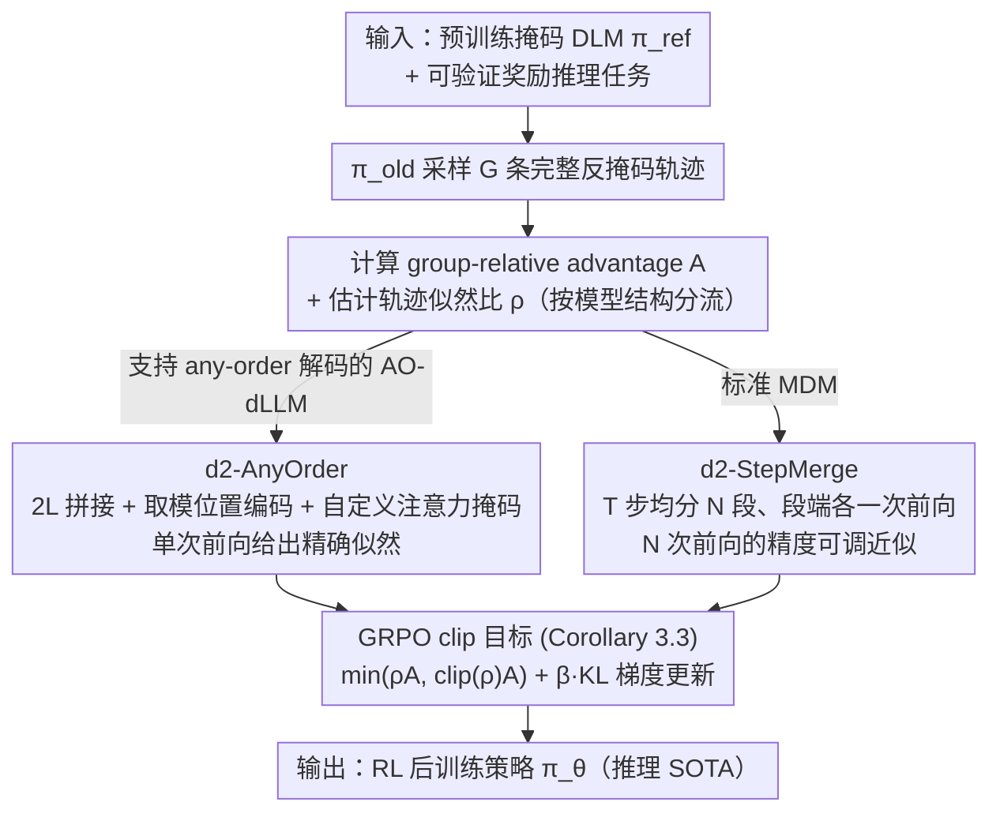

# d2: Improving Reasoning in Diffusion Language Models via Trajectory Likelihood Estimation

**会议**: ICML 2026  
**arXiv**: [2509.21474](https://arxiv.org/abs/2509.21474)  
**代码**: https://guanghanwang.com/d2  
**领域**: LLM推理 / 扩散语言模型 / 强化学习  
**关键词**: 掩码扩散语言模型, GRPO, 轨迹似然估计, any-order 解码, 推理后训练

## 一句话总结
本文为掩码扩散语言模型（masked DLM）提出 d2 强化学习框架，核心是用两种"轨迹似然估计器"（d2-AnyOrder 对支持 any-order 解码的模型给出单次前向的精确估计，d2-StepMerge 对标准 MDM 给出可调精度的近似估计）来正确实现 GRPO，使 LLaDA-8B-Instruct 在 Sudoku/Countdown/GSM8K/MATH500 上分别达到 91.9% / 56.6% / 85.0% / 41.6%，全面超越 d1、wd1 等扩散 RL 基线。

## 研究背景与动机
**领域现状**：扩散语言模型（DLM, 如 LLaDA、Dream、Eso-LM）凭借可控生成与并行解码已经成为自回归 LLM 的有力竞争者，但要让 DLM 像 R1 / o1 那样具备"推理"能力，主流路线是套用 GRPO 这类策略梯度方法做后训练。

**现有痛点**：GRPO 的目标函数中含有重要性比 $\rho_l = \pi_\theta(x_l|x_{<l},q) / \pi_{\text{old}}(x_l|x_{<l},q)$，这在自回归 LLM 上一次前向就能算完；而 DLM 的精确似然在数学上对扩散步数 $T$ 是不可解的，"朴素"地按 $T$ 步分解需要 $T$ 次前向，计算上不可接受。diffu-GRPO（d1）等已有工作直接用 $N=1$ 的稀疏近似偷懒，结果就是似然估计严重失真。

**核心矛盾**：扩散 RL 的成败本质上取决于轨迹似然估计的保真度，而保真度又和计算预算正面冲突——精确就慢、近似就偏。

**本文目标**：分两步解决：(1) 把扩散版的 GRPO 目标函数严格推导出来，让"似然估计"这个组件被显式地暴露出来；(2) 为不同结构的 DLM 设计配套的高效似然估计器。

**切入角度**：作者发现"轨迹似然"才是真正的瓶颈，并观察到一类"any-order 自回归 DLM"在结构上允许把整条轨迹的似然打包进一次 transformer 前向；对不支持这个性质的标准 MDM，则借鉴 block composite likelihood 的思想分段合并扩散步。

**核心 idea**：用"针对模型类别定制的轨迹似然估计器"替代"朴素 $T$ 次前向"或"单步稀疏近似"，从而正确地实现 GRPO 在掩码 DLM 上的策略梯度。

## 方法详解

### 整体框架
输入是一个预训练的掩码 DLM $\pi_{\text{ref}}$（如 LLaDA-8B-Instruct 或 Eso-LM）与一个带可验证奖励 $r(x, q)$ 的推理任务（Sudoku 检查器 / GSM8K 答案匹配等）。框架分三步：(1) 用旧策略 $\pi_{\text{old}}$ 在 group size $G$ 下采样 $G$ 条完整反掩码轨迹 $x_{0:T}^{1:L}$；(2) 计算 group-relative advantage $A^{(i)}$，并用 d2-AnyOrder 或 d2-StepMerge 估计 $\pi_\theta / \pi_{\text{old}} / \pi_{\text{ref}}$ 在该轨迹上的似然；(3) 按下面 Corollary 3.3 的 GRPO 目标做梯度更新。最终输出是经过 RL 后训练的策略 $\pi_\theta$，在推理任务上达到 SOTA。

正文先把 DLM 上的策略梯度严格化为 Theorem 3.1：在 $\theta = \theta_{\text{old}}$ 处，$\nabla_\theta J(\theta) = \nabla_\theta \mathbb{E}_{x_{0:T}^{1:L} \sim \pi_{\text{old}}}[r(x_0^{1:L}, q) \sum_{t=0}^{T-1} \sum_{l=1}^{L} \mathbf{1}_{t,l} \cdot \rho_t^l]$，其中 $\mathbf{1}_{t,l} = \mathbf{1}\{x_{t+1}^l = m, x_t^l \neq m\}$ 表示"在第 $t$ 步把位置 $l$ 解码出来"，$\rho_t^l = \pi_\theta(x_t^l | x_{t+1}^{1:L}, q) / \pi_{\text{old}}(x_t^l | x_{t+1}^{1:L}, q)$ 是按扩散步分摊的重要性比。再加上 advantage、clip 和 KL 约束就得到 GRPO 目标 (Corollary 3.3)。剩下的工程问题就是：如何高效估出这些 $\rho_t^l$——这正是下面两个估计器各自要解决的，按模型是否支持 any-order 解码分流。

### 关键设计

**1. d2-AnyOrder：把整条轨迹的似然压进一次前向，给出精确估计**

对天然支持 any-order 解码的 DLM（AO-dLLM，如 Eso-LM、AO-finetuned Qwen3-1.7B、any-order causal LLaDA），整条轨迹的似然可以写成 $\pi(x_{0:T}^{1:L}) = \prod_{l=1}^L \pi(x_0^{\sigma(l)} | x_0^{\sigma(<l)})$，问题是怎么不花 $L$ 次前向就把这 $L$ 个条件概率全算出来。d2-AnyOrder 的做法是构造一条长度 $2L$ 的拼接序列 $x_0^{1:L} \oplus m^{L+1:2L}$，让 token 和它对应的 mask 共享同一位置编码 $\text{pos}_l = l \bmod L$，再配一套自定义注意力掩码——clean token $x_0^{\sigma(l)}$ 只看 $x_0^{\sigma(\leq l)}$，mask token $m_{L+\sigma(l)}$ 只看 $x_0^{\sigma(<l)} \cup \{m_{L+\sigma(l)}\}$。这样一次前向就同时吐出所有 $L$ 个条件概率 $\pi^{AO}(x_0^l | x_0^{1:L} \oplus m^{L+1:2L})$，得到 $\rho_{n,l}^{AO} = \pi_\theta^{AO}(\cdot) / \pi_{\text{old}}^{AO}(\cdot)$ 后直接代进 GRPO clip 目标 (Eq. 8)。它精确无偏的前提是采样过程满足"Independent Masks（mask 之间不互相注意）+ Order Causality（已解码 token 只看更早解码的）"两条性质，这靠 any-order 解码算法 (Algorithm 1) 在采样阶段保证。作者还做了反证：把 d2-AnyOrder 直接套到原版 LLaDA-8B-Instruct 上，估出的平均每 token log-likelihood 是 -3.051，而真值是 -0.128，KL 高达 2.334——可见标准 MDM 默认并不满足这两条性质，必须先用 Sahoo et al. 2026 或 Arriola & Kuleshov 2026 的专门 AO 训练范式适配，AnyOrder 才能用。

**2. d2-StepMerge：用 $N\ll T$ 次前向做精度可调的分段近似**

不支持 any-order 解码的标准 MDM（如原版 LLaDA-8B-Instruct）用不了 AnyOrder，但又付不起 $T$ 次前向的精确似然。StepMerge 借鉴 block composite likelihood，把 $T$ 步轨迹均分成 $N$ 段，用每段端点的一次前向输出代理"段内所有 token 的似然"：$\pi(x_{0:T}^{1:L}) \approx \prod_{n=0}^{N-1} \prod_{l=1}^{L} \mathbf{1}_{n,l} \cdot \pi(x_{nT/N}^l | x_{(n+1)T/N}^{1:L})$，对应 GRPO (Eq. 9) 里的 $\rho_n^l$ 就是段端比 $\pi_\theta(x_{nT/N}^l | x_{(n+1)T/N}^{1:L}, q) / \pi_{\text{old}}(\cdot)$。这里 $N$ 是一个 compute-bias 旋钮：$N=1$ 退化成 diffu-GRPO（最便宜也最失真），$N=T$ 就是精确的完整轨迹。它之所以可控，是因为 Theorem 4.1 给了上界 $D_N \leq L \cdot \log(T/N + 1) + L \cdot \epsilon_{\text{block}}$——误差随 $N$ 对数衰减，实测 $D_N$（与完整分解的 KL）也随 $N$ 单调下降（Figure 5），Sudoku 上 $N=16$ 就追平了 $N=32/64$ 却省下大量 FLOPs，这正解释了"为什么 d1（$N=1$）会差到学不动"。

### 损失函数 / 训练策略
两套估计器各自对应一条 clipped GRPO loss（Eq. 8 / Eq. 9），结构上都遵循 "$\min(\rho A, \text{clip}(\rho, 1-\epsilon, 1+\epsilon) A) + \beta D_{KL}(\pi_\theta \| \pi_{\text{ref}})$" 的 PPO 风格信任域写法，并按 $1/L$ 归一化序列长度。Group size $G = 6$，batch 含 16 道题，每步解码 2 个 token，奖励都是可验证奖励（数值正误、Sudoku 检查器、Countdown 检查器）；不依赖 SFT 也不依赖外部 chain-of-thought 数据。

## 实验关键数据

### 主实验

应用 d2 到 LLaDA-8B-Instruct，在四个推理基准上全面对比已有扩散 RL 框架（无 SFT）：

| 数据集 | 指标 | d2 (本文) | wd1 | d1 | LLaDA | 提升 (vs 之前最佳) |
|--------|------|-----------|------|-----|--------|----|
| Sudoku | Acc | **91.9%** | 25.2% | 22.1% | 11.8% | **+66.7pp** |
| Countdown | Acc | **56.6%** | 51.2% | 42.2% | 19.9% | +5.4pp |
| GSM8K | Acc | **85.0%** | 82.3% | 82.1% | 75.7% | +2.7pp |
| MATH500 | Acc | **41.6%** | 39.0% | 40.2% | 35.4% | +1.4pp |

Sudoku 的 +66.7pp 是质变——说明 d1/wd1 在严格符号逻辑任务上几乎学不动，而准确的轨迹似然估计能把策略梯度方向校正过来。

另外在 AO-finetuned Qwen3-1.7B 上，AO SFT + d2-AnyOrder 在 GSM8K 达 67%，超过 AO SFT + diffu-GRPO 的 63%；在毒性 steering 实验（Eso-LM, 190M）上 d2-AnyOrder 在 $1.25 \times 10^{17}$ FLOPs 处达到 -0.7，而 DDPO 仅 -8.6。

### 消融实验

| 配置 | Sudoku Acc | 说明 |
|------|---------|------|
| d2-StepMerge, $N=1$ | ≈ d1 (22.1%) | 等价于 diffu-GRPO，似然估计严重失真 |
| d2-StepMerge, $N=4$ | 不收敛 | 估计仍偏离，RL 信号噪声大 |
| d2-StepMerge, $N=16$ | 91.9% | **甜蜜点**：性能与 $N=32, 64$ 持平，FLOPs 更省 |
| d2-StepMerge, $N=32$ | ≈ 91.9% | 性能饱和，FLOPs 上涨 |
| d2-AnyOrder vs d2-StepMerge ($N=8$, Eso-LM 毒性) | -0.7 vs -1.5 @ $1.25\times10^{17}$ FLOPs | 在支持 AO 的模型上，精确估计明显胜过近似估计 |
| d2-AnyOrder 直接套 LLaDA-8B (无 AO 训练) | per-token LL -3.051 vs GT -0.128 | KL=2.334，**说明 AO 估计器需要配套训练范式** |

### 关键发现
- **似然估计精度才是扩散 RL 的命门**：d1（$N=1$）在 Sudoku 上只能学到 22.1%，d2-StepMerge ($N=16$) 直接拉到 91.9%——同样是 GRPO 框架，差别只在似然估计精度。
- **AO 估计器需要"采样阶段+训练阶段"协同**：把 d2-AnyOrder 直接套到原版 LLaDA 上 KL=2.334，必须先用 Eso-LM / AO-causal LLaDA 的训练范式让模型适配独立掩码 + 顺序因果，否则估计器会瞎给信号。
- **$N$ 的取值有明显平台期**：Theorem 4.1 的对数上界与实测曲线一致——$N$ 增大初期收益陡，到 $N=16$ 后 marginal benefit 几乎为零，给工程上选超参提供了明确依据。

## 亮点与洞察
- **"位置编码取模 + 自定义注意力掩码"实现 2L 并行似然**：d2-AnyOrder 把 $L$ 个条件概率打包进单次前向的工程实现很优雅——长度 $2L$ 的 token-mask 拼接 + $\text{pos} = l \bmod L$ 让 transformer 在不改架构、不增层数的前提下完成"$L$ 个 AR 步合一"，这套 trick 可以迁移到任何需要"批量条件概率"的场景（如对比学习、Bayesian inference of token order）。
- **把 diffu-GRPO 重新解读为 $N=1$ 特例**：作者用 Remark 3.4 把过去工作"降级"成自己框架的退化情况，这一手既给了对比，又强化了"通用框架"的叙事——非常成熟的论文写作方式。
- **Theorem 4.1 的对数误差界**：$D_N \leq L \log(T/N + 1) + L \epsilon_{\text{block}}$ 揭示了 compute-bias 的对数衰减率，这意味着"性能-计算"曲线在中等 $N$ 处就饱和——为工程选 $N=16$ 给出了可论证的依据，不是纯炼丹。

## 局限与展望
- **AO 估计器需要配套训练**：d2-AnyOrder 不能即插即用到任意 MDM 上，要先做 AO finetuning（Eso-LM 或 AO-causal LLaDA 的 recipe），这一前置成本在论文中被弱化了——对于已经训好但未支持 AO 的大模型（如原版 Dream），实际上只能退回 d2-StepMerge。
- **奖励仍是可验证奖励**：实验全部基于答案正误 / 规则检查器这类稀疏 + 二元的奖励，没探讨在 reward model 类（如 RLHF）或 dense reward 下 d2 是否仍稳定，而扩散 RL 在 dense reward 下的方差行为很可能与 AR 不同。
- **没有比较"等 wall-clock"而只比 FLOPs**：d2-StepMerge 的 $N$ 次前向虽然 FLOPs 可控，但序列依赖更强，并行度低于一次前向的 d2-AnyOrder——真实部署中 $N$ 的选择可能比论文展示的更保守。
- **可改进方向**：把 StepMerge 的 $N$ 做成训练时自适应（按梯度方差 / KL 反馈调）；将 AO 估计器扩展到带"前后向"双向解码的模型上；或者把这套似然估计器移植到 dLLM 的 DPO / SimPO 等非 GRPO 后训练流程上。

## 相关工作与启发
- **vs d1 (diffu-GRPO, Zhao et al. 2025)**：他们把 GRPO 直接搬到 MDM 上并取 $N=1$ 的稀疏似然；本文证明这是 d2-StepMerge 的退化情形，并通过 $N=16$ 把 Sudoku 从 22.1% 拉到 91.9%——本文优势是把"似然估计"这个被忽视的关键组件显式化。
- **vs wd1 (Tang et al. 2026)**：wd1 走另一条路——把策略优化重写成加权似然目标以消除对策略比的依赖；本文则坚持 PPO 风格的 ratio + clip，但靠精确 ratio 取胜，证明只要 ratio 估对了，clip 框架并不需要被绕开。
- **vs DDPO (Black et al. 2024)**：DDPO 是连续扩散模型上的 PG，文本场景在 prompt-free 设定（如毒性 steering）下表现极弱（-8.6 vs d2 的 -0.7）；本文把 DDPO 的 latent-marginal 思路换成 MDM 专属的离散因式分解，更对症。
- **启发**：扩散模型上的 RL 关键不在"借用哪条 AR RL 算法"，而在"如何正确估似然"——这条经验对 video / image / continuous 扩散的 RL 也成立，可以反过来看 DDPO 等连续扩散 RL 是否也有类似的"$N=1$ 误差陷阱"。

## 评分
- 新颖性: ⭐⭐⭐⭐⭐ 把扩散 RL 重新框定为"轨迹似然估计问题"，两个估计器都是非平凡的算法创新。
- 实验充分度: ⭐⭐⭐⭐ 覆盖 4 个推理基准 + 3 种 DLM 架构 + 毒性 steering，但缺 wall-clock 与 dense reward 评测。
- 写作质量: ⭐⭐⭐⭐⭐ 从 Theorem 3.1 到 Corollary 3.3 再到两个估计器的承接非常顺，把 d1 重述为 $N=1$ 特例的叙事手法成熟。
- 价值: ⭐⭐⭐⭐⭐ 把 LLaDA-8B 在 Sudoku 上从 11.8% 拉到 91.9%，是 DLM 推理领域的明确 SOTA，并给后续扩散 RL 工作划定了"必须先把似然估对"的方法论底线。

<!-- RELATED:START -->

## 相关论文

- [\[ICML 2026\] Learning Unmasking Policies for Diffusion Language Models](learning_unmasking_policies_for_diffusion_language_models.md)
- [\[ICML 2026\] Break the Block: Dynamic-size Reasoning Blocks for Diffusion Large Language Models via Monotonic Entropy Descent with Reinforcement Learning](break_the_block_dynamic-size_reasoning_blocks_for_diffusion_large_language_model.md)
- [\[ICML 2026\] The Shape of Reasoning: Topological Analysis of Reasoning Traces in Large Language Models](the_shape_of_reasoning_topological_analysis_of_reasoning_traces_in_large_languag.md)
- [\[NeurIPS 2025\] Reinforcing the Diffusion Chain of Lateral Thought with Diffusion Language Models](../../NeurIPS2025/reinforcement_learning/reinforcing_the_diffusion_chain_of_lateral_thought_with_diffusion_language_model.md)
- [\[ACL 2026\] d-TreeRPO: Towards More Reliable Policy Optimization for Diffusion Language Models](../../ACL2026/reinforcement_learning/d-treerpo_towards_more_reliable_policy_optimization_for_diffusion_language_model.md)

<!-- RELATED:END -->
