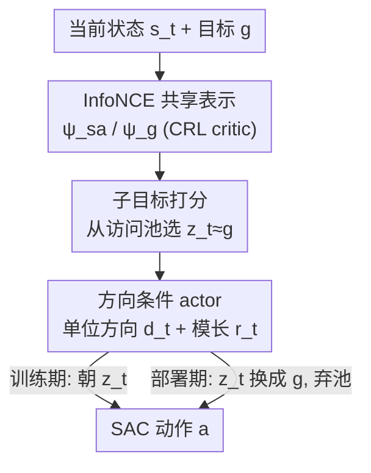

# Direction-Conditioned Policies via Compositional Subgoal Scoring for Online Goal-Conditioned Reinforcement Learning

**会议**: ICML2026  
**arXiv**: [2606.16515](https://arxiv.org/abs/2606.16515)  
**代码**: 基于 JaxGCRL（Bortkiewicz et al., 2024）实现  
**领域**: 强化学习 / 目标条件 RL  
**关键词**: 目标条件强化学习, 对比强化学习, 方向条件, 子目标打分, HJB

## 一句话总结
本文提出 DCP（Direction-Conditioned Policies），把在线目标条件 RL 里"actor 直接吃原始目标坐标"换成"actor 吃学到的表示空间里指向目标的单位方向 + 模长"，并用一个从历史访问状态里选子目标的打分规则在训练早期稳定这个方向，在九个导航/操作环境上多数指标超过对比 RL（CRL）。

## 研究背景与动机

**领域现状**：在线目标条件强化学习（GCRL）的主流是把目标 $g$ 直接拼进 actor 的输入里。对比 RL（CRL, Eysenbach et al. 2022）在此基础上用 InfoNCE 学一个表示 $\psi$，让 $\langle\psi(s,a),\psi(g)\rangle$ 估计"从 $(s,a)$ 出发能到达 $g$ 的对数可达性"，本质上把 $\psi$ 训成了一个编码环境拓扑的"准度量"（quasimetric）。但即便有了这个表示，actor 拿到的仍然是**原始目标坐标**。

**现有痛点**：当目标 $g$ 远离当前数据分布时，原始坐标在几何上是"没信息量"的——训练早期 $\psi_g(g)$ 对一个遥远的 $g$ 根本没被 InfoNCE 校准好，从它算出来的任何方向都不稳定，$\langle\psi_g(g),\psi_{sa}(s,a)\rangle$ 接近随机。这种"稀疏奖励 + 远目标"恰恰是机器人操作类任务最难的部分。

**核心矛盾**：作者从 Hamilton–Jacobi–Bellman（HJB）理论指出一个被忽视的事实——在控制仿射动力学下，最优目标条件动作**只通过目标可达距离的梯度** $\nabla_s d^*(s,g)$ 依赖于 $g$。也就是说，actor 真正需要的不是目标坐标本身，而是"朝目标走的方向"。现有方法却一直在喂坐标。

**本文目标**：把 actor 的条件输入从"目标坐标"换成"表示空间里的单位方向"，并解决一个随之而来的子问题——训练早期 $\psi_g(g)$ 没校准好、直接算方向会不稳，怎么办？

**切入角度**：用历史访问过的、且在 $\psi$ 空间里与目标对齐的子目标 $z_t$ 来代算方向（训练期），部署时再把 $z_t$ 换回 $g$。因为 $z_t$ 是真访问过的状态，它的编码已经被 InfoNCE 训练过，算出来的方向稳定；又因为 $z_t$ 被选成"在 $\psi_g$ 下最像 $g$"，朝 $z_t$ 的方向 ≈ 朝 $g$ 的方向，训练和部署的条件输入因此能对齐。

**核心 idea**：用"$\psi$ 空间里指向目标的单位方向"代替"原始目标坐标"作为 actor 条件，用子目标打分在训练早期稳定这个方向，部署时干净解耦。

## 方法详解

### 整体框架

DCP 在 CRL 的训练栈（InfoNCE critic + SAC actor）之上只改一件事：**喂给 actor 的条件对象**。整个流程是：先用 InfoNCE 学一个共享表示 $\psi$（state-action 编码器 $\psi_{sa}$ 和 goal 编码器 $\psi_g$）；rollout 时维护一个最近访问状态的池子 $\mathcal{P}$，从中按内积打分选出一个子目标 $z_t$；然后把当前状态 $s_t$ 编码到 $z_t$ 的**单位方向** $\mathbf{d}_t$ 和模长 $r_t$ 算出来，actor 吃 $[s_t,\mathbf{d}_t,r_t]$ 产生动作。子目标打分和方向条件这两块共享同一个 $(\mathbf{d}_t,r_t)$ 接口、联合训练，但在**部署时干净地解耦**：池子和打分整个去掉，方向直接用 $g$ 代替 $z_t$ 算，于是 DCP 退化成一个标准的目标条件策略，没有任何额外部署开销。

### 关键设计

**1. 方向条件 actor：把"目标坐标"换成 $\psi$ 空间里的单位方向**

这是全文的核心，直接针对"原始目标坐标几何上没信息量"这个痛点。DCP 不再把 $g$（或 $z_t$）的坐标喂给 actor，而是计算指向选中状态的单位方向和模长：

$$\mathbf{d}_t=\frac{\psi_g(z_t)-\psi_g(s_t)}{\lVert\psi_g(z_t)-\psi_g(s_t)\rVert},\qquad r_t=\lVert\psi_g(z_t)-\psi_g(s_t)\rVert$$

其中 $\mathbf{d}_t\in\mathbb{S}^{d-1}$ 是 $\psi$ 空间里从 $s_t$ 指向 $z_t$ 的单位向量，$r_t$ 编码这个条件输入的尺度。actor 吃 $[s_t,\mathbf{d}_t,r_t]$。这样做的理论依据是 HJB 下的**方向充分性**（定理 1）：控制仿射动力学 $f(s,a)=f_0(s)+G(s)a$、二次代价下，最优动作有闭式 $a^*(s,g)=-R(s)^{-1}G(s)^\top\nabla_s d^*(s,g)$，单位方向 $\widehat{\nabla_s d^*}$ 定动作朝向、模长定尺度。$(\mathbf{d}_t,r_t)$ 恰好就是这个最小充分统计量，只是把真距离 $d^*$ 换成学到的 $d_\psi(s,g):=\lVert\psi(g)-\psi(s)\rVert$。比起喂坐标，喂方向天然继承了对偶目标表示的噪声不变性，且和 HILP 在线对上——只是 HILP 需要离线对称度量监督，DCP 用 CRL 的**非对称** InfoNCE 准度量在线就能恢复方向条件，还能表达对称度量表达不了的非对称可达几何。

**2. 子目标打分：用访问过的状态稳定训练早期的方向**

最朴素的做法是直接用 $\mathbf{d}_t=\widehat{\psi_g(g)-\psi_g(s_t)}$，但训练早期 $\psi_g(g)$ 对远目标没校准，方向会乱跳，喂一个错的方向比喂原始坐标还糟。DCP 用打分规则绕开这点——从池子里选 $z_t$：

$$z_t=\arg\max_{z\in\mathcal{P}}\;\langle\psi_g(z),\psi_g(g)\rangle$$

内积选出那些 $\psi_g$ 编码与 $\psi_g(g)$ 最对齐的访问状态，即 InfoNCE 已经把它们放到和目标同一片 $\psi$ 区域里。这样算方向时两端 $\psi_g(z_t)$ 和 $\psi_g(s_t)$ **都是被对比目标训练过的编码**，而不是一个训练过、一个没校准好（$\psi_g(g)$）。实现上每 25 个 env-step 从 512 池子里采 32 个候选打分一次。等 InfoNCE 把 $\psi$ 训好后，部署时把 $z_t$ 换成 $g$ 同一套构造就校准了，池子也就不需要了——这正是"训练期脚手架、部署期拆掉"的关键。

**3. 条件接口处的规划不变性：保证训练与部署对齐**

方向条件和子目标打分能干净解耦，靠的是定理 2 给出的"条件接口处规划不变性"。它说：当学到的 $d_\psi$ 一致地逼近 $d^*$ 到 $\delta$ 以内、打分规则返回一个 $\varepsilon$-on-path 的 $z$、且梯度有下界 $m$ 时，朝 $z$（训练）和朝 $g$（部署）的两个单位方向相差有界：

$$\bigl\lVert\mathbf{d}_t^{(z)}-\mathbf{d}_t^{(g)}\bigr\rVert\le\frac{8\sqrt{2L\delta}}{m}+\frac{2\sqrt{2L\varepsilon}}{m}$$

即条件输入在训练和部署期一致，误差只到表示误差 $O(\sqrt\delta)$ 和测地松弛 $O(\sqrt\varepsilon)$。换句话说，规划不变性是从表示的逼近性质里**自然继承**到接口处的，不需要显式分层结构。作者诚实地标注这是有条件的：内积打分并不保证对任意学到的表示都满足 on-path 假设。

**4. 失败模式刻画：什么时候方向条件会失效（不可控目标子空间）**

定理 3 给出方向条件失效的精确条件。定义可控子空间 $\mathcal{C}(s):=\mathrm{im}(G(s))$，只有梯度落在这个子空间里的分量 $\nabla_s^\mathcal{C}d^*$ 才进入动作选择。当这个可控分量很小（$\lVert\nabla_s^\mathcal{C}d^*\rVert\le\rho\lVert\nabla_s d^*\rVert$，$\rho\ll1$）时，方向信号 $\mathbf{d}_t$ 就没信息量。这条理论精准预言了实验里唯一的失败案例 AntSoccer：目标是球的位置，但训练早期访问池里很少有"球被踢动"的状态，InfoNCE 收不到区分"球位移"和"蚂蚁位移"的信号，$\nabla_s d_\psi(s,g_{\text{ball}})$ 虽落在可控子空间里、却几乎不指向真正能减小球距离的方向。

### 损失函数 / 训练策略

DCP 与 CRL 共用 SAC + InfoNCE，不动 critic、replay、optimizer 和 schedule。critic 用 backward InfoNCE、负 L2 能量；actor loss 为 $\mathrm{mean}\lVert\psi_{sa}(s,a)-\psi_z\rVert+\alpha\log\pi(a\mid s,\mathbf{d}_t,r_t)$（编码器 stop-grad，加 SAC 熵项）。唯一改动是传给 actor 的条件对象和被选 waypoint 诱导的正样本目标，因此与 Scaled CRL、E-CRL 这类"改进表示"的工作正交、可叠加。

## 实验关键数据

### 主实验

九个环境（导航 + 操作）、每个五个种子，与同架构同超参同预算的 CRL 做受控接口对比。两个指标：time near goal（在目标域内的平均时步，主指标）和 success ≥1（至少进入一次目标域的回合占比）。

| 环境 | 任务类型 | Time Near Goal | Success ≥1 |
|------|----------|----------------|------------|
| AntMaze Big | 导航 | DCP↑ | DCP↑ |
| AntMaze Hardest | 导航 | DCP↑ | DCP↑ |
| Ant U-Maze | 导航 | CRL↓ | DCP↑ |
| Humanoid U-Maze | 导航 | DCP↑ | DCP↑ |
| AntPush | 导航+操作 | DCP↑ | ≈ |
| PusherEasy/Hard/Hard-Far | 操作 | DCP↑ | DCP↑ |
| AntSoccer | 操作 | CRL↓ | CRL↓ |

DCP 在九个环境多数最终指标上超过 CRL，增益最大集中在操作和带障碍交互的任务（Pusher 系列、AntPush）以及高维导航（268 维 Humanoid U-Maze，DCP 是唯一持续有非零进展的）。唯一失败是 AntSoccer，且失败原因与定理 3 预言的"不可控目标子空间"一致。

### 消融与零样本部署

| 配置 | 关键发现 | 说明 |
|------|---------|------|
| SSGC（条件用原始子目标坐标 $z_t$） | 训练期可用、部署期掉点 | 隔离"方向抽象"的贡献：训练/测试坐标分布不一致 |
| CRL（条件用原始目标 $g$） | baseline | 同架构同超参，只差条件对象 |
| PusherHard-Far（目标限远弧） | DCP 仍领先 | 验证对目标几何的鲁棒性 |
| 周期扰动零样本部署 | DCP 增益更稳 | 每 100 步用 10 步随机动作，DCP 因每步重算 $\mathbf{d}_t$ 受益更多 |

周期扰动部署（Table 2，3 种子）很说明问题：在 AntPush 上 DCP 累计可达提升 $+22.9$ 而 CRL 是 $-7.3$（差 $+30.2$）；PusherEasy 上 DCP $+20.8$、CRL $0.0$。作者解释这是因为 DCP 每步从当前状态重算方向，扰动产生的偏移会触发一个"新鲜的纠正输入"，而 CRL 只读静态目标坐标没有这个通道。

### 关键发现
- **方向抽象是增益主因**：SSGC（同样的打分但条件用原始子目标坐标）在多个操作任务上反而落后 CRL，说明光有子目标打分不够，把训练/部署都映射到同一个 $\psi$ 空间方向才是关键——它消除了坐标分布的 train–eval 错配。
- **难度越高 DCP 越有用**：增益随任务难度上升，操作/障碍交互/高维身体上最明显；简单低维迷宫上 SSGC 也能打平。
- **失败可被理论预言**：AntSoccer 的崩溃不是偶然，而是"目标定义在球上、访问池早期暴露不出球相关方向"导致学到的梯度落入信息量极低的可控子空间，恰好命中定理 3 的失败 regime。

## 亮点与洞察
- 把 HJB 的"最优动作只通过价值梯度依赖目标"这条经典控制理论结果，落到在线 CRL 的 InfoNCE 准度量上，给"喂方向而非喂坐标"一个干净的理论依据——而且方向充分性、规划不变性、失败刻画三条定理形成闭环（连失败案例都被预言）。
- "训练期用访问过的子目标代算方向、部署期换回真目标"是个很巧的工程-理论结合：既绕开了早期 $\psi_g(g)$ 没校准的问题，又靠 $z_t$ 在 $\psi$ 空间对齐 $g$ 保证训练/部署一致，且部署零额外开销（不像 landmark graph / planner 那样测试时还要跑搜索）。
- 整个方法是"flat"的——单一方向条件 actor + 一个打分规则共享一个 $\psi$，不需要显式两级分层策略，却拿到了类似分层方法的长程收益。这个"接口级改进"的思路可迁移到任何用对比/度量表示的目标条件方法上。

## 局限与展望
- 规划不变性（定理 2）依赖 on-path 假设，而内积打分**不保证**对任意学到的表示都满足该假设，作者已诚实标注；这意味着理论保证在某些表示下可能失效。
- AntSoccer 暴露了根本局限：当目标定义在一个早期访问池难以充分探索的实体（如可被推动的球）上时，InfoNCE 学到的梯度会失真，方向条件直接崩。这类"目标实体探索不足"的场景需要额外的探索机制配合。
- 实验是"单一强 backbone（CRL）内的受控接口对比"，不是跨所有 GCRL 家族的全面 benchmark，也没和离线 GCRL（HIQL 等）正面比；增益的普适性还需在更多 backbone（Scaled CRL / E-CRL）上验证叠加效果。

## 相关工作与启发
- **vs CRL（Eysenbach et al. 2022）**：CRL 学好 $\psi$ 但 actor 仍吃原始目标坐标；DCP 在完全相同的 critic/replay/优化器/预算下只改 actor 条件对象，是对"actor 条件接口"的改进，与改进表示的工作正交可叠加。
- **vs HILP（Park et al. 2024b）**：HILP 也条件于度量方向，但需要离线对称 Hilbert 度量监督；DCP 用 CRL 的非对称 InfoNCE 准度量在线恢复方向条件，能表达非对称可达几何。
- **vs L3P / landmark planning（Zhang et al. 2020）**：L3P 在部署时要维护 landmark graph 并跑图搜索；DCP 只把子目标当训练期脚手架，部署期无图、无 planner、无 waypoint 池。
- **vs QRL / Eik-QRL（Wang et al. 2023; Giammarino & Qureshi 2025）**：这些工作学显式准度量但用于**价值学习**；DCP 是据作者所知第一个**消费这个学到的一致准度量梯度来做 actor 条件**的在线方法。

## 评分
- 新颖性: ⭐⭐⭐⭐⭐ 把 HJB 方向充分性落到在线 InfoNCE 准度量、且第一个用它做 actor 条件，理论与算法结合干净
- 实验充分度: ⭐⭐⭐⭐ 九环境五种子受控对比 + 零样本部署消融，但限于单一 CRL backbone、未跨家族
- 写作质量: ⭐⭐⭐⭐⭐ 三定理闭环、连失败案例都被理论预言并诚实标注假设条件
- 价值: ⭐⭐⭐⭐ "接口级改进"思路可迁移到任意度量/对比表示的目标条件 RL，且部署零额外开销

<!-- RELATED:START -->

## 相关论文

- [\[ICML 2026\] Compositional Transduction with Latent Analogies for Offline Goal-Conditioned Reinforcement Learning](compositional_transduction_with_latent_analogies_for_offline_goal-conditioned_re.md)
- [\[ICML 2026\] Latent Representation Alignment for Offline Goal-Conditioned Reinforcement Learning](latent_representation_alignment_for_offline_goal-conditioned_reinforcement_learn.md)
- [\[CVPR 2026\] MangoBench: A Benchmark for Multi-Agent Goal-Conditioned Offline Reinforcement Learning](../../CVPR2026/reinforcement_learning/mangobench_a_benchmark_for_multi-agent_goal-conditioned_offline_reinforcement_le.md)
- [\[AAAI 2026\] First-Order Representation Languages for Goal-Conditioned RL](../../AAAI2026/reinforcement_learning/first-order_representation_languages_for_goal-conditioned_rl.md)
- [\[ICLR 2026\] InFOM: Intention-Conditioned Flow Occupancy Models](../../ICLR2026/reinforcement_learning/infom_intention_flow_occupancy.md)

<!-- RELATED:END -->
