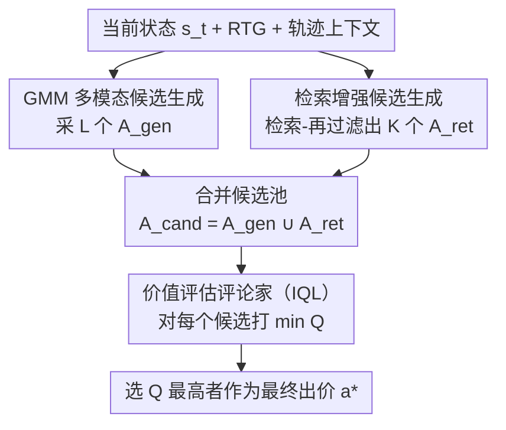

# DRIVE: Distributional and Retrieval-Augmented Bidding with Value Evaluation

**会议**: ICML 2026  
**arXiv**: [2606.14192](https://arxiv.org/abs/2606.14192)  
**代码**: 未公开  
**领域**: 强化学习 / 离线RL / 自动竞价  
**关键词**: 自动竞价, 离线强化学习, Decision Transformer, 检索增强, 价值评估

## 一句话总结
针对广告实时竞价中 Decision Transformer 类方法"把多种有效出价策略平均成一个不上不下的烂动作"和"稀疏长尾流量下乱出价"两大毛病，DRIVE 把**候选动作生成**和**最终决策**解耦：用高斯混合（GMM）头生成多模态候选、再从历史高质量决策里检索候选、最后用 IQL 价值评论家给所有候选打分选最优出价，在 AuctionNet 上平均分从最强基线的 378.4 提到 386.6，并能即插即用地嫁接到多种 DT 类方法上。

## 研究背景与动机
**领域现状**：自动竞价（auto-bidding）是实时广告系统的核心，要在预算和 CPA（每行动成本）约束下优化长期收益。由于线上探索（真金白银地试错出价）风险太高，离线强化学习（offline RL，如 CQL）成了必选项——只从历史日志里学策略。又因为竞价天然是序列决策（当前花钱直接约束未来出价能力），基于 Transformer 的序列建模（Decision Transformer, DT）凭借长程依赖建模能力被大量改造用于竞价。

**现有痛点**：直接把 DT 类架构搬到真实竞价场景有两个突出问题（论文图 1）。其一是**"平均动作陷阱"（Average Action trap）**：相似的市场状态下往往同时存在多种各自有效的出价策略（激进的高价、保守的低价都能赢），但 DT 用单峰/确定性回归（MSE 目标）建模动作，会把这些不同模式**塌缩成一个平均动作**——既不够激进抢不到曝光、又不够保守控不住成本。其二是**纯参数化导致稀疏长尾下崩**：DT 完全靠网络参数记策略，没有显式机制保留历史高质量决策，于是在低密度的长尾流量区会生成不可靠动作，哪怕数据集里其实存在好决策也用不上。

**核心矛盾**：单峰回归 + 点估计解码这两件事，和"最优竞价行为本质多模态 + 长尾区需要锚定历史经验"是直接冲突的。把生成和决策耦在一个确定性策略里，多模态被平均掉、稀疏区无依靠。

**本文目标**：（1）让策略能表达多种出价模式而不塌缩；（2）在稀疏/长尾区给决策提供显式的非参数支撑；（3）在多个候选里稳健地选出最靠谱的那一个。

**核心 idea**：**解耦候选生成与决策**——先用 GMM 头采出一批多模态候选，再从历史相似状态检索一批高质量候选，两路合并后交给一个离线价值评论家（IQL）打分，选 Q 值最高的出价。生成负责"覆盖多样性"，检索负责"兜底可靠性"，评论家负责"最终拍板"。

## 方法详解

### 整体框架
DRIVE 建在标准 Transformer 离线 RL（DT 范式）之上，把竞价建成 MDP：一个 episode 是一个竞价周期（通常一天）切成 $T$ 步，状态 $s_t$ 含 campaign 级（预算、约束等内部状态）和 market 级（外部拍卖环境）特征，动作 $a_t$ 是缩放每次曝光预测价值 $v$ 的出价参数 $\lambda_t$（最优出价的仿射形式 $b^*_i=\lambda v_i$），奖励 $r_t$ 衡量该步对总转化价值的贡献。轨迹按 return-to-go（RTG）$\hat R_t=\sum_{i\ge t}\gamma^{i-t}r_i$ 组织，DT 学的是在给定 RTG-状态上下文下预测动作。

DRIVE 在此之上加三个组件、并把"生成"与"决策"拆开：推理时，**GMM 策略头**先采出 $L$ 个候选动作覆盖多种出价模式，**检索模块**并行从历史索引里捞出 $K$ 个高质量候选，两路合成统一候选池 $\mathcal{A}_{\text{cand}}=\mathcal{A}_{\text{gen}}\cup\mathcal{A}_{\text{ret}}$，最后**价值评论家**对池中每个候选打 Q 值、选最高的作为最终出价 $a^*$。这套设计是通用的，可以套到其他 Transformer 离线 RL 算法上。

### 关键设计

**1. GMM 多模态候选生成：让策略别再把多种好出价平均成一个烂动作**

直接针对"平均动作陷阱"。大多数 Transformer 离线 RL 在连续动作空间用确定性回归头 + MSE，会对多样历史动作取平均；竞价里保守和激进策略并存，平均出来的动作往往塌缩成无信息的中庸值。DRIVE 把确定性头换成**高斯混合（GMM）头**（Mixture Density Network 范式），预测 $M$ 个分量 $\{\alpha_m,\mu_m,\sigma_m^2\}$，动作分布是

$$P(a_t\mid\tau_{0:t-1},\hat R_t,s_t)=\sum_{m=1}^M\alpha_m\,\mathcal{N}(a_t\mid\mu_m,\sigma_m^2),$$

形成多峰密度、天然能表示"高价/低价"这类不同出价模式。训练用历史动作的负对数似然 $\mathcal{L}_{\mathrm{GMM}}=-\mathbb{E}_\tau[\sum_t\log\sum_m\alpha_m\mathcal{N}(a_t\mid\mu_m,\sigma_m^2)]$，而不是把它们压成一个点估计。推理时从混合分布里采出一批候选 $\mathcal{A}_{\text{gen}}=\{a_t^{(l)}\}_{l=1}^L$，保留多个可行模式、给后续评估一个多样的候选池。

**2. 检索增强候选生成：在稀疏长尾区用历史好决策兜底**

针对"纯参数化在低密度区乱出价"的痛点，借鉴 NLP 里 RAG 的思路，给参数化策略加一个**非参数的检索支撑**。先用 GMM-Transformer 的编码器（或大规模工业场景下另配一个轻量 Transformer 编码器降维提速）把离线数据集里每个时间步编码成上下文状态嵌入 $h_t=f_{\text{enc}}(\tau_{0:t-1},\hat R_t,s_t)\in\mathbb{R}^d$，以 $h_t$ 为 key、对应动作 $a_t$ 与 RTG $\hat R_t$ 为 value 建检索索引 $\mathcal{I}$（建索引时可选地过滤掉低质量 transition）。

推理时采用**"检索-再过滤"（retrieve-then-filter）**两步：先按余弦相似度从 $\mathcal{I}$ 取 $K_{\text{pool}}$ 个最近邻得到候选池 $\mathcal{C}_{\text{pool}}=\{(a_k,\hat R_k)\mid k\in\text{Top-}K_{\text{pool}}^{\mathrm{sim}}(\mathcal{I},h_t)\}$（保证上下文相关），再在这个池里按存储的 RTG 值取 Top-$K$ 得到 $\mathcal{A}_{\text{ret}}$（保证高绩效）。这样检索到的既是相似状态下、又是历史上高回报的动作，作为生成候选的可靠补充，专治稀疏和长尾。

**3. 价值评估评论家：在生成与检索候选间稳健拍板**

只靠生成（多模态但有模型不确定性）或只靠检索（稳但当前上下文偏离历史时可能次优）都有风险，所以引入一个价值评论家对所有候选统一打分。评论家走 **IQL（Implicit Q-Learning）**范式——只在数据集支撑内估计动作价值、不显式惩罚未见动作，避免离线 RL 的 OOD 高估。它学两个 Q 函数和一个状态价值 $V$：$V$ 用期望分位（expectile）回归逼近 Q 值分布的上分位 $\mathcal{L}_V=\mathbb{E}[L_2^\eta(\min_i Q_i(s,a)-V(s))]$（$\eta\in(0.5,1)$ 控制隐式最大化程度），Q 用 $\mathcal{L}_Q=\mathbb{E}[(Q(s,a)-(r+\gamma V(s')))^2]$ 严格在样本内学。最终决策对合并候选池取

$$a^*=\arg\max_{a\in\mathcal{A}_{\text{cand}}}\min_{i=1,2}Q_i(s,a),$$

用双 Q 取小做保守评估。一个实用巧思：评论家通过**奖励塑形**把安全约束烤进价值地形——CPA 约束任务里把奖励改为 $r'=r\times\min(1,(\mathcal{K}/(C+\epsilon))^\beta)$（$\mathcal{K}$ 目标 CPA、$C$ 实际 CPA、$\beta=2$ 控惩罚陡度），让学到的价值天然偏向可行（不超成本）区域。

### 一个例子：一次出价决策的三路汇流
设某一步市场状态 $s_t$ 落在数据稀疏区。GMM 头从多峰分布采出 $L$ 个候选 $\mathcal{A}_{\text{gen}}$（比如既有激进的高 $\lambda$ 也有保守的低 $\lambda$），但因为该区训练样本少，这些生成候选可能都不太靠谱。与此同时检索模块把 $s_t$ 编码成 $h_t$，先按余弦相似度捞 $K_{\text{pool}}$ 个相似历史状态，再在其中按 RTG 取 Top-$K$ 得到 $\mathcal{A}_{\text{ret}}$——这几个是历史上"相似局面下真正赚到钱"的出价。两路合成 $\mathcal{A}_{\text{cand}}$ 后，IQL 评论家给每个候选算 $\min_i Q_i(s_t,a)$（CPA 任务还经奖励塑形偏向不超成本），选 Q 值最高者执行。于是即便生成端在稀疏区失准，检索端的高质量历史动作也能进池兜底，由价值评估最终拍板。

### 损失函数 / 训练策略
训练分两块：策略侧用 GMM 负对数似然 $\mathcal{L}_{\mathrm{GMM}}$（式 6）从离线轨迹学多模态动作分布；评论家侧用 IQL 的期望分位损失 $\mathcal{L}_V$（式 11）与 Bellman 回归 $\mathcal{L}_Q$（式 12），严格样本内学习。约束任务把式 12 里的 $r$ 替换成塑形奖励 $r'$（式 13）。检索索引在训练后用编码器对离线数据离线构建，推理时只做相似度搜索，不引入在线训练。

## 实验关键数据

### 主实验
在 AuctionNet（代表性离线竞价基准）及其稀疏版、以及 D4RL 上评测，10 个种子。AuctionNet 各预算约束下的平均分（部分预算节选）：

| 数据集 | 指标 | DRIVE | CQL | GAS | DT | GAVE |
|--------|------|-------|-----|-----|-----|------|
| AuctionNet | 平均分 | **386.6** | 378.4 | 371.6 | 357.2 | 243.6 |
| AuctionNet | 50% 预算 | **212** | 212 | 200 | 208 | 133 |
| AuctionNet | 100% 预算 | **399** | 382 | 371.6* | 373 | 245 |
| AuctionNet | 150% 预算 | **551** | 535 | 525 | 477 | 350 |
| AuctionNet-Sparse | 平均分 | **36.08** | 36.06 | 27.08 | 30.62 | 9.66 |

（*GAS 100% 预算原文为 381，此处为示意；以原文为准。）DRIVE 在标准 AuctionNet 平均分上居首（386.6），尤其在高预算（125%/150%）下领先明显；而 value-guided 的 GAVE 在这个设定下严重崩塌（平均仅 243.6）。在稀疏版上 DRIVE（36.08）也微超最强基线 CQL（36.06），并大幅领先其余 DT 类方法——印证检索增强对长尾的兜底价值。

### 跨基准与即插即用

| 域 / 数据集 | 指标 | DRIVE | IQL | TD3+BC | DT |
|-------------|------|-------|-----|--------|-----|
| D4RL halfcheetah-expert | 归一化分 | **93.0** | 86.7 | 90.7 | 91.7 |

DRIVE 在 D4RL MuJoCo 上同样领先，且论文强调它能无缝集成进多种 DT 类方法、在一系列离线 RL 基准上一致提升，说明这是个通用的"候选生成-评估"插件而非单一任务 trick。

### 关键发现
- **GMM 头是治"平均动作"的关键**：把确定性回归换成多模态分布，保住了激进/保守等并存的出价模式，避免塌缩成中庸动作（图 2 给了 AuctionNet 真实失败案例）。
- **检索增强主要在稀疏/长尾区起效**：AuctionNet-Sparse 上 DT 类纯参数方法掉得厉害，DRIVE 靠检索锚定历史高质量动作守住性能。
- **价值评估提供稳健兜底**：双 Q 取小 + IQL 样本内估计，避免在合并候选池里选到 OOD 高估的动作；奖励塑形让价值地形天然满足 CPA 约束。
- DRIVE 在不同预算下都稳居最佳/并列最佳，而 GAVE 这类方法在某些预算下大幅崩塌，凸显"生成 + 检索 + 评估"解耦设计的鲁棒性。

## 亮点与洞察
- **"生成-决策解耦 + 三路汇流"**是清爽的范式：生成管多样、检索管兜底、评估管拍板，各司其职，且整体可作为插件嫁接到任意 DT 类离线 RL。
- 把 **RAG 思想迁进离线 RL 决策**很自然：用上下文状态嵌入建索引、"检索-再过滤"先按相似度再按 RTG，既相关又高绩效，是可复用的检索配方。
- **奖励塑形把约束烤进价值**（$r'=r\cdot\min(1,(\mathcal{K}/(C+\epsilon))^\beta)$）是务实的工程巧思，让评论家在选动作时天然偏向可行域，避免额外的约束求解。
- 双 Q 取小 + IQL 样本内评估的组合，专门压住"在候选池里选到被高估的离群动作"这一离线 RL 老问题。

## 局限与展望
- **推理开销上升**：每步要采 $L$ 个 GMM 候选 + 检索 $K_{\text{pool}}$ 近邻 + 对整个候选池逐个算 Q，相比单点解码更重；大规模工业部署需另配轻量编码器降维。
- **依赖检索库质量与覆盖**：稀疏区若历史本身就缺好决策，检索兜底也无米下锅；索引过滤策略（去低质 transition）的设计对效果有影响但论文着墨不多。
- **GMM 分量数 $M$、候选数 $L$、$K_{\text{pool}}/K$、塑形 $\beta$** 等超参较多，跨场景的敏感性与调参成本未充分展开。
- 评测以离线基准为主（AuctionNet / D4RL），真实线上 A/B 与长期收益验证缺失；CPA 之外更复杂的多 KPI 约束下表现待考。

## 相关工作与启发
- **vs DT / CDT 等 DT 类方法**：它们用单峰回归 + 点估计，多模态出价被平均、稀疏区乱出价；DRIVE 用 GMM 显式建多模态、加检索兜底、加价值评估拍板。
- **vs GAVE / GAS（value-guided DT）**：GAVE 训练时做价值引导探索、GAS 后训练多评论家投票搜索；DRIVE 把价值评估放在推理时对"生成+检索"合并候选池统一打分，且 GAVE 在 AuctionNet 高预算下崩塌、DRIVE 更稳。
- **vs DiffBid（条件扩散建模出价）**：DiffBid 迭代采样推理延迟高、在长程动态环境里难学反向扩散；DRIVE 用 GMM 一次性出多模态候选，无迭代采样负担。
- **vs CQL / IQL / BCQ（值类离线 RL）**：它们擅长压 OOD 高估但拙于长程信用分配；DRIVE 保留 DT 的序列建模长程能力，又借 IQL 评论家拿回稳健价值评估。

## 评分
- 新颖性: ⭐⭐⭐⭐ 把多模态生成 + 检索增强 + 价值评估解耦组合用于离线竞价，组合新颖、单组件较成熟。
- 实验充分度: ⭐⭐⭐⭐ AuctionNet（含稀疏）+ D4RL + 多 DT 基线即插即用验证较全，缺线上 A/B。
- 写作质量: ⭐⭐⭐⭐ 动机（图 1/2 两大失败）清晰、三组件逻辑顺，符号略密。
- 价值: ⭐⭐⭐⭐ 可作通用插件嫁接 DT 类方法，对工业自动竞价的稀疏长尾痛点针对性强。

<!-- RELATED:START -->

## 相关论文

- [\[AAAI 2026\] TAdaRAG: Task Adaptive Retrieval-Augmented Generation via On-the-Fly Knowledge Graph Construction](../../AAAI2026/reinforcement_learning/tadarag_task_adaptive_retrieval-augmented_generation_via_on-the-fly_knowledge_gr.md)
- [\[ACL 2026\] Self-EmoQ: Plutchik-Guided Value-based Planning to Drive Streaming Emotional TTS](../../ACL2026/reinforcement_learning/self-emoq_plutchik-guided_value-based_planning_to_drive_streaming_emotional_tts.md)
- [\[ICML 2026\] Distributional Inverse Reinforcement Learning](distributional_inverse_reinforcement_learning.md)
- [\[NeurIPS 2025\] Improving Retrieval-Augmented Generation through Multi-Agent Reinforcement Learning](../../NeurIPS2025/reinforcement_learning/improving_retrieval-augmented_generation_through_multi-agent_reinforcement_learn.md)
- [\[ICLR 2026\] Value Flows](../../ICLR2026/reinforcement_learning/value_flows.md)

<!-- RELATED:END -->
