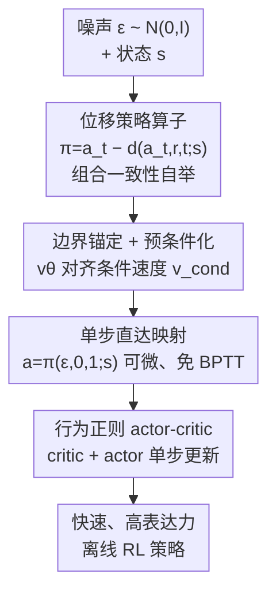

# Fast and Highly Expressive Policy Learning for Offline Reinforcement Learning via Bootstrapped Flow Q-Learning

**会议**: ICML2026  
**arXiv**: [2606.10613](https://arxiv.org/abs/2606.10613)  
**代码**: 待确认  
**领域**: 强化学习 / 离线 RL  
**关键词**: 离线强化学习, Flow Matching, 单步策略, 自举, 行为正则 actor-critic

## 一句话总结
针对扩散 Q-learning 多步去噪 + BPTT 又慢又脆的痛点，BFQ 把"噪声→动作"的整段位移做分治式自举——先学短程位移（可由 Flow Matching 边际速度精确估计），再把它们逐级拼成单步的直达映射，从而在训练和推理时都只需一步生成动作，不用辅助网络、不用蒸馏、不用多阶段，在 D4RL 上既提分又大幅提速。

## 研究背景与动机
**领域现状**：离线 RL 从固定数据集学策略，核心挑战是策略既要**表达力强**（能刻画多样行为带来的多模态动作分布）又要**计算高效**（便于稳定的值优化）。近年主流转向扩散式生成策略，因为它比传统高斯策略表达力强得多，Diffusion Q-Learning（DQL）就是把 TD3+BC 里的高斯策略换成扩散策略，成了很强的基线。

**现有痛点**：扩散策略普遍依赖**多步动作生成**，且训练时要做**时间反向传播（BPTT）**。部署时多步生成拉低动作频率、限制实时性；训练时多步 + BPTT 不仅贵，还会引入优化不稳定、阻碍收敛。已有的提速尝试——更高效的去噪 solver、IQL 式学习、引入辅助策略 + 策略蒸馏、甚至依赖 Jacobian 计算的平均速度估计——要么加算法复杂度、要么要多阶段训练管线、要么在可扩展性和策略质量之间做不利的取舍。

**核心矛盾**：这些低效与不稳定**根本上来自多步动作生成本身**。一个自然的解法是直接学**单步**策略，但要保住生成模型的表达力。Flow Matching（FM）学的是边际速度场，比扩散更简单更高效，可它诱导的全局轨迹往往是**弯曲**的（图 2 绿色箭头），令 $\Delta t=1$ 的单步生成不准——所以朴素 FM 策略仍需多步积分，套进 actor-critic 还是逃不掉 BPTT。

**本文目标**：让单步动作生成在**策略改进和策略评估两边**都成立，且只用一个从头训练的策略网络，不要蒸馏、不要多阶段、不要 Jacobian。

**核心 idea**：不直接建模边际速度，而是建模"噪声→干净动作"的**位移向量**；这个全局位移天然能递归分解成同形的短程位移（分治），短程位移在极限下收敛到"边际速度×时间增量"、可由标准 FM 求出，于是用一个共享网络从短程往长程**自举**，最终学出单步的直达映射。

## 方法详解

### 整体框架
BFQ 建在行为正则 actor-critic 框架上，但把里面的策略换成一个能**单步采样**的 flow 策略。它定义策略算子 $\pi(a_t,r,t;s)\triangleq a_t - d(a_t,r,t;s)$，其中 $d$ 是从时刻 $t$ 到 $r$ 沿流路径的位移积分；真动力学下 $\pi(a_t,r,t;s)=a_r$。训练分两件事拧在一起：用**组合一致性损失**让网络把长程位移分解成两段短程位移再拼回去（自举），用**边界条件损失**把极小区间下的位移锚定到 FM 的条件速度（防止退化、提供学习信号）。训练好后，采样退化成一次可微的前向 $a=\pi_\theta(\epsilon, r{=}0, t{=}1; s)$，既快又免 BPTT，于是 critic 和 actor 的更新都只需单步生成动作。

### 关键设计

**1. 位移的分治分解 + 组合一致性自举：把单步直达映射从短程位移拼出来**

这一设计正面回应"FM 单步不准"的痛点。作者不建模边际速度，而是建模有限区间 $[r,t]$ 上的位移 $d(a_t,r,t;s)\triangleq\int_r^t v(a_\tau,\tau;s)\,d\tau$，并定义策略算子 $\pi(a_t,r,t;s)=a_t-d(a_t,r,t;s)$。由定积分可加性，对任意 $0\le r\le m\le t\le1$ 有 $d(a_t,r,t)=d(a_m,r,m)+d(a_t,m,t)$，改写成策略算子就是**组合一致性约束**：

$$\pi(a_t,r,t;s)=\pi\big(\pi(a_t,m,t;s),\,r,m;s\big)$$

即"从 $t$ 直达 $r$"必须等于"先 $t\to m$ 再 $m\to r$"。训练时用一个共享网络 $\pi_\theta$ 把这条约束实例化成自举损失（带停梯度，防止平凡解）：

$$\mathcal{L}_{\text{comp}}(\theta)=\mathbb{E}\big[\|\pi_\theta(a_t,r,t;s)-\mathrm{sg}(\tilde a_r)\|_2^2\big],\quad \tilde a_r=\pi_\theta(\pi_\theta(a_t,m,t;s),r,m;s)$$

直觉是：短程位移已经能学准，于是不断把两段已学好的短程位移拼成更长的，逐级 bootstrap 到覆盖整个 $[0,1]$ 的单步映射。

**2. 边界条件 + 速度式预条件化：把极小区间锚定到 FM 条件速度，避免退化和弱信号**

光有组合一致性会有退化解，必须给一个"底座"。作者施加两个边界条件：零长区间时 $\pi(a_t,t,t;s)=a_t$（恒等）；极小区间 $\Delta\to0$ 时 $\pi(a_t,t-\Delta,t;s)\approx a_t-\Delta\,v(a_t,t;s)$（与边际速度一致）。但直接在 $\Delta\to0$ 处约束很难——位移项 $\Delta\cdot v_\theta$ 极小，关键的局部速度信息只能靠一个趋于零的更新携带，训练信号太弱、优化不稳。

解法是**轻量架构预条件化**：让网络预测一个速度式量 $v_\theta$，再由它构造动作更新 $\pi_\theta(a_t,t-\Delta,t;s)\approx a_t-\Delta\,v_\theta(a_t,t;s)$。这样小 $\Delta$ 时策略能直接查询显式速度估计、锚到最重要的局部流动力学；大 $\Delta$ 时这个约束自然失效，留给策略足够灵活性去建模非局部转移；且 $\Delta\to0$ 时恒等条件自动满足。监督信号则**直接复用 FM 自带的条件速度** $v_{\text{cond}}=\epsilon-a$（无需预训练单独的 flow 教师），把边界损失化简成数值稳定的"即时速度匹配"：

$$\mathcal{L}_{\text{bnd}}(\theta)=\mathbb{E}\big[\|v_\theta(a_t,t-\Delta,t;s)-\mathrm{sg}(v_{\text{cond}}(a_t,t\mid a,\epsilon;s))\|_2^2\big]$$

总行为克隆目标是两者凸组合 $\mathcal{L}_{BC}=(1-\lambda)\mathcal{L}_{\text{comp}}+\lambda\mathcal{L}_{\text{bnd}}$；为省算力，每步用 $\xi\sim\mathrm{Bernoulli}(\lambda)$ 随机只算其一，是 $\mathcal{L}_{BC}$ 的无偏估计。

**3. 自举 flow 策略嵌入行为正则 actor-critic：单步、可微、免 BPTT 的完整 Q-learning**

把上面的单步策略塞进行为正则 actor-critic 后，动作采样退化成一次可微操作 $a=\pi_\theta(\epsilon,r{=}0,t{=}1;s),\ \epsilon\sim\mathcal{N}(0,I)$。Critic 用双 Q + EMA 目标网络的标准 TD 损失（式 24）；actor 损失把行为克隆当正则、把 Q 当值最大化项：

$$\mathcal{L}(\theta)=\mathcal{L}_{BC}(\theta)-\alpha\,\mathbb{E}_{s\sim\mathcal{D},\,a^\pi\sim\pi_\theta}\big[Q_\phi(s,a^\pi)\big]$$

其中 $\alpha=\eta/\mathbb{E}_{(s,a)\sim\mathcal{D}}[|Q_\phi(s,a)|]$ 按数据集 Q 值尺度自适应归一化（视为常数不回传梯度）。关键在于：因为动作是单步生成的，actor 梯度从最终动作回传到参数**不再需要 BPTT**，既消除了多步去噪的递归图、又规避了 BPTT 带来的优化不稳定；同时 actor 和 critic 都不再需要多步采样动作，单步即可，训练大幅提速。

### 损失函数 / 训练策略
策略与 Q 都用常规 MLP；策略输入是动作隐向量 + 当前状态 + 时间步 $t,r$ 的正弦位置嵌入（维度 64）拼接。$t,r,m$ 在 $0\le r<m<t\le1$ 下均匀采样，边界偏移 $\Delta\sim[0,\Delta_{\max}]$、$\Delta_{\max}=10^{-3}$ 在所有环境稳健。主超参为边界条件比例 $\lambda$（默认 0.5）和系数 $\eta$（网格搜 $\{0.001,\dots,1\}$）；Adam，学习率 $3\times10^{-4}$；报告 6 个随机种子、每策略 50 回合（共 300 回合）的 D4RL 归一化分。

## 实验关键数据

### 主实验
在 D4RL 上对比非扩散策略（BC/TD3-BC/IQL）、多步扩散策略（IDQL/DQL/EDP）、单步 flow/扩散策略（SRPO/SORL/OFQL/FQL）。BFQ 在 MuJoCo locomotion 上取得最佳平均分，AntMaze 上与最强基线 OFQL 持平、并在最难的 AntMaze-Large-Play 上居首。

| 域 | DQL（多步扩散） | FQL（单步） | OFQL（单步） | BFQ（本文） |
|----|------|------|------|------|
| MuJoCo 平均 | 89.0 | 79.2 | 92.5 | **92.8** |
| AntMaze 平均 | 81.3 | 79.0 | **84.6** | 83.9 |

（归一化分；BFQ 把 MuJoCo 均分从 DQL 的 89.0 抬到 92.8，提升在 medium / medium-replay 这类噪声大、多模态强的数据集上尤其明显。）

### 效率对比（MuJoCo，百万训练步均值）

| 方法 | 生成步数 | 动作频率 (Hz) | 训练时长 (h) |
|------|---------|--------------|-------------|
| **BFQ** | 1 | 851.2 | **7.8** |
| FQL | 1 | 929.6 | 7.9（5 步蒸馏）|
| DQL | 5 | 238.1 | 11.7 |
| DQL | 50 | 35.5 | 49.5 |

### 消融实验
边界条件比例 $\lambda$ 在 HalfCheetah 上的影响（节选）：

| $\lambda$ | 1 | 0.75 | **0.5** | 0.25 | 0 |
|-----------|---|------|------|------|---|
| Medium-Expert | 80.9 | 96.1 | **98.5** | 94.0 | −2.5 |
| Medium | 45.3 | 63.7 | **66.1** | 62.1 | −2.5 |
| Medium-Replay | 49.0 | 50.7 | **52.1** | 51.8 | 10.6 |

### 关键发现
- **边界锚定不可或缺**：$\lambda=0$（完全没有边界速度约束）时策略直接崩（−2.5），说明组合一致性自举必须有 FM 条件速度当底座才不退化；$\lambda=0.5$ 在各数据集普遍最优。
- **单步足矣**：BFQ 用单步生成就追平/超过多步 DQL，动作频率 851.2 Hz 远高于 DQL 5 步的 238.1 Hz、50 步的 35.5 Hz，训练时长仅 7.8h（DQL 50 步要 49.5h）。
- **表达力保住了**：在多模态 bandit toy 数据上，BFQ 单步生成就能逼近 FM 多达 10 步的分布建模质量（图 3）。
- **稀疏奖励更稳**：AntMaze 这类长程稀疏奖励任务里，BFQ 相比同为单步的 FQL 在多数子任务上更好，说明边界条件化的 flow 提供了更稳的策略优化。

## 亮点与洞察
- **分治 + 自举把"单步不准"绕了过去**：核心 trick 是把全局位移递归分解成同形短程位移、用停梯度自举逐级拼接，避免了直接学弯曲全局轨迹的困难，这个"短程可学→拼长程"的思路可迁移到其他需要单步生成的 flow/扩散任务。
- **预条件化的小设计解决大问题**：让网络预测速度式量、再乘 $\Delta$ 得动作更新，既自动满足恒等条件、又让小 $\Delta$ 区间不被趋零更新淹没信号，是个干净的数值稳定技巧。
- **真正做到"简单"**：单网络、从头训练、复用 FM 自带 $v_{\text{cond}}$ 当监督，省掉了辅助策略、蒸馏、多阶段、Jacobian——在性能不降甚至提升的前提下把系统复杂度压到很低。

## 局限与展望
- 评测集中在 D4RL（MuJoCo locomotion + AntMaze），更高维/真实机器人/像素观测等场景下的表现与稳定性还需验证。
- AntMaze 上略逊于 OFQL（83.9 vs 84.6），稀疏奖励长程任务里单步表达力是否完全够用仍有讨论空间。
- 方法引入了 $\lambda$、$\eta$、$\Delta_{\max}$ 等超参，虽给了稳健默认值，但 $\lambda=0$ 直接崩说明对边界条件比例较敏感，跨任务调参成本仍存在。

## 相关工作与启发
- **vs DQL（多步扩散策略）**：DQL 表达力强但多步 + BPTT 又慢又不稳；BFQ 保住表达力的同时单步生成、免 BPTT，MuJoCo 均分反超（92.8 vs 89.0）且训练快数倍。
- **vs FQL（单步 flow，蒸馏路线）**：FQL 也做单步，但蒸馏过程仍要反复 query 底层多步 flow/扩散模型；BFQ 单网络从头训、无蒸馏，多数任务上更好。
- **vs OFQL / MeanFlow 路线**：这类依赖平均速度估计、需要显式 Jacobian 计算；BFQ 完全避开 Jacobian，仅用 FM 条件速度自举，工程更轻。
- **vs IQL/EDP 等提效方法**：它们靠简化采样或规避 BPTT 提速，但常牺牲最终性能；BFQ 在提速的同时不掉点甚至提点。

## 评分
- 新颖性: ⭐⭐⭐⭐⭐ 位移分治自举 + FM 条件速度边界锚定的单步策略学习思路很新颖。
- 实验充分度: ⭐⭐⭐⭐ D4RL 全面对比 + 效率 + $\lambda$/$\eta$ 消融 + toy 多模态验证，但限于 D4RL。
- 写作质量: ⭐⭐⭐⭐⭐ 痛点→分治直觉→边界条件→actor-critic 嵌入的推导链清晰自洽。
- 价值: ⭐⭐⭐⭐⭐ 在不加复杂度的前提下同时拿下表达力、速度与稳定性，对离线 RL 落地很有吸引力。

<!-- RELATED:START -->

## 相关论文

- [\[ICLR 2026\] Flow Actor-Critic for Offline Reinforcement Learning (FAC)](../../ICLR2026/reinforcement_learning/flow_actor-critic_for_offline_reinforcement_learning.md)
- [\[ICLR 2026\] PolicyFlow: Policy Optimization with Continuous Normalizing Flow in Reinforcement Learning](../../ICLR2026/reinforcement_learning/policyflow_policy_optimization_with_continuous_normalizing_flow_in_reinforcement.md)
- [\[ICML 2026\] Reverse Flow Matching: A Unified Framework for Online Reinforcement Learning with Diffusion and Flow Policies](reverse_flow_matching_a_unified_framework_for_online_reinforcement_learning_with.md)
- [\[ICLR 2026\] Adaptive Scaling of Policy Constraints for Offline Reinforcement Learning](../../ICLR2026/reinforcement_learning/adaptive_scaling_of_policy_constraints_for_offline_reinforcement_learning.md)
- [\[ICML 2026\] Offline Reinforcement Learning with Generative Trajectory Policies](offline_reinforcement_learning_with_generative_trajectory_policies.md)

<!-- RELATED:END -->
