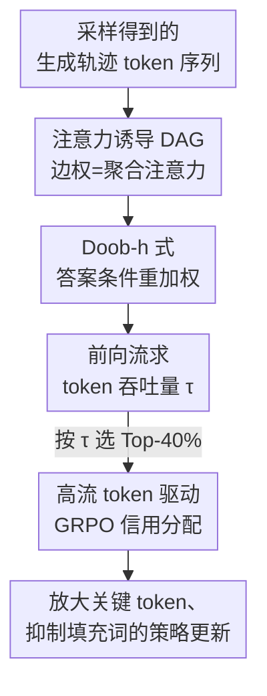

# How Does Reasoning Flow? Tracing Attention-Induced Information Flow for Targeted RL in LLMs

**会议**: ICML2026  
**arXiv**: [2606.10646](https://arxiv.org/abs/2606.10646)  
**代码**: 待确认  
**领域**: LLM推理 / 强化学习  
**关键词**: 信用分配, 注意力信息流, RLVR, GRPO, 推理骨架

## 一句话总结
把一条生成轨迹看成注意力诱导的有向无环图，用一种 Doob-h 式重加权把"真正流向答案"的信息路径筛出来，再用每个 token 的"流量吞吐"给 GRPO 做非均匀信用分配——让训练信号集中在少数支撑答案的关键 token 上，在数学推理等任务上稳定超过 GRPO 与各类逐点启发式。

## 研究背景与动机
**领域现状**：可验证奖励强化学习（RLVR）已成为提升 LLM 推理的主力配方，GRPO 这类方法靠"组内相对优势"把一道题的对错信号反传到整条轨迹上。

**现有痛点**：自回归生成的轨迹很长、监督却极稀疏（往往只有最后一步对/错），于是 token 级信用分配极其困难。GRPO 实际上把奖励**均匀**摊到每个 token 上，等于默认"每个词贡献相同"，无法区分一步决定性的推理与无关紧要的措辞。GAE 之类经典工具需要准确的状态价值，但在自然语言里从外部估计 token 价值噪声大、不稳定。

**核心矛盾**：近期工作开始用模型自身的内部信号（熵、注意力统计、梯度幅度）来给 token 加权，但这些信号都是**逐点（point-wise）**的——只看单个 token 此刻的局部显著性，**忽略了信息在整条序列里如何多跳传播、如何被汇聚和转发**这一全局结构。原始注意力本身又很嘈杂：注意力大量流向填充词、格式符、被后续抛弃的中间假设，naive 传播会让早期但决定性的前提被系统性低估、靠近答案的 token 仅因"邻近"就被过度加权。

**本文目标**：回答一个更根本的问题——推理到底是怎样从 prompt "流"到最终答案的？据此得到一个全局一致、能指认真正"中转枢纽"的 token 级信用。

**核心 idea**：把 token 序列建成注意力诱导的 DAG，做一次**以答案为条件**的流量重整，只保留能抵达答案的路径，再前向注入单位流量，得到每个 token 的吞吐量作为信用权重，插回 GRPO。

## 方法详解

### 整体框架
FlowTracer 在 RL 的"采样"与"训练"之间插入一个轻量分析步：对采样出来的轨迹额外做一次前向，从中层注意力（约 $L/3\sim2L/3$）取注意力图，构造一张时间有序的有向无环图 $\mathcal{G}=(V,E)$——每个 token 是一个节点，边权 $W_{ik}=a(x_k,x_i)\ge 0$ 来自聚合后的注意力分数，被解释为"一单位影响从 $x_i$ 出发、有多少被 $x_k$ 吸收"的局部耦合强度（注意不要求出度归一，$W$ 是线性算子而非随机核）。

但直接在原始注意力图上传播信用有两个硬伤：一是注意力按**入度**归一，出度和 $\sum_{k>i}W_{ik}$ 可大可小，影响会纯因图拓扑被放大或衰减；二是图里塞满"答案无关"的死胡同分支，信用会沿伪路径指数衰减。于是 FlowTracer 先做**答案条件重加权**得到守恒的 $W'$，再**前向求流量**得到每个 token 的吞吐 $\tau(k)$，最后用高吞吐 token 集合去缩放 GRPO 的逐 token 损失。

### 关键设计

**1. Doob-h 式答案条件重加权：只保留能抵达答案的影响**

这是全文的核心。要同时治好"出度不守恒"和"死胡同分支稀释信用"两个病，作者引入一个虚拟汇点 $s$ 连接所有答案 token $\mathcal{A}$，并定义一个**可达性势函数** $h(i)$——表示从节点 $i$ 出发、最终能抵达答案的总影响：$h(s)=1$，$h(i)=\sum_{k>i}W_{ik}\,h(k)$（对非答案节点）。然后把边权重写为

$$W'_{ik}\coloneqq\frac{W_{ik}\,h(k)}{h(i)}.$$

这一步同时拿下两个性质：其一是**局部流量守恒**（Theorem 3.1），对任意 $h(i)>0$ 的节点有 $\sum_{k>i}W'_{ik}=1$，证明只需把定义代入即可——于是中间节点既不凭空生造也不丢失有效质量，彻底消除拓扑偏置；其二是用 $h(k)/h(i)$ 缩放边权，会**自动压制流向死胡同（$h(k)\approx0$）的边**并把质量重新分配到能抵达答案的路径上，可达性为零的 token 直接被过滤。这个"用调和函数 $h$ 把一般传播条件化到目标事件上"的做法正是 Doob h-transform 的思路，所以叫 Doob-h-like。

**2. 前向流求 token 吞吐量：从问题注入单位流量，量化每个 token 的中转角色**

有了守恒的 $W'$，就能给出干净的 token 级信用。作者再引入虚拟源点 $\mathcal{S}$ 连到所有问题 token $\mathcal{Q}$，初始流 $f(\mathcal{S}\to i)=1/|\mathcal{Q}|$，然后沿守恒图前向传播 $f(k)=\sum_{i<k}f(i)\,W'_{ik}$。$f(k)$ 表示"源自问题、注定流向答案"的有效影响中有多大一份穿过了 token $x_k$；边流 $\phi(i\to k)=f(i)W'_{ik}$ 衡量依赖 $x_i\to x_k$ 在推理骨架里的重要性。最终用总吞吐 $\tau(k)=f(k)+\sum_{j>k}\phi(k\to j)$ 给 token 打分。作者发现高 $\tau$ 的 token 并非语义实词，而是**周期性出现的结构分隔符（标点、换行）和符号锚点（复现变量名、运算符）**——它们像"中转枢纽/汇聚检查点"一样定期把上下文汇总再广播给后文，构成推理骨架；低流 token 多是维持句子流畅的名词动词。一个干净的因果验证（见下表）支撑了这一点：在 GSM8K 上遮蔽高流 token 远比遮蔽低流/随机 token 更能改变最终答案。

**3. 高流 token 驱动的 GRPO 非均匀信用分配：把训练信号压到骨架上**

最后把全局一致的信用插回 RLVR。作者在 GRPO 损失里给每个 token 乘上一个非均匀缩放因子 $\gamma_{i,t}$：

$$\gamma_t=\begin{cases}\gamma_{\mathrm{flow}}&\text{若 } t\in\mathcal{T}_{\mathrm{high\_flow}}\\ 1&\text{否则}\end{cases}$$

其中 $\gamma_{\mathrm{flow}}=1.5$ 为强调系数，$\mathcal{T}_{\mathrm{high\_flow}}$ 取吞吐排名 Top-40% 的 token。这样策略更新对真正驱动答案的 token 更激进、对填充词更克制。工程上这套分析只需在采样后多做一次前向取中层注意力图，相对上千步自回归采样和耗时的训练阶段，额外开销仅 **2.2%–4.5%**，几乎可忽略。

### 损失函数 / 训练策略
基座 Qwen3-4B/8B（补充用 Llama-3.1-8B、Llama-3.2-3B）；全局 batch 512、micro-batch 32、16 步梯度累积，学习率 $1\times10^{-6}$，去掉 KL 与熵正则；采样温度 0.99、top-p=1、top-k=100。3B/4B 在 8 卡训 500 步，8B 在 16 卡训 600 步。关键超参（中层 15–25、Top-40%、$\gamma_{\mathrm{flow}}=1.5$）均经消融选定。

## 实验关键数据

### 因果干预：高流 token 是否真的是推理"骨架"

| 扰动目标（遮蔽 20%） | 答案改变率 ↑ | 正确性反转率 ↑ |
|--------|------|------|
| 随机 20% | 29.5% | 4.5% |
| 低流 Bottom-20% | 14.9% | 0.5% |
| 高流 Top-20% | **45.9%** | **14.9%** |

遮蔽高流 token 让答案剧烈改变、正确性大幅翻转，而低流/随机几乎无影响——证实高流 token 是因果驱动者，而非仅仅局部显著。

### 主实验：数学推理（Avg）

| 模型 / 设置 | GRPO | Attention（最强逐点基线） | FlowTracer | 相对 GRPO |
|--------|------|------|------|------|
| Qwen3-4B · 1K | 37.1 | 38.6 | **39.4** | +2.2 |
| Qwen3-4B · 8K | 44.8 | 47.2 | **48.6** | +3.8 |
| Qwen3-8B · 1K | 39.4 | 41.3 | **43.4** | +4.0 |
| Qwen3-8B · 8K | 50.3 | 50.9 | **52.5** | +2.1 |

跨任务/跨架构也成立：Countdown 符号规划 GRPO 52.6 → FlowTracer **63.2（+10.6）**、CrossThinkQA 48.0 → 50.2；换到 Llama-3.1-8B（7.7→9.1）与 Llama-3.2-3B（4.8→5.9）同样稳定提升，说明它不绑定特定 tokenizer/架构。值得注意的是**上下文越长优势越大**（Qwen3-4B 上从 1K 的 +2.2 扩大到 8K 的 +3.8，AIME25 单项 +5.8），印证了"长链下信用稀释更严重、精确分配更关键"的判断。

### 消融

| 配置 | 关键发现 |
|------|---------|
| Top-k vs Bottom-k | 按高流选 Top-k 一致超 GRPO；按低流选 Bottom-k 明显掉点 → 流量分数确实指认决定性 token |
| 选择比例 20%/40%/60% | Top-20% 覆盖不全、Top-60% 引入噪声冗余，**Top-40% 信噪比最佳** |
| 注意力层段 早/中/晚/全 | 中层（15–25）最好，全层平均反而被早晚层稀释 → 推理骨架在中层最显著 |

### 关键发现
- 信用应放在**结构分隔符与符号锚点**这类"中转枢纽"上，而非语义实词；模型自发把"产生逻辑"（高流）与"维持流畅"（低流）解耦。
- 增益随上下文长度变大，正好命中长链推理"信用稀释"的痛点。
- 方法是即插即用的训练侧增强，开销仅 2–5%。

## 亮点与洞察
- **把信用分配从"逐点"升级为"全局流"**：用图论里的可达性势 + 流量守恒，给出一个数学上自洽、能解释"哪些 token 真正中转信息"的信用，而不是又一个手工启发式——这是最让人"啊哈"的地方。
- **Doob h-transform 的迁移很巧**：把"条件化到目标事件"的经典概率工具搬到注意力图上，一步同时解决出度不守恒与死胡同稀释，证明仅一行代换。
- **可迁移**：这套"答案条件重加权 + 前向流吞吐"可推广到任何需要把序列级稀疏奖励落到 token 的场景（如 agent 轨迹、代码生成的关键行定位）。

## 局限与展望
- 信用完全建立在注意力作为"影响耦合"的解释上——注意力与真实信息流的关系仍有争议，遮蔽实验是有力但间接的证据。
- 层段、Top-k 比例、$\gamma_{\mathrm{flow}}$ 都靠经验选定，跨模型是否稳健、能否自适应仍待验证。
- 绝对分数在最难的竞赛级数学（如 Llama 上的 AIME）仍很低，方法是相对增益而非根本突破。
- DAG 假设严格 $i<k$ 的时间有序，对非自回归或带回溯的生成范式未必直接适用。

## 相关工作与启发
- **vs 逐点启发式（熵 / 梯度 / 相关性 / 注意力最大值）**：它们都只看单 token 的局部信号，忽略 token 间的多跳关系；本文显式建模"答案条件下的多跳影响流"，在同一 RL 配方下一致更优。
- **vs GRPO / RLVR**：GRPO 用组相对优势绕开价值估计但把信用均匀摊开；FlowTracer 在不改奖励来源的前提下，仅替换 token 级权重就拉开差距。
- **vs PRM / MCTS 等显式步级监督**：那类方法要额外训练过程奖励或搜索、易奖励黑客且昂贵；本文的信用完全来自模型内部、几乎零额外训练成本。

## 评分
- 新颖性: ⭐⭐⭐⭐⭐ 把信用分配重构为答案条件的注意力流，视角新且工具自洽
- 实验充分度: ⭐⭐⭐⭐ 多模型多任务+因果干预+三项消融，但缺更大模型与更广 RL 算法验证
- 写作质量: ⭐⭐⭐⭐⭐ 动机—机制—验证链条清晰，定理与直觉兼顾
- 价值: ⭐⭐⭐⭐ 即插即用、开销极小，对长链推理 RL 训练有实用价值

<!-- RELATED:START -->

## 相关论文

- [\[ICML 2026\] Perceptual Flow Network for Visually Grounded Reasoning](perceptual_flow_network_for_visually_grounded_reasoning.md)
- [\[ICML 2026\] Reverse Flow Matching: A Unified Framework for Online Reinforcement Learning with Diffusion and Flow Policies](reverse_flow_matching_a_unified_framework_for_online_reinforcement_learning_with.md)
- [\[ICML 2026\] Flow-Equivariant World Models: Memory for Partially Observed Dynamic Environments](flow_equivariant_world_models_memory_for_partially_observed_dynamic_environments.md)
- [\[ICLR 2026\] Attention as a Compass: Efficient Exploration for Process-Supervised RL in Reasoning Models](../../ICLR2026/reinforcement_learning/attention_as_a_compass_efficient_exploration_for_process-supervised_rl_in_reason.md)
- [\[ICLR 2026\] InFOM: Intention-Conditioned Flow Occupancy Models](../../ICLR2026/reinforcement_learning/infom_intention_flow_occupancy.md)

<!-- RELATED:END -->
