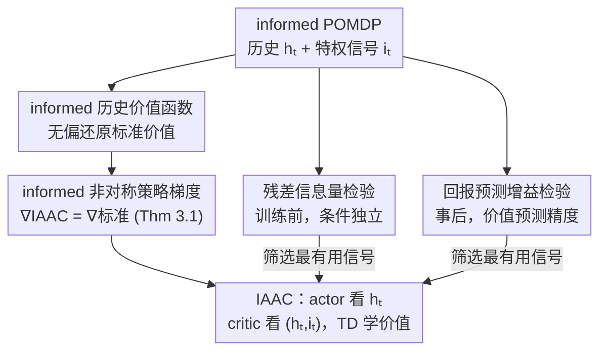

# Informed Asymmetric Actor-Critic: Leveraging Privileged Signals Beyond Full-State Access

**会议**: ICML2026  
**arXiv**: [2509.26000](https://arxiv.org/abs/2509.26000)  
**代码**: https://github.com/EbiDa/informed-asymmetric-a2c  
**领域**: 强化学习 / 部分可观测 / Actor-Critic  
**关键词**: 非对称 actor-critic, 特权信息, POMDP, 无偏策略梯度, 信息量准则

## 一句话总结
本文把"非对称 actor-critic"从"critic 必须看到完整环境状态"放宽为"critic 可以看任意状态相关的特权信号"，证明任何这类信号都给出无偏策略梯度，并进一步提出两个判断"哪个特权信号最有用"的信息量检验，实验证明精挑的部分特权信号能在用更少状态信息的前提下追平甚至超过用全状态的非对称基线。

## 研究背景与动机
**领域现状**：很多真实任务是部分可观测的（POMDP），最优动作要依赖历史观测-动作序列，通常用 RNN 编码历史来学策略。**非对称 actor-critic** 是利用训练期额外信息的一条主流路线：让 actor 只看可观测历史 $h_t$、让 critic 在训练时额外看特权信息——性能提升来自更准的价值估计，而不是给 actor 喂了更多输入（部署时 actor 拿不到特权信息）。

**现有痛点**：现有非对称 actor-critic 几乎都假设 critic 能拿到**完整环境状态** $s_t$。但这在现实里往往不现实——很多训练期可用的额外信号（机器人多视角传感、模拟器内部量、专家策略、基础模型查询出的表示）**既不是完整状态、也不满足马尔可夫性**，却确实含有用信息。Pinto 等人早期的状态条件 critic 虽然实证强，但在 POMDP 里一般是 ill-defined 的（除非满足 state-decodability 这种苛刻假设）；Baisero & Amato 用"历史-状态价值函数"修了无偏性，但仍绑死在"全状态"上。

**核心矛盾**：一边是"现实只能拿到零碎的部分特权信号"，一边是现有理论只为"全状态 critic"背书；二者之间存在空白——**部分特权信号下的非对称 actor-critic 既缺无偏性保证，也缺"该选哪个信号"的判据**。

**本文目标**：(1) 把 critic 可用的特权信息从"全状态"放宽到"任意状态相关信号"，并保住无偏策略梯度；(2) 既然任意状态条件信号都合法，那就得回答"该选哪个信号"——给出可操作的信息量准则。

**切入角度**：借助 informed POMDP 形式化——它给标准 POMDP 增配一个"信息变量" $i_t\sim I(i_t\mid s_t)$，且假设观测 $o_t$ 在给定 $i_t$ 时条件独立于状态 $s_t$。这个抽象天然把"全状态"和"训练期额外信号"统一进同一框架。

**核心 idea**：用 informed POMDP 定义"informed 历史价值函数"，证明对任意状态条件信号 $i_t$ 其在 $i_t$ 上取期望都无偏地还原标准历史价值，于是任何 $i_t$ 都给无偏梯度；再从"对预测未来回报有没有额外贡献"的角度，提出两个信息量检验来挑信号。

## 方法详解

### 整体框架
方法分两块。**第一块（理论）**：在 informed POMDP 上定义 informed 历史 $Q$ 函数 $Q^\pi(h_t,i_t,a_t)$ 与 informed 历史价值 $V^\pi(h_t,i_t)$，证明它们在 $i_t$ 上取期望分别无偏还原标准的 $Q^\pi(h_t,a_t)$、$V^\pi(h_t)$；据此定义 informed 非对称策略梯度，并证明它**恒等于**标准策略梯度（Theorem 3.1）。这就把"critic 可用的训练期信号"从全状态放宽到任意状态条件信号，actor 仍只依赖历史 $h_t$，critic 额外吃 $i_t$，组合成 IAAC（informed asymmetric actor-critic），用 TD 学 informed critic、用 TD 误差构造低方差优势估计。

**第二块（选信号）**：既然任何 $i_t$ 都无偏，差异只体现在价值估计的**方差**上，于是需要判据来选"对预测回报最有信息量"的信号。作者给两个互补准则：训练前可用的**残差信息量检验**（基于条件独立），和事后可用的**回报预测增益检验**（基于价值预测精度的提升）。当候选信号能拆成多个特征分量 $c_t=(c_t^1,\dots,c_t^M)$ 时，两个准则都能对特征子集做假设检验式的筛选。

### 关键设计

**1. informed 历史价值函数 + 无偏策略梯度：把"全状态"放宽到"任意状态条件信号"**

针对"现有理论只为全状态 critic 背书"这个空白，作者在 informed POMDP 上定义 informed 历史 $Q$ 函数 $Q^\pi(h_t,i_t,a_t)=\mathbb{E}^\pi[G_t\mid h_t,i_t,a_t]$ 与 informed 历史价值 $V^\pi(h_t,i_t)$，其中 $i_t\sim I(i_t\mid s_t)$ 是任意状态条件特权信号。核心引理是这两者在 $i_t$ 上取期望就无偏还原标准量：$\mathbb{E}_{i_t\mid h_t}[Q^\pi(h_t,i_t,a_t)]=Q^\pi(h_t,a_t)$（Lemma A.2），$V$ 同理。由此定义 informed 非对称策略梯度

$$\nabla_\theta^{\text{IAAC}}J(\pi_\theta)=\mathbb{E}\Big[\sum_t\gamma^t Q^\pi(h_t,i_t,a_t)\nabla_\theta\log\pi_\theta(a_t\mid h_t)\Big],$$

并证明它**恒等于**标准策略梯度 $\nabla_\theta J(\pi_\theta)$（Theorem 3.1，证明用 Lemma A.2 + 全期望律把 $\mathbb{E}_{i_t}[Q^\pi(h_t,i_t,a_t)\mid h_t]$ 折回 $Q^\pi(h_t,a_t)$）。这条结果的分量很重：它说明用任意状态条件特权信号训练 critic **不会引入梯度偏差**，全状态 critic（Baisero & Amato）只是 $i_t=s_t$ 的特例；信号选择只通过"改变价值估计的方差"影响优化，不动渐近最优性。一个直接推论是可以把状态条件专家策略 $i_t=a_t^\star\sim\pi^\star(\cdot\mid s_t)$ 当特权信号喂给 critic，让 critic 利用 oracle 信息估价值，而**不**逼 actor 去模仿那个在部分可观测下不可部署/次优的专家。为什么"更少信息也能更好"？因为 $i_t$ 能降低对状态的不确定度（$\mathbb{E}_{i_t\mid h_t}[H(s_t\mid h_t,i_t)]\le H(s_t\mid h_t)$），并由全方差律 $\mathbb{E}_{i_t\mid h_t}[\mathrm{Var}(G_t\mid h_t,i_t)]\le\mathrm{Var}(G_t\mid h_t)$ 降低价值目标的方差，在"value aliasing"（同一历史下不同状态对应不同回报）严重的环境里尤其有效。

**2. 残差信息量检验：训练前就判断信号"有没有额外预测力"**

放宽后任意信号都合法，但不是都有用——需要在**训练前**就能挑信号的判据。作者从"$i_t$ 是否携带超出 $(h_t,a_t)$ 之外、关于未来回报 $G_t$ 的信息"出发，把它写成条件独立假设 $\mathbb{H}_0^{\text{CI}}:G_t\perp i_t\mid h_t,a_t$；拒绝它就说明 $i_t$ 有非冗余信息。但 CI 假设下的样本拿不到，于是改测**残差独立**：先回归掉 $(h_t,a_t)$ 能解释的部分，得残差 $e_{G_t}:=G_t-\mathbb{E}[G_t\mid h_t,a_t]$、$e_{i_t}:=i_t-\mathbb{E}[i_t\mid h_t,a_t]$，检验 $\mathbb{H}_0^{\text{res}}:e_{G_t}\perp e_{i_t}$。CI 蕴含残差独立（反之不必），所以残差检验是 CI 的**必要非充分**条件，正好对应"$i_t$ 是否带额外预测力"。为造出零假设样本，作者构造一个保持条件均值但与 $i_t$ 独立的 surrogate $\tilde G_t^{\text{null}}=\tilde G_t-\mathbb{E}[\tilde G_t]+\mathbb{E}[G_t\mid h_t,a_t]$。实现上用 RNN 把历史编码成定长 $z_t$、用随机森林做交叉拟合估条件均值、用 HSIC 或互信息度量残差依赖 $\rho$，再做 episode 级置换检验算经验 $p$ 值，$p<\alpha$ 则判定 $i_t$ 为 $\alpha$-残差信息量充分。它的妙处是**不需要训练好的 actor 或 critic**，连随机策略采的 episode 都能用，因此可在训练前指导"该不该加这个信号"。

**3. 回报预测增益检验：事后从"价值估计是否更准"量化信号贡献**

第二个准则从 critic 的本职——预测回报——直接量化信号价值。比较一个对称 critic $\hat Q(h_t,a_t)$ 和一个 informed critic $\hat Q(h_t,i_t,a_t)$，定义 episode 级平方误差增益

$$L^{\tau_j}:=\frac{1}{T_j}\sum_{t=0}^{T_j-1}\big((\hat Q(h_t,a_t)-G_t)^2-(\hat Q(h_t,i_t,a_t)-G_t)^2\big),$$

$L^{\tau_j}>0$ 表示加 $i_t$ 在该 episode 上改善了回报预测。据此定义 $(\epsilon,\delta)$-预测信息量：检验 $\mathbb{H}_0:\mathbb{E}[L^\tau]\le\epsilon$，在显著性 $\delta$ 下拒绝则信号有用。实现按样本量切换：小样本用单边 bootstrap 检验，大样本（$N>1000$）用单边 $t$ 检验。它是**事后**判据，但同样只需任意固定策略采的 episode、不依赖策略性能，作为残差检验的互补——一个看"统计依赖"、一个看"预测精度的实际改善"。两者都支持对特征子集 $\mathcal{Z}\subseteq\{1,\dots,M\}$ 做筛选，挑出 effect size 最大或 $p$ 值最小的子集当最终特权信号。

## 实验关键数据

### 主实验（基准性能）
在 6 个导航任务（Heaven-Hell-3、Shopping-5、Car-Flag、Cleaner、Memory-Four-Rooms-7x7/9x9）和 6 个 POPGym 环境上评估，每个任务给 critic 定制部分特权信号，所有策略输入相同。对比 informed-asym-A2C 与三个 A2C 变体：对称 A2C（critic 看历史 $\hat V(h)$）、asym-A2C-hs（历史-状态 critic $\hat V(h,s)$）、asym-A2C-s（纯状态 critic $\hat V(s)$，仅导航任务）。曲线取 20 次独立运行、100-episode 滑动平均。

| 环境 | 关键现象 | 结论 |
|------|---------|------|
| Car-Flag | informed-asym-A2C 收敛速度与渐近回报都超全部基线 | 部分信号 > 全状态 |
| Memory-Four-Rooms-7x7/9x9 | 超过两个非对称基线 | 部分信号 > 全状态 |
| Shopping-5 | 收敛快于 asym-A2C-hs，渐近回报相当 | 追平全状态、更快 |
| Heaven-Hell-3 | 强于 A2C / asym-A2C-s，略逊 asym-A2C-hs | 接近全状态 |
| Concentration | 全状态 A2C 变体反而难收敛（高维含无关特征） | 全状态会被无关特征拖累 |
| Position Cart Pole | 两个非对称变体明显胜 A2C（A2C 2M 步内不收敛） | 非对称有效 |

**总体结论**：用恰当构造的部分特权信号的非对称 critic，能在用**严格更少**信息的前提下追平甚至超过全状态 critic，挑战了"全状态对非对称 actor-critic 是必要的"这一默认假设。

### 信息量准则验证（消融）
在合成 informed POMDP（$|\mathcal{S}|=20$、$|\mathcal{A}|=4$、状态含 5 维隐高斯特征 $s_t\in\mathbb{R}^5$、奖励是特征的线性函数）上，观测为无噪 $o_t=(s_t^1,s_t^2)$，而奖励权重把大部分权重压在 $s_t^4,s_t^5$ 上。对称 A2C 基线 AUC 约 $1.06\times10^5$。

| 特权信号 $i_t$ | 残差依赖 $\rho_{\text{obs}}$ | 预测增益 $L_\tau$ | AUC |
|------|------|------|------|
| $[s^1,s^2]$ | 3.0e-05 | -1.4e-02 | 1.07e+05 |
| $[s^1,s^2,s^3]$（含无关 $s^3$） | 5.5e-05 | 0.007 | 1.08e+05 |
| $[s^1,s^2,s^4,s^5]$（含回报相关 $s^4,s^5$） | **7.6e-05** | **0.064** | **1.23e+05** |
| $[s^1,s^2,s^3,s^4,s^5]$（全状态） | 7.0e-05 | 0.056 | 1.19e+05 |

### 关键发现
- **含 $s^4,s^5$ 的信号统计证据最强、AUC 最高**：两个准则都把"含回报相关分量"的子集判为更有信息量，且它对应最高学习性能（AUC 1.23e+05）。
- **全状态不一定最好**：把全部 5 维都塞进去（含无关的 $s^3$）反而 AUC 更低（1.19e+05 < 1.23e+05），证实无关特征会以"结构化噪声"形式拖累价值估计，即便用高容量逼近器也如此（类似 "noisy TV"）。
- **判据有效**：两个准则都能在纯数据驱动下自动从大量候选里识别出回报相关子集，无需手工特征工程；性能由"是否含回报相关信息"驱动，而非信息量多少。

## 亮点与洞察
- **一个无偏性定理打开整个设计空间**：Theorem 3.1 把 critic 可用信号从"全状态"放宽到"任意状态条件信号"且不引偏差，这让"专家动作、模拟器内部量、基础模型表示"等非马尔可夫的零碎信号都成了合法燃料——这是最关键的 "啊哈"。
- **把"专家信息"用对地方**：可以让 critic 吃专家动作做价值估计，而不强迫 actor 模仿专家（后者在部分可观测下被证次优），巧妙绕开了 asymmetric imitation 的偏差陷阱。
- **"信号选择"被提成与架构/优化并列的设计维度**：两个可操作的检验（一个训练前、一个事后，都不需训练好的策略）把"选信号"从拍脑袋变成假设检验，可直接迁移到任何需要挑训练期辅助变量的场景。
- **反直觉结论有实证**：更多状态信息 ≠ 更好学习，无关特征会引入结构化噪声——这对"能给全状态就给全状态"的工程惯性是个有力提醒。

## 局限与展望
- **检验依赖回归质量**：残差检验需估 $\mathbb{E}[G_t\mid h_t,a_t]$、$\mathbb{E}[i_t\mid h_t,a_t]$，回归误差不随样本量下降时检验可能偏离名义显著性、统计功效下降；作者用交叉拟合 + 随机森林缓解，但高维历史仍有挑战。
- **无偏不等于易学**：理论保证的是无偏与降方差的可能性，但 $V^\pi(h_t,i_t)$ 不必天然比 $V^\pi(h_t)$ 更好逼近，收益依赖环境是否真有 value aliasing。
- **规模与连续控制待验证**：实验集中在导航/POPGym 等中小规模离散环境与合成 POMDP，向高维连续控制、真实机器人扩展的稳定性未充分检验。
- **随机策略覆盖有限**：训练前检验可用随机策略采样，但其对状态-动作空间覆盖不足可能导致信息量评估有偏。

## 相关工作与启发
- **vs Baisero & Amato (2022) 历史-状态 critic**：他们用全状态 critic 修无偏性，是本文 $i_t=s_t$ 的**特例**；本文放宽到任意状态条件信号，并补上"该选哪个信号"的判据。
- **vs 非对称模仿学习 (Warrington et al., 2021)**：模仿全状态专家在 POMDP 下次优；本文让 critic 用专家信息估价值、actor 不模仿，无梯度偏差。
- **vs 因果/bandit 的变量选择 (Lee & Bareinboim)**：他们靠显式因果模型识别无关变量；本文不假设因果结构，纯从"对价值估计的统计效用"出发挑信号。
- **vs model-based 用特权信息 (Informed Dreamer 等)**：那条线把额外状态信号塞进世界模型；本文走 actor-critic 路线，直接作用在 critic 的价值估计上。

## 评分
- 新颖性: ⭐⭐⭐⭐⭐ 把非对称 critic 从全状态放宽到任意状态条件信号并证无偏，外加可操作的信号选择判据，框架性贡献
- 实验充分度: ⭐⭐⭐⭐ 12 个基准 + 合成 POMDP 双线验证，准则与性能对应清晰；但偏中小规模离散环境
- 写作质量: ⭐⭐⭐⭐ 理论推导严谨、引理定理层次分明；informed POMDP 记号较重，需一定背景
- 价值: ⭐⭐⭐⭐⭐ 给"用零碎训练期信号做非对称 RL"提供了理论地基与选信号工具，落地意义大

<!-- RELATED:START -->

## 相关论文

- [\[AAAI 2026\] Risk-Sensitive Exponential Actor Critic](../../AAAI2026/reinforcement_learning/risk-sensitive_exponential_actor_critic.md)
- [\[ICLR 2026\] Flow Actor-Critic for Offline Reinforcement Learning (FAC)](../../ICLR2026/reinforcement_learning/flow_actor-critic_for_offline_reinforcement_learning.md)
- [\[ICML 2025\] Enhancing Decision-Making of Large Language Models via Actor-Critic](../../ICML2025/reinforcement_learning/enhancing_decision-making_of_large_language_models_via_actor-critic.md)
- [\[NeurIPS 2025\] Global Convergence for Average Reward Constrained MDPs with Primal-Dual Actor-Critic](../../NeurIPS2025/reinforcement_learning/global_convergence_for_average_reward_constrained_mdps_with_primal-dual_actor_cr.md)
- [\[ICML 2026\] Hista and Numca: Estimate State Value Effectively for LLM Reinforcement Learning](hista_and_numca_estimate_state_value_effectively_for_llm_reinforcement_learning.md)

<!-- RELATED:END -->
