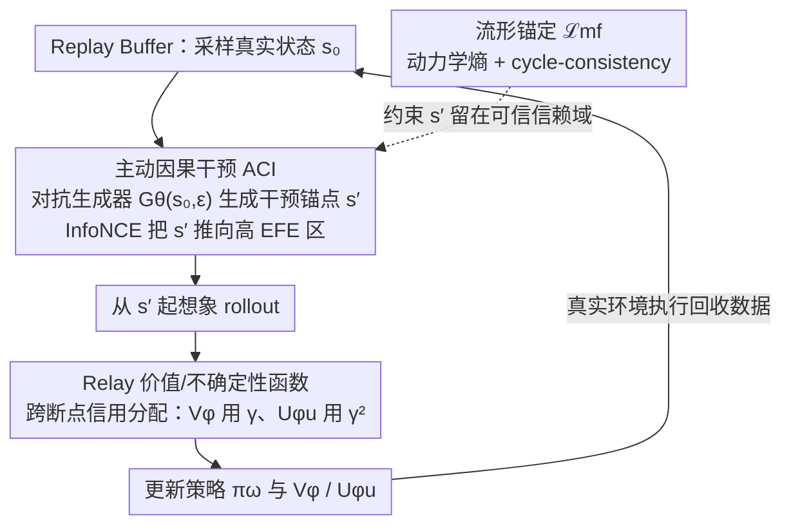

# Mind Dreamer: Untethering Imagination via Active Causal Intervention on Latent Manifolds

**会议**: ICML2026  
**arXiv**: [2605.16030](https://arxiv.org/abs/2605.16030)  
**代码**: 待确认  
**领域**: 强化学习  
**关键词**: 模型基RL, 隐空间想象, 主动因果干预, 自由能, Dreamer

## 一句话总结
本文为模型基强化学习（MBRL）提出 Mind Dreamer，用一个对抗式生成器在世界模型已学到的隐空间流形上"跳跃"到非历史轨迹覆盖的关键锚点，并通过新设计的 Relay Value/Uncertainty 函数（含 $\gamma^2$ 折扣）解决跨断点的信用分配，在 DMC 上相对 DreamerV3 平均提速 $1.67\times$、稀疏奖励任务最高提速 $8.8\times$。

## 研究背景与动机
**领域现状**：以 Dreamer 系为代表的 MBRL 通过在隐空间里"想象"未来轨迹来获得高样本效率，关键步骤是从 replay buffer 里采一个初始状态 $s_0 \sim \mathcal{D}$，再用 RSSM 类世界模型滚出若干步用于训练策略。

**现有痛点**：作者把这种做法概括为 *Historical Tethering*——想象始终是历史的囚徒。世界模型靠密集的自监督信号能很快把流形 $\mathcal{M}$ 的全局结构学到位，但策略只靠稀疏奖励信号慢慢爬，两者之间形成"学习速率不对称"（learning asymmetry）。即便模型已经知道两块区域如何连接，策略仍然只能从历史轨迹起点出发，靠随机游走才能再次踏入瓶颈区域。

**核心矛盾**：想象的覆盖被采样分布而非世界模型的真实能力卡住。Plan2Explore 之类的好奇心方法虽然鼓励探索，但 rollout 起点依旧必须取自 buffer，本质仍然是 *trajectory-bound*；而 HER / Goal-Conditioned RL 只是对历史轨迹做重标注，没有跳出 buffer 凸包。

**本文目标**：(i) 让初始状态本身可以被"造"出来，不必出自 buffer；(ii) 保证造出来的状态在世界模型的流形上是物理可信的；(iii) 当想象路径出现"空间断裂"（teleport）时，仍能把价值/不确定性信号正确传回。

**切入角度**：把 MBRL 视为因果框架下的干预问题——用一个学到的干预分布 $p_{gen}$ 替换 $\mathcal{D}$，对应 Pearl 的 $do(\cdot)$ 算子；用 Active Inference 的 Expected Free Energy（EFE）作为"该跳到哪里"的全局判据。

**核心 idea**：把"想象起点"从 buffer 解绑，让一个对抗生成器去 EFE 高的隐空间锚点采样，再用新设计的 Relay 价值/不确定性函数把跨锚点的回报和信息增益拼回 Bellman 方程。

## 方法详解

### 整体框架
Mind Dreamer（MD）在 DreamerV3 的 RSSM 之上插入两组新模块：

1. **对抗生成器 $\mathcal{G}_\theta(s,\epsilon)$**：把 buffer 里的真实状态 $s$ 配上噪声 $\epsilon \sim \mathcal{N}(0,I)$ 映射成隐流形上的"干预锚点" $s' = \mathcal{G}_\theta(s,\epsilon)$。$s'$ 不要求是历史中真实出现过的状态，而是世界模型认为"物理上可达"的潜在状态。
2. **Relay 势场 $V_{RVF}, V_{RUF}$**：以 $s'$ 为中间过渡态而非终止目标，分别衡量"如果我先到 $s'$ 再继续，能拿多少奖励"和"如果我先到 $s'$ 再继续，能消除多少模型不确定性"。
3. **流形锚定损失 $\mathcal{L}_{mf}$**：阻止生成器钻"流形裂缝"——通过动力学熵正则 + cycle-consistency 约束 $s'$ 留在世界模型的可信区域。

训练时一边按标准 RSSM 训世界模型、按标准 actor-critic 训策略，另一边用 $s' \sim \mathcal{G}_\theta$ 取代部分 $s_0 \sim \mathcal{D}$ 作为想象 rollout 的起点。生成器、势场、策略以异步频率交替更新，世界模型频率最低、生成器频率最高，保证目标分布对策略来说"准静态"。

### 关键设计

**1. Active Causal Intervention（ACI）：把 EFE 从路径上的标量抬成全局曲线，决定生成器往哪儿投放锚点**

世界模型靠密集自监督很快学到流形全局结构，策略却只靠稀疏奖励慢慢爬，于是想象始终被 buffer 起点困住——生成器要解的就是"该往哪个锚点跳"。对单个锚点 $s'$，先按 Active Inference 写出局部 EFE $G(s') = -\beta\,\mathcal{I}(s_\tau;o_\tau|\pi) - \eta\,\mathbb{E}_q[\ln p(o_\tau)]$，前一项是认知价值（不确定性消除）、后一项是 pragmatic 价值（贴合任务先验）；再沿 $H$ 步想象轨迹折扣求和得到 Relay-EFE $\Psi(s,s') = \mathbb{E}_q\big[\sum_{k=1}^{H}\gamma^k G(s_k) \mid s_0=s, s'\in\xi\big]$。直接对 $\Psi$ 梯度上升不稳，作者转写成 InfoNCE 对比损失 $\mathcal{L}_{contrast}=\max(0, m-(\Psi(s')-\max\Psi(s_{neg})))$，让生成锚点的势能严格高于一批历史/精英基线。这样生成器同时考虑"到了这儿能学到多少"和"到了这儿离任务奖励有多近"，避免单纯好奇心带来的无目的漂移。

**2. Relay Value / Uncertainty Function：跨断点的信用分配**

想象路径一旦"teleport"到合成锚点 $s'$，就出现空间断裂，标准 Bellman 没法把 $s'$ 之后的回报和信息增益传回出发点 $s$，也就没法对 $s'$ 做反向梯度。MD 把 $s'$ 当中间过渡态而非终止目标：定义首次命中时间 $\tau_{s'}=\inf\{t\ge 0: s_t=s'\}$，Pragmatic Relay 算子写成 $(\mathcal{T}_V V)(s,s')=\mathbb{E}_\pi\big[\sum_{t=0}^{\tau_{s'}-1}\gamma^t r_t + \gamma^{\tau_{s'}} V_\phi(s')\big]$；Epistemic Relay 算子结构类似，但信息增益 $\mathcal{I}_{t+1}$ 用 $\gamma^{2t}$ 折扣 $(\mathcal{T}_U U)(s,s')=\mathbb{E}_\pi\big[\sum_{t=0}^{\tau_{s'}-1}\gamma^{2t}\mathcal{I}_{t+1} + \gamma^{2\tau_{s'}} U_{\phi_u}(s')\big]$，两者都是 $\ell_\infty$ 范数下的压缩映射（一个 $\gamma$、一个 $\gamma^2$）保证唯一不动点。$\gamma^2$ 不是经验调参——按方差算子性质 $\mathrm{Var}(\sum\gamma^t\epsilon_t)=\sum\gamma^{2t}\mathrm{Var}(\epsilon_t)$，认知冲击天然以二次速率衰减；用线性 $\gamma$ 会让远端的模型方差越滚越大形成幻觉，作者称之为 *Epistemic Horizon*——给认知好奇心一个内生的截断半径。

**3. 流形锚定 $\mathcal{L}_{mf}$ 与对抗联合训练：把生成器关进世界模型可信的信赖域**

生成器可以造出 buffer 凸包外的状态，但必须保证它们落在世界模型可信的流形上，否则会把策略带到模型自己都说不准的"裂缝"里催生幻觉。约束写成 $\mathcal{L}_{mf} = \mathcal{H}\big(p_\psi(\cdot|s',a)\big) + D_{KL}\big[\mathrm{Enc}(\mathrm{Dec}(s'))\,\|\,s'\big]$：前一项惩罚转移分布的熵（模型对后继越不确定越说明此处不可信），后一项是 cycle-consistency（重编码后能否回到自己，作为"是否落在重建流形上"的代理）；生成器最终最大化 $\eta V_{RVF} + \beta V_{RUF} - \lambda \mathcal{L}_{mf}$。作者证明跳跃误差 $\delta=\|s'-\mathrm{Proj}_\mathcal{M}(s')\|$ 在 $L$-Lipschitz 值场下满足 $\epsilon_V \le L\delta/(1-\gamma^n)$——只要把 $\delta$ 压住，就把对抗生成器关进悲观信赖域，从理论上保证想象不会催生策略崩溃。消融里去掉 $\mathcal{L}_{mf}$ 直接让 MD 输给 DreamerV3，说明这条底线比 Relay 设计本身还关键。

### 损失函数 / 训练策略
按 Algorithm 1：一步内先用 buffer 的真实数据按 RSSM 损失更新世界模型；然后采 $s_0 \sim \mathcal{D}$、$s' \leftarrow \mathcal{G}_\theta(s_0,\epsilon)$、负例池 $s_{neg}$，按 $\mathcal{L}_{contrast}+\lambda\mathcal{L}_{mf}$ 更新 $\theta$；再从 $s'$ 的后验特征 $z_{s'}$ 开始想象 rollout，TD 学习更新策略、$V_\phi$、$U_{\phi_u}$，Relay 势场用 $k$-步 HER 配合非递归 bootstrap 目标更新；最后在真实环境里执行 $\pi_\omega$ 回收数据。Relay 势场使用 quasi-static target network，世界模型更新频率显著低于生成器，避免对抗的非平稳性传染到策略训练。

理论分析给出三个核心结论：(i) 最小化 R-EFE 等价于做最小方差重要性采样，理想提议分布 $q^*(s)\propto \rho(s)\|\nabla G(s)\|_2$ 恰好是 $\Psi$ 高的地方；(ii) 在高斯世界模型下，$V_{RUF}$ 渐近正比于 Fisher 信息矩阵的迹 $\frac{1}{2}\mathrm{Tr}(\mathcal{F}(\theta)\Sigma_\theta)$，即生成器自动去采"参数最难学"的地方；(iii) 在隐流形的离散抽象上，干预把击中瓶颈状态的时间从 $\mathcal{O}(\mathrm{poly}(\Phi^{-1}))$ 降到 $\mathcal{O}(\log|\mathcal{M}|)$，加速比 $\nu \approx 1+\chi^2(q^*\|q_{traj}) \propto \Phi^{-2}$。

## 实验关键数据

### 主实验
DeepMind Control Suite（DMC）20 个像素观测任务，统一使用 DreamerV3 的 RSSM backbone 与同样的环境交互预算，5 个随机种子。

| 设置 | 指标 | Mind Dreamer | DreamerV3 | 备注 |
|------|------|--------------|-----------|------|
| DMC 20 任务平均 | 达 90% 峰值性能所需环境步数 | 334.7k | 557.6k | $1.67\times$ 平均提速 |
| Pendulum Swingup（瓶颈任务） | 达 90% 峰值的提速比 | — | — | $>8.8\times$ |
| DMC 平均 return | 渐近表现 | 831.1 | 780.3 | 全面占优 |
| Hopper Hop（稀疏奖励） | return 提升 | — | baseline | +59.8% |
| Quadruped Run | return 提升 | — | baseline | +30.3% |
| Synthetic Three-Ring | 首次跨环命中时间提速 | — | — | $\approx 4.2\times$ |

对比基线还包括 DreamerV2（隔离 backbone 进步影响）和 Plan2Explore（curiosity 风格基线），MD 在采样效率和最终回报上均一致领先。

### 消融实验

| 配置 | DMC 平均 return / 现象 | 说明 |
|------|----------------------|------|
| Full MD | 831.1 | 完整模型 |
| w/o $V_{RVF}$（Pragmatic） | 探索熵保持但收益收敛慢 | Relay Advantage 消失，找不到"奖励峡谷" |
| w/o $V_{RUF}$（Epistemic） | 局部精细但出不了已知区 | 失去主动 manifold repair 信号 |
| w/o $\mathcal{L}_{mf}$ | 灾难性掉点，跌破 DreamerV3 | 生成器开始钻流形裂缝，幻觉传染策略；自洽误差降低倍数 $\times 43.5$ 消失 |

### 关键发现
- $\mathcal{L}_{mf}$ 是底线：去掉它直接让 MD 输给 DreamerV3，说明"对抗 MBRL 必须有信赖域约束"这件事比 Relay 设计本身还关键。
- Three-Ring 合成实验直观验证："DreamerV3 想象始终困在第一个吸引环里，MD 的 $\mathcal{G}$ 会把采样质量自动聚到环与环的边界"，把全局探索退化成局部精修。
- $\gamma^2$ 折扣并非凑出来的：作者明确证明用 $\gamma^3$ 会变成追踪三阶矩（偏度），破坏与 EFE 的等价性，且 RSSM 中的 aleatoric 噪声会被 KL 项自然吸收，不需要额外阶次。

## 亮点与洞察
- 把 MBRL 的瓶颈从"世界模型不够准"重新定性为"想象起点分布不对"。世界模型已经知道答案，只是策略懒得问——这种重定性给一大批 RSSM 衍生方法都开了改造口。
- $\gamma^2$ 折扣有非常硬核的理论根：方差线性叠加 + EFE 等价性。这是一个值得记住的小公式——任何"在不连续/跳跃语义下传播不确定性"的算法都可以借鉴。
- 把 EFE 从"路径上的标量目标"抬升到"全局函数 $\Psi(s,s')$"，等于把 Active Inference 和 manifold learning 真正接到一块；这种"局部目标全局化"的视角可以迁移到 goal-conditioned RL、option discovery、离线 RL 的状态采样等场景。
- 用 InfoNCE 替代直接做对抗回报最大化，是稳定生成器训练的实用 trick；在任何 GAN-in-RL 设定里都值得复制。

## 局限与展望
- 计算开销：每步都要训 $\mathcal{G}$ 并算 InfoNCE 代理，环境便宜但算力贵的场景下不一定划算。
- 静态机制假设：当前用 latent KL 作为 epistemic 信号默认转移机制是稳定的；在物理参数会缓慢漂移的非平稳环境（如摩擦/载荷变化）里，模型会把机制漂移误认成"认知盲点"持续往那儿跳，作者明确把"分离结构不确定性 vs 环境漂移"列为未来工作。
- 评估范围限制：基本只在 DMC 像素任务+合成环 manifold 上验证，没碰离散动作（Atari）或机器人 sim-to-real，难以判断高维具身环境下生成器是否可控。
- 没有直接对比基于 HER/Go-Explore 的非对抗"返跳"基线，无法量化"对抗式生成"相对"简单状态重置"的额外收益。

## 相关工作与启发
- **vs Plan2Explore**：都是把好奇心当主要信号，但 Plan2Explore rollout 起点仍取自 buffer；MD 真正把起点解绑成可学习分布，并把好奇心从"步级 reward bonus"升级成"全局价值势场"。
- **vs Go-Explore**：Go-Explore 靠环境支持的 explicit reset 来回到关键状态，MD 在隐空间里"心智 teleport"，不依赖环境复位接口，因此适用于不可重置的真实物理环境。
- **vs HER / Goal-Conditioned RL**：HER 把已采轨迹的终点当作伪目标，仍在 buffer 凸包内；MD 的 $s'$ 是合成的、可以落在凸包外，但通过 $\mathcal{L}_{mf}$ 保证仍在世界模型的可信流形上。
- **vs Active Inference 系列**（Tschantz et al., Friston et al.）：把局部 EFE 抬升为 Relay-EFE，并第一次把"跨断点信用分配"做成压缩映射，使 EFE 思想能落到 Dreamer 级别的 benchmark 上。

## 评分
- 新颖性: ⭐⭐⭐⭐⭐ Historical Tethering 的命名 + Relay Potential + $\gamma^2$ 折扣三件套同时提出，理论框架清晰
- 实验充分度: ⭐⭐⭐⭐ DMC 全套 + Three-Ring 可视化 + 完整消融，但缺离散动作和稀疏机器人任务
- 写作质量: ⭐⭐⭐⭐⭐ 概念层级清楚，理论与算法之间过渡自然，定理和直觉互相印证
- 价值: ⭐⭐⭐⭐⭐ 对 MBRL 想象起点这一长期未被质疑的设定做了根本性改造，可作为 Dreamer 系工作的标准插件

<!-- RELATED:START -->

## 相关论文

- [\[NeurIPS 2025\] Dynamics-Aligned Latent Imagination in Contextual World Models for Zero-Shot Generalization](../../NeurIPS2025/reinforcement_learning/dynamics-aligned_latent_imagination_in_contextual_world_models_for_zero-shot_gen.md)
- [\[ICML 2026\] Compositional Transduction with Latent Analogies for Offline Goal-Conditioned Reinforcement Learning](compositional_transduction_with_latent_analogies_for_offline_goal-conditioned_re.md)
- [\[ICML 2026\] LASER: Learning Active Sensing for Continuum Field Reconstruction](laser_learning_active_sensing_for_continuum_field_reconstruction.md)
- [\[ICLR 2026\] Unveiling the Cognitive Compass: Theory-of-Mind-Guided Multimodal Emotion Reasoning](../../ICLR2026/reinforcement_learning/unveiling_the_cognitive_compass_theory-of-mind-guided_multimodal_emotion_reasoni.md)
- [\[ICLR 2026\] RebuttalAgent: Strategic Persuasion in Academic Rebuttal via Theory of Mind](../../ICLR2026/reinforcement_learning/rebuttalagent_strategic_persuasion_in_academic_rebuttal_via_theory_of_mind.md)

<!-- RELATED:END -->
