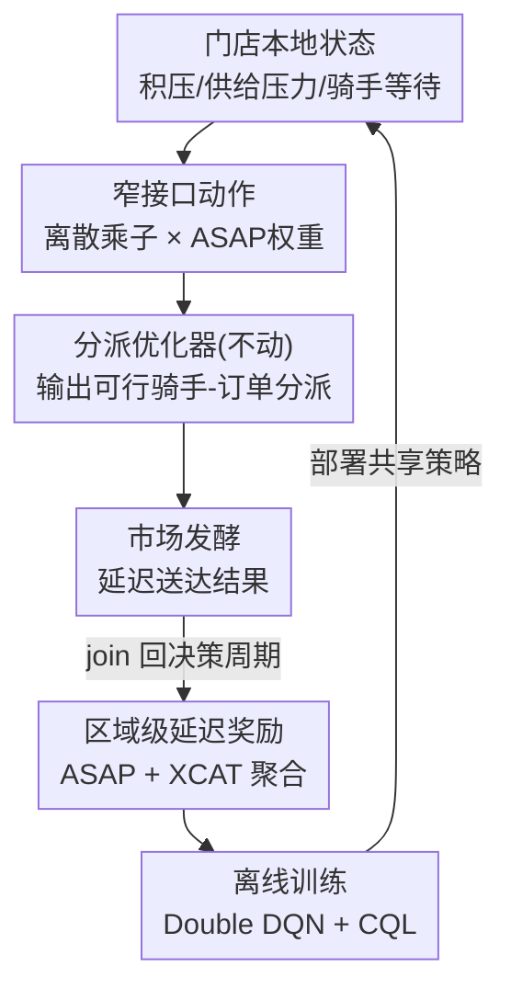

# Multi-Agent Reinforcement Learning from Delayed Marketplace Feedback for Objective-Weight Adaptation in Three-Sided Dispatch

**会议**: ICML2026  
**arXiv**: [2606.13604](https://arxiv.org/abs/2606.13604)  
**代码**: 待确认  
**领域**: 强化学习 / 离线RL / 多智能体  
**关键词**: 离线强化学习, 多智能体, 市场调度, 延迟奖励, switchback实验

## 一句话总结
DoorDash 把外卖派单的"目标权重"调控做成一个离线多智能体强化学习问题：不替换原有的组合分派优化器，而是让每个门店级 agent 根据本地市场状态选一个离散乘子来微调优化器在"送达速度 vs 拼单效率"之间的权衡，用 Double DQN + 保守 Q 正则从带延迟、噪声、耦合的市场日志里离线训练，并在约 4000 个地理区域的生产 switchback 实验中做到"提高拼单率、降低骑手侧耗时，同时不损害顾客送达质量"。

## 研究背景与动机

**领域现状**：外卖派单是嵌在"顾客-商家-骑手"三方市场里的序贯决策问题。每个派单决策同时影响顾客送达质量、商家拥堵、骑手可用性、拼单机会和成本，而评价它的不是人工偏好标注，而是来自市场的**延迟运营结果**（送达时长、骑手利用率等）。

**现有痛点**：拼单能提升骑手效率，但更快执行能降低迟到、改善顾客体验，二者天然冲突。生产中这个权衡靠**静态启发式权重**控制——全局调一次、手动更新，在局部、时变的条件下很脆：拥堵时过度拼单会推高迟到，空闲时拼单不足又浪费效率红利。

**核心矛盾**：要让权衡随本地实时状态自适应，但又不能动那个已经在生产里跑、保证可行性和安全约束的组合分派优化器——任何"换掉优化器"的方案都过不了生产门槛。

**本文目标**：(1) 设计一个从市场反馈学习、却只通过一个低维控制接口去调权重、不替换优化器的 RL 架构；(2) 把目标权重自适应形式化为带门店级去中心化执行、区域级延迟奖励的离线多智能体决策问题；(3) 拿出生产 switchback 证据。

**切入角度**：与其学"直接的运营决策"（直接分派、路由、调度——这是多数前作的做法，且多在仿真/离线评测），不如学一个**窄接口上的调控动作**——只选一个乘子去推动现有优化器的目标函数，既保留生产可行性，又能本地自适应。

**核心 idea**：用"门店级 agent 选离散乘子 → 缩放 ASAP 速度权重 → 优化器照常出可行分派"这条窄接口，把可学习的策略和不可动的优化器解耦，从而能在噪声、延迟、耦合的市场日志上安全地做离线策略学习。

## 方法详解

### 整体框架

系统是两层嵌套决策。**内层**是组合分派优化器：把订单、骑手、约束和目标权重映射成骑手-订单分派，这层不动、继续负责可行性。**外层**是目标权重自适应 agent（OWA-RL）：每个派单周期（20 秒一次），每个门店级 agent 观察本地市场状态 $s_t^i$，选一个离散乘子 $a_t^i$ 缩放基线 ASAP 速度权重 $\lambda_0$，得到当周期的自适应权重 $\lambda_t^i=a_t^i\lambda_0$ 再喂给优化器。这个动作改变下游优化目标，分派结果在市场里发酵成延迟结果（送达时长、骑手多耗时），这些延迟信号再被 join 回原决策周期构成训练数据。训练是**集中式离线**（跨门店汇集经验、用区域奖励捕捉跨店网络效应），执行是**门店级去中心化**（各店用本地状态独立跑共享策略）。

### 关键设计

**1. 窄接口动作空间：只调权重不换优化器，保住生产可行性**

动作空间是 $\mathcal{A}=\{0.8,0.9,1.0,1.1,1.2\}$，一个施加在基线 ASAP 权重上的离散乘子。门店 $i$ 选 $a_t^i$ 得到自适应权重 $\lambda_t^i=a_t^i\lambda_0$：**低乘子**让拼单/更高效路由在优化时更有吸引力，**高乘子**强调更快完成、可能让优化器把邻近订单分给不同骑手而不拼单，**中性动作 $a_t^i=1.0$ 精确恢复静态生产基线**。这个设计的关键好处是：策略只"操纵优化器的目标"，优化器仍独立强制所有可行性约束和运营保护，于是 RL 永远不会产出不可行的分派——这是它能直接上生产、服务每天数亿次推理的前提。把动作离散化也让后面能直接用离散 Q-learning。

**2. 三维门店状态 + 供给压力重标定：把被区域信号淹没的局部差异暴露出来**

状态 $s_t^i=[d_t^i,\ \text{sup}_t^i,\ \text{cwt}_t^i]$ 每个派单周期刷新一次：$d_t^i$ 是未完成配送数，$\text{cwt}_t^i$ 是骑手等待时间中位数，$\text{sup}_t^i$ 是一个**局部化的供给压力特征**。难点在于供给信号通常是区域级的，会把门店间差异抹平。作者用有效骑手供给把区域特征重标定到门店：

$$\text{sup}_t^i=\text{sup}_t^{g(i)}\cdot\frac{\widetilde{S}_t^{g(i)}}{\widetilde{S}_t^i}$$

其中 $g(i)$ 是门店 $i$ 所在区域，$\widetilde{S}_t^i$ 是近期能到达该店优化环节的可行骑手数中位数，$\widetilde{S}_t^{g(i)}$ 是对应的区域中位数。直觉很顺：当某店的可行骑手数高于区域中位数（$\widetilde{S}_t^{g(i)}>\widetilde{S}_t^i$），重标定后得到**更低的供给压力**——这样同一区域内供给充裕和紧张的门店就有了区分度，策略才能做真正的局部自适应而非区域级统一重调。

**3. ASAP/XCAT 延迟奖励 + 区域聚合：把延迟、耦合的市场反馈压成一个标量**

奖励完全来自延迟的配送结果，并按区域聚合以捕捉跨店跨骑手的网络效应。对配送 $j$，用下单、接单、送达时刻 $t_j^{\text{create}}, t_j^{\text{acc}}, t_j^{\text{drop}}$ 定义两类时序量：$\text{ASAP}_j=t_j^{\text{drop}}-t_j^{\text{create}}$（顾客侧端到端送达时长）、$\text{CAT}_j=t_j^{\text{drop}}-t_j^{\text{acc}}$（骑手活跃时间），再减去若单独配送的直达耗时 $T_j^{\text{direct}}$ 得到 $\text{XCAT}_j=\text{CAT}_j-T_j^{\text{direct}}$（**超出直达路线的多余骑手耗时**，正是拼单带来的额外成本代理）。区域 $g(i)$ 内、结果归属到决策周期 $t$ 的配送集合 $\mathcal{D}_t^{g(i)}$ 的奖励为：

$$r_t^{g(i)}=-\frac{1}{|\mathcal{D}_t^{g(i)}|}\sum_{j\in\mathcal{D}_t^{g(i)}}\left(\alpha\,\text{ASAP}_j+\beta\,\text{XCAT}_j\right)$$

ASAP 管顾客延迟、XCAT 管骑手多余耗时，区域平均捕捉网络效应，负号让"减小耗时"对应"增大奖励"。一个 transition 流水线把在线日志决策和延迟履约结果 join 成 $\mathcal{D}=\{(s_t^i,a_t^i,r_t^{g(i)},s_{t+1}^i)\}$——这一步是整个离线 RL 能成立的关键，因为反馈是延迟才到的，必须把结果正确归因回当初的决策周期。

**4. Double DQN + 保守 Q 正则：在离线日志上抑制 OOD 价值高估**

策略 $\pi_\theta(a|s)$ 是跨门店共享的，训练池化所有门店经验、用区域奖励。值函数 $Q_\theta(s,a)$ 用离线 Double DQN 目标训练——行为网络选下一动作、目标网络评估它，减小最大化偏差：

$$y_t^{\text{DDQN}}=r_t^{g(i)}+\gamma Q_{\bar\theta}\!\left(s_{t+1}^i,\ \arg\max_{a'\in\mathcal{A}}Q_\theta(s_{t+1}^i,a')\right)$$

但离线训练有个老问题：学到的策略可能给日志里**弱支撑的动作**赋高价值（OOD 高估）。作者加一个离散 Conservative Q-Learning（CQL）正则把这些未见动作的价值压下去：

$$\mathcal{L}_{\text{CQL}}(\theta)=\mathbb{E}_{(s,a)\sim\mathcal{D}}\!\left[\log\sum_{a'\in\mathcal{A}}\exp Q_\theta(s,a')-Q_\theta(s,a)\right]$$

最终目标 $\mathcal{L}(\theta)=\mathcal{L}_{\text{DDQN}}(\theta)+\eta\mathcal{L}_{\text{CQL}}(\theta)$，$\eta$ 控制保守强度。Double DQN 降偏差、CQL 抑制无支撑动作拿高分，二者一起让策略在上线前的离线学习更稳——这对一个要直接服务生产、不能在线试错的系统至关重要。

### 损失函数 / 训练策略

训练目标即上面的 $\mathcal{L}(\theta)=\mathcal{L}_{\text{DDQN}}+\eta\mathcal{L}_{\text{CQL}}$。部署前先用**离线奖励重加权诊断**测策略是否对不同市场反馈定义有方向性响应，据此选 $\alpha=0.9$——因为它给出更均衡的动作分布，避免策略坍缩到"激进拼单"或"一味提速"任一极端。折扣因子 $\gamma$、基线 ASAP 权重 $\lambda_0$、策略结构与超参在附录给出；附录还对比了去掉 CQL 的纯 DQN 训练曲线，说明保守正则对离线学习的影响。

## 实验关键数据

### 主实验（生产 switchback）

约 4000 个地理区域为随机化单元，每 2 小时一个 switchback 区间随机分流到对照（静态权重）/处理（OWA-RL, $\alpha=0.9$），持续两周。用 CUPED 做方差削减、按区域-小时桶聚类算 p 值。下表为 ATE（经方差削减调整的平均处理效应），CAT/CWT/ASAP 单位秒、% batched 与 % 20-min late 为百分点率，加粗为 $p<0.05$ 显著：

| 范围 | 指标 | 基线 | OWA-RL | ATE (p) | 方向 |
|------|------|------|--------|---------|------|
| 全时段 | CAT (秒)↓ | 1163.0 | 1159.8 | **−1.261 (0.019)** | 骑手耗时↓ |
| 全时段 | CWT (秒)↓ | 277.1 | 275.7 | **−0.856 (0.004)** | 骑手等待↓ |
| 全时段 | % 拼单↑ | 47.52% | 48.14% | **+0.495 (<0.001)** | 拼单率↑ |
| 全时段 | ASAP (秒)↓ | 1956.0 | 1960.0 | +0.972 (0.264) | 质量持平(不显著) |
| 全时段 | % 20分钟迟到↓ | 2.09% | 2.09% | −0.012 (0.237) | 质量持平 |
| 晚餐 | CAT (秒)↓ | 1156.3 | 1153.1 | **−1.289 (0.042)** | 骑手耗时↓ |
| 晚餐 | CWT (秒)↓ | 262.9 | 261.6 | **−1.030 (0.041)** | 骑手等待↓ |
| 晚餐 | % 拼单↑ | 57.99% | 58.59% | **+0.600 (0.010)** | 拼单率↑ |
| 晚餐 | % 20分钟迟到↓ | 2.36% | 2.34% | **−0.037 (0.040)** | 迟到↓ |

核心结论：效率指标（CAT、CWT、拼单率）全部显著改善，而顾客侧质量（ASAP、迟到率）无显著退化——拿到了效率红利却没牺牲体验。

### 策略行为分析

| 观察 | 内容 |
|------|------|
| 状态依赖性 | 旧金山湾区周五晚高峰，策略随积压、供给压力、骑手等待变化在不同乘子间转移概率质量 |
| 主导动作 | 多数情形偏向更高 ASAP 乘子（保速度），但在特定积压/供给状态下低乘子（促拼单）变得更可能 |
| 长期稳定 | 逐周监控决策与供给压力状态变化，呈现状态依赖自适应而非固定全局重调 |

### 关键发现
- **效率与质量解耦达成**：三个效率指标显著向好、两个质量指标不显著恶化，证明窄接口调权重能安全地榨出拼单红利。
- **晚餐时段收益更大**：晚高峰本就拼单基数高（58% vs 全时段 48%），OWA-RL 在此既提拼单又显著降迟到，说明它在压力大的时段更有发挥空间。
- **策略确实在用本地状态**：动作概率随积压/供给/等待时间动态转移，而非退化成一个固定乘子，验证了状态特征（尤其供给压力重标定）的作用。
- **$\alpha=0.9$ 是关键调参**：奖励里速度权重稍降于成本权重，避免策略坍缩到单一极端，是离线诊断选出来的。

## 亮点与洞察
- **"调目标权重"而非"换决策器"是非常工程务实的接口设计**：把可学习策略限制在一个 5 选 1 的乘子上，既让 RL 能上生产（优化器兜底可行性），又把动作空间压到离散 Q-learning 能轻松处理——这个"窄接口"范式可迁移到任何已有强优化器、不敢整体替换的生产系统。
- **供给压力重标定很巧**：用 $\frac{\widetilde{S}_t^{g(i)}}{\widetilde{S}_t^i}$ 把区域级信号还原出门店级差异，解决了"局部状态被区域聚合淹没"这个实际部署里很常见的特征工程难题。
- **XCAT 作为拼单成本代理**：用"实际骑手耗时减去单独配送的直达耗时"直接量化拼单带来的额外负担，比笼统的"骑手利用率"更贴近优化器要权衡的那个量。
- **离线 RL 上真生产并给出 switchback 因果证据**：CUPED + 区域-小时聚类的严谨实验设计，让"效率涨、质量不掉"是可信的因果结论而非相关性。

## 局限与展望
- **动作空间很窄**：只有 5 个离散乘子、只调 ASAP 一个权重维度，表达力有限；多目标、多维权重的联合自适应尚未触及。
- **奖励是手工设计的线性组合**：$\alpha\text{ASAP}+\beta\text{XCAT}$ 把复杂三方市场压成两项标量，$\alpha=0.9$ 还得靠离线诊断手调，权重设定本身仍有主观性。
- **绝对增益不大**：CAT 降约 1.3 秒、拼单率涨约 0.5–0.6 个百分点，单看微小，靠超大规模摊出业务价值；小规模/低密度市场未必有同样收益。
- **去中心化执行 + 共享策略的多智能体耦合未深究**：门店间通过区域奖励隐式耦合，但没有显式的 agent 间协调或博弈分析，store 间策略相互影响的稳定性是开放问题。

## 相关工作与启发
- **vs 直接学运营决策的外卖 RL（分派/路由/调度/批处理）**：多数前作让 RL 直接出操作决策且在仿真/离线评测；本文反其道——RL 不碰最终分派，只通过窄接口调优化器目标，换来的是能真上生产的可行性与安全性。
- **vs 标准在线 DQN**：本文用离线 Double DQN + CQL，针对的是"只能从日志学、不能在线试错"的生产约束，CQL 专门压制日志弱支撑动作的价值高估。
- **vs RLHF（从人类偏好学）**：这里没有人工偏好标注，奖励完全来自市场的延迟运营结果——是"从世界反馈学"而非"从人类反馈学"的一个具体落地范例。
- **vs 静态启发式权重调参**：传统做法全局手调、时变条件下脆弱；本文用门店级状态依赖策略替代，中性动作还能精确退回基线，部署风险可控。

## 评分
- 新颖性: ⭐⭐⭐⭐ 窄接口调权重 + 从延迟市场反馈离线学的组合在生产语境下新颖，但单个组件(DDQN/CQL)是成熟件
- 实验充分度: ⭐⭐⭐⭐ 4000 区域两周 switchback + CUPED + 策略行为分析很扎实，但缺与其他 RL 方法的横向对比
- 写作质量: ⭐⭐⭐⭐ 两层决策、奖励构造、离线训练讲得清晰，公式完整
- 价值: ⭐⭐⭐⭐⭐ 真实部署、服务每天数亿次推理，"效率涨质量不掉"的生产证据对工业界很有参考价值

<!-- RELATED:START -->

## 相关论文

- [\[ICML 2026\] Parameter-free Dynamic Regret: Time-varying Movement Costs, Delayed Feedback, and Memory](parameter-free_dynamic_regret_time-varying_movement_costs_delayed_feedback_and_m.md)
- [\[ICML 2026\] Vulnerable Agent Identification in Large-Scale Multi-Agent Reinforcement Learning](vulnerable_agent_identification_in_large-scale_multi-agent_reinforcement_learnin.md)
- [\[ICML 2025\] Test-Time Adaptation with Binary Feedback](../../ICML2025/reinforcement_learning/test-time_adaptation_with_binary_feedback.md)
- [\[NeurIPS 2025\] Bandit and Delayed Feedback in Online Structured Prediction](../../NeurIPS2025/reinforcement_learning/bandit_and_delayed_feedback_in_online_structured_prediction.md)
- [\[ICLR 2026\] A Reward-Free Viewpoint on Multi-Objective Reinforcement Learning](../../ICLR2026/reinforcement_learning/a_reward-free_viewpoint_on_multi-objective_reinforcement_learning.md)

<!-- RELATED:END -->
