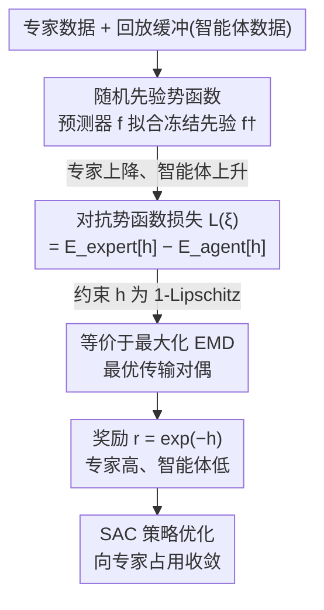

# Noise-Guided Transport: Imitation Learning from Random Priors

**会议**: ICML 2026  
**arXiv**: [2509.26294](https://arxiv.org/abs/2509.26294)  
**代码**: 待确认  
**领域**: 强化学习 / 模仿学习  
**关键词**: 模仿学习, 最优传输, 随机先验, 对抗训练, 样本高效

## 一句话总结
把模仿学习改写成「让一个预测网络在专家数据上去拟合一个冻结随机先验网络、在智能体数据上反着拟合」的对抗训练，证明这个目标等价于在最小化专家与智能体分布之间的最优传输距离（EMD），从而得到一个不需要梯度惩罚、在只有 20 条转移的超低数据下也能学会人形机器人步态的轻量方法。

## 研究背景与动机

**领域现状**：在大数据规模下，行为克隆（BC）配合大模型已经足以做模仿学习；但在**低数据**场景——只有少量专家示范——BC 会因复合误差（compounding error）而崩。在线的对抗模仿学习（AIL）通过「内层逆强化学习 + 外层强化学习」缓解复合误差，代表作 GAIL 以及其 off-policy 演化 DAC、SAM，本质是训练一个二分类判别器去区分专家与智能体的状态-动作分布，等价于最小化二者的 JS 散度。

**现有痛点**：基于 GAN 的 AIL 有两个老毛病。其一，JS 散度在两个分布支撑不重叠时会**模式坍缩、梯度消失**，训练不稳，几乎所有 off-policy 的 AIL SOTA 都必须靠**梯度惩罚（GP）**正则才能稳——而 GP 让反向传播代价翻倍，又慢又贵。其二，另一条线如 RED 用「从随机先验预测」学一个专家检测器，但它**完全离线**、且只有专家这一个正信号（类似单类/正样本-无标签学习），抓不住真正的专家分布。

**核心矛盾**：想要样本高效 + 稳定，就既要避开 JS 散度的不重叠困境（这逼出 GP），又要给「随机先验预测」补上负信号、并让它在线更新。两个方向各缺一半。

**本文目标**：设计一个轻量、off-policy、不需要预训练或特殊架构、自带不确定性估计、且不依赖梯度惩罚的奖励学习目标，能在超低数据下扩展到高维人形控制。

**切入角度**：作者注意到「预测随机先验」的匹配损失天然是一个**伪密度信号**——专家常去的区域预测误差低、罕见区域误差高；只要把它从「只在专家上下降」扩展成「在专家上下降、在智能体上上升」，单类问题就变成二分类，而且可以证明这个对抗目标其实在优化一个最优传输距离，从根上绕开 JS 散度。

**核心 idea**：用「预测器 vs 冻结随机先验」的匹配损失当势函数 $h_\xi$，在专家数据上压低、在智能体数据上抬高；约束 $h_\xi$ 为 1-Lipschitz，则该目标恰好等于专家与智能体分布间的 EMD（Wasserstein-1），奖励直接由势函数取 $r_\xi=\exp(-h_\xi)$。

## 方法详解

### 整体框架

NGT 有两个网络：一个**冻结的随机先验网络** $f^\dagger_\xi$（初始化后永不更新，输出 $m$ 维随机目标）和一个**可训练的预测器** $f_\xi$（去拟合先验输出）。两者输出的非负匹配损失 $h_\xi(x)=\ell\big(f_\xi(x),f^\dagger_\xi(x)\big)$ 被称为**势函数**：在专家数据上做梯度下降压低它、在智能体数据上做梯度上升抬高它，于是势函数学会「专家区域低、智能体区域高」。把势函数取负指数 $r_\xi=\exp(-h_\xi)$ 就得到「专家高、智能体低」的奖励，喂给一个 SAC actor-critic 去优化策略。整套训练只在标准 off-policy RL 循环里多了一个奖励学习头。

### 关键设计

**1. 随机先验势函数：把「预测随机噪声」变成自带负信号的对抗奖励**

这一步针对 RED「只有正信号、纯离线」的缺陷。冻结先验网络 $f^\dagger_\xi$ 把输入映成一个 $m$ 维随机目标，预测器 $f_\xi$ 去拟合它，匹配损失 $h_\xi(x)=\ell(f_\xi(x),f^\dagger_\xi(x))$ 在见得多的区域低、见得少的区域高，因此 $h_\xi$ 本身就是一个伪密度/伪指示信号，其大小和波动还顺带编码了对随机目标拟合的认知不确定性（epistemic uncertainty）。RED 只在专家数据上下降这个损失；NGT 的关键改动是**同时在智能体数据上上升它**，于是损失变成

$$L(\xi):=\mathbb{E}_{x\sim P_{\text{expert}}}\big[h_\xi(x)\big]-\mathbb{E}_{x\sim P_{\text{agent}}}\big[h_\xi(x)\big]$$

最小化 $L(\xi)$ 让 $h_\xi$ 给专家低值、给智能体高值，再用单调递减变换 $r_\xi(x)=\exp(-h_\xi(x))$ 翻转成奖励：它天然非负、被 $\ell\ge0$ 约束在 $(0,1]$，并放大专家与智能体的对比。这把「单类分类」升级成「二分类」，补齐了负信号；而且智能体侧用的是 off-policy 回放缓冲分布 $\beta$（历史策略的混合），契合样本高效需求。

**2. 1-Lipschitz 约束下等价于最优传输（EMD）：绕开 JS 散度的不重叠困境**

这一步从根上回答「为什么不用 GAN 的 JS 散度」。把势函数限制在 1-Lipschitz 函数空间 $H^1_\xi$ 里求下确界，论文证明

$$\inf_{h_\xi\in H^1_\xi}L(\xi)=-\sup_{h_\xi\in H^1_\xi}\Big(\mathbb{E}_{x\sim P_{\text{agent}}}[h_\xi]-\mathbb{E}_{x\sim P_{\text{expert}}}[h_\xi]\Big)=-\mathrm{EMD}(P_{\text{agent}},P_{\text{expert}})$$

即最小化 $L(\xi)$ 等价于**最大化**专家与智能体分布之间的 earth-mover 距离（即 Wasserstein-1 距离）。这正是 Kantorovich-Rubinstein 对偶：本该有两个对偶势，NGT 只学一个 $h_\xi$，第一个期望用 $h_\xi$、第二个用 $-h_\xi$，从而把对偶约束收缩成单个势函数的 1-Lipschitz 连续性约束。相比 JS 散度在支撑不重叠时坍缩/梯度消失，EMD 即使分布不重叠也能给出有意义的、平滑的梯度，这是 NGT 稳定性的理论来源。论文还给出经验估计 $\hat L(\xi)$ 的集中不等式：它以指数速率收敛到真值 $L(\xi)$，偏差由势函数的 Lipschitz 常数和输入空间直径控制，量化了样本效率。

**3. 用谱归一化 + 正交初始化「免费」拿到 1-Lipschitz，省掉梯度惩罚**

要让上面的等价成立，$h_\xi$ 必须近似 1-Lipschitz。由函数复合，$\Lambda(h_\xi)=\Lambda(\ell)\big(\Lambda(f_\xi)+\Lambda(f^\dagger_\xi)\big)$。论文逐项控制：对预测器和先验的每个线性层用**谱归一化（SN）**把谱范数压到 1；用**正交初始化（OI）**让权重成为保范映射——因为先验网络冻结且正交初始化，其奇异值本就为 1、SN 对它无效也不需要，随机先验还因满秩映射最大化利用了 $m$ 维输出空间；配合近线性激活（ReLU/LeakyReLU），$\Lambda(f^\dagger_\xi)$ 接近 1，预测器侧靠 SN 防止 $\Lambda(f_\xi)$ 在更新中失控。对损失项，$\Lambda(\ell)$ 是设计固定值：用 Huber 损失（$\delta=1$，1-Lipschitz）作默认。**关键收益**：实践中不必追求「完美 1」、只要把 $\Lambda(h_\xi)$ 稳在 1 附近即可，因此 NGT **不需要梯度惩罚**——而所有 off-policy 对抗 IL 的 SOTA 基线都离不开 GP。GP 让反向传播代价翻倍，SN 只加极小开销，这让 NGT 更快更省。

**4. 直方图分布损失 ℓ_HLG：把回归变分类，扩展到高维人形**

在最难的 Humanoid 任务上，Huber/softmax 等回归型损失都失效。论文把 RL 值学习里的「高斯型直方图损失」$\ell_{\text{HLG}}$ 搬来做奖励学习：它有四个超参 $(a,b,N,\sigma)$，把区间 $[a,b]$ 划成 $N$ 个 bin、用宽度 $\sigma$ 的正态把概率质量摊到邻近 bin。选它的理由是把回归变成分类能带来标签平滑（抗过拟合）、利用回归目标的序结构提升泛化、且分类损失表征更鲁棒、更能吃规模。由于 NGT 预测的是 $m$ 维随机先验向量，预测实际落在 $N\times m$ 个 bin 上（而非 $N$ 个），这在预测器和先验之间引入一个架构上的非对称（先验出 $m$ 个标量、预测器出 $N\times m$ 维分布）。论文还推出 $\ell_{\text{HLG}}$ 关于 logits 的 Lipschitz 上界 $\Lambda\le\sqrt{1+(C/\sigma)^2}$（$C:=\Delta_s\sqrt{(N-1)/(2\pi)}$，$\Delta_s$ 为 bin 宽），指出 $\sigma$ 太小会让 Lipschitz 常数爆掉、必须取足够大的 $\sigma$ 才稳。正是 $\ell_{\text{HLG}}$ 让 NGT 成功扩展到 Humanoid。

### 损失函数 / 训练策略
奖励侧最小化 $L(\xi)=\mathbb{E}_{\text{expert}}[h_\xi]-\mathbb{E}_{\text{agent}}[h_\xi]$，势函数用 SN+OI 约束近 1-Lipschitz，损失默认 Huber、人形用 $\ell_{\text{HLG}}$；奖励 $r_\xi=\exp(-h_\xi)$ 喂给共享的 SAC actor-critic 骨干做 off-policy 策略优化。所有基线都从同一 SAC 骨干复现，只在「奖励如何计算/学习」上有别。

## 实验关键数据

在 Gymnasium 连续控制套件上，专家是用不同种子训的 SAC 策略，示范数取 1/4/11 条、按 20 的采样率子采样（1 条示范 = 50 条转移），每实验 4 个随机种子。FIGURE 2 / FIGURE 3 分别汇总 720 / 72 次实验。

### 主实验

| 设置 | NGT | 对照 | 结论 |
|------|-----|------|------|
| 全套连续控制 + 各示范数 | 全面达到专家水平、超过基线 | DAC/SAM、W-DAC/SAM、MMD、PWIL、RED*、DiffAIL | NGT 总体最优 |
| Humanoid-v4 (高维) | 达到专家步态，最低 20 条转移 | 仅 DiffAIL 有进展但次优、开销大 | NGT 优雅扩展到高维 |
| 状态-状态 / 仅状态（无专家动作） | 稳定收敛 | 多数基线在仅状态下失败 | NGT 在缺动作时仍 work |
| 是否需梯度惩罚 | 不需要（仅 SN） | DAC/SAM 等必须用 GP | NGT 更快更省 |

### 分析实验

| 对比 | 观察 | 说明 |
|------|------|------|
| NGT vs WGAN(W-DAC/SAM) | NGT 明显更好 | 「优化 EMD」不是全部，难点在能否稳定估好 EMD；随机先验预测任务比二分类更优雅地随容量扩展 |
| 二分类判别器 vs m 维先验预测 | 二分类训练早期易变平凡、需强正则 | $m$ 维预测任务提供更平滑学习动态 |
| $\ell_{\text{HLG}}$ 双侧 $\sigma$ | 专家侧用更大 $\sigma$ | 模拟 JS-GAN 只平滑专家标签的技巧 |
| 10 种子稳定性 (FIGURE 4) | 跨 run 方差很紧 | 学习动态稳定 |

### 关键发现
- **去掉梯度惩罚是核心红利**：NGT 仅靠谱归一化就稳住 1-Lipschitz，省掉了让反向传播翻倍的 GP，比所有 off-policy AIL 基线更快更省，作者推测这源于势函数带来的更好数值稳定性和更平滑的学习动态。
- **EMD 不是万能口号**：NGT 与直接最大化 EMD 的 WGAN 在结果上差距明显，说明「目标是 EMD」远不如「能否稳定估好 EMD」重要，随机先验预测恰好提供了这种稳定估计。
- **分布损失解锁高维**：只有换成 $\ell_{\text{HLG}}$，NGT 才在 Humanoid 上从失败变成功，把回归变分类的「标签平滑 + 吃规模」是关键。

## 亮点与洞察
- **「预测随机噪声的误差」竟能当奖励**：把 RND 式的随机先验预测误差当伪密度，再加一个智能体侧的负梯度，就同时拿到不确定性估计和判别信号，思路精巧且零额外架构。
- **一个理论桥把工程稳定性讲透**：1-Lipschitz 势 ⇒ EMD 对偶这条等价，既解释了为什么 NGT 不需要 GP，也解释了为什么它在分布不重叠时仍稳——理论和工程对得很齐。
- **只学一个对偶势的简化**：用 $h_\xi$ 和 $-h_\xi$ 充当 Kantorovich 对偶的两个势，把双势约束收成单势的 1-Lipschitz 约束，这个化简可迁移到任何想用 Wasserstein 对偶又怕双网络复杂度的场景。

## 局限与展望
- 实验集中在 Gymnasium 连续控制（含 Humanoid），未在视觉/真实机器人或离散控制上验证。
- 人形任务对 $\ell_{\text{HLG}}$ 的依赖说明默认回归损失能力有限，$\ell_{\text{HLG}}$ 的 $(a,b,N,\sigma)$ 调参敏感（理论也指出 $\sigma$ 过小会失稳）。
- 作者自陈的展望是把这套目标推广到一般生成建模；本文也未与基于大规模预训练的 BC 在其擅长的大数据区做正面比较（论文指出数据充足时 BC 本就是好选择）。

## 相关工作与启发
- **vs RED**：他们也用随机先验预测当奖励，但纯离线、只有专家正信号；NGT 加入智能体负信号并在线对抗更新，把单类升级为二分类，抓住真正的专家分布。
- **vs DAC / SAM (JS-GAN AIL)**：他们用二分类判别器优化 JS 散度，支撑不重叠时坍缩、必须靠梯度惩罚；NGT 优化 EMD、仅靠谱归一化即稳，更快更省。
- **vs WGAN 式 IL**：同样冲着 Wasserstein，但 NGT 用随机先验预测任务做势函数，比 WGAN critic 更稳地估 EMD，实验上明显领先。
- **vs DiffAIL**：他们用扩散误差替代判别器输出，在 Humanoid 上靠扩散表征强但其它环境吃力、开销大；NGT 轻量且全面更优。

## 评分
- 新颖性: ⭐⭐⭐⭐⭐ 把随机先验预测、对抗负信号与最优传输对偶三者缝成一个干净目标，视角新
- 实验充分度: ⭐⭐⭐⭐ 覆盖低数据/仅状态/高维人形 + 大量种子与消融，但限于 Gym 仿真
- 写作质量: ⭐⭐⭐⭐ 理论推导（EMD 等价、Lipschitz 界）与工程动机衔接清晰
- 价值: ⭐⭐⭐⭐⭐ 超低数据、免梯度惩罚、轻量易实现，对数据稀缺的生物机器人/医疗很有用

<!-- RELATED:START -->

## 相关论文

- [\[ACL 2026\] Beyond Fully Random Masking: Attention-Guided Denoising and Optimization for Diffusion Language Models](../../ACL2026/reinforcement_learning/beyond_fully_random_masking_attention-guided_denoising_and_optimization_for_diff.md)
- [\[ICML 2026\] Video-Based Optimal Transport for Feedback-Efficient Offline Preference-Based Reinforcement Learning](video-based_optimal_transport_for_feedback-efficient_offline_preference-based_re.md)
- [\[ICML 2026\] Counterfactual Transport Flows for Offline Conservative Trajectory Refinement](counterfactual_transport_flows_for_offline_conservative_trajectory_refinement.md)
- [\[ICLR 2026\] Boolean Satisfiability via Imitation Learning](../../ICLR2026/reinforcement_learning/boolean_satisfiability_via_imitation_learning.md)
- [\[ICLR 2026\] On Discovering Algorithms for Adversarial Imitation Learning](../../ICLR2026/reinforcement_learning/on_discovering_algorithms_for_adversarial_imitation_learning.md)

<!-- RELATED:END -->
