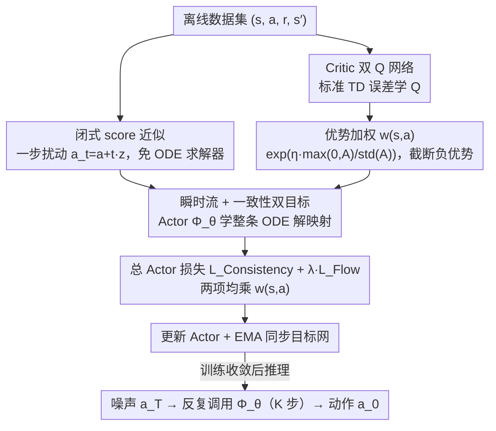

# Offline Reinforcement Learning with Generative Trajectory Policies

**会议**: ICML2026  
**arXiv**: [2510.11499](https://arxiv.org/abs/2510.11499)  
**代码**: https://github.com/wmd3i/gtp  
**领域**: 强化学习 / 离线 RL / 生成式策略  
**关键词**: 离线强化学习, ODE 流图, 一致性轨迹, Flow Matching, 优势加权

## 一句话总结
本文用「连续时间 ODE 解映射」把扩散策略、Flow Matching、一致性策略统一为同一族「生成轨迹策略 (GTP)」，再加上一个对齐离线样本的闭式 score 近似与一个优势加权的训练目标，使策略在 D4RL 上既能少步采样、又能在 AntMaze 等硬任务上拿到接近满分的成绩。

## 研究背景与动机

**领域现状**：离线 RL 不允许与环境交互，必须从固定数据集里挖出一个能泛化的策略；而数据中的行为常呈强多模态，于是近两年「用生成模型当策略」成了主流——扩散策略 (Diffusion Policy)、一致性策略 (Consistency Policy)、Flow Matching 策略层出不穷。

**现有痛点**：这一族方法长期被一个尖锐的 trade-off 拉扯——扩散策略表达力强但需要几十步迭代采样，单步推理代价过高；一致性策略把推理压到一两步，但策略质量明显掉点，性能很快饱和。

**核心矛盾**：扩散与一致性看似两条路线，本质上都在学同一条由 ODE 描述的「噪声→数据」轨迹，只不过前者学瞬时速度场，后者学跨度极大的跳变。两者各自只触及了 ODE 解映射 $\Phi(\boldsymbol{x}_t, t, s)$ 的一个极端，没人去学整条解映射。

**本文目标**：(i) 把扩散、Flow Matching、一致性、CTM、Shortcut、MeanFlow 等放进一个统一的 ODE 解映射框架；(ii) 在此框架下设计一个表达力与效率兼得的离线 RL 策略类；(iii) 解决「自举监督不稳定」「BC 目标与策略改进错位」两大实现障碍。

**切入角度**：与其在「扩散 vs 一致性」之间二选一，不如直接学完整的 ODE 解映射 $\Phi(\boldsymbol{x}_t, t, s)$——它天然能在任意步长上跳跃，既保留扩散的表达力又获得一致性的效率。

**核心 idea**：用「瞬时锚 + 全局自一致」两个互补目标共同学解映射；再用基于离线样本的闭式 score 替代自举监督，并用优势指数权重把生成损失推向高价值动作。

## 方法详解

### 整体框架

GTP 把策略 $\pi_\theta(s)$ 实现为一张参数化的 ODE 解映射 $\Phi_\theta(s, a_t, t, \tau)$：输入状态 $s$、带噪动作 $a_t$、当前时刻 $t$、目标时刻 $\tau$，输出更干净的动作 $a_\tau$。推理时从 $a_T \sim \mathcal{N}(0, T^2 I)$ 出发，沿任意时间网格 $T = t_0 > t_1 > \dots > t_K = 0$ 反复调用 $\Phi_\theta$ 得到最终动作，可在 1 步到几十步之间自由折中。训练时用 Actor-Critic 联合优化：Critic 是双 Q 网络，按标准 TD 误差学；Actor 同时优化「瞬时流损失」和「轨迹一致性损失」，并由 advantage-weighted 系数 $w(s,a)$ 把生成式 BC 推向策略改进。

### 关键设计

**1. 统一 ODE 解映射的瞬时流 + 一致性双目标：让一个网络既等同去噪、又满足任意大跨度的轨迹可加**

扩散策略和一致性策略看似两条路，本质都在学同一条"噪声→数据"的 ODE 轨迹——前者学瞬时速度场要数十步积分，后者学一步跳变但很快饱和，谁都只碰到了解映射 $\Phi(\boldsymbol{x}_t,t,s)$ 的一个极端。GTP 干脆把整条解映射学下来。它引入代理函数 $\phi(\boldsymbol{x}_t, t, s) = \boldsymbol{x}_t + \frac{t}{t-s}\int_t^s f(\boldsymbol{x}_\tau, \tau) d\tau$，通过 $\Phi = (1 - s/t)\phi + (s/t)\boldsymbol{x}_t$ 还原解映射，再用两个互补目标共同约束：**瞬时流损失**取 $s \to t$ 极限 $\lim_{s\to t}\phi = \boldsymbol{x}_t - t f(\boldsymbol{x}_t, t)$，等价于让网络学去噪/速度场，当局部锚；**轨迹一致性损失**强制 $\Phi(\boldsymbol{x}_t, t, s) \approx \Phi(\Phi(\boldsymbol{x}_t, t, u), u, s)$ 对任意 $t > u > s$ 成立，当全局调控。单有瞬时损失只能复现扩散的局部行为、要几十步积分；单有一致性损失没有局部锚就只是抄个老师网络——两者一起优化，才能在"少步推理质量"和"多步推理上限"之间拿到整条解映射。

**2. 闭式 score 近似：用一次扰动取代自举监督，斩断"坏分数→坏目标→更坏分数"的恶性循环**

扩散/一致性策略在离线 RL 里训不深的根本原因是自举监督——用早期还很烂的网络自身当 ODE 右端项 $f_\theta$ 再积分出训练目标，演员-评论员循环里坏目标驱动坏更新。GTP 把 ODE 右端的真实 score $f^\star(\boldsymbol{x}_t, t) = (\boldsymbol{x}_t - \mathbb{E}[\boldsymbol{x}|\boldsymbol{x}_t])/t$ 直接替换成锚到当前离线样本 $\boldsymbol{x}$ 的闭式代理 $\tilde{f}(\boldsymbol{x}_t, t) = (\boldsymbol{x}_t - \boldsymbol{x})/t$。Theorem 4.1 给出保证：当 ODE 求解器是 $p$ 阶零稳定、最大步长为 $h$ 时，理想目标与实际目标之差仅 $O(h^p)$。实操上轨迹一致性损失里的中间样本由 $\boldsymbol{x}_u = \boldsymbol{x} + u \cdot \boldsymbol{z},\ \boldsymbol{z} \sim \mathcal{N}(0, I)$ 一步生成，连 ODE 求解器都免了——既省算力，又用"把监督锚回数据"取代了多步积分。

**3. 优势加权的价值驱动目标：把生成式 BC 推向真正的策略改进**

纯生成目标只能复刻数据分布，无法实现策略改进。GTP 在 KL 正则化的 RL 目标下推出最优策略形如 $\pi^*(a|s) \propto \pi_{\text{BC}}(a|s)\exp(\eta A(s,a))$，由此得到优势加权生成损失 $\max_\theta \mathbb{E}_{(s,a)\sim\mathcal{D}}[\exp(\eta A(s,a)) \cdot \ell_{\text{gen}}(\pi_\theta; a|s)]$。实际权重做归一化加截断 $w(s,a) = \exp\left(\eta \cdot \frac{\max(0, A(s,a))}{\text{std}(A) + \epsilon}\right)$，再乘进瞬时流损失与轨迹一致性损失的期望里。硬截断负优势是为了避免低质量动作把权重拉成负数，标准差归一化则让 $\eta$ 在不同任务上不必重调——这套设计像 IQL/AWR 一样在数据分布内偏向高回报动作，同时保留了扩散式的多模态表达力。

### 损失函数 / 训练策略

总 Actor 损失为 $\mathcal{L}_{\text{actor}} = \mathcal{L}_{\text{Consistency}} + \lambda_{\text{Flow}} \cdot \mathcal{L}_{\text{Flow}}$，其中两项都乘 $w(s, a)$；Critic 走标准双 Q TD 目标 $r + \gamma \min_{j=1,2} Q_{\bm{\varphi}_j^-}(s', \pi_{\theta'}(s'))$；Actor 与 Critic 目标网均用 EMA 更新。推理步数 $K$ 在 1–8 之间任选，对应单一模型给出从「极快但稍粗」到「多步精修」的连续谱。

## 实验关键数据

### 主实验

D4RL 上对比当时最强生成式策略（含扩散 / 一致性 / Flow）与经典离线 RL，GTP 在 Locomotion 与 AntMaze 上均拿到 SOTA，并在以多模态轨迹著称的 AntMaze 大图任务上接近满分。

| 数据集 | 指标 | GTP (本文) | 之前最强生成式 SOTA | 提升 |
|--------|------|------------|---------------------|------|
| AntMaze-Large-Diverse | Normalized Score | ≈ 100 (满分级) | 显著低于满分 | 大幅领先，几乎"解决" |
| AntMaze-Large-Play | Normalized Score | ≈ 100 (满分级) | 显著低于满分 | 大幅领先 |
| D4RL Locomotion (mean) | Normalized Score | 总分最高 | 略低 | 全面持平或超越 |

### 消融实验

| 配置 | 关键指标 | 说明 |
|------|---------|------|
| Full GTP | 最高 | 闭式 score + 一致性损失 + 优势加权 |
| w/o 闭式 score 近似 | 显著下降 | 退化为自举监督，训练不稳，AntMaze 大幅掉点 |
| w/o 一致性损失 | 中度下降 | 仅剩瞬时损失，少步推理质量崩塌，需要更多采样步 |
| w/o 优势加权 | 中度下降 | 退化为生成式 BC，无法策略改进 |

### 关键发现

- 闭式 score 近似是 AntMaze 系列「能不能解决」的分水岭——它既省算力又把训练稳住；这与 Theorem 4.1 给出的 $O(h^p)$ 误差界一致：实际差距只是一个高阶小量。
- 轨迹一致性损失对「少步推理」尤其关键；推理步数 $K$ 从 8 降到 1 时，没有它的版本掉得最厉害。
- 优势加权对 Locomotion 类「数据多样性较低」的任务收益更明显，对 AntMaze 这种已经被表达力瓶颈卡住的任务收益相对小。

## 亮点与洞察

- **「学整条解映射」是个被忽视的中间路线**：作者跳出「单步 vs 多步」的二元对立，直接学映射 $\Phi(\boldsymbol{x}_t, t, s)$ 本身，这一视角顺手把 CTM、Shortcut、MeanFlow 都纳入同一族，启发同时适用于生成模型与策略学习。
- **闭式 score 既省算力又稳训练**：用 $(\boldsymbol{x}_t - \boldsymbol{x})/t$ 替换网络自身预测的 score，本质是「把监督锚回数据」，与 Flow Matching 把 score 锚到条件路径的精神一致，但更激进地砍掉了 ODE 求解器；其 $O(h^p)$ 界给了实践者明确的「步长选多大就够」的指导。
- **可迁移 trick**：advantage-weighted 生成损失的 $\max(0, A)/\text{std}(A)$ 标准化 + 截断范式很「即插即用」，可以直接套到任何「生成式 BC + 价值修正」的离线 RL 框架上，包括非生成式的 actor-critic 也能借鉴这个权重设计。

## 局限与展望

- **理论保证依赖 Lipschitz + 零稳定假设**：$O(h^p)$ 误差界假设 $f^\star$ 与 $\Phi_\theta$ 都对 $\boldsymbol{x}$ 是 Lipschitz 的，实际网络（含 ReLU、attention）只能近似满足，靠近 $t \to 0$ 时 $\tilde{f}$ 的奇异性也未充分讨论。
- **仅在 D4RL 上验证**：未涉及图像观测的机器人控制 (RoboMimic / 真实机械臂) 或多任务策略，AntMaze 的胜利是否能迁到高维像素观测尚未知。
- **可改进方向**：把 GTP 与扩散 Q-learning 中的「分类器引导」结合，把优势加权从「乘在损失上」升级为「乘在采样轨迹上」，可能在采样阶段直接显式做策略改进，进一步降低对权重 $\eta$ 的依赖。

## 相关工作与启发

- **vs 扩散策略 (Wang et al. 2023, Janner et al. 2022)**：他们学瞬时去噪，需要数十步推理；GTP 把同一个网络扩展为解映射，可在任意步长上跳跃，推理 1–4 步就接近多步上限。
- **vs 一致性策略 (Ding & Jin 2024)**：他们靠蒸馏强行把推理压成 1 步，性能很快饱和；GTP 不蒸馏老师，而是同时学局部速度场与全局一致性，从根上消解了表达力-效率 trade-off。
- **vs IQL / AWR**：经典优势加权方法用 Gaussian/MLP 策略，难以拟合多模态行为；GTP 把同样的 advantage-weighted 思想嫁接到生成轨迹策略上，把「值函数引导」与「分布表达力」首次干净地解耦。

## 评分
- 新颖性: ⭐⭐⭐⭐⭐ 把 CTM/Flow/Consistency 收进一个 ODE 解映射框架并落到 RL 是少见的「视角即贡献」之作。
- 实验充分度: ⭐⭐⭐⭐ D4RL 全面 SOTA、AntMaze 拿到满分级数字，三项消融都把关键设计的贡献说清楚了；缺像素观测任务。
- 写作质量: ⭐⭐⭐⭐⭐ 统一框架 → 三大障碍 → 三组对策的叙事干净利落，Theorem 4.1 + 两个 Remark 把直觉与界绑得很紧。
- 价值: ⭐⭐⭐⭐⭐ 一举消解长期困扰离线 RL 生成式策略的「表达力 vs 效率」trade-off，为后续连续时间生成式策略提供了通用蓝图。

<!-- RELATED:START -->

## 相关论文

- [\[ICML 2026\] Beyond the Proxy: Trajectory-Distilled Guidance for Offline GFlowNet Training](beyond_the_proxy_trajectory-distilled_guidance_for_offline_gflownet_training.md)
- [\[AAAI 2026\] One-Step Generative Policies with Q-Learning: A Reformulation of MeanFlow](../../AAAI2026/reinforcement_learning/one-step_generative_policies_with_q-learning_a_reformulation_of_meanflow.md)
- [\[ICML 2026\] Trajectory-Level Data Augmentation for Offline Reinforcement Learning](trajectory-level_data_augmentation_for_offline_reinforcement_learning.md)
- [\[ICML 2026\] PAC-Bayesian Reinforcement Learning Trains Generalizable Policies](pac-bayesian_reinforcement_learning_trains_generalizable_policies.md)
- [\[ICML 2026\] Offline Reinforcement Learning with Universal Horizon Models](offline_reinforcement_learning_with_universal_horizon_models.md)

<!-- RELATED:END -->
