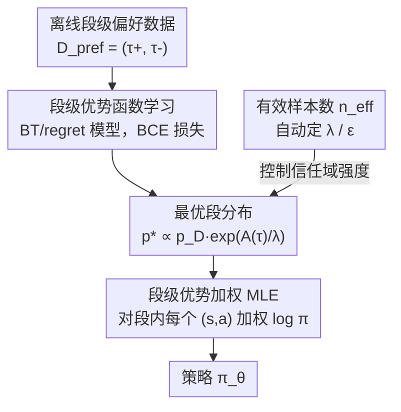

# PAWS: Preference Learning with Advantage-Weighted Segments

**会议**: ICML 2026  
**arXiv**: [2606.11982](https://arxiv.org/abs/2606.11982)  
**代码**: https://ataranovic.github.io/PAWS-webpage/ (项目主页含代码)  
**领域**: 强化学习 / 偏好学习（PbRL）  
**关键词**: 偏好强化学习, 时序信用分配, 优势函数, 信任域, 有效样本数

## 一句话总结
PAWS 指出现有偏好强化学习（PbRL）"在段级训练效用函数、却在单步级使用"造成了分布偏移，从而提出**全程都在轨迹段（segment）层面**训练优势函数并更新策略，用段级优势加权 + 信任域约束的加权最大似然来优化策略，在 Meta-World 机器人操作任务上把偏好信号的利用率和成功率都显著拉高。

## 研究背景与动机

**领域现状**：偏好强化学习（PbRL）让人类只需对两段行为做"哪个更好"的二元比较，就能学出策略，省去了显式奖励设计和专家示范，特别适合奖励难写、示范质量参差（如不同熟练度的遥操作）的任务。主流做法是先用段级/轨迹级的偏好对，按 Bradley–Terry 模型训练一个效用函数（奖励模型或优势模型），再拿它去做策略优化。

**现有痛点**：效用函数是在**整段**上训练的——损失只约束"整段优势之和"的大小关系；但策略优化时（如 PPO、IQL 这类逐 state-action 更新）却要在**单个 state-action 对**上查询这个效用。训练时看段、推理时看步，二者的输入分布根本不一致。

**核心矛盾**：作者把这件事重新诊断为**训练-推理之间的分布偏移**，而非传统认为的"缺少细粒度标签"。因为段级损失只约束 $A_\phi(\tau)=\sum_t A_\phi(s_t,a_t)$ 这个和，**很多种完全不同的逐步优势分配都能解释同一个段级偏好标签**（论文 Figure 2：同样的段和、单步颜色深浅却天差地别）。于是单步信用分配从根上就是欠定的、任意的，策略更新被这种任意性带偏。这就是"时序信用分配难题"的真正来源。作者还实证：当用与训练分布一致的**段级**输入去查询同一个学好的效用函数时，预测质量明显变好。

**本文目标**：消除训练与使用之间的分布不一致，让段级偏好信息能可靠地传播到策略更新里，同时尽量少依赖手调的优化超参。

**核心 idea**：**别在单步上查效用了**——直接在轨迹段层面做策略优化。用一个"训练和查询都在段上"的优势函数，配合信任域约束的加权最大似然更新，把"段级优势高"翻译成"该段里所有动作的似然该被加权抬高"。

## 方法详解

### 整体框架

PAWS 接收一批离线收集好的、对轨迹段的偏好数据 $D_{\mathrm{pref}}=\{(\tau_i^+,\tau_i^-)\}$，输出一个策略 $\pi_\theta$。整条管线分三步且首尾一致地停留在"段"这个粒度上：先在段级偏好上训练优势函数 $A_\phi$；再用 $A_\phi$ 把数据分布 $p_D$ 重加权成一个"优势越高、概率越大、但不离原分布太远"的最优段分布 $p^*$；最后把策略 $\pi_\theta$ 投影到 $p^*$ 上，得到一个**段级优势加权的最大似然**目标。其中信任域强度（拉格朗日乘子 $\lambda$ / KL 上界 $\epsilon$）不靠手调，而是用"有效样本数 $n_{\mathrm{eff}}$"自动反推。

### 关键设计

**1. 段级优势函数学习：让训练分布和使用分布对齐**

针对"段训练-步推理"的偏移，PAWS 坚持优势函数 $A_\phi$ **训练和查询都在段上**。沿用 Knox 等人的 regret/advantage 视角（用优势而非部分回报建模人类偏好，更贴近人评价时序行为的方式），偏好概率写成

$$P_{A_\phi}[\tau^+\succ\tau^-]=\frac{\exp(A_\phi(\tau^+))}{\exp(A_\phi(\tau^+))+\exp(A_\phi(\tau^-))},\quad A_\phi(\tau)=\sum_t A_\phi(s_t,a_t),$$

训练退化为对累积优势之差的二元交叉熵：$\mathcal{L}_{\mathrm{pref}}(\phi)=-\frac1n\sum_i\log\sigma\big(A_\phi(\tau_i^+)-A_\phi(\tau_i^-)\big)$。关键不在损失本身（这和别人差不多），而在于**后续绝不把 $A_\phi$ 降到单步去用**——正是别的 PbRL 方法在这一步查单步，才引入了分布偏移。$A_\phi$ 可用 encoder-only Transformer（逐步出优势再求和）或简单 MLP 实现，并用基于验证准确率的早停防过拟合。

**2. 段级优势加权的信任域策略更新：把"好段"翻译成加权似然**

有了 $A_\phi$，PAWS 不再做单步策略梯度，而是把策略优化写成一个**在段空间的信任域约束问题**：

$$\max_p \int p(\tau)A_\phi(\tau)\,d\tau\quad \text{s.t.}\ \ \mathrm{KL}(p(\tau)\,\|\,p_D(\tau))\le\epsilon,\ \int p(\tau)d\tau=1.$$

这个表述有两个对离线设置至关重要的好处：信任域把新分布拉住、不偏离数据分布 $p_D$（避免 OOD 采样）；求 $p^*$ 是纯离线过程、不需要用策略去 rollout 新段。借相对熵策略搜索（REPS, Peters 等）的拉格朗日解，最优段分布为

$$p^*(\tau)\propto p_D(\tau)\exp\Big(\tfrac1\lambda A_\phi(\tau)\Big),$$

即"在优势高处抬高数据分布的概率"。再把策略 $\pi_\theta$ 通过 $\mathrm{KL}(p^*\,\|\,p_\theta)$ 投影回去，化简后等价于一个**段级优势加权的最大似然**：

$$\mathcal{L}(\theta)=\sum_{\tau\in D}\sum_{(s_t,a_t)\in\tau}\exp\Big(\frac{A_\phi(\tau)}{\lambda}\Big)\log\pi_\theta(a_t|s_t).$$

注意权重 $\exp(A_\phi(\tau)/\lambda)$ 用的是**整段优势**，段内所有 $(s_t,a_t)$ 共享同一个权重——这正是和 AWAC/AWR 等"按单步优势加权"方法的根本区别，从而避免了在欠定的单步优势上做信用分配。

**3. 用有效样本数自动设定信任域：把难调的 $\epsilon$ 换成直观的 $n_{\mathrm{eff}}$**

手调 $\lambda$ 很别扭：$\lambda$ 太大权重趋于均匀、把坏样本也一并纳入；$\lambda$ 太小则只剩极少高优势样本被利用。$\lambda$ 又由 KL 上界 $\epsilon$ 决定，而好的 $\epsilon$ 依赖动作维度和数据规模，跨任务不通用。PAWS 先按对偶函数

$$g(\lambda)=\lambda\epsilon+\lambda\log\int p_D(\tau)\exp\Big(\tfrac1\lambda A_\phi(\tau)\Big)d\tau$$

（期望用蒙特卡洛估计）解出最优 $\lambda^*$；再进一步**不直接调 $\epsilon$，而是调有效样本数**

$$n_{\mathrm{eff}}=\frac{(\sum_i w_i)^2}{\sum_i w_i^2},\quad w_i=\exp\Big(\tfrac1\lambda\sum_t A_\phi(s_t^i,a_t^i)\Big),$$

通过迭代过程（Algorithm 1）由目标 $n^*_{\mathrm{eff}}$ 反推对应的 $\epsilon$。$n_{\mathrm{eff}}$ 的含义非常直白——例如 500 条偏好、设 $n^*_{\mathrm{eff}}=10\%$，意味着每次策略更新大约有 50 条偏好的段在真正起作用，比"给 KL 信任域设一个依赖动作维度的上界"好理解得多。

### 损失函数 / 训练策略
两个阶段两套目标：阶段一最小化偏好 BCE 损失 $\mathcal{L}_{\mathrm{pref}}(\phi)$ 学优势函数（Transformer 或 MLP，早停防过拟合）；阶段二最大化段级加权 MLE 目标（式 8）更新策略，其中 $\lambda$ 由对偶函数解出、$\epsilon$ 由目标有效样本数 $n^*_{\mathrm{eff}}$ 自动确定。整套流程纯离线，不与环境交互生成新段。

## 实验关键数据

### 主实验

在 Meta-World 机器人操作任务上评测，报告任务成功率（%，$\pm$2SE），分别在 $n=50$ 和 $n=500$ 条偏好两种预算下比较。下表为各方法在所有任务上的平均成功率与相对 BC 的提升：

| 方法 | 成功率(n=50) | 成功率(n=500) | 相对 BC 提升(n=500) |
|------|------|------|------|
| BC（行为克隆基线） | 46.2 | 57.3 | 0.0% |
| P-IQL | 48.9 | 70.7 | +23.4% |
| CPL | 42.9 | 67.6 | +18.0% |
| CPL+KL | 42.1 | 67.3 | — |
| Pref Transformer | 50.1 | 73.5 | — |
| IPL | 45.7 | 59.8 | — |
| **PAWS (Transformer)** | **51.6** | 78.2 | 最高梯队 |
| **PAWS (MLP)** | 50.8 | **78.3** | 最高梯队 |

两种架构的 PAWS 在小预算（50）和大预算（500）下都拿到最高或并列最高的平均成功率，尤其大预算下 ~78% 明显超过最强基线 Pref Transformer 的 73.5%。

### 逐任务表现（n=500 摘录）

| 任务 | BC | P-IQL | Pref Trans. | PAWS(Trans.) | PAWS(MLP) |
|------|----|----|----|----|----|
| Door Open | 52 | 83 | 87 | 96 | **98** |
| Peg Insert Side | 48 | 78 | 80 | 81 | **82** |
| Push Back | 37 | 43 | 48 | **56** | 53 |
| Sweep Into | 58 | 66 | 66 | **74** | **74** |
| Window Close | 91 | 97 | 96 | 98 | **99** |

### 关键发现
- **分布一致性是涨点主因**：PAWS 与 P-IQL/CPL 等同样基于优势/奖励的方法相比，唯一根本差异就是"段级使用而非单步使用"，却在难任务（Peg Insert Side、Push Back、Door Open）上明显领先，支持了"分布偏移而非标签粒度才是瓶颈"的核心论断。
- **架构不敏感**：Transformer 和 MLP 两种优势函数实现几乎打平（平均 78.2 vs 78.3），说明收益来自段级一致的优化框架，而非某种重型网络。
- **小数据更稳**：在仅 50 条偏好时 PAWS 仍能取得最高平均成功率，得益于有效样本数自适应避免了"少量高优势样本被过度利用"导致的崩塌。

## 亮点与洞察
- **把老问题重新归因**：作者没有把时序信用分配难题归咎于"标签太粗"，而是精准指认为"训练分布≠推理分布"，并用实证（段级查询时预测质量回升）支撑——这个重诊断本身就很有价值，因为它指向的解法（保持分布一致）比"去标更细的标签"廉价得多。
- **段级共享权重**：段内所有动作共享同一个 $\exp(A_\phi(\tau)/\lambda)$ 权重，是绕开欠定单步信用分配的巧妙一招，可直接迁移到任何"段级偏好 + 加权 MLE"的离线 RL 设置。
- **$n_{\mathrm{eff}}$ 取代 $\epsilon$**：用"有多少条偏好真正起作用"这个可解释量去自动设信任域，比手调依赖动作维度的 KL 上界友好得多，是个可复用的工程 trick。

## 局限与展望
- 论文聚焦**离线**、且假设偏好来自能访问真值奖励/Q 的"信息性 oracle"，对噪声、冲突、低质量人类标注的鲁棒性未充分检验（虽方法本身不限于离线）。
- 评测集中在 Meta-World 仿真操作/运动任务，缺乏真实机器人或更长时序、非 Markov 奖励场景的验证。
- 段长 $N$ 作为关键超参，会影响"段级一致"和"信用分辨率"的折中，论文未深入分析其敏感性。
- 段级共享权重在段很长时可能稀释段内"好动作"和"坏动作"的区分，极长段下能否仍优于细粒度方法值得进一步研究。

## 相关工作与启发
- **vs P-IQL / 奖励模型类**：它们学奖励/优势后在**单步**上查询做策略优化，正是 PAWS 诊断的分布偏移来源；PAWS 直接学优势并全程段级使用，去掉了单独的奖励训练环节。
- **vs CPL / DPO / IPL（直接偏好优化）**：这类方法绕过奖励、直接从偏好优化策略似然，但不学奖励模型来捕捉 state-action 间复杂依赖，在需要复杂推理或偏好数据稀少时吃力；PAWS 保留了优势模型又避免了单步信用分配。
- **vs AWAC / AWR（优势加权回归）**：同为加权最大似然，但它们用**单步**优势算权重，PAWS 用**整段**优势、段内共享权重，这是避免欠定单步分配的关键差异。

## 评分
- 新颖性: ⭐⭐⭐⭐ 把时序信用分配重新诊断为训练-推理分布偏移，并给出干净的段级一致解法。
- 实验充分度: ⭐⭐⭐⭐ Meta-World 多任务 + 两种数据预算 + 两种架构对照充分，但缺真实机器人与更长时序验证。
- 写作质量: ⭐⭐⭐⭐ 动机推导清晰，图 1/2 把分布偏移讲得很直观。
- 价值: ⭐⭐⭐⭐ 段级共享权重和 $n_{\mathrm{eff}}$ 自适应都是可迁移到离线 PbRL 的实用设计。

<!-- RELATED:START -->

## 相关论文

- [\[ICML 2026\] Safe Reinforcement Learning with Preference-Based Constraint Inference](safe_reinforcement_learning_with_preference-based_constraint_inference.md)
- [\[ICML 2026\] From Reward-Free Representations to Preferences: Rethinking Offline Preference-Based Reinforcement Learning](from_reward-free_representations_to_preferences_rethinking_offline_preference-ba.md)
- [\[ICML 2026\] Video-Based Optimal Transport for Feedback-Efficient Offline Preference-Based Reinforcement Learning](video-based_optimal_transport_for_feedback-efficient_offline_preference-based_re.md)
- [\[ICML 2026\] Randomized Advantage Transformation (RAT): Computing Natural Policy Gradients via Direct Backpropagation](randomized_advantage_transformation_rat_computing_natural_policy_gradients_via_d.md)
- [\[ACL 2026\] Free Energy-Driven Reinforcement Learning with Adaptive Advantage Shaping for Unsupervised Reasoning in LLMs](../../ACL2026/reinforcement_learning/free_energy-driven_reinforcement_learning_with_adaptive_advantage_shaping_for_un.md)

<!-- RELATED:END -->
