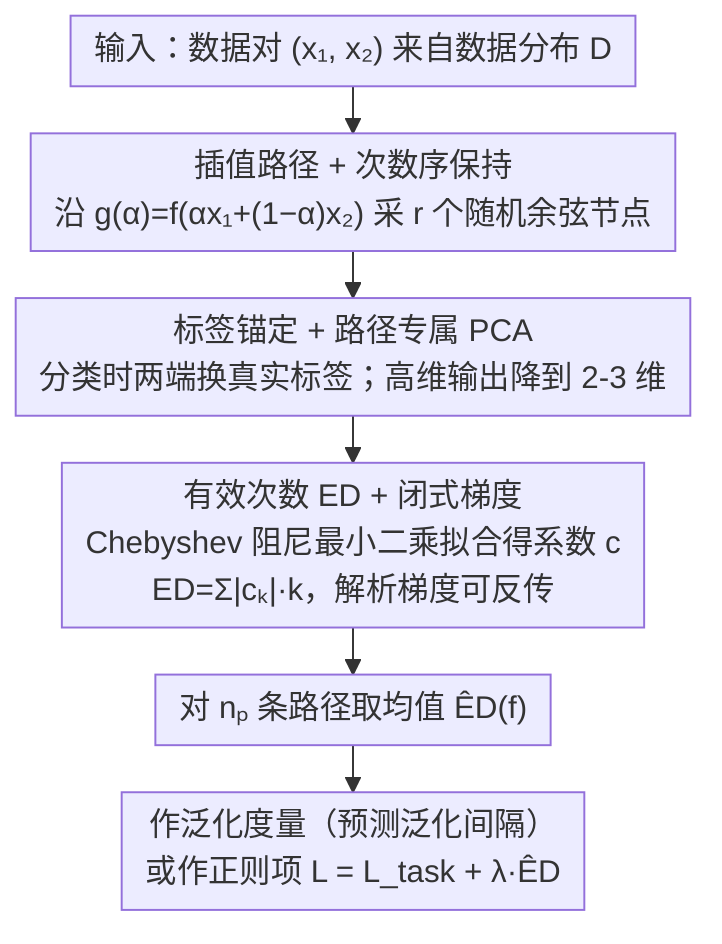

# Quantifying and Optimizing Simplicity via Polynomial Representations

**会议**: ICML2026  
**arXiv**: [2605.29823](https://arxiv.org/abs/2605.29823)  
**代码**: https://github.com/xinzaixinzai/Effective-Degree  
**领域**: 可解释性  
**关键词**: 简单性度量, 函数空间, Chebyshev 多项式, 泛化代理, 可微正则化  

## 一句话总结
作者提出用"沿数据插值路径拟合 Chebyshev 多项式"作为神经网络的低维函数空间代理，并定义"有效次数"（Effective Degree, ED）—— 对系数加绝对值再乘多项式阶数 —— 作为衡量"函数有多简单"的标量；它在 CIFAR-10/ImageNet/CLIP 上比 sharpness、参数 $L_2$ 范数等已知泛化代理更准地预测泛化间隔，并且整条估计 pipeline 可微，可直接当做训练时的"简单性正则项"，在图像、文本、CLIP 微调与 RL 四类任务上一致带来增益。

## 研究背景与动机

**领域现状**：深度网络过参数化但泛化良好，主流解释是"simplicity bias"——优化动力学倾向于选简单解。学界为此提出过若干"简单性 / 泛化代理"：max-margin、minimum-norm、信息论描述长度、PAC-Bayes、ReLU 网络的线性区域数、参数 $L_2$ 范数、sharpness、adaptive sharpness 等。

**现有痛点**：好的简单性度量需要同时满足三点 ——（i）跨任务/架构通用；（ii）大规模可计算；（iii）可微以便优化；但已有度量基本只能满足其中一两条：

- 最大边距 / 最小范数：理论清晰但只在线性/同质模型成立，对深度非线性模型外推困难。
- 描述长度 / PAC-Bayes：通用但难以稳定估计，也很难直接当训练目标。
- 线性区域数：与表达力对齐，但与架构强相关、规模大时不可估。
- 参数空间度量（范数、Jacobian、sharpness）：对重参数化敏感、跨架构稳定性差，sharpness 在 mixup 等 recipe 下经常与泛化反相关。

**核心矛盾**：简单性应当是"学到的函数本身的性质"，但绝大多数现有代理都活在参数空间或依赖架构假设；同时多数定义又不可微，没法当正则项直接优化。

**本文目标**：(1) 给出一个直接定义在函数空间的简单性度量；(2) 让它在大规模 trained model 上可估；(3) 让它端到端可微，能当正则项注入训练。

**切入角度**：如果直接在 $d$ 维输入空间里展开多项式，基函数数量 $\binom{d+K}{K}$ 组合爆炸。作者把网络"沿着两个数据点之间的插值路径"切成一维函数 $g_{\bm{x}_1,\bm{x}_2}(\alpha)=f(\alpha\bm{x}_1+(1-\alpha)\bm{x}_2)$ 再做多项式拟合，并证明随机路径几乎处处保留多元多项式的"次数序"，于是一维代理足以反映原网络的非线性程度。

**核心 idea**：把网络限制到一维插值路径 → 用 Chebyshev 多项式拟合 → 取"系数 $L_1$ 加权的次数"作为简单性标量 ED，再通过路径平均估计整张网的 ED；整条流程闭式可微，既能作 post-hoc 度量也能作训练时正则项。

## 方法详解

### 整体框架

给定预测网络 $f:\mathbb{R}^d\to\mathbb{R}^{m'}$ 与数据分布 $\mathcal{D}$，pipeline 走五步：

1. **采样插值路径**：从 $\mathcal{D}$ 抽一对 $\bm{x}_1,\bm{x}_2$，定义 $\bm{x}(\alpha)=\alpha\bm{x}_1+(1-\alpha)\bm{x}_2$，$\alpha\in[0,1]$。
2. **节点采样**：在 $\alpha$ 上取 $r$ 个"随机余弦节点"$\alpha_i=\tfrac{1}{2}(1-\cos\theta_i)$，其中 $\theta_i\sim U[(i-1)\pi/r,i\pi/r]$，相当于 Chebyshev 测度上的分层随机化。
3. **输出降维**：把 $\{f(\bm{x}(\alpha_i))\}$ 这条路径上的输出做路径专属 PCA（path-specific PCA），留前 $m$ 维（典型 $m=2,3$），把多输出多项式拟合简化为低维标量序列。
4. **Chebyshev 最小二乘拟合**：对每个 PCA 维度，拟合 $P(\alpha)=\sum_{k=0}^K c_k T_k(2\alpha-1)$，解阻尼正规方程 $(\bm{T}^\top\bm{T}+\epsilon\bm{I})\bm{c}_\epsilon=\bm{T}^\top\bm{y}$ 以保证数值稳定。
5. **ED 计算 & 平均**：$\mathrm{ED}(P)=\sum_k|c_k|\cdot k$，对多输出取均值；最终 $\widehat{\mathrm{ED}}(f)=\mathbb{E}_{\bm{x}_1,\bm{x}_2\sim\mathcal{D}}[\mathrm{ED}(P_{\bm{x}_1,\bm{x}_2})]$，训练时用 minibatch 内 $n_p$ 对路径的经验均值。

这条 pipeline 自上而下的流向，对应下面三个关键设计：

### 关键设计

**1. 插值路径 + 次数序保持定理：把高维多项式简单性降到一维拟合，绕开 $\binom{d+K}{K}$ 的组合爆炸**

直接在 $d$ 维输入空间展开多项式基函数，数量是 $\binom{d+K}{K}$，注定不可扩展。作者的切法是把网络限制到两个数据点之间的一维插值路径上 $g_{\bm{x}_1,\bm{x}_2}(\alpha)=f(\bm{x}(\alpha))$，再在这条一维函数上定义复杂度。这里唯一要担心的是"投影后次数下降丢信息"，作者用 Theorem 3.1 堵住这个口子：对任意两个非零多项式 $P_1,P_2$，只要它们次数 $D_1>D_2$，从数据密度上 i.i.d. 抽 $n$ 对路径得到的次数经验均值 $\widehat{d}_n(P_i)$ 在大 $n$ 下几乎必然仍满足 $\widehat{d}_n(P_1)>\widehat{d}_n(P_2)$。证明走"非零多项式的零集 Lebesgue 测度为零"这条经典引理——随机插值方向几乎撞不上让次数下降的零集，所以次数序在期望意义下被保留。插值路径给的正是"数据流形附近的一维切片"，既保住分布相关性，又把估计压成一维最小二乘，可解释、可计算、可扩展。

**2. 标签锚定 ED + 路径专属 PCA：拟合前先把路径输出整理好——让简单性正则不跟分类目标打架，并把高维输出压到便于拟合的低维**

拿到一维路径后、真正拟合多项式之前，分类任务有两个坑要先填。其一，cross-entropy 鼓励预测早早远离均匀分布，而我们想惩罚的是"沿路径多余的非线性"，ED 鼓励"沿路径预测变化平缓"，两者在训练早期会拉扯。Label-anchored ED 的处理是拟合时把两端节点的预测换成对应真实 one-hot 标签（固定 $\theta_1=0,\theta_r=\pi$，只采 $r-2$ 个中间节点），相当于让多项式必须经过真实端点再去描述中间过渡——高曲率的端点过渡被允许，被惩罚的只剩路径内部多余的非线性。其二，输出维度高时（如 1000 类 logits）直接拟合多输出代价大，于是叠加路径专属 PCA（path-specific PCA）：每条路径单独算 PCA 投影，把当前 $r$ 个输出降到 $m=2,3$ 维再拟合，梯度仍通过 PCA 分解回传到原始预测。锚定端点是因为"分类必须把端点分对"是真实任务约束、不能被简单性惩罚抹平；用路径专属（path-specific）而非全局 PCA 是因为它更贴合当前路径分布、统计噪声大时也稳——消融显示直接对全维输出拟合也能 work，PCA 不是收益主因，但能显著降开销。

**3. 有效次数 ED + 闭式梯度：把多项式系数压成一个标量，并保证它对网络参数全程可微**

整理好输出、拟合出 Chebyshev 系数后，最后一步是把系数压成一个能当训练目标的标量。算术次数 $\deg(P)$ 是离散的、对小扰动敏感，没法当训练目标；作者改用 $\mathrm{ED}(P)=\sum_k|c_k|\cdot k$——本质是以系数绝对值为权重的次数加权，等价于给系数加一个 $\ell_1$ 风格约束，正好对应 Rademacher 复杂度里"权重低维表示更紧"的容量控制；归一化版 $\mathrm{ED}_{\text{norm}}=\sum|c_k|k/\sum|c_k|$ 再去掉尺度。可微性由 Proposition 5.1 给出解析梯度 $\partial \mathrm{ED}/\partial\bm{y}=\bm{T}(\bm{T}^\top\bm{T})^{-1}(\mathrm{sign}(\bm{c})\odot\bm{d})$，其中 $\bm{d}=[0,\dots,K]^\top$、$\bm{T}_{i,k}=T_k(2\alpha_i-1)$。实践中为数值稳定不直接求逆，而是解阻尼系统 $\bm{c}_\epsilon=\texttt{LinearSolve}(\bm{T}^\top\bm{T}+\epsilon\bm{I},\bm{T}^\top\bm{y})$，autograd 直接走 PyTorch 的 LU 求解器。$\ell_1$ 加权一来让度量对小系数扰动具 Lipschitz 性、不被高阶噪声系数主导，二来让梯度对系数 magnitude 自然 scale-invariant（实测比二次加权更好），三来阻尼求解让"高阶多项式 + 小批次"的病态情形也能稳定反传。

### 损失函数 / 训练策略

总目标 $\mathcal{L}(\theta;\mathcal{B})=\mathcal{L}_{\text{task}}(\theta;\mathcal{B})+\lambda\,\widehat{\mathrm{ED}}_{\mathcal{B}}$，超参主要是路径数 $n_p$、节点数 $r$、多项式阶 $K$、damping $\epsilon$、正则强度 $\lambda$。作者在 CIFAR-10 上选定一组"鲁棒默认"（论文附录给出具体值），其他实验只调 $\lambda$。文本任务无法在 token 上做线性插值，于是把插值路径搬到 embedding 空间；多模态/CLIP 微调时直接在图像输入插值；RL 中只惩罚 actor 网络。

## 实验关键数据

### 主实验

| 任务 / 模型 | Baseline | SAM | ASAM | Jacobian | Mixup | **+ ED (本文)** |
|------|-------|-----|------|----------|-------|---------|
| CIFAR-10, ViT-Tiny (Top-1 %, 3 seeds) | 87.80 ± 1.17 | 87.85 ± 1.27 | 87.85 ± 1.24 | 87.81 ± 0.17 | 88.83 ± 1.48 | **90.82 ± 0.11** |
| ImageNet, ViT-S/16 (原 ViT recipe) | 71.37 ± 0.17 | — | — | — | — | **72.76 ± 0.16** |
| ImageNet, ViT-S/16 (强 recipe) | 74.42 ± 0.13 | — | — | — | — | **75.01 ± 0.11** |
| CLIP ViT-B/32 ImageNet ID | 76.20 ± 0.02 | — | — | — | — | **77.14 ± 0.05** |
| CLIP ViT-B/32 OOD 平均（5 个 shift） | 44.04 ± 0.08 | — | — | — | — | **45.31 ± 0.08** |
| CLIP ViT-B/16 ImageNet ID | 81.35 ± 0.11 | — | — | — | — | **82.19 ± 0.03** |
| CLIP ViT-B/16 OOD 平均（5 个 shift） | 53.69 ± 0.04 | — | — | — | — | **55.29 ± 0.14** |

跨模态/任务一致正向：ViT-Tiny 在 CIFAR-10 上 ED 比基线 +3.0 点、比 SAM/ASAM/Jacobian/Mixup 全部更好；CLIP 微调里 ID 和 5 个 OOD shift（ImageNetV2/R/A/Sketch/ObjectNet）都同时提升；BERT-base 在 RTE/MRPC/CoLA 上也都比 mixup baseline 高，且 mixup 自身偶尔倒退；Procgen 上 Dodgeball/Fruitbot/Jumper/StarPilot 四个环境 PPO 加 ED 全部提升泛化（unseen levels 表现 + 1 至 + 数点）。

### 消融实验

| 设计选项 | 作用 / 结论 |
|-------|------|
| 替换插值路径为随机噪声 | ED 与泛化相关性变弱、正则化效果下降，说明"数据流形附近"是关键 |
| Chebyshev 基 vs Legendre 基 | 两者效果相近，ED 对正交基的选择不敏感 |
| 随机余弦采样 vs 固定 Chebyshev vs 均匀 | 均匀采样在 $K$ 较大时显著不稳，随机余弦最稳，固定 Chebyshev 居中 |
| PCA 压缩到 2/3 维 vs 全维输出 | 不带 PCA 也能 work，PCA 主要降低开销而非收益主因 |
| ED w/o Label Anchoring (LA) | ViT-Tiny/CIFAR-10 上略低于带 LA 的 ED（90.00 vs 90.82），但仍优于所有其他正则化 |
| ED 与 sharpness/$L_2$ 的相关性 | ResNet18/CIFAR-10 与 CLIP ViT-B/32 fine-tune 下 ED 与泛化间隔 Pearson 相关都最强，sharpness 在 mixup recipe 下方向反转、$L_2$ 范数关系弱 |

### 关键发现

- **ED 是目前最稳的泛化代理**：跨 ResNet18 与 ViT-Tiny、跨 27 组超参 × 3 seed，ED 与泛化间隔的 Pearson 相关都显著强于 sharpness/adaptive-sharpness/$L_2$ 范数；在 grokking 实验里只有 ED 能在验证损失"突降时点"附近出现明显峰值再下降，sharpness/$L_2$ 都只能给出单调或飘忽的信号。
- **正则化收益与"度量准确性"同源**：ED 既预测得准又优化得动，反过来印证了"函数空间简单性 → 泛化"这条线索；而 sharpness 既预测得不准也无法保证训练时单调降低 sharpness 一定改进泛化。
- **正则项跨模态通用**：图像（CIFAR-10/ImageNet）、文本（GLUE）、视觉-语言（CLIP）、强化学习（Procgen）全部正向，且对 OOD shift 也稳定提升，说明"惩罚高阶非线性"是相对模型无关的归纳偏置。
- **失败模式**：附录指出 ED 在"简单特征容易被利用但不利于鲁棒泛化"的场景（如某些 shortcut learning 情形）可能失效——ED 会进一步强化 shortcut。

## 亮点与洞察

- **"函数空间度量 + 闭式可微"是真正的关键组合**：以往函数空间度量要么不可计算（PAC-Bayes、描述长度）、要么不可优化（线性区域数）；本文用一维插值路径 + Chebyshev 基把估计变成"小矩阵线性求解"，再借助 Proposition 5.1 拿到解析梯度，闭环打通了 measurement → regularization。
- **数据相关性的"路径锚定"是被忽视的设计自由度**：传统 sharpness 是"参数空间内随机扰动"，与数据无关；ED 用"两点插值路径"把度量天然绑定到数据分布，所以在不同 recipe（mixup/非 mixup）下都能保持方向一致——这点对 CLIP fine-tuning 这种"recipe 大幅扭曲指标分布"的设定尤其重要。
- **Label-anchored ED 是个聪明的工程妥协**：它显式承认"分类任务必须在端点远离均匀分布"这一硬约束，把简单性惩罚限制在"路径内部的额外曲率"，这种"区分必要非线性 vs 多余非线性"的设计可以迁移到其他任务（如 contrastive learning 里把锚点设为对照对）。

## 局限与展望

- **作者明示的局限**：理论上仍然没回答"路径式多项式代理能保留哪类函数空间简单性"，目前只有 Theorem 3.1 给到"算术次数序保持"；正则项失败模式发生在 shortcut feature 情形。
- **自行发现的局限**：(i) 计算开销不可忽略——每个 minibatch 需要 $n_p$ 条路径 × $r$ 个节点的前向计算 + 小矩阵求解；尽管附录称"可接受"，但 ImageNet 训练时间增加程度尚未公开；(ii) 路径必须能在某种连续空间做线性插值，文本/图结构/离散动作空间需要先嵌入到连续空间才能用，这点在 GLUE 上靠 BERT embedding 解决，但对结构化输入（如分子图）非平凡；(iii) 阶数 $K$、节点数 $r$、PCA 维度 $m$ 之间的耦合还没有理论指导，依赖 CIFAR-10 上一次性扫超参得到的"鲁棒默认"。
- **改进思路**：(1) 自适应路径长度——把插值范围从 $[0,1]$ 推广到 $[-\delta,1+\delta]$ 暴露更多"边界外"非线性；(2) 把度量推广到 mixup 数据增强（既然 mixup 也用了线性插值，二者可以耦合）；(3) 与 sharpness-aware 训练正交组合，看看是否能进一步压低泛化间隔。

## 相关工作与启发

- **vs SAM / ASAM (Foret 2021; Kwon 2021)**：SAM 在参数空间做最坏扰动并惩罚，对重参数化敏感；ED 在函数空间做度量并惩罚，跨 recipe 与跨架构都更稳健；实验里 SAM 在 mixup 下与泛化反相关，ED 与泛化稳定正相关。
- **vs Jacobian regularization (Hoffman 2019)**：Jacobian reg 只控制局部一阶敏感度（线性近似的斜率），ED 直接刻画了沿路径的高阶非线性整体，能捕到 Jacobian 看不到的曲率信息。
- **vs Mixup (Zhang 2018)**：Mixup 强制"插值输入 → 插值标签"，对语言数据过于刚性；ED 只在插值路径上估计复杂度而不强加合成标签，所以在 BERT/GLUE 上 mixup 经常退步而 ED 稳定提升。
- **vs spline / 区域数 (Montúfar 2014; Raghu 2017)**：区域数与表达力对齐但不可扩展、不可微；ED 与之同属"函数空间几何"思路但绕开离散计数。
- **vs PAC-Bayes / 压缩 (Dziugaite-Roy 2017; Arora 2018)**：那些方法重点是给出严格上界，但量级常常空洞，且不能直接当训练目标；ED 不给 bound 但实证强、可优化。

## 评分
- 新颖性: ⭐⭐⭐⭐ "路径式多项式代理 + 闭式梯度 ED"作为简单性度量是个干净又实用的新框架，理论与工程双向打通。
- 实验充分度: ⭐⭐⭐⭐⭐ 跨图像/文本/CLIP/RL 四类任务，覆盖度量评估、grokking 跟踪、ID & 5 个 OOD shift、消融 + 失败模式分析，体量与覆盖度都罕见。
- 写作质量: ⭐⭐⭐⭐ 推导链清楚（次数保持定理 + ED 可微性 + 阻尼实现 + 标签锚定），公式与图表对齐良好；少数实现细节（路径数、节点数等"鲁棒默认"具体值）藏在附录。
- 价值: ⭐⭐⭐⭐⭐ 既是 sharpness 之外少见、能稳定击败它的泛化代理，又是一个"近乎免维护"的通用正则项，落地价值高，对理解 simplicity bias 也提供了新的函数空间工具。

<!-- RELATED:START -->

## 相关论文

- [\[ICML 2026\] Can Large Language Models Generalize Procedures Across Representations?](can_large_language_models_generalize_procedures_across_representations.md)
- [\[NeurIPS 2025\] Quantifying Generalisation in Imitation Learning](../../NeurIPS2025/reinforcement_learning/quantifying_generalisation_in_imitation_learning.md)
- [\[ICML 2026\] Laplacian Representations for Decision-Time Planning](laplacian_representations_for_decision-time_planning.md)
- [\[ICLR 2026\] Dual Goal Representations](../../ICLR2026/reinforcement_learning/dual_goal_representations.md)
- [\[ICML 2026\] DR.Q: Debiased Model-based Representations for Sample-efficient Continuous Control](debiased_model-based_representations_for_sample-efficient_continuous_control.md)

<!-- RELATED:END -->
