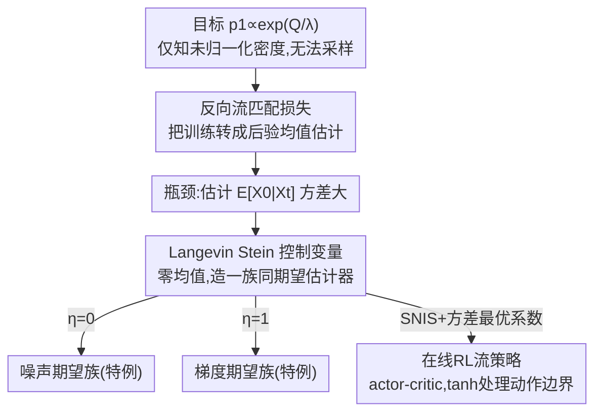

# Reverse Flow Matching: A Unified Framework for Online Reinforcement Learning with Diffusion and Flow Policies

**会议**: ICML 2026  
**arXiv**: [2601.08136](https://arxiv.org/abs/2601.08136)  
**代码**: 见论文（附录 E 提供伪代码）  
**领域**: 强化学习 / 扩散模型 / 流匹配  
**关键词**: 反向流匹配, Boltzmann分布, 后验均值估计, Langevin Stein算子, 控制变量

## 一句话总结
针对「在线 RL 里没有目标策略的直接样本」这个核心难题，本文提出反向流匹配（RFM）：把训练扩散/流策略去拟合 Boltzmann 分布，转化成一个「给定中间噪声样本、估计后验均值」的问题，再用 Langevin Stein 算子构造零均值控制变量把现有的「噪声期望」与「梯度期望」两类方法统一成同一族估计器，从而第一次让流策略（而不止扩散策略）也能采样 Boltzmann 分布，并在连续控制基准上比扩散策略基线更稳更好。

## 研究背景与动机

**领域现状**：扩散和流模型表达力强、能刻画多模态行为，已经在模仿学习和**离线** RL 里大放异彩——因为那里有现成的专家示范或预采集数据集，可以直接拿来训练。

**现有痛点**：搬到**在线** RL 就卡住了。最大熵 RL 框架下，改进后的策略是一个 Boltzmann 分布 $\pi_{\text{new}}(a\mid s)\propto\exp(\frac{1}{\lambda}Q(s,a))$——它**未归一化、一般无法直接采样**。而流匹配训练恰恰要求「能从目标分布里采样」。这就和标准生成建模形成尖锐反差：那里训练数据唾手可得，这里连一个目标样本都拿不到。

**核心矛盾**：现有想绕过这道墙的方法分成两个看似毫不相干的家族——**噪声期望族**（用 Q 值的指数当权重，对噪声做自归一化重要性采样 SNIS）和**梯度期望族**（对 Q 函数的梯度做 SNIS）。但没人说清这俩目标在数学上到底什么关系、能不能合成更一般的形式；而且它们的推导往往死死绑定某个噪声调度（VP/VE），把底层原理给糊住了；更糟的是，**这两族都只能训扩散策略，流策略怎么采样 Boltzmann 分布一直是个开放问题**。

**本文目标**：(1) 给出一个不需要目标样本、又数学严格的训练目标；(2) 把噪声期望族和梯度期望族统一进同一个框架并看清它们的关系；(3) 把「采样 Boltzmann 分布」的能力从扩散扩展到流；(4) 在在线 RL 上实例化并验证。

**切入角度**：换一个「反向推断」的视角。标准流匹配是正向构造——先采 $X_0\sim p_0$、$X_1\sim p_1$，再合成中间态 $X_t=\alpha_t X_1+\beta_t X_0$。但当 $p_1$ 只知道未归一化密度、不能采样时，正向管线断了。作者反过来把 $X_t$ 当成「观测到的证据」，把 $X_0$（或 $X_1$）当成解释它来源的「隐变量」——既然插值是刚性约束，给定 $x_t$ 和一个候选噪声 $x_0$ 就唯一确定了目标端点。于是训练目标变成「给定 $X_t$ 估计后验均值」。

**核心 idea**：用「反向后验均值估计」替代「正向采样」来训练流/扩散模型；再用 Langevin Stein 算子造零均值控制变量，把现有两族方法统一成一个可调方差的估计器家族。

## 方法详解

### 整体框架
RFM 要解决的是「目标分布 $p_1$ 已知（仅到归一化常数）但无法采样」。整体思路分三层：**第一层**把流匹配从正向构造翻转成反向推断，得到一个只依赖后验均值的可训练损失 $\mathcal{L}_{\text{RFM}}$；**第二层**发现训练的真正瓶颈是估计后验均值 $\mathbb{E}[X_0\mid X_t]$ 的方差，于是引入 Langevin Stein 算子构造零均值控制变量，得到一族「期望相同、方差可调」的估计器，并证明噪声期望/梯度期望族是其中 $\eta=0$ 和 $\eta=1$ 两个特例；**第三层**把它实例化到在线 RL，用 actor-critic 框架训练一个流策略去拟合 Boltzmann 分布。

### 关键设计

**1. 反向流匹配损失：把「采样目标分布」翻成「估计后验均值」**

正向流匹配要求能采 $(X_0,X_1)$，但 $p_1$ 不可采样时这条路断了。作者改用 Bayes 把噪声 $X_0$ 的后验写出来：$q^*_{0\mid t}(x_0\mid x_t)\propto p_0(x_0)\,p_1\!\big(\frac{1}{\alpha_t}x_t-\frac{\beta_t}{\alpha_t}x_0\big)$——一个候选噪声 $x_0$ 是否合理，取决于它在先验 $p_0$ 下是否可能、且它蕴含的目标端点 $x_1(x_0,x_t)=\frac{1}{\alpha_t}x_t-\frac{\beta_t}{\alpha_t}x_0$ 是否在 $p_1$ 下可能。对称地也有数据后验 $q^*_{1\mid t}$。于是把流匹配损失里「不可得的正向样本」换成「从后验采的样本」，并把期望推进平方范数内，得到噪声后验形式：

$$\mathcal{L}_{\text{RFM-N}}(\theta) = \mathbb{E}_{t,X_t\sim\hat{p}_t}\Big[\big\|v^\theta_t(X_t) - \big(\tfrac{\dot\alpha_t}{\alpha_t}X_t + \tfrac{\alpha_t\dot\beta_t-\dot\alpha_t\beta_t}{\alpha_t}\mathbb{E}_{X_0\sim q^*_{0\mid t}}[X_0]\big)\big\|_2^2\Big]$$

这里 $\hat{p}_t$ 是任选的提案分布（不是真边缘 $p_t$，因为它也拿不到）。论文证明（Prop. 4.1 / Thm. 4.2）RFM-N、RFM-D 与条件流匹配在足够丰富的函数类下**共享同一组全局最优解**，只是优化动态因提案 $\hat p_t$ 而异。这一步的妙处是把「无法采样目标」彻底转成「给定 $X_t$ 估计后验均值 $\mathbb{E}[X_0\mid X_t]$」——一个纯估计问题。框架还能适配各种参数化（速度/数据/噪声/score 预测）并涵盖 VE 等标准扩散调度。

**2. Langevin Stein 控制变量：造零均值修正项，把方差压下去**

后验均值 $\mathbb{E}_{X_0\sim q^*_{0\mid t}}[X_0]$ 只能用自归一化重要性采样（SNIS）估，但固定采样预算 $K$ 下 SNIS 方差大、训练不稳。作者引入 Langevin Stein 算子 $(\mathcal{T}_p\phi)(x)=\nabla\cdot\phi(x)+\phi(x)\cdot\nabla\log p(x)$——它的关键性质是**在 $p$ 下期望为零**（Lemma 4.5），因此可以当成「不改变期望、只改变方差」的控制变量。为了适配向量值的后验均值，作者把它推广成矩阵值测试函数 $\Phi$ 的版本（Def. 4.6 / Prop. 4.7）。取常对角测试函数 $\Phi_t=\text{diag}(\Lambda)$ 时控制变量简化为 $g_{\Phi_t}(x_0,x_t)=\text{diag}(\Lambda)\,s^*_{0\mid t}(x_0,x_t)$（$s^*$ 是后验 score），于是

$$\mathbb{E}_{q^*_{0\mid t}}[X_0] = \mathbb{E}_{q^*_{0\mid t}}\big[X_0 + \text{diag}(\Lambda)\,s^*_{0\mid t}(X_0,x_t)\big]$$

带控制变量的 SNIS 估计器记作 $\hat\mu_{\text{SNIS-CV}}[X_0\mid t,x_t;\Lambda]$。更进一步，作者给出了**渐近方差最优**的系数闭式解（Prop. 4.9 逐分量 $\Lambda^*_j$，Prop. 4.10 各向同性 $\eta^*$），让方差缩减不靠调参而有解析最优。直觉上：单纯按重要性权重平均噪声方差大，而加上「正比于 score 的零均值修正」能把估计拉向真值、显著降方差，从而给训练提供更稳的监督信号。

**3. 统一两族方法 + 流策略 RL 实例化：一个 η 串起 noise/gradient，tanh 处理动作边界**

把控制变量套到 Boltzmann 目标 $p_1\propto\exp(\frac{1}{\lambda}Q)$ 上（Thm. 4.14），后验均值估计器变成一个由 $\Lambda,\eta$ 调控的家族。在各向同性 $\eta$ 下它恰好是两项的线性组合：$\mu_{0\mid t}=(1-\eta)\,\mathbb{E}[X_0] + \eta\,\mathbb{E}\big[-\frac{1}{\lambda}\frac{\beta_t}{\alpha_t}\nabla_{x_1}Q\big]$。于是**噪声期望族 = $\eta=0$、梯度期望族 = $\eta=1$**——两个看似无关的家族被证明是同一公式的两端，中间的 $\eta$ 还能把 Q 值信息和 Q 梯度信息**有原则地混合**成一个方差更低的估计器，这正是训练效率与稳定性提升的来源。

实例化到在线 RL 时走 actor-critic + 双 Q 网络。一个工程关键点是**动作边界**：连续控制里动作通常被限制在 $[-1,1]^d$，以往方法靠截断高斯等启发式处理，但截断会破坏概率路径。本文在无约束隐空间 $u\in\mathbb{R}^d$ 学流、再用 $a=\tanh(u)$ 映射到动作，并**显式带上 Jacobian 因子** $\prod_j\text{sech}^2(u_{1,j})$，从而在动作空间里严格保持正确的 Boltzmann 分布。流策略把隐空间速度场参数化为 $v^\theta_t(u_t,s)$，actor 损失就是回归到 RFM 速度目标 $\hat v_t=\dot\alpha_t\bar u_1+\dot\beta_t\bar u_0$ 的平方误差。

### 损失函数 / 训练策略
Critic 用标准双 Q TD 目标 $\hat Q=r+\gamma\min\{Q_{\bar\omega_1},Q_{\bar\omega_2}\}$；actor 损失 $\mathcal{L}_\pi(\theta)=\mathbb{E}_{t,u_t,s}[\|v^\theta_t(u_t,s)-\hat v_t(u_t,s)\|_2^2]$，其中后验均值由带控制变量的 SNIS 估出、$\bar u_1=(u_t-\beta_t\bar u_0)/\alpha_t$。采样时用策略诱导的提案采 $u_t$，并生成 $M$ 个动作候选取 Q 值最高者。

## 实验关键数据

### 主实验

| 任务 | 方法 | 推理步数 | 结论 |
|------|------|----------|------|
| 2D two-moon 采样 | RFM | 20 步 | SWD / MMD² / Sinkhorn 三项距离全场最低 |
| 2D two-moon 采样 | iDEM（梯度期望） | 100 步 | 三项距离均劣于 RFM |
| 2D two-moon 采样 | QNE（噪声期望） | 100 步 | 三项距离均劣于 RFM |
| DMC 连续控制（8 环境） | RFM（流策略） | 10 流步 | 唯一在全部 8 个环境都稳定好的方法 |
| DMC 连续控制 | SAC/QSM/MaxEntDP/DQS/QVPO | 20 扩散步 | 各自在某些任务上严重退化 |

玩具实验里三种方法用**相同的后验估计预算（同等训练计算）**，RFM 只用 1/5 的推理步数就拿到最低分布差异，说明反向视角 + 控制变量在「同算力」下质量更高。

### 消融实验
论文主文以训练曲线（Fig. 2，5 个种子的 min–max 范围）呈现稳定性对比，更细的消融、敏感性分析和扩展基线放在附录 G。

| 配置 | 关键观察 | 说明 |
|------|---------|------|
| RFM（完整） | 8/8 环境稳定收敛 | 跨任务一致性是其最大卖点 |
| 各扩散基线（SAC/QSM/MaxEntDP/DQS/QVPO） | 至少在部分任务崩 | 缺乏跨环境稳定性 |
| 流策略 vs 扩散策略 | 10 步 < 20 步 | 流模型推理步数更少且回报更高 |
| η=0 / η=1 | 退化为已有两族 | 中间 η 混合 Q 值+Q 梯度方差更低 |

### 关键发现
- **跨任务稳定性是核心优势**：在 DMC 八个环境上，RFM 是唯一处处表现好的方法，而每个基线都会在某些任务上严重翻车；五个种子的方差也明显更小。
- **更少推理步、更高回报**：流策略只用 10 步就超过用 20 步的扩散策略基线，说明把流模型的优势（更短积分路径）真正释放了出来。
- **同算力下质量更高**：玩具实验在相同后验估计预算下，RFM 用 1/5 步数拿到最低分布差异，控制变量带来的方差缩减直接转化成样本质量。
- **统一视角带来可调旋钮**：$\eta$ 把噪声/梯度两族连成一条线，混合两者信息能得到方差更小的监督信号。

## 亮点与洞察
- **「反向推断」这个视角换得漂亮**：把「无法从目标分布采样」这个看似无解的障碍，一步翻成「给定中间样本估后验均值」的标准估计问题，思路简洁且打开了后续一整套方差缩减工具的大门。
- **用 Stein 算子做零均值控制变量很巧**：它的精髓是「在目标密度下期望恒为零」，所以加进去不动期望、只压方差，还能解析求出最优系数——把方差缩减从「调参玄学」变成「有闭式最优解」。
- **统一两族方法的理论价值高**：噪声期望和梯度期望被证明是同一公式 $\eta=0,1$ 的两端，这不仅澄清了文献里的混乱，还顺手给出了「混合两者」这个之前没人做的更优选项。
- **首次让流策略也能采 Boltzmann 分布**：流模型允许非高斯源分布，比扩散更灵活、还能通过定制源分布注入领域知识，这把适用面从扩散扩到了流，是实打实的能力扩展。
- **tanh + Jacobian 处理动作边界**：用变量替换 + 显式 Jacobian 因子严格保持动作空间的 Boltzmann 分布，比截断高斯那种破坏概率路径的启发式更干净，是个可复用的工程 trick。

## 局限与展望
- **仍依赖 SNIS 和提案分布**：后验均值终究靠重要性采样估，提案分布选得不好时方差缩减效果会打折；控制变量的最优系数也要在线估计，带来额外计算。
- **理论假设较强**：零方差条件（Prop. 4.8）的泛函方程一般不可解，实践只能在参数族里近似最小化方差；多条结论依赖可微性、积分性、边界消失等正则条件。
- **实验规模偏学术**：主验证在 DMC 连续控制和 2D 玩具任务上，尚未在高维像素输入或真实机器人等更复杂场景检验，扩展性有待观察。
- **超参敏感性披露有限**：$\lambda$、流步数、候选数 $M$、控制变量参数化等的敏感性主要放在附录，主文对工程鲁棒性的讨论较少。

## 相关工作与启发
- **vs 噪声期望族（QNE / MaxEntDP）**：它们对噪声做 Q 加权 SNIS，本文证明这只是 $\eta=0$ 的特例；本文用控制变量进一步降方差，且不绑定特定噪声调度。
- **vs 梯度期望族（iDEM / DQS）**：它们对 Q 梯度做 SNIS，对应 $\eta=1$；本文统一二者并允许中间 $\eta$ 混合 Q 值与 Q 梯度信息得到更优估计器。
- **vs 可微采样 / Langevin 类方法（如 QSM）**：QSM 靠训练 score 模型匹配 Q 梯度再用 Langevin 采样；本文走流匹配回归路线，推理步数更少、跨环境更稳。
- **vs 迭代加权回归（QVPO）**：QVPO 用 Q 加权回归做策略改进；本文从 Boltzmann 目标出发给出有原则的后验均值估计，理论上与评测目标对齐得更紧。

## 评分
- 新颖性: ⭐⭐⭐⭐⭐ 反向推断视角 + Stein 控制变量统一两族方法，并首次把 Boltzmann 采样能力扩到流策略，理论贡献扎实。
- 实验充分度: ⭐⭐⭐⭐ DMC 八环境 + 玩具任务验证了稳定性与效率，但规模偏学术、缺高维/真实场景。
- 写作质量: ⭐⭐⭐⭐ 理论推导层层递进、动机清晰，公式密度高对读者门槛不低。
- 价值: ⭐⭐⭐⭐ 给「在线 RL 中训练扩散/流策略」提供了统一框架和方差缩减工具，对生成式策略学习有方法论意义。

<!-- RELATED:START -->

## 相关论文

- [\[ICLR 2026\] Bridging Successor Measure and Online Policy Learning with Flow Matching-Based Representations](../../ICLR2026/reinforcement_learning/bridging_successor_measure_and_online_policy_learning_with_flow_matching-based_r.md)
- [\[ICML 2026\] How Does Reasoning Flow? Tracing Attention-Induced Information Flow for Targeted RL in LLMs](how_does_reasoning_flow_tracing_attention-induced_information_flow_for_targeted_.md)
- [\[ICML 2026\] Learning Unmasking Policies for Diffusion Language Models](learning_unmasking_policies_for_diffusion_language_models.md)
- [\[ICML 2026\] Perceptual Flow Network for Visually Grounded Reasoning](perceptual_flow_network_for_visually_grounded_reasoning.md)
- [\[ICML 2026\] Fast and Highly Expressive Policy Learning for Offline Reinforcement Learning via Bootstrapped Flow Q-Learning](fast_and_highly_expressive_policy_learning_for_offline_reinforcement_learning_vi.md)

<!-- RELATED:END -->
