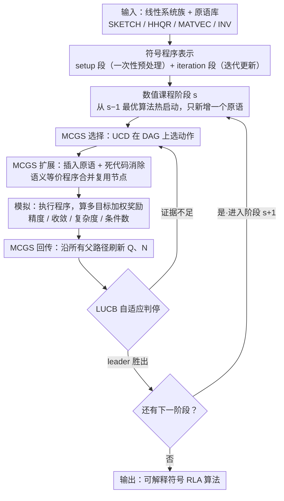

# RL4RLA: Teaching ML to Discover Randomized Linear Algebra Algorithms Through Curriculum Design and Graph-Based Search

**会议**: ICML 2026  
**arXiv**: [2605.18004](https://arxiv.org/abs/2605.18004)  
**代码**: https://github.com/Tim-Xiong/RL4RLA  
**领域**: 强化学习 / 算法发现 / 随机数值线性代数  
**关键词**: 课程学习, 蒙特卡洛图搜索, 符号程序合成, 草图算法, 预条件子  

## 一句话总结
RL4RLA 用"难度递增的数值课程 + 蒙特卡洛图搜索 (MCGS)"驱动一个 RL agent 从线性代数原语里组合出可解释的随机数值线性代数 (RLA) 算法，成功重现了 Sketch-and-Precondition、Randomized Kaczmarz、Newton Sketch 等经典方法。

## 研究背景与动机
**领域现状**：AlphaTensor、AlphaDev、FunSearch、AlphaEvolve 已经把"用搜索发现算法"这件事推到了矩阵乘、排序、数学定理等多个领域；然而随机数值线性代数（RLA，例如 sketching、leverage-score sampling、stochastic Krylov）这类支撑大规模科学计算的算法，长期还是靠数值分析专家手工设计，几乎没有通用的自动发现框架。

**现有痛点**：LLM 驱动的方法（FunSearch / AlphaEvolve / AlgoTune）严重依赖预训练分布，更擅长做"现有实现的局部优化"（换库、加 JIT），而不是从零拼装新结构；同时 RLA 算法天然多步、奖励稀疏：Blendenpik 这种解法要顺序组合 5–7 个原语（sketch → QR → 构造预条件子 → 迭代修正），用裸 RL 在指数级程序空间里抓信号几乎不可能。

**核心矛盾**：高性能 RLA 算法的"组合深度"和 RL 搜索的"奖励稀疏度"正相关——越值得发现的算法，越没有中间奖励帮助搜索收敛。

**本文目标**：(i) 让搜索结果是可解释的符号程序而不是黑盒；(ii) 把多步组合算法的发现拆解成局部信号充分的若干步；(iii) 在 sketch、precondition、importance sampling 这些 RLA 原语上做可复用的搜索引擎。

**切入角度**：作者抓住了 RLA 的"组合规律"——绝大多数高性能 RLA 算法都能写成 setup（sketch、factorize）+ iteration（preconditioned update）的两段结构，并且经典算法之间存在一条天然的"难度阶梯"：Landweber → GD → Preconditioned GD → Sketched Preconditioned GD → Subsampling → Leverage-Score Sampling，每一步都只新增一个原语来解决前一步暴露的一种数值失效模式。

**核心 idea**：把"算法发现"建模成 MCGS 在符号程序 DAG 上的顺序决策，再用一条按"数值失效模式"递进的课程一步步教 agent 增加新原语，使原本指数级的搜索压缩成若干个浅层局部问题。

## 方法详解

### 整体框架
RL4RLA 把每个候选算法表示为一个显式符号程序 $\mathcal{A}=(\mathcal{P}_{\text{setup}},\mathcal{P}_{\text{iteration}})$：setup 段做一次性预处理（sketching、factorization），iteration 段定义迭代更新。程序通过逐步插入"`target ← operator(operand_1, operand_2)`"型原语指令构造，原语库包含 SKETCH、HHQR、MATVEC、INV 等，类型系统保证每次插入都产生可执行程序，插完后自动跑死代码消除。课程把整体搜索切成 $S$ 个阶段 $(\mathcal{C}_s)_{s=1}^{S}$，每个阶段 $\mathcal{C}_s=(A_s,b_s,\mathbf{w}_s)$ 指定一族线性系统和一组奖励权重；阶段 $s$ 的搜索从阶段 $s-1$ 找到的最佳算法热启动，只学一个新原语。每个候选算法在当前阶段做 MCGS 选择→扩展→模拟→回传：模拟时真的把符号程序执行在采样到的随机问题实例上，根据 residual / 单调收敛性 / 复杂度 / 条件数加权得到奖励，再用 LUCB 自适应判停决定阶段是否完成。

### 关键设计

**1. 数值课程：把一次性发现深层组合算法的稀疏奖励问题，拆成每步只学一个原语的浅层搜索**

像 Blendenpik 这种 5–7 步组合算法，奖励只在最后才结算，裸 RL 在指数级程序空间里几乎抓不到信号。RL4RLA 的对策是手工铺一条问题实例难度阶梯，每升一级只引入**一种**数值失效模式，迫使 agent 在前一阶段最优算法上恰好补一个原语：从 $5\times 5$ 良态系统（Landweber 就能收敛）起步，扩成 $m\times n$ 长方矩阵（必须走正规方程），再提到 $10000\times 50$ 且病态（迫使加预条件子 $M=R$ 让 $\kappa(AR^{-1})\approx 1$），接着加大复杂度惩罚（迫使把 QR 换成 sketched QR $SA=QR^{-1}$，恰好恢复 Blendenpik），同设置下进一步要求 subsampling，最后把 $A=U\Lambda V^\top$ 里的 $U$ 换成重尾分布、把均匀采样逼成 $\ell_2$ 行范数的 leverage-score 采样。配套地，每个阶段的奖励权重 $\mathbf{w}_s=(w_{\text{acc}},w_{\text{decay}},w_{\text{comp}},w_{\text{cond}})$ 都重点放大上一阶段算法的主要失效信号。这本质上是把"数值分析家设计 Blendenpik"的归纳偏置注入 RL 环境——全局稀疏的程序空间被切成若干个局部信号充足的浅层问题，但课程不固化算法形态，agent 仍可能拼出新组合。

**2. 蒙特卡洛图搜索（MCGS）+ UCD：合并语义等价的中间程序，把 $O(b^d)$ 的状态爆炸压成 $O(|\mathcal{S}|)$**

RLA 程序里同一个算法常常能由不同动作顺序构造出来，标准 MCTS 会把这些代数等价的路径反复展开，白白烧掉昂贵的程序执行预算。MCGS 把搜索结构从 tree 升级成 DAG $\mathcal{G}=(\mathcal{S},\mathcal{E})$：扩展节点时若做完死代码消除后的归一化程序已存在，就只连一条父边复用旧节点、不创建副本；回传时一次 rollout 得到的 $R$ 会沿所有通往该状态的路径同步刷新 $N(s,a)\leftarrow N(s,a)+1$ 与 $\hat{Q}(s,a)\leftarrow \hat{Q}(s,a)+(R-\hat{Q}(s,a))/N(s,a)$。动作选择用为 DAG 校准过的 UCD：$a'=\arg\max_a[\hat{Q}(s,a)+c\sqrt{\log N(s)/N(s')}]$，关键是用子节点访问数 $N(s')$ 而非边访问数做归一化，避免 UCT 在多父节点上"白送"探索奖励。这样一次评估的经验立刻被所有等价路径共享，预算只花在真正不同的程序上。

**3. LUCB 自适应停机 + 多目标加权奖励：去掉人定预算的偏置，并把多重数值质量目标拧成一个可调标量**

固定 playout 预算既带人为偏置、又让不同搜索方法没法在公平条件下比较；而 RLA 算法的"好"本身是多维的（精度、收敛、复杂度、条件数）。RL4RLA 在每个决策点用 Lower/Upper Confidence Bound 找当前 leader $a_{\text{leader}}=\arg\max_a \hat{Q}(a)$ 和 challenger $a_{\text{challenger}}=\arg\max_{a\neq a_{\text{leader}}}[\hat{Q}(a)+U(a)]$，当 $\hat{Q}(a_{\text{leader}})-U(a_{\text{leader}})>\hat{Q}(a_{\text{challenger}})+U(a_{\text{challenger}})$ 即判定证据充分、推进根节点。奖励则写成 $R(\mathcal{A})=\sum_{k\in\{\text{acc},\text{decay},\text{comp},\text{cond}\}} w_k R_k$：$R_{\text{acc}}$ 看相对残差 $\|Ax-b\|_2/\|b\|_2$，$R_{\text{decay}}$ 罚最坏单步收缩比 $\rho_{\max}=\max_t \|r_{t+1}\|_2/\|r_t\|_2$，$R_{\text{comp}}$ 鼓励计算便宜，$R_{\text{cond}}$ 奖励条件数小。自适应判停让公平比较成为可能，而多目标加权又恰好是课程的抓手——下一阶段想逼出哪种原语，就把对应权重拉高（如调高 $w_{\text{cond}}$ 就会逼出预条件子）。

### 损失函数 / 训练策略
没有神经网络要训练，"学习"完全发生在 MCGS 的 $(\hat{Q},N)$ 统计上。每次完整跑完课程相当于一次"训练 run"，论文每个目标算法跑 20 次 run 评估 success rate 和 playouts-to-success；课程在阶段 $s$ 用 $s-1$ 的最优算法热启动，原语库随阶段微调（典型从 17 到 25 个原语）。

## 实验关键数据

### 主实验
按 5 条课程评估：4 条线性系统（Preconditioned Weighted SGD、Block Randomized Kaczmarz、Subsampled Least Square GD、Sketched Preconditioned GD）+ 1 条 logistic 回归上的 Newton Sketch。每个 transition 跑 20 次，LUCB 早停。

| 目标算法 | 方法 | Playouts ↓ | 时间 (s) / 成功率 |
|--------|------|------|----------|
| Preconditioned Weighted SGD | MCTS | 34902 | 380.7 / 75% |
| | MCGS+UCT | 13037 | 193.2 / 80% |
| | **MCGS+UCD** | **10721** | **191.1 / 80%** |
| Block Randomized Kaczmarz | MCTS | 66468 | 468.0 / 75% |
| | **MCGS+UCD** | **25158** | **205.0 / 75%** |
| Subsampled Least Square GD | MCTS | 15847 | 10.4 / 75% |
| | **MCGS+UCD** | **5061** | 8.9 / 80% |
| Sketched Preconditioned GD | MCTS | 17655 | 142.9 / 75% |
| | **MCGS+UCD** | **6034** | 58.4 / 75% |
| Newton Sketch | MCTS | 2557 | 5949.6 / 100% |
| | **MCGS+UCD** | **1416** | **4480.9 / 100%** |

跨 5 条课程，MCGS 相对 MCTS 把 playouts 降 2–3 倍；目标越组合（深度越深、奖励越稀疏），UCD 相对 UCT 越显优势——在 Block Randomized Kaczmarz 上 UCD 比 UCT 又少 35% playouts。

### 消融实验

| 配置 | 关键现象 | 说明 |
|------|---------|------|
| 全课程 + MCGS+UCD | Newton Sketch 100% 成功 | 完整方案 |
| 跳过任何一个课程阶段 | Newton Sketch **0%** 成功 | 课程是"可达性"前提，不是单纯"加速" |
| MCGS 状态合并率 (program len=8/10/12) | revisit ratio 0.578 / 0.530 / 0.520 | 程序变长，合并收益缓慢衰减 |
| MCGS 原语库 17→25 | revisit ratio 0.578→0.533 | 库变大，合并仍有效 |
| 推广到 PSD 特征值问题 (n=5/50/500) | 三阶段课程 100% / 100% / 100% | 仅加一个 `VEC_NORMALIZE` 原语和 Rayleigh quotient 奖励 |

### 关键发现
- Newton Sketch 的 0%↔100% 反差最能说明问题：课程不是"提速工具"而是"可达性工具"——某些算法在没有阶段性引导时，RL 在合理预算内永远找不到。
- MCGS 的优势随组合深度单调增大；UCD 相对 UCT 的差距只在最稀疏奖励任务（Block Randomized Kaczmarz）上才明显，符合"UCT 给多父节点白送探索奖励"的理论分析。
- 框架域适配只需要替换一层薄接口（原语集 + 合法性约束 + 奖励），核心 MCGS / 课程逻辑可保持不变——这让 RLA 之外的数值算法发现成为现实可能。

## 亮点与洞察
- "把数值失效模式排成阶梯"是极优雅的归纳偏置工程：它把数值分析家的领域知识翻译成 RL 课程，既给了搜索方向，又留出"agent 自己拼新组合"的空间，比硬塞 LLM 先验更干净。
- MCGS + UCD 是 AlphaZero 这一系列"程序合成 + MCTS"工作里被低估的一笔：当搜索目标天然能用规范化去重（比如线性代数的代数等价、SQL 的查询规范化、神经架构的等价图），DAG 搜索能直接换来 2–3× 加速且改动很小。
- LUCB 早停 + 多目标加权奖励是个可复用模板：任何"算法质量"由多重数值指标加权而成的发现任务，都能套这一对组件来去掉手工 budget 调参。

## 局限与展望
- 实验是"重发现"经典算法而非"发现真正新的 RLA 算法"；作者也承认要发现新算法需要更大预算、更丰富原语库和系统化的后处理形式化分析。
- 课程依然是手工设计的——agent 没有自动发现"下一个失效模式"的能力；如何让课程也被学习出来是显然但未解的下一步。
- 评估全在合成线性系统/特征值问题上做，没有验证发现的算法在真实科学计算 workload 上是否仍然是 Pareto 最优。
- 原语库目前是数值线性代数级别的，要扩展到 Krylov 子空间、PDE 算子、稀疏直接法等更高层原语，需要重新设计类型系统和死代码消除规则。

## 相关工作与启发
- **vs FunSearch / AlphaEvolve**: 后者用 LLM 当变异算子，搜索强烈偏向训练分布；RL4RLA 不依赖任何预训练先验，在显式类型化的符号程序上搜索，结构更可控、可解释性更强。
- **vs AlgoTune**: AlgoTune 在已有实现上做 edit-compile-test 优化（库替换、JIT），本质是参数/实现级 tuning；RL4RLA 是算法结构级合成，能拼出新的 setup/iteration 组合。
- **vs AlphaTensor / AlphaDev**: 同样是 MCTS 风格的算法发现，但 AlphaTensor 操作的是张量分解空间、AlphaDev 是汇编指令空间；本文把舞台换到了"符号化线性代数程序"，并通过课程明确处理了奖励稀疏问题。
- **vs Learned Sketching / Learned Preconditioner**：那条线把单一组件神经化（学一个 sketching 矩阵或预条件子），输出仍是参数；RL4RLA 输出可读符号程序，能直接被数值分析家校验和形式化分析。

## 评分
- 新颖性: ⭐⭐⭐⭐⭐ 第一个把"课程 + 图搜索"系统化引入 RLA 算法发现，并真的重现了 Blendenpik / Randomized Kaczmarz / Newton Sketch 全套。
- 实验充分度: ⭐⭐⭐⭐ 5 条课程 + 跨问题类（特征值）+ MCTS/UCT/UCD 三方对比 + Newton Sketch 0%↔100% 的强消融。
- 写作质量: ⭐⭐⭐⭐⭐ 课程表（Table 1）和算法范式分类极清晰，"失效模式→新原语"叙事让方法部分一气呵成。
- 价值: ⭐⭐⭐⭐ 离"发现真正的新 RLA 算法"还差最后一公里，但搭出来的搜索框架对其他数值算法发现任务的迁移价值很高。

## 评分
- 新颖性: 待评
- 实验充分度: 待评
- 写作质量: 待评
- 价值: 待评

<!-- RELATED:START -->

## 相关论文

- [\[ICML 2026\] Provable Benefit of Curriculum in Transformer Tree-Reasoning Post-Training](provable_benefit_of_curriculum_in_transformer_tree-reasoning_post-training.md)
- [\[ICML 2026\] Adaptive Bandit Algorithms for Contextual Matching Markets](adaptive_bandit_algorithms_for_contextual_matching_markets.md)
- [\[ICML 2026\] The Surprising Difficulty of Search in Model-Based Reinforcement Learning](the_surprising_difficulty_of_search_in_model-based_reinforcement_learning.md)
- [\[ICML 2026\] Learning to Search and Searching to Learn for Generalization in Planning](learning_to_search_and_searching_to_learn_for_generalization_in_planning.md)
- [\[ICML 2026\] Learning to Approximate Uniform Facility Location via Graph Neural Networks](learning_to_approximate_uniform_facility_location_via_graph_neural_networks.md)

<!-- RELATED:END -->
