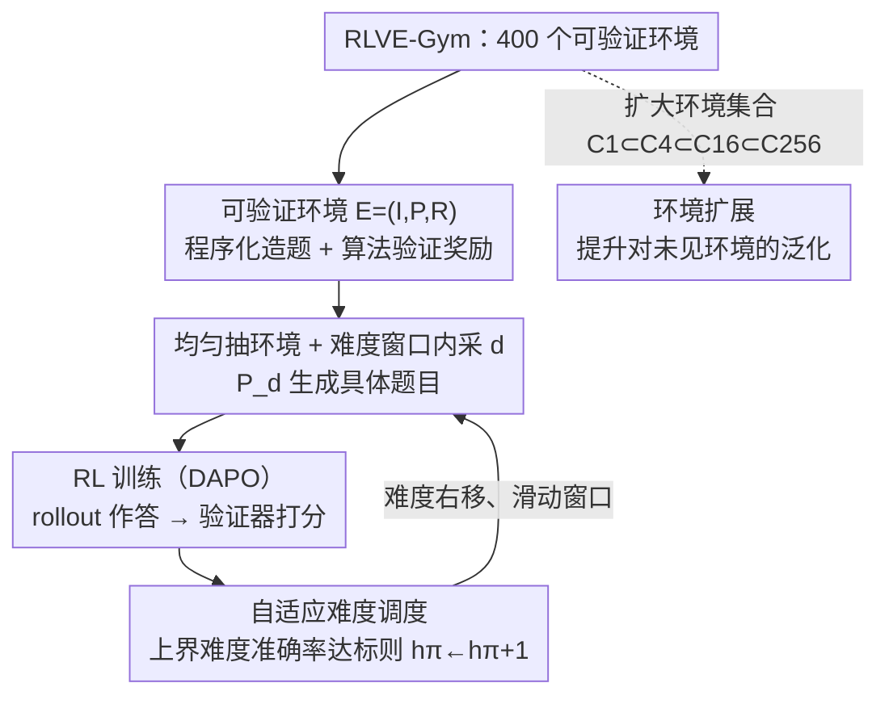

# RLVE: Scaling Up Reinforcement Learning for Language Models with Adaptive Verifiable Environments

**会议**: ICML2026  
**arXiv**: [2511.07317](https://arxiv.org/abs/2511.07317)  
**代码**: https://github.com/Zhiyuan-Zeng/RLVE  
**领域**: 强化学习  
**关键词**: RLVR、可验证环境、自适应难度、推理能力、环境扩展

## 一句话总结
RLVE 把语言模型 RL 训练的数据从"静态题库"换成 400 个**可程序化生成题目、可算法验证奖励**的"可验证环境"，并让每个环境的题目难度随策略模型能力实时上调，从而把训练信号始终钉在模型能力前沿；在已被 RLVR 训到饱和的 1.5B 强模型上，RLVE 用约 1/3 的算力把六个推理 benchmark 平均提升 $3.37\%$（对照组继续原 RL 训练只涨 $0.49\%$）。

## 研究背景与动机
**领域现状**：扩大 RL（尤其是 RLVR，RL with verifiable rewards）被证明能持续提升 LM，但模型在有限训练数据上很快**饱和**，再训不动。

**现有痛点**：扩 RL 数据有两大拦路虎。其一**贵**：可验证奖励通常要"题目 + ground-truth 答案"成对，海量收集成本极高（DeepMath-103K 造一遍约 13.8 万美元、12.7 万 GPU 小时）。其二**会停摆**：当题目对当前策略**太易**就没有学习信号、**太难**就一致拿低奖励、梯度更新被噎住。而典型 LM RL 训练里题目分布由某个固定数据集**预先定死、全程静态**，没法跟着策略能力进化——一道数组排序题在训练初期"恰好有挑战性"，模型变强后就变得太易；另一些一开始太难的题，模型变强后本可学却已不在合适难度区。

**核心矛盾**：静态数据分布与"策略能力在动态上升"之间根本不匹配——要么早早饱和（难度上限低），要么大部分题难度不合适导致学习低效（难度上限高但只有一小撮题处在合适区）。

**本文目标**：让训练数据（1）可无限程序化生成、绕开成对收集的成本，（2）奖励可算法验证，（3）难度能随策略能力自适应上移，始终供给"不太易也不太难"的题。

**切入角度**：作者把数据源从"题库"抽象成"**可验证环境**"——一个能按难度参数无限造题、并用程序验证输出的三元组；再给每个环境加一个随模型表现滑动的难度窗口。

**核心 idea**：用可验证环境替代静态题库，让每个环境的难度分布"追着模型能力跑"，并把环境集合本身作为新的 scaling 维度。

## 方法详解

### 整体框架
RLVE 的训练数据不再来自固定题库，而来自一组**可验证环境**。每生成一道训练题：先从 $n$ 个环境里均匀抽一个环境 $E^{(i)}$，在该环境当前难度窗口 $[\ell_\pi^{(i)},h_\pi^{(i)}]$ 内均匀采一个难度 $d$，由问题生成器 $\mathcal{P}_d$ 程序化造出具体题目，模型作答后由该环境的验证器 $R$ 算法化打分。每个环境独立维护自己的难度窗口和统计量 $(a^{(i)},b^{(i)})$（在上界难度上的正确/总 rollout 数），当模型在上界难度上的准确率达标就把上界 $h_\pi$ 上调一格、难度分布整体右移。整套机制可套在任何用"环境给奖励"的 RL 算法上（本文用 DAPO）。这 400 个环境（RLVE-Gym）由人工"环境工程"造出，遵循"当教具、靠环境优势验证、难度可配置"三原则。

### 关键设计

**1. 可验证环境：把数据源从"题库"抽象成"能无限造题 + 能算法验证"的三元组**

针对"成对收集太贵"的痛点，RLVE 把训练数据定义成一个三元组 $E=(I,\mathcal{P},R)$：$I$ 是输入模板、$\mathcal{P}$ 是问题生成器、$R$ 是验证器（奖励函数），$\mathcal{P}$ 和 $R$ 都是**程序**。每个环境还有一个整数难度 $d\in[0,+\infty)$ 控制题目的推理复杂度（如排序环境里 $d$ 越大数组越长）。一道具体题 $E_p=(I_p,R_p)$ 由 $p\sim\mathcal{P}_d$ 采参数实例化，验证器算出标量奖励 $R_p(o)\in\mathbb{R}$。它的关键优势有二：其一，问题生成器可**无限造题**，彻底绕开逐题收集 ground-truth 的非可扩展性；其二，验证**靠环境相对 LM 的优势**——环境能执行程序而 LM 不许执行（如用原本解题的程序去验证 LM 手算的输出），且环境只负责"验证"而非"求解"，很多任务**验证远比求解便宜**（Sudoku 按规则一查即可、但求解是难解的；NP 完全问题如 SAT、Hamiltonian path 天然有这种不对称；又如让模型算 $f'$ 的积分、验证器只需检查输出是否等于 $f$、根本不用真去积分）。这让监督信号能覆盖到"人都难以求解"的复杂任务。

**2. 自适应难度调度：用滑动难度窗口把训练信号钉在模型能力前沿**

针对"太易没信号、太难梯度被噎"的痛点，RLVE 给每个环境维护难度窗口 $[\ell_\pi,h_\pi]$ 并随模型表现动态调。初始 $\ell_\pi=h_\pi=0$（从最简单题开始）；造题时从 $[\ell_\pi,h_\pi]$ 均匀采 $d$。它跟踪上界难度 $\mathcal{P}_{h_\pi}$ 上的正确 rollout 数 $a$ 与总数 $b$，当 $b$ 超过最小样本阈值 $\tau_{\text{num}}$ 就比较准确率 $a/b$ 与阈值 $\tau_{\text{acc}}$（图示中 $90\%$）：若 $a/b\geq\tau_{\text{acc}}$ 就认为模型在该难度已熟练、把上界上调 $h_\pi\leftarrow h_\pi+1$ 引入更难的题，随后重置 $(a,b)$。上界**不设预定上限**——只要模型在更高难度上持续达标，$h_\pi$ 就自然往上爬。为防窗口无界变宽（会稀释对难题的暴露），用超参 $d_\Delta>1$ 给下界封顶：每次上界更新后若窗宽 $h_\pi-\ell_\pi+1$ 超过 $d_\Delta$ 就令 $\ell_\pi=h_\pi-d_\Delta+1$，形成一个**滑动窗口**。直觉上模型已在 $\mathcal{P}_{h_\pi-1}$ 上表现好、尚未攻克 $\mathcal{P}_{h_\pi}$，于是题目始终落在"不太易也不太难"的区间。多环境联合训练时每个环境独立维护自己的窗口和统计量——这一点很关键，因为每个环境对"难度等级"的定义各不相同，无法用一个全局静态范围统一调。

**3. 难度可配置 + 环境扩展：让难度单调可控，并把"环境数量"做成新的 scaling 维度**

要让 $d$ 真正单调地对应"更难"，作者在造每个环境时保证**低难度题可规约为高难度题的子问题**：如能排长度 $N+1$ 的数组必能排长度 $N$（在长度 $N$ 数组前插入最小元即得 $N+1$）、能积分表达式树 $N+1$ 个节点的函数必能积 $N$ 个节点的（$\int(f+1)$ 蕴含 $\int f$），于是 $d$ 增大就对应更长数组、更大表达式树。在此基础上，论文把**环境集合本身**当作扩展维度：构造嵌套集合 $\mathcal{C}_1\subset\mathcal{C}_4\subset\mathcal{C}_{16}\subset\mathcal{C}_{256}$，实验证明在 50 个 held-out 环境上，集合越大、对**训练中未见环境**的泛化越好。这说明单纯灌更多数据没用（一个环境就能无限造数据），真正驱动泛化推理能力的是沿"环境数量"扩展——与经典 RL 及 SFT/embedding 训练里"任务种类比数据量更重要"的发现呼应。

### 损失函数 / 训练策略
RL 算法用 **DAPO**（GRPO 的变体），任何适用于 RLVR 的算法都能直接套用。沿用 DAPO 的**动态采样**：每步 rollout 用比训练 batch 更大的 prompt batch 过采样，丢掉"所有输出奖励都相同"的 prompt（无梯度贡献），直到训练 batch 填满。论文定义**有效 prompt 比例**（rollout 奖励非全同、未被动态采样丢弃的 prompt 占比）作为学习效率代理指标——比例越高说明越多题处在合适难度，浪费的 rollout 越少（rollout 通常是 LM RL 的算力瓶颈）。

## 实验关键数据

评测用六个推理 benchmark：数学（AIME 2024/2025、OMEGA-500、OlympiadBench）、代码（LiveCodeBench）、逻辑（BBEH）。

### 主实验
两个 scaling 场景：

| 场景 | 起点模型 | 方法 | 平均提升 | 算力 |
|------|----------|------|---------|------|
| 数据饱和 | ProRL-1.5B-v2（已被 RLVR 训到饱和） | **RLVE（400 环境）** | **+3.37%** | ~1,100 H100 时 |
| 数据饱和 | 同上 | 继续原 RLVR 训练 | +0.49% | 3,600 H100 时（>3×） |
| 算力受限 | OpenThinker3-1.5B（强 SFT、无 RL） | **RLVE** | 比 DeepMath-103K 约高 2% | 同设置 |
| 算力受限 | 同上 | RLVR on DeepMath-103K | 基线 | 造数据集 ~$138K / 12.7 万 GPU 时 |

在已饱和的强模型上 RLVE 用约 1/3 算力换来 $7\times$ 大的提升（3.37% vs 0.49%）；在算力受限场景，RLVE 不针对任何特定 benchmark 域却在非数学（LiveCodeBench、BBEH）和多数数学 benchmark 上稳超专为数学设计的 DeepMath-103K，且造环境成本远低。

### 消融实验

| 配置 | 关键指标 | 说明 |
|------|---------|------|
| 自适应难度（RLVE） | 有效 prompt 比例最高、ID/OOD 最优 | 始终维持高比例的"合适难度"题 |
| 静态 $d\sim[0,1]$（上限低） | 有效 prompt 比例最终→0 | 模型攻克最难题后饱和、学习停摆 |
| 静态 $d\sim[0,100]$（上限高） | 比例非零但远低于自适应 | 只有一小撮题难度合适、ID/OOD 显著变差 |
| 静态 $d\sim[0,20]$（oracle 重合 ID 评测） | 仍被 RLVE 追平/超越 | 即便享有 oracle 优势也不占便宜 |
| 环境集合 $\mathcal{C}_1\to\mathcal{C}_4\to\mathcal{C}_{16}\to\mathcal{C}_{256}$ | 未见环境准确率单调上升 | 环境扩展是泛化关键驱动 |

### 关键发现
- **自适应难度同时治两种病**：既防"太易导致饱和停摆"，又避"大量题难度不合适导致的低效学习"。即便给静态分布 $[0,20]$ 一个"难度范围正好覆盖 ID 评测"的 oracle 优势，RLVE 在无此优势下仍能追平甚至超越。
- **多环境联合时静态难度根本调不动**：把 $\mathcal{C}_{256}$ 全部环境用一个静态 $[0,20]$ 范围训（即使这范围覆盖了所有自适应环境实际到达的难度，0–12），仍被 RLVE 一致超越——因为每个环境对"难度"定义不同、必须各自匹配策略，而自适应天然做到了这点。
- **环境数量 > 数据量**：单个环境就能无限造数据，但只扩数据量不提升泛化；沿环境维度扩展才一致改善对未见环境的表现。

## 亮点与洞察
- **"环境工程"作为新范式**：作者主张环境工程会像特征/数据/prompt 工程一样成为 LM 开发的基础设施——把数据从"静态资产"变成"能持续在能力前沿供信号的动态系统"，这个视角比单纯造一个数据集更长远。
- **求解-验证不对称的巧用**：NP 完全问题、积分（验证只需求导对比 $f$）这类"验证远比求解便宜"的任务被系统性纳入，意味着可以为"人都难解"的任务提供监督信号，而模仿学习根本拿不到这种信号。
- **难度规约的工程化**：用"低难度题是高难度题的子问题"来保证 $d$ 单调对应更难，给"可配置难度"一个干净的可验证定义，可迁移到任何想做课程学习的程序化任务。
- **自适应 vs 后过滤互补**：DAPO/Cui et al. 是在 rollout **之后**过滤无梯度 prompt，RLVE 是在题送进推理引擎**之前**就调好难度，两者正交可叠加。

## 局限与展望
- **只覆盖可验证环境**：创意写作、深度研究等奖励无法算法定义的**非可验证环境**缺乏清晰结构、难度难控，是留给未来的开放问题。
- **重度依赖人工环境工程**：400 个环境全靠专家手工造；作者试过用前沿 LM 自动造环境，但难保模板无歧义、生成器可靠高效、验证器对多样输出鲁棒——尤其"求解-验证不对称"这类设计需要专家知识，自动化仍不成熟。
- **规模偏小**：主结果在 1.5B 模型上，更大模型与更广域上的有效性未充分验证（虽也用了 Qwen2.5-7B-Base 做分析）。
- **难度调度的超参敏感性**：$\tau_{\text{acc}}$、$\tau_{\text{num}}$、$d_\Delta$ 的取值如何跨环境/跨模型稳健迁移，论文未深挖。

## 相关工作与启发
- **vs 在程序化数据上做 RL（Li et al. 等）**: 它们用**静态**难度分布的可验证环境，会早饱和或低效；且其评测不保证测试题来自训练中未见的环境，RLVE 则证明改进能泛化到完全未见的环境。
- **vs 单环境自适应难度（Liu et al. 训 SAT）**: 它也让难度随模型表现进化，但只有一个环境不足以培养可泛化推理；RLVE 用 RLVE-Gym 把环境集合扩大。
- **vs 课程学习**: 经典/LM 课程学习是在**有限数据集**上对已有题后验重排序，RLVE 在**无限题集**上预定义难度等级并逐级推进。
- **vs 自博弈式环境进化**: 它们让越来越强的 LM 自己把环境变难，RLVE 把环境适应锚在**可控的人工构造**上，避免 LM 生成的错题/错验证器。

## 评分
- 新颖性: ⭐⭐⭐⭐⭐ 把 RL 数据从静态题库重构成"自适应可验证环境"，并提出"环境扩展"这一新 scaling 维度，范式性强。
- 实验充分度: ⭐⭐⭐⭐ 数据饱和/算力受限双场景 + 自适应vs静态 + 环境扩展消融齐全，唯模型规模集中在 1.5B。
- 写作质量: ⭐⭐⭐⭐⭐ 动机—矛盾—方法—验证链条清晰，环境工程三原则与不对称验证讲得很透。
- 价值: ⭐⭐⭐⭐⭐ 用 1/3 算力突破饱和点、成本远低于造数据集，且 RLVE-Gym 与代码开源，对 RL 数据 scaling 有实际推动。

<!-- RELATED:START -->

## 相关论文

- [\[ICLR 2026\] Adaptive Scaling of Policy Constraints for Offline Reinforcement Learning](../../ICLR2026/reinforcement_learning/adaptive_scaling_of_policy_constraints_for_offline_reinforcement_learning.md)
- [\[NeurIPS 2025\] Reasoning Gym: Reasoning Environments for Reinforcement Learning with Verifiable Rewards](../../NeurIPS2025/reinforcement_learning/reasoning_gym_reasoning_environments_for_reinforcement_learning_with_verifiable_.md)
- [\[ICML 2026\] Flow-Equivariant World Models: Memory for Partially Observed Dynamic Environments](flow_equivariant_world_models_memory_for_partially_observed_dynamic_environments.md)
- [\[ICML 2026\] Learning Unmasking Policies for Diffusion Language Models](learning_unmasking_policies_for_diffusion_language_models.md)
- [\[ACL 2026\] LANG: Reinforcement Learning for Multilingual Reasoning with Language-Adaptive Hint Guidance](../../ACL2026/reinforcement_learning/lang_reinforcement_learning_for_multilingual_reasoning_with_language-adaptive_hi.md)

<!-- RELATED:END -->
