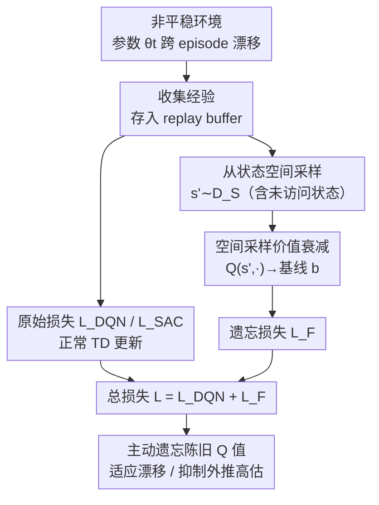

# Space-sampled Value Decay: Forgetting Mechanisms for Non-stationary Deep Reinforcement Learning

**会议**: ICML2026（EIML Workshop）  
**arXiv**: [2606.11797](https://arxiv.org/abs/2606.11797)  
**代码**: 未公开（基于 Stable-Baselines3 + Non-stationary Gym）  
**领域**: 强化学习 / 非平稳环境 / 持续学习  
**关键词**: 非平稳RL、遗忘机制、价值衰减、DQN、SAC  

## 一句话总结
针对环境会悄悄"漂移"、且不给任何 task ID 或 context 提示的非平稳强化学习场景，本文提出 **Space-sampled Value Decay (SsVD)**：通过从状态空间采样并把那些"没去过 / 信息已过期"的状态的 Q 值持续衰减回一个基线，让 DQN/SAC 主动遗忘陈旧知识，从而在动态变化的环境里维持高回报。

## 研究背景与动机
**领域现状**：主流 RL（DQN、SAC 等）默认环境是平稳的——转移动态 $P(s'|s,a)$、奖励 $R(s,a)$ 训练全程不变。一旦环境参数随时间变化（作者统称为 **drift / 漂移**，如机器的磨损、温度变化、材料老化），算法就没有任何专门机制去应对。

**现有痛点**：已有处理"环境会变"的工作大多是 **Continual RL (CRL) / Life-long RL**，但它们的假设很苛刻——需要外部提供 "task ID" 或 "context" 来告诉 agent "现在切到第几号任务了"，目标是**记住**所有旧任务、每个任务都能单独做好。另一类工作假设漂移**每个 episode 结束就重置**（per-episode drift），这在受控实验里好用，但现实里机器是长时间连续运转、漂移会跨 episode 累积的，并不重置。

**核心矛盾**：本文关心的设定恰恰相反——漂移 **(a) 不告诉 agent、(b) 跨 episode 持续保留、(c) 让当前策略变次优**（作者的 Assumption 1）。在这种设定下，旧知识非但不该记住，反而**必须被遗忘**：因为旧的转移样本仍躺在 replay buffer 里、旧的最优 Q 值仍编码在网络权重里，会把策略往过时的方向拽。而且检测漂移本身（在数据高度相关的 RL 里）就是个很难的独立问题，所以"先检测漂移再切任务"的路子并不实用。

**切入角度**：作者从行为生物学的观察出发——老鼠/小鼠在环境参数悄悄变化、且没有任何变化提示时，照样能调整行为，这种现象可以用**遗忘机制**建模。早期 Q-Learning 的遗忘版本（作者称 **Non-taken Value Decay, NtVD**）只适用于"单状态、离散动作"的玩具环境：每步只更新被选动作的 Q 值，其它动作的 Q 值朝基线 $b$ 衰减。

**核心 idea**：把这种遗忘机制从"单状态"推广到现代深度 RL 的**大状态空间**——不再只衰减"未被选动作"，而是**从整个状态空间采样状态**，把那些 agent 没去过、或信息已过期的状态的 Q 值主动拉回基线 $b$，用一个额外的损失项实现，即 **Space-sampled Value Decay (SsVD)**。

## 方法详解

### 整体框架
SsVD 的目标是给 value-based 深度 RL（DQN、SAC）装一个"主动遗忘"的旋钮。它的核心洞察是：agent 面对两类不确定性——**(a) 依赖旧信息**（过期的转移仍在 buffer 里 / 编码在权重里）和 **(b) 完全没有信息**（神经网络对没访问过的状态会外推出任意的高估/低估值）。NtVD 这类老方法只能在单状态环境里衰减"未选动作"，无法处理大状态空间。SsVD 的做法是：**在状态空间上定义一个采样分布 $\mathcal{D}_{\mathcal{S}}$，每次更新时额外采一批状态，把它们的 Q 值朝基线 $b$ 衰减**，并把这个衰减目标写成一个附加损失 $\mathcal{L}_F$，叠加到原算法的损失上。整条 pipeline 不改动原算法主体，只在每个梯度步多算一项遗忘损失。

### 关键设计

**1. 空间采样价值衰减：把"未访问状态"的 Q 值拉回基线，而不只是未选动作**

NtVD 的更新只对当前状态的非选动作生效：$Q(s_t,a)\leftarrow(1-\eta)Q(s_t,a)+\eta b,\ \forall a\neq a_t$，在单状态环境里够用，但大状态空间里"没去过的状态"才是不确定性的主要来源。SsVD 把这一思想搬到整个状态空间：定义状态分布 $\mathcal{D}_{\mathcal{S}}$，对采样状态 $s'\sim\mathcal{D}_{\mathcal{S}}$ 的**所有动作**做衰减

$$Q(s',a)\leftarrow(1-\eta)Q(s',a)+\eta b.$$

衰减率 $\eta$ 越大、遗忘越激进；基线 $b$ 是"没有信息时应当假设的默认值"。这样做的直接好处有两层：其一，环境漂移后，那些反映旧动态的高 Q 值会被持续往基线拉，agent 不会死守过时策略；其二，神经网络对没访问过的状态本来会外推出乱七八糟的值（任意高估/低估），SsVD 给它们钉了一个**合理的默认锚**，抑制了外推灾难。一个关键性质是：**SsVD 完全不依赖采样状态的奖励**——DQN 只需采状态，连续动作的 actor-critic（SAC）只需采状态+动作，因此实现成本极低。

**2. DQN 的遗忘损失：用冻结目标网络当衰减锚，按比例采样补一项 loss**

DQN 把动作价值实现为 $Q:\mathcal{S}\to\mathbb{R}^{|\mathcal{A}|}$，且 bootstrap 时用的是冻结目标网络 $Q^*$。SsVD 复用这个 $Q^*$ 作为衰减目标：在大小为 $m$ 的 mini-batch 之外，额外采 $p\le m$ 个状态 $\hat{s}_1,\dots,\hat{s}_p$，计算

$$\mathcal{L}_F=\frac{1}{p}\sum_{i=1}^{p}\bigl\lVert Q(\hat{s}_i,\cdot)-(1-\eta)Q^*(\hat{s}_i,\cdot)+\eta\mathbf{b}\bigr\rVert^2,$$

其中基线 $\mathbf{b}\in\mathbb{R}^{|\mathcal{A}|}$ 写成向量（每个动作一个分量）。最终损失就是 $\mathcal{L}=\mathcal{L}_F+\mathcal{L}_{DQN}$，相当于在标准 TD 目标之外，再让网络把采样状态的输出往"基线值"靠。采样数量按原 batch 的比例 $\xi$ 取 $p=\max(\lceil\xi m\rceil,1)$，保证至少采一个。用冻结的 $Q^*$ 而非在线网络当锚，避免了衰减目标随训练剧烈抖动。

**3. SAC 的遗忘损失：同时采状态与动作，对双 Q 网络分别衰减**

SAC 的 critic 是 $Q:\mathcal{S}\times\mathcal{A}\to\mathbb{R}$，支持连续动作，且用 double-Q（通常 $k=2$ 个网络取最小值当目标）。因此 SsVD 在 SAC 上要同时采状态和动作 $\hat{s}_1,\dots,\hat{s}_p,\hat{a}_1,\dots,\hat{a}_p$，并对每个 critic $Q_j$ 分别算遗忘损失：

$$\mathcal{L}_F=\frac{1}{p}\sum_{i=1}^{p}\bigl[Q_j(\hat{s}_i,\hat{a}_i)-(1-\eta)Q_j^*(\hat{s}_i,\hat{a}_i)+\eta b\bigr]^2,\quad j=1,\dots,k,$$

这里基线 $b$ 是标量。采样数 $p$ 同样按 $\xi$ 取。和 DQN 唯一的结构差别就是"状态+动作一起采"，因为连续动作下无法像离散那样对所有动作一次性衰减。值得注意的是，作者在实验中发现这种"在状态空间采样"的策略在**高维 MuJoCo 环境（如 Ant）会因维度灾难失效**——高维下用标准 gym 接口均匀采样很难覆盖到有意义的状态，这是 SsVD 的固有局限（见局限部分）。

### 损失函数 / 训练策略
统一损失为原算法损失 + 遗忘损失：$\mathcal{L}=\mathcal{L}_{\text{base}}+\mathcal{L}_F$。关键超参为衰减率 $\eta$、基线 $b$、采样比例 $\xi$。状态采样仅用 gymnasium 标准接口提供的采样过程；实现全部基于 Stable-Baselines3，非方法特有的超参直接沿用 RL Zoo 调好的默认值，保证与 baseline 公平对比。

## 实验关键数据

### 实验设定与环境
在 **Non-stationary Gym** 上构造非平稳环境，统一采用**概率性、单调递减**的参数漂移调度，跨 episode 保留。环境分两类：经典控制（CartPole/Acrobot/MountainCar 用 DQN，MountainCarContinuous 用 SAC）与 MuJoCo（InvertedPendulum/Ant 用 SAC）。

| 环境 | 漂移参数 | 算法 |
|------|----------|------|
| CartPole-v1 | Force（递减） | DQN |
| Acrobot-v1 | 转动惯量（递减） | DQN |
| MountainCar-v0 | Force（递减） | DQN |
| MountainCarContinuous-v0 | Power（递减） | SAC |
| InvertedPendulum-v5 | 小车质量（递减） | SAC |
| Ant-v5 | 重力（递减） | SAC |

对比对象：原始算法（DQN/SAC）、加 SsVD 的版本（DQN_F / SAC_F），以及 **Limited** 版本（训练一段时间后停止更新、但环境继续漂移，用来展示"不再适应会怎样"）。

### 主结果（定性趋势）

| 方法 | 行为表现 |
|------|----------|
| LimitedDQN/SAC | 停更后随漂移持续掉点（符合预期） |
| 默认 DQN | 多数环境难以提升；MountainCar 上甚至**跌破 Limited** |
| 默认 SAC | InvertedPendulum 上能大致适应，但**反复掉落** |
| **DQN_F (SsVD)** | 所有环境**全程维持强性能**，且**初期学习明显更快** |
| **SAC_F (SsVD)** | InvertedPendulum 上回报高、方差低，全程稳定 |

一个有意思的发现：在 MountainCarContinuous **关闭 gSDE 探索**时，两个 baseline 都学不会，而 SAC_F 能学会——说明 **SsVD 还顺带有助于探索**；但开启 gSDE 后 SsVD 不再带来额外收益。

### 消融实验

| 配置 | 结论 |
|------|------|
| DQN vs DQN（2×/5× 梯度步） | SsVD 的提升**不是多算梯度的产物**：给 baseline 加 2×/5× 梯度步，DQN_F 仍显著领先 |
| 平稳环境（无漂移） | 即使**没有漂移**，SsVD 仍有益；MountainCar 上默认 DQN 疑似发生**灾难性遗忘**（收敛后越练越差），DQN_F 没有这个问题 |
| Ant（高维） | SsVD 表现变差，体现高维状态采样的维度灾难；但初期仍学得更快 |

### 关键发现
- SsVD 在**非平稳**环境里是核心收益来源——主动遗忘陈旧 Q 值让策略持续适应漂移。
- 在**平稳**环境里 SsVD 也能缓解灾难性遗忘：作者推测原因是 replay buffer 里塞满了相似经验、缺乏已开发区域之外的信息，导致网络在该区域外取任意值；SsVD 给这些区域钉上基线值，相当于一种正则。
- 提升与"额外计算"无关（梯度步消融已排除），而是来自遗忘机制本身。
- 最大短板在**高维状态空间**：用标准接口采样难以覆盖有意义状态。

## 亮点与洞察
- **把生物学的"遗忘"翻译成一个即插即用的 loss**：不改算法主体，只加一项 $\mathcal{L}_F$，DQN/SAC 都能接，工程上极轻量——这是最可复用的点。
- **不依赖奖励的衰减信号**：SsVD 衰减时不需要采样状态的真实奖励，只要能从状态空间采样即可，绕开了 NSRL 里最难的"漂移检测"和"奖励重估"。
- **一个反直觉的副产物**：遗忘机制不仅对付非平稳，还能缓解平稳环境下的灾难性遗忘、甚至辅助探索——把"主动给未访问状态钉锚"这件事，从"应对漂移"扩展成了"抑制函数逼近器的外推乱估"。
- 思路可迁移：任何用神经网络逼近价值/Q 的离线/在线算法，都可以考虑给"未覆盖状态"加一个基线正则，来抑制外推高估。

## 局限与展望
- **作者承认**：漂移形态多样，对"极罕见但极强"的漂移，更合理的做法可能是基于奖励历史检测漂移后**重启训练**；不假设任何先验，没有方法能对所有设定都最优。
- **高维状态采样失效**（自己也强调）：MuJoCo Ant 上因维度灾难，标准接口均匀采样覆盖不到有意义状态，SsVD 收益下降——如何设计更聪明的状态采样分布 $\mathcal{D}_{\mathcal{S}}$ 是关键待解问题。
- **依赖"状态空间可采样"假设**：很多场景（如电子游戏，只能采像素）根本无法合理地独立采样状态，方法不直接适用。
- **基线 $b$ 的选择**：把 Q 值衰减到哪个值才"合理"缺乏系统讨论，不同环境可能需要不同基线。
- 实验仍偏向经典控制 + 部分 MuJoCo，规模较小（Workshop 论文），结论需要更大规模验证。

## 相关工作与启发
- **vs Non-taken Value Decay (NtVD)**：NtVD 只在单状态、离散动作环境里衰减"未选动作"；SsVD 把它推广到大状态空间 + 现代深度 RL（DQN/SAC），衰减对象是"采样到的未访问状态"，这是本文的核心推进。
- **vs Continual / Life-long RL（EWC、CLEAR 等）**：那些方法靠 task ID / context 区分任务、目标是**记住**所有旧任务；本文相反，要求在无提示下**主动遗忘**陈旧知识以维持当前最优，定位的问题设定本身就不同。
- **vs per-episode drift 设定**：已有部分工作假设漂移每个 episode 重置；本文坚持"漂移跨 episode 累积、不重置"，更贴近真实工业场景（磨损、老化）。

## 评分
- 新颖性: ⭐⭐⭐⭐ 把生物遗忘机制系统推广到深度 RL 的非平稳设定，问题设定（无 task ID 的跨 episode 漂移）切得清楚
- 实验充分度: ⭐⭐⭐ 覆盖经典控制 + 部分 MuJoCo，消融到位（排除算力、验证平稳环境），但规模偏小、高维失效
- 写作质量: ⭐⭐⭐⭐ 动机链条清晰，公式与生物学动机交代完整
- 价值: ⭐⭐⭐⭐ 即插即用、不依赖奖励、还能缓解灾难性遗忘，对在线/持续 RL 有实用启发

<!-- RELATED:START -->

## 相关论文

- [\[ICML 2026\] Tracking Drift: Variation-Aware Entropy Scheduling for Non-Stationary Reinforcement Learning](tracking_drift_variation-aware_entropy_scheduling_for_non-stationary_reinforceme.md)
- [\[NeurIPS 2025\] Solving Continuous Mean Field Games: Deep Reinforcement Learning for Non-Stationary Dynamics](../../NeurIPS2025/reinforcement_learning/solving_continuous_mean_field_games_deep_reinforcement_learning_for_non-stationa.md)
- [\[NeurIPS 2025\] Forecasting in Offline Reinforcement Learning for Non-stationary Environments](../../NeurIPS2025/reinforcement_learning/forecasting_in_offline_reinforcement_learning_for_non-stationary_environments.md)
- [\[ICML 2026\] Hista and Numca: Estimate State Value Effectively for LLM Reinforcement Learning](hista_and_numca_estimate_state_value_effectively_for_llm_reinforcement_learning.md)
- [\[ICML 2025\] Non-stationary Online Learning for Curved Losses: Improved Dynamic Regret via Mixability](../../ICML2025/reinforcement_learning/non-stationary_online_learning_for_curved_losses_improved_dynamic_regret_via_mix.md)

<!-- RELATED:END -->
