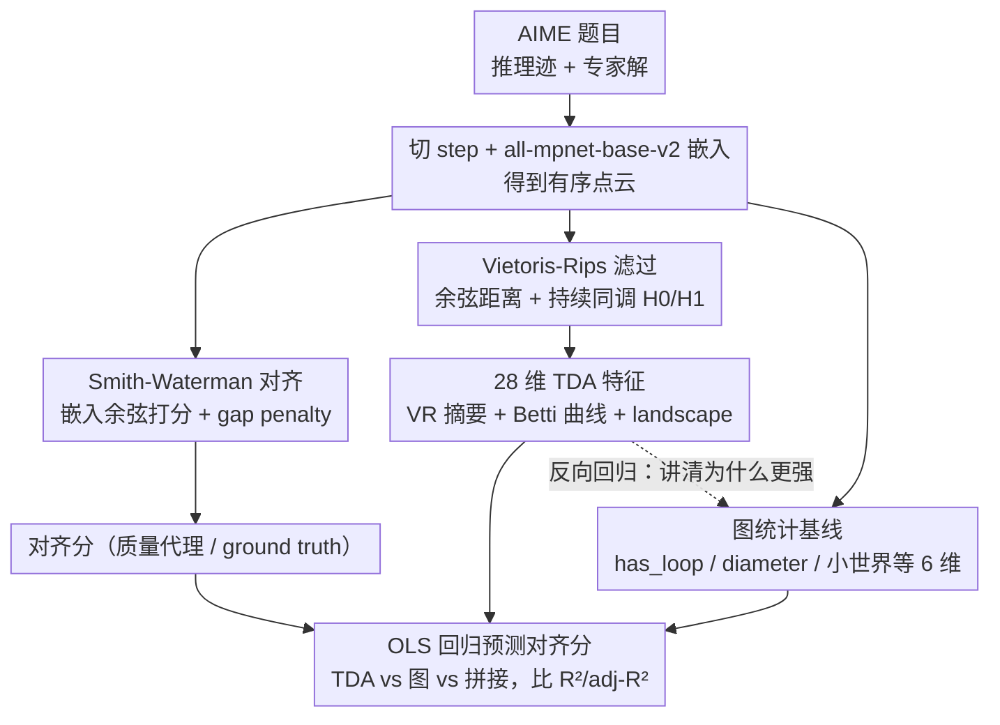

# The Shape of Reasoning: Topological Analysis of Reasoning Traces in Large Language Models

**会议**: ICML 2026  
**arXiv**: [2510.20665](https://arxiv.org/abs/2510.20665)  
**代码**: 待确认  
**领域**: LLM推理 / 推理评估 / 可解释性  
**关键词**: 推理迹评估, 拓扑数据分析, 持续同调, Smith-Waterman 对齐, AIME

## 一句话总结
本文把 LLM 的 chain-of-thought 看作嵌入空间中的"点云", 用拓扑数据分析 (TDA) 提取持续同调特征作为推理质量的客观度量, 在 AIME 数据集上证明 TDA 特征对 Smith-Waterman 对齐分数的预测能力 (平均 $R^2=0.236$) 显著高于传统图统计 (平均 $R^2=0.064$)。

## 研究背景与动机

**领域现状**：评估 LLM 推理质量目前仍以专家撰写的 rubric、人工标注、pairwise judging 为主, 既慢又贵; 自动化路线大多走 graph-based proxy (把推理迹建成有向图, 统计聚类系数、直径、小世界指数等), 用结构连通性近似"推理好坏"。

**现有痛点**：(1) 大多数推理数据集只给最终答案, 用 answer accuracy 替代 reasoning quality 已经被多篇工作证伪——LLM 能用错误推理蒙对答案; (2) 图统计把高维嵌入压成几个标量, 丢失了"推理过程在语义空间中如何展开"的几何信息; (3) 自洽性采样 (self-consistency) 这类聚合方法直接把中间推理路径丢掉, 完全没在评估推理本身。

**核心矛盾**：图度量只能描述节点之间的离散连接关系, 但好推理与坏推理的真正区别可能藏在更高维的几何结构里——例如局部紧密性、循环 (detour) 的持续性、不同尺度上的聚合模式, 而这些是无法用单一标量图统计完整刻画的。

**本文目标**：(1) 在缺乏 step-level label 的现实条件下, 构造可对照的"推理 ground truth"; (2) 用一组与 surface 改写无关的不变量量化推理质量; (3) 检验这种不变量是否比图统计更能预测推理质量。

**切入角度**：作者把推理迹的每一步用 sentence embedding 嵌到 $\mathbb{R}^d$, 得到一个有序点云。两个看似不同的正确解可能"同胚"——就像甜甜圈和咖啡杯——共享某种深层几何结构, 而错误推理则缺乏这种结构。TDA 中的持续同调 (persistent homology) 恰好提供了一套刻画"形状不变量" (连通分量 $H_0$、一维环洞 $H_1$) 的工具。

**核心 idea**：用 Smith-Waterman 在嵌入空间中把 LLM 推理迹对齐到专家解, 用对齐分作 ground truth; 再对推理迹的嵌入点云做 Vietoris-Rips 滤过, 抽取 $H_0/H_1$ 持续同调特征, 用 OLS 回归验证其对对齐分的预测能力。

## 方法详解

### 整体框架

输入是 AIME (American Invitational Mathematics Examination) 题目及其专家解。模型用本地 Ollama 服务跑 answer-blind prompt 生成推理迹 $r_i$, 与专家解 $s_i$ 一起按规则切成 step list, 每个 step 用 all-mpnet-base-v2 嵌入。在嵌入空间里, 一边做 Smith-Waterman 对齐得到"对齐分"作为质量代理; 另一边对推理迹的点云算 Vietoris-Rips 持续图, 抽取 28 维 TDA 特征。最后用 OLS 回归把 TDA 特征 / 图特征 / 二者拼接分别去预测对齐分, 对比 $R^2$ 和 adjusted $R^2$。

### 关键设计

**1. 嵌入空间中的 Smith-Waterman 对齐：在没有 step-level 标注时造一个推理 ground truth**

推理数据集大多只给最终答案、缺少"每一步对不对"的标注，于是本文先造一个质量代理。把推理迹 $R_i=(r_{i,1},\dots,r_{i,m})$ 和专家解 $S_i=(s_{i,1},\dots,s_{i,n})$ 分别嵌入为 $X_i^{(r)}\in\mathbb{R}^{m\times d}$、$X_i^{(s)}\in\mathbb{R}^{n\times d}$，用 cosine 相似度作 match score $s_{uv}$、配 gap penalty $\gamma>0$，跑标准 DP 递推

$$H_{u,v}=\max\{0,\,H_{u-1,v-1}+s_{uv},\,H_{u-1,v}-\gamma,\,H_{u,v-1}-\gamma\},$$

再从 $\arg\max H_{u,v}$ 回溯得到对齐对 $\mathcal{A}_i$，汇总成 mean alignment score 与 gold-step coverage 两个标量。这里直接借的是生物序列比对里的 local alignment 思想——专家解和模型推理往往只在某些子段对齐，全局对齐会被冗余思考拖崩；而把打分函数从字符相等换成嵌入余弦，就能让"语义等价但措辞不同"的步骤也对得上。

**2. Vietoris-Rips 滤过 + 持续同调特征：把推理点云转成对改写鲁棒的拓扑不变量**

图统计把高维嵌入压成几个标量、丢掉了几何信息，这一步换用拓扑不变量。在嵌入步骤集合 $X=\{\mathbf{x}_1,\dots,\mathbf{x}_\ell\}$ 上定义余弦距离 $\mathrm{dist}(\mathbf{x}_p,\mathbf{x}_q)=1-\langle\mathbf{x}_p,\mathbf{x}_q\rangle/(\|\mathbf{x}_p\|\|\mathbf{x}_q\|)$，构造 Vietoris-Rips 复形并随尺度参数变化，记录拓扑特征的"出生-死亡"时刻得到持续图 $\mathcal{D}_k=\{(b_j^{(k)},d_j^{(k)})\}$（$k\in\{0,1\}$），再抽出三族共 28 维特征：VR 摘要统计（mean life、entropy 等）、Betti 曲线描述子（centroid、spread、width）、persistence landscape 描述子。之所以选 $H_0$ 和 $H_1$，是因为 $H_0$ 编码"思路在嵌入空间里如何聚团与合并"、$H_1$ 编码"推理有没有绕路与回环"，合起来恰好对应"局部紧凑性 + 全局检索-收敛"的良好推理画像；而且拓扑特征对嵌入器、距离函数的具体选择有较好不变性，比图统计稳定。

**3. 图统计基线 + 拓扑-图的可翻译性分析：不只证明 TDA 更强，还讲清为什么强**

为公平对照，在完全相同的嵌入数据上按 Minegishi et al. 2025 的口径建 trace graph，计算 has_loop、loop_count、diameter、average clustering $\overline{C}$、average shortest path $\overline{L}$、small-world index 六个图统计。然后反过来用 OLS 把这些图统计回归到 TDA 特征上，发现一批系统性关系：$H_0$ mean life 提升 clustering、$H_0$ betti centroid 拉长 path length 和 diameter、$H_1$ landscape mean 提升 loop count——大致是 $H_0$ 控制"全局凝聚与高效"、$H_1$ 控制"环路丰富度"。TDA 对 4 个全局图统计能解释 $R^2\approx 0.35$-$0.38$，但对 loop incidence 只有 $\approx 0.07$。这个反向回归的意义在于：很多图统计本质就是 TDA 在某个尺度上的压缩投影，一旦把整条滤过保留下来，信息自然比单一尺度的图统计更丰富——这也解释了为什么拼接图特征几乎不再额外带来增益。

### 训练策略

本文不训练任何模型, 评估流程只涉及 sentence embedding (all-mpnet-base-v2 冻结) + Smith-Waterman DP + Vietoris-Rips 持续同调 + OLS 回归; 主要超参为余弦距离阈值、Smith-Waterman 的 gap penalty $\gamma$、Vietoris-Rips 的 maxdim$=1$。

## 实验关键数据

### 主实验

数据集为 AIME 2020-2025, 共 180 个 (model, problem) 观测, 覆盖 8 个 LLM 配置 (Qwen3 / DeepSeek-R1 / GPT-OSS 各两至三个规模)。回归目标是 Smith-Waterman 对齐分。

| 模型 | Graph $R^2$ | TDA $R^2$ | Graph+TDA $R^2$ | $\Delta R^2$ vs TDA |
|------|------|------|------|------|
| Qwen3-8B | 0.054 | 0.273 | 0.312 | +14.3% |
| Qwen3-32B | 0.088 | 0.181 | 0.233 | +28.7% |
| Qwen3-235B | 0.024 | 0.163 | 0.167 | +2.5% |
| DeepSeek-r1-7B | 0.047 | 0.210 | 0.226 | +7.6% |
| DeepSeek-r1-32B | 0.057 | 0.190 | 0.226 | +18.9% |
| DeepSeek-r1-70B | 0.058 | 0.249 | 0.300 | +20.5% |
| GPT-OSS-20B | 0.081 | 0.296 | 0.327 | +10.5% |
| GPT-OSS-120B | 0.101 | 0.327 | 0.368 | +12.5% |
| **均值** | **0.064** | **0.236** | **0.270** | **+14.4%** |

TDA 单独使用就把 $R^2$ 抬到图统计的 3-4 倍, 8 个配置里 7 个 adjusted $R^2$ 更高。把图特征加进 TDA 的 raw $R^2$ 平均还能多 14.4%, 但 adjusted $R^2$ 平均反而 $-3.4\%$, Qwen3-235B 和 DeepSeek-r1-7B 上甚至下降——说明图特征基本被 TDA 子空间覆盖, 加进去主要在膨胀复杂度。

### 消融实验 / 显著特征聚类

| 特征聚类 | 含义 | 与对齐分关系 | 物理解释 |
|------|------|------|------|
| Cluster 2 ($H_0$ betti_spread) | 不同尺度上合并的展开度 | 正相关 | 推理在多个尺度同时"成团", 主干清晰 |
| Cluster 3 ($H_0$ betti_width) | 合并尺度跨度 | 负相关 | 跨度过大说明断点多, 整体连贯性差 |
| Cluster 12 ($H_1$ betti_width) | 一维环洞的尺度范围 | 正相关 | 包含适度短-中尺度的局部 check 是好事 |
| Cluster 16 ($H_1$ max_birth/max_death) | 晚生大尺度环洞 | 弱负相关 | 大规模的晚期 detour 通常是绕远路 |

### 关键发现
- **TDA 远胜图统计**: TDA-only 平均 $R^2$ 是 Graph-only 的 $\approx 3.7\times$; adjusted $R^2$ 在 7/8 模型上 TDA 更优。说明"高质量推理"更像高维几何不变量, 不只是离散连通性。
- **拓扑特征可翻译回图特征**: TDA 对 clustering / path length / diameter / small-world 这 4 个全局图统计的 $R^2\approx 0.35$-$0.38$, 但对 loop count 只有 $\approx 0.07$——loop multiplicity 由极少节点的局部连接模式决定, 比较 idiosyncratic, 几乎无法被几何不变量替代。
- **好推理画像**: 综合显著系数, 高质量推理倾向"保持一条凝聚的主线 + 包含短而多样的局部验证 + 避免大规模晚期绕路", 与人类对"清晰、可检查、不走神"的直觉一致。
- **数据集天花板**: 即便最好的配置 $R^2\approx 0.37$ 也只解释了不到 40% 的对齐分方差, 说明嵌入几何只是推理质量的一部分信号, 不能完全替代语义判断。

## 亮点与洞察
- 把 chain-of-thought 当成嵌入空间里的有序点云, 然后套 TDA, 这种"几何视角"非常 refreshing——之前要么停留在 token-level 概率, 要么停留在离散图统计, 而几何不变量正好填上中间这层。
- Smith-Waterman 嵌入空间对齐是个可以单独拿走的小工具: 在任何需要把模型生成对齐到 reference 但不要求字面一致的场景 (如 long-form QA、code 思路对齐) 都能复用。
- 把"为什么 TDA 强"用 TDA→图统计的反向回归讲清楚, 这种"先证强, 再讲明白为什么强"的实证结构相当工整, 比单纯刷点更有信息量。
- 对未来 RL/RLHF 训练的暗示: 用 $H_0$ betti_spread、$H_0$ mean life 这类标量做 process reward, 可以提供一个比 ORM 廉价、比 graph PRM 更细的训练信号。

## 局限与展望
- **数据集面太窄**: 只用了 AIME 数学题 (奥赛级别), 推理风格相对一致 (符号推导为主), 在 commonsense reasoning、science QA、code reasoning 上是否仍然成立未知, 作者自己也承认这是首要扩展方向。
- **拓扑特征 ≠ 推理结构**: 持续图刻画的是 sentence embedding 在余弦距离下的几何, 不直接对应符号层面的"分支、回溯、合并"; 换 embedder、换切句规则、换距离都会让 $H_1$ 环洞出现或消失。所以"$H_1$ 表示 detour、$H_0$ 表示思路聚合"只是一种解释性叙述, 不是因果断言。
- **解释力的绝对上限不高**: 最高 $R^2\approx 0.37$, 还有 60%+ 的对齐方差被解释不了, 单用 TDA 还做不到代替人类评估。
- **可行的改进**: (1) 引入多个 embedder 集成或对比学习专门微调的"推理向量"; (2) 把 TDA 特征送进 supervised learning 而不只是 OLS, 看是否能突破线性瓶颈; (3) 把当前的 batch evaluation 转成 process reward, 直接进 RL loop 验证"高 betti_spread"是否真的能 transfer 到下游推理。

## 相关工作与启发
- **vs Minegishi et al. 2025 (Topology of Reasoning)**: 同样想刻画推理迹的"形状", 但他们把推理迹建成有向图后只算 graph statistics; 本文论证了图统计是几何的低维投影, TDA 在同一数据上多解释 $\approx 17$ 个百分点的方差。
- **vs Xiong et al. 2025 (reasoning-graph 框架)**: 同样关注 reasoning 的结构分析, 都指出"长 ≠ 好"; 本文给出了一个比 branching/convergence 更细粒度的几何度量。
- **vs Gardinazzi et al. 2025 (zigzag persistence in transformers)**: 都用 persistent homology 看 LLM, 但他们看的是层间表征演化, 本文看的是 inference-time 推理迹本身的几何; 二者其实可以叠加成"训练-推理双层 TDA 视角"。
- **vs Ton et al. 2025 (information-theoretic step contribution)**: 同样想自动化评估推理, 一种是从信息论度量"每一步贡献", 一种是从几何度量"整条迹的形状", 两条路线互补, 后续可以联合使用。

<!-- RELATED:START -->

## 相关论文

- [\[ICML 2026\] Break the Block: Dynamic-size Reasoning Blocks for Diffusion Large Language Models via Monotonic Entropy Descent with Reinforcement Learning](break_the_block_dynamic-size_reasoning_blocks_for_diffusion_large_language_model.md)
- [\[ICML 2026\] d2: Improving Reasoning in Diffusion Language Models via Trajectory Likelihood Estimation](d2_improving_reasoning_in_diffusion_language_models_via_trajectory_likelihood_es.md)
- [\[ICML 2026\] Game of Thought: Robust Information Seeking with Large Language Models Using Game Theory](game_of_thought_robust_information_seeking_with_large_language_models_using_game.md)
- [\[NeurIPS 2025\] GraphChain: Large Language Models for Large-scale Graph Analysis via Tool Chaining](../../NeurIPS2025/reinforcement_learning/graphchain_large_language_models_for_large-scale_graph_analysis_via_tool_chainin.md)
- [\[NeurIPS 2025\] Incentivizing Reasoning for Advanced Instruction-Following of Large Language Models](../../NeurIPS2025/reinforcement_learning/incentivizing_reasoning_for_advanced_instruction-following_of_large_language_mod.md)

<!-- RELATED:END -->
