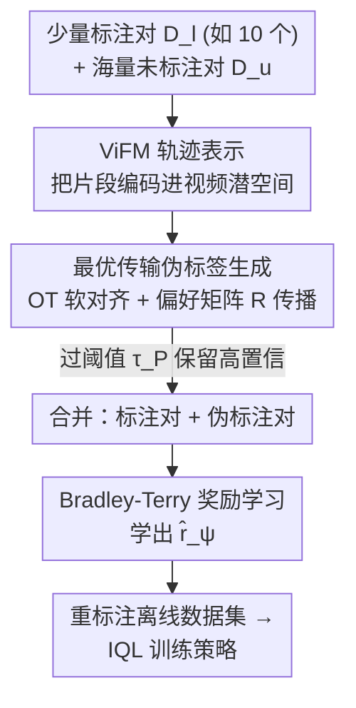

# Video-Based Optimal Transport for Feedback-Efficient Offline Preference-Based Reinforcement Learning

**会议**: ICML 2026  
**arXiv**: [2606.16856](https://arxiv.org/abs/2606.16856)  
**代码**: https://github.com/tunglm2203/votp (有)  
**领域**: 强化学习 / 离线偏好强化学习  
**关键词**: 偏好强化学习, 最优传输, 视频基础模型, 半监督伪标签, 反馈效率  

## 一句话总结
针对偏好强化学习（PbRL）需要成千上万次人工比较才能学出好奖励的高标注成本问题，VOTP 把轨迹片段用视频基础模型编码进语义空间，再用最优传输在"少量已标注对"和"海量未标注对"之间求对齐、把偏好传播过去自动生成伪标签，只用 10 个标注就能学到有效奖励，在 D4RL 运动控制和 MetaWorld 操作任务上超过现有离线 PbRL 方法、几乎追平 Oracle。

## 研究背景与动机
**领域现状**：很多决策任务一旦有好奖励就能用 RL 解决，但现实里奖励设计极难——要么靠昂贵的传感器布置、要么手工奖励容易被 agent 钻空子（reward hacking）。偏好强化学习（PbRL）换了条路：不手写奖励，而是让人对成对的视频片段做比较反馈，再用这些偏好学一个奖励函数（Bradley-Terry 模型 + 交叉熵），之后照常做策略优化。

**现有痛点**：要学出覆盖状态-动作空间、下游性能强的奖励，PbRL 往往需要**几百到几千次**人工比较，标注负担难以为继。已有缓解手段（半监督、元学习、主动学习、偏好排序）各有进展，但有个根本维度被忽视了：**人的偏好本来就是由对 agent 行为的视觉感知塑造的**，却很少有人去利用这种感知层面的区分来提效率。

**核心矛盾**：奖励质量 ∝ 偏好覆盖度，而覆盖度 ∝ 标注量；想省标注就得放弃覆盖度，质量随之崩。半监督方法（如 SURF）试图用"训练中的奖励模型"给未标注对打伪标签，但在低数据下奖励模型本身就不准，伪标签噪声大、引发确认偏差（confirmation bias），反而拖累性能。

**本文目标**：在极低标注预算（如仅 10 个偏好）下，靠未标注数据（PbRL 里这部分零成本、可从离线数据集里随便采）把伪标签做准，从而把奖励学好。

**切入角度**：视频基础模型（ViFM）在海量人类活动视频上预训练，其表示空间表达力强、对无关变化鲁棒、能跨环境泛化——可以用它来"按行为相似度"把新行为和已知的有偏好样本对齐，从而推断偏好。而对齐这件事，最优传输（OT）正是天生的工具。

**核心 idea**：用最优传输在 ViFM 表示空间里求"未标注片段对 ↔ 已标注片段对"的软对齐，再按对齐强度把已标注偏好加权传播成伪标签，把"半监督伪标注"从"靠不准的奖励模型"换成"靠分布对齐"。

## 方法详解

### 整体框架
VOTP 是一个半监督奖励学习框架，分两步把"少量标注 + 海量未标注"变成可训练的偏好数据集。第一步，把每个轨迹片段当作一段短视频 $\sigma=\{o_1,\dots,o_H\}$，用现成的视频基础模型编码器 $f_\phi$ 嵌入到潜空间 $z=f_\phi(o_{1:H})$——这一步要同时抓住帧内空间细节和帧间时序动态，因为行为差异正是靠这两者体现的。第二步，在这个潜空间里用最优传输求已标注集合 $L$ 与未标注集合 $U$ 之间的软对齐 $\mu^*$，再结合已标注片段之间的偏好矩阵 $R$，给每个未标注对算一个偏好分数、过阈值后变成伪标签。

拿到伪标签后，把"已标注对 + 高置信伪标注对"一起喂给 Bradley-Terry 奖励学习（交叉熵损失），学出奖励 $\hat r_\psi$；再用它重标注离线数据集里所有 state-action 对，最后用任意离线 RL 算法（本文用 IQL）训练策略。整个框架与 baseline 唯一的差别只在"奖励学习"这一段，策略学习超参完全对齐，确保比较公平。

### 关键设计

**1. ViFM 轨迹表示：用视频基础模型而非图像模型编码行为**

这一设计针对"偏好由视觉感知塑造"这一被忽视的点。VOTP 把每个片段建模成短视频而非单帧集合，用在大规模人类活动视频（如 HowTo100M）上预训练的视频基础模型（本文用 S3D）来编码。理由是：判断"哪个行为更好"本质上要看**时序动态和细微运动线索**——单帧图像模型（R3M、CLIP）抓不住"动作怎么展开"，而 ViFM 的预训练覆盖多样的演员、视角、光照、背景，产出的是 actor-agnostic、语义丰富、对干扰鲁棒的嵌入，能泛化到没见过的机器人环境。消融里 ViFM 在 walker2d、door-open 上明显优于图像模型；作者选 S3D（31M 参数）而非更大的 VideoCLIP（208M）/InternVideo（478M），因为它在更少参数下就有稳健表现。

**2. 最优传输伪标签生成：用对齐强度把已标注偏好传播给未标注对**

这是 VOTP 的核心。已标注集合 $L=\{\sigma_i\}_{i=1}^N$（$N=2N_l$）的偏好关系存进一个反对称矩阵 $R\in\{-1,0,1\}^{N\times N}$（$R^\top=-R$）。然后在 ViFM 潜空间里求 $L$ 与未标注集合 $U=\{\bar\sigma_{i'}\}$ 之间的 OT 计划：

$$\mu^* = \arg\min_{\mu\in M} \sum_{i=1}^N\sum_{i'=1}^M c(\sigma_i, \bar\sigma_{i'})\,\mu_{ii'}$$

其中成本 $c(\sigma_i,\bar\sigma_{i'}) = d(f_\phi(\sigma_i), f_\phi(\bar\sigma_{i'}))$ 是编码后的视觉距离（欧氏或余弦）。$\mu^*$ 的每个元素 $\mu_{ii'}$ 表示未标注片段 $\bar\sigma_{i'}$ 与已标注片段 $\sigma_i$ 匹配的概率。把这些匹配概率和偏好矩阵 $R$ 结合，就能给未标注对 $(\bar\sigma_{i'},\bar\sigma_{j'})$ 算偏好分数：

$$S(\bar\sigma_{i'},\bar\sigma_{j'}) = \sum_{i=1}^N\sum_{j=1}^N R_{ij}(\mu_{ii'}\mu_{jj'} - \mu_{ij'}\mu_{ji'})$$

直觉上，$\mu_{ii'}\mu_{jj'}$ 衡量 $(\sigma_i,\sigma_j)$ 与 $(\bar\sigma_{i'},\bar\sigma_{j'})$ 的对齐、$\mu_{ij'}\mu_{ji'}$ 衡量与反序对的对齐，二者之差为正说明未标注对**继承**了这个已标注对的偏好方向，为负则翻转。最终分数是对所有已标注对的对齐比较做聚合——这正是它优于"只看最相似那一对"的 SIM 基线之处：VOTP 用**全部**已标注偏好按相对对齐强度加权，伪标签更稳。

由于 $\sum\mu_{ij}=1$ 导致原始分数偏小，再用 $S_{\max}=\sum_{i,j}\frac{1}{N^2}\mathbb{1}(R_{ij}\neq 0)$ 归一化，保证 $S_{\text{norm}}\in[-1,1]$；最后过偏好阈值 $\tau_P$ 定标签：$|S_{\text{norm}}|\geq\tau_P$ 时按符号给 0/1 偏好，否则判为 0.5（等偏好）。

**3. Sinkhorn 求解 + 阈值过滤：让 OT 既算得快又不被噪声拖累**

精确求 OT 是个线性规划，标准求解器太贵。VOTP 用熵正则化的 Sinkhorn 算法（POT 工具箱实现）求近似耦合，兼顾效率与数值稳定。更关键的是**只保留分数高于 $\tau_P$ 的伪标签**用于训练——这把"伪标签质量"和"数量"做了显式权衡：$\tau_P$ 越大、保留的伪标签越准但越少。这一阈值过滤是 VOTP 抵御伪标签噪声、避免 SURF 那类确认偏差的直接手段；实测整套流程在 2 小时内完成，而对比的 FTB（用扩散模型生成更优轨迹）每次要约 2 天。

### 一个完整示例
以 4 个已标注片段 $\sigma_{1\sim4}$、2 个未标注片段 $\bar\sigma_1,\bar\sigma_2$ 为例（论文 Figure 1b）：偏好矩阵 $R$ 记录了 $\sigma_i$ 之间谁优于谁（如 $\sigma_3\succ\sigma_1$）。OT 计划 $\mu^*$ 给出每个 $\bar\sigma$ 与各 $\sigma_i$ 的匹配概率（如 $\bar\sigma_1$ 与 $\sigma_1$ 匹配 0.18）。代入偏好分数公式，算得 $S(\bar\sigma_1,\bar\sigma_2)=0.18$，为正、超过 $\tau_P$，于是给这个未标注对打上"$\bar\sigma_2\succ\bar\sigma_1$"的伪标签。海量未标注对就这样被逐一传播上偏好，和原始 10 个标注对一起去学奖励。

## 实验关键数据

### 主实验
在 D4RL 运动控制和 MetaWorld 操作任务上，初始仅 10 个标注对，VOTP 超过一众离线 PbRL 基线、几乎追平 Oracle（节选，分数越高越好；loco/mw avg 为各域平均）：

| 任务 | IQL+GT | Oracle | P-IQL | SURF | LiRE | FTB | **VOTP** |
|------|--------|--------|-------|------|------|-----|----------|
| hop-m-r | 87.5 | 91.3 | 36.5 | 9.3 | 52.1 | 90.5 | **91.1** |
| walker2d-m-e | 109.9 | 109.6 | 103.4 | 103.2 | 109.7 | 76.5 | **108.1** |
| **loco avg.** | 93.6 | 92.4 | 65.3 | 59.5 | 83.2 | 85.4 | **92.8** |
| door-open | 79.2 | 90.4 | 36.8 | 74.4 | 84.0 | 43.2 | **84.0** |
| plate-slide | 56.0 | 62.4 | 15.2 | 23.2 | 38.0 | 41.6 | **57.6** |
| **mw avg.** | 71.0 | 80.1 | 31.0 | 51.0 | 64.0 | 51.6 | **67.6** |

VOTP 在运动控制域平均 92.8、**有效追平 Oracle（92.4）**，操作域平均 67.6 居各 PbRL 方法之首。对比之下，SURF 用奖励模型生成伪标签在 hop-* 上崩盘（确认偏差），FTB 效果不错但每次训练要约 2 天，而 VOTP 不到 2 小时。

### 消融实验

| 配置 | 关键指标 | 说明 |
|------|---------|------|
| Full VOTP（S3D + OT） | 最优 | 完整方法 |
| 换图像模型（R3M/CLIP） | 掉点（walker2d/door-open 明显） | 缺时序动态，验证 ViFM 必要性 |
| SIM-individual（只取最相似对） | 次优 | 丢弃了多对聚合信息 |
| SIM-mean（组特征平均） | 最差 | 平均掉了细粒度区分 |
| SIM-weighted（相似度加权） | 不稳 | 仍明显低于 OT |

### 关键发现
- **OT 比纯相似度匹配更可靠**：三个 SIM 基线都不如 VOTP，其中 SIM-mean 最差——平均组特征会抹掉判别偏好所需的细粒度差异；这印证"按相对对齐强度聚合全部已标注偏好"才是关键。
- **视频模型胜过图像模型**：时序动态对判断行为优劣不可或缺，但 S3D（31M）已足够，不必上更大的 ViFM。
- **反馈效率极高**：D4RL 上 P-IQL 要约 50–100 个标注才追平任务奖励性能、MetaWorld 要约 1k，而 VOTP 普遍用更少标注就达标；door-open 上仅 10 个标注的 VOTP 甚至超过用真奖励训练的策略。
- **阈值 $\tau_P$ 是质量-数量权衡**：性能随 $\tau_P$ 增大先升（伪标签更准）后微降（高阈值留下的伪标签太少），需按域调。
- **奖励对齐度**：door-open 上 VOTP 学到的奖励与真奖励的 Pearson 相关达 $r=0.93$，远高于 P-IQL 的 $r=0.57$。

## 亮点与洞察
- **把"半监督伪标注"从奖励模型换成最优传输**：绕开了"低数据下奖励模型不准 → 伪标签噪声 → 确认偏差"的恶性循环，是对 SURF 这条线最直接的对症下药。
- **偏好分数公式优雅地用上反对称矩阵 $R$**：$\mu_{ii'}\mu_{jj'}-\mu_{ij'}\mu_{ji'}$ 同时编码了"正序对齐"和"反序对齐"，swap 不变性自然成立，可迁移到任何"用软对齐传播成对标签"的半监督场景。
- **复用现成 ViFM、零额外预训练**：编码器即插即用，未标注对零成本采自离线数据，整套方法轻量、训练快（2 小时 vs FTB 的 2 天），并在真实机器人桌面操作任务上验证有效。

## 局限与展望
- **依赖未标注对的可渲染性**：VOTP 在图像观测上做标注，未标注集合大小受"渲染视觉片段的成本"限制；这也是 $\tau_P$ 调大时伪标签数量受限的原因。
- **OT 计算随片段数增长**：虽用 Sinkhorn 提速，但 $L\times U$ 的耦合矩阵在超大未标注集合下仍有规模压力。
- **伪标签质量受 ViFM 表示上限制约**：编码器若在某类机器人行为上泛化不佳，OT 对齐会失准——作者也指出换更强 ViFM 有望进一步提升。
- **合成偏好为主**：模拟实验用脚本教师按真奖励生成偏好（部分任务用人标），真实人类噪声偏好下的鲁棒性验证相对有限。

## 相关工作与启发
- **vs SURF**：同为半监督、都用未标注对扩充偏好集，但 SURF 靠训练中的奖励模型打伪标签，低数据下噪声大；VOTP 用 OT 在 ViFM 空间做对齐，不依赖尚未学好的奖励模型，避免确认偏差。
- **vs FTB**：FTB 用扩散模型生成"更优轨迹"，效果好但每次训练约 2 天；VOTP 走对齐+传播，性能更优且 2 小时内完成。
- **vs SIM 类相似度基线**：它们只看单对/组平均相似度，VOTP 用 OT 计划聚合全部已标注偏好并按相对对齐强度加权，伪标签更稳更准。
- **vs 用 VLM 直接打奖励的工作**：那类方法用图像-语言模型直接给 RL agent 算奖励，VOTP 则用视频模型的时序表示 + OT 推断偏好，更贴合"偏好由行为时序塑造"的本质。

## 评分
- 新颖性: ⭐⭐⭐⭐⭐ 用最优传输在视频基础模型空间传播偏好生成伪标签，把 PbRL 的半监督瓶颈换了个干净的角度。
- 实验充分度: ⭐⭐⭐⭐⭐ 覆盖 D4RL + MetaWorld + 真实机器人，编码器/OT/标注量/阈值/视觉干扰消融齐全，含奖励对齐度分析。
- 写作质量: ⭐⭐⭐⭐ 方法推导清晰、Figure 1b 的具体示例很帮助理解，OT 公式部分对无背景读者稍密。
- 价值: ⭐⭐⭐⭐⭐ 仅 10 标注即追平 Oracle、训练快、即插即用，对降低 PbRL 标注成本有实打实的落地意义。

<!-- RELATED:START -->

## 相关论文

- [\[ICML 2026\] Counterfactual Transport Flows for Offline Conservative Trajectory Refinement](counterfactual_transport_flows_for_offline_conservative_trajectory_refinement.md)
- [\[ICML 2026\] From Reward-Free Representations to Preferences: Rethinking Offline Preference-Based Reinforcement Learning](from_reward-free_representations_to_preferences_rethinking_offline_preference-ba.md)
- [\[CVPR 2026\] EVA: Efficient Reinforcement Learning for End-to-End Video Agent](../../CVPR2026/reinforcement_learning/eva_efficient_reinforcement_learning_for_end-to-end_video_agent.md)
- [\[ICML 2026\] Safe Reinforcement Learning with Preference-Based Constraint Inference](safe_reinforcement_learning_with_preference-based_constraint_inference.md)
- [\[ICML 2026\] Noise-Guided Transport: Imitation Learning from Random Priors](noise-guided_transport_for_imitation_learning.md)

<!-- RELATED:END -->
