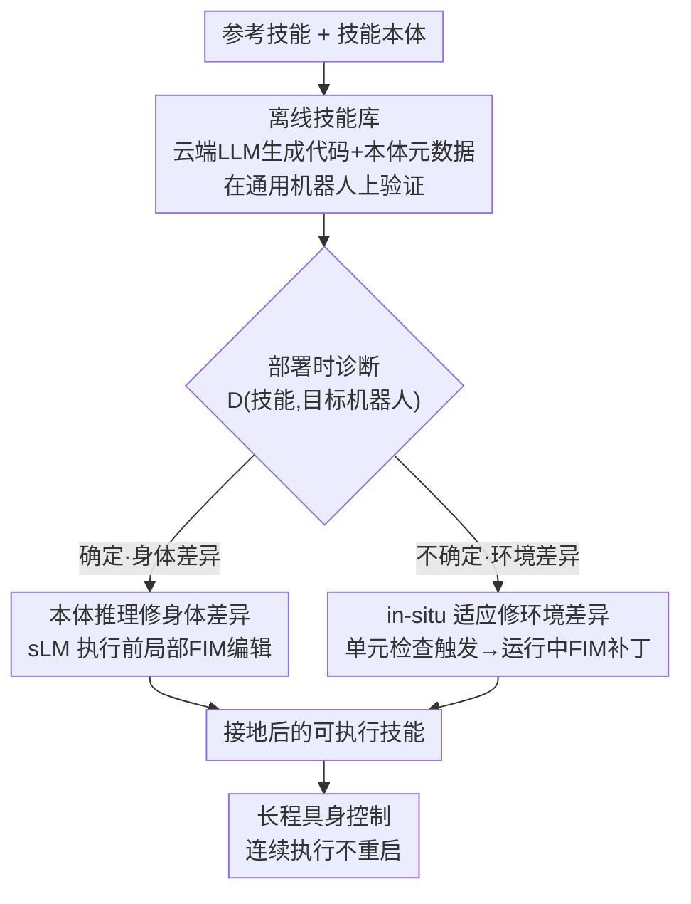

# Efficient Skill Grounding via Code Refactoring with Small Language Models

**会议**: ICML2026  
**arXiv**: [2606.07999](https://arxiv.org/abs/2606.07999)  
**代码**: 待确认  
**领域**: 机器人 / 具身智能 / 代码即策略  
**关键词**: 技能落地, 代码重构, 小语言模型, 具身控制, 本体推理

## 一句话总结
RECENT 让机器人换一具身体（不同臂、不同夹爪）或换一个动态环境时，不再用大模型从零重写技能代码，而是把技能写成"语义意图与执行绑定分离"的可执行代码，再用一个 7B 小模型只对执行绑定那几行做局部重构（FIM 填空）——部署前用本体推理修身体差异、运行中用 in-situ 补丁修环境差异，从而在端侧用小模型就拿到接近 GPT-5.2-Codex 的成功率。

## 研究背景与动机

**领域现状**：近年具身控制流行 Code-as-Policies（CaP）——让 LLM 把任务描述直接写成调用感知/运动 API 的 Python 程序来组合技能，比固定技能集更灵活、可组合。

**现有痛点**：一个技能天然耦合了"功能语义（要达成什么）"和"可执行组件（某个机器人在某环境怎么实现）"。但机器人在形态、驱动、传感上各不相同，环境的物体属性、物理约束也在变，导致技能的可执行性高度依赖部署条件，**直接跨场景复用根本行不通**。现有代码方法虽然能在推理时落地（test-time grounding），却仍然倾向于**整段重新生成**技能实现，而不是只改部署相关的那一小块。

**核心矛盾**：整段重生成在算力受限的端侧设备上代价尤其大——那里没法保证连大模型，必须用片上算力做落地；而小语言模型（sLM）推理是快，可推理能力有限，靠它从零重生成技能在动态环境里根本不靠谱。于是出现"要省钱必须用 sLM，但 sLM 扛不住重生成"的死结。

**本文目标**：让 sLM 也能高效完成技能落地，同时保证长程任务成功率、压低落地开销、维持执行连续性（不频繁中断重启）。

**切入角度**：作者的关键观察是——技能落地之所以贵，是因为把"不变的语义意图"和"部署相关的执行绑定"混在一起每次都重算。只要把这两者**显式解耦**，落地就能退化成"只改执行绑定"的轻量编辑。

**核心 idea**：用"局部代码重构"代替"整段重生成"。把技能写成结构良好的可执行代码，语义意图固化在功能逻辑里跨身体/环境复用，执行绑定隔离成可按需修改的局部组件，让 sLM 只做局部填空编辑。

## 方法详解

### 整体框架
RECENT（refactoring-centric agent framework）分三阶段。部署前，用云端大模型在一个**技能本体（skill ontology）**指导下构建**离线技能库**：每个技能是可执行代码 + 本体元数据，并在通用机器人（如 Franka Panda）上离线验证过正确性——这样后续落地就不必再推理复杂任务语义，只需解决执行绑定。部署时分两路：身体差异是部署前就**确定**的，用**本体推理**做执行前的局部代码编辑；环境差异是执行时才**不确定**的，用 **in-situ 适应**在运行中对"尚未执行的代码片段"做预判式补丁。两路落地都靠 **Fill-in-the-Middle（FIM）局部重构**实现，绝不整段重写。

形式上，任务建模为部分可观测下的 $\tau=(\mathcal{S},\mathcal{A},\mathcal{G},T)$，目标是优化 sLM 策略 $\pi_{\mathrm{sLM}}$，在最大化成功率的同时压低落地与执行开销：

$$\max_{\pi_{\mathrm{sLM}}}\mathbb{E}_{\tau\sim\mathcal{T}}\big[\mathrm{SR}(\pi_{\mathrm{sLM}},\tau)-\lambda\mathrm{C}_{\mathrm{gro}}(\pi_{\mathrm{sLM}},\tau;\mathcal{X})-\mu\mathrm{C}_{\mathrm{exe}}(\pi_{\mathrm{sLM}},\tau)\big]$$

其中 $\mathrm{C}_{\mathrm{gro}}$ 是落地开销、$\mathrm{C}_{\mathrm{exe}}$ 惩罚打断任务的执行中断。

### 关键设计

**1. 技能本体 + 离线技能库：把"语义意图"和"执行绑定"在源头就拆开**

这是整个方法能成立的地基。RECENT 用一个技能本体作为逻辑知识库，显式编码三类东西：技能的功能需求（定义、前置条件 preconditions、预期效果 effects）、机器人身体画像（可用原语 API、执行约束）、以及两者间的语义关系（requires / provides / substitutable-by）。基于本体定义一个查询算子 $\mathcal{Q}(\chi,r)=\langle\mathcal{C}(\chi),\mathcal{P}(\chi),\mathcal{E}(\chi),\mathcal{I}(\chi,r)\rangle$，对技能 $\chi$ 和机器人 $r$ 抽出"机器人条件化的技能规格"：$\mathcal{C}$ 是所需能力与约束（夹爪类型、传感模态），$\mathcal{P}$ 是执行前需满足的前置条件，$\mathcal{E}$ 是执行后的预期效果，而 $\mathcal{I}(\chi,r)$ 是从本体推出的、试图在机器人 $r$ 能力下满足 $\mathcal{C}$ 的原语 API 接口——它充当抽象意图与具身执行之间的"接地契约"。离线时对参考机器人 $r^{\mathrm{src}}$（如 Panda）查询 $\mathcal{Q}(\chi,r^{\mathrm{src}})$，用云端 LLM 生成带本体元数据的可执行实现 $\tilde{\chi}$，只有通过验证（在 $r^{\mathrm{src}}$ 上真跑、核对 $\mathcal{P}$ 和 $\mathcal{E}$）的技能才入库。这样语义在离线就被验证固定，部署时无需再碰任务语义。

**2. 本体推理修身体差异：把"确定冲突"变成几处 FIM 填空**

换机器人时（如 Panda→UR5/Sawyer，或换 Robotiq/真空夹爪），身体能力是部署前就已知、可确定的。RECENT 先做兼容性分析：若目标机器人 $r^{\mathrm{tgt}}$ 直接满足 $\mathcal{C}(\chi)$，技能无需改动直接选用；否则用诊断算子把未满足的能力需求拆成确定与不确定两类，$\mathcal{D}(\tilde{\chi},r^{\mathrm{tgt}})=\langle\Delta_{\mathrm{det}},\Delta_{\mathrm{und}}\rangle$。其中确定冲突 $\Delta_{\mathrm{det}}$ 的解法被本体推导的替换完全指定，可在执行前重构对应接口和 API 调用。每个确定冲突表示为一组填空任务 $\Delta_{\mathrm{det}}=\{(m_i,\kappa_i)\}_{i=1}^N$——$m_i$ 是待重构的代码片段、$\kappa_i$ 是本体推导出的替换提示。sLM 用 FIM 在片段前后缀的约束下生成替换 $m_i'\leftarrow\pi_{\mathrm{sLM}}(\psi^{\mathrm{pre}}(m_i;\tilde{\chi}),\psi^{\mathrm{suf}}(m_i;\tilde{\chi}),\kappa_i)$，再拼回 $\tilde{\chi}\leftarrow[\psi^{\mathrm{pre}}\oplus m_i'\oplus\psi^{\mathrm{suf}}]$。关键在于：本体级的"需求 vs 能力"比较把要改的地方精确定位出来，sLM 只需替换 API 调用、调参数或重连接口，完全不碰整体功能结构——这正是 sLM 也扛得住的原因。

**3. in-situ 适应修环境差异：对"还没跑到的代码"做预判式补丁，不打断执行**

物体属性、接触动力学、部分可观测这些环境因素在执行前无法确定（$\Delta_{\mathrm{und}}$），只能在运行中解决。RECENT 给每个不确定警告挂一个轻量的**自主单元测试**，编码某段后续代码的预期前置/效果，用执行时观测（物体状态、接触结果、传感反馈）持续评估。关键是这些检查只作用于**尚未执行**的代码段，从而能预判潜在违例而不打断当前执行。一旦某检查被违反，该不确定因素就被"确定"为立即补丁目标，转成观测条件化的填空任务 $u\xrightarrow{\,o_t\,}(m,o_t)$；再用 FIM 生成替换 $m'\leftarrow\pi_{\mathrm{sLM}}(\psi^{\mathrm{pre}}(m;\tilde{\chi}),\psi^{\mathrm{suf}}(m;\tilde{\chi}),o_t)$，只改失效片段、保留其余代码结构和正在进行的执行上下文。这套"预判 + 局部补丁"让长程技能能连续跑完而不必整段重启——这是它把执行中断（EI）压到接近零的直接原因。

### 一个完整示例
以"把技能从 Panda 迁到带真空吸盘的目标机器人、抓取一个滑溜物体"为例走一遍：① 离线库里已有用 Panda 平行夹爪验证过的 `grasp` 技能代码 + 本体元数据；② 部署诊断 $\mathcal{D}$ 发现目标机器人是真空夹爪——"夹爪闭合"这类 API 是**确定冲突**，本体给出 `substitutable-by` 替换（闭合→开启吸力），sLM 用 FIM 把那几行 `close_gripper()` 换成 `enable_suction()`，其余抓取逻辑原样保留；③ 但"吸力能否吸住该物体"是**不确定**的，挂一个单元测试监控接触/抓取成功；④ 运行中若检测到即将吸取失败（物体太滑），把"尚未执行"的接近/重试片段就地打补丁（调整接近角度或保压时间），不中断后续放置动作。最终一具新身体 + 一个滑物体，靠几处局部填空就接地完成。

## 实验关键数据

在 CoppeliaSim（运动学差异：Panda→UR5/Sawyer）和 Genesis（末端执行器差异：平行夹爪→Robotiq/真空）上构建长程操作任务，单任务最多需 54 次连续 API 调用。sLM 用 Qwen2.5-Coder-7B。五个指标：SR 成功率、GC 目标完成率（↑），GO 落地开销、EI 执行中断次数、IT 空闲时间（↓）。

### 主实验（5 次随机种子平均）

| 方法 | 运动学 SR | 运动学 GO | 运动学 EI | 末端 SR | 末端 GO | 末端 EI |
|------|----------|----------|----------|---------|---------|---------|
| CaP (sLM) | 17.00 | 102.01 | 4.72 | 21.97 | 79.31 | 3.18 |
| CaP-CodeV-R1 (蒸馏 sLM) | 20.00 | 109.38 | 4.13 | 17.88 | 99.16 | 2.77 |
| ProgPrompt | 31.50 | 86.47 | 3.28 | 33.33 | 65.34 | 4.72 |
| RepairAgent | 42.00 | 54.17 | 1.73 | 52.17 | 55.92 | 1.12 |
| **RECENT (ours, sLM)** | **73.00** | **7.85** | **0.72** | **82.50** | **2.51** | **0.69** |
| CaP-Codex (GPT-5.2-Codex, LLM) | 67.50 | 84.29 | 1.23 | 74.85 | 41.69 | 0.60 |

### 对比小结

| 对手 | SR | GO | EI | IT |
|------|----|----|----|----|
| vs CaP-CodeV-R1（同尺寸蒸馏 sLM） | +58.81 pp | −99.09 pp | ≈0.71 次/任务 | −93.29%（相对） |
| vs CaP-Codex（GPT-5.2-Codex 大模型） | −6.58 pp（仅略低） | −57.81 pp | −22.95%（均值） | −77.52%（均值） |

### 关键发现
- **用 7B sLM 打平甚至超过 GPT-5.2-Codex**：成功率只差 6.58 pp，但落地开销 GO 反而大幅更低（GO 降 57.81 pp），空闲时间和中断次数也更优——说明"局部重构"在端侧约束下比"大模型整段重生成"更划算。
- **EI 接近零是 in-situ 适应的功劳**：RECENT 平均每任务仅 0.69–0.72 次执行中断，而 CaP 系基线普遍 3–5 次；预判式补丁让长程任务能连续跑完不重启。
- **GO 数量级压缩**：相对蒸馏 sLM 基线落地开销降 99.09 pp，印证"只改执行绑定那几行"对比"整段重生成"是数量级的省。

## 亮点与洞察
- **"语义意图 vs 执行绑定"解耦 + 本体契约**：用本体把"哪几行要改"精确定位成 FIM 填空任务，是把"sLM 推理弱"这个短板绕开的巧办法——不需要它推理，只需要它填空。这个"用知识结构换推理算力"的思路可迁移到任何 sLM 端侧代码适配场景。
- **确定/不确定二分**：把部署不确定性按"执行前可否解决"拆成 $\Delta_{\mathrm{det}}$（本体推理）和 $\Delta_{\mathrm{und}}$（in-situ），分别用执行前编辑和运行中补丁处理，干净利落地对应到"身体差异 vs 环境差异"。
- **对未执行代码预判补丁**：单元测试只盯尚未执行的片段，在违例真正发生前就改好，是把执行连续性做到接近无中断的关键 trick，值得借鉴到任何需要在线修复的程序化控制。

## 局限与展望
- 强依赖**技能本体的质量与覆盖**：requires/provides/substitutable-by 关系和能力画像需要人工/LLM 构建，本体不全或替换关系缺失时，确定冲突就退化成无解或误改。
- 离线库要在参考机器人上**逐技能验证**，前期构建成本不低；面对本体里完全没有对应替换的全新身体能力，局部重构可能力有不逮。
- 评估集中在 CoppeliaSim/Genesis 仿真，真机上的传感噪声、接触动力学更恶劣，in-situ 单元测试能否可靠触发、补丁能否实时生效，仍待真机验证。
- 指标依赖任务设计（最多 54 次 API 调用的长程任务），不同基准的任务难度不可直接横比，SR 的绝对值需结合各自任务集理解。

## 相关工作与启发
- **vs Code-as-Policies（CaP 及变体）**：CaP 把指令映射成调用 API 的程序，但部署变化时整段重生成；RECENT 把技能结构化为"语义+绑定分离"的代码，落地退化为局部重构，sLM 也扛得住。
- **vs 自动程序修复（RepairAgent / Agentless）**：它们靠反应式、错误驱动的执行反馈迭代改程序（出错才修）；RECENT 是预判式——本体提前定位身体冲突、单元测试在违例前打补丁，因此中断次数低一个量级。
- **vs 参数化技能落地（重训/微调神经策略）**：参数化方法把任务语义和执行细节缠在学到的策略里，换条件就要重训；RECENT 用代码显式解耦，部署时无需任何训练，只做推理时局部编辑。

## 评分
- 新颖性: ⭐⭐⭐⭐⭐ "技能落地 = 局部代码重构"这个重构中心视角 + 本体驱动的确定/不确定二分，是对 Code-as-Policies 范式的实质性重构，思路清晰且少见。
- 实验充分度: ⭐⭐⭐⭐ 两类身体差异 × 多基线 × 五指标，对比大模型/蒸馏 sLM/程序修复都做了；但仅限两个仿真器、缺真机验证。
- 写作质量: ⭐⭐⭐⭐⭐ 问题—解耦动机—本体推理/in-situ 两路落地的逻辑链非常顺，形式化与图示到位。
- 价值: ⭐⭐⭐⭐⭐ 让端侧小模型在长程具身控制上逼近大模型，对算力受限机器人部署有直接实用价值。

<!-- RELATED:START -->

## 相关论文

- [\[ICML 2026\] BEAR: Dissecting Embodied Abilities in Multimodal Language Models through Skill-level Evaluation and Diagnosis](dissecting_embodied_abilities_in_multimodal_language_models_through_skill-level_.md)
- [\[ICLR 2026\] TwinVLA: Data-Efficient Bimanual Manipulation with Twin Single-Arm Vision-Language-Action Models](../../ICLR2026/robotics/twinvla_data-efficient_bimanual_manipulation_with_twin_single-arm_vision-languag.md)
- [\[ICML 2025\] FOUNDER: Grounding Foundation Models in World Models for Open-Ended Embodied Decision Making](../../ICML2025/robotics/founder_grounding_foundation_models_in_world_models_for_open-ended_embodied_deci.md)
- [\[ICML 2026\] Functional Cache Grafting: Robust and Rapid Code-Policy Synthesis for Embodied Agents](functional_cache_grafting_robust_and_rapid_code-policy_synthesis_for_embodied_ag.md)
- [\[ICLR 2026\] From Spatial to Actions: Grounding Vision-Language-Action Model in Spatial Foundation Priors](../../ICLR2026/robotics/from_spatial_to_actions_grounding_vision-language-action_model_in_spatial_founda.md)

<!-- RELATED:END -->
