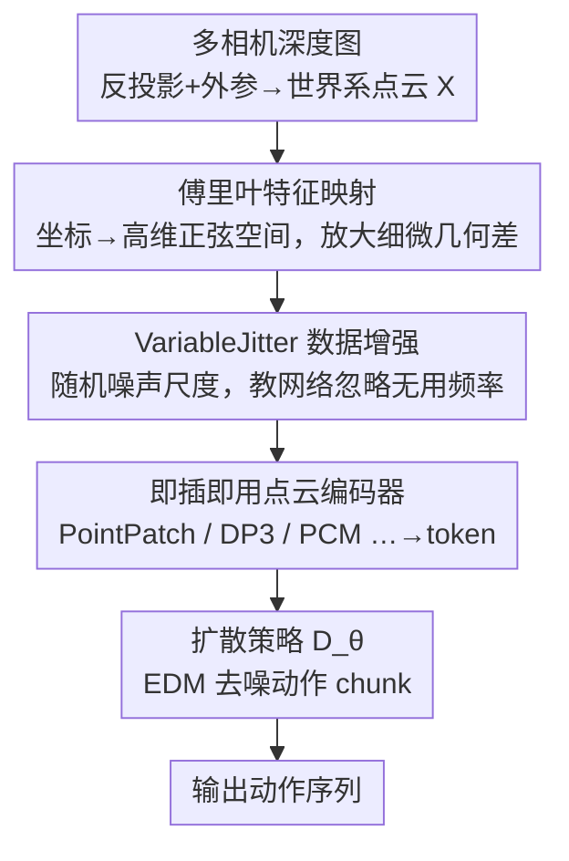

# Fourier Features Let Agents Learn High Precision Policies with Imitation Learning

**会议**: ICML 2026  
**arXiv**: [2606.12334](https://arxiv.org/abs/2606.12334)  
**代码**: https://fourier-il.github.io/fourier-il （项目页，含代码与视频）  
**领域**: 机器人 / 模仿学习  
**关键词**: 模仿学习, 点云策略, 傅里叶特征, 频谱偏差, 高精度操作

## 一句话总结
把点云的笛卡尔坐标先做一次 NeRF 式傅里叶特征映射再喂给点云编码器，就能消除点云策略网络"先学低频、学不动高频"的频谱偏差，让扩散模仿学习策略在 RoboCasa、ManiSkill3 和真机的高精度操作任务上成功率大幅提升（真机归一化分数 14.8% → 40.2%），且对各种编码器和超参都鲁棒。

## 研究背景与动机
**领域现状**：基于扩散的模仿学习（IL）已是机器人视觉运动控制的主流框架——把动作生成当作去噪过程，能自然刻画人类示范里的多模态动作分布。其中观测编码器把场景几何"翻译"成 token，策略才能据此决定下一步动作。相比语义丰富但缺乏显式 3D 几何的 RGB，点云这类 3D 模态直接表达形状、距离和空间关系，给策略更强的几何先验。

**现有痛点**：可奇怪的是，纯点云策略的表现高度依赖任务——同样的编码器，有的任务很强、有的任务很差。为弥补这一点，社区涌现出大量混合 2D/3D 架构（用预训练图像基座抽 RGB 特征再和 3D 拼起来），把方法越做越复杂，却没人去追问"纯点云到底输在哪"。

**核心矛盾**：作者把根因落到**频谱偏差（spectral bias）**上。高精度任务（如把销钉插进插孔）需要一条很"陡"的决策边界——观测只差一点点，动作却要在"插入"和"重新摆放"之间二选一，这本质上要求策略是一个**高频函数**。但 MLP / 全连接层有先学低频、后学高频（甚至学不到）的倾向，而几乎所有点云编码器都用 MLP 把笛卡尔坐标编码成隐特征，恰恰踩在这个坑里。反观图像架构底层的卷积天生偏好高频，所以反而对细节更敏感。

**本文目标**：不改架构、不堆模块，而是从输入表示层面消掉点云编码器的频谱偏差，让任意点云策略都能学到陡峭的决策边界。

**切入角度**：NeRF / 新视角合成早就用傅里叶特征映射治好了 MLP 的频谱偏差，但近年的点云机器人基座几乎没用上这一招，只在个别架构里零星出现过。作者于是系统性地把傅里叶特征映射搬进点云扩散 IL。

**核心 idea**：把笛卡尔坐标投影到高维正弦空间——原本在坐标上几乎一样的相邻点，在傅里叶空间里被放大成可区分的特征，从而绕过 MLP 的频谱偏差。

## 方法详解

### 整体框架
方法本身极其轻量：在标准的"深度图 → 点云 → 点云编码器 → 扩散策略"管线里，**只在点云坐标进编码器之前插入一层无参数的傅里叶特征映射**，其余一概不动。具体地，多相机深度图经反投影、外参变换、拼接得到世界系点云 $X$；坐标 $XYZ$ 作为图节点特征喂进消息传递式点云编码器（论文统一在 PointPatch 系列上做实验），输出 token 序列；token 连同语言目标 token、噪声等级 token 一起送入 decoder-only Transformer 形式的扩散策略 $D_\theta$，迭代去噪出下一段动作 chunk。傅里叶映射的作用，就是在坐标进编码器前先把"慢变"的笛卡尔特征换成"快变"的高频特征。

### 关键设计

**1. 傅里叶特征映射：用高频正弦嵌入放大相邻点的细微差异**

这是全文的核心，直接针对"MLP 学不动高频决策边界"的痛点。作者采用 NeRF 式、按坐标轴对齐的傅里叶映射：对一个笛卡尔点 $\mathbf{p}=(x,y,z)$ 的每个坐标分量，用 $L$ 组不同波长的正弦函数编码：

$$\gamma_k(x)=\Big[\sin\big(\tfrac{2\pi x}{\lambda_k}\big),\ \cos\big(\tfrac{2\pi x}{\lambda_k}\big)\Big]^{\mathsf T},\qquad \lambda_k=\lambda_{\max}\Big(\tfrac{\lambda_{\min}}{\lambda_{\max}}\Big)^{\frac{k-1}{L-1}},\ k=1,\dots,L$$

即波长在 $[\lambda_{\min},\lambda_{\max}]$ 间对数等间隔分布，从 $\lambda_{\max}$ 的"全局编码"一路细到 $\lambda_{\min}$ 的"体素级编码"。每个点得到 $3\times 2L$ 维特征（实验里 $L{=}16$、$\lambda_{\max}{=}4.0\,\text{m}$、$\lambda_{\min}{=}2.0\,\text{cm}$，共 96 维）。为什么有效：笛卡尔空间里相邻点坐标几乎相同，MLP 很难把它们区分开；而高频正弦把这点微小差异在高维空间里"撑开"，编码器无需对抗频谱偏差就能直接读到细粒度几何，从而表示出陡峭的策略。注意：由于正弦映射是周期函数，点云需被限制在 $[-\lambda_{\max}/2,\lambda_{\max}/2]$ 内以保证特征唯一；若做不到，可把原始坐标和傅里叶特征拼接来保证唯一性。

**2. 即插即用、与编码器无关：一招通吃整个 PointPatch 家族**

不同于此前工作只给特定新架构加傅里叶特征，作者主张这个映射**对几乎任意点云策略都有效**，于是把它系统地套到一整族编码器上验证：PointPatch（不聚合 patch token）、PointPatch-attn（注意力池化成 3 个 token 降算力）、PCM（max pooling 聚合）、DP3（全局 max pooling 成单 token）、PointTransformer（迭代注意力聚合），以及 PointPatch+RGB 多模态变体。所有实验共用同一套扩散骨干，只换观测编码器，对每个架构只做最小必要改动、按需把傅里叶映射加到绝对/相对坐标上。这种"控制变量"式设计让"提升来自傅里叶特征本身、而非某个特定架构"的结论站得住脚——实验也确实显示几乎所有架构都获益。

**3. VariableJitter 数据增强：用噪声替代逐任务调波长**

波长选择本是傅里叶特征的一大敏感点：波长太短网络会过拟合，太长又压不住频谱偏差，前人甚至观察到某些超参下训练不稳定。作者不去为每个任务精调波长，而是固定一套对数等间隔波长，再用 **VariableJitter** 数据增强让网络"学会忽略不含信息的频率"。它对每个点云从均匀分布采一个噪声尺度 $\sigma\sim\mathcal U(0,\sigma_{\max})$ 再加抖动；相比固定幅度的均匀抖动，这避免了调噪声幅度的麻烦，在"增广以防过拟合"和"不拉开训练-测试分布差距"之间取得平衡（实验里 $\sigma_{\max}$ 取 ManiSkill 5 mm、RoboCasa 2 mm、真机 1 mm）。

### 损失函数 / 训练策略
策略用 Elucidated Diffusion Models（EDM）框架做基于分数的动作扩散：网络 $D_\theta(\mathbf a+\boldsymbol\epsilon,o,\mathbf g,\sigma_t)$ 通过分数匹配训练，目标为
$$\mathcal L_{\text{SM}}=\mathbb E_{\sigma,\mathbf a,\boldsymbol\epsilon}\big[\alpha(\sigma_t)\,\|D_\theta(\mathbf a+\boldsymbol\epsilon,o,\mathbf g,\sigma_t)-\mathbf a\|_2^2\big]$$
采样时用 DDIM 形式的概率流 ODE 少步去噪。值得强调：傅里叶映射作用在**场景几何**上、而非动作上，让分数函数能成为场景几何的高频函数，但对动作仍保持平滑。

## 实验关键数据

### 主实验
在 RoboCasa（16 个强调精细几何对齐与接触的原子任务，每任务 50 条人类示范）、ManiSkill3（4 个抓取/工具任务，每任务 500 条专家示范）和 4 个真机任务上评测；每方法 5 个随机种子、报告自助法的四分位均值与 95% 置信区间。仿真里刻意不给颜色特征，以凸显傅里叶特征对纯 3D 表示的作用。

| 基准 / 任务 | 指标 | 无傅里叶 | 加傅里叶 | 提升 |
|------------|------|---------|---------|------|
| RoboCasa（16 任务平均，PointPatch） | 成功率 | 13% | 34% | +21pt |
| RoboCasa · CloseDrawer | 成功率 | 34% | 72% | +38pt |
| RoboCasa · TurnOffSinkFaucet | 成功率 | 28% | 63% | +35pt |
| RoboCasa · OpenDrawer | 成功率 | ≈0% | 12% | 从几乎学不会到能做 |
| 真机（4 任务，PointPatch+RGB） | 归一化分数 | 14.8% | 40.2% | +25pt |

ManiSkill3 上提升较小（PointPatch / PointPatch-attn 有小幅改善、其他架构不显著），作者归因于这些相对简单的任务上性能已饱和。真机上 Cup-Stacking 任务按杯径分组显示：**杯子越小、傅里叶特征收益越大**，直接支撑了"傅里叶特征帮助编码器在更小尺度上提取几何细节"的论断。

### 消融与分析

| 配置 | 平均成功率(%) | 说明 |
|------|--------------|------|
| Ours（对数傅里叶 + VariableJitter） | 41.4 ± 2.4 | 完整方法 |
| 无 FF，无 jitter | 17.5 ± 1.7 | 去掉傅里叶特征，性能腰斩 |
| 无 FF，VariableJitter | 18.5 ± 2.1 | 只加增强、不加 FF，几乎无济于事 |
| FF，无 jitter | 39.9 ± 2.3 | 只加 FF、不加增强，仍接近满配 |
| FF，random jitter | 38.9 ± 2.2 | 增强方式不敏感 |

### 关键发现
- **提升的主力是傅里叶特征本身**：去掉 FF 成功率从 41.4% 掉到 17.5%，而单独加 VariableJitter 只从 17.5% 到 18.5%——数据增强非必需，傅里叶映射才是关键。
- **点云越密、收益越大**：用更大体素降采样减少点数后，FF 的优势随之缩小，到 2k 点时差距几乎消失；而基线在重降采样下几乎不变，说明它根本没在用被抹掉的几何细节。
- **即便抹掉细几何，FF 仍有效**：对点云加 $\sigma{=}5\,\text{cm}$ 高斯抖动（基本删光精细几何）后，带 FF 策略仍达 24% vs 无 FF 的 13%，提示 FF 还能改善学习动力学，而不止是暴露高频细节。
- **超参鲁棒**：对波长数 $L$ 和最小波长 $\lambda_{\min}$ 都不敏感；对数等间隔、轴对齐频率优于随机高斯采样（RFF），而把频率设为可学习（直接学或用 SPE）并无一致收益。图傅里叶谱分析显示，FF 让网络对高频（也包括中低频）的敏感度提升数个数量级，并加快了学习。

## 亮点与洞察
- **用"频谱偏差"重新解释了一个长期现象**：为什么纯点云策略时好时坏、为什么社区要堆复杂的混合 2D/3D 架构——作者给出一个统一答案（MLP 编码器的频谱偏差），并用一个无参数映射就追平甚至超过复杂设计，这是最让人"啊哈"的地方。
- **零成本、强可迁移**：傅里叶映射无参数、不需额外正则、对超参鲁棒，可以直接塞进任何以 MLP 编码坐标的点云模型，包括互联网规模训练的多模态基座——RGB+点云的多模态编码器即便已有卷积能表示高频，加上 FF 仍获益，暗示大模型也能受益。
- **可迁移思路**：凡是用 MLP 直接吃低维连续坐标 / 慢变量的任务（位姿回归、隐式场、接触点预测），都可以套用"坐标先傅里叶再编码"来对抗频谱偏差。

## 局限与展望
- **作者承认**：周期性映射要求点云被限制在 $[-\lambda_{\max}/2,\lambda_{\max}/2]$ 内才唯一，超出范围需拼接原始坐标；最小的杯子上两种策略都解不稳，说明 FF 不是万能，极端精度仍受限。
- **自己发现的局限**：增益高度依赖"点云里有没有可提取的几何细节"——ManiSkill 这类简单/已饱和任务、或细几何被抹掉的场景里收益有限；"改善学习动力学"的机制只是假设，尚未给出严格解释。实验集中在 PointPatch 家族，对其他范式（如体素、隐式）的普适性还需更多验证。
- **改进思路**：把波长设计与任务尺度自适应耦合、或在大规模多模态机器人基座预训练阶段默认引入傅里叶坐标编码，可能进一步放大收益。

## 相关工作与启发
- **vs Adapt3R (Wilcox et al., 2025)**：同样用傅里叶特征，但 Adapt3R 只把它塞进一个特定新架构、用于提升未见视角的泛化；本文则系统性地横跨整族点云架构验证，并从频域视角解释为什么有效，主张它是通用工具而非某架构的附属。
- **vs 混合 2D/3D 架构 (Ke et al., 2025; Wilcox et al., 2025; Gervet et al., 2023)**：它们靠预训练图像基座 + 复杂几何融合来补点云的短板，本文论点是这些复杂设计流行的根因正是点云编码器的频谱偏差——用简单架构 + 非参数傅里叶映射就能让纯点云策略重新变强。
- **vs NeRF 里的傅里叶特征 (Mildenhall et al., 2021; Tancik et al., 2020)**：思想同源（用高频正弦治 MLP 频谱偏差），但首次把它系统迁移到扩散模仿学习的点云策略，并配 VariableJitter 免去逐任务调波长。

## 评分
- 新颖性: ⭐⭐⭐⭐ 不是全新技术，但"用频谱偏差统一解释点云策略表现 + 一个无参数映射通吃"的视角很犀利。
- 实验充分度: ⭐⭐⭐⭐⭐ 横跨 3 个基准、5 类编码器、真机，含频谱分析与多组参数研究，结论扎实。
- 写作质量: ⭐⭐⭐⭐ 动机推导清晰、图表充分，个别公式与表述略显紧凑。
- 价值: ⭐⭐⭐⭐⭐ 近乎零成本、强可迁移，对点云机器人学习社区有直接实用价值。

<!-- RELATED:START -->

## 相关论文

- [\[ECCV 2024\] Learning Cross-Hand Policies of High-DOF Reaching and Grasping](../../ECCV2024/robotics/learning_cross-hand_policies_of_high-dof_reaching_and_grasping.md)
- [\[CVPR 2026\] RealAppliance: Let High-fidelity Appliance Assets Controllable and Workable as Aligned Real Manuals](../../CVPR2026/robotics/realappiance_let_high-fidelity_appliance_assets_controllable_and_workable_as_ali.md)
- [\[CVPR 2026\] NIL: No-data Imitation Learning](../../CVPR2026/robotics/nil_no-data_imitation_learning.md)
- [\[ICML 2026\] Lagrangian Perturbation Diffusion Steering: Latent Reinforcement Learning for Generative Policies](lagrangian_perturbation_diffusion_steering_latent_reinforcement_learning_for_gen.md)
- [\[NeurIPS 2025\] LabUtopia: High-Fidelity Simulation and Hierarchical Benchmark for Scientific Embodied Agents](../../NeurIPS2025/robotics/labutopia_high-fidelity_simulation_and_hierarchical_benchmark_for_scientific_emb.md)

<!-- RELATED:END -->
