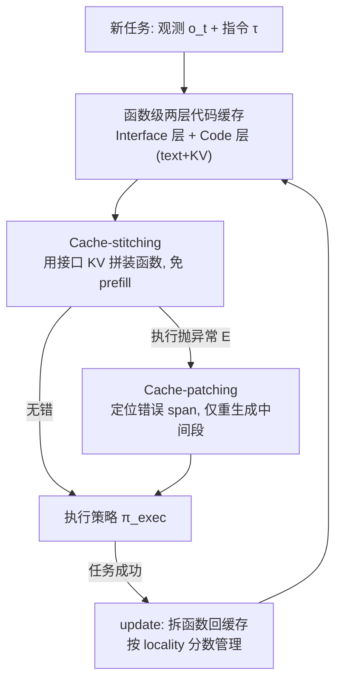

# Functional Cache Grafting: Robust and Rapid Code-Policy Synthesis for Embodied Agents

**会议**: ICML 2026  
**arXiv**: [2606.13097](https://arxiv.org/abs/2606.13097)  
**代码**: 待确认  
**领域**: 机器人/具身智能 / Code-as-Policies / KV缓存  
**关键词**: 具身 agent、Code-as-Policies、函数级 KV 缓存、cache-stitching、cache-patching

## 一句话总结
针对"Code-as-Policies 给每条新指令都从头生成代码、既慢（重复 prefill 长 prompt）又脆（API 不匹配、缺安全检查）"的两大病，FCGraft 维护一个"函数级已验证代码骨架 + 对应 KV 缓存"的库，用 cache-stitching 把缓存函数的 KV 拼成新策略、用 cache-patching 只局部重生成出错片段，在 ALFRED/RLBench 等开放域任务上比 RAGCache 成功率高 18.31%、合成延迟降 2.3×。

## 研究背景与动机
**领域现状**：会写代码的大模型（CodeLLM）催生了 Code-as-Policies（CaP）范式——把自然语言目标 + 环境约束翻译成可执行控制程序，调用预定义 API 驱动机器人。它借 CodeLLM 的泛化能力，补足了任务专用策略学习的不足，比直接学策略更灵活。

**现有痛点**：CaP 在真实部署里有两个根本短板。①**解码延迟**：CaP 的 prompt 往往含冗长规格说明和示例，每来一条新指令都要对上千 token 重复 prefill，时间敏感场景（比如燃气泄漏要立刻处置）响应不过来。②**鲁棒性差**：完全生成式解码经常产出 API 不匹配、缺安全护栏、控制逻辑不稳的代码，直接导致任务失败。

**核心矛盾**：要"鲁棒"就得复用已验证的控制结构，要"快"就得避免重复计算——而现有手段两头都没接住：基于记忆的具身 agent 大多停在**文本层**复用，计算上省不了多少；现有 KV 缓存方法只支持**文档级**前缀复用、**不支持函数级适配**，撑不起开放域里不断变化、需要局部改写的需求。

**本文目标**：拆成两个子问题——如何在**函数粒度**上复用 KV 缓存以消除冗余 prefill；以及如何在复用的同时**只局部改写**出错部分，既保住已验证结构的鲁棒性、又把解码量压到最小。

**切入角度**：作者借鉴机器人"技能复用"思想（预定义技能=动作序列，组合 + 适配以满足环境约束），但把复用单位从"文本技能"换成"函数级 KV 状态"，从而同时拿到效率与可靠性。

**核心 idea**：把原生 KV 缓存机制改造成函数级两层缓存，新任务来时**检索相关函数、嫁接（graft）其 KV 缓存**——先 stitching 把缓存函数拼成复合策略（消除结构性错误、免 prefill），再 patching 只对必要片段做最小解码适配。

## 方法详解

### 整体框架
FCGraft 把"从头生成代码"换成"嫁接已验证的函数缓存"。它建立在两个核心机制上：① **函数级 KV 缓存**——把过往成功的代码策略拆成可调用函数，存进一个两层代码缓存 $\mathcal{H}=(\mathcal{I},\mathcal{C})$，每层同时保留文本与 KV 表征；② **嫁接式代码策略合成**——cache-stitching 用接口层 KV 把函数拼成策略、cache-patching 用代码层 KV 局部修错。二者不是独立技巧，而是一条统一管线的两个互补阶段：stitching 负责把"不变区"和"需适配点"分离开并消除内部错误，patching 只去解决剩下的局部表面错误。任务执行循环里，stitch 先合成并执行，运行时抛异常就触发 patch 修正再续跑，成功后 update 把新函数拆回缓存——形成"复用越多→拼接越好→修补越省"的正反馈。

### 关键设计

**1. 函数级两层代码缓存 + locality 评分管理：让"复用单位"从文本降到函数 KV**

针对"现有缓存只在文档/文本层复用、省不了多少计算也不支持函数级改写"的痛点，FCGraft 把原生 KV 缓存重构成两层、按函数标识 $f_k$ 索引：$\mathcal{H}=(\mathcal{I},\mathcal{C})$，其中接口层 $\mathcal{I}=\{(f_k,i_k^{\text{text}},i_k^{\text{KV}})\}$ 只存函数签名（名 + 类型化参数）及其 KV，用于轻量的嫁接式生成；代码层 $\mathcal{C}=\{(f_k,c_k^{\text{text}},c_k^{\text{KV}})\}$ 存完整且已验证的实现及 KV。关键在于**接口 KV 可被重新注入 CodeLLM 而无需重算 cross-attention**，把每个函数接口当独立模块、不绑定固定前缀位置，既减冗余注意力、又缓解多函数共处时的 attention sink；而代码层实现**不直接注入生成**（避免对复杂实现做冗余推理），只在执行时链接进最终程序、并在 patching 时作为 prefix 上下文。为在有限 GPU 显存下管理缓存，每个函数赋一个 locality 分数

$$\ell(f_k)=(1-\ell_{\text{curr}}(f_k))\cdot\big(\alpha\,\ell_{\text{freq}}(f_k)+\beta\sum\nolimits_j \ell_{\text{asso}}(f_j\mid f_k)+\gamma\,\ell_{\text{sema}}(f_k)\big)+\ell_{\text{curr}}(f_k)$$

其中 $\ell_{\text{curr}}\in\{0,1\}$ 强制保留刚用过的函数，其余项综合使用频率、与共调函数的条件关联、以及基于困惑度的语义相关（$\alpha+\beta+\gamma=1$），高分留 GPU、低分（尤其 $c_k^{\text{KV}}$）下放 DRAM，从而在紧凑显存里维持一个既覆盖近期热点、又保持语义多样的自适应缓存。

**2. Cache-stitching：用接口 KV 直接拼函数，消除"内部错误"并省掉 prefill**

针对"从头生成易产生不可修复的结构性错误、且重复 prefill 浪费算力"的痛点，stitching 把缓存函数段直接连成新策略。作者把代码错误分成两类：**内部错误**（API 序列错、控制逻辑错，藏在函数体里、改不动）和**表面错误**（参数不匹配、变量取值错，不动函数体即可修）。核心洞察是：**只要复用已验证 KV 缓存来拼装，合成策略里就只会剩下表面级错误、不会出现内部错误**，从而为下游 patching 创造可修的前提。给定观测 $o_t$、指令 $\tau$ 和接口 KV 集合 $\mathcal{I}_{\text{KV}}$，CodeLLM 生成 $\pi_{\text{code}}\sim\pi_\theta(\cdot\mid o_t,\tau,\mathcal{I}_{\text{KV}})$；再把 $\pi_{\text{code}}$ 里实际调用的函数从代码层 $\mathcal{C}$ 取出实现链接进来，得到可执行程序 $\pi_{\text{exec}}=\pi_{\text{code}}\,\|\,\{c_k^{\text{text}}\mid i_k^{\text{text}}\in\mathrm{Call}(\pi_{\text{code}})\}$，同时保留其 KV 供 patching 复用。因为接口 KV 不必重算，stitching 一举消除冗余 prefill，又靠复用验证过的 API 调用模式与控制流模板保住鲁棒性。

**3. Cache-patching：只定位并重生成出错片段，复用 prefix KV 把解码压到最小**

针对"运行时出错若全量重生成，既慢又可能引入新错"的痛点，patching 只改局部。它在执行抛出异常 $E$（API 不匹配、运行时错）时触发，把 $\pi_{\text{exec}}$ 切成三段 $[x_{\text{pre}}^{\text{text}}\|x_{\text{err}}^{\text{text}}\|x_{\text{suf}}^{\text{text}}]$——保留的前缀、出错跨度、保留的后缀。它**复用前缀的 KV 状态 $x_{\text{pre}}^{\text{KV}}$、只生成中间段** $x_{\text{mid}}^{\text{text}}=\pi_\theta(x_{\text{pre}}^{\text{KV}},\mathrm{CoT}(\cdot,c_k^{\text{KV}},E))$，并用一段一次性的 CoT 推理定位 $E$ 的根因（执行前丢弃），再拼回后缀得 $\pi'_{\text{exec}}=[x_{\text{pre}}^{\text{text}}\|x_{\text{mid}}^{\text{text}}\|x_{\text{suf}}^{\text{text}}]$。由于跳过了前缀的 prefill、解码只聚焦出错跨度，patching 的耗时远低于全量重生成。与 stitching 的互依关系是：stitching 把不变区与适配点分离、并保证残留错误都是可修的表面错误，patching 才能高效地只修这些点——例如把不一致的对象-区域参数 `drawer_high` 换成 `drawer_top`。

### 损失函数 / 训练策略
本文不训练新模型，而把目标写成理想化的形式化优化（非直接优化的训练损失）：$\pi_\theta^*=\arg\max_{\pi_\theta}\mathbb{E}_{d\sim\mathcal{D}}\mathbb{E}_{\pi_{\text{code}}\sim\pi_\theta}\big[\mathrm{SR}(\mathrm{Exec}(\pi_{\text{code}}),g_d)-\eta\,\mathrm{PSL}(\pi_\theta)+\mu\,\mathrm{CSIM}(\pi_\theta)\big]$，即在最大化任务成功率 $\mathrm{SR}$ 的同时最小化合成延迟 $\mathrm{PSL}$，并用代码相似度 $\mathrm{CSIM}$ 作正则鼓励跨任务行为一致。CodeLLM 默认用 Qwen2.5-Coder-14B，跑在 RTX 4090 上，全程无需微调。

## 实验关键数据

### 主实验
在 ALFRED、RLBench（及附录 TEACh）三个具身 benchmark 上，每个构造 3 种递增动态的开放域场景（Open-Composition / Open-Perturbation / Open-Evolution），对比 9 个基线（CaP、SCoT、HELPER、LRLL、PromptBook 等记忆/提示类，及 CAG、RAGCache、PromptCache、EPIC 等 KV 缓存类），三种子平均；为公平起见所有基线获得同样的先验信息（提示/记忆/KV 三种形式）。

| Benchmark / 场景 | 方法 | SR↑ | PSL↓(s) | Rank↓ |
|------------------|------|-----|---------|-------|
| ALFRED · Open-Composition | FCGraft | **61.58** | **5.82** | 1 |
| ALFRED · Open-Composition | LRLL(次优) | 56.28 | 16.02 | 2 |
| ALFRED · Open-Composition | RAGCache | 39.29 | 13.48 | 7 |
| ALFRED · Open-Evolution | FCGraft | **55.89** | **6.29** | 1 |
| RLBench · Open-Composition | FCGraft | **45.91** | **3.24** | 1 |
| RLBench · Open-Composition | CAG(次优) | 26.37 | 8.53 | 2 |

平均相对 RAGCache：SR 高 **18.31%**、PSL 降 **2.3×**；相对 ALFRED 上次优的 LRLL，SR 高 4.04%、PSL 降 2.67×；RLBench 上相对 CAG，SR 高 16.21%、PSL 降 2.25×。作者强调 SR 提升不是"延迟降低的副产品"，而是复用已验证接口/实现把生成偏向可复用结构、避免了不兼容组合、缺条件检查、分支不一致等失败。

### 真机 + 行为一致性分析
用 7-DoF Franka Emika Research 3 测真实操作（办公桌整理、烹饪工作台准备，后者含燃气软管中途脱落需即时纠错），并分析持续任务阶段的行为/代码一致性。

| 设置 | 指标 | FCGraft | 对照 | 说明 |
|------|------|---------|------|------|
| 真机·办公桌整理 | SR↑ | **77.78** | CaP 33.33 | 比 CaP 高 37.04 pts |
| 真机·烹饪工作台 | SR↑ / PSL↓ | **81.48 / 2.85** | RAGCache 37.04 / 9.63 | PSL 降约 2.88× |
| RLBench 持续阶段(Final) | SR↑ | **46.00** | CaP 37.33 / RAGCache 36.44 | 随任务积累 SR 不降反升 |
| RLBench 持续阶段(Initial) | FWT | **2.08** | CaP/RAGCache 0.00 | 正向前向迁移 |

### 关键发现
- **正反馈循环是性能持续走高的来源**：cache-stitching 复用验证函数产更可靠代码、cache-patching 高效纠错，二者一起提高了函数在缓存里的留存率；留存越多→拼接质量越好→未来修补越简单，于是 RLBench 上 SR 从 Initial 44.44 升到 Final 46.00。
- **两机制各司其职、缺一不可**：stitching 主攻结构性错误 + 省 prefill，patching 主攻局部错误 + 省解码；Open-Perturbation 下物体状态突变靠 patching 处理 API 级异常，Open-Evolution 下观测/目标同时变则靠 stitching 换更合适的函数。
- **延迟优势在循环结构任务上更突出**：RLBench 含循环结构、代码可紧凑表示，各方法 PSL 普遍更低，更能凸显 patching 的细粒度高效适配（FCGraft PSL 低至 3.24s）。
- **真机时间压力场景验证实用性**：燃气软管脱落时需在时间压力下即时合成纠错代码，FCGraft 靠 stitching 拼装 + patching 把 `drawer_high` 一类不一致参数改成 `drawer_top`，9 次试验表现可靠。

## 亮点与洞察
- **"把复用单位降到函数级 KV"是核心洞察**：现有 KV 缓存停在文档/前缀级，本文证明在函数粒度上嫁接 KV 才能既省 prefill 又支持局部改写，恰好对上开放域"结构稳定、细节多变"的特性。
- **错误二分（内部 vs 表面）+ 两阶段分工非常干净**：先用 stitching 保证只剩可修的表面错误、再用 patching 只修这些点，避免了"全量重生成又慢又可能引入新错"的死循环——这个"先分离不变区、再局部适配"的思路可迁移到任何"检索-组合-修补"式代码合成。
- **正反馈循环让系统越用越强**：成功函数回流缓存、留存率上升带动拼接与修补双双变好，是少见的"在线自增强"具身代码合成设计。
- **两层缓存的取舍很巧**：接口层注入生成（轻量）、代码层只在执行/patch 时用（避免对复杂实现做冗余推理），既防 attention sink 又省算力。

## 局限与展望
- **依赖"已验证函数库"的冷启动**：缓存初期为空时优势有限，需先在简单任务（如 RLBench）上积累函数再迁移；全新领域、无可复用结构时收益会打折。
- **显存与缓存管理压力**：函数级 KV 缓存随任务增长，靠 locality 分数下放 DRAM 缓解，但极大规模、长生命周期部署下的缓存膨胀与命中率仍需更系统的淘汰策略。
- **patching 的 CoT 定位依赖异常信号**：cache-patching 由执行抛异常触发并靠 CoT 找根因，对"不报异常但语义错"（silent failure）的错误覆盖有限。
- **改进思路**：可探索跨机器人/跨本体的函数缓存迁移、把 locality 评分换成可学习的检索器、以及对 silent failure 引入主动验证而非只靠运行时异常触发 patch。

## 相关工作与启发
- **vs CaP（Code-as-Policies）**：CaP 每条指令从头全量生成，慢且易出内部错误；FCGraft 复用验证函数 + 局部修补，ALFRED 上 SR 高 4 pts、PSL 降 2.67×。
- **vs 记忆类（HELPER / LRLL / PromptBook）**：它们在**文本层**检索编程产物作为额外输入，计算省得有限；FCGraft 在**函数级 KV** 层复用，既省 prefill 又保结构鲁棒。
- **vs KV 缓存类（RAGCache / CAG / PromptCache / EPIC）**：这些多在文档/前缀级复用注意力状态、不支持函数级适配；FCGraft 把模块化 KV 复用 + fill-in-the-middle 式中段重写引入具身控制，相对 RAGCache SR 高 18.31%、PSL 降 2.3×。
- **启发**：把"已验证骨架 + KV 缓存"的嫁接思路用于任何"长 prompt、需局部改写、对延迟敏感"的代码/策略生成场景（不止机器人），都有望同时拿到效率与鲁棒。

## 评分
- 新颖性: ⭐⭐⭐⭐⭐ 首次把 KV 缓存复用降到函数级并提出 stitching+patching 两阶段嫁接，思路新
- 实验充分度: ⭐⭐⭐⭐⭐ 3 仿真 benchmark×3 场景 + 真机 + 9 基线 + 一致性/迁移分析，三种子平均，全面
- 写作质量: ⭐⭐⭐⭐ 机制与公式讲得清楚，错误二分与两阶段分工的动机交代到位
- 价值: ⭐⭐⭐⭐⭐ 直击 CaP 部署的延迟与鲁棒两大痛点，对具身代码合成有很强实用价值

<!-- RELATED:START -->

## 相关论文

- [\[ICML 2026\] EMBGuard: Constructing Hazard-Aware Guardrails for Safe Planning in Embodied Agents](embguard_constructing_hazard-aware_guardrails_for_safe_planning_in_embodied_agen.md)
- [\[CVPR 2026\] AGENTSAFE: Benchmarking the Safety of Embodied Agents on Hazardous Instructions](../../CVPR2026/robotics/agentsafe_benchmarking_the_safety_of_embodied_agents_on_hazardous_instructions.md)
- [\[NeurIPS 2025\] Opinion: Towards Unified Expressive Policy Optimization for Robust Robot Learning](../../NeurIPS2025/robotics/opinion_towards_unified_expressive_policy_optimization_for_robust_robot_learning.md)
- [\[NeurIPS 2025\] Towards Reliable Code-as-Policies: A Neuro-Symbolic Framework for Embodied Task Planning](../../NeurIPS2025/robotics/towards_reliable_code-as-policies_a_neuro-symbolic_framework_for_embodied_task_p.md)
- [\[ICML 2026\] Efficient Skill Grounding via Code Refactoring with Small Language Models](efficient_skill_grounding_via_code_refactoring_with_small_language_models.md)

<!-- RELATED:END -->
