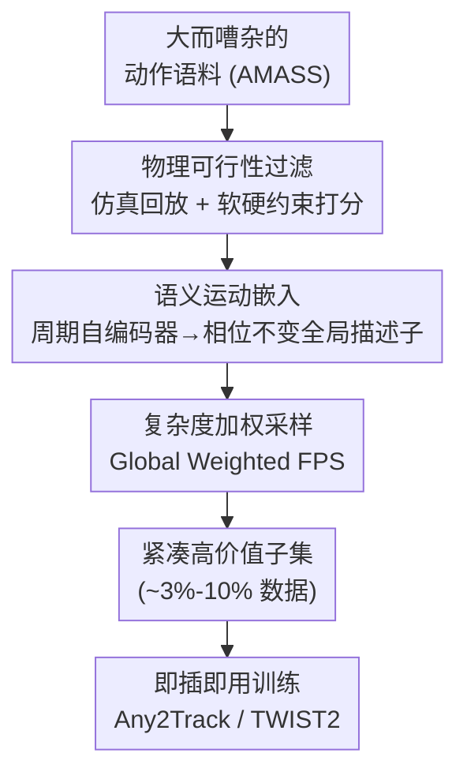

# LIMMT: Less is More for Motion Tracking

**会议**: ICML2026  
**arXiv**: [2606.06953](https://arxiv.org/abs/2606.06953)  
**代码**: https://giraffeguan.github.io/limmt/  
**领域**: 机器人 / 人形机器人 / 数据中心  
**关键词**: 人形机器人, 运动跟踪, 数据筛选, 物理可行性, Less-is-More

## 一句话总结
本文从「数据中心」视角研究基于物理仿真的人形机器人运动跟踪，提出三阶段筛选框架 GQS（物理可行性过滤 → 语义运动嵌入 → 复杂度加权子集采样），证明**只用不到 3% 的 AMASS 数据训练，跟踪性能反而超过用全量数据**，且这套筛选可即插即用地迁移到 Any2Track、TWIST2 等多种跟踪器上。

## 研究背景与动机

**领域现状**：运动跟踪是人形机器人学习的核心环节——它把一个参考动作库变成物理上可落地的行为（步态、运动技能、组合控制器）。随着动捕语料从工作室级数据集（LaFAN1、AMASS）扩张到从视频重建的互联网级数据，业界很容易相信人形跟踪会复刻 CV/NLP 里「数据越多、泛化越好」的轨迹。

**现有痛点**：但基于物理的 imitation-RL 并没有从无差别的数据扩张中持续受益。当前 SOTA 跟踪器仍在用小而精的 LaFAN1/AMASS。大规模 in-the-wild 语料往往带入系统性伪影——时序抖动、脚部滑动、地面穿透、不合理接触等违反刚体物理的现象——会污染模仿信号，导致脆弱解或 reward hacking；同时在海量动作库上训练**代价高昂**（参考采样、课程设计、长时优化成本随数据量放大）。

**核心矛盾**：「更多动作数据」既更嘈杂又更难用。物理 imitation-RL 的关键在于**数据质量塑造了训练早期的优化轨迹**：高质量动作目标给出一致、物理上有意义的梯度，把策略早早引向稳定解；低质量或冗余动作则注入有偏目标和不稳定梯度，浪费算力并拖垮最终性能——一旦早期收敛到错误的「吸引子」，后期很难挽回。

**本文目标**：跳出「先删坏片段」的朴素清洗，系统刻画「什么是对跟踪有价值的动作数据」，并据此构建一个紧凑、高价值的训练库。

**切入角度**：作者主张「质量」不止于「没有坏片段」，而应沿三个互补维度刻画——① 物理可行性（刚体人形能否无严重伪影地复现）；② 动作多样性（覆盖不同行为而非重复高频模式）；③ 动作复杂度（提供富信息的动态监督而非近静止片段）。这恰好解释了朴素扩张为何失效：大语料里有很多片段，但没有很多**有用的**片段。

**核心 idea**：用 GQS（General Quality Selection）这套层级化流水线，把可行性、多样性、复杂度**按正确的先后顺序**落地——先过滤、再嵌入度量多样性、最后复杂度加权采样，从一个大而嘈杂的动作语料里榨出一个小而高价值的训练子集。

## 方法详解

### 整体框架
GQS 接收一个大而嘈杂的动作捕获语料（如 AMASS），输出一个紧凑的高价值训练子集，可直接喂给现成跟踪器训练。它由三阶段串行组成，且**顺序本身是设计的一部分**（Stage 顺序错了会失败）：Stage I 在刚体仿真器里逐条回放动作、按物理可行性打分并过滤掉不可行片段；Stage II 在剩余动作上学一个连续语义流形（用周期自编码器），让「距离」反映行为层面的差异而非表面欧氏姿态差；Stage III 在该嵌入空间上做复杂度加权的最远点采样（Global Weighted FPS），选出既覆盖广、又偏向动态丰富动作的子集。

作者强调三者的**先后次序不可调换**：过滤必须最先（否则物理上破损的动作会主导表示空间、并因「错误的原因」赢得多样性选择）；嵌入学习必须在可行数据上进行才能定义有意义的语义流形；复杂度加权必须最后（否则高能量伪影会被过度选中）。

### 关键设计

**1. 物理可行性过滤：用仿真器把「物理上不可能」的动作挡在门外**

针对「in-the-wild 语料充满抖动、穿透、脚滑等违反刚体物理伪影」的痛点，Stage I 在针对目标机器人（Unitree G1）的刚体仿真器里逐条回放，做两段评估。先是**硬约束**二值检查：时长 < 0.5 秒（上下文不足）或关节速度违规超过 0.05 rad/s 安全裕度（机械上不可能）的轨迹直接丢弃。对通过的轨迹再算**软评分**

$$S_{phy}(\mathcal{T})=100-\sum_i w_i\,\mathcal{L}_i$$

其中六个惩罚项覆盖不同违规模式：Floating（对脚-地距离做时序卷积窗口、度量持续腾空帧占比）、Ground Penetration（网格穿入地面的平均深度）、Velocity Violation（关节速度超硬件上限的均值）、Foot Sliding（脚高 < 5cm 时的水平脚速）、Self-Collision、Jerk（关节加速度变化率）。权重 $w_i$ 由数据驱动的敏感度分析标定，最终保留 $S_{phy}\ge 90$ 的轨迹。这一步是必需的：不可行动作若不先剔除，会占据并扭曲嵌入流形——它们恰恰是后续采样最容易当成「离群点」选中的。

**2. 语义运动嵌入（HME / 周期自编码器）：让「距离」反映行为相似而非姿态相似**

痛点是标准自编码器难以区分「动态相似但时序错位」的动作，欧氏姿态差也无法刻画步态、技能这类行为层面的相似。本文用**周期自编码器（PAE）**学一个连续运动流形：编码器把含关节位置/速度、根速度的时间窗 $X\in\mathbb{R}^{T\times D}$（$T=4.0s$）映射到频域参数——幅度 $A$、频率 $F$、相移 $\phi$、偏置 $b$（各为 $\mathbb{R}^k$，$k=8$），再用正弦先验解析重建潜轨迹

$$z_i(t)=A_i\sin\!\big(2\pi(F_i\cdot t+\phi_i)\big)+b_i$$

与 VAE 不同，PAE 是纯确定性映射、只用重建损失优化，从而忠实保留动作的物理尺度与时间频率，不被正则约束扭曲，使流形中的欧氏距离直接反映运动强度与节奏差异。为得到变长序列的**时不变全局描述子**，作者观察到动态特征主要由强度 $A$ 与节奏 $F$ 决定（$\phi,b$ 只表时序对齐与姿态偏置），故每个窗取局部描述子 $h_w=[A_w,F_w]\in\mathbb{R}^{2k}$，再时序平均得相位不变的全局嵌入 $\mathbf{z}_{global}=\frac{1}{N}\sum_w[A_w,F_w]$。

**3. 复杂度加权 Global Weighted FPS：覆盖优先、复杂度次之地选子集**

痛点是纯几何覆盖（标准 FPS）会忽略「越复杂的动作越难跟、监督信号越丰富」这一价值差异，而纯按复杂度选又会在行为空间留下大片空洞。本文先定义动作**复杂度**为动能与加速度的加权组合 $C(x)=\frac{1}{T}\sum_t\big(\lVert\dot q_t\rVert_2^2+\lambda\lVert\ddot q_t\rVert_2^2\big)$，再 rank 归一化为 $\hat C(x)\in[0,1]$。采样从复杂度最高的锚点起步（让子集扎根于最具挑战的示范），随后每步选最大化混合得分的候选

$$\text{Score}(u)=\alpha\cdot\hat D(u,S)+(1-\alpha)\cdot\hat C(u)$$

其中 $\hat D(u,S)$ 是到已选集最近邻的归一化距离。这保留了标准 FPS 的强全局探索能力（多样性主导），仅在候选几何上等距时引入物理感知偏置、偏向动态更丰富的动作；$\alpha$ 是一个域自适应旋钮——嘈杂数据偏纯多样性、精炼数据或跨域时偏复杂度挖掘。

### 损失函数 / 训练策略
PAE 仅用重建损失训练（无概率先验/正则）。下游策略用 PPO 在 $2\times10^9$ 环境步上训练，硬件为 8×NVIDIA RTX 4090，每个设定跑 10 个随机种子取均值与标准差；仿真平台 Any2Track 用 MJX、TWIST2 用 Isaac Lab，机器人为 Unitree G1。

## 实验关键数据

### 主实验
在 AMASS（约 14K 训练片段、140 条测试轨迹）上做「通用运动跟踪」任务，指标为成功率（SR）、MPJPE（rad）、MPKPE（mm）。

| 方法 | 物理过滤 | 数据比例 | 成功率 ↑ | MPJPE (rad) ↓ |
|------|----------|----------|----------|----------------|
| Any2Track（原始） | × | 100% | 0.942 | 0.114 |
| Any2Track + Random | ✓ | 随机 3% | 0.838 | 0.159 |
| Any2Track + GQS | ✓ | 10% | **0.959** | **0.107** |
| Any2Track + GQS | ✓ | 3% | 0.956 | 0.108 |
| TWIST2（原始） | × | 100% | 0.825 | 0.099 |
| TWIST2 + Random | ✓ | 随机 3% | 0.649 | 0.177 |
| TWIST2 + GQS | ✓ | 10% | **0.868** | **0.084** |
| TWIST2 + GQS | ✓ | 3% | 0.861 | 0.092 |

### 消融实验（3% 数据下的组件分析）

| Physics | Sparsity | Complexity | 成功率 | MPJPE (rad) |
|---------|----------|------------|--------|-------------|
| × | ✓ | ✓ | 0.911 | 0.1213 |
| ✓ | × | ✓ | 0.934 | 0.1197 |
| ✓ | ✓ | × | 0.946 | 0.1079 |
| ✓ | ✓ | ✓（完整 GQS） | **0.956** | **0.1079** |

### 关键发现
- **随机降采样会崩，智能筛选才有效**：随机 3% 让 Any2Track 跌到 83.8% SR、TWIST2 崩到 64.9% SR；而 GQS 3% 反超全量基线（95.6% / 86.1%），说明「less is more」不是「用更少数据」本身，而是「用对的数据」。
- **去物理过滤掉点最多**：3% 设定下去掉 Stage I，SR 从 95% 跌到 91.1%、MPJPE 恶化到 0.121——因为无过滤时嵌入采样天然偏好离群点，而那些离群点往往是物理破损伪影，会占掉低数据预算下宝贵的核心集名额。纯按复杂度选（去多样性）只有 93.4%，说明覆盖语义流形是首要前提。
- **物理分数与价值非单调**：把动作按物理分排序分 10 段单独训练，最高分段只有 94.6% SR（完美物理分往往对应保守/静态动作），性能峰值出现在 60-70% 段（96.3%），最低段跌到 92.2%——证明物理过滤只能识别「有毒数据」，无法对可行动作的价值排序，从而验证了三阶段分工的必要性。
- **改善的是优化轨迹而非仅终点**：GQS 10% 在训练早期（< 0.5B 步）就拿到更高 reward、更低误差，且优势贯穿全程，说明干净数据提供了更干净的梯度、把策略早早导向更好的解。
- **跨域更稳**：在 PHUMA 上 GQS 仅用 30% 数据就超过全量精度天花板；零样本迁移到 AMASS 时 10% 子集（92.8% SR）反超全量（91.0%），复杂度偏置起到了类似 hard-negative mining 的作用。

## 亮点与洞察
- **首个面向物理人形跟踪的数据中心研究**：把「质量 vs 数量」的争论从模糊直觉做成可操作的三维度（可行性/多样性/复杂度）+ 三阶段流水线，结论反直觉且强（3% 反超 100%）。
- **顺序即设计**：先过滤、再嵌入、后加权这个层级不可调换的论证很扎实——它直接解释了「为什么不能一步到位地按某个综合分选数据」。
- **PAE 全局描述子的取舍很聪明**：只取幅度 $A$ 与频率 $F$ 拼成相位不变描述子，把「动态签名」与「时序对齐/姿态偏置」解耦，使流形距离真正可比。
- **即插即用可迁移**：同一套 GQS 在 Any2Track 与 TWIST2 上都涨点，说明它改善的是训练信号本身、而非利用某个算法的特性——这种数据侧增益最值得复用。

## 局限与展望
- **依赖针对特定机器人的仿真过滤**：$S_{phy}$ 的硬阈值（0.5s、0.05 rad/s、5cm）与权重都是为 Unitree G1 标定的，换机器人形态需重新校准。
- **复杂度只用动能/加速度刻画**：可能与「难跟踪」不完全等价（高能量未必等于高价值），$\alpha$ 与 $\lambda$ 需按域调，缺乏自动选取机制。
- **评测仍偏仿真**：主结果在 MJX/Isaac Lab 仿真平台，真机 sim-to-real 的收益与失败模式未充分展开。
- 展望：把复杂度度量与策略学习信号更紧密耦合（如用 RL 反馈在线重估动作价值），以及把 GQS 推广到更多形态与真机部署。

## 相关工作与启发
- **vs 朴素数据扩张（"more data better"）**：CV/NLP 的扩张范式在物理 imitation-RL 上失效；本文指出决定因素是可行性/多样性/复杂度而非规模，挑战了盲目扩张假设。
- **vs PHC / 纯物理过滤基线**：PHC 等只保证物理一致；本文证明物理可行只是质量的一部分（Stage I 仅作二值门），多样性与复杂度（Stage II/III）才能在可行动作里挑出高价值子集——在 PHUMA 上 GQS 仍能在已物理精炼的数据上进一步降 MPJPE。
- **vs 标准 FPS / 随机采样**：随机采样在低比例下灾难性崩溃，标准 FPS（去复杂度加权）有 94.6% 已不错，但复杂度加权把它推到 95.6%，证明几何覆盖与动态丰富度协同最优。

## 评分
- 新颖性: ⭐⭐⭐⭐⭐ 首个物理人形跟踪的数据中心研究，三维度质量框架 + 反直觉结论。
- 实验充分度: ⭐⭐⭐⭐ 多跟踪器 + 跨数据集 + 细致消融，但偏仿真、缺真机验证。
- 写作质量: ⭐⭐⭐⭐ 动机与阶段顺序论证清晰，图表丰富。
- 价值: ⭐⭐⭐⭐⭐ 「3% 反超全量 + 即插即用」对人形数据采集与训练成本有直接指导意义。

<!-- RELATED:START -->

## 相关论文

- [\[CVPR 2026\] Humanoid Generative Pre-Training for Zero-Shot Motion Tracking](../../CVPR2026/robotics/humanoid_generative_pre-training_for_zero-shot_motion_tracking.md)
- [\[ICML 2026\] Think Less, Act Early: Reinforced Latent Reasoning with Early Exit in Vision-Language-Action Models](think_less_act_early_reinforced_latent_reasoning_with_early_exit_in_vision-langu.md)
- [\[CVPR 2026\] AdaDexTrack: Dynamic Modulation for Adaptive and Generalizable Dexterous Manipulation Tracking](../../CVPR2026/robotics/adadextrack_dynamic_modulation_for_adaptive_and_generalizable_dexterous_manipula.md)
- [\[CVPR 2026\] UAST: Unified Active Search and Tracking for Arbitrary Targets with UAVs](../../CVPR2026/robotics/uast_unified_active_search_and_tracking_for_arbitrary_targets_with_uavs.md)
- [\[CVPR 2026\] VLA Models Are More Generalizable Than You Think: Revisiting Physical and Spatial Modeling](../../CVPR2026/robotics/vla_models_are_more_generalizable_than_you_think_revisiting_physical_and_spatial.md)

<!-- RELATED:END -->
