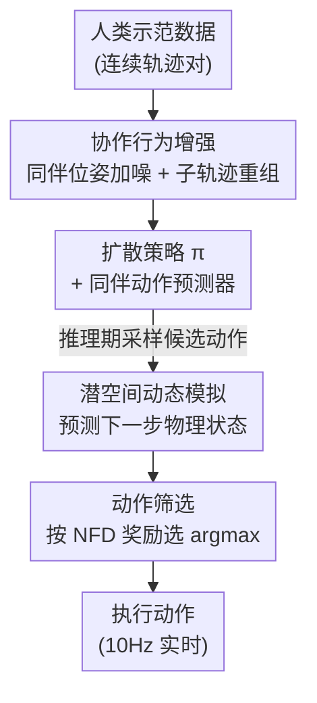

# Moving Out: Physically-grounded Human-AI Collaboration

**会议**: ICML 2026  
**arXiv**: [2507.18623](https://arxiv.org/abs/2507.18623)  
**代码**: https://live-robotics-uva.github.io/movingout_ai/ （项目页）  
**领域**: 机器人 / 具身智能 / 人机协作  
**关键词**: 人机协作, 具身智能, 行为增强, 世界模型, 模仿学习

## 一句话总结
针对"现有人机协作 benchmark 都是离散/符号化、不考虑物理约束"的空白，本文造了一个基于 2D 刚体物理引擎、连续状态-动作空间的协作环境 **Moving Out**（两人合搬重物、绕墙角转向），并提出 **BASS**（行为增强 + 动态模拟 + 动作筛选）方法，让 AI 在面对没见过的人类行为和没见过的物体属性时仍能稳定配合，和真人合作时任务完成率几乎翻倍。

## 研究背景与动机
**领域现状**：人机协作（Human-AI Collaboration）目前主流的测试床是 Overcooked-AI 这类网格世界——智能体在离散格子上移动、传递物品一步到位，动作是符号化、任务级的。在这种环境里通过自博弈（self-play）训练就能得到不错的协作 AI。

**现有痛点**：物理世界根本不是这样。合搬一张沙发时，物体的质量、形状、接触动力学都会实打实地影响动作结果——重物需要两人同步发力，不规则形状要协调各自抓哪条边，绕墙角要一边转角度一边平移。网格世界把这些全抹掉了：传物品只有几个固定位置、一步完成，而物理世界里光是"怎么握、转多少度"就有无穷多种连续配置。已有的少数物理化环境（It Takes Two 只有单一简化任务，HumanTHOR / Habitat 3.0 偏导航或高层任务调度）也都没把"连续低层运动控制 + 多样物理属性 + 多种协作模式"凑齐。

**核心矛盾**：连续状态-动作空间带来两个叠加难题。其一，人类行为本身高度多样——旋转角度、施力大小的细微差别就会改变交互结果，自博弈训出来的 AI 见到没配合过的真人就抓瞎；其二，物理约束 $\Gamma(s_t, a_t)$ 把可行的状态转移压成"窄通道"，转移函数被约束成 $\mathcal{P}(s_{t+1}\mid s_t,a_t)=1$ 仅当 $\Gamma(s_t,a_t)$ 满足、否则停在原地，AI 必须真正理解物理属性的含义才能推断同伴意图。

**本文目标**：（1）造一个能逼出连续协作行为的 benchmark；（2）专门测两件事——能不能适应**没见过的人类行为**、能不能泛化到**没见过的物理约束**；（3）给 AI 一个在这两种泛化上都更稳的方法。

**切入角度**：作者观察到，连续空间里"随机扰动单个智能体的轨迹"这种单智能体增强套路会直接破坏协作——改了一方的动作，另一方就配合不上了。所以增强必须**保持双方一致性**；同时 AI 不能只会反应式模仿，得能"预演"动作后果再挑动作。

**核心 idea**：用一句话概括——**增强出多样但仍互相兼容的协作行为（A），再用一个潜空间动态模型预演每个候选动作的物理后果（S），最后按"物体离目标更近"来筛动作（S）**，三步合起来就是 BASS。

## 方法详解

### 整体框架
BASS（Behavior Augmentation, Simulation, and Selection）建立在扩散策略（Diffusion Policy）骨干上，分训练期和推理期两段。训练期做**行为增强**：在已有人类示范上生成更多样、但仍与同伴兼容的协作轨迹，喂给策略学习；同时训练一个**潜空间动态模型**，学会"给定双方动作，下一步物理状态长什么样"。推理期做**模拟+筛选**：策略先采样若干候选动作，动态模型逐个预演它们的未来状态，再用一个奖励（物体到目标区的总距离）给每个候选打分，选分最高的执行。整条链路不依赖测试时的物理仿真器，因此可迁移到没有 simulator 的真实场景。

### 关键设计

**1. 协作行为增强：在不破坏配合的前提下造多样性**

单智能体增强（随机扰动轨迹）在协作里行不通——动了 A 的动作，B 就配合不上了。BASS 用两招生成"既多样又兼容"的数据。第一招是**同伴位姿加噪**：只对同伴的位姿加一个小高斯噪声 $\tilde{p}_{\text{partner}}=p_{\text{partner}}+\epsilon,\ \epsilon\sim\mathcal{N}(0,\sigma^2)$，其余状态不动，模拟人类动作的自然抖动，让策略对小偏差更鲁棒。第二招是**子轨迹重组**，这是更巧的一步：如果在两段成功示范里，智能体 $i$ 各有一段子轨迹的**起止位姿几乎相同**（连续空间里用位姿差小于阈值 $\epsilon_{\text{pose}}$ 来判等，即 $s^i_{t_1}\approx \hat{s}^i_{t_3}$ 且 $s^i_{t_2}\approx \hat{s}^i_{t_4}$），那就说明同伴 $j$ 在这两段里的不同行为对 $i$ 都是兼容的——于是保持 $i$ 的运动不变，把两段里同伴 $j$ 的子轨迹互换。这等于在"同一段 $i$ 的动作"下凑出了多种合法的同伴行为，逼策略学会在同伴有变化时仍输出一致的配合。作者验证重组后状态停留在合法状态空间、不产生碰撞，物理有效率 >99%。

**2. 潜空间动态模拟：让 AI 预演动作后果**

仿真环境里可以直接用物理引擎算后果，但真实世界没有 simulator，所以需要一个能"预测下一步状态"的世界模型。BASS 用两个自编码器（实现为 VAE）：一个把当前状态编码进潜空间，动态模型在潜空间里预测下一步，另一个自编码器把预测的潜表示解码回真实状态。关键是下一步状态既取决于自己的动作、也取决于同伴的动作，所以专门加了一个**同伴动作预测器**先把同伴这一步的动作 $a_t^{(p)}$ 推出来，动态模型据此预测 $z_{t+1}=f(z_t, a_t, a_t^{(p)})$。同伴预测器可以直接复用策略本身——把输入状态换成同伴视角即可。这样 AI 在出手前就能"脑补"出考虑了物理属性和同伴反应的未来状态。

**3. 基于预测状态的动作筛选：把"想清楚再动"落到实处**

光有候选动作和世界模型还不够，得有个标准来挑。策略和同伴预测器各采样 4 个候选动作（之所以是 4 个而不是更多，是因为协作要 10Hz 实时推理，采样太多来不及）。对每个候选，动态模型预演出未来状态，再用 **NFD（Normalized Final Distance，归一化最终距离）** 算奖励——本质就是所有物体到目标区的总距离，越近奖励越高；最后选 $a^*=\arg\max_{a_i} r(a_i)$。因为奖励直接读"物体离目标多近"，所以即便测试时碰到没见过的物体属性，只要世界模型能预测出"这么动会让物体更接近目标"，就能选对动作。这正是 BASS 在 Challenge 2（未见物理约束）上更稳的来源。

> 三个组件按 A→S→S 顺序对应框架图自上而下的流向：行为增强喂训练、动态模拟在推理期预演、动作筛选最终拍板。

### 损失函数 / 训练策略
策略骨干用扩散策略（强多模态建模能力，既当基础策略又当同伴动作预测器）；VAE 编解码器和潜空间动态模型实现为 MLP 并**联合训练**。推理期每个分支采样 4 个候选以兼顾精度和 10Hz 实时性。NFD 是默认筛选目标，但作者指出任何能衡量地图完成进度的指标都可替代。

## 实验关键数据

### 数据集多样性
作者先证明"招募多样真人采数据"本身就有价值：用动态时间规整（DTW）、KDE 熵、RBF 覆盖距离衡量轨迹多样性，Moving Out 的真人数据全面碾压专家数据和 RL 采集的数据。

| 数据来源 | DTW 均值 ↑ | DTW 方差 ↑ | 平均熵(KDE) ↑ | 覆盖距离(RBF) ↑ |
|----------|-----------|-----------|--------------|----------------|
| Moving Out 挑战1（真人） | **7.013** | **6.065** | **0.888** | **0.899** |
| 专家数据集 | 4.642 | 3.029 | 0.757 | 0.744 |
| RL 智能体采集 | 4.358 | 2.499 | 0.683 | 0.626 |

### 主实验（Challenge 1，AI-AI 与真人，20 次平均）
TCR=任务完成率↑，NFD=归一化最终距离↑，WT=等待时间↓，AC=动作一致性↑。

| 协议 | 方法 | TCR ↑ | NFD ↑ | WT ↓ | AC ↑ |
|------|------|-------|-------|------|------|
| 见过行为 | DP | 0.3233 | 0.5367 | 0.3789 | 0.8163 |
| 见过行为 | **DP/BASS** | **0.3503** | **0.5724** | **0.3598** | **0.8337** |
| 未见行为 | DP | 0.2563 (-20.7%) | 0.4589 (-14.5%) | 0.4249 | 0.7854 |
| 未见行为 | **DP/BASS** | **0.3010 (-14.1%)** | **0.5197 (-9.2%)** | **0.3899** | **0.8099** |
| 与真人合作 | DP | 0.3855 | 0.5547 | 0.4886 | 0.8054 |
| 与真人合作 | **DP/BASS** | **0.6512** | **0.7053** | **0.3364** | **0.9124** |

最亮眼的是"与真人合作"一行：BASS 的 TCR 从 DP 的 0.3855 跳到 0.6512（接近翻倍），等待时间反而下降——说明它真能读懂并主动配合多样的人类行为，而 DP 面对真人时等待时间不降反升。在未见行为下，BASS 各指标掉点也最少（TCR 只掉 14.1% vs DP 的 20.7%）。

### 消融：多智能体设计的必要性（RQ3）
把 BASS 退化成"单智能体变体"——重组时忽略同伴对齐、模拟时只预测自己一方的未来状态：

| 配置 | Challenge 1 {TCR, NFD} | Challenge 2 {TCR, NFD} |
|------|------------------------|------------------------|
| 完整 BASS（多智能体） | {0.403, 0.511} | {0.420, 0.554} |
| 单智能体变体 | {0.368, 0.451} | {0.319, 0.458} |

单智能体变体虽然增加了多样性，但因为不考虑同伴一致性，协作性能明显下滑（Challenge 2 的 TCR 从 0.420 掉到 0.319），说明"显式建模双方"对生成合法增强轨迹和选对动作都是必需的。

### 关键发现
- **与真人合作的提升远大于 AI-AI**：BASS 的核心价值在物理化的真人协作上才完全释放（TCR 0.385→0.651），印证了"行为增强 + 动作预演"确实在补"适应人类多样性"这块短板。
- **失败模式被显著压低**：人工统计三类典型失败（交接时不松手、需要帮忙时不响应、靠近大物体却抓不住）的发生率，DP 为 {0.797, 0.688, 0.906}，BASS 降到 {0.343, 0.563, 0.484}。
- **主观评价显著**：32 人用户研究中，BASS 在"乐于助人（Helpfulness）"和"对物理的理解"两项上显著优于 DP，独立 t 检验 $p=0.017$。
- **所有方法在未见行为下都掉点**，说明 benchmark 确实难、留足了改进空间，但 BASS 掉得最少。

## 亮点与洞察
- **子轨迹重组的"起止位姿匹配"判据很巧**：它把"什么样的同伴行为对我兼容"这个抽象问题，转化成一个可检验的几何条件（起止位姿相同），从而在连续空间里安全地造出多样配合数据，物理有效率 >99%。这套思路可迁移到任何"双方耦合、单边扰动会破坏一致性"的协作/装配任务。
- **"预演再出手"用世界模型替代真实仿真器**：训练时可以用物理引擎，但部署时换成潜空间动态模型，这让方法天然适配没有 simulator 的真实机器人场景，是从 benchmark 走向落地的关键一跳。
- **benchmark 本身的贡献被低估**：这是第一个为"连续低层运动控制"设计、且带真人采集数据的人机协作 benchmark，12 张地图覆盖协调（Coordination）、感知（Awareness）、动作一致性（Action Consistency）三种模式，给后续研究提供了能逼出物理协作行为的统一测试床。

## 局限与展望
- **2D 物理引擎而非 3D**：虽然引入了刚体物理，但仍是俯视 2D 世界，离真实机器人的 3D 操作、抓取、力控还有距离。
- **候选动作只采 4 个**：受 10Hz 实时约束，动作筛选的搜索很浅，复杂场景下最优动作可能根本没被采样到——作者也承认增大采样数能提精度但牺牲实时性。
- **失败案例远未解决**：即便 BASS 把三类失败率压低，仍有 34%~56% 的发生率（如"需要帮忙时不响应"仍达 0.563），物理协作的鲁棒性还有很大缺口。
- **同伴动作预测器复用策略**可能在同伴行为与训练分布差异大时失准，进而拖累整个"预演"链路；论文未深入分析这一误差传播。

## 相关工作与启发
- **vs Overcooked-AI（Carroll et al., 2019）**：它是离散网格世界、动作符号化、传物品一步到位；本文是连续状态-动作 + 刚体物理 + 多物理属性，逼出的协作行为复杂度完全不同，自博弈这类在网格世界有效的方法在物理世界面对真人会明显退化。
- **vs Diffusion Policy（Chi et al., 2024）**：DP 是 BASS 的骨干和最强 baseline，本身能建模多模态动作分布，但它是纯行为克隆、不预演后果，面对未见行为/未见物体属性时掉点更多；BASS 在 DP 之上加了行为增强和动作预演，与真人合作时 TCR 几乎翻倍。
- **vs MAPPO（Yu et al., 2022）**：标准多智能体 RL，靠自博弈，但缺少人类数据对齐，在适应多样真人行为上表现最弱（未见行为 TCR 仅 0.1635）。

## 评分
- 新颖性: ⭐⭐⭐⭐ 连续物理化人机协作 benchmark + "兼容性约束下的增强 + 世界模型预演"组合，切入角度清晰。
- 实验充分度: ⭐⭐⭐⭐⭐ 两个挑战 + AI-AI/真人双重评测 + 32 人用户研究 + 失败模式统计 + 多智能体消融，覆盖很全。
- 写作质量: ⭐⭐⭐⭐ 动机推导扎实、问题定义形式化清楚，部分结果图表散落在附录稍影响阅读。
- 价值: ⭐⭐⭐⭐ benchmark + 方法都开源，给物理化具身协作提供了可复现的统一测试床。

<!-- RELATED:START -->

## 相关论文

- [\[ICML 2026\] Spatial Memory for Out-of-Vision Manipulation in Vision-Language-Action](spatial_memory_for_out-of-vision_manipulation_in_vision-language-action.md)
- [\[NeurIPS 2025\] Inner Speech as Behavior Guides: Steerable Imitation of Diverse Behaviors for Human-AI Coordination](../../NeurIPS2025/robotics/inner_speech_as_behavior_guides_steerable_imitation_of_diverse_behaviors_for_hum.md)
- [\[CVPR 2026\] BiPreManip: Learning Affordance-Based Bimanual Preparatory Manipulation through Anticipatory Collaboration](../../CVPR2026/robotics/bipremanip_learning_affordance-based_bimanual_preparatory_manipulation_through_a.md)
- [\[AAAI 2026\] Robust Out-of-Order Retrieval for Grid-Based Storage at Maximum Capacity](../../AAAI2026/robotics/robust_out-of-order_retrieval_for_grid-based_storage_at_maximum_capacity.md)
- [\[CVPR 2026\] Beyond Mimicry: Learning Whole-Body Human-Humanoid Interaction from Human-Human Demonstrations](../../CVPR2026/robotics/beyond_mimicry_learning_whole-body_human-humanoid_interaction_from_human-human_d.md)

<!-- RELATED:END -->
