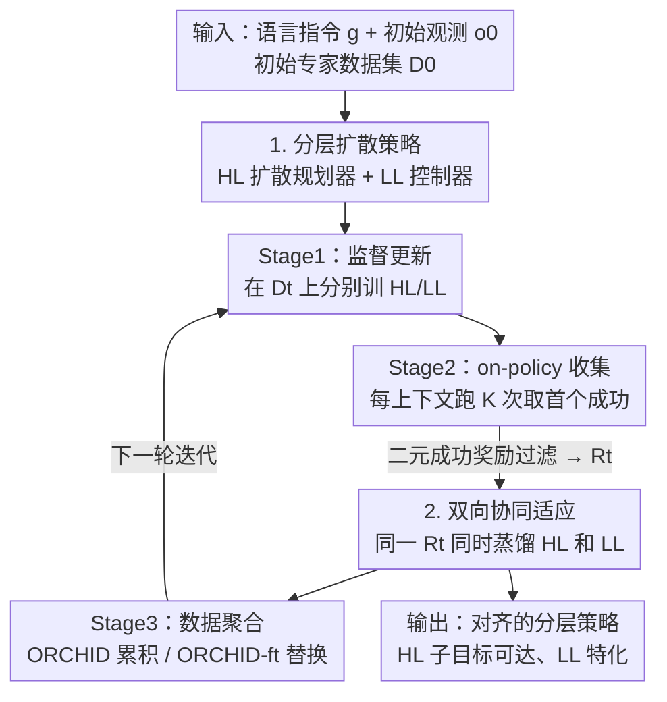

# Online Self-Training for Co-Adaptation in Hierarchical Diffusion Policies

**会议**: ICML 2026  
**arXiv**: [2603.05291](https://arxiv.org/abs/2603.05291)  
**代码**: https://github.com/clemgris/ORCHID.git  
**领域**: 机器人 / 具身智能 / 分层策略 / 扩散策略  
**关键词**: 分层策略, 扩散策略, 自训练, 在线微调, 语言条件操作

## 一句话总结
ORCHID 用"自训练"（self-training）让分层扩散机器人策略在线自我改进：反复采样轨迹、用稀疏的环境成功信号过滤出"规划器和控制器同时成功"的轨迹，再监督蒸馏回**高层规划器**和**低层控制器**两端，从而把高层（HL）和低层（LL）双向协同对齐，让一个轻量初始很弱的模型在 CALVIN 上超过比它大一倍的 VLA。

## 研究背景与动机

**领域现状**：从语言学操作机器人，要把视觉观测 + 自然语言指令映射成连续动作。单体式 VLA（Vision-Language-Action）模型效果好但要海量预训练；为在长程、多样任务上达到同等复杂度而不付那么大代价，**分层策略**很流行——高层规划器 HL 在稀疏子目标空间里做长程规划，低层控制器 LL 专注精细控制去到达每个子目标。子目标可以是关键点、接触点、末端位姿或视觉子目标，其中扩散模型因能表达高维子目标分布而成为强力规划器。

**现有痛点**：分层策略最大的瓶颈在 HL 与 LL 的**接口**上。HL 生成的子目标不仅要任务相关，还得是 LL "够得着"的；反过来 LL 又要学会在 HL 特定的规划结构下生成成功轨迹。作者把这称为 **HL-LL 耦合问题**。已有解法有两类：(1) 插一个中间"胶水"（glue）模块去筛 LL 偏好的规划，但引入额外代理模型、增大推理与训练复杂度；(2) 用跨层共享表示把规划与控制塞进同一嵌入空间，但这个表示得同时满足规划和控制相互冲突的需求，很难学好。

**核心矛盾**：上述方法**全是离线训练**——规划器永远拿不到"我的子目标是否落在控制器实际可达范围内"的信号，靠堆数据集大小也补不上这个缺口。真正闭合缺口需要**在线环境交互**让规划器拿到 LL 可达性的直接反馈。但分层策略的在线训练是出了名的不稳定，扩散规划器的多步随机去噪又会产生高方差梯度估计，雪上加霜，于是大多数语言条件操作的分层方法只能困在固定的人工标注数据集上。

**本文目标**：在不引入辅助模型、不依赖共享潜变量约束、不做基于梯度的协同损失的前提下，让分层扩散策略能从**稀疏二元环境反馈**中稳定在线自我改进，并真正对齐 HL 与 LL。

**切入角度**：作者从 LLM 自训练的成功（STaR / SPIN / ReST / Expert Iteration）受到启发——这些方法**不需要对生成过程求导**，只要能采样候选输出并按质量过滤，就能靠蒸馏自身过滤后的输出自举性能，效果匹配甚至超过基于梯度的 RL，且更稳定。而分层扩散策略在二元奖励下恰好满足"能采样 + 能按成功过滤"这个性质。

**核心 idea**：用监督蒸馏过滤后的 on-policy 样本，代替不稳定的分层扩散 RL——用同一份"联合成功"轨迹同时更新 HL 和 LL，诱导出**双向协同适应**（bidirectional co-adaptation）。

## 方法详解

### 整体框架

ORCHID（Online Self-TRaining for Co-adaptation in Hierarchical Diffusion policies）把训练组织成一个自我强化的循环。系统是分层智能体：基于扩散的 HL 一次性生成一整条视觉子目标序列（plan $\hat{\zeta}=\langle\hat{o}_1,\dots,\hat{o}_M\rangle$），LL 是目标条件视觉运动策略，逐段把环境从源观测推向目标子目标、输出动作块 $a_c$。整体目标是最大化期望回报 $J(\pi^{HL}_\phi, \pi^{LL}_\psi)$，其中奖励 $R$ 是二元的（任务成功为 1）。

与"独立离线训练 HL/LL"（图 1a，易出耦合错配）不同，ORCHID 通过三阶段循环迭代改进并对齐两端：**Stage 1 监督更新** → **Stage 2 on-policy 轨迹收集（环境奖励过滤）** → **Stage 3 数据聚合**。关键在于：每轮过滤出的成功轨迹集合 $\mathcal{R}_t$ 同时喂给 HL 和 LL——从中抽 LL 真正路过的中间观测作为 HL 的"可达子目标"训练目标，抽 HL 规划结构下的成功动作作为 LL 的训练目标，于是规划器被拉向控制器够得着的子目标、控制器又特化到规划器产出的子目标分布，双向收敛。

### 关键设计

**1. 分层扩散策略：一次性整条规划 + 变长动作块控制器**

HL $\pi^{HL}_\phi$ 是扩散模型，吃初始观测 $o_0$ 和文本目标 $g$，**一次性生成整条视觉规划** $\hat{\zeta}$（而非逐步反应式生成），只在重规划时才调用 HL——这降低计算开销并简化失败检测：完不成规划就触发整体重规划。训练用速度参数化的扩散目标 $\mathcal{L}_{\mathrm{HL}}(\phi)=\lVert v_\phi(\zeta^j,j,o_0^\ast,g)-(\alpha_j\epsilon_j-\beta_j\zeta^0)\rVert_2^2$，其中 $\zeta^0$ 是从训练轨迹抽出的稀疏子目标序列。LL $\pi^{LL}_\psi$ 把源观测 $o_\text{source}$ 和目标子目标 $o_\text{target}$ 映射成动作块 $a_c=\langle a_0,\dots,a_{n-1}\rangle$；训练时从轨迹采样**变长连续动作块** $m\sim\mathcal{U}[n_\text{min}, n-1]$ 并补齐到固定长度 $n$，最小化 $\mathcal{L}_{\text{LL}}(\psi)=\lVert\pi^{LL}_\psi(o_\text{source},o_\text{target})-a_c^\ast\rVert_2^2$。变长块的妙处是让 LL 学会在**不同时间尺度**上够到子目标，从而对 HL 产出子目标的难度差异更鲁棒。

**2. 环境反馈过滤的 on-policy 收集：只留"联合成功"轨迹当监督信号**

这是 ORCHID 把 RL 问题转成监督学习的支点。每轮用当前策略 $\pi_t$ 对每个上下文 $(s_0,l)$ 跑 $K$ 次 rollout、**保留第一个成功的那条**：$\mathcal{R}_t=\bigcup_{(s_0,l)}\{\tau_{k^\ast}\mid k^\ast=\min\{k\in[K]:R(\tau_k,s_0,l)=1\}\}$，没成功的上下文不贡献任何样本，并对每个任务保留条数设上限以平衡数据集。由于只在二元成功奖励下过滤，整个学习不需要对扩散去噪过程求导，天然继承了 LLM 自蒸馏的稳定性，避开了分层扩散 RL 的高方差梯度。$\mathcal{R}_t$ 里既含 LL 实际到达的状态（给 HL 当可达子目标），又含 HL 规划下的成功动作（给 LL）。

**3. 双向协同适应：同一份 $\mathcal{R}_t$ 同时拉齐规划器与控制器**

这是全文最核心的机制，回应 HL-LL 耦合错配。$t=0$ 时 HL 在专家轨迹抽出的子目标 $\zeta^\ast$ 上训练，这些子目标带着人类遥操作风格、可能 LL 根本够不着；$t>0$ 时 HL 的训练目标 $\zeta^0$ 改成来自 $\mathcal{R}_t$——它们正是 LL 在成功 rollout 中**实际路过的中间观测** $O(s_{x_i})$，让 HL 的生成分布偏向 LL 够得着的子目标。与此**同时**，LL 在 HL 特定规划结构下的成功轨迹上微调，特化到测试时会遇到的子目标模式，缩小 $D_0$ 中子目标分布与实际分布的差距。因为 HL 和 LL 由**同一份过滤数据集**驱动，二者朝彼此收敛：HL 偏向 LL 可达、LL 同时特化到 HL 产出——隐式完成 HL-LL 对齐，构成一次策略改进步（提升 HL 规划下成功轨迹的似然，经验上逐轮抬高 $J$）。

**4. 丰富上下文 + 两种数据聚合：扩状态覆盖并控制遗忘/算力权衡**

为了广探索，作者用两类互补上下文构造 $\mathcal{C}(D_t)$：**环境重置上下文**（标准初始配置 $s_0\sim\rho_\text{reset}$）和**回放上下文**（拿已收集轨迹的终止状态 $o_N^\ast$ 当新起点，配上采样目标 $g$）。后者的物体配置与标准重置不同，能产生 $\rho_\text{reset}$ 单独到不了的新任务上下文，把状态覆盖扩到 $D_0$ 之外，且无需专家 oracle。Stage 3 提供两种聚合：**ORCHID**（$D_{t+1}=D_t\cup\mathcal{R}_t$ 后从头重训）防灾难性遗忘、用上全部数据，但数据集变大算力递增；**ORCHID-ft**（$D_{t+1}=\mathcal{R}_t$ 后从 $\pi_t$ 微调）每轮算力恒定，代价是有遗忘旧数据的风险。两者构成"算力 vs 遗忘"的可选权衡。

### 损失函数 / 训练策略
HL 用速度参数化扩散目标 $\mathcal{L}_\text{HL}$，LL 用动作块回归目标 $\mathcal{L}_\text{LL}$，两端全程都是**监督学习**——这正是稳定性的来源。新引入的**可达性误差** $\mathcal{E}$ 衡量接口质量：规划子目标与 LL 实际到达观测之间的观测空间距离 $\mathcal{E}=\mathbb{E}[\frac{1}{M}\sum_i d(O(s_{x_i}),\hat{o}_i)]$，在 pixel / R3M / DINOv2 三种嵌入空间下用 $\ell_2$ 评估。注意低 $\mathcal{E}$ 反映接口好但不保证任务成功（视觉子目标因部分可观测缺全状态信息），所以同时追踪期望回报 $J$。

## 实验关键数据

在 Franka-3Blocks（10 个语言操作任务）和 CALVIN（34 任务，用最难的 D→D split）上评估。LL 默认用 Diffusion Policy（DP），也试了 Action Chunk Transformer（ORCHID-ACT）。

### 主实验（CALVIN LH-MTLC，平均连续完成任务长度 Avg. Len.，↑）

| 方法 | 完成 1 任务 | 5 任务 | Avg. Len. | 说明 |
|------|------------|--------|-----------|------|
| HULC* | 82.7% | 28.3% | 2.64 | 无 HL-LL 耦合 |
| TaKSIE* | 90.4% | 40.8% | 3.18 | 胶水模型 |
| MDT* | 93.7% | 55.6% | 3.72 | 共享表示 |
| FLOWER* | 97.4% | 74.9% | 4.35 | 950M VLA，互联网级预训练 |
| HD (iter 0) | 83.9% | 29.2% | 2.69 | 本文基座，仅离线 D0 |
| **ORCHID-ft (iter 3)** | 93.2% | 57.3% | **3.80** | 恒定算力微调版 |
| **ORCHID (iter 3)** | **97.5%** | **71.3%** | — | 累积重训版，逼近 FLOWER |

### 消融 / 分析

| 配置 | 现象 | 结论 |
|------|------|------|
| HD iter0 → ORCHID iter3 | Avg. Len. 2.69 → 3.80（ORCHID-ft） | 自训练循环稳定抬升性能 |
| ORCHID-ACT-ft iter0 → iter3 | 1.89 → 2.90 | 换 ACT 控制器同样有效 |
| 可达性误差 $\mathcal{E}$ 随迭代 | 下降 | HL 生成更可达的子目标，接口对齐改善 |

### 关键发现
- **轻量弱模型逆袭大 VLA**：初始很弱的 HD（iter 0 仅 2.69）经 3 轮 ORCHID 升到 3.80（ft）/ 接近 FLOWER（97.5% vs 97.4% 单任务），而 FLOWER 是大一倍、靠 25 万机器人轨迹 + 互联网预训练的 950M VLA——印证在线自训练能在低数据下榨出大模型级性能。
- **双向协同是收益来源**：HL 子目标可达性误差 $\mathcal{E}$ 随迭代下降、LL 同步特化，二者一起把成功率推高，验证了"同一份 $\mathcal{R}_t$ 驱动双向适应"的设计意图。
- **稳定性来自纯监督**：全程不对扩散去噪求导，避开分层扩散 RL 的高方差梯度，这是它能稳定迭代而基于梯度的在线 RL 不能的根本原因。

## 亮点与洞察
- **把 LLM 自训练范式干净地搬到分层机器人策略**：洞察"二元奖励下扩散分层策略满足'能采样 + 能过滤'"，于是 STaR/ReST 那套监督蒸馏直接可用——这个跨领域迁移既优雅又有效，是最大的"啊哈"点。
- **用同一份过滤数据同时喂两端**：不需要额外的对齐损失、胶水模型或共享表示，单靠"LL 路过的状态当 HL 目标、HL 规划下的动作当 LL 目标"就隐式完成对齐，工程上极简。
- **回放上下文扩状态覆盖**：拿成功轨迹终点当新起点，无需专家 oracle 就能探到 $\rho_\text{reset}$ 到不了的新配置，这个 trick 可迁移到任何 on-policy 数据收集场景。
- **可达性误差 $\mathcal{E}$ 是好诊断指标**：把"HL-LL 接口好不好"量化成观测空间距离，多嵌入空间评估增强鲁棒性，可复用到其他分层策略的接口诊断。

## 局限与展望
- **依赖能频繁成功的初始策略**：自训练要靠过滤出的成功轨迹自举，若初始策略在某些任务上几乎从不成功（$K$ 次全失败），该上下文贡献空集，可能陷入"探不到就学不会"的冷启动困境。
- **二元稀疏奖励的信息有限**：只用成功/失败过滤，无法区分"差一点成功"的近优轨迹，样本利用率可能不如带稠密信号的方法。
- **ORCHID 累积版算力随迭代递增**：从头重训 + 数据集增大使计算成本上升，ORCHID-ft 虽恒定算力但有遗忘风险，两者都未做到"既省算力又不遗忘"。
- **视觉子目标受部分可观测限制**：低可达性误差不保证任务成功（视觉子目标缺全状态信息），接口指标与最终回报之间仍有 gap。

## 相关工作与启发
- **vs 胶水模型（TaKSIE / HL-Glue）**: 它们插中间模型去筛 LL 偏好的规划，增大推理与训练复杂度；ORCHID 不加任何辅助模型，靠在线过滤数据隐式对齐，且离线起步后还能持续超越。
- **vs 共享表示（MDT / LDC / LDP）**: 它们用共享网络层或在 LL 视觉嵌入空间里规划来强制耦合，但单一表示要同时满足规划与控制的冲突需求很难；ORCHID 不强加共享潜变量约束，让两端各自特化又双向收敛。
- **vs 扩散策略在线微调（DPPO / DDPO / 偏好类）**: 它们要么须对多步去噪求梯度（不稳定）、要么需稠密奖励或偏好数据集；ORCHID 只用稀疏二元反馈、纯监督蒸馏，无需额外世界/奖励模型也无需专家 oracle（区别于 DAgger 类的 DifNav）。

## 评分
- 新颖性: ⭐⭐⭐⭐⭐ 首次把 LLM 自训练干净迁移到分层扩散机器人策略，双向协同适应机制原创且自洽。
- 实验充分度: ⭐⭐⭐⭐ 两个 benchmark + 两种控制器 + 可达性误差诊断，低数据逆袭大 VLA 很有说服力。
- 写作质量: ⭐⭐⭐⭐ 把 HL-LL 耦合问题与三阶段循环讲得清晰，图表与机制对应良好。
- 价值: ⭐⭐⭐⭐⭐ 给"分层策略在线稳定改进"提供了不依赖梯度 RL 的实用范式，落地潜力大。

<!-- RELATED:START -->

## 相关论文

- [\[NeurIPS 2025\] Generalizable Domain Adaptation for Sim-and-Real Policy Co-Training](../../NeurIPS2025/robotics/generalizable_domain_adaptation_for_sim-and-real_policy_co-training.md)
- [\[ICML 2026\] Turning Adaptation into Assets: Cross-Domain Bridging for Online Vision-Language Navigation](turning_adaptation_into_assets_cross-domain_bridging_for_online_vision-language_.md)
- [\[ICML 2026\] HDFlow: Hierarchical Diffusion-Flow Planning for Long-horizon Tasks](hdflow_hierarchical_diffusion-flow_planning_for_long-horizon_tasks.md)
- [\[ICML 2026\] Discrete Diffusion VLA: Bringing Discrete Diffusion to Action Decoding in Vision-Language-Action Policies](discrete_diffusion_vla_bringing_discrete_diffusion_to_action_decoding_in_vision-.md)
- [\[ICML 2026\] Lagrangian Perturbation Diffusion Steering: Latent Reinforcement Learning for Generative Policies](lagrangian_perturbation_diffusion_steering_latent_reinforcement_learning_for_gen.md)

<!-- RELATED:END -->
