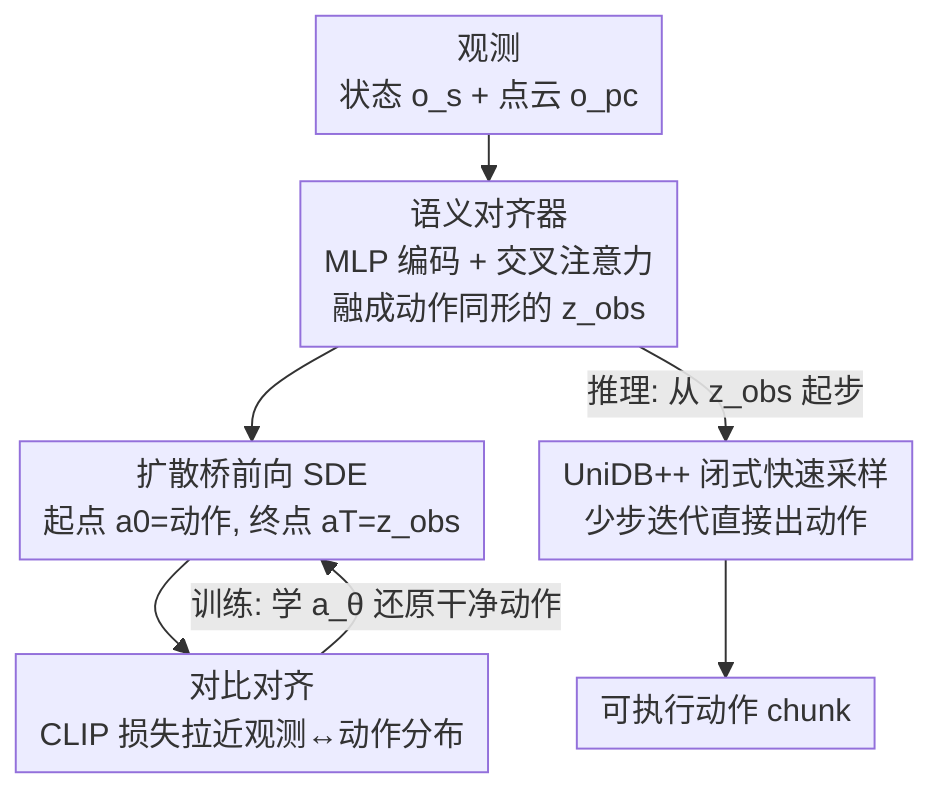

# Sample from What You See: Visuomotor Policy Learning via Diffusion Bridge with Observation-Embedded Stochastic Differential Equation

**会议**: ICML2026  
**arXiv**: [2512.07212](https://arxiv.org/abs/2512.07212)  
**代码**: https://jianghcsr.github.io/BridgePolicy_page/  
**领域**: 机器人 / 具身智能  
**关键词**: 扩散桥, 视觉运动策略, 模仿学习, 模态对齐, 随机最优控制

## 一句话总结
BridgePolicy 把扩散策略里"观测只当条件、采样从随机噪声起步"的做法，改成用扩散桥（diffusion bridge）把观测直接嵌进前向 SDE 的终点，让动作采样从一个"观测信息丰富的先验"出发；再用一个语义对齐器把异构观测压成和动作同形的表示，从而在 52 个仿真任务和 5 个真机任务上稳定超过现有生成式策略。

## 研究背景与动机
**领域现状**：用扩散模型/流匹配做模仿学习是当前机器人控制的主流路线。Diffusion Policy（DP）、3D Diffusion Policy（DP3）、FlowPolicy 这类方法都遵循同一范式——把专家动作 chunk 通过一个由 SDE/ODE 定义的前向过程加噪成随机噪声，再训练一个**以观测为条件**的网络去逆转这个过程，迭代地把噪声变成可执行动作。它们的优势是能刻画多模态动作分布、建模长程时序依赖。

**现有痛点**：这些方法都把观测 $\boldsymbol{o}$（点云、机器人本体状态等）**仅仅当作喂给去噪网络的高层条件信号**，而没有把它整合进扩散过程本身的随机动力学里。后果是采样被迫从一个**毫无信息的随机高斯噪声** $\boldsymbol{a}_T\sim\mathcal{N}(0,I)$ 起步，感知和控制之间的耦合被削弱，精度和可靠性常常打折扣。

**核心矛盾**：观测里其实携带了关于"该做什么动作"的丰富信息，但标准扩散范式的数学结构决定了它的终点必须是固定噪声分布，观测进不了 SDE 轨迹，只能从网络条件这个"侧门"进入。

**切入角度**：作者注意到扩散桥在图像修复/翻译里已经证明——可以**修改前向过程，让终点分布自然对齐到想要的条件分布**，于是逆过程可以从学到的观测表示这个"信息先验"起步，而不是从噪声起步。既然图像任务能这么干，策略学习为什么不行？

**核心 idea**：把策略学习重新表述为**学习一条扩散桥**——前向过程的起点是动作 $\boldsymbol{a}_0=\boldsymbol{a}$、终点是观测 $\boldsymbol{a}_T=\boldsymbol{o}$，观测被显式写进 SDE 轨迹的终点而非仅当条件；逆过程则从观测先验直接采样出动作。难点是扩散桥要求两端分布**同维**，而机器人观测（本体状态、RGB-D、语言）和动作天生异构、维度不对齐——这就需要一个语义对齐器来"造出"一个和动作同形的观测表示。

## 方法详解

### 整体框架
BridgePolicy 的整条管线可以这样鸟瞰：**训练时**把异构观测（机器人状态 $\boldsymbol{o}_s$ + 点云 $\boldsymbol{o}_{pc}$）分别用 MLP 编码、再用交叉注意力融合成一个**和动作 chunk 同形**的观测表示 $\boldsymbol{z}_{obs}$；把它设为扩散桥的终点 $\boldsymbol{a}_T$、把专家动作设为起点 $\boldsymbol{a}_0$，沿 UniDB 给出的最优受控前向 SDE 加噪，训练一个数据预测网络 $\boldsymbol{a}_\theta$ 直接还原干净动作。**推理时**不再从噪声起步，而是从融合好的 $\boldsymbol{z}_{obs}$ 出发，用 UniDB++ 的免训练闭式更新规则迭代少数几步，直接吐出可执行动作。

### 关键设计

**1. 观测嵌入式扩散桥：让采样从"看到的"出发而不是从噪声出发**

这是全文的核心，直接针对"采样被迫从无信息噪声起步"的痛点。作者借助 UniDB 在随机最优控制（SOC）框架下构造扩散桥：把前向过程写成一个带轨迹代价和终点代价的最优控制问题
$$\min_{\mathbf{u}_{t,\gamma}}\ \mathbb{E}\left[\int_{0}^{T}\tfrac{1}{2}\|\mathbf{u}_{t,\gamma}\|_{2}^{2}\,dt+\tfrac{\gamma}{2}\|\boldsymbol{a}_{T}^{u}-\boldsymbol{a}_{T}\|_{2}^{2}\right],\quad \mathrm{d}\boldsymbol{a}_t=[\theta_t(\boldsymbol{a}_T-\boldsymbol{a}_t)+g_t\mathbf{u}_{t,\gamma}]\mathrm{d}t+g_t\mathrm{d}\boldsymbol{w}_t$$
其中终点代价的惩罚系数 $\gamma$ 逼着系统把状态从动作 $\boldsymbol{a}_0=\boldsymbol{a}$ 驱动到观测 $\boldsymbol{a}_T=\boldsymbol{o}$。UniDB 给出了这个 SOC 问题的闭式最优受控前向 SDE（漂移项多了一个 $\frac{g_t^2 e^{-2\bar\theta_{t:T}}}{\gamma^{-1}+\bar\sigma_{t:T}^2}$ 的修正），从而把"动作↔观测"两端连成一条桥。与 DP/DP3 最本质的区别在于：终点不再是 $\mathcal{N}(0,I)$，而是观测本身——逆过程因此能从一个携带"该做什么"信息的先验起步，精度自然更高。训练目标是用数据预测网络直接重建干净动作的 $\ell_1$ 重构损失 $\mathcal{L}_{DB}=\mathbb{E}\|\boldsymbol{a}_\theta(\boldsymbol{a}_t,\boldsymbol{a}_T,t)-\boldsymbol{a}\|$。

**2. 语义对齐器：把异构观测压成与动作同形、可采样的终点**

扩散桥的数学前提是两端**同维**，但机器人观测（本体状态 + 点云，甚至语言）和动作的形状、模态完全对不上，直接套桥根本跑不起来。语义对齐器分两步解决：先把深度图转成点云并用最远点采样下采样（仿真 512/1024 点、真机 2048 点），再用轻量 MLP 把状态和点云各自编码成 $\boldsymbol{z}_s,\boldsymbol{z}_{pc}$；然后用**交叉注意力**做多模态融合
$$\boldsymbol{a}_T:=\boldsymbol{z}_{obs}=\mathbf{softmax}\!\left(\frac{\boldsymbol{z}_{pc}\boldsymbol{z}_s^{\top}}{\sqrt{d_s}}\right)\boldsymbol{z}_s$$
得到一个**和动作 chunk 同形**的统一观测表示，正好充当扩散桥的终点。这一步把"异构分布桥接"和"形状不匹配"两个障碍同时拆掉，是让扩散桥真正可用于策略学习的工程关键。消融显示交叉注意力比简单拼接更好（见 Table 3）。

**3. 对比对齐损失：光同形还不够，还要让观测先验"可采样、语义贴近动作"**

仅靠融合让观测和动作在**形状**上对齐，但两者的**分布**仍有显著差异，而且学出来的 $\boldsymbol{z}_{obs}$ 作为采样起点缺乏"可采样性"。作者用 CLIP 式对比损失把观测表示和动作在语义上拉近：
$$\mathcal{L}_{align}=\mathcal{L}_{clip}(\boldsymbol{a},\boldsymbol{z}_{obs})+\mathcal{L}_{clip}(\boldsymbol{z}_{obs},\boldsymbol{a})$$
总损失为 $\mathcal{L}=\mathcal{L}_{DB}+\alpha\mathcal{L}_{align}$。这条对比损失保证了终点先验和动作分布语义邻近，让"从观测起步"的采样既稳又准。配合理论上的扰动界（Theorem 3.1：动作输出误差被观测 MLP 误差线性界住 $\|\tilde{\boldsymbol{a}}_0-\boldsymbol{a}_0\|\le C\|\tilde{\boldsymbol{a}}_T-\boldsymbol{a}_T\|$，且实测常数 $C$ 仅 $10^{-2}\sim10^{-3}$ 量级），说明即便编码器有拟合误差，生成动作也不会大幅偏离。

### 损失函数 / 训练策略
训练联合优化扩散桥重构损失 $\mathcal{L}_{DB}$（$\ell_1$ 范数，跟随 UniDB）与对齐损失 $\mathcal{L}_{align}$，权重 $\alpha$ 为正。推理用 UniDB++ 提供的免训练加速器：给定数据预测模型 $\boldsymbol{a}_\theta$ 和从 $t_0=T$ 递减到 $t_M=0$ 的时间步，从 $\boldsymbol{a}_T=\boldsymbol{z}_{obs}$ 起步按闭式更新规则（原文 Eq. 4，各系数有解析式、几乎不增计算开销）迭代生成动作。所有基线 NFE 设为 10（FlowPolicy 因一致性流匹配多步会误差累积，设为 1）。

## 实验关键数据

### 主实验
仿真覆盖 Adroit、DexArt、MetaWorld 三个 benchmark 共 52 个任务，指标为成功率（3 个随机种子、每种子取最高 5 次评测均值）。

| 方法 | MW-Easy | MW-Medium | MW-Hard | MW-VeryHard | DexArt | Adroit | 平均 |
|------|---------|-----------|---------|-------------|--------|--------|------|
| DP | 0.79 | 0.31 | 0.10 | 0.26 | 0.45 | 0.31 | 0.37 |
| DP3 | 0.87 | 0.61 | 0.40 | 0.51 | 0.57 | 0.68 | 0.60 |
| FlowPolicy | 0.86 | 0.67 | **0.59** | 0.76 | 0.54 | 0.70 | 0.68 |
| VITA | 0.85 | 0.58 | 0.48 | 0.62 | 0.55 | 0.77 | 0.64 |
| **BridgePolicy** | **0.91** | **0.75** | 0.58 | **0.79** | **0.60** | **0.81** | **0.74** |

真机用 Franka Emika Panda + ZED-2i 相机，5 个任务各评 10 个 episode：

| 方法 | Oven-Closing | Oven-Opening | Pick-Place | Pour | Unplug | 平均 |
|------|--------------|--------------|-----------|------|--------|------|
| Simple DP3 | 0.8 | 0.6 | 0.6 | 0.6 | 0.7 | 0.66 |
| DP3 | 0.9 | 0.9 | 0.7 | 0.6 | 0.7 | 0.76 |
| FlowPolicy | 1.0 | 0.7 | 0.5 | 0.1 | 0.5 | 0.56 |
| **BridgePolicy** | 1.0 | **1.0** | **0.8** | **0.8** | **0.9** | **0.90** |

### 消融实验

| 配置 | Adroit-Pen | Adroit-Door | MW-Handle-Pull | 说明 |
|------|-----------|-------------|----------------|------|
| 拼接（Concatenation） | 0.78 | 0.59 | 0.55 | 简单拼接融合 |
| 交叉注意力（Cross-Attention） | **0.81** | **0.665** | **0.63** | 完整模型采用 |

### 关键发现
- 平均成功率 BridgePolicy 0.74 显著高于次优 FlowPolicy 0.68；越难的任务（MetaWorld Hard/Very Hard）相对优势越突出，说明"从观测先验起步"在复杂任务里更稳。
- 真机平均 0.90，远超 DP3 的 0.76；FlowPolicy 在 Pour 这种需要连续精细控制的任务上崩到 0.1，而 NFE=1 的单步采样在真机上误差累积明显。
- 模态融合用交叉注意力一致优于拼接，印证"异构观测要语义融合而非简单堆叠"。
- 作者还有 demonstration 数量的消融（Figure 4）：BridgePolicy 在更少演示数据下仍保持优势，体现观测先验带来的样本效率。

## 亮点与洞察
- **把"条件"升格成"轨迹终点"**：最妙的一笔是认识到——观测不该只从网络条件这个侧门进，而应该写进扩散 SDE 的终点。这是把图像修复里成熟的扩散桥思想，正确迁移到策略学习的关键洞察。
- **同形对齐是落地关键**：扩散桥要求两端同维这个"硬约束"，恰恰是别人没法直接套用桥的原因；语义对齐器（交叉注意力造同形 + CLIP 对比拉近分布）把这个障碍系统性拆掉，是可复用的工程模板。
- **理论扰动界给安全感**：Theorem 3.1 用线性界 + 实测 $C\sim10^{-2}$ 说明"观测编码器的误差不会被放大成动作灾难"，让"从学出来的先验起步"这件事在理论上站得住。
- **可迁移性**：这套"把条件嵌进生成轨迹终点 + 对齐器解决异构同形"的范式，可迁移到任何"条件信息丰富、但和目标空间异构"的生成式决策任务（如多模态轨迹规划）。

## 局限与展望
- **依赖点云/深度**：方法以 3D 点云为主视觉输入，对没有可靠深度的纯 RGB 场景或标定不准的情形适用性存疑。
- **桥的两端仍是"动作↔融合观测"而非原始多模态**：语言指令等真正异构的模态最终被压进同形 $\boldsymbol{z}_{obs}$，是否丢失细粒度语义、对长程语言条件任务是否够用，论文未充分验证。
- **采样器复杂度**：UniDB++ 闭式更新规则系数繁多（Eq. 4），虽说计算开销小，但工程实现与数值稳定性门槛不低。
- **常数 $C$ 仅经验估计**：扰动界里的 $C$ 难以解析确定，只在所测任务上为小量，换分布/换任务后是否仍小没有保证。

## 相关工作与启发
- **vs DP / DP3 / FlowPolicy**：它们把观测当去噪网络的外部条件、从随机噪声采样；BridgePolicy 把观测嵌进 SDE 终点、从观测先验采样，本质是"信息先验 vs 无信息先验"的区别，精度与样本效率都更优。
- **vs BRIDGER**：BRIDGER 先训一个粗策略再用扩散桥精修，性能强依赖粗策略质量；BridgePolicy 直接把异构观测建进桥、端到端生成可执行动作，无需粗策略。
- **vs VITA**：VITA 在图像-动作联合潜空间做流匹配、再用解码器恢复可执行动作（引入泛化误差，性能介于 DP3 与 FlowPolicy 之间）；BridgePolicy 直接在 SDE 轨迹里建模观测并直接生成动作，省掉解码环节。

## 评分
- 新颖性: ⭐⭐⭐⭐⭐ 首次把扩散桥的"观测嵌入终点"范式正确迁移到视觉运动策略，并配套解决异构同形难题
- 实验充分度: ⭐⭐⭐⭐ 52 仿真 + 5 真机任务、对比 5 个 SOTA、有理论扰动界，消融可再丰富
- 写作质量: ⭐⭐⭐⭐ 动机—难点—方法逻辑清晰，采样公式略密但有伪代码辅助
- 价值: ⭐⭐⭐⭐ 给生成式策略提供了"从观测起步"的新框架，对机器人模仿学习有实用价值

<!-- RELATED:START -->

## 相关论文

- [\[ICLR 2026\] Cosmos Policy: Fine-Tuning Video Models for Visuomotor Control and Planning](../../ICLR2026/robotics/cosmos_policy_fine-tuning_video_models_for_visuomotor_control_and_planning.md)
- [\[NeurIPS 2025\] Act to See, See to Act: Diffusion-Driven Perception-Action Interplay for Adaptive Policies](../../NeurIPS2025/robotics/act_to_see_see_to_act_diffusion-driven_perception-action_interplay_for_adaptive_.md)
- [\[CVPR 2026\] GraspLDP: Towards Generalizable Grasping Policy via Latent Diffusion](../../CVPR2026/robotics/graspldp_towards_generalizable_grasping_policy_via_latent_diffusion.md)
- [\[ICML 2026\] STEP: Warm-Started Visuomotor Policies with Spatiotemporal Consistency Prediction](step_warm-started_visuomotor_policies_with_spatiotemporal_consistency_prediction.md)
- [\[ICML 2026\] Lagrangian Perturbation Diffusion Steering: Latent Reinforcement Learning for Generative Policies](lagrangian_perturbation_diffusion_steering_latent_reinforcement_learning_for_gen.md)

<!-- RELATED:END -->
