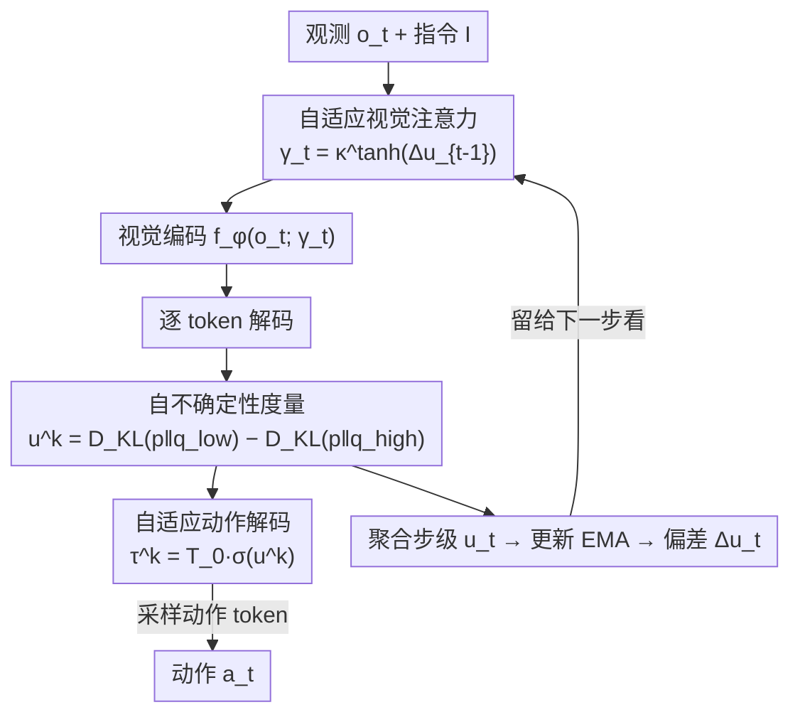

# SCALE: Self-uncertainty Conditioned Adaptive Looking and Execution for Vision-Language-Action Models

**会议**: ICML 2026  
**arXiv**: [2602.04208](https://arxiv.org/abs/2602.04208)  
**代码**: https://github.com/snumprlab/scale  
**领域**: 机器人 / 具身智能（VLA）  
**关键词**: 测试时扩展, 自不确定性, 自适应推理, 视觉注意力调制, 主动推理

## 一句话总结
SCALE 让自回归 VLA 在推理时用一个仅从输出 logits 算出的「自不确定性」分数，同时调制**动作采样温度**和**视觉注意力温度**——不确定就广撒网探索、确定就贪心聚焦，全程零额外训练、无 verifier、单次前向，就把多个 SOTA VLA 的成功率往上抬了一截。

## 研究背景与动机

**领域现状**：自回归 VLA（如 OpenVLA、π0-FAST、SpatialVLA）把视觉观测和语言指令编码后，逐个解码动作 token，闭环控制机器人。为了让模型在训练分布之外更鲁棒，近期兴起了**测试时扩展（Test-Time Scaling, TTS）**，即在推理时多花算力换性能。

**现有痛点**：现有 VLA 的 TTS 方案几乎都走 Best-of-N 路线——要么训一个外部 verifier（RoboMonkey、TACO），要么靠模型自验证（MG-Select）。这带来三个硬伤：① 需要额外训练验证器；② verifier 在分布漂移下会失灵；③ 多次前向采样与实时控制的延迟约束冲突。更关键的是，这些方法**只在动作解码端干预，视觉表征始终冻结**。

**核心矛盾**：在**感知歧义**场景下（如桌上有视觉相似的干扰物），光在候选动作里选最优是不够的——你得**重新考虑「怎么看」**。greedy 解码只盯 top-1 动作、贪心地一条道走到黑，而冻结的视觉编码可能压根没把目标物看进来。"看什么"和"做什么"应当一起根据当前的把握程度来调。

**切入角度**：作者借用**主动推理（Active Inference）**理论——智能体通过同时调整感知与行动来降低不确定性。于是问题变成：怎么量化一个能驱动这种调制的「自不确定性」信号？已有的 LLM 自确定性（Self-certainty）只衡量预测分布离均匀分布有多远（整体歧义度），却没刻画模型对 top-1 选择有多果断——而 greedy 解码恰恰是把 top-1 直接执行、常常不可逆，对 top-1 的果断程度至关重要。

**核心 idea**：定义一个**双参考**的自不确定性度量，把预测分布**定位**在「完全确定（one-hot）」和「完全歧义（均匀）」两个极端之间，一个标量同时抓住分布弥散度和 top-1 果断度；再用这个标量当统一旋钮，去调动作采样温度和视觉注意力温度。

## 方法详解

### 整体框架

SCALE 是一个**单次前向的自适应推理策略**，套在任意自回归 VLA 之上、不改权重。每个控制步里，模型先用上一步留下的不确定性偏差调整视觉编码器的注意力温度（决定"怎么看"），编码出视觉特征后逐 token 解码动作，每个 token 都按自身的不确定性调整采样温度（决定"做什么"）；解码完再把这一步的不确定性聚合、更新 EMA、算出新的偏差，留给下一步用。这样感知与行动在闭环里形成一个**反馈回路**：这一时刻的不确定性既影响当下的动作采样，又调好下一帧的视觉注意力。

### 关键设计

**1. 自不确定性度量：把预测分布定位在「确定↔歧义」两极之间**

针对「现有 LLM 自确定性只看整体歧义、不看 top-1 果断度」这个缺口，SCALE 借鉴对数似然比检验（用相对似然比较两个竞争假设）的思路，造了两个参考分布：低不确定性参考 $q_{\text{low}}$ 是压在 top-1 token 上的近似 one-hot 分布（代表完全确定），高不确定性参考 $q_{\text{high}}$ 是均匀分布（代表完全歧义）。第 $k$ 个动作 token 的自不确定性定义为两个 KL 散度之差：

$$u^k_t = D_{\text{KL}}\!\left(p^k_t \,\|\, q_{\text{low}}\right) - D_{\text{KL}}\!\left(p^k_t \,\|\, q_{\text{high}}\right).$$

展开后它恰好等于在模型自身预测分布下、两个参考的期望对数似然比 $\mathbb{E}_{x\sim p^k_t}\!\left[\log \frac{q_{\text{high}}(x)}{q_{\text{low}}(x)}\right]$。直觉上 $u^k_t>0$ 表示分布更靠近"完全歧义"那一端，即高不确定。这个度量只需输出 logits、零训练，却比单参考的 Self-certainty 多抓住了对 top-1 的果断程度——实验里它（63.3%）显著优于 $p_{\max}$、Self-certainty、熵、Gini 等代理（53.8~57.8%）。

**2. 自适应动作解码：用 sigmoid 把不确定性变成采样温度的软门**

针对「greedy 解码在动作多模态时只走 top-1、忽略可行的替代动作」，SCALE 把每个动作 token 的采样温度按其 token 级不确定性来调：

$$\tau^k_t = T_0 \cdot \sigma(u^k_t),$$

$T_0$ 是定义探索上限的最大温度，sigmoid 充当一道**软门**。由于 $u^k_t$ 可解读为"不确定 vs 确定"两假设的对数似然比，$\sigma(u^k_t)$ 正好恢复"不确定假设"的后验概率：高不确定时门打开、$\tau\approx T_0$ 走探索性采样，低不确定时门关上、$\tau\approx 0$ 近贪心执行。动作 token 最终从温度缩放后的分布 $a^k_t \sim \text{Cat}(\text{softmax}(\ell^k_t/\tau^k_t))$ 采样。

**3. 自适应视觉注意力：用不确定性的「历史偏差」调视觉编码器的注意力温度**

针对「冻结的视觉编码可能把目标看丢、只盯着干扰物」，SCALE 在感知端也调温度，但这里不能用瞬时值——感知要依赖时间上下文判断场景在变难还是变易。所以作者先把 token 级不确定性平均成步级 $u_t=\frac{1}{K}\sum_k u^k_t$，维护一个 EMA $\bar u_t=\alpha\bar u_{t-1}+(1-\alpha)u_t$，用当前值相对历史均值的**偏差** $\Delta u_t = u_t-\bar u_{t-1}$ 来探测场景复杂度的跃变。为了保证单次前向（$u_t$ 要解码后才有），实际用**上一步的偏差** $\Delta u_{t-1}$ 算注意力温度：

$$\gamma_t = \kappa^{\tanh(\Delta u_{t-1})},$$

$\kappa>1$ 把 $\gamma_t$ 限在 $(1/\kappa,\kappa)$ 内、零偏差时 $\gamma_t=1$ 不调制。$\gamma_t$ 再乘进视觉编码器每一层的自注意力 $\text{softmax}\!\left(\frac{QK^\top}{\sqrt{d}\cdot\gamma_t}\right)V$：不确定升高（$\gamma_t>1$）就摊平注意力、广搜信息，不确定降低（$\gamma_t<1$）就锐化注意力、聚焦执行。作者特意选调**视觉编码器的单模态注意力**而非 VLA 主干的跨模态注意力，因为前者决定"提取什么视觉信息"在更上游，实验也证实它更有效（63.3% vs 跨模态 57.4%）。

### 损失函数 / 训练策略
SCALE 是纯推理期策略，**不引入任何训练**，也不更新 VLA 权重。算法每个控制步只做一次前向：先按 $\Delta u_{t-1}$ 调视觉注意力温度并编码，再逐 token 解码动作（每个 token 算 $u^k_t$、定 $\tau^k_t$、采样），最后聚合 $u_t$、更新 EMA、算 $\Delta u_t$ 留给下一步。无额外 rollout、无 verifier、无辅助网络，延迟与 greedy 基本持平。

## 实验关键数据

### 主实验
覆盖 LIBERO、SIMPLER-WidowX、LIBERO-PRO-Long 三个仿真基准与 UR10e 真机，多个 VLA 主干。SCALE 在所有基准、所有主干上都稳定优于 greedy 与各类训练-free 解码（采样/top-k/top-p），且常常超过需要额外训练和多次前向的 TTS 方法，同时保持单次前向。

| 基准 / 主干 | 指标 | greedy 基线 | 最佳训练-free 解码 | SCALE | 提升(vs greedy) |
|--------|------|------|----------|------|------|
| LIBERO / OpenVLA | Avg. SR(%) | 75.7 | 77.2 | **81.5** | +5.8 |
| LIBERO / π0-FAST | Avg. SR(%) | 91.2 | 88.1 | **93.0** | +1.8 |
| SIMPLER-WidowX / π0-FAST | Avg. SR(%) | 34.4 | 41.7 | **49.0** | +14.6 |
| SIMPLER-WidowX / SpatialVLA(zero-shot) | Avg. SR(%) | 31.3 | 32.3 | **41.7** | +10.4 |
| LIBERO-PRO-Long / π0-FAST(zero-shot) | Avg. SR(%) | 35.7 | 34.4 | **38.8** | +3.1 |
| 真机 OOD / π0-FAST | Avg. SR(%) | 43.8 | — | **56.3** | +12.5 |

值得注意的是，在 OpenVLA 上 SCALE（81.5%）甚至超过了需训练的 MG-Select（70.8%），且在最难的 LIBERO-PRO-Long 未见基准和真机 OOD（如软玩具熊、小方块这类未见几何/柔顺度）上提升明显，说明收益来自对歧义的自适应处理而非记忆。

### 消融实验
所有消融在 OpenVLA / LIBERO-Long 上以 SR(%) 报告。

| 配置 | SR(%) | 说明 |
|------|------|------|
| 基线 OpenVLA (greedy) | 52.7 | 固定推理 |
| 仅自适应解码 | 58.0 | 只调动作温度 |
| 仅自适应视觉注意力 | 56.0 | 只调感知温度 |
| **SCALE（两者结合）** | **63.3** | 两者互补 |
| 度量换 Self-certainty | 53.8 | 单参考、丢了 top-1 果断度 |
| 度量换熵 / Gini | 55.4 / 57.8 | 弱于双参考 |
| 视觉调制改用瞬时 $u_{t-1}$ | 55.4 | 不如用历史偏差 $\Delta u_{t-1}$ |
| 视觉调制改调跨模态注意力 | 57.4 | 不如调视觉编码器单模态注意力 |

### 关键发现
- **两个组件互补**：单独用动作解码（+5.3）或视觉注意力（+3.3）都有效，合起来（+10.6）最强，证明"做什么"和"怎么看"该一起调。
- **度量设计是关键**：双参考自不确定性（63.3%）远超只看整体歧义的 Self-certainty（53.8%）和熵（55.4%），多抓的 top-1 果断度确实有用。
- **视觉调制要用"历史偏差"而非瞬时值**：感知依赖时间上下文，$\Delta u_{t-1}$（63.3%）优于 $u_{t-1}$（55.4%）；且调更上游的视觉编码器优于调下游跨模态注意力。
- **越难越管用**：在 OOD、未见基准、真机难物体上提升最大，说明它专治感知/动作歧义。

## 亮点与洞察
- **一个标量、两处调制**：用同一个自不确定性信号同时驱动动作采样和视觉注意力，把"主动感知"的哲学落成了一行可计算的公式，优雅且零成本。
- **双参考度量值得借鉴**：把"分布定位在 one-hot 与均匀之间"这个思路，可以迁移到任何需要同时刻画"分布弥散+top-1 果断"的解码/路由场景（如 LLM 推理路径选择、MoE 路由置信）。
- **单次前向是工程上的大卖点**：相比 Best-of-N 的多次 rollout + verifier，SCALE 延迟与 greedy 持平，真正能上实时机器人。
- **EMA 偏差当"场景变难"探测器**：用相对历史的偏差而非绝对值来触发探索，避免了任务整体难度不同导致的阈值难调，这个小设计很实用。

## 局限与展望
- **只适用于自回归（离散 token）VLA**：方法建立在动作 token 的 categorical 分布上，连续动作的扩散/flow matching VLA（如 π0、GR00T）无法直接套用，需要另想不确定性度量。
- **超参仍需在 LIBERO-Long 上选一次**：虽然选完就固定迁移到所有基准，但 $T_0,\kappa,\alpha$ 的初始标定仍依赖一个有标签的校准集。
- **"自不确定性"≠真实正确性**：模型可能在错误答案上也很自信（过度自信），此时门会错误地关闭探索；度量本质是分布形状的代理，不保证与真值对齐。
- **改进方向**：把双参考度量与轻量校准结合、或扩展到连续动作空间的不确定性建模，是顺理成章的下一步。

## 相关工作与启发
- **vs RoboMonkey / TACO / MG-Select（TTS-VLA）**：他们做 Best-of-N + verifier/自验证，需训练且多次前向；SCALE 不训练、单次前向，且在 OpenVLA 上反超 MG-Select（81.5 vs 70.8）。
- **vs Self-certainty（LLM 自确定性）**：他们只测分布离均匀有多远（单参考、整体歧义）；SCALE 用双参考额外抓 top-1 果断度，对 greedy 执行的 VLA 更对症，消融里 63.3 vs 53.8。
- **vs 传统视觉注意力方法（VLM/VLA）**：他们靠对比掩码或训练模块来调视觉处理；SCALE 训练-free 地用不确定性动态调注意力温度，且专为闭环控制设计。

## 评分
- 新颖性: ⭐⭐⭐⭐⭐ 双参考自不确定性 + 感知/动作联合调制，思路干净且首次把"怎么看"也纳入 VLA 的 TTS。
- 实验充分度: ⭐⭐⭐⭐⭐ 三仿真基准 + 真机、多主干、多消融（度量/组件/调制设计），覆盖全面。
- 写作质量: ⭐⭐⭐⭐ 动机推导清晰、公式自洽；附录依赖较多，主文部分细节（如 ε 取值）需翻附录。
- 价值: ⭐⭐⭐⭐⭐ 零训练、单次前向、可直接套现有 VLA，工程落地价值高。

<!-- RELATED:START -->

## 相关论文

- [\[ICML 2026\] SpecPrune-VLA: Accelerating Vision-Language-Action Models via Action-Aware Self-Speculative Pruning](specprune-vla_accelerating_vision-language-action_models_via_action-aware_self-s.md)
- [\[CVPR 2026\] Adaptive Action Chunking at Inference-time for Vision-Language-Action Models](../../CVPR2026/robotics/adaptive_action_chunking_at_inference-time_for_vision-language-action_models.md)
- [\[CVPR 2026\] SRPO: Self-Referential Policy Optimization for Vision-Language-Action Models](../../CVPR2026/robotics/srpo_self-referential_policy_optimization_for_vision-language-action_models.md)
- [\[CVPR 2026\] QuantVLA: Scale-Calibrated Post-Training Quantization for Vision-Language-Action Models](../../CVPR2026/robotics/quantvla_scale-calibrated_post-training_quantization_for_vision-language-action_.md)
- [\[CVPR 2026\] AT-VLA: Adaptive Tactile Injection for Enhanced Feedback Reaction in Vision-Language-Action Models](../../CVPR2026/robotics/at-vla_adaptive_tactile_injection_for_enhanced_feedback_reaction_in_vision-langu.md)

<!-- RELATED:END -->
