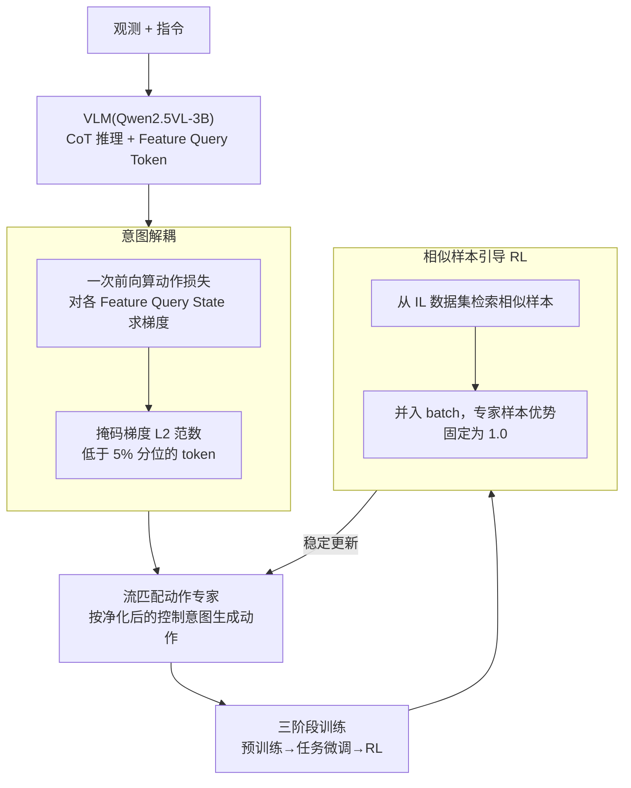

# Scaling by Diversified Experience for Vision-Language-Action Models

**会议**: ICML 2026  
**arXiv**: [2606.09009](https://arxiv.org/abs/2606.09009)  
**代码**: 开源（项目页发布预训练数据集 + 全流程代码）  
**领域**: 机器人 / 具身智能（VLA）  
**关键词**: 视觉-语言-动作模型, 意图解耦, 真机强化学习, 灾难性遗忘, 流匹配

## 一句话总结
SyVLA 用"VLM + 流匹配动作专家 + Feature Query Token"的双系统架构做"先想后做"的机器人控制，并配上两味药——基于梯度范数掩码的**意图解耦**算法（把高层推理信息从控制意图里剥离）和**相似样本引导的 RL**（把专家样本优势固定为 1.0 稳住真机在线 RL）——在用不到 π0 5% 预训练数据的前提下，既拿下更高真机成功率与更强 OOD 泛化，又保住了原 VLM 的视觉-语言能力。

## 研究背景与动机

**领域现状**：靠大规模高质量遥操作数据 + VLM，VLA 发展很快；π0、Wall-Oss、GR00T 等用上万小时专家数据预训练，做到了相当灵巧的操作。

**现有痛点**：通往通用具身智能有两个瓶颈。① **能力此消彼长**：VLA 常常过度强调动作学习，把底层 VLM 的视觉-语言理解和逻辑推理能力压垮，甚至灾难性遗忘——这违背了"人类靠跨域知识迁移获得广泛能力"的直觉；现有靠混多模态数据训练的做法，难以在动作能力和语言能力之间取得满意平衡。② **模仿学习的目标错配**：IL 在每一步精确拟合专家动作，但真实任务成功由上百步闭环执行共同决定；闭环中误差累积会把机器人推向 OOD 观测最终失败。RL 是公认的解药，但 VLA 的数十亿参数 + 高维连续动作空间让真机 RL 极易不稳、策略漂移甚至能力崩塌。

**核心矛盾**：作者发现，即便用比别人**更轻量**的 Feature Query Token 连接 VLM 与动作专家，训出来的模型还是会动作不精准、犹豫不决。根因是隐式控制表征里**泄漏了高层推理过程的信息**，让动作专家被高层"想法"搞混、在不同决策间摇摆。

**本文目标**：(a) 在保住 VLM 语言能力的同时让动作精准；(b) 给 VLA 搞一套真能用、不崩的真机 RL。

**切入角度**：① 既然问题是"推理信息泄漏进控制意图"，那就**把泄漏的部分定位并掐掉**——而且作者从理论上论证：动作损失对某个 Feature Query State 的梯度范数越小，它对控制意图贡献越小、越可能是冗余信息。② 既然纯专家样本会让 RL 发散，那就**给专家样本一个固定优势**绕开高方差的价值估计。

**核心 idea**：用梯度范数当"冗余探测器"做**意图解耦**；用从 IL 数据集检索的相似样本 + 固定优势 1.0 做**相似样本引导 RL**。

## 方法详解

### 整体框架

SyVLA 是个**双系统**模型：VLM（Qwen2.5VL-3B）当高层感知/语言推理核心与控制意图生成器，一个基于 Transformer 的**流匹配（Flow Matching）动作专家**当低层执行器。两者靠一组可学习的 **Feature Query Token** 连接——把这些 token 接在 VLM 自回归 CoT 输出之后，取它们的最后隐状态（Feature Query States）过一个 MLP adapter，作为流匹配的条件，引导动作专家生成符合 VLM 计划的动作。相比 π0 的 KV Cache，这种方式更轻、延迟更低，还能支持 VLM 与动作专家的异步推理。

整套训练走**三阶段**：① 预训练（大规模机器人数据混约 30% 多模态数据，<1% 带任务 CoT 标注）；② 任务微调（每个目标任务几百条轨迹）；③ RL。其中**意图解耦算法贯穿全程**，相似样本引导只在第三阶段用。

### 关键设计

**1. 双系统架构 + Feature Query Token：用轻量 token 桥接"想"与"做"**

针对「既要 VLM 的语言推理、又要动作专家的精细控制」，SyVLA 不让 VLM 直接出动作，而是让它先做有限推理（处理抽象/复杂指令），再在推理 token 之后追加 $n$ 个（实测 $n=20$）可学习 Feature Query Token，用其最后隐状态当动作专家的条件。这套"Think-Before-Act"靠混入多模态数据训练来保住 VLM 原能力，使模型既能执行任务又留住常识与推理。相比 π0 的 KV Cache 方案，Feature Query Token 显式、定长、轻量，推理延迟更低，且天然支持 VLM 与动作专家**异步推理**以榨干效率。

**2. 意图解耦：用梯度范数掩码掐掉泄漏进控制意图的推理信息**

针对核心痛点——隐式控制表征里泄漏了高层推理、让动作专家犹豫，SyVLA 提出**免标注**的意图解耦。它用两步前向：第一步把原始 Feature Query States $\mathbf{H}_{\text{raw}}=\{\mathbf{h}^0,\dots,\mathbf{h}^{n-1}\}$ 喂进动作专家算一次动作损失 $L_{\text{action}}$，求其对每个隐状态的梯度 $\mathbf{g}^i=\partial L_{\text{action}}/\partial \mathbf{h}^i_{\text{raw}}$；然后把梯度 $\ell_2$ 范数低于阈值 $\tau$（取梯度范数分布的 **5% 分位**）的隐状态**掩码为零**：

$$\mathbf{h}^i_{\text{masked}} = \mathbf{h}^i_{\text{raw}}\cdot \mathbb{I}\!\left(\lVert \mathbf{g}^i\rVert_2 \ge \tau\right),\quad i=0,\dots,n-1,$$

第二步用掩码后的 $\mathbf{H}_{\text{masked}}$ 重算损失并更新。理论上（把动作专家简化为单层注意力）作者证明 $\partial \ell/\partial h_i$ 由两个因素决定：注意力分数大小、以及 value 向量 $v_i$ 与注意力输出 $z$ 的距离——梯度范数小意味着要么该 token 被认为与决策无关、要么其信息已被别的 token 覆盖（冗余）。保留冗余 token 会让模型学到"捷径决策路径"，在 OOD 下导致非因果决策而掉点。因为额外那次前向-反传**只涉及动作专家**（通常 <20% 参数、且不额外更新），训练时间只增约 10%。

**3. 相似样本引导 RL：用专家相似样本 + 固定优势 1.0 稳住真机在线 RL**

针对「VLA 真机 RL 极易策略漂移/崩塌」，SyVLA 在每次 RL 更新时，除了 rollout 数据，还从 IL 专家数据集**检索语义相似的样本**并入同一 batch。相似度按多视角图像特征的加权余弦相似度算：

$$\text{sim}(x,y)=\sum_{v\in\mathcal{V}} w_v\cdot \text{sim}_{\cos}\!\left(E(O^{(v)}_x),\,E(O^{(v)}_y)\right),$$

其中 $O^{(v)}$ 是视角 $v$ 下的观测图、$E(\cdot)$ 是图像编码器、$w_v\ge 0$ 是视角权重。但作者发现，对专家样本直接套标准策略梯度（GAE）会在 1k 步内 loss 和梯度范数爆炸——根因是价值模型估计与专家行为分布严重错配、产生高方差且误导的优势估计。解决办法极简：把专家样本的**优势统一设为 1.0**，让训练目标等价于最大化专家动作似然，从而把更新拉向专家行为、强力压制漂移。最终在长程稀疏奖励任务（如叠衬衫）上，RL 阶段相比模仿初始化策略带来高达 **15% 绝对成功率**提升。

### 损失函数 / 训练策略
三阶段：预训练（机器人数据 + 约 30% 多模态混合）→ 任务微调（每任务几百条轨迹）→ RL（用 PPO 适配的相似样本引导算法，专家样本优势固定 1.0）。意图解耦的两步前向掩码贯穿全程。动作专家用流匹配目标训练。

## 实验关键数据

### 主实验
在 Cobot Magic 真机平台测三个任务（叠衬衫、算术+包裹、装零食），每任务都设计了 OOD 设定（未见位置/未见指令/模糊指令），报告成功率；并在 DocVQA/AI2D/MMMU/MME/HallBench 上验证 VLM 能力是否还在。

| 方法 | ID 平均成功率 | OOD 平均成功率 | 备注 |
|------|------|------|------|
| OpenVLA-oft | 0.45 | 0.24 | 无 VQA 能力 |
| GR00T | 0.38 | 0.24 | 无 VQA 能力 |
| Wall-Oss | 0.27 | 0.06 | — |
| Pi0 (pretrained) | 0.63 | 0.48 | 用 1 万+ 小时私有数据预训练 |
| Pi0 (from scratch) | 0.38 | 0.26 | 同数据从零训 |
| ChatVLA | 0.21 | 0.09 | MoE，能选对物体但精细操作差 |
| **SyVLA (ours)** | **0.73** | **0.64** | 用 <5% π0 预训练数据 |

SyVLA 的 ID 成功率（0.73）显著超过所有公平对比基线，OOD（0.64）领先更明显且掉点最小。唯一在 Task 1 略逊于 Pi0(pretrained)，但远超 Pi0(from scratch)（0.86 vs Pi0-scratch 的对应项），说明 Pi0 的优势主要来自海量预训练数据而非架构本身。

| 多模态基准 | Wall-Oss | ChatVLA | SyVLA(Ours) |
|------|------|------|------|
| DocVQA | 63.62 | 83.30 | 80.01 |
| AI2D | 58.60 | 67.36 | **67.70** |
| MMMU | 37.11 | 37.40 | 35.78 |
| MME | 1146.56 | 1435 | **1795** |
| HallBench | 36.57 | 39.90 | **42.53** |

SyVLA 在 AI2D/MME/HallBench 上最好，DocVQA/MMMU 仅略逊 ChatVLA——但 ChatVLA 几乎做不了灵巧真机任务，而 Pi0 干脆完全丢了 VLM 理解能力。SyVLA 在"动作能力 ↔ 语言能力保留"间取得最佳平衡。

### 消融实验
在 Task 1（叠衬衫，最考验长程精细操作）上以平均成功率报告。

| 配置 | 平均成功率 | 说明 |
|------|------|------|
| **SyVLA (all)** | **0.86** | 完整模型 |
| w/o CoT | 0.79 | 关掉 Think-Before-Act 与意图解耦 |
| w/o Intention Decoupling | 0.43 | 保三阶段训练、只去意图解耦 |
| w/o RL | 0.71 | 用等量 IL 数据替代 RL 阶段 |
| w/o Expert Dataset | 0.21 | RL 只用 rollout 数据 |
| w/o Similar Sample | 0.79 | RL 用随机专家样本而非相似检索 |
| w/ Standard Advantage | 0.00 | 专家样本用标准 GAE → 梯度爆炸崩塌 |

### 关键发现
- **意图解耦贡献最大**：去掉后从 0.86 掉到 0.43，证实"推理信息泄漏进控制意图"确是动作犹豫的根因。
- **专家样本是 RL 稳定的命门**：只用 rollout（w/o Expert）暴跌到 0.21、更新高度不稳；而专家样本用标准 GAE 直接归零（梯度爆炸、能力崩塌），固定优势 1.0 是不可省的关键技巧。
- **相似检索给的是上界**：随机专家样本（0.79）已能稳住，但相似样本检索（0.86）提供更高性能上界。
- **超参不敏感**：掩码阈值在 5% 分位附近、Feature Query Token 数 $n=20$ 在多任务上都表现稳健。

## 亮点与洞察
- **梯度范数当"冗余探测器"**：用动作损失对隐状态的梯度 $\ell_2$ 范数定位并掐掉泄漏的推理信息，免标注、有理论支撑（梯度小⇔注意力低或信息冗余），这个思路可迁移到任何"想剥离某子表征里无关信息"的场景。
- **固定优势 1.0 的"土办法"极有效**：面对价值估计与专家分布错配导致的梯度爆炸，不去精修价值模型，而是直接把专家样本优势钉死为 1.0、把 RL 目标退化成最大似然——简单粗暴但实测最稳。
- **Feature Query Token 轻量化连接**：相比 KV Cache 更省、可异步推理，是双系统 VLA 工程化的实用选择。
- **数据效率惊人**：用不到 π0 5% 的预训练数据就追平甚至超越，凸显架构 + 训练算法设计的价值。

## 局限与展望
- **语言能力有取舍代价**：DocVQA/MMMU 上仍逊于专注保语言的 ChatVLA，作者承认这是有限数据下不可避免的权衡。
- **意图解耦多一次前向-反传**：虽只涉及动作专家、训练时间 +约10%，但仍是额外成本。
- **真机 RL 仍依赖 IL 专家数据集**：相似样本检索的质量与覆盖直接影响稳定性，强依赖前期遥操作数据。
- **理论分析做了强简化**：把动作专家简化为单层注意力来证梯度结论，多层深网下的适用性需进一步验证（⚠️ 以原文 Appendix B 为准）。

## 相关工作与启发
- **vs Pi0**：他们靠 1 万+ 小时私有数据大规模预训练但完全丢了 VLM 语言能力；SyVLA 用 <5% 数据保住语言能力且 OOD 更强。
- **vs ChatVLA**：他们用 MoE 缓解动作/多模态联合训练的梯度冲突、保住语言能力，但精细操作几乎做不了；SyVLA 在两端取得平衡。
- **vs RL-100 / π0.6\* / 世界模型 RL**：他们或只在小扩散模型验证、或依赖超强基模、或难扩展到可形变操作；SyVLA 的相似样本引导 RL 直接在真机臂上跑通了叠衣等可形变长程任务。

## 评分
- 新颖性: ⭐⭐⭐⭐ 梯度范数掩码做意图解耦 + 固定优势稳 RL 都是有理论/直觉支撑的新招，组合得当。
- 实验充分度: ⭐⭐⭐⭐ 真机三任务含 OOD + 多模态基准 + 细致消融，但任务数量与试验次数（14~28 次）偏少。
- 写作质量: ⭐⭐⭐⭐ 动机—理论—方法链条清晰；部分理论推导与实现细节压在附录。
- 价值: ⭐⭐⭐⭐⭐ 首批"带视觉-语言推理能力的完整开源 VLA"之一，且给出可落地的真机 RL 配方，价值高。

<!-- RELATED:START -->

## 相关论文

- [\[ICML 2026\] Contrastive Representation Regularization for Vision-Language-Action Models](contrastive_representation_regularization_for_vision-language-action_models.md)
- [\[ICML 2026\] LangForce: Bayesian Decomposition of Vision-Language-Action Models via Latent Action Queries](langforce_bayesian_decomposition_of_vision_language_action_models_via_latent_act.md)
- [\[ICML 2026\] StableVLA: Towards Robust Vision-Language-Action Models without Extra Data](stablevla_towards_robust_vision-language-action_models_without_extra_data.md)
- [\[ICML 2026\] Test-Time Training for Visual Foresight Vision-Language-Action Models](test-time_training_for_visual_foresight_vision-language-action_models.md)
- [\[CVPR 2026\] MoEActok: A MoE-based Action Tokenizer for Vision-Language-Action Models](../../CVPR2026/robotics/moeactok_a_moe-based_action_tokenizer_for_vision-language-action_models.md)

<!-- RELATED:END -->
