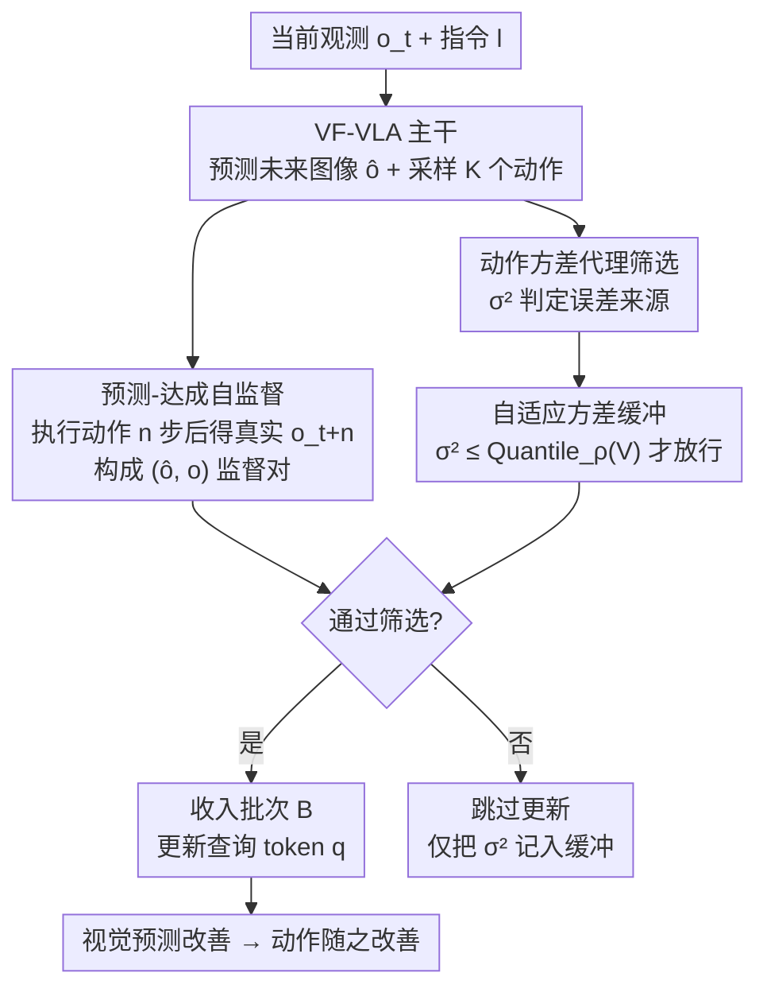

# Test-Time Training for Visual Foresight Vision-Language-Action Models

**会议**: ICML 2026  
**arXiv**: [2605.08215](https://arxiv.org/abs/2605.08215)  
**代码**: https://github.com/sangwu99/T3VF.git  
**领域**: 机器人 / 具身智能  
**关键词**: 视觉前瞻VLA, 测试时训练, OOD鲁棒性, 自监督, 自适应筛选

## 一句话总结
针对"先预测未来图像、再据此生成动作"的视觉前瞻 VLA（VF-VLA）在分布外（OOD）场景下双阶段同时失准的问题，本文提出 T3VF：把模型预测的未来图像与若干步后真实观测到的图像当作一对天然的自监督样本，在测试时只更新最小的视觉查询模块，并用"动作方差 + 自适应分位数缓冲"筛掉噪声步，在 LIBERO-Plus 上以约 1.3× 的推理开销把平均成功率提升约 5%（相对），且不改任何网络结构。

## 研究背景与动机
**领域现状**：VLA（Vision-Language-Action）已成为通用机器人操作的主流范式。其中一类近期工作采用两阶段结构——先让模型预测"机器人接下来应该到达的未来视觉状态"，再基于这张预测图像生成动作，这类模型称为视觉前瞻 VLA（VF-VLA，如 WorldVLA、Mantis）。它们靠"想象未来"显式约束动作，性能很强。

**现有痛点**：恰恰是这种"动作依赖于预测图像"的设计让 VF-VLA 在 OOD 下格外脆弱。因为动作质量直接取决于预测未来图像的准确度，一旦测试环境出现机器人初始位姿、光照、背景、相机视角等扰动，**视觉预测阶段和动作生成阶段会同时被污染**。论文用实测佐证：Mantis 在分布内 LIBERO 上成功率很高，但搬到 LIBERO-Plus（带七类扰动）上大幅掉点，说明两条通路被 OOD 双重打击。

**核心矛盾**：要在测试时缓解 OOD，常见做法是测试时强化学习，但它需要额外的奖励模型、在线 RL 开销大，且针对一般 VLA 而非专门利用 VF-VLA 的结构。VF-VLA 自身这条"双阶段暴露"的脆弱性此前没人专门治理。

**切入角度**：作者抓住 VF-VLA 一个被忽视的结构红利——在第 $t$ 步模型预测了 $n$ 步后的未来图像 $\hat{o}_{t+n}$，等真的执行动作走过 $n$ 步，环境会**实际呈现**那一帧 $o_{t+n}$。这张真实图像天然就是当初那次预测的"标准答案"（oracle），完全不需要额外采数据。

**核心 idea**：用"预测图像 $\hat{o}_{t+n}$ ↔ 后续真实观测 $o_{t+n}$"这对自监督信号，在测试时就地微调视觉预测通路；再用动作方差和自适应缓冲过滤掉不可靠的更新步，把脆弱的 VF-VLA 临场修正回来。

## 方法详解

### 整体框架
T3VF 不动原 VF-VLA 的结构，只在推理回路上挂一层"自监督 + 筛选"的测试时训练。原始 VF-VLA 由 VLM 主干 $P$、图像头 $I_h$、动作头 $A_h$ 组成：给定指令 $l$、当前观测 $o_t$ 和查询 token $q$，主干抽出 $(h_t^{\text{inst}}, h_t^{\text{img}}, h_t^{\text{act}}) = P(l, o_t, q)$，图像头预测 $\hat{o}_{t+n} = I_h([h_t^{\text{inst}}, h_t^{\text{img}}], o_t)$，动作头采样 $\hat{a}_t \sim A_h(h_t^{\text{act}})$，训练目标是 $\mathcal{L}_{\text{train}} = \mathcal{L}_{\text{img}}(\hat{o}_{t+n}, o_{t+n}) + \lambda\,\mathcal{L}_{\text{act}}(\hat{a}_t, a_t)$。

测试时，T3VF 让模型一边执行任务一边攒"预测-达成"图像对：每步在产出动作的同时采 $K$ 个动作样本算方差 $\sigma_t^2$，先用方差判断"这一步的预测误差到底该不该归咎于视觉通路"；只有当方差落在最近窗口的低分位区间内时，才把这一步的图像对收进批次；攒够一个 batch 就做一次更新，且只更新查询 token $q$（视觉预测通路里最小的模块），主干和其余参数全程冻结。视觉预测变准后，依赖它的动作生成也随之改善。

### 关键设计

**1. 预测-达成图像对的自监督：把"想象的未来"和"真实的未来"配成训练样本**

VF-VLA 在 OOD 下垮掉的根因是视觉预测不准，但测试时没有标注没法直接修。作者发现 VF-VLA 的时序结构本身就藏着监督信号：第 $t$ 步预测的 $\hat{o}_{t+n}$，在执行动作走过 $n$ 步后会被环境兑现成真实帧 $o_{t+n}$，这张真实帧就是当初预测的 oracle。于是把每条轨迹上的预测-达成对 $(\hat{o}_{t+n}, o_{t+n})$ 累积进集合 $\mathcal{B}$，当 $|\mathcal{B}|$ 达到 batch size $B$ 时做一次更新，最小化

$$\mathcal{L}_{\text{TTT}} = \frac{1}{B}\sum_{(\hat{o}_{t+n}, o_{t+n})\in\mathcal{B}} \mathcal{L}_{\text{img}}(\hat{o}_{t+n}, o_{t+n}),$$

其中 $\mathcal{L}_{\text{img}}$ 与训练时同一个图像损失。关键取舍是**只更新查询 token $q$**、其余冻结：$q$ 是参与视觉预测通路的最小模块，更新它既能纠偏视觉预测，又把开销压到最低，而且更新与执行并行、不引入任何辅助模块。这与测试时 RL 路线形成鲜明对比——后者要奖励模型和在线 RL，这里连标注和外部信号都不要，监督完全是环境免费送的。

**2. 动作方差代理筛选：用动作的"内部一致性"判断误差该不该信**

直接拿所有预测-达成对去训练有个隐患：$\hat{o}_{t+n}$ 和 $o_{t+n}$ 差得大，既可能是视觉预测真的不准（有用信号），也可能是预测其实没错、但动作执行偏了导致没走到该到的地方（噪声）。不加区分地训练，会让前者的收益被后者的伤害抵消。作者用**动作方差**当代理：在第 $t$ 步采 $K$ 个动作样本 $\{\hat{a}_t^{(k)}\}$，算

$$\bar{a}_t = \frac{1}{K}\sum_{k=1}^{K}\hat{a}_t^{(k)}, \qquad \sigma_t^2 = \frac{1}{K}\sum_{k=1}^{K}\big\|\hat{a}_t^{(k)} - \bar{a}_t\big\|_2^2.$$

方差低，说明模型对"该执行什么动作"内部很笃定，那么此时若出现大的预测误差，更可能归咎于视觉通路，是值得用来更新 $q$ 的信号；方差高则说明误差来源说不清，这一步直接跳过。额外好处是：方差在动作 $\hat{a}_t$ 产出的瞬间就能算（不必等 $o_{t+n}$ 到位），且 $K$ 个样本只需主干一次前向、动作头并行解码，开销远小于真去算 $\mathcal{L}_{\text{img}}$。

**3. 自适应方差缓冲：用相对分位数取代绝对阈值，适配不同难度的回合**

光有方差代理还不够——难度在回合之间、回合之内都在变。若用一个固定阈值：简单片段大量步通过、把噪声灌进参数；困难片段几乎全被卡死、学不到东西。作者把固定阈值换成一条**滑动方差缓冲** $\mathcal{V}_t = \{\sigma_{t'}^2 : t' \in \mathcal{W}_t\}$（最近 $|\mathcal{V}|$ 步的方差窗口），仅当

$$\sigma_t^2 \le \mathrm{Quantile}_\rho(\mathcal{V}_t)$$

时才把第 $t$ 步收进 $\mathcal{B}$，其中 $\rho \in (0,1)$ 是分位阈值。因为判据是"在最近窗口里的相对排名"而非绝对截断，它会自动随每个回合的方差量级伸缩，并把被接受步的总体频率稳定在差不多的比例上，无论回合整体偏难还是偏易。无论是否放行，$\sigma_t^2$ 都会被加入缓冲，保证窗口持续更新。

### 损失函数 / 训练策略
测试时唯一的目标就是上面的 $\mathcal{L}_{\text{TTT}}$（即训练同款图像损失 $\mathcal{L}_{\text{img}}$），动作损失 $\mathcal{L}_{\text{act}}$ 在测试时不参与；可训练参数仅限查询 token $q$，主干 / 图像头其余权重 / 动作头全部冻结。超参包括前瞻步长 $n$、batch size $B$、动作采样数 $K$、缓冲长度 $|\mathcal{V}|$ 与分位阈值 $\rho$。整套更新与环境执行并行进行，不打断推理。

## 实验关键数据

### 主实验
基线为代表性 VF-VLA 模型 **Mantis**，在 **LIBERO-Plus** 上按其七个扰动维度的标准协议评测，报告成功率（%）。两种设置：`w/ Perturbed Train` 用在 LIBERO-Plus 上微调过、部分适应扰动的模型；`w/o Perturbed Train` 用官方 LIBERO 检查点，评测时完全 OOD。

| 设置 | 模型 | Robot | Language | Noise | Layout | Background | Camera | Light | Avg |
|------|------|-------|----------|-------|--------|------------|--------|-------|-----|
| w/ Perturbed Train | Mantis | 29.0 | 47.8 | 47.4 | 42.3 | 60.3 | 50.5 | 67.8 | 49.3 |
| w/ Perturbed Train | Mantis + T3VF | 31.8 | 49.2 | 48.2 | 44.9 | 63.0 | 55.3 | 72.4 | **52.1** |
| w/ Perturbed Train | $\Delta$ | +1.8 | +1.4 | +0.8 | +2.6 | +2.7 | +4.8 | +4.6 | **+2.8** |
| w/o Perturbed Train | Mantis | 15.7 | 41.8 | 45.9 | 45.1 | 28.9 | 39.2 | 62.5 | 39.8 |
| w/o Perturbed Train | Mantis + T3VF | 16.5 | 42.6 | 44.8 | 45.4 | 28.7 | 41.5 | 62.3 | **40.3** |
| w/o Perturbed Train | $\Delta$ | +0.8 | +0.8 | -1.1 | +0.3 | -0.2 | +2.3 | -0.2 | **+0.5** |

T3VF 在两种设置下都提升了总体平均成功率，`w/ Perturbed Train` 提升更明显（+2.8，约相当于摘要所说"+5%"的相对幅度，⚠️ 以原文为准），相机、光照两个视觉相关维度收益最大（+4.8 / +4.6）。`w/o Perturbed Train` 提升小（+0.5）且个别维度微降，作者解释为基模型完全没适应扰动、能吸收的监督信号更少，但整体仍为正。

### 消融实验
在最难的 Robot 扰动、`w/ Perturbed Train` 设置下逐件累加组件：

| 配置 | TTT | 方差筛选 | 自适应缓冲 | 成功率 |
|------|-----|----------|------------|--------|
| 基模型 | ✗ | ✗ | ✗ | 29.0 |
| + 无筛选 TTT | ✓ | ✗ | ✗ | 29.8 |
| + 固定阈值方差筛选 | ✓ | ✓（固定） | ✗ | 28.6 |
| + 自适应方差缓冲（完整 T3VF） | ✓ | ✓ | ✓ | **31.8** |

### 关键发现
- **预测-达成对即便不加筛选也有用**：裸 TTT 把 29.0 抬到 29.8，说明这对自监督信号确实携带可用监督。
- **固定阈值是反作用**：加上固定阈值方差筛选反而掉到 28.6，印证"绝对截断无法稳定区分有用步和噪声步"的论断。
- **自适应缓冲是收益主力**：换成相对分位数缓冲后冲到 31.8，相对排名判据让方差代理真正可靠。
- **效率可控**：无筛选 TTT 把单回合耗时拉到约基线的 1.7×，T3VF 借自适应筛选只在少数步触发更新，把开销压回约 1.3×。

## 亮点与洞察
- **把时序结构变成免费监督**：最巧妙处在于看穿"预测的未来 = 几步后真实的现在"，oracle 是环境自动兑现的，零额外采数据、零标注、零奖励模型——这是相对测试时 RL 路线的根本性轻量化。
- **方差既是质检也是省钱手段**：动作方差不仅用于归因误差来源，还能在动作产出瞬间就算、只需一次前向并行解码，把筛选成本压到几乎可忽略，这个"早筛、便宜筛"的设计很值得借鉴。
- **相对分位数 > 绝对阈值**：当"难度在样本间剧烈漂移"时，用滑动窗口的分位数排名取代固定阈值，能自动稳定接受率——这套思路可迁移到任何需要在线筛样本/早停的自适应训练场景。

## 局限与展望
- **作者自陈定位克制**：T3VF 是缓解而非根治 OOD，收益相对额外推理开销看着偏增量；在完全未适应扰动的 `w/o Perturbed Train` 设置下提升很小（+0.5）甚至个别维度微降。
- **依赖 VF-VLA 这一特定结构**：方法吃的是"动作依赖预测图像"的两阶段红利，对非视觉前瞻类 VLA 不直接适用。
- **只更新查询 token $q$ 的取舍**：好处是开销小，但纠偏能力上限也被锁死；更新哪一子集参数依赖各 VF-VLA 实现，缺乏跨实现的系统比较。
- **方差代理的假设边界**：以"动作方差低 ⇒ 误差归于视觉通路"为前提，但动作头本身在 OOD 下也可能既偏又自信（低方差但错），这种情形下代理可能误判，论文未深入探讨。

## 相关工作与启发
- **vs 测试时强化学习（如 EVOLVE-VLA、On-the-fly VLA Adaptation）**：它们需要单独的奖励模型、在线 RL 开销大、面向一般 VLA；T3VF 不要奖励信号和在线 RL，直接利用 VF-VLA 的预测-达成结构做自监督，开销仅约 1.3×。
- **vs 普通 VF-VLA（WorldVLA、Mantis）**：这些工作专注分布内性能、把视觉前瞻当架构卖点；本文首次指出该架构在 OOD 下"双阶段同时暴露"的脆弱性，并给出不改结构的临场修法。
- **启发**：凡是"模型先预测一个会被未来兑现的中间状态、再据此决策"的系统（世界模型、规划器、预测式控制），都可以照搬这套"预测-兑现自监督 + 方差筛选"来做测试时自我纠偏。

## 评分
- 新颖性: ⭐⭐⭐⭐ 首次点出 VF-VLA 的双阶段 OOD 脆弱性，并把时序"预测-达成"对变成免标注自监督，角度新颖。
- 实验充分度: ⭐⭐⭐ 覆盖七类扰动 + 两种设置 + 消融 + 效率分析，但只用单一基线 Mantis、收益偏增量。
- 写作质量: ⭐⭐⭐⭐ 动机—方法—筛选三步推进清晰，公式与图示对照到位。
- 价值: ⭐⭐⭐⭐ 不改结构、低开销、可即插的测试时纠偏方案，对部署中的 VF-VLA 有实用价值。

<!-- RELATED:START -->

## 相关论文

- [\[CVPR 2026\] Test-Time Perturbation Tuning with Delayed Feedback for Vision-Language-Action Models](../../CVPR2026/robotics/test-time_perturbation_tuning_with_delayed_feedback_for_vision-language-action_m.md)
- [\[CVPR 2026\] Mantis: A Versatile Vision-Language-Action Model with Disentangled Visual Foresight](../../CVPR2026/robotics/mantis_a_versatile_vision-language-action_model_with_disentangled_visual_foresig.md)
- [\[CVPR 2026\] Adaptive Action Chunking at Inference-time for Vision-Language-Action Models](../../CVPR2026/robotics/adaptive_action_chunking_at_inference-time_for_vision-language-action_models.md)
- [\[ICLR 2026\] ST4VLA: Spatially Guided Training for Vision-Language-Action Models](../../ICLR2026/robotics/st4vla_spatially_guided_training_for_vision-language-action_models.md)
- [\[ICLR 2026\] Test-Time Mixture of World Models for Embodied Agents in Dynamic Environments](../../ICLR2026/robotics/test-time_mixture_of_world_models_for_embodied_agents_in_dynamic_environments.md)

<!-- RELATED:END -->
