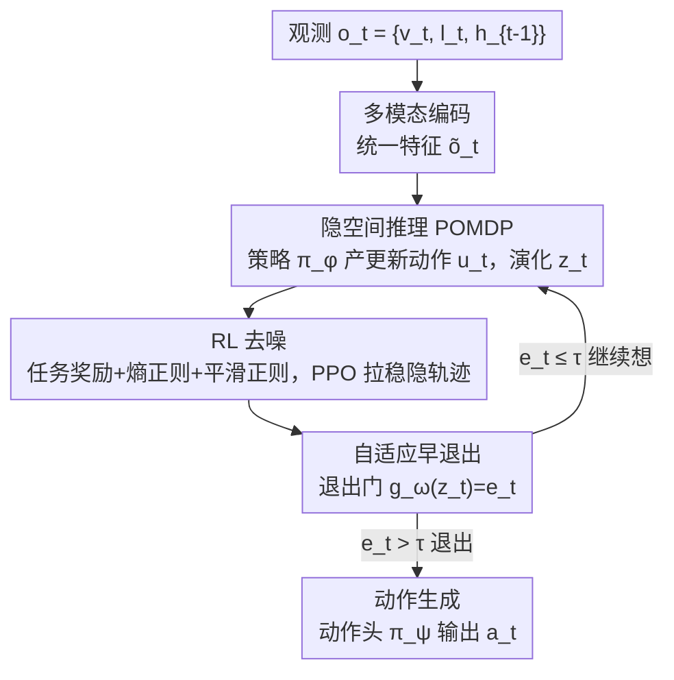

# Think Less, Act Early: Reinforced Latent Reasoning with Early Exit in Vision-Language-Action Models

**会议**: ICML2026  
**arXiv**: [2606.15099](https://arxiv.org/abs/2606.15099)  
**代码**: 待确认  
**领域**: 机器人/具身智能  
**关键词**: 视觉-语言-动作模型, 隐变量推理, 强化学习, 早退出, POMDP

## 一句话总结
针对显式思维链（CoT）在 VLA 里又慢又会误差累积的问题，作者提出 AVA-VLA——把推理建模成一串看不见的隐变量、用强化学习给隐轨迹去噪、再用早退出机制按状态置信度自适应地决定想几步，在 LIBERO 上拿到 98.3% 平均成功率的同时比显式 CoT 推理快约 6 倍。

## 研究背景与动机
**领域现状**：VLA（Vision-Language-Action）模型把视觉感知、语言理解和动作决策统一起来，为了在高维观测和低层动作之间搭桥，主流做法是生成显式的思维链（CoT）或分步计划——先把「为什么这么做」用文字推理出来，再决定动作（CoT-VLA、SpatialVLA 等）。

**现有痛点**：这种「展开式」推理有三宗罪。一是**慢**：逐 token 生成完整推理文本带来巨大计算开销，满足不了实时机器人的低延迟需求（CoT-VLA 单步延迟近 900ms）。二是**误差累积**：多步显式推理里，早期步骤一旦出错就会向后传播放大，让中间状态偏离任务目标。三是**依赖人工文本监督**，难以泛化到那些「说不出来的、直觉性的」物理技能。

**核心矛盾**：推理质量和推理效率之间存在 trade-off，而且显式文本推理还有 Turpin 等指出的「不忠实」风险——生成的文字未必反映模型真正的决策依据。把推理硬绑在自然语言上，本身就是个瓶颈。

**本文目标**：① 让推理摆脱逐 token 解码的开销与文本监督；② 在没有文本监督时仍保证隐式推理轨迹的稳定、不漂移；③ 让推理深度随任务难度自适应——简单任务快反应，复杂任务深思考。

**切入角度**：把推理看成**连续的隐动态**、直接对最终任务目标优化，而不是看成可解释的文字。隐演化照样能引导跨模态融合和动作生成，却省掉了 token-by-token 解码的代价。

**核心 idea**：用「隐变量序列 + RL 去噪 + 早退出」三件套替换显式 CoT——把隐状态生成建模成 POMDP 序列决策，用任务奖励把漂移的隐轨迹拉稳，再用门控按置信度提前终止推理。

## 方法详解

### 整体框架
AVA-VLA 的运行分三个阶段。**(a) 多模态编码**：把视觉 $v_t$、语言 $l_t$、历史 $h_{t-1}$ 编码成统一特征。**(b) 隐推理 + RL 去噪循环**（核心）：把推理过程建模成一个 POMDP——推理策略 $\pi_\phi$ 产生一个「内部更新动作」$u_t$ 来演化隐状态 $z_t$，这个循环用强化学习（带熵正则和平滑正则）优化以保证稳定；同时一个退出门 $g_\omega$ 持续评估当前状态够不够用。**(c) 动作生成**：一旦退出门触发（置信度 $e_t > \tau$），就把定稿的隐状态交给动作头 $\pi_\psi$ 直接输出机器人动作 $a_t$。整条链路的关键在于隐状态 $z_t$ 被放在决策的正中心，它是多模态观测的压缩与任务相关抽象，过滤掉原始输入的冗余和噪声。

### 关键设计

**1. 隐空间推理的 POMDP 建模：把「想」变成可优化的序列决策**

痛点是显式 CoT 又慢又会误差累积、还依赖文本监督。作者引入一个**不可观测的隐推理状态** $z_t \in \mathcal{Z}$，它不需要可解释的语义结构，纯粹是依赖决策过程、端到端学出来的隐状态。关键的一步是：不把隐推理当成一次前向计算或静态中间表示，而是建模成一个 POMDP $\mathcal{M}=(\mathcal{Z},\mathcal{O},\mathcal{U},P,R,\gamma)$——其中观测 $o_t=\{v_t,l_t,h_{t-1}\}$，而 $\mathcal{U}$ 是**隐推理更新动作空间**（注意：这不是环境交互动作，$u_t$ 只在模型内部起作用，控制隐状态怎么更新）。推理策略 $\pi_\phi(u_t \mid z_t, o_t)$ 在主实验里参数化为 64 维连续对角高斯（连续调制比离散选择器梯度更平滑、PPO 更稳），隐状态按增量形式演化：

$$\tilde{o}_t = \psi(o_t), \quad \Delta z_t = g_\theta(z_t, \tilde{o}_t, u_t), \quad z_{t+1} = z_t + \Delta z_t$$

具体可实现为 $\Delta z_t = \alpha(u_t) \odot \text{Transformer}_\theta(z_t, \tilde{o}_t)$，其中 $\alpha(u_t)$ 是由更新动作控制的门控系数。这样更新动作直接调节隐状态更新的幅度和方向，把「推理」变成一个可学习、可控的动态系统，而不是固定的、任务无关的状态更新规则。动作策略 $\pi_\psi(a_t \mid z_t, o_t)$ 再以隐状态为条件输出环境动作，整条轨迹 $\tau=\{(z_t,o_t,u_t,a_t)\}$ 由推理策略和动作策略联合生成，统一在最大化折扣累积奖励 $\max \mathbb{E}[\sum_t \gamma^t r(z_t,a_t)]$ 下端到端对齐任务目标。

**2. RL 去噪：用任务奖励把漂移的隐轨迹拉稳**

隐状态 $z_t$ 没有显式监督，在噪声输入、随机初始化或长程序列下容易**表示漂移**和误差累积，并把不稳定传给动作策略。作者的解法是给推理策略设计一个复合即时奖励：

$$r_t = r_{\text{task}}(a_t) - \lambda_1 \mathcal{H}\big(\pi_\phi(\cdot \mid z_t, o_t)\big) - \lambda_2 \lVert z_{t+1} - z_t \rVert^2$$

第一项 $r_{\text{task}}$ 是任务级奖励（如成功信号）衡量决策质量；第二项**熵正则**惩罚更新分布过度的不确定性，压住随机扰动；第三项**平滑正则**惩罚相邻隐状态的变化幅度，鼓励时序连续与稳定。三项分别从任务性能、随机性控制、表示稳定三个维度约束隐状态。值得注意的是平滑项不是逼状态静止不动，而是抑制噪声引起的无关更新、同时保留对任务关键信息变化的响应。优化上用 Actor-Critic：定义基于隐状态的价值函数 $V^\pi(z_t)$ 当 baseline，按策略梯度 $\nabla_\phi J \approx \mathbb{E}[\nabla_\phi \log \pi_\phi(u_t \mid z_t, o_t)(R_t - V^\pi(z_t))]$ 降方差；实现上用 **PPO + GAE**，把稀疏的任务成功信号经由学到的 critic 回传给每一步隐更新，从而给中间推理动作分配信用，而非只靠最终成功指标。

**3. 自适应早退出：按状态置信度动态决定想几步**

复杂度因任务、因时刻而异——很多时候浅层推理就够了，继续更新只是白白增加算力、还可能因噪声累积稀释状态判别力。作者引入一个参数化的**退出判定函数** $e_t = g_\omega(z_t)$，输入当前隐状态、输出一个标量置信度。推理期一旦 $e_t > \tau$ 就停止生成更新动作、直接执行动作 $a_t \sim \pi_\psi(a_t \mid z_t, o_t)$；否则继续迭代推理。这等于给模型装了「想得快 / 想得慢」的自适应开关：状态稳定时及时剪掉冗余计算。$g_\omega$ 在策略训练后用二值标签（额外推理是否带来小于某阈值的边际提升）单独标定，主实验取 $\tau=0.55$（由阈值敏感性扫描选出）。正是这个机制让平均推理步数从无早退出的 5.0 步降到 2.3 步，带来约 6 倍的整体提速。

### 损失函数 / 训练策略
整体目标是最大化折扣累积奖励（式 12），三套参数 $\phi$（推理策略）、$\theta$（转移）、$\psi$（动作策略）联合优化；RL 阶段用 PPO+GAE，奖励即上面的复合 $r_t$；退出门 $g_\omega$ 在主策略训练完成后用二值边际增益标签单独标定，再用阈值扫描定 $\tau$。

## 实验关键数据

### 主实验
LIBERO 四套件成功率（%），「一套策略管全部」组：

| 方法 | Spatial | Object | Goal | Long | Average |
|------|---------|--------|------|------|---------|
| TraceVLA | 84.6 | 85.2 | 75.1 | 54.1 | 74.8 |
| WorldVLA | 87.6 | 96.2 | 83.4 | 60.0 | 81.8 |
| $\pi_0$ | 96.8 | 98.8 | 95.8 | 85.2 | 94.2 |
| UnifiedVLA | 95.4 | 98.8 | 93.6 | 94.0 | 95.5 |
| OpenVLA-OFT | 97.7 | 98.0 | 96.1 | 95.3 | 96.8 |
| **AVA-VLA (Ours)** | **97.8** | **99.4** | **97.8** | **98.1** | **98.3** |

提升最显著的是 **Long（长程）套件**：从次优的 95.3 拉到 98.1，印证了 RL 去噪在长序列上抑制误差累积的作用。CALVIN ABC→D 上 AVA-VLA 在「一套策略管全部」与「每套件一策略」两组里也都拿到最高平均成功率。

### 效率/延迟分析（LIBERO-Spatial）

| 方法 | 平均步数 | 平均延迟(ms) | P90 延迟(ms) | 吞吐(Hz) |
|------|---------|-------------|-------------|----------|
| OpenVLA | 1.0 | 127 | 135 | 7.9 |
| CoT-VLA | 8.5 | 892 | 1,240 | 1.1 |
| PD-VLA | 1.0 | 76 | 82 | 13.2 |
| Ours (无早退出) | 5.0 | 312 | 340 | 3.2 |
| **Ours (完整)** | **2.3** | **145** | **189** | **6.9** |

### 关键发现
- **早退出是提速主力**：去掉早退出后平均步数 5.0、延迟 312ms；加上后步数降到 2.3、延迟降到 145ms，相比 CoT-VLA 的 892ms 约快 6 倍，而成功率不降反升。
- **隐推理 + RL 去噪共同保住长程稳定性**：Long 套件 98.1% 的成功率说明把推理放进隐空间并用平滑/熵正则约束，确实缓解了显式 CoT 的误差传播。
- **连续 vs 离散更新动作**：作者发现连续高斯调制比离散 Softmax 选择器梯度更平滑、PPO 更稳，故主结果采用连续 $\mathcal{U}\subset\mathbb{R}^{64}$。

## 亮点与洞察
- **把「推理」本身当成 RL 的优化对象**：以往 RL-for-VLA 多用于微调最终动作或输出文本，这篇把 RL 直接施加到**内部隐推理步骤**上去噪，是一个干净的视角迁移——推理质量第一次被信用分配机制（critic + GAE）直接打分。
- **早退出装在隐推理流而非解码头**：现有 VLA 提速（如 PD-VLA 的并行解码）大多动解码端，本文把早退出放到内部 deliberation 上，按不确定性自适应终止，提供了一条和解码加速正交的省算力路径。
- **POMDP 形式化给隐推理一个统一框架**：把隐状态演化写成 $(\mathcal{Z},\mathcal{O},\mathcal{U},P,R,\gamma)$，让「引入 RL、控制推理深度」都有了理论落点，这套抽象可迁移到其他需要内部多步 deliberation 的具身任务。

## 局限与展望
- 隐推理**牺牲了可解释性**：$z_t$ 刻意不带语义结构，相比显式 CoT 难以审计模型「为什么这么决策」，在安全敏感场景是个权衡。
- 退出阈值 $\tau$ 和正则权重 $\lambda_1,\lambda_2$ 需要标定/扫描，跨任务的自适应定标尚未给出；$g_\omega$ 的二值标定也依赖「边际提升」的人为阈值定义。
- 主结果在 LIBERO / CALVIN 仿真上验证，真机部署、视觉域偏移下隐轨迹是否仍稳定有待检验。
- 改进方向：把熵/平滑正则换成更有原理的轨迹约束；探索让退出门和推理策略联合训练而非两阶段标定。

## 相关工作与启发
- **vs CoT-VLA / SpatialVLA（显式 CoT）**：它们生成显式推理文本提升可解释性，但延迟高（CoT-VLA 892ms）且会误差累积；AVA-VLA 把推理搬进隐空间，速度快约 6 倍且长程更稳，代价是放弃文本可读性。
- **vs Coconut / Quiet-STaR（LLM 隐推理）**：同样把推理当连续隐演化，但本文根本区别在于把隐推理当**强化学习问题**、用任务奖励去噪；它们没有对隐轨迹做 RL 信用分配。
- **vs PD-VLA（效率方法）**：PD-VLA 用并行解码在**解码头**提速；AVA-VLA 的早退出作用在**隐推理流**，按状态置信度终止内部 deliberation，是正交的加速维度。

## 评分
- 新颖性: ⭐⭐⭐⭐⭐ 「隐推理 + RL 去噪 + 早退出」组合在 VLA 里是新颖且自洽的设计
- 实验充分度: ⭐⭐⭐⭐ LIBERO/CALVIN + 延迟分析齐全，但缺真机与更细的逐项消融
- 写作质量: ⭐⭐⭐⭐ POMDP 形式化清晰，三阶段框架好懂
- 价值: ⭐⭐⭐⭐⭐ 在保精度的前提下大幅提速，对实时机器人很有吸引力

<!-- RELATED:START -->

## 相关论文

- [\[ICML 2026\] Latent Reasoning VLA: Latent Thinking and Prediction for Vision-Language-Action Models](latent_reasoning_vla_latent_thinking_and_prediction_for_vision-language-action_m.md)
- [\[NeurIPS 2025\] ThinkAct: Vision-Language-Action Reasoning via Reinforced Visual Latent Planning](../../NeurIPS2025/robotics/thinkact_vision-language-action_reasoning_via_reinforced_visual_latent_planning.md)
- [\[ICML 2026\] LangForce: Bayesian Decomposition of Vision-Language-Action Models via Latent Action Queries](langforce_bayesian_decomposition_of_vision_language_action_models_via_latent_act.md)
- [\[CVPR 2026\] Cross-Hand Latent Representation for Vision-Language-Action Models](../../CVPR2026/robotics/cross-hand_latent_representation_for_vision-language-action_models.md)
- [\[CVPR 2026\] Fast-ThinkAct: Efficient Vision-Language-Action Reasoning via Verbalizable Latent Planning](../../CVPR2026/robotics/fast-thinkact_efficient_vision-language-action_reasoning_via_verbalizable_latent.md)

<!-- RELATED:END -->
