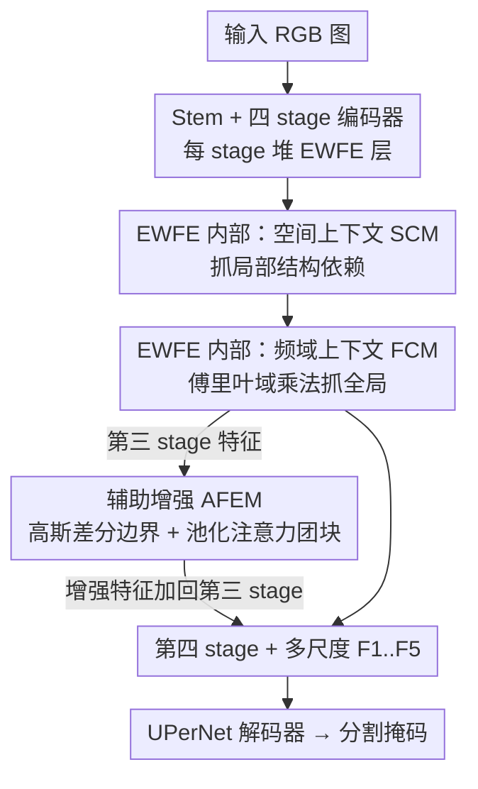

# Towards Effective Waste Segmentation for Automated Waste Recycling in Cluttered Background

**会议**: ICML 2026  
**arXiv**: [2606.13587](https://arxiv.org/abs/2606.13587)  
**代码**: 有（论文标注 Code / Webpage 链接）  
**领域**: 语义分割 / 频域增强 / 自动垃圾回收  
**关键词**: 垃圾分割, 频域上下文, 高斯差分, 边界增强, 轻量分割

## 一句话总结
针对自动垃圾回收里"杂乱背景 + 半透明/可变形废品 + 现有方法靠大 backbone 太重"的痛点，提出轻量分割网络 EWSegNet：用**空间域模块抓局部结构、频域模块抓全局上下文**级联互补，再加一个用**高斯差分 + 池化注意力**强化边界与团块（blob）的辅助增强模块 AFEM，在更小参数/更低延迟下达到与 SOTA 相当甚至更好的分割精度。

## 研究背景与动机
**领域现状**：城市化和人口增长让垃圾产量暴增（预计 2050 年年产可达 30 亿吨），自动垃圾回收（AWR）希望用深度学习把可回收物从固废里分出来，避免人工接触尖锐、不卫生的废品。现有做法从分类、检测一路做到分割，ZeroWaste、SpectralWaste 等数据集推动了这个方向。

**现有痛点**：当前最好的垃圾分割方法（FANet、COSNet 等）都**依赖大 backbone**，对追求实时、低功耗的 AWR 系统来说太重；而且它们大多源自**空间域的锐化卷积**（Laplacian、unsharp masking、high-boost），只能捕获很小的邻域上下文，一旦想抓全局关系就得加大卷积核，计算量和参数随核尺寸急剧膨胀。更糟的是，在**杂乱场景**——半透明、尺度多变、可变形的废品堆叠在一起——它们的分割性能会明显退化。

**核心矛盾**：要抓全局上下文 ↔ 空间域大核卷积代价太高。空间域滤波只适合小核，全局关系建模会让模型变重，与 AWR 的效率需求直接冲突。

**本文目标**：造一个**既高效又能在杂乱场景准确分割**的网络，具体拆成：(1) 用更省的方式建模全局上下文；(2) 在不加重模型的前提下强化半透明物体的边界与语义区域。

**切入角度**：作者抓住一个信号处理事实——**空间域的卷积等价于频域的逐点相乘**（$(f\star h)(x)\Leftrightarrow(H\cdot F)(\mu)$）。既然在空间域做全局卷积昂贵，那就搬到频域用乘法实现全局上下文建模；同理，边界增强用的高斯差分高通核也可以在频域设计，$H(u)=Ae^{-u^2/2\sigma_1^2}-Be^{-u^2/2\sigma_2^2}$（$A\ge B,\sigma_1>\sigma_2$）。

**核心 idea**：**空间域抓局部、频域抓全局，两者级联互补**；并用频域高斯差分 + 池化注意力做一个即插即用的辅助增强模块，专治杂乱场景下的边界模糊和团块丢失。

## 方法详解

### 整体框架
EWSegNet 输入一张 RGB 图，输出分割掩码，由**编码器 + 辅助特征增强模块（AFEM）+ 分割解码器**三部分组成。编码器分四个 stage，逐级下采样，每个 stage 由若干个 **EWFE（高效垃圾特征提取）层**堆叠，产出多尺度特征 $F_1,F_2,F_3,F_4$。关键的非常规设计是：**第三 stage 的特征会被抽出来送进 AFEM 做边界/团块增强，增强结果再加回第三 stage 特征、喂给第四 stage**——这等于在编码器中段注入一次"请关注半透明物体边界"的提示。最后四个 stage 的多尺度特征 + AFEM 增强特征 $F_5$ 一起送 UPerNet 解码器出掩码。

每个 EWFE 层内部串着三块：**空间上下文模块 SCM**（局部）→ **频域上下文模块 FCM**（全局）→ MLP。整条 pipeline 如下：

### 关键设计

**1. 空间上下文模块 SCM：用分组卷积 + 双路加权抓局部结构依赖**

针对"半透明、可变形废品的局部结构需要被精细捕获"，SCM 先用 $5\times5$ 分组卷积把输入 $X\in\mathbb{R}^{C\times H\times W}$ 投到 $\hat{X}\in\mathbb{R}^{3C\times H\times W}$，再沿通道切成 $X_1,X_2,X_3$ 三份。其中 $X_2,X_3$ 充当"权重生成器"来突出 $X_1$ 里的重要特征：对 $X_2$ 沿通道取均值再过 sigmoid 得空间权重，逐元素乘 $X_1$ 得 $\bar{X}$；对 $X_3$ 取空间均值再沿通道做 softmax 得通道权重，乘 $X_1$ 得 $\bar{\bar{X}}$。最后拼接两者过 $1\times1$ 卷积得 $X'$：

$$\bar{X}=X_1\cdot\sigma(CMean(X_2)),\quad \bar{\bar{X}}=X_1\cdot\rho(SMean(X_3)),\quad X'=Conv_{1\times1}(concat(\bar{X},\bar{\bar{X}}))$$

这是一种**空间 + 通道双路特征激励**，用很轻的算子（分组卷积 + 两次均值统计）就把局部显著结构挑出来，不必靠大核。

**2. 频域上下文模块 FCM：把全局卷积换成傅里叶域的逐点相乘**

这是全文效率的核心。要抓全局上下文，空间域得用大核卷积（贵）；FCM 改走频域：输入 $Z$ 先经 $1\times1$ 卷积分出 $Z_1,Z_2$，分别做傅里叶变换投到频域，在频域**逐点相乘**得 $\bar{Z}$，再逆傅里叶变换回空间域得 $Z'$。因为"频域相乘 ≡ 空间域卷积"，这一步等效于让模型学习一个**数据相关的全局卷积核**来聚焦任务关键信息，却只花了一次 FFT/IFFT + 逐点乘的代价，避开了大核卷积参数随核尺寸平方膨胀的问题。SCM（局部）和 FCM（全局）在 EWFE 里级联，正好在两个互补域上各取所长。

**3. 辅助特征增强模块 AFEM：高斯差分强化边界、池化注意力放大团块**

针对"杂乱场景下半透明物体边界模糊、团块语义易丢"，AFEM 有两个分支。**边界增强 BE**：把第三 stage 特征 $Y$ 傅里叶变换后分别乘两个不同 $\sigma_1,\sigma_2$ 的高斯函数，逆变换回空间得 $Y_{i1},Y_{i2}$，两者相减得到高频信息 $H_f$（这就是频域版的高斯差分，专抓边界）；再用 $Y$ 的空间均值算通道权重 $W_c$ 乘上 $H_f$ 增强相关通道，最后加回 $Y_{i2}$ 得边界强化特征 $Y_B$。**团块放大 BA**：$Y$ 过 $1\times1$ 卷积得 $Q,K,V$，$Q$ 经平均池化、$K$ 经最大池化在 $n\times n$ 邻域聚合，再与 $V$ 做自注意力得团块强化特征 $Y_A$。最后 $Y_B,Y_A$ 拼接过 $1\times1$ 卷积得增强特征 $Y_E$。BE 管"轮廓清不清"、BA 管"语义区域亮不亮"，两路互补地把杂乱场景里该关注的废品凸显出来。

### 损失函数 / 训练策略
基于 MMSegmentation 实现，UPerNet 解码器，编码器用 ImageNet-1k 预训练权重（预训练 600 epoch，Top-1 81.7%），解码器随机初始化。单张 Quadro RTX 6000、batch size 8，AdamW、初始学习率 5e-5，训练 40k 迭代；数据增强为随机缩放、随机裁剪到 $512\times512$、随机水平翻转。编码器四 stage 深度 (2,2,8,2)、通道 (80,160,320,640)。

## 实验关键数据

在三个高难度垃圾分割数据集上验证：**ZeroWaste-f**（4 类，半透明/可变形 + 杂乱）、**ZeroWaste-aug**（用 TACO 补金属/硬塑料缓解类不平衡）、**SpectralWaste**（6 类，含细长的胶带/灯丝，用 RGB 版）。指标为 mIoU 与像素精度。

### 主实验

ZeroWaste-f（效率与精度权衡，FLOPs 按 $512\times512$ 计）：

| 方法 | 编码器参数(M) ↓ | GFLOPs ↓ | 延迟(ms) ↓ | mIoU(%) ↑ | Pix.Acc(%) ↑ |
|------|------|------|------|------|------|
| FANet | 36.0 | 30.3 | 74.5 | 54.89 | 91.41 |
| FocalNet-B | 88.7 | 80.6 | – | 54.26 | 91.28 |
| COSNet | 27.3 | 24.4 | 73.6 | **56.67** | **91.91** |
| **EWSegNet** | **23.3** | **20.5** | **64.8** | 56.44 | 91.75 |

mIoU 与 SOTA 的 COSNet 基本持平（56.44 vs 56.67），但参数从 27.3M 降到 23.3M、延迟从 73.6ms 降到 64.8ms、GFLOPs 从 24.4 降到 20.5——**在更轻的预算下买到同档精度**。类别上 EWSegNet 在金属类 IoU 涨了 5.44%（35.05 vs COSNet 29.61）。

ZeroWaste-aug 与 SpectralWaste：

| 数据集 | 方法 | mIoU(%) ↑ | 备注 |
|------|------|------|------|
| ZeroWaste-aug | LWCHNet | 63.16 | 之前最好 |
| ZeroWaste-aug | **EWSegNet** | **74.10** | 绝对 +10.8% |
| SpectralWaste | COSNet | 69.96 | SOTA |
| SpectralWaste | **EWSegNet** | **71.03** | 且更高效 |

ZeroWaste-aug 上对 LWCHNet 取得 **+10.8% mIoU** 的大幅领先（作者归因于增强数据缓解类不平衡 + 本文模块）；SpectralWaste 上四类废品 IoU 更优，Cardboard 类绝对增益高达 4.63%（COSNet 仅在 Video Tape、Trash Bag 两类更好）。

### 消融实验（ZeroWaste-f）

| 配置 | FCM | SCM | AFEM | mIoU(%) | Pix.Acc(%) |
|------|------|------|------|------|------|
| Baseline | - | - | - | 47.32 | 90.77 |
| +SCM | - | ✓ | - | 51.63 | 90.89 |
| +FCM | ✓ | - | - | 53.05 | 91.54 |
| +FCM+SCM | ✓ | ✓ | - | 54.11 | 91.72 |
| **EWSegNet** | ✓ | ✓ | ✓ | **56.44** | 91.75 |

### 关键发现
- **FCM（频域全局上下文）单独贡献最大**：从 47.32 → 53.05（+5.73%），证明"用频域乘法替代大核卷积抓全局"既省又准，是效率与精度兼得的关键。
- **SCM 与 FCM 互补**：单 SCM +4.31%，叠加到 FCM 上再 +1.06%，说明局部与全局两域确实各补一块。
- **AFEM 收尾再 +2.33%**（54.11 → 56.44），可视化显示 BE 确实把边界提亮、BA 把团块区域强化，对杂乱场景的半透明物体尤其有效。
- **超参敏感**：初始学习率从 5e-5 调到 1e-4，mIoU 进一步升到 57.14%。

## 亮点与洞察
- **"频域相乘 ≡ 空间域卷积"被用得很到位**：把"全局上下文建模"这个一向靠大核/注意力的昂贵操作，换成一次 FFT + 逐点乘 + IFFT，等效学到数据相关的全局卷积核，是效率与精度兼得的根因——这个思路可迁到任何"想要全局感受野又怕变重"的密集预测任务。
- **频域高斯差分做边界增强**很巧妙：传统 DoG 是固定空间核，搬到频域后既能灵活设计高/低通核，又天然契合 FCM 已有的傅里叶基础设施，复用度高。
- **在编码器中段注入边界增强**（第三 stage 抽出→AFEM→加回→喂第四 stage）而非只在解码端做后处理，让深层编码器从一开始就"被提示"关注半透明物体轮廓，是个值得借鉴的注入位置。
- **务实的效率定位**：明确为 AWR 实时系统服务，论文不追求刷点而追求"同精度更轻"，这种 trade-off 表（参数/FLOPs/延迟同列）对落地工程很有参考价值。

## 局限与展望
- **mIoU 未真正超越 SOTA**：ZeroWaste-f 上 56.44 仍略低于 COSNet 56.67，卖点是效率而非精度上限；论文未给出在更强 backbone 下能否同时刷过精度的证据。
- **部分类别仍落后**：SpectralWaste 上 Video Tape、Trash Bag 等细长/薄物体仍被 COSNet 压制，说明频域全局上下文对极端细长结构的帮助有限。
- **FFT 的实际加速依赖实现**：频域操作理论省 FLOPs，但 FFT/IFFT 在小分辨率特征图上的实际墙钟收益、以及对硬件的友好度，论文只给了单卡延迟，缺更广的部署测评。
- **$\sigma_1,\sigma_2$、$n\times n$ 邻域等超参**对 AFEM 影响未充分消融，跨数据集泛化性有待验证。

## 相关工作与启发
- **vs COSNet / FANet（空间域增强 SOTA）**: 它们靠空间锐化卷积（小邻域 + 大 backbone）增强边界，重且全局上下文弱；本文用频域乘法抓全局 + 频域 DoG 抓边界，更轻且全局建模更强。
- **vs FocalNet-B 等大模型**: 88.7M 参数换来的 mIoU 反而不如 23.3M 的 EWSegNet，印证"堆 backbone 不是杂乱垃圾分割的正解"。
- **vs LWCHNet（轻量 Transformer）**: 论文指出轻量 Transformer 在杂乱场景仍难准确分割；EWSegNet 在 ZeroWaste-aug 上对其 +10.8%，说明空间×频域级联比纯 Transformer 更对症。
- **启发**：频域上下文 + 频域 DoG 这套"省成本拿全局/边界"的组合，可迁到医学图像、遥感等同样需要全局上下文又受算力约束的密集预测任务。

## 评分
- 新颖性: ⭐⭐⭐⭐ 把频域乘法用于全局上下文 + 频域 DoG 做边界增强，组合新颖但单个组件思路有先例。
- 实验充分度: ⭐⭐⭐⭐ 三个高难数据集 + 效率对比 + 逐模块消融完整，但缺细长类失败分析与跨 backbone 实验。
- 写作质量: ⭐⭐⭐⭐ 动机与频域原理交代清楚，模块描述细致；个别记号（$\bar{X}$/$\bar{\bar{X}}$）稍绕。
- 价值: ⭐⭐⭐⭐ 面向 AWR 实时落地，"同精度更轻更快"对工程部署很实用。

<!-- RELATED:START -->

## 相关论文

- [\[ICML 2026\] What Makes Synthetic Data Effective in Image Segmentation](what_makes_synthetic_data_effective_in_image_segmentation.md)
- [\[AAAI 2026\] A²LC: Active and Automated Label Correction for Semantic Segmentation](../../AAAI2026/segmentation/a2lc_active_and_automated_label_correction_for_semantic_segm.md)
- [\[CVPR 2025\] Effective SAM Combination for Open-Vocabulary Semantic Segmentation](../../CVPR2025/segmentation/effective_sam_combination_for_open-vocabulary_semantic_segmentation.md)
- [\[AAAI 2026\] Otter: Mitigating Background Distractions of Wide-Angle Few-Shot Action Recognition with Enhanced RWKV](../../AAAI2026/segmentation/otter_mitigating_background_distractions_of_wide-angle_few-shot_action_recogniti.md)
- [\[NeurIPS 2025\] Unveiling the Spatial-Temporal Effective Receptive Fields of Spiking Neural Networks](../../NeurIPS2025/segmentation/unveiling_the_spatial-temporal_effective_receptive_fields_of_spiking_neural_netw.md)

<!-- RELATED:END -->
