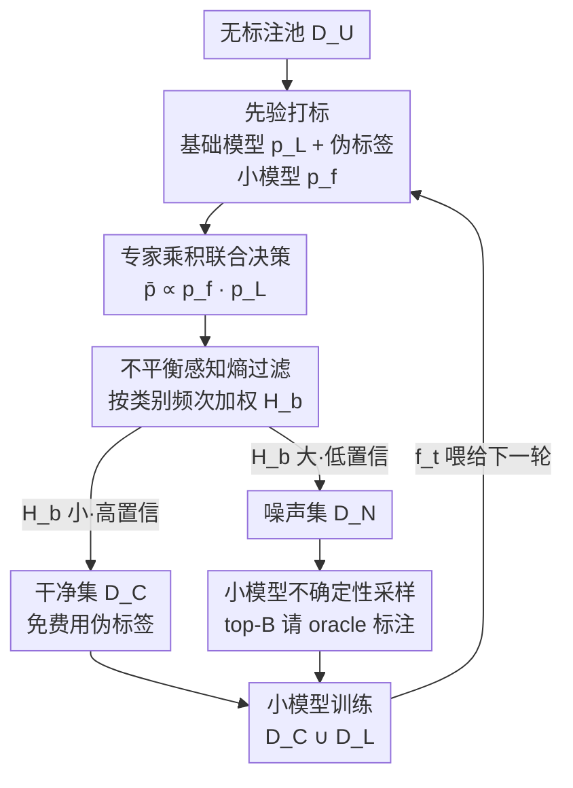

# Active Learning with Foundation Model Priors: Efficient Learning under Class Imbalance

**会议**: ICML2026  
**arXiv**: [2606.07630](https://arxiv.org/abs/2606.07630)  
**代码**: 待确认  
**领域**: 主动学习 / 标签高效学习  
**关键词**: 主动学习, 类别不平衡, 标签噪声, 基础模型先验, 专家乘积

## 一句话总结
这篇论文提出 PriorAL：用基础模型（大模型）的预测作为先验，与小模型做「专家乘积」联合决策，再用一个不平衡感知的熵过滤把无标注池切成「干净集（免费打伪标签）+ 噪声集（花预算请人标）」，从而在类别不平衡叠加标签噪声的图像/文本任务上，比最强主动学习基线省下 50%+ 的标注成本。

## 研究背景与动机
**领域现状**：主动学习（active learning）的核心思路是「不要无脑标全量数据，而是每轮只挑最有信息量的样本去问标注员」，以最小标注成本逼近全监督性能。近年一类工作专门处理类别不平衡，在采样时鼓励类别均衡、提升少数类覆盖。

**现有痛点**：真实数据集往往同时面临两个麻烦——**类别极度不平衡**（多数类样本海量、少数类寥寥）和**标注噪声**（标注员疲劳、感知不一致导致 oracle 给的标签本身就错）。在不平衡下，朴素地分配标注预算会把预算大量花在多数类上，少数类拿不到足够标注；而标签噪声又会进一步腐蚀少数类的训练。现有不平衡主动学习方法基本只管不平衡、不管噪声。

**核心矛盾**：基础模型（GPT、LLaMA、CLIP、SigLIP 这类）携带丰富先验，在低资源/不平衡场景能给出有价值的标注信号，按理说应该拿来用；但「基础模型主动学习」此前从没在**不平衡 + 标签噪声同时存在**的设定下被系统研究过。直接信基础模型的伪标签会引入伪标签噪声，直接信小模型又数据太少不靠谱。

**本文目标**：设计一个能同时扛住类别不平衡与标签噪声、且跨图像与文本两个域都通用的基础模型主动学习算法。

**切入角度**：作者不把基础模型当成贝叶斯意义上的概率先验，而是把它的预测当成「编码知识的提取」，作为引导后续采样的先验信息；再借经典的**专家乘积（Product of Experts, PoE）**框架，让基础模型和小模型的判断相乘、共同决定哪些样本该信、哪些该问人。

**核心 idea**：用「基础模型 × 小模型」的专家乘积做联合决策，配一个按类别频次加权的熵来切分「可免费用伪标签的干净集」与「必须花预算请人标的噪声集」，让标注预算精准砸在真正需要的样本上。

## 方法详解

### 整体框架
PriorAL（Foundation Model Priors-Informed Active Learning）是一个**按轮迭代**的池式主动学习算法。给定一个不平衡无标注池 $\mathcal{D}_U$、一个预训练基础模型 $M_L$、一个待训练小模型 $f$、以及每轮人工标注预算 $B$，每一轮 $t$ 走三个阶段：**先验打标 → 不平衡感知的不确定性采样 → 小模型训练**，训练好的小模型再喂给下一轮。整个流程的关键是：基础模型与小模型的决策**共同**影响样本选择，而不是单独信任任何一方。

### 关键设计

**1. 专家乘积联合决策：让大模型和小模型相乘投票，而不是二选一**

痛点是单独信谁都不行——基础模型有先验但不针对当前任务、小模型贴合任务但数据太少。作者借 Hinton 的专家乘积思想，把两者的类别概率**逐类相乘再归一化**，得到联合分布：

$$\bar{p}(x, y=i) = \frac{p_f(x,y=i)\cdot p_L(x,y=i)}{\sum_j p_f(x,y=j)\cdot p_L(x,y=j)}$$

其中 $p_L$ 是基础模型概率、$p_f$ 是小模型（上一轮的 $f_{t-1}$）概率。相乘的意义是「与」逻辑：只有当两个专家都对某类有较高概率时，联合分布才会在该类尖锐；只要有一个专家迟疑，联合分布就被拉平、熵升高。这样 $\bar{p}$ 同时编码了基础模型的预训练先验和小模型对当前任务的拟合能力，是后续过滤与采样的统一依据。

**2. 不平衡感知的加权熵过滤：用类别频次重标熵，把少数类样本留在干净集**

光用联合熵 $H(x)=-\sum_i \bar{p}\log\bar{p}$ 过滤会忽略类别不平衡。作者按伪标签所属类别的频次给熵加权：先统计每个类 $i$ 在当前无标注池里被基础模型判为该类的样本数 $w_i = |\{x\in\mathcal{D}^t_U : \hat{y}(x)=i\}|$，再定义**不平衡感知增强熵**：

$$H_b(x) = -\sum_i \Big(\bar{p}(x,y=i)\log\bar{p}(x,y=i)\cdot \frac{w_{\hat{y}(x)}}{w_{\max}}\Big)$$

$\hat{y}(x)=\arg\max_i p_L(x,y=i)$ 是基础模型给的伪标签，$w_{\max}=\max_i w_i$。这个权重 $w_{\hat y}/w_{\max}$ 对多数类样本≈1、对少数类样本则远小于 1，于是**少数类样本的 $H_b$ 被压低**。随后取 $H_b$ 最大的 top-$\rho|\mathcal{D}^t_U|$ 当噪声集 $\mathcal{D}_N$，其余进干净集 $\mathcal{D}_C$（带伪标签）。其净效果是：多数类里高熵、低置信的样本被推进噪声集去花预算请人标；少数类样本因 $H_b$ 被压低更容易落进干净集，用基础模型的伪标签**零成本**保留下来。这恰好对症——预算不浪费在已经海量的多数类上，少数类靠免费伪标签维持训练覆盖。$\rho$ 是控制噪声集大小的超参。（⚠️ 加权方向的直觉解释以原文公式为准。）

**3. 噪声集上的小模型不确定性采样：把有限预算砸在小模型最没把握的样本上**

干净集免费用伪标签即可，但噪声集里到底标哪几个？作者只在噪声集 $\mathcal{D}_N$ 上、用上一轮小模型的概率算不确定性分数：

$$U_f(x) = -\sum_i p_f(x,y=i)\log p_f(x,y=i)$$

挑 $U_f$ 最大（小模型最没把握）的 top-$B$ 个样本送 oracle 拿真标签，记为 $\mathcal{D}_t$，并入标注池。注意这一步**只看小模型的熵**而非联合熵——因为这些样本已被联合判定为「难/脏」，此时真正缺的是小模型自己最需要监督信号的那一批。最后小模型在「干净集（高置信伪标签）∪ 标注集（真标签）」$\mathcal{D}_C\cup\mathcal{D}^{t+1}_L$ 上训练得到 $f_t$，进入下一轮。整条流水线没有显式去噪模块，却因为「难样本交给人、易样本信伪标签」的分工，隐式地缓解了 oracle 标签噪声的影响。

### 损失函数 / 训练策略
小模型 $f$ 用标准多分类交叉熵在训练池 $\mathcal{D}_C\cup\mathcal{D}^{t+1}_L$ 上微调，其中干净集样本用基础模型伪标签、标注集样本用 oracle 真标签。算法跑 $T$ 轮，每轮预算 $B$，初始随机标注 $M$ 个样本冷启动；关键超参是噪声集比例 $\rho$。

## 实验关键数据

### 主实验
作者在 **21 个数据集设定**上做实验，覆盖文本（Trec、AGNews、SST-2）与图像（CIFAR-10、CIFAR-100、PathMNIST）两个域，并区分两类不平衡：merge imbalance 与 long-tailed imbalance；评测 10% 与 20% 标注成本下的**平衡池准确率 / 平衡测试准确率**。核心结论是相比最强主动学习基线，PriorAL 节省 **50%+** 标注成本仍保持性能与抗噪鲁棒性。下表摘取若干代表性「平衡池准确率」（同一格内两数对应 10%/20% 标注预算，节选自原文 Table 1）：

| 数据集（设定） | Random | BADGE | CORESET | 本文 PriorAL |
|----------------|--------|-------|---------|--------------|
| Trec（merge，文本） | 82.4 / 88.8 | 90.6 / 97.2 | 93.1 / 97.9 | 最优（详见原文） |
| CIFAR-10（merge，图像） | 71.5 / 77.6 | 73.6 / 86.2 | 77.2 / 85.4 | 最优（详见原文） |
| PathMNIST（long-tail，图像） | 52.0 / 61.5 | 65.6 / 82.7 | 68.7 / 78.4 | 最优（详见原文） |

> ⚠️ 原文 Table 1 数字以两列并排（10%/20%）密集排版，本文优于 Random/BADGE/CORESET/Confidence/Margin/GALAXY/DIRECT 等基线的具体单元格数值以原文为准；这里仅列基线量级供对照。

### 消融实验
论文核心组件可拆为三块，去掉任一块都会破坏「省预算又保少数类」的目标：

| 配置 | 作用 | 去掉后的预期影响 |
|------|------|------------------|
| Full（PriorAL） | PoE + 不平衡感知熵 + 不确定性采样 | 完整，50%+ 标注节省 |
| w/o PoE 联合决策 | 只用单模型概率 | 失去大模型先验或小模型任务适配，过滤/采样判断变差 |
| w/o 不平衡感知加权 | 退化为朴素熵 $H(x)$ | 忽略类别频次，少数类伪标签被误判进噪声集，平衡性下降 |
| w/o 不确定性采样 | 噪声集随机请标 | 预算浪费在小模型已会的样本上，标注效率下降 |

### 关键发现
- **最大贡献来自「不平衡感知加权 + 干净/噪声二分」**：它让少数类样本以零标注成本保留伪标签、把预算精准导向多数类中真正难的样本，这是省下 50%+ 标注的直接来源。
- **跨域通用**：图像与文本统一记号、统一流程，是首个在「不平衡 + 标签噪声」双重挑战下系统研究基础模型主动学习的工作。
- **隐式抗噪**：没有显式去噪损失，但「易样本信伪标签、难样本请人标」的分工天然降低了 oracle 噪声标签流入训练的比例。

## 亮点与洞察
- **专家乘积当主动学习的「联合裁判」很巧**：相乘的「与」语义让任一专家迟疑都会抬高熵，自然把「两个专家都拿不准」的样本筛出来，比单模型不确定性更稳健。
- **用类别频次重标熵来引导预算分配**，把「类别平衡」这个目标直接编进采样准则，而不是事后再平衡——可迁移到任何带不平衡的采样/筛选任务（如自训练里的伪标签筛选）。
- **「免费干净集 + 付费噪声集」的二分思路**把伪标签学习和主动学习缝在了一起，是可复用的标注成本压缩范式。

## 局限与展望
- **依赖基础模型先验质量**：当基础模型在目标域本身就差（伪标签系统性错误），PoE 与不平衡加权可能把错误伪标签固化进干净集，论文未充分探讨先验崩坏的边界。
- **加权熵的方向直觉需谨慎**：$w_{\hat y}/w_{\max}$ 对少数类的压低效应依赖伪标签分布近似真实分布，伪标签本身偏斜时权重统计会失真。
- **超参 $\rho$ 敏感性**：噪声集比例直接决定花多少预算请人标，论文给出最优值但跨数据集的稳健区间值得更多分析。

## 相关工作与启发
- **vs GALAXY / DIRECT（不平衡主动学习）**：它们靠采样策略促类别均衡但不引入基础模型先验、也不处理标签噪声；本文用 PoE 把大模型知识注入，并显式切分干净/噪声集同时管不平衡与噪声。
- **vs BADGE / CORESET / Margin（经典主动学习准则）**：这些只用单一模型的梯度/特征/边界做采样；本文是双模型联合 + 不平衡感知熵，在不平衡场景下标注效率更高。
- **vs 基础模型主动学习近作**：此前工作用标准准则或大模型驱动的查询策略，但未在不平衡叠加标签噪声下系统研究，本文补上这一空白。

## 评分
- 新颖性: ⭐⭐⭐⭐ 首个在「类别不平衡 + 标签噪声」双重挑战下系统研究基础模型主动学习，PoE + 不平衡感知熵的组合有新意。
- 实验充分度: ⭐⭐⭐⭐ 21 个设定跨图像/文本、两类不平衡、两档预算，覆盖面广。
- 写作质量: ⭐⭐⭐ 思路清晰，但 Table 1 密集排版可读性差，部分公式直觉需读者自行推敲。
- 价值: ⭐⭐⭐⭐ 50%+ 标注节省对真实不平衡标注场景有直接实用价值。

<!-- RELATED:START -->

## 相关论文

- [\[CVPR 2026\] Parameter-efficient Continual Learning for Enhancing Plasticity without Forgetting under Limited Model Capacity](../../CVPR2026/self_supervised/parameter-efficient_continual_learning_for_enhancing_plasticity_without_forgetti.md)
- [\[CVPR 2026\] Temporal Imbalance of Positive and Negative Supervision in Class-Incremental Learning](../../CVPR2026/self_supervised/temporal_imbalance_of_positive_and_negative_supervision_in_class-incremental_lea.md)
- [\[ICML 2026\] How 'Neural' is a Neural Foundation Model?](how_neural_is_a_neural_foundation_model.md)
- [\[ICML 2026\] InfoAtlas: A Foundation Model for Zero-Shot Statistical Dependence Estimation](infoatlas_a_foundation_model_for_zero-shot_statistical_dependence_estimate.md)
- [\[ICLR 2026\] Test-Time Efficient Pretrained Model Portfolios for Time Series Forecasting](../../ICLR2026/self_supervised/test-time_efficient_pretrained_model_portfolios_for_time_series_forecasting.md)

<!-- RELATED:END -->
