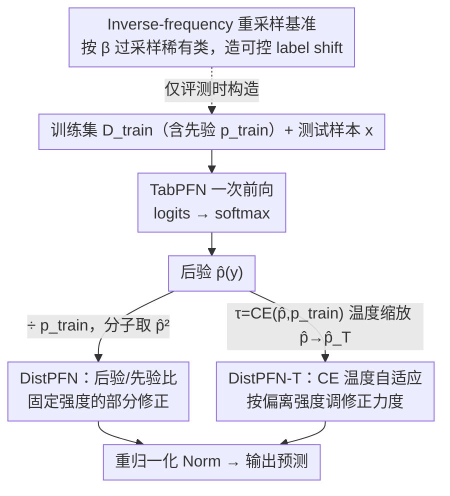

# Mitigating Label Shift in Tabular In-Context Learning via Test-Time Posterior Adjustment

**会议**: ICML 2026  
**arXiv**: [2605.04363](https://arxiv.org/abs/2605.04363)  
**代码**: https://github.com/seunghan96/DistPFN (有)  
**领域**: 表格基础模型 / 上下文学习 / 测试时适配 / 标签漂移  
**关键词**: TabPFN, label shift, 后验调整, 温度缩放, plug-in 修正

## 一句话总结
针对 TabPFN 这类把训练集当作 in-context 直接喂进 attention 的"表格基础模型"做后验校正——发现它会严重过拟合训练集 majority class, 提出 DistPFN：用 $\tilde{p}(y) \propto \hat{p}(y)^2 / p_{train}(y)$ 这一行后验重加权, 在 253 个 OpenML 数据集上把 TabPFN-v2 在 $\beta=5$ 强标签漂移下的准确率从 72.7% 拉到 76.9%, 不用重训、不用估测试先验、不动架构。

## 研究背景与动机
**领域现状**：表格分类长期被 XGBoost/LightGBM/CatBoost 等树模型统治, 但 2023 年的 TabPFN 提出"把整个训练集作为 prompt 喂给一个预训练 Transformer, 一次前向就得到全部测试预测", 把 in-context learning 这套范式带到表格领域; TabPFN-v2 (Nature 2025) 通过 dual-axis attention 进一步把规模和泛化做到 SOTA, 并衍生出 LoCalPFN、TabICL、TabFlex、MixturePFN 等一系列"表格基础模型 (Tabular FM)"。

**现有痛点**：作者发现这一整族模型有一个被普遍忽视的致命缺陷——**对训练集的类先验过度敏感**。在 CostaMadre1 这种类不平衡数据集上, TabPFN-v2 直接把 98.3% 的测试样本都预测成 majority class, 即使训练集和测试集是同一份分布也照预测不误。在他们考察的 253 个 OpenML 数据集里, 84.6% 是不平衡的, 也就是说这个缺陷影响绝大多数实际表格任务; 而且只要测试集的标签分布稍微偏离训练集 (label shift), 性能就断崖式下跌。

**核心矛盾**：经典 label shift 修正方法 (EME、BBE、Logit Adjustment、Balanced Softmax) 要么需要重训, 要么需要估计**测试集**的标签先验——但前者破坏 TabPFN 的 zero-shot 优势, 后者在大多数实际部署中根本拿不到。同时, 在标准 (无 shift) 设置下打开这些方法又会反过来掉点 (EME/BBE 在 LoCalPFN 上 w/o shift 时分别掉 1.5/1.1 个点)。所以问题的根源是: **现有方法要么要数据、要么要训练、要么破坏标准性能**。

**本文目标**：(1) 给出一个**完全免训练**的 plug-in 后验校正, (2) **不需要估计测试先验**, (3) 在 w/o shift 下保持基础模型原始性能, (4) 在 w/ shift 下随漂移强度增加给出越来越大的增益。

**切入角度**：作者观察到 TabPFN 一族和传统模型的根本区别——**训练集分布是被显式编码进 attention 的, 而不是被隐式编码进模型权重**。所以训练先验 $p_{train}(y)$ 在 TabPFN 这边是一个显式可见、可直接拿来计算的量, 而经典 label shift 方法因为只能看权重才不得不去估计先验。一旦把这个区别想清楚, 解法就变得非常直接。

**核心 idea**：把模型输出后验 $\hat{p}(y)$ 除以训练先验 $p_{train}(y)$, 再用归一化得到 $\tilde{p}(y) \propto \hat{p}(y)^2 / p_{train}(y)$, 等于"压住训练分布的拉力, 放大测试样本本身的证据"。

## 方法详解

### 整体框架
方法分三个紧凑组件: (1) 一个一行的后验调整公式 DistPFN; (2) 一个用 cross-entropy 自适应控制调整强度的温度缩放版本 DistPFN-T; (3) 一个 inverse-frequency 重采样的 benchmark 构造方法, 用来在 OpenML 上系统量化"漂移强度 $\beta$ vs 准确率"的曲线。整体 pipeline 是：取 TabPFN 一次前向得到的 logits → softmax → 乘 / 除调整因子 $\alpha$ → 重归一化 → 输出。整个调整发生在**推理时**, 完全 plug-in, 不改 TabPFN 任何参数或架构。下图自上而下展示这条推理链：基准只在评测时构造漂移训练集（虚线，不属于部署管线），DistPFN 与 DistPFN-T 是同一处后验调整的两种变体（实线分支）。

### 关键设计

**1. DistPFN：后验/先验比作为调整因子**

TabPFN 一族的病根是对训练集类先验过度敏感——在不平衡数据上能把 98.3% 的样本全押给 majority class。DistPFN 的修正只有一行：

$$\tilde{p}_{DistPFN}(y) = \mathrm{Norm}\!\left(\hat{p}_{TabPFN}(y) \cdot \frac{\hat{p}_{TabPFN}(y)}{p_{train}(y)}\right) = \mathrm{Norm}\!\left(\frac{\hat{p}_{TabPFN}(y)^2}{p_{train}(y)}\right)$$

其中 $p_{train}(y)$ 是训练集类频率，$\mathrm{Norm}(\cdot)$ 按类归一化。直觉是经典的"消除训练先验"（Saerens et al. 2002 的 $p(y|x) \propto p(y|x)/p(y)$），等于压住训练分布的拉力、放大测试样本自身的证据。

关键的不同在分子用 $\hat{p}^2$ 而非 $\hat{p}$。经典 prior correction 假设 $\hat{p}(y)$ 已经坍缩到 $p_{train}(y)$，于是把训练先验整除掉；但实际上 $\hat{p}(y)$ 并不会完全坍缩，"全除"就矫枉过正。平方分子保留了模型自己的预测信息，把矫正控制在"部分修正"——作者用 oracle 实验验证这个折中非常接近最优。

**2. DistPFN-T：用 CE 当温度做自适应缩放**

固定的 $\hat{p}^2/p_{train}$ 在弱 shift 时够用，强 shift 时却容易过调、把概率推到极端。DistPFN-T 引入一个自监控信号控制修正强度：取温度 $\tau = \mathrm{CE}(\hat{p}_{TabPFN}(y), p_{train}(y))$（预测与训练先验之间的交叉熵），先对预测做温度缩放 $\hat{p}_{TabPFN\text{-}T}(y=c) = \mathrm{softmax}(\hat{p}_{TabPFN}(y=c)/\tau)$，再代入

$$\tilde{p}_{DistPFN\text{-}T}(y) = \mathrm{Norm}\!\left(\hat{p}_{TabPFN}(y) \cdot \frac{\hat{p}_{TabPFN\text{-}T}(y)}{p_{train}(y)}\right)$$

这个 $\tau$ 的妙处在于它把"测试分布偏离训练分布多远"直接量化成缩放强度：预测越偏离训练先验 → $\tau$ 越大 → 缩放后预测越平滑 → 修正温和但持久；在 majority 案例里进一步放大 minority、在 minority 案例里反向温和化，起到双向 counterbalance 的作用。而且整个 $\tau$ 只用模型自身输出和已知训练先验算出来，不依赖任何外部信号。

**3. Inverse-frequency 重采样基准**

为了系统量化"漂移强度 vs 准确率"，作者只动训练集、不碰测试集，用一个标量 $\beta \geq 0$ 控制 label shift 强度。给每个类 $c_k$ 赋采样权重 $w_k = (1/p(y=c_k))^\beta$，归一化 $\tilde{w}_k = w_k / \sum_j w_j$ 后在训练集上按它过采样（用 oversample 而非 undersample，避免删数据丢信息）。$\beta = 0$ 是均匀重采样，$\beta$ 越大越偏向稀有类，训练分布也就越漂离测试分布。现有 label shift benchmark（如 TableShift）只有零星几个真实漂移点，画不出连续曲线；这套构造让作者能在 $\beta \in \{0, 0.1, 0.5, 1, 2, 5\}$ × 253 个数据集 × 5 个 seed 上做大规模可控评测，信号比真实 OOD 更干净。

### 损失函数 / 训练策略
完全不需要训练或微调, 整套方法都是 inference-time 的概率重加权。唯一的"超参"是要不要用 DistPFN-T (即是否启用温度缩放)。

## 实验关键数据

253 个 OpenML 数据集 (50/50 train/test split, 5 seed 平均), 6 个 $\beta$ 档位, 同时报告 w/o shift 和 w/ shift 平均。对比 16 个 baseline (含 LogReg/SVM/MLP/kNN/RF/LightGBM/CatBoost/FT-Transformer/TabM/RealMLP/LoCalPFN/TabICL/TabPFN-v2 等)。

### 主实验

| 方法 | $\beta=0$ | $\beta=0.1$ | $\beta=0.5$ | $\beta=1$ | $\beta=2$ | $\beta=5$ | 平均 (w/ shift) |
|---|---|---|---|---|---|---|---|
| CatBoost | 0.803 | 0.774 | 0.771 | 0.751 | 0.718 | 0.665 | 0.717 |
| RealMLP | 0.794 | 0.760 | 0.758 | 0.745 | 0.720 | 0.677 | 0.717 |
| TabPFN-v2 (base) | **0.818** | 0.797 | 0.796 | 0.790 | 0.782 | 0.759 | 0.775 |
| + DistPFN | 0.818 | 0.799 | 0.797 | 0.795 | 0.791 | 0.783 | 0.789 |
| **+ DistPFN-T** | **0.818** | **0.799** | **0.798** | **0.797** | **0.796** | **0.789** | **0.792** |
| + DistPFN-Oracle (上界) | 0.818 | 0.803 | 0.802 | 0.800 | 0.797 | 0.792 | 0.796 |
| TabICL (base) | 0.806 | 0.783 | 0.781 | 0.770 | 0.747 | 0.704 | 0.742 |
| TabICL + DistPFN-T | 0.806 | 0.786 | 0.786 | 0.783 | 0.780 | 0.771 | 0.777 |
| LoCalPFN (base) | 0.816 | 0.794 | 0.793 | 0.788 | 0.778 | 0.753 | 0.771 |
| LoCalPFN + DistPFN-T | 0.816 | 0.798 | 0.797 | 0.796 | 0.794 | 0.787 | 0.791 |

关键观察: $\beta=5$ 下 TabPFN-v2 + DistPFN-T 把 base 从 75.9% 推到 78.9%; TabICL 从 70.4% 推到 77.1% (+6.7pp); LoCalPFN 从 75.3% 推到 78.7%。三个不同的 FM, 提升都很一致, 说明方法是模型-agnostic 的。

### 消融实验

| 配置 | w/o shift | w/ shift (平均) | 说明 |
|---|---|---|---|
| TabPFN-v2 (base) | 0.818 | 0.775 | 起点 |
| + EME (Saerens 2002, EM 估测试先验) | 0.801 | 0.786 | 无 shift 时掉 1.7pp |
| + BBE (Lipton 2018, 黑盒估测试先验) | 0.805 | 0.789 | 无 shift 时掉 1.3pp |
| + DistPFN | 0.818 | 0.789 | **无 shift 无损** |
| **+ DistPFN-T** | **0.818** | **0.792** | **无 shift 无损 + 有 shift 增益最大** |
| + DistPFN-Oracle (用真实 $p_{test}(y)$) | 0.818 | 0.796 | 性能上界, 我们的差距仅 0.4pp |
| TableShift Diabetes OOD | base 0.589 → DistPFN-T 0.600 | — | 真实 OOD 也有增益 |
| TableShift Acsincome OOD | base 0.795 → DistPFN-T 0.799 | — | — |

### 关键发现
- **越漂移, 增益越大**: 当训练-测试 KL 散度增大时, DistPFN-T 在每个数据集上的准确率提升单调上涨, 印证了它是直接在"对抗 label shift"这件事上 work, 而不是偶然的正则化效果。
- **逼近 oracle**: 用真实测试先验做调整 (DistPFN-Oracle) 在 $\beta=5$ 下是 78.4%, 我们用预测后验代替的 DistPFN-T 是 78.9%——后者反而**略高**, 因为温度缩放在某些情况下比 "硬除真实 $p_{test}$" 更平滑、更不易过调。
- **不掉无 shift 性能是最大的 selling point**: EME/BBE 都在 w/o shift 下掉点 1–2pp, 严重影响 deployment 时是否敢打开这个开关; DistPFN/DistPFN-T 在 w/o shift 时严格保持原 base 性能 (因为 $\beta=0$ 时 $\hat{p}/p_{train} \approx 1$, 调整因子退化为单位), 所以可以默认打开。
- **single vs multiple instance 几乎没差**: TabPFN 支持单样本和批量两种调用方式, 调整因子分别用单样本预测或测试集平均预测算, 结果几乎一致, 说明方法对实现细节不敏感。
- **OpenML 上 84.6% 数据集本身就不平衡** (minority/majority 比例 < 1.0), 即使在 $\beta=0$ 的"无 shift"设置下问题也存在, 说明 majority-class bias 是 TabPFN 一族的系统性病而非边角案例。

## 亮点与洞察
- **"训练先验是显式可见的"这一观察是整篇论文的支点**——一旦明确 TabPFN 把整个训练集塞进 in-context, 那 $p_{train}(y)$ 就不再需要估计, 经典 label shift 文献里那一大堆 "估测试先验" 的工程就被绕开了, 论文用一张表 (Table 2) 干净利落地把 explicit/implicit 模型一刀分开, 这种 "重新审视范式差异" 的视角非常值得学。
- **$\hat{p}^2/p_{train}$ 的"部分修正"是个工程上的好品味**: 完全 prior correction ($\hat{p}/p_{train}$) 在实践中会过调, 因为模型实际不会真把训练分布编码到 $\hat{p}$ 里; 平方分子保留了模型 confidence, 让修正"温和而不极端"。
- **DistPFN-T 把 $\tau = \mathrm{CE}(\hat{p}, p_{train})$ 当温度**这个 self-monitoring 设计非常 elegant: 不依赖任何外部信号, 全程从模型自身的输出和已知的训练先验算出来, 完全 self-contained。
- **inverse-frequency oversample benchmark** 也是个可复用的方法贡献——以后做 label shift 评测都可以直接套这套 $\beta$ 控制器, 在固定测试集上拉一条连续曲线, 比真实 OOD 数据更可控。

## 局限与展望
- 方法理论上是为 explicit-prior 模型 (TabPFN 一族 + kNN) 设计的, 虽然论文 Table 2 也说"技术上可以用在树模型上", 但树模型的 $p_{train}$ 不那么"显式", 实际增益不在论文主体里展示, 说明可能没那么干净。
- 论文承认这是 partial correction 而非 full correction, 即使配上温度缩放, 离 oracle 还有 0.4pp 的小 gap; 完全闭合这个 gap 大概需要某种形式的轻量在线测试先验估计, 但那会破坏 "0 训练 0 估计" 的卖点。
- 自己发现的局限: (1) 只测了分类, 没碰回归任务的 label distribution shift; (2) 调整发生在 softmax 输出层, 如果模型本身的 logit 校准就有问题 (well-known 的 deep model overconfidence), 调整因子可能被 overconfident 预测放大; (3) 没分析在极少类 (例如 100 类 + 长尾) 上是否依然 work, 实验集中在中等类数 (≤10 类) 的 tabular 任务; (4) 温度 $\tau$ 用 CE 算可能在某些极端分布下溢出, 实际部署需要 numerical clamp。
- 改进思路: 可以把这套思想拓展到 calibration (用 prior 矫正 confidence)、用到 RAG-LLM 的输出分布矫正、或者结合 conformal prediction 给出带不确定性的 shift-robust 预测。

## 相关工作与启发
- **vs EME (Saerens 2002) / BBE (Lipton 2018)**: 这两个都需要迭代估测试先验, 在 w/o shift 下不可避免掉点; 本文不估测试先验, w/o shift 下严格无损, w/ shift 下增益更大, 是同条赛道上的明显进步。
- **vs Logit Adjustment / Balanced Softmax**: 它们都需要训练时改 loss, 不适用于已发布的 TabPFN-v2 这种 frozen FM; 本文是 inference-time plug-in, 任何 pretrained FM 拿来即用。
- **vs Drift-Resilient TabPFN (Helli 2024)**: 那是预训练阶段针对 temporal shift 设计的, 需要重训; 本文针对 label shift 做 test-time adaptation, 二者正交可叠加。
- **vs 一般 TTA (test-time training)**: TTA 大多需要在测试样本上反向传播更新模型权重, 计算成本高且容易出问题; 本文是纯前向 + 概率重加权, 几乎零额外计算成本。

## 评分
- 新颖性: ⭐⭐⭐⭐ "TabPFN 显式编码训练先验"这一观察 + 后验/先验比 + 温度缩放, 是个简单但锐利的组合, 之前没人这样做过。
- 实验充分度: ⭐⭐⭐⭐⭐ 253 个 OpenML + 6 个 $\beta$ + 5 seed + 3 个 FM + 真实 TableShift OOD + 对比 EME/BBE + oracle 上界, 评测密度非常高。
- 写作质量: ⭐⭐⭐⭐ Table 2 把 explicit/implicit 一刀切的图示和 Table 3 对比方法的小表很清晰, 整个推导线性顺畅。
- 价值: ⭐⭐⭐⭐ 一行 plug-in, 可直接装在任何 TabPFN-v2/LoCalPFN/TabICL 部署上, 工业落地价值高, 而且开拓了"利用 FM 显式先验"这一研究方向。

<!-- RELATED:START -->

## 相关论文

- [\[ICML 2026\] LimiX-2M: Mitigating Low-Rank Collapse and Attention Bottlenecks in Tabular Foundation Models](limix-2m_mitigating_low-rank_collapse_and_attention_bottlenecks_in_tabular_found.md)
- [\[ICML 2025\] Test-Time Training Provably Improves Transformers as In-Context Learners](../../ICML2025/self_supervised/test-time_training_provably_improves_transformers_as_in-context_learners.md)
- [\[ICLR 2026\] Test-Time Efficient Pretrained Model Portfolios for Time Series Forecasting](../../ICLR2026/self_supervised/test-time_efficient_pretrained_model_portfolios_for_time_series_forecasting.md)
- [\[CVPR 2026\] Energy Waveify and Redistribution for Test-Time Adaptation: A Control System Perspective](../../CVPR2026/self_supervised/energy_waveify_and_redistribution_for_test-time_adaptation_a_control_system_pers.md)
- [\[ICML 2026\] From Zero to Hero: Advancing Zero-Shot Foundation Models for Tabular Outlier Detection](from_zero_to_hero_advancing_zero-shot_foundation_models_for_tabular_outlier_dete.md)

<!-- RELATED:END -->
