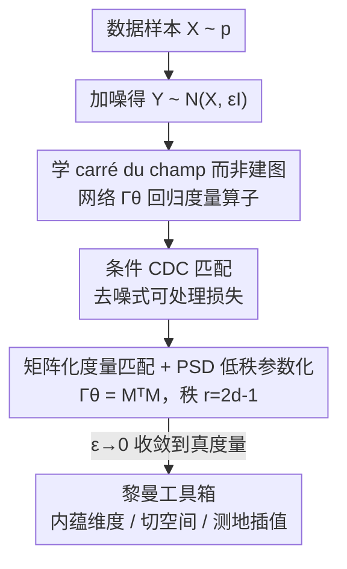

# Riemannian Metric Matching for Scalable Geometric Modeling of Distributions

**会议**: ICML 2026  
**arXiv**: [2606.14334](https://arxiv.org/abs/2606.14334)  
**代码**: 待确认  
**领域**: 表示学习 / 流形几何 / 扩散几何  
**关键词**: 黎曼度量、carré du champ、流形假设、去噪损失、摊销推理

## 一句话总结
把"数据流形的黎曼度量"重写成一个 carré du champ 算子，再用一条去噪式的条件回归损失让神经网络直接学这个算子，从而不建 kNN 图、不算大网络 Jacobian，就能在高维数据上以常数代价摊销地估计内蕴维度、切空间和测地路径，推理最高比基于 kNN 的扩散几何估计快约 400 倍。

## 研究背景与动机

**领域现状**：现实高维数据常常局部集中在低维结构上（流形假设）。要量化这种几何（内蕴维度、切空间、曲率），标准流程是先在样本上建一张图——稠密核图或 $k$-NN 图——再在图上做扩散几何 / 拉普拉斯算子的谱分析。

**现有痛点**：建图方法的计算与内存代价随样本量超线性甚至平方增长，而且这个代价在**推理时也躲不掉**：每来一个新点都要重算它的近邻，没法高效做样本外扩展。更糟的是它们依赖点对距离，而高维下欧氏距离趋于不可区分，图本身就失真。另一条线用训练好的 VAE/GAN/扩散模型的 Jacobian 反推几何，但这把代价转移到了推理时算大网络的 Jacobian，高维下既贵又数值不稳，且几何是从一个为别的目标训练的模型里"间接"抠出来的，缺乏收敛保证。

**核心矛盾**：想要的是一个"逐点的、可微的、与数据集规模无关的"度量估计器，但经典工具要么把代价绑死在点对距离/建图上，要么把几何寄生在别的模型里。

**本文目标**：训练一个神经网络**直接回归**每一点的黎曼度量，做到样本级训练、常数代价的摊销推理，并且有"数据局部是流形时收敛到真度量"的理论保证。

**切入角度**：关键观察是——刻画黎曼度量的 carré du champ（CDC）算子，可以写成对数据随机扰动的**条件期望**。条件期望天然适合去噪式回归（这正是扩散模型训练的套路）。

**核心 idea**：用去噪扩散里的条件回归思路去学 CDC 算子：把不可处理的"边际 CDC"换成一个可处理的"条件 CDC"，二者梯度相同，于是网络只需在"干净样本 $X$ + 加噪样本 $Y$"对上做回归，就把黎曼几何学了出来。

## 方法详解

### 整体框架

方法叫 **Riemannian metric matching（黎曼度量匹配）**。输入是从数据分布 $X\sim p$ 采来的样本，输出是一个以坐标 $Y$ 为输入、给出 $D\times D$ 半正定矩阵 $\Gamma_\varepsilon^\theta(Y)$ 的神经网络——这个矩阵就是该点的（扩散）黎曼度量张量。训练时不建任何图：对每个样本 $X$ 加一层高斯噪声得到 $Y\sim\mathcal{N}(X,\varepsilon\mathbf{I})$，网络去回归一个只跟单对 $(X,Y)$ 有关、$\mathcal{O}(1)$ 就能算出来的条件目标；推理时对任意新点一次前向即可拿到度量，不需要近邻。

理论支柱是扩散几何里的 carré du champ 恒等式：对拉普拉斯–贝尔特拉米算子 $\Delta_g$，

$$\Gamma_{\Delta_g}(f,h)=\tfrac{1}{2}\big(f\Delta_g h+h\Delta_g f-\Delta_g(fh)\big)=g(\nabla f,\nabla h),$$

也就是说"学会 CDC 算子"等价于"拿到黎曼度量 $g$"，进而能调用整套黎曼几何工具箱（内蕴梯度、局部维度、测地插值）。拿到度量后的下游用法：内蕴梯度 $\nabla f$ 是欧氏梯度在切空间上的投影；局部维度由度量矩阵特征值比估计；on-manifold 插值路径由内蕴梯度流给出。

### 关键设计

**1. 学 carré du champ 算子，而不是建近邻图**

痛点是建图/核方法的代价随规模爆炸、且高维下点对距离失效。本文绕开图，转去学一个**算子**——CDC。原因在于：在马尔可夫扩散算子理论里，任何生成元 $\mathcal{L}$ 都定义了双线性形式 $\Gamma_{\mathcal{L}}(f,h)=\tfrac12(f\mathcal{L}h+h\mathcal{L}f-\mathcal{L}(fh))$，而当 $\mathcal{L}$ 取 $\Delta_g$ 时它恰好等于度量 $g(\nabla f,\nabla h)$。一个很关键的性质是 CDC **不依赖一阶漂移项**：把含密度梯度的算子 $\mathcal{L}f=\Delta_g f-2g(\nabla\log p,\nabla f)$ 代入，漂移项因 Leibniz 法则相消，于是 $\Gamma_{\mathcal{L}}=\Gamma_{\Delta_g}$。这意味着即便数据密度不均匀，学到的 CDC 仍收敛到纯几何的度量，而不被采样密度污染——这是它比直接估 $\Delta_g$ 更干净的地方。

**2. 条件 CDC 匹配：把不可处理的目标换成去噪式条件回归**

直接回归"边际 CDC" $\Gamma_\varepsilon(f,h)(\mathbf{y})$（式 5 那个局部协方差）是不可处理的，因为它本身是个对邻域的期望，估它又要回到建图。本文的招法是：定义一个只跟单对 $(\mathbf{x},\mathbf{y})$ 有关的**条件 CDC**

$$\Gamma_\varepsilon(f,h)(\mathbf{x},\mathbf{y})=\frac{1}{2\varepsilon}\big(f(\mathbf{x})-f(\mathbf{y})\big)\big(h(\mathbf{x})-h(\mathbf{y})\big).$$

由于加噪选的是 $p_Y=p*\mathcal{N}(0,\varepsilon\mathbf{I})$，用贝叶斯规则可证边际 CDC 恰是条件 CDC 在 $Y=\mathbf{y}$ 下的条件期望：$\Gamma_\varepsilon(f,h)(\mathbf{y})=\mathbb{E}_X[\Gamma_\varepsilon(f,h)(X,\mathbf{y})\mid Y=\mathbf{y}]$。于是只需最小化条件损失 $\mathcal{L}^{CDC}_{cond}(\theta)=\mathbb{E}_{X,Y|X}\big[(\Gamma_\varepsilon^\theta(Y)-\Gamma_\varepsilon(f,h)(X,Y))^2\big]$。论文的 Theorem 3.1 给出关键保证：$\mathcal{L}^{CDC}_{cond}=\mathcal{L}^{CDC}_{marg}+C$，常数 $C$ 与 $\theta$ 无关，故两者梯度相同——优化可处理的条件损失，等于在优化那个不可处理的边际损失。这正是 DDPM 里"回归噪声 = 回归 score"那套去噪等价性的几何版：目标 $\mathcal{O}(1)$ 可算、可反传、样本间独立、天然适合 GPU mini-batch 与分布式训练。

**3. 矩阵化的度量匹配 + 半正定低秩参数化**

把上面的标量 $f,h$ 取成各个环境坐标函数 $x_k$，目标就从标量变成矩阵：条件目标为 $\tfrac{1}{2\varepsilon}(X-Y)(X-Y)^T$，损失是 Frobenius 范数

$$\mathcal{L}^{\text{Riem}}_{cond}=\mathbb{E}_{X,Y|X}\Big[\big\|\Gamma_\varepsilon^\theta(Y)-\tfrac{1}{2\varepsilon}(X-Y)(X-Y)^T\big\|_F^2\Big].$$

由于度量 $\Gamma_\varepsilon(Y)$ 按定义对称半正定（PSD），网络先输出矩阵 $M_\varepsilon^\theta(Y)$ 再令 $\Gamma_\varepsilon^\theta=M^TM$ 来强制 PSD。又因为环境维 $D$ 常远大于内蕴维 $d$，作者用**低秩**版 $M_\varepsilon^\theta(Y)\in\mathbb{R}^{r\times D}$ 把度量秩压到 $\le r$；论文证明取 $r=2d-1$ 总够（$r=d$ 一般不够，比如 2 维球面因"毛球定理"不可平行化）。低秩还带来一个工程红利：利用 $\|M^TM\|_F^2=\|MM^T\|_F^2$，损失可化简成只算 $r\times r$ 量、**永不显式构造 $D\times D$ 矩阵**，大幅省时省内存。若不想给内蕴维设硬上界，可改用 $\Gamma^\theta=M^TM+\lambda\mathbf{I}$ 的 Tikhonov 正则版保证严格正定。此外网络以 $\varepsilon$ 为条件输入，使同一个模型能同时刻画多尺度的几何。

### 损失函数 / 训练策略

最终训练目标即上面的低秩简化损失

$$\mathcal{L}_{LR}=\mathbb{E}_{X,Y|X}\big[\|M_\varepsilon^\theta(Y)M_\varepsilon^\theta(Y)^T\|_F^2\big]-\frac{1}{\varepsilon}\mathbb{E}_{X,Y|X}\big[\|M_\varepsilon^\theta(Y)(X-Y)\|^2\big],$$

（含 Tikhonov 时再加 $2\lambda\|M_\varepsilon^\theta(Y)\|_F^2$）。每步只需：从 $p$ 采 $X$、加噪得 $Y$、前向算 $M_\varepsilon^\theta(Y)$、按上式回传，无任何邻域构造或归一化常数。论文还给出"均值中心化"变体：先用去噪损失 $\mathbb{E}[((P_\varepsilon f)^\theta(Y)-f(X))^2]$ 学出局部平滑项 $P_\varepsilon f$，冻结后用中心化的条件 CDC 回归，对应一个标准去噪网络。理论上 Theorem 4.1 保证当数据局部是流形时 $\Gamma_\varepsilon\to$ 真度量（$\varepsilon\to0$），Corollary 4.2 进一步说环境坐标的 CDC 收敛到切空间投影矩阵。

## 实验关键数据

> 缓存全文止于理论小节，下表中带 ⚠️ 的定量值取自摘要/正文表述，精确数字**以原文为准**。

### 主实验

| 维度 | kNN / 核扩散几何 | 去噪 Jacobian 法 | 本文 Metric Matching |
|------|------------------|------------------|----------------------|
| 训练/估计代价 | 随样本量超线性~平方 | 需训练大网络 | 样本级、规模无关 |
| 推理代价 | 每个新点重算近邻 | 算大网络 Jacobian（贵且不稳） | 一次前向，摊销常数代价 |
| 高维图像 | 近邻失效、不可靠 | 高维数值不稳 | 可做 graph-free 分析 |
| 几何精度 | 基线 | 间接、缺保证 | 持平或更好 ⚠️ |
| 收敛保证 | 无限数据极限有 | 多数无 | $\varepsilon\to0$ 收敛到真度量 |

| 指标 | 数值 | 说明 |
|------|------|------|
| 摊销推理加速 | 最高约 $400\times$ ⚠️ | 相对基于 kNN 的扩散几何估计 |
| 几何精度 | 持平 / 改进 ⚠️ | 在已知流形上恢复正确几何 |
| 低秩充分秩 | $r=2d-1$ | 理论保证可完整分解度量 |

### 关键发现
- **去噪等价是全篇地基**：条件损失与边际损失仅差一个与参数无关的常数（Thm 3.1），所以"可处理的逐对回归"与"不可处理的邻域期望"梯度完全相同——这是把建图代价彻底消掉的根因。
- **CDC 自动去掉密度漂移**：一阶漂移项相消使估计的是纯几何而非采样密度，密度不均时仍稳。
- **低秩不只是省钱**：$\|M^TM\|_F=\|MM^T\|_F$ 让损失绕开 $D\times D$ 矩阵，使高维（如图像）可行，这正是 kNN 彻底失效的区间。

## 亮点与洞察
- **把扩散模型的去噪技巧搬到几何估计**：DDPM 教会我们"回归条件量 = 回归不可处理的边际量"，本文把这套等价性用在 carré du champ 上，等于给"无图的可微流形几何"找到一条可扩展训练路径——这个迁移很漂亮。
- **学算子而非学表示**：不同于从预训练 VAE/扩散模型 Jacobian 抠几何，这里把几何当成一等公民直接回归，因而带收敛保证，可信度更高。
- **可迁移性**：任何"想要逐点、可微、规模无关地估计某个由邻域期望定义的量"的任务（局部协方差、score 的二阶量）都能套用这套条件回归框架。

## 局限与展望
- 收敛保证要求数据局部为流形且 $\varepsilon\to0$；真实数据带噪、分支、变维时，有限 $\varepsilon$ 下的偏差—方差权衡如何选 $\varepsilon$ 仍是实践难点。
- 低秩需要预设秩 $r\ge 2d-1$，而内蕴维 $d$ 本身常是未知量，存在"为估维度先要知道维度"的循环，需配合维度自适应策略。
- 缓存未含完整实验表，精度是否在所有数据集上都"持平或更好"、$400\times$ 加速的具体设定，需回原文核实。
- 度量是 PSD 但学到的几何是否处处光滑、测地路径是否稳定，正文给了定性结果，定量鲁棒性可进一步考察。

## 相关工作与启发
- **vs kNN / 核扩散几何（Coifman & Lafon 2006）**：他们在邻域图上估 $\Delta_g$，无限数据有收敛保证但代价随规模爆炸且推理要重算近邻；本文用神经代理摊销，推理常数代价、可样本外扩展。
- **vs 去噪器 Jacobian 法（Kharitenko et al. 2025）**：他们证明高斯去噪器 Jacobian 收敛到切空间投影并用于黎曼优化，但把代价压到推理时算 Jacobian；本文直接回归度量、不需要 Jacobian。
- **vs 二阶 score 估计（Meng et al. 2021）**：本文损失与其估 $\nabla^2\log p$ 的损失最相关，但目标是几何度量而非 score，且强调 PSD/低秩可扩展训练。

## 评分
- 新颖性: ⭐⭐⭐⭐⭐ 把去噪条件回归等价性迁到 carré du champ，开出"无图、可微、规模无关"的流形几何学习路线
- 实验充分度: ⭐⭐⭐⭐ 覆盖维度估计/切空间/插值与高维图像，但缓存内可见的定量对比有限
- 写作质量: ⭐⭐⭐⭐ 理论链条清晰、动机扎实，符号偏重
- 价值: ⭐⭐⭐⭐⭐ 让扩散几何在大规模高维数据上变得可行，工具箱可被广泛复用

<!-- RELATED:START -->

## 相关论文

- [\[CVPR 2025\] From Prototypes to General Distributions: An Efficient Curriculum for Masked Image Modeling](../../CVPR2025/self_supervised/from_prototypes_to_general_distributions_an_efficient_curriculum_for_masked_imag.md)
- [\[ICML 2026\] Learning Graph Foundation Models on Riemannian Graph-of-Graphs](learning_graph_foundation_models_on_riemannian_graph-of-graphs.md)
- [\[ICML 2026\] Understanding Self-Supervised Learning via Latent Distribution Matching](understanding_self-supervised_learning_via_latent_distribution_matching.md)
- [\[CVPR 2026\] D2Dewarp: Dual Dimensions Geometric Representation Learning Based Document Image Dewarping](../../CVPR2026/self_supervised/d2dewarp_dual_dimensions_geometric_representation_learning_based_document_image_.md)
- [\[CVPR 2026\] Franca: Nested Matryoshka Clustering for Scalable Visual Representation Learning](../../CVPR2026/self_supervised/franca_nested_matryoshka_clustering_for_scalable_visual_representation_learning.md)

<!-- RELATED:END -->
