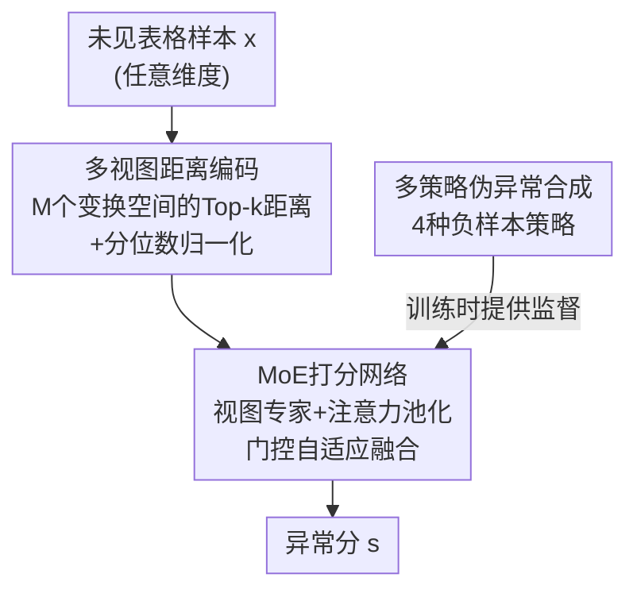

# Towards One-for-All Anomaly Detection for Tabular Data

**会议**: ICML 2026  
**arXiv**: [2603.14407](https://arxiv.org/abs/2603.14407)  
**代码**: https://github.com/Shiy-Li/OFA-TAD  
**领域**: 自监督 / 异常检测  
**关键词**: 表格异常检测、One-for-All、多视图距离、专家混合、伪异常合成

## 一句话总结
提出 OFA-TAD：用"邻居距离"作为跨域通用的异常线索，在多种特征变换诱导的度量空间里抽多视图距离表示，再用专家混合（MoE）门控自适应融合，训练一次即可直接泛化到未见过的表格数据集做异常检测，无需任何目标域微调。

## 研究背景与动机
**领域现状**：表格异常检测（TAD）几乎都是"一数据集一模型"（OFO，one model for one dataset）——每来一个新数据集就从头训一个检测器，常还要专门调超参甚至改架构。

**现有痛点**：OFO 范式有两个硬伤。① **训练成本高**：每个新域都要重训 + 超参搜索，大规模部署昂贵；② **泛化差**：模型容易过拟合源分布，遇到分布漂移就崩，迁移到未见域不可靠。

**核心矛盾**：想做"一个模型打通所有数据集"（OFA，one model for all）却卡在**语义鸿沟**——不同域的表格数据维度和特征语义都不一样（医疗看血压心率、金融看交易金额），异常模式往往是域特定而非通用的。直接对齐原始特征语义这条路走不通。

**本文目标**：拆成两个挑战。挑战 1：怎么找到**跨域通用**的异常模式？挑战 2：在没有目标域监督的情况下，怎么自动选到合适的变换、构造**鲁棒**的距离表示？

**切入角度**：异常的本质是"比正常点更孤立"，即异常样本离它的局部邻域异常地远。所以**邻居距离剖面**（Top-$k$ 最近邻距离序列）是一个语义无关的通用表示——不管是异常体检记录还是欺诈交易，它们的 Top-$k$ 距离序列都会呈现明显的"肘部 + 重尾"，这是共享的距离级异常签名。

**核心 idea**：但单一距离对特征变换极其敏感（同一样本在 Raw/标准化/分位数空间下的 Top-$k$ 邻居重叠可以很低，且各数据集偏好的最优变换各不相同）。于是把"不同变换下的邻居距离剖面"当作互补的**数据视图**，用 MoE 门控自适应融合多视图距离证据，得到对变换不敏感的鲁棒异常打分。

## 方法详解

### 整体框架
OFA-TAD 要解决"训一次、到处用"的表格异常检测。整条管线分三段：① **多视图距离编码**——把任意维度的表格样本统一编码成多个变换空间下的归一化邻居距离序列，拿到跨域可比的输入；② **MoE 打分网络**——每个视图配一个专家算视图内异常分，门控网络按样本自适应加权融合成最终分；③ **多策略伪异常合成**——一类设定下没有真异常，就合成多样伪异常把训练转成二分类，端到端优化。训练只在若干源数据集上跑一次；推理时对未见目标域，只拿它的训练划分当"上下文"做邻居检索和归一化，不重训不调参。

### 关键设计

**1. 多视图邻居距离编码：把异构表格变成跨域可比的统一表示**

不同域表格维度和语义都不同，没法直接喂进共享网络。OFA-TAD 不去对齐原始特征，而是用"异常即偏离局部邻域"这个域无关线索：对样本 $\mathbf{x}$，从训练集取 Top-$K$ 最近邻、算欧氏距离得固定长度序列 $\mathbf{d}=[d_1,\dots,d_K]^\top$——这一步就把变维特征压成了定长 token，统一了输入格式。

但单一距离不够。不同数据集偏好不同度量空间（有的异常只在标准化空间可分，有的只在秩空间冒出来），所以构造 $M$ 个变换 $\mathcal{T}_m$（Raw / Standardized / MinMax / Quantile）诱导的度量空间，每个视图算一条距离序列 $\mathbf{d}^{(m)}$。再用**分位数归一化** $\hat{d}_k^{(m)}=\text{QuantileTransform}(d_k^{(m)})$ 把绝对距离（跨域能从 $10^{-2}$ 到 $10^{5}$）映成 $U[0,1]$ 上的相对概率，消除量纲差异、稳住优化。这样每个样本由 $M$ 条归一化距离序列表示，天然跨域可比。

**2. MoE 打分网络：让模型按样本自适应挑最可信的距离视图**

多视图给了一堆候选距离模式，但它们可信度不等——一个变换在某数据集上提升可分性，在另一个上反而误导。简单拼接或均匀平均会用次优视图的噪声稀释最强信号。OFA-TAD 用 MoE 做样本级自适应融合，内部有三个零件协同：

- **位置嵌入**：邻居距离是有序序列（从最近到最远），早期排名常反映局部密度变化、对异常更关键。先把每个距离值投到 $D$ 维 token，再加可学习位置嵌入 $\mathbf{H}^{(m)}=\text{LayerNorm}(\text{MLP}^{(m)}_{\text{enc}}(\hat{\mathbf{d}}^{(m)}))+\mathbf{P}_{pos}$，让专家能区分"近邻偏差"和"尾部偏差"。
- **注意力池化**：每个排名对异常判断的贡献是样本相关的，固定均值池化会把有用和无用邻居混在一起。改用注意力学内容相关的聚合权重 $\alpha_k^{(m)}=\text{Softmax}(\mathbf{w}^\top\sigma(\mathbf{W}\mathbf{H}_k^{(m)}))$，$\mathbf{h}^{(m)}=\sum_k\alpha_k^{(m)}\mathbf{H}_k^{(m)}$，聚焦少数关键邻居、压制无关项，提升距离证据的信噪比。位置嵌入给的是"第 $k$ 名含义一致"的结构先验，注意力给的是"当前样本哪几名最有信息量"的自适应性，二者互补。
- **专家打分 + 门控融合**：每个专家从 $\mathbf{h}^{(m)}$ 出一个视图分 $s^{(m)}=\text{MLP}^{(m)}_{\text{score}}(\mathbf{h}^{(m)})$；门控网络看所有专家嵌入预测视图权重 $\mathbf{g}=\text{Softmax}(\text{MLP}_{\text{gate}}(\text{Concat}[\mathbf{h}^{(1)},\dots,\mathbf{h}^{(M)}]))$，最终分 $s=\sigma(\sum_m g_m s^{(m)})$。门控**看高层嵌入而非原始距离**来判断"这个剖面干不干净、可不可分"，从而对任意未知目标域都能把权重压到信息量高的视图上，降低对变换敏感性。

**3. 多策略伪异常合成：在一类约束下造出多样负样本，把训练变成二分类**

一类设定（训练只有正常样本）下纯一类目标优化不稳，DeepSVDD 那类还会出现超球坍缩。OFA-TAD 合成伪异常、把训练 recast 成二分类，且故意造**四种互补**的异常以扩大覆盖、避免偏置决策边界：① **流形外推** $\mathbf{x}_{neg}=\mathbf{x}_b+\alpha(\mathbf{x}_b-\mathbf{x}_a)$ 模拟流形边界外的异常；② **簇间插值** $\mathbf{x}_{neg}=\beta\mathbf{x}_a+(1-\beta)\mathbf{x}_b$（$\mathbf{x}_a,\mathbf{x}_b$ 来自不同簇）造低密度区样本；③ **噪声注入**（高斯/均匀）模拟测量误差；④ **特征掩码**随机遮特征模拟数据损坏。用合成异常（$y_i=1$）和正常样本（$y_i=0$）以 MSE 端到端训练：

$$\mathcal{L}=\frac{1}{n_{train}}\sum_{i=1}^{n_{train}}(s_i-y_i)^2.$$

在多个源数据集的正常样本 + 多策略伪异常上训练，OFA-TAD 学到的是一条**可迁移的决策边界**，从而泛化到未见域。

### 损失函数 / 训练策略
端到端 MSE 回归异常分。只在 7 个源数据集上训练一次、15 epoch，Adam（lr $5\times10^{-4}$，weight decay $2\times10^{-5}$），无 lr 调度。Top-$K$ 取 $K=80$，MoE 嵌入维 128，每专家 2 层 MLP（隐层 64）。**所有数据集共用同一套超参、不做逐数据集调参**；推理时仅用目标域训练划分当上下文做邻居检索与距离归一化。

## 实验关键数据

在 ADBench 的 34 个数据集（14 个域）上评测，7 个数据集训练、34 个测试，分"域内"和"域外"两块。主指标 AUROC/AUPRC，另报 F1 和平均秩。所有基线都按对它们最有利的 OFO 范式（一数据集一模型）评，而 OFA-TAD 全程不重训。

### 主实验（AUROC，节选，加粗为各行最优）

| 数据集 | 类型 | iForest | MCM | DRL | DisentAD | OFA-TAD |
|--------|------|---------|-----|-----|----------|---------|
| abalone | 域内 | 0.7371 | 0.7450 | 0.8071 | 0.7789 | **0.8178** |
| donors | 域内 | 0.9029 | 0.9965 | 0.9002 | 0.9073 | **0.9997** |
| pendigits | 域内 | 0.9642 | 0.9842 | 0.9391 | 0.9932 | **0.9990** |
| shuttle | 域内 | 0.9964 | 0.9986 | 0.9983 | 0.9993 | **0.9998** |
| amazon | 域外 | 0.5080 | 0.5201 | 0.5070 | 0.5465 | **0.5469** |
| Wilt | 域外 | 0.4816 | 0.7485 | 0.7790 | 0.7543 | **0.8102** |
| **Average (34)** | — | 0.7808 | 0.8102 | 0.8176 | 0.8140 | **0.8345** |

读法：单个数据集的"赢家"很分散（反映表格域强异质、没有单一归纳偏置通吃），但 OFA-TAD 的**平均 AUROC 0.8345 全场最高**，且在严格 OFA 设定（从不重训、只用目标域训练划分当上下文）下仍稳压所有 OFO 基线，连域外块都保持竞争力。

### 消融实验（平均 AUROC/AUPRC/F1）

| 配置 | AUROC | AUPRC | F1 | 说明 |
|------|-------|-------|-----|------|
| OFA-TAD（完整） | 0.8345 | 0.6629 | 0.6352 | — |
| w/o Gating | 0.8218 | 0.6498 | 0.6211 | 改均匀融合 |
| w/o MoE | 0.8204 | 0.6448 | 0.6177 | 去专家、非参池化 |
| w/o Attention | 0.8187 | 0.6383 | 0.6029 | 注意力→均值池化（掉最多） |
| w/o Position | 0.8281 | 0.6404 | 0.6124 | 去位置嵌入 |
| w/o Noise Inject | 0.8203 | 0.6011 | 0.5788 | 去噪声注入 |
| w/o Extrapolation | 0.8190 | 0.6061 | 0.5781 | 去流形外推 |

### 关键发现
- **注意力池化贡献最大**：去掉它 AUROC 从 0.8345 掉到 0.8187，说明异常信号稀疏时"显式给邻居证据加权"最关键。
- **四种合成策略都有用，但不等价**：去噪声注入或流形外推掉点最多，去簇间插值/特征掩码掉得少——前两者提供的互补监督更强。
- **少量上下文即可稳定推理**：上下文比例从 0.1 到 1.0，Parkinson 在约 0.3 就饱和，说明少量目标域正常样本就够做可靠的 on-the-fly 推理，不确定带也随上下文增多收窄。
- **门控权重确实因域而异**：可视化显示 Std 在 fraud/Parkinson 上权重高，MinMax 在 amazon/optdigits/Wilt 上被偏好，Raw/Quantile 普遍权重低——印证"最优距离视图跨域不同、门控能自适应选"的动机。

## 亮点与洞察
- **把"异常即孤立"做成跨域统一表示**：邻居距离剖面是个语义无关的好 token——一招绕开表格数据维度/语义不一致的语义鸿沟，是 OFA 能成立的根。这个"用结构而非语义对齐异构数据"的思路可迁移到其他异构模态。
- **把"变换敏感"从缺点变成多视图资源**：别人头疼于"该选哪个归一化"，本文索性把多个变换当互补视图、用门控让模型自己挑，巧妙地把一个调参难题转成了可学的融合问题。
- **MoE 门控看嵌入而非原始距离**：门控基于高层视图嵌入判断"剖面干不干净"，比直接看距离更能判可靠性，这个设计细节是跨域自适应的关键。
- **严格 OFA 协议下仍赢 OFO 基线**：基线享受逐数据集训练的优势还是平均输，说明上下文式邻域建模对跨域 TAD 是真有效，落地价值高（省去每个新域重训）。

## 局限与展望
- **依赖目标域上下文与邻居检索**：推理要用目标域训练划分当上下文做 KNN，上下文太少（如比例 0.1）时性能明显下降；纯冷启动、无任何目标域正常样本的场景未覆盖。
- **赢家分散、单点不一定最强**：很多单个数据集 OFA-TAD 并非最优，优势体现在平均和秩上；对某些特定域，专门训的 OFO 模型仍可能更好。
- **距离线索的固有盲区**：方法建立在"异常更孤立"假设上，对那种局部密度正常但全局语义异常、或高维下距离失效（维度灾难）的异常，邻居距离可能抓不住。
- **变换集合固定**：只用了 4 种变换视图，是否对所有未见域都够、是否需要可学习/可扩展的变换库，作者未深入。

## 相关工作与启发
- **vs OFO 深度 TAD（DeepSVDD / MCM / DRL / DisentAD）**：它们一数据集一模型、靠一类目标学边界，本文改成一次训练多源、用伪异常转二分类避免超球坍缩，并直接跨域泛化。
- **vs 经典方法（iForest / LOF / KNN）**：经典法靠手工启发式、难抓非线性关系且仍是逐数据集，本文用可学习多视图距离 + MoE 融合统一建模。
- **vs 其他模态的 OFA 异常检测（图像 / 图）**：图像、图上已有通用 OFA 检测器，表格因语义鸿沟一直空白，本文用邻居距离这个语义无关表示补上了表格这一块。
- **vs 朴素多视图融合（拼接/平均）**：朴素融合忽略视图可信度差异、会被次优视图噪声稀释，本文用门控做样本级自适应加权，针对性更强。

## 评分
- 新颖性: ⭐⭐⭐⭐⭐ 首次把 TAD 从 one-for-one 推到 one-for-all，邻居距离+多视图门控的组合很巧。
- 实验充分度: ⭐⭐⭐⭐ 34 数据集/14 域、域内域外分块、消融与上下文鲁棒性都齐，但缺更强冷启动/极端高维分析。
- 写作质量: ⭐⭐⭐⭐ 两挑战驱动、动机到设计一一对应，叙述清晰。
- 价值: ⭐⭐⭐⭐ 省去每个新域重训，对大规模表格异常检测部署有实际意义。

<!-- RELATED:START -->

## 相关论文

- [\[NeurIPS 2025\] One Filters All: A Generalist Filter for State Estimation](../../NeurIPS2025/self_supervised/one_filters_all_a_generalist_filter_for_state_estimation.md)
- [\[ICML 2026\] From Zero to Hero: Advancing Zero-Shot Foundation Models for Tabular Outlier Detection](from_zero_to_hero_advancing_zero-shot_foundation_models_for_tabular_outlier_dete.md)
- [\[NeurIPS 2025\] TabSTAR: A Tabular Foundation Model for Tabular Data with Text Fields](../../NeurIPS2025/self_supervised/tabstar_a_tabular_foundation_model_for_tabular_data_with_text_fields.md)
- [\[ICML 2025\] Towards Benchmarking Foundation Models for Tabular Data With Text](../../ICML2025/self_supervised/towards_benchmarking_foundation_models_for_tabular_data_with_text.md)
- [\[NeurIPS 2025\] TabArena: A Living Benchmark for Machine Learning on Tabular Data](../../NeurIPS2025/self_supervised/tabarena_a_living_benchmark_for_machine_learning_on_tabular_data.md)

<!-- RELATED:END -->
