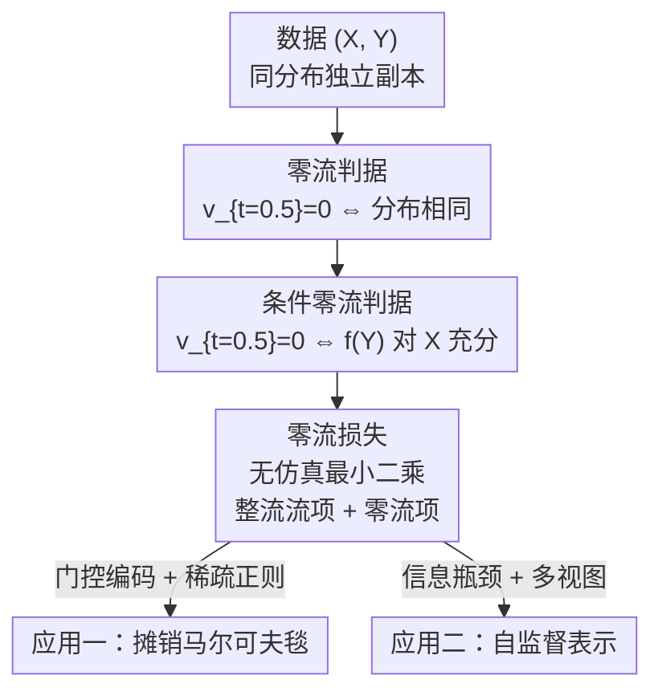

# Zero-Flow Encoders

**会议**: ICML2026  
**arXiv**: [2602.00797](https://arxiv.org/abs/2602.00797)  
**代码**: https://github.com/probabilityFLOW/zfe  
**领域**: 自监督学习 / 表示学习 / 流模型  
**关键词**: 整流流、零流判据、条件独立、马尔可夫毯、捷径问题  

## 一句话总结
论文发现一个反直觉现象——用独立耦合训练的整流流（rectified flow）在 $t=0.5$ 处处为零当且仅当源/目标分布相同（"零流判据"），并把它推广到条件分布，证明 $\mathbf{v}_{t=0.5}=0$ 等价于编码器 $f(Y)$ 对预测 $X$ 充分（条件独立），由此设计出一个无需仿真、无需参数化密度假设的最小二乘损失，统一地学习图模型中的马尔可夫毯和自监督表示，并天然规避对比学习的"捷径问题"。

## 研究背景与动机

**领域现状**：扩散模型、流匹配这类连续时间流方法在图像合成、时序预测、基于仿真的推断里大获成功，它们学一个时变速度场把样本从简单源分布逐步搬到复杂目标分布，擅长捕捉复杂分布的细微结构。近来也有人把流方法用到生成以外的任务（异常检测、条件独立性检验、强化学习策略参数化）。

**现有痛点**：表示学习的经典任务——从冗余特征里抽取充分的摘要信息——长期依赖两类手段，各有硬伤。一类是参数化图模型 + lasso 子集选择来找马尔可夫毯，需要对数据分布做参数假设、还得处理棘手的归一化项；另一类是对比学习（如 SimCLR），通过最大化两视图表示的互信息来学语义，但**互信息最大化的贪心性导致"捷径问题"**——只要找到一个易区分正负对的肤浅特征（比如水印），损失就迅速饱和，模型再也没动力去学"狗""马"这种高层语义。

**核心矛盾**：充分性（sufficiency）的本质是一个**条件独立**约束 $X\perp\!\!\!\perp Y\mid f(Y)$，等价于条件分布相等 $p_{X\mid Y}=p_{X\mid f(Y)}$。但现有方法要么用参数化密度近似这个约束、要么用互信息这类替代目标去逼近，都不是直接、无假设地检验"两个条件分布是否相等"。

**本文目标**：找到一个既能严格检验条件分布相等、又无需参数化密度假设、还能写成可优化损失的判据，把"马尔可夫毯发现"和"自监督表示学习"两个看似不同的任务统一到同一个充分信息学习框架下。

**切入角度**：作者从一个观察出发——独立耦合的整流流在中点 $t=0.5$ 似乎会"停住"。如果这个"零流"现象真的当且仅当两分布相同时成立，那它就是一个天然的分布相等检验器，可以被改造成充分性判据。

**核心 idea**：用"中点速度场是否为零"这个流模型的几何性质，替代互信息/参数化密度，来强制条件独立、从而学到充分编码。

## 方法详解

### 整体框架

方法分三步走：先在**无条件**情形发现并证明零流判据（$\mathbf{v}_{t=0.5}=0 \iff p_X=p_{X'}$），再把它**推广到条件分布**（证明存在一个修改版整流流，其中点速度场为零当且仅当 $p_{X\mid Y}=p_{X\mid f(Y)}$，即 $f$ 对预测 $X$ 充分），最后把这个判据写成一个**无仿真的最小二乘损失**，分别实例化到马尔可夫毯学习和自监督表示学习两个应用。整条链路不需要数值求解 ODE，也不需要对数据分布做任何参数化假设。

### 关键设计

**1. 零流判据：把"分布相等"翻译成"中点速度场为零"**

这是全文的理论基石，针对"如何无假设地检验分布相等"这一痛点。整流流通过插值路径 $X_t=tX+(1-t)X'$ 学一个速度场，最小化 $\mathbf{v}_t:=\arg\min_{\mathbf{u}_t}\int_0^1\mathbb{E}\|X'-X-\mathbf{u}_t(X_t)\|^2\mathrm{d}t$，其总体最优解为 $\mathbf{v}_t(\mathbf{z})=\mathbb{E}[X'-X\mid X_t=\mathbf{z}]$。一个自然的疑问是：若 $p_X=p_{X'}$，速度场是否处处为零？答案通常是否定的（见原文 Figure 1）。但作者证明了一个更精确的性质——**定理 3.1**：当 $X$ 与 $X'$ 独立时，$\mathbf{v}_{t=0.5}(\mathbf{z})=\mathbf{0},\forall\mathbf{z}$ 当且仅当 $p_X=p_{X'}$。它其实是更一般的反对称性（**定理 3.2**：$\mathbf{v}_t(\mathbf{z})=-\mathbf{v}_{1-t}(\mathbf{z})\iff p_X=p_{X'}$）在 $t=0.5$ 的特例。注意这里"独立耦合"是关键前提——整流流默认独立抽样 $X,X'$，本文也只用初始流、不做 Reflow。

**2. 条件零流判据：让中点速度场为零等价于"编码充分"**

定理 3.1 只能测边缘分布相等，但充分性要的是**条件**分布相等 $p_{X\mid Y}=p_{X\mid f(Y)}$。为此作者设计了一个修改版整流流目标：$\mathbf{v}_t:=\arg\min_{\mathbf{u}_t}\int_0^1\mathbb{E}\|X'-X-\mathbf{u}_t(X_t,f(Y'),Y)\|^2\mathrm{d}t$，其中 $(X',Y')$ 是 $(X,Y)$ 的独立副本——两组样本来自同一分布（不像生成式条件流那样一端是噪声）。其闭式最优解为 $\mathbf{v}_t(X_t;\eta,\xi)=\mathbb{E}[X'-X\mid X_t,f(Y')=\eta,Y=\xi]$。**定理 3.3** 证明这个速度场定义的 ODE 能把 $p_{X\mid Y}$ 搬运到 $p_{X\mid f(Y)}$；**定理 3.4** 则给出条件零流判据：对所有满足 $f(\xi)=\eta$ 的 $(\xi,\eta)$，$\mathbf{v}_{t=0.5}(\mathbf{z};\eta,\xi)=\mathbf{0}$ 当且仅当 $p_{X\mid Y}=p_{X\mid f(Y)}$。换言之，**中点速度场为零 = 编码 $f$ 对预测 $X$ 充分**，速度场成了一把检验充分性的严格尺子。

**3. 零流损失：无仿真、无参数假设的最小二乘目标**

直接对所有 $\mathbf{z}$ 施加零流条件不可行，作者启发式地用 $X_t$ 替代（实验证明有效），把条件流目标和零流目标合并成一个无仿真最小二乘损失：

$$L(\mathbf{u},f)=\underbrace{\int_0^1\omega(t)\mathbb{E}\|\mathbf{u}_t(X_t,f(Y),Y)\|^2\mathrm{d}t}_{\text{零流判据}}+\underbrace{\int_0^1\mathbb{E}\|X'-X-\mathbf{u}_t(X_t,f(Y'),Y)\|^2\mathrm{d}t}_{\text{整流流损失}},$$

其中 $\omega(t)\ge 0$ 是在 $t=0.5$ 处取峰的时间权重（如以 0.5 为中心的 Laplace 分布），它既聚焦中点、又平衡两项损失。期望用样本近似，$(X',Y')$ 的独立副本通过对 $(X,Y)$ 有放回 bootstrap 抽样得到。整个目标"simulation-free"——不必数值积分 ODE，这是它相对生成式流方法在效率上的关键优势。

**4. 两个应用：门控稀疏选马尔可夫毯 + 信息瓶颈学自监督表示**

同一个零流损失换不同编码族 $\mathcal{F}$ 就落到两个任务。**马尔可夫毯**：令 $X=Z_{\mathbf{m}}$（目标特征）、$Y=Z_{-\mathbf{m}}$（其余特征），编码器取门控形式 $f_{\mathbf{w}}(Y)=Y\circ\sigma(\mathbf{w})$，$\sigma(\mathbf{w})$ 充当特征选择门；再加稀疏正则 $\lambda\sum_i\sigma_i(\mathbf{w})$ 逼出最小子集。更进一步，把门控网络改成依赖掩码 $\mathbf{m}$ 的**摊销编码器** $f_\beta(\mathbf{y},\mathbf{m})=\mathbf{y}\circ\sigma_\beta(\mathbf{m})$（时序数据可用 LSTM 当门控网络注入归纳偏置），就能对训练时未见过的任意目标分区即时推断马尔可夫毯，而参数化 MLE/score matching 方法要为每个分区单独训一个模型、组合爆炸。**自监督**：令 $X=Z_1$、$Y=Z_2$（同图两视图），零流判据强制 $Z_1\perp\!\!\!\perp Z_2\mid f(Z_2)$，正是多视图假设 $Z_2\leftarrow T\rightarrow Z_1$ 所编码的条件独立；为避免平凡解 $f(Z_2)=Z_2$，把 $f$ 映到低维 $L\ll d$ 的潜空间做信息瓶颈。由于它直接强制条件独立而非贪心最大化互信息，天然不吃捷径。

## 实验关键数据

实验分两条线：合成/真实图模型上的马尔可夫毯恢复，以及带人工捷径的图像数据集上的自监督表示。

### 主实验一：图模型结构恢复（AUC，10 次随机试验平均）

| 数据集 | MLP (Ours) | LSTM (Ours) | PC-Fisher's Z | GLasso |
|--------|-----------|-------------|---------------|--------|
| Gaussian | 0.97 | **0.98** | 0.85 | 0.94 |
| Nonparanormal | 0.79 | **0.97** | 0.75 | 0.78 |
| Truncated | 0.95 | **0.98** | 0.83 | 0.88 |

在两个非高斯设定上，零流编码器明显超过 Graphical Lasso 和 PC 算法；带序列归纳偏置的 LSTM 门控接近满分 AUC。效率上同样亮眼：基于核的非参检验 kci 估计在 CPU 上单种子要跑 24 小时，而本文摊销 MLP 编码器在同样 CPU 上 30 秒训完。摊销实验进一步验证编码器能泛化到训练时未见过的目标变量。真实数据上，作者把 S&P 500（500 样本 ×252 交易日）当时序，发现 2020 年 3 月后马尔可夫毯里"过去交易日"占比骤降、"未来交易日"主导——精准捕捉到 COVID-19 冲击下的市场断点。

### 主实验二：带水印捷径的自监督表示（线性探测准确率 / 重建 MSE，括号为相对干净数据集的变化）

| 数据集 | 方法 | 准确率 | 重建 MSE |
|--------|------|--------|----------|
| STL-10 | Ours | 52.21% (+2.41) | 0.0256 (−0.0003) |
| STL-10 | SimCLR | 10.00% (−60.23) | 0.0674 (+0.0210) |
| STL-10 | MAE | 56.14% (+0.65) | 0.0245 (−0.0001) |
| TinyImageNet | Ours | 16.60% (+0.50) | 0.0290 (+0.0005) |
| TinyImageNet | SimCLR | 0.50% (−30.63) | 0.0758 (+0.0267) |
| TinyImageNet | MAE | 18.75% (−0.24) | 0.0305 (−0.0007) |
| ImageNet-1K | Ours | 7.01% (+0.82) | 0.0161 (−0.0003) |

### 关键发现

- **零流编码器对捷径几乎免疫**：在每张图左上角加 1/9 面积随机水印后，SimCLR 准确率断崖式下跌（STL-10 −60.23、TinyImageNet −30.63），而零流编码器和 MAE 变化极小，零流损失在引入水印前后保持平稳（SimCLR 损失则一加水印就迅速饱和到零）。
- **重建可视化印证语义保留**：在水印 ImageNet 上，SimCLR 只重建出水印、丢失原图结构；零流表示在编码水印之外仍保留丰富语义。
- **归纳偏置可即插即用**：MLP/LSTM/CNN 不同门控网络分别适配链式、时序、格点结构，LSTM 利用"马尔可夫毯多为邻近变量"的先验逼近满分。
- **充分性而非贪心是关键**：相对 SimCLR 的互信息最大化目标，本文直接强制条件独立，从机制上消除了"一找到肤浅捷径就停"的失败模式。

## 亮点与洞察
- **一个流模型几何性质 = 一把充分性尺子**："中点速度场为零 ⇔ 条件分布相等 ⇔ 编码充分"这条等价链，把抽象的条件独立检验落成可优化的最小二乘，理论优雅且实用。
- **无仿真 + 无参数假设**：既不用数值积分 ODE、也不用参数化密度，绕开了图模型估计里棘手的归一化项，效率比核方法快近三个数量级（30 秒 vs 24 小时）。
- **摊销马尔可夫毯解决"分区组合爆炸"**：把掩码 $\mathbf{m}$ 喂进门控网络，一个模型即时服务任意目标分区，是参数化逐分区建模做不到的——对医学影像里临床医生临时圈选 ROI 这类需求很对路。
- **从"最大化互信息"转向"强制条件独立"**：为自监督的捷径问题提供了一条机制性而非补丁式的解法，思路可迁移到其他易吃捷径的对比学习任务。

## 局限与展望
- **理论依赖独立耦合前提**：零流判据建立在 $X\perp\!\!\!\perp X'$ 的独立抽样上，不涉及 Reflow；耦合一旦改变，性质是否还成立未讨论。
- **零流条件做了启发式近似**：把"对所有 $\mathbf{z}$ 成立"替换为"在 $X_t$ 上成立"是经验有效但缺乏理论保证的妥协。
- **自监督定位是"不吃捷径"而非"刷 SOTA"**：作者明确表示目标不是在标准设定下超过 SimCLR，绝对准确率（如 ImageNet 7%）仍远低于强对比方法，规模化竞争力待验证。
- **反对称性定理 3.2 未被利用**：更一般的反对称性质留作未来工作，其潜在应用（如更鲁棒的检验）尚未开发。

## 相关工作与启发
- **vs SimCLR / 对比学习**：二者都建立在多视图假设上，但 SimCLR 贪心最大化互信息易学捷径，本文直接用零流判据强制条件独立，从机制上免疫水印类捷径。
- **vs Graphical Lasso / PC 算法**：GLasso 用 $\ell_1$ 正则 MLE 估精度矩阵、PC 用 Fisher's Z 条件独立检验，都受参数/线性假设限制；零流编码器非参且在非高斯图模型上 AUC 更高、还支持摊销推断。
- **vs MAE**：MAE 通过掩码重建学表示、对捷径也较鲁棒，是本文的强基线；零流编码器在抗捷径上与之相当，但额外提供了"充分性"的理论判据和马尔可夫毯发现能力。
- **vs 生成式条件流**：生成式条件流把噪声搬到目标分布，本文的条件流两端同分布、只为检验条件相等，目标与构造均不同。

## 评分
- 新颖性: ⭐⭐⭐⭐⭐ "零流判据"是对整流流的一个新颖且漂亮的理论观察，并被转化为统一的充分性学习框架。
- 实验充分度: ⭐⭐⭐⭐ 覆盖合成图模型、S&P 真实时序、多个图像数据集，但图像绝对性能偏弱、规模有限。
- 写作质量: ⭐⭐⭐⭐ 理论层层递进、动机清晰；定理较密集，非流模型背景读者需要一定耐心。
- 价值: ⭐⭐⭐⭐ 把流模型几何用于表示学习，开辟了"非生成用途"的一条有理论支撑的新路径。

<!-- RELATED:START -->

## 相关论文

- [\[ICML 2026\] From Zero to Hero: Advancing Zero-Shot Foundation Models for Tabular Outlier Detection](from_zero_to_hero_advancing_zero-shot_foundation_models_for_tabular_outlier_dete.md)
- [\[CVPR 2026\] OpenVision 2: A Family of Generative Pretrained Visual Encoders for Multimodal Learning](../../CVPR2026/self_supervised/openvision_2_a_family_of_generative_pretrained_visual_encoders_for_multimodal_le.md)
- [\[ICML 2026\] InfoAtlas: A Foundation Model for Zero-Shot Statistical Dependence Estimation](infoatlas_a_foundation_model_for_zero-shot_statistical_dependence_estimate.md)
- [\[ECCV 2024\] FlowCon: Out-of-Distribution Detection using Flow-Based Contrastive Learning](../../ECCV2024/self_supervised/flowcon_out-of-distribution_detection_using_flow-based_contrastive_learning.md)
- [\[CVPR 2026\] TeFlow: Enabling Multi-frame Supervision for Self-Supervised Feed-forward Scene Flow Estimation](../../CVPR2026/self_supervised/teflow_enabling_multi-frame_supervision_for_self-supervised_feed-forward_scene_f.md)

<!-- RELATED:END -->
