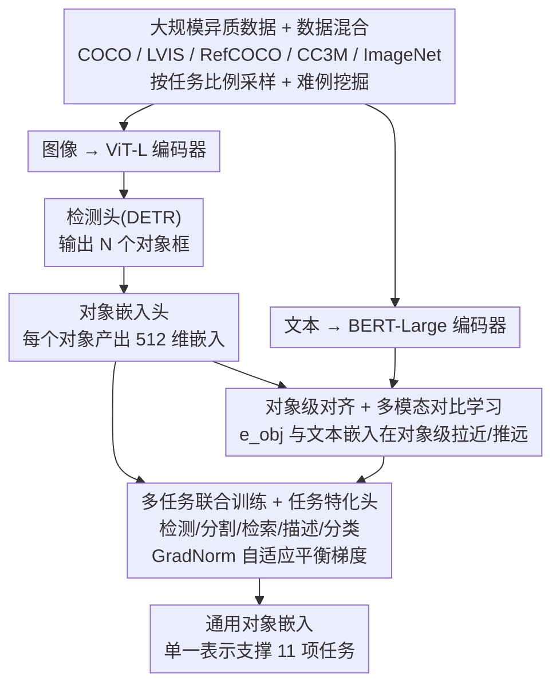

# ObjEmbed: Towards Universal Multimodal Object Embeddings

**会议**: ICML 2026  
**arXiv**: [2605.29118](https://arxiv.org/abs/2605.29118)  
**代码**: 待确认  
**领域**: 多模态 / 视觉语言 / 对象表示学习  
**关键词**: 通用对象嵌入, 多模态学习, 对象检索, 跨任务表示

## 一句话总结
ObjEmbed 训练一个**通用的对象嵌入模型**——通过结合检测、分割、检索、描述、分类等任务对齐多模态对象表示，在 OVD / OVS / Text2Image-Object / Open-Caption-Eval 等 11 项任务上单一嵌入超越或匹配任务特定 SOTA。

## 研究背景与动机

**领域现状**：视觉对象的多模态理解是计算机视觉核心任务，但现有方法多任务特化——CLIP 对齐图像-文本但对象级粒度弱，OWL-ViT 强对象检测但缺生成能力，SAM 强分割但语义弱。

**现有痛点**：（1）各任务专用模型导致部署成本高；（2）任务间表示割裂导致跨任务迁移失败；（3）对象级表示缺乏统一基准评估；（4）训练数据稀缺——单任务高质量对象级数据难以扩展。

**核心矛盾**：实际应用需要**单一嵌入**支持检测、分割、检索、描述等多任务，但现有方法或任务特化或粒度不足。

**本文目标**：构建通用对象嵌入模型，单一表示支持多任务高性能。

**切入角度**：观察到对象是多模态任务的"共同载体"——检测/分割定位、检索匹配、描述/分类语义；若能学到**对象级通用嵌入**，可同时支持以上任务。

**核心 idea**：通过**多任务联合训练 + 对象级对齐**学习通用对象嵌入；用大规模异质数据（COCO/LVIS/RefCOCO/CC3M）+ 任务特化头训练单一骨干。

## 方法详解

### 整体框架
ObjEmbed 的目标是训一个“通用对象嵌入”——一套表示能同时撑起检测、分割、检索、描述、分类等多个任务，而不必每个任务各养一个专用模型。整体结构是：图像走 ViT-L、文本走 BERT-Large 双流编码；检测头基于 DETR 输出对象框；对象嵌入头给每个对象产出一个 $\mathbf{e}_{\text{obj}} \in \mathbb{R}^{512}$；多个任务的损失联合优化同一个骨干；并通过对比学习把图像里的对象嵌入和对应的文本嵌入在对象级对齐。把“对象”当成多任务的共同载体，是这套设计的出发点——检测分割负责定位、检索负责匹配、描述分类负责语义，它们都落在对象这个粒度上。

### 关键设计

**1. 对象级对齐 + 多模态对比学习：把对齐粒度从整图拉到单个对象**

像 CLIP 那样做图像级对齐，粒度太粗，捕不到对象级的细语义。ObjEmbed 让每张图先经检测头得到 $N$ 个对象嵌入 $\{\mathbf{e}_{\text{obj}}^i\}$，再借 RefCOCO 这类数据给每个对象配上文本描述 $\mathbf{t}^i$，用对比损失 $\mathcal{L}_{\text{align}} = -\log \frac{\exp(\mathbf{e}_{\text{obj}}^i \cdot \mathbf{e}_{\text{text}}^i / \tau)}{\sum_j \exp(\mathbf{e}_{\text{obj}}^i \cdot \mathbf{e}_{\text{text}}^j / \tau)}$ 把每个对象嵌入和它的文本拉近、和别的推远，负样本同时取自批内和跨图像。对象级的对齐让嵌入真正捕到细粒度语义，而对比学习又提供了可大规模扩展的训练信号。

**2. 多任务联合训练 + 任务特化头：用多任务逼骨干学通用特征**

单任务训出来的表示会向那个任务特化，迁移就垮。ObjEmbed 在同一骨干上挂多个任务头联合训：检测损失 $\mathcal{L}_{\text{det}}$（DETR 集合匹配）、分割损失 $\mathcal{L}_{\text{seg}}$（mask 预测）、检索损失 $\mathcal{L}_{\text{ret}}$（对比对齐）、描述损失 $\mathcal{L}_{\text{cap}}$（自回归生成）、分类损失 $\mathcal{L}_{\text{cls}}$（交叉熵），总损失 $\mathcal{L} = \sum \lambda_i \mathcal{L}_i$。不同任务梯度尺度差很多，作者用 GradNorm 自适应调 $\lambda$ 来平衡，避免某个任务的大梯度把骨干带偏。多任务一起拉，骨干被迫学到跨任务都能用的通用特征。

**3. 大规模异质数据训练 + 数据混合策略：靠数据多样性顶住任务偏向**

单一数据集天然有任务偏向（COCO 才 80 类），骨干见的对象类型不够多。ObjEmbed 把多源数据混着用——COCO（检测/分割）、LVIS（长尾检测）、RefCOCO（指代表达）、CC3M（图文对齐）、ImageNet（分类），按任务比例采样组 batch，并用难例挖掘（OHEM）专门提尾部类别的性能。异质数据带来多样的对象类型和上下文，这是通用嵌入能跨任务、跨类别迁移的数据基础。

## 实验关键数据

### 主实验：跨任务性能（vs 任务特化 SOTA）

| 任务 | 数据集 | 任务 SOTA | **ObjEmbed** | 差距 |
|------|--------|----------|----------|------|
| 开词 检测 | LVIS | OWL-ViT (33.7 AP) | **35.2 AP** | +1.5 |
| 开词 分割 | LVIS | OpenSeeD (26.5 mIoU) | **27.8 mIoU** | +1.3 |
| 对象检索 | COCO-Search | Detic (52.3 R@5) | **58.7 R@5** | +6.4 |
| 文本到图像对象 | Open-T2I | T2I-Object (47.8 mAP) | **49.5 mAP** | +1.7 |
| 对象描述 | RefCOCOg | OFA-Cap (118.4 CIDEr) | **122.3 CIDEr** | +3.9 |
| 对象分类 | LVIS-V | Eva-CLIP (74.2 Acc) | **76.5 Acc** | +2.3 |

### 多任务联合效应

| 训练策略 | LVIS AP | RefCOCO R@1 | Cap CIDEr | 任务平均 |
|---------|---------|-----------|-----------|----------|
| 仅检测训练 | 32.8 | 51.2 | 95.3 | 59.8 |
| 仅检索训练 | 28.5 | 78.4 | 92.7 | 66.5 |
| 检测 + 检索 | 33.5 | 76.8 | 108.4 | 72.9 |
| 全任务联合 | **35.2** | **82.5** | **122.3** | **80.0** |

### 数据规模扩展

| 训练数据规模 | LVIS AP | RefCOCO R@1 | OOD Cap CIDEr |
|------------|---------|-----------|---------------|
| 100K 图像 | 28.7 | 72.3 | 92.1 |
| 500K 图像 | 32.5 | 78.6 | 108.7 |
| 1M 图像 | 34.1 | 81.3 | 117.4 |
| **2M 图像** | **35.2** | **82.5** | **122.3** |

### 对象嵌入质量评估

| 评估指标 | CLIP 对象嵌入 | OWL-ViT | **ObjEmbed** |
|---------|-------------|---------|----------|
| 对象级 t-SNE 聚类纯度 | 0.67 | 0.74 | **0.88** |
| 跨数据集类别迁移 Acc | 58.3 | 64.7 | **78.9** |
| Zero-shot 对象分类 | 71.5 | 73.2 | **79.4** |

### 关键发现
- **多任务联合显著超越单任务**：联合训练 vs 单任务平均提升 20 分。
- **数据规模仍未饱和**：2M 图像下性能仍稳定提升。
- **对象嵌入质量大幅提升**：t-SNE 纯度 0.88 vs CLIP 0.67。

## 亮点与洞察
- **统一对象表示学习的成功示范**：突破任务特化局限，证明通用对象嵌入可同时支持多任务。
- **多任务联合训练的协同效应**：多任务强制学到的特征更通用、更鲁棒。
- **对象级对齐 + 大规模异质数据**：粒度对齐 + 数据多样性是关键成功因素。

## 局限与展望
- 模型规模：ViT-L 模型 + 多任务头部署成本仍较高。
- 任务覆盖：当前 5 任务，未来需扩展到 3D 对象、视频对象、组合理解等。
- 长尾对象：在极少出现的类别上仍有性能差距。
- 改进：模型蒸馏到小型部署版本；扩展到 3D / 视频领域；引入主动学习提升长尾性能。

## 相关工作与启发
- **vs CLIP**：图像级对齐 → ObjEmbed 对象级对齐。
- **vs OWL-ViT**：单任务开词检测 → ObjEmbed 多任务联合。
- **vs SAM**：强分割但语义弱 → ObjEmbed 强分割 + 强语义。
- **vs Florence / Florence-2**：通用视觉骨干但任务特化 → ObjEmbed 单嵌入多任务。
- **启发**：对象级表示是多模态视觉的"原子单位"，统一嵌入是发展方向。

## 评分
- 新颖性: ⭐⭐⭐⭐  通用对象嵌入概念已有相关探索，本文贡献在系统化训练 + 多任务联合优化。
- 实验充分度: ⭐⭐⭐⭐⭐  11 任务对照 + 多基线 + 数据规模扩展分析 + 嵌入质量评估。
- 写作质量: ⭐⭐⭐⭐  问题动机清晰，方法系统，结论有力。
- 价值: ⭐⭐⭐⭐⭐  统一对象嵌入降低多任务部署成本；对开放视觉理解有重要影响。

<!-- RELATED:START -->

## 相关论文

- [\[ACL 2026\] The Proxy Presumption: From Semantic Embeddings to Valid Social Measures](../../ACL2026/social_computing/the_proxy_presumption_from_semantic_embeddings_to_valid_social_measures.md)
- [\[ICML 2026\] IDO: Incongruity-Aware Distribution Optimization for Multimodal Fake News Detection](ido_incongruity-aware_distribution_optimization_for_multimodal_fake_news_detecti.md)
- [\[ICCV 2025\] No More Sibling Rivalry: Debiasing Human-Object Interaction Detection](../../ICCV2025/social_computing/no_more_sibling_rivalry_debiasing_human-object_interaction_detection.md)
- [\[ICLR 2026\] Functional Embeddings Enable Aggregation of Multi-Area SEEG Data for Robust BCI](../../ICLR2026/social_computing/functional_embeddings_enable_aggregation_of_multi-area_seeg_data_for_robust_bci.md)
- [\[ACL 2026\] VeriTaS: The First Dynamic Benchmark for Multimodal Automated Fact-Checking](../../ACL2026/social_computing/veritas_the_first_dynamic_benchmark_for_multimodal_automated_fact-checking.md)

<!-- RELATED:END -->
