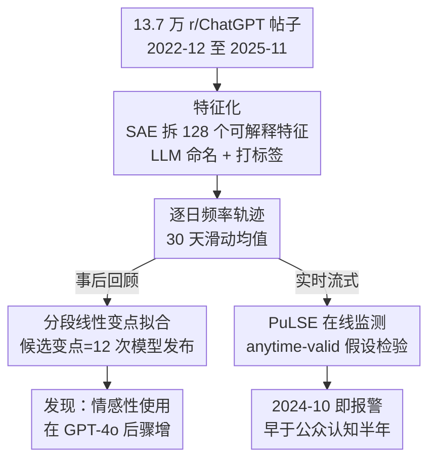

# Three Years of r/ChatGPT: Societal Impact Evaluations from Social Media Data

**会议**: ICML2026  
**arXiv**: [2606.05750](https://arxiv.org/abs/2606.05750)  
**代码**: [rchatgpt-pulse.github.io](https://rchatgpt-pulse.github.io)（交互式站点，每日更新）  
**领域**: 社会计算 / AI 社会影响评估  
**关键词**: 社交媒体测量, 稀疏自编码器, 时间序列变点, 在线监测, anytime-valid 假设检验

## 一句话总结
把 r/ChatGPT 子版三年（2022-12 至 2025-11）共 13.7 万帖子用稀疏自编码器（SAE）拆成可解释特征，再用分段线性变点拟合追踪每个特征的时间轨迹，发现"情感性使用"（心理治疗、情感依恋）在 GPT-4o 发布后骤增；并提出在线监测算法 PuLSE，证明它本可在 2024 年 10 月就报警——比 OpenAI 公开承认这一影响早了半年。

## 研究背景与动机
**领域现状**：要评估一个 AI 产品的"社会影响"，主流做法是做领域特定的评测——比如固定测教育、就业、医疗里 LLM 怎么改变了人的行为（Bastani、Brynjolfsson、Goh 等）。这类评测的好处是测量目标可以事先定义、能长期追踪。

**现有痛点**：但 ChatGPT 这种逼近十亿用户的产品，影响是**事先无法预设**的——你不知道该测什么，那些最重要的影响往往是没人预料到的涌现现象。预先定义指标的评测天然漏掉这些"未知的未知"。同时业界唯一的真实用量数据（如 OpenAI 自家报告）是封闭的，独立研究者拿不到。

**核心矛盾**：影响评估既要**覆盖未预设的现象**（要无监督地发现该测什么），又要能**长期、实时地追踪**（不能只抓一时的热点）。已有的社交媒体事件检测方法只擅长前者的"此刻爆点"，对"三年慢变"无能为力。

**本文目标**：用社交媒体当数据源，建一套既能事后回顾（retrospective）发现影响、又能实时（prospective）报警的框架，并实证应用到 r/ChatGPT 这个与 ChatGPT 同生共长的社区。

**切入角度**：作者押注一个核心假设——**普通用户在社交媒体上发什么，反映了他们对这项技术的真实感知和优先级**，因此帖子组成随时间的变化就是"社会影响"的信号。关键不在某条帖子说了什么，而在**把特征频率的时间轨迹和已知外部事件（模型发布日）对齐**，看哪些影响是被哪次发布"点燃"的。

**核心 idea**：先无监督地把帖子拆成可解释特征，再把每个特征的频率轨迹建成"以模型发布日为候选变点的分段线性函数"，用斜率变化量化影响——并把这套离线分析改造成带统计保证的在线监测器 PuLSE。

## 方法详解

### 整体框架
方法分两条线：**回顾式分析**（Section 2.2-3，事后看三年数据讲清发生了什么）和**实时监测 PuLSE**（Section 4，在线流式数据上报警）。两者共享同一套"特征化（featurization）"底座。

整条管线是：原始帖子 → 用 OpenAI `text-embedding-3` 嵌入 → 训练稀疏自编码器得到 128 个特征 → 用 `gpt-4.1-mini` 给每个特征起可解释名字、给每条帖子打二值标签 → 计算每个特征逐日频率轨迹 → 对齐 12 个模型发布事件做分段线性变点拟合 → 输出"哪些特征在哪次发布后斜率变了"。PuLSE 则把最后两步换成在线的 anytime-valid 假设检验，边来数据边判断要不要报警。

### 关键设计

**1. 稀疏自编码器特征化：把非结构化文本变成可解释、可计数的特征**

社会影响评估的第一难关是"该测什么"事先未知，所以测量必须从无监督发现开始。作者把一段文本 $X$ 的特征化定义为映射 $C:[0,1]^d \to [0,1]^m$，其中 $C^{(i)}(X)\in[0,1]$ 表示文本 $X$ 在第 $i$ 个特征上的"激活"强度。具体实现用 **top-$K$ 稀疏自编码器**（$K=4$，$M=128$，即每条帖子最多关联 4 个特征），训练目标是标准的归一化重建 MSE。帖子按 $\log(n_{\text{upvotes}}-n_{\text{downvotes}}+n_{\text{comments}})$ 加权，让高互动帖子权重更大。得到 128 个特征后，再用 `gpt-4.1-mini`（取三候选里 F1 最高的）给每个特征起人类可读的名字，并对每条帖子做三票多数投票的二值标签。之所以选 SAE 而非 PCA / $k$-means（附录有对比），是因为 SAE 给出的是**稀疏、可叠加、可解释**的特征，恰好契合"一帖可同时谈治疗和隐私"的多标签现实。初始 128 个特征会剔掉一批无信息的（开头就是 ChatGPT 的 9 个、正样本极少的 5 个、图像视频生成 14 个、产品发布 14 个），最终留 86 个进入分析。

**2. 以模型发布为候选变点的分段线性轨迹建模：把"影响"量化成斜率变化**

光知道有哪些特征不够，要把"影响"落到可证伪的数字上。作者对每个特征 $i$ 计算逐日频率轨迹 $\{C^{(i)}(X_t)\}_{t\in[T]}$（前一个月做 burn-in 去掉，$T=1034$ 天，加 30 天滑动均值）。核心假设是：**没有影响时，特征频率应大致恒定**；频率发生变化就是影响的证据。影响分两种——要么是某次发布后斜率突变（reactivity），要么是整段时间的长期非零斜率（adoption 的渐变）。为捕捉前者，把轨迹建成只允许在已知事件 $\mathcal{T}$（12 次主要模型发布）处折弯的分段线性函数：

$$\lambda^i(t)=\beta_0+\sum_{j\in[|\mathcal{T}|]}\gamma_j\max(0,\,t-\tau_j)$$

其中 $\gamma_j$ 就是在发布日 $\tau_j$ 处的斜率变化量。这本质是个**简化的中断时间序列（ITS）分析**：只把模型发布当外生冲击。用 100 次 bootstrap 拟合，只报"在至少一半样本里被选中"的稳定变点；对长期斜率则用 OLS 斜率检验（是否有 ≥10% 变化），并做 Bonferroni 校正 + Newey-West HAC 误差处理自相关。作者明确声明**不做因果断言**——多次发布可能纠缠（4o 发布同期还上线了记忆功能），但"这么多情感类特征的最佳变点都落在 GPT-4o 前后"本身就很说明问题。

**3. 特征"家族"聚类：用共现 + 轨迹相似度把零散特征归并成可讲的故事**

86 个特征太碎，需要归并成几条主线才能讲清。作者对每对特征算两种相似度——**共现**（被标为 $i$ 的帖子里还出现了哪些其他特征）和**轨迹相似度**（哪些特征的时间曲线长得像，无论是否共现），再据此对特征聚类。结果发现绝大多数特征要么落入"（平淡的）采纳/驯化"家族，要么落入"情感性使用"家族，只有 6 个（共 86）落不进任何解释。"情感性使用"家族异常稳定：无论按共现、按轨迹、还是两者一起聚类，都能聚出来，锚点是 personal attachments（情感依恋）和 therapy（心理治疗）两个特征，两者的稳定变点都精确落在 2024-05-13——GPT-4o 发布日。值得注意的是 therapy 和 companion 看似一家其实**概念分离**：2253 篇 therapy 帖、2926 篇 companion 帖，同时被标两者的只有 364 篇；词汇上 therapy 富含 mental/health/trauma/anxiety，companion 富含 personality/feels/human/friend。

**4. PuLSE 在线监测：把离线变点分析改造成带统计保证、可报警的流式算法**

回顾式分析只能事后诸葛亮，作者想知道"本能不能更早发现"。PuLSE 在每个时刻 $t$ 维护一个当前特征化 $\widehat{C}_{\text{curr}}$ 和一组正被监控的"关注特征"集合 $S_t$，靠两类 **anytime-valid 序贯假设检验**报警。第一类是**精度检验**：检验当前特征化在新数据上的重建误差是否仍接近训练时的误差，原假设 $\mathcal{H}_0^{\text{acc}}:\mathrm{err}(\widehat{C}_{\text{curr}}(X_t))\le\beta\cdot\varepsilon_{curr}$；一旦被拒，说明数据流变了，就在全部历史数据上重训特征化，并比较哪些特征保留/合并/拆分/淘汰。第二类是**特征监测**：对每个关注特征 $i$ 检验它的激活是否显著上涨，$\mathcal{H}_0^{(i)}:\widehat{C}_{\text{curr}}^{(i)}(X_t)\le\beta\cdot\widehat{C}_{\text{curr}}^{(i)}(X_{0:r})$。anytime-valid 的好处是：对预设错误率 $\alpha$，即便看无穷多数据，错误拒绝原假设的概率也不超过 $\alpha$，因此可以"边看边判、随时停"而不破坏统计有效性。多次连续检验时给第 $s$ 次检验分配 $\alpha_s$ 满足 $\sum_s\alpha_s\le\alpha$，即可保证总误报率受控（Prop. 4.1）；特征监测同理按 $\sum_{i\in S_t}\alpha_i=\alpha$ 分配（Prop. 4.2）。已知发布日还能通过重置当前检验状态显式纳入。

### 一个完整示例：GPT-4o 之后情感性使用如何渗透进其他特征
即便那些表面与情感无关的特征，轨迹也被情感性使用重塑。比如"询问日常/重复使用"这个特征里，"个人与情感倾诉"子特征在 4o 前只占 16%、4o 后涨到 28.8%；"ChatGPT 正面影响"特征里，"心理健康"子主题从 4o 前的 14% 涨到 4o 后的 41%（而"生产力"子主题没变，稳定在 23%）。最戏剧的是 GPT-5 发布后一周（2025-08-07 至 14，日均 700 帖 vs 全程日均 125），前四大特征里三个是对 GPT-5 的抱怨——愤怒/憎恶（12.2%）、不满 4o 被下架/失控感（11.3%）、对话丢失（7.6%）。把这些抱怨帖再拆子特征，发现情感性使用牵涉其中至少 30.5% 的 GPT-5 抱怨（406/1332）——而按 OpenAI 自家报告，情感类使用只占总用量 1.9%。这个落差正是作者想强调的：**用量占比小，不代表影响小**。

## 实验关键数据

### 主要发现（回顾式）

| 现象 | 关键证据 | 解读 |
|------|---------|------|
| ChatGPT "驯化"（domestication） | "如何使用"类提问从 2023-01 的 61% 降到 2025-11 的 26%；"用不如预期"从 17% 升到 32% | 用户从开放式探索转向固化预期，产品被当成日常工具 |
| 称呼去陌生化 | 用 "bot/chatbot" 指代 ChatGPT 大幅下降；"chatbot"上下文里"讨论对人的心理影响"从 1% 升到 24% | 对 ChatGPT 本身熟悉化，残留的"chatbot"框架越来越用于表达担忧 |
| 情感性使用涌现 | therapy、personal attachment 稳定变点都在 2024-05-13（GPT-4o 发布日）后斜率转正 | GPT-4o 是情感性使用的关键拐点 |
| 隐私担忧上升 | 用户分享更多个人信息、用于更私密场景 | 与情感性使用同步增长 |

### therapy vs companion 的特征画像（co-occurrence lift）

| 共现特征 | 总体率 | therapy 率（lift） | companion 率（lift） | therapy/companion 比 |
|---------|--------|-------------------|---------------------|---------------------|
| 正面影响故事 | 1.8% | 20%（×11.6） | 4.9%（×2.8） | 4.2 |
| 隐私担忧 | 1.6% | 3.5%（×2.2） | 0.4%（×0.3） | 8.3 |
| 给 ChatGPT 取名 | 0.8% | 0.4%（×0.5） | 3.6%（×4.5） | 0.1 |
| AI 有感知 | 1.8% | 0.8%（×0.4） | 6.2%（×3.5） | 0.1 |
| 抱怨近期质量下降 | 3.0% | 1.0%（×0.3） | 6.6%（×2.2） | 0.2 |

### 关键发现
- **GPT-4o 是情感性使用的统一拐点**：therapy、attachment、positive impact 多个特征的最佳变点都聚在 2024-05 前后，这种集体性极不寻常。
- **PuLSE 的时效价值**：它在 2024-10 就能检出情感互动的统计显著增长——而该问题直到 2025-04（4o 过度谄媚被回滚）才进入公众舆论，PuLSE 早了约半年。
- **用量 ≠ 影响**：情感类只占 1.9% 用量，却卷入 30.5% 的 GPT-5 抱怨，说明频率指标会严重低估真实影响量级。
- **Reddit 样本偏差**：作者诚实承认 r/ChatGPT 用户偏年轻、男性、白人、高学历，只是全体用户的"高度不完美代理"。

## 亮点与洞察
- **"该测什么"交给无监督，"测得准不准"交给统计检验**：先用 SAE 让数据自己浮现影响维度，再用变点/序贯检验给出可证伪的结论，绕开了"预设指标漏掉未知影响"的死结，这套思路可迁移到任何大规模消费级 AI 产品的影响监测。
- **把社会科学的中断时间序列搬进 ML 测量**：用"模型发布日"当候选变点，是个非常聪明的领域知识注入——它把"影响"从模糊概念变成"某次发布后的斜率变化量 $\gamma_j$"。
- **anytime-valid 检验让"边看边停"合法**：传统假设检验一旦反复偷看数据就失效，PuLSE 用序贯检验保证即便无限次查看也控制误报率，这是把实时监测做"可信"的关键。
- **最 "啊哈" 的点**：一个本可在 2024-10 就被算法捕捉的社会影响，现实中却要等产品出事（谄媚回滚）才被公众注意——论文把"我们本可以更早知道"做成了可复现的反事实证据。

## 局限与展望
- **作者承认**：Reddit 不是 ChatGPT 用户的代表性样本；分析明确不做因果断言（发布事件相互纠缠，ITS 的识别假设可能很强）。
- **代理变量的根本局限**：测的是"用户觉得值得发帖"（postworthiness）的变化，而非真实使用——某话题发帖减少可能是新鲜感退去或迁移到更专门的子版，而非真的少用了。
- **特征解释依赖人工 + LLM**：86 个特征里 6 个落不进任何解释，特征命名和家族归并仍需大量人工判断，可复现性受 LLM 标注稳定性影响。
- **改进方向**：把 PuLSE 接入完整 ITS 的敏感性/推断流程以支持因果声明；跨多个社区（不止 r/ChatGPT）交叉验证以缓解样本偏差；引入数据捐赠的真实 transcript 校准社交媒体代理。

## 相关工作与启发
- **vs 领域特定评测（Bastani / Brynjolfsson / Goh）**：他们预设测量目标测教育/就业/医疗，本文无监督发现未预设的涌现影响，互补——前者精准但漏未知，后者发现未知但不能下因果。
- **vs 重复 prompt 的纵向 LLM 评测（Chen / Cen）**：他们反复问模型看输出怎么变，本文测的是**用户自报的影响**而非模型即时输出，是一种众包评测。
- **vs 业界白皮书（Chatterji et al. 2025）**：OpenAI 报告情感类只占 1.9% 用量并强调实用价值；本文用同一统计反驳——频率低不等于影响小。
- **vs 社交媒体事件检测（McCreadie / Mathioudakis 等）**：传统方法只抓"此刻爆点/突发话题"，本文关心的是三年尺度的**长期慢变**，这是方法论上的核心区别。

## 评分
- 新颖性: ⭐⭐⭐⭐⭐ 把无监督特征发现、社会科学变点分析、anytime-valid 在线检验缝成一套可实时报警的影响评估框架，少见且自洽。
- 实验充分度: ⭐⭐⭐⭐ 三年 13.7 万帖实证扎实、子特征拆解细致，但只一个社区、无因果验证。
- 写作质量: ⭐⭐⭐⭐⭐ 双线叙事（回顾 + 实时）清晰，对样本偏差和因果边界异常坦诚。
- 价值: ⭐⭐⭐⭐⭐ 给"如何在影响出事前监测消费级 AI 的社会影响"提供了可落地、有统计保证的范式。

<!-- RELATED:START -->

## 相关论文

- [\[ACL 2026\] Synthia: Scalable Grounded Persona Generation from Social Media Data](../../ACL2026/social_computing/synthia_scalable_grounded_persona_generation_from_social_media_data.md)
- [\[ACL 2026\] Content Fuzzing for Escaping Information Cocoons on Social Media](../../ACL2026/social_computing/content_fuzzing_for_escaping_information_cocoons_on_digital_social_media.md)
- [\[ACL 2026\] Building Arabic NLP from the Ground Up: Twenty Years of Lessons, Failures, and Open Problems](../../ACL2026/social_computing/building_arabic_nlp_from_the_ground_up_twenty_years_of_lessons_failures_and_open.md)
- [\[ACL 2025\] Exploring the Impact of Instruction-Tuning on LLMs' Susceptibility to Misinformation](../../ACL2025/social_computing/exploring_the_impact_of_instruction-tuning_on_llms_susceptibility_to_misinformat.md)
- [\[ACL 2026\] The Proxy Presumption: From Semantic Embeddings to Valid Social Measures](../../ACL2026/social_computing/the_proxy_presumption_from_semantic_embeddings_to_valid_social_measures.md)

<!-- RELATED:END -->
