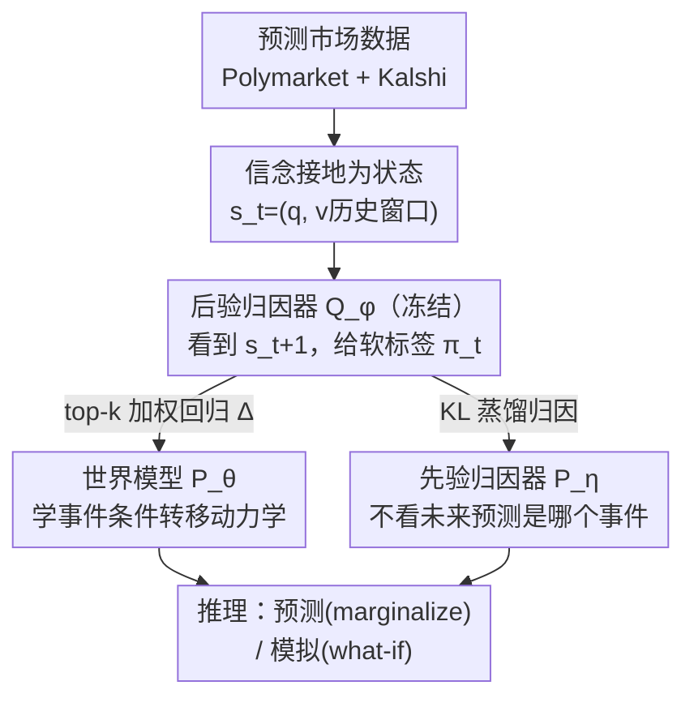

# Building Social World Models with Large Language Models

**会议**: ICML 2026  
**arXiv**: [2606.11482](https://arxiv.org/abs/2606.11482)  
**代码**: https://github.com/ulab-uiuc/social-world-model  
**领域**: 时间序列预测 / LLM / 世界模型 / 社会计算  
**关键词**: 社会世界模型, 信念动力学, 预测市场, 潜在事件归因, 后验引导

## 一句话总结
本文提出"社会世界模型"（SWM），把集体信念当作状态、把社会事件当作外生动作，用 LLM 作转移引擎学一个事件条件的状态转移分布 $P_\theta(\mathbf s_{t+1}\mid\mathbf s_t,e_t)$；通过一个冻结的"事后后验归因器"提供伪标签来绕开"事件→信念变化"标注缺失的难题，在用真实预测市场（Kalshi/Polymarket）构建的 SWM-Bench 上显著超过时间序列基础模型与 GPT-5.5 等强基线。

## 研究背景与动机
**领域现状**：社会信念（如"未来五年是否出现 AGI""谁会当选美国总统"）会随重大事件剧烈波动，理解并预测它的演化对社会事件预测、商业决策都很关键。一个自然的问题是：LLM 既有常识又有社会智能，能不能用它来对"事件驱动的信念动力学"建模？

**现有痛点**：作者把困难拆成三层：(C1) **可量化性与数据稀缺**——集体信念是语义驱动的，难以结构化测量，缺高保真时序数据，连标准 benchmark 都难建；(C2) **社会转移的语义复杂性**——信念迁移由心理和文化语境驱动，是非符号化的，传统统计/符号模型抓不住这些隐式转移规则；(C3) **缺乏显式归因标签**——就算观察到信念变了，"哪个具体事件导致的"往往是隐的，没有"事件→变化"的监督，模型学不出机制。

**核心矛盾**：信念动力学本质是 $P(\mathbf s_{t+1}\mid\mathbf s_t,e_t)$ 这样一个转移过程，但它的"状态"难测、"转移规则"非符号、"驱动事件"无标注——三件事彼此缠绕，缺一不可。

**本文目标**：分别破这三关——给信念找一个可量化的高保真状态、给语义转移找一个能装下常识的引擎、给归因找一套不依赖人工标注的监督信号。

**切入角度**：作者的关键观察是**预测市场**（Polymarket/Kalshi）是比问卷/社媒更优的集体意见聚合信号——参与者用真金白银下注，价格逼近群体对某二值命题的平均信念，且天然围绕不确定结果形成、规模大、投资驱动质量高。于是把市场价格波动当作集体信念的代理，把信念测量变成可观测的时序问题。

**核心 idea**：把社会信念建成"状态"、社会事件建成"外生动作"，用 LLM 当转移引擎学一个**共享**的世界模型 $P_\theta$，并用"事后看结果更容易归因"这一直觉，让冻结 LLM 做后验归因、产出伪标签来训练前向模型——把社会推理与动力学建模解耦。

## 方法详解

### 整体框架
SWM 把一个命题 $q$（如"OpenAI 是否在 2025 年 2 月发布 GPT-5"）的信念建成状态 $\mathbf s_t=(q,(v_{t-k},\dots,v_t))$，其中 $v_t\in[0,1]$ 是市场隐含的"Yes"概率（取每日收盘价），用历史窗口而非单点是为了带上动量与波动信息；把每天的新闻事件建成外生动作 $e_t^i$，并定义一个"空事件" $e_t^\emptyset$ 表示当天没有显著外部冲击。模型要学的是事件条件的转移分布 $\mathbf s_{t+1}\sim P_\theta(\cdot\mid\mathbf s_t,e_t^i)$。

训练管线由三个以 LLM 为骨干的模块协同：**社会世界模型** $P_\theta$（学转移动力学）、**先验归因器** $P_\eta$（推理时不见未来、给候选事件打分）、**后验归因器** $Q_\phi$（冻结、看得到未来 $\mathbf s_{t+1}$，给出"是哪个事件造成了这次变化"的软标签）。三步走：先收集观测到的状态-事件转移三元组 $(\mathbf s_t,e_t^i,\mathbf s_{t+1})$；再用后验 $Q_\phi$ 产出的尖锐分布 $\pi_t$ 去监督前向——$P_\theta$ 学"给定被归因事件下的变化"、$P_\eta$ 学"在看不到未来时预测归因"。注意只有 $P_\eta$ 和 $P_\theta$ 在训练中更新，$Q_\phi$ 始终冻结。

### 关键设计

**1. 把社会信念接地为预测市场状态：用价格波动当集体信念的高保真代理**

直击 C1（信念难量化、无标准 benchmark）。作者不去用充满抽样偏差的问卷或自选择严重的社媒，而是用预测市场价格——理性参与者用财务下注表达预期，价格逼近交易者的平均信念。形式上，一个社会信念是命题-价格对 $b_t=(q,v_t)$，$v_t\in[0,1]$ 取每日收盘价；状态 $\mathbf s_t=(q,(v_{t-k},\dots,v_t))$ 是回看窗口为 $k$ 的有序序列（实验取 $w=16$ 天），用轨迹而非静态点是为了让模型感知动量和波动。基于此作者建出 **SWM-Bench**：覆盖 3k+ 市场、超 1.2 万条信念预测数据点，横跨政治、金融、加密货币，是首个从真实预测市场切出的信念演化 benchmark，把潜在的社会信念变成了可测、可评的时序格式。

**2. LLM 作转移引擎 + 潜在事件归因：用一个共享世界模型装下非符号的社会转移规则**

直击 C2（社会转移语义复杂、符号模型抓不住）。SWM 不去逐个模拟 agent 还原宏观动态，而是**直接参数化宏观信念动力学**：把每个市场当作状态空间 $\mathcal S$ 的一个实例，学一个**共享**的转移函数 $P_\theta$，借 LLM 在人类话语上的海量预训练当"认知引擎"提供常识推理。每次转移的驱动事件被建成一个分类潜变量 $Z_t\in\{0,1,\dots,m\}$（索引候选事件集 $\mathcal E_t$，$Z_t=0$ 留给空事件），预测分布对 $Z_t$ 边缘化：

$$P(\mathbf s_{t+1}\mid\mathbf s_t,\mathcal E_t)=\sum_{i=0}^m \underbrace{P_\theta(\mathbf s_{t+1}\mid\mathbf s_t,e_t^i)}_{\text{世界模型}}\,\underbrace{P_\eta(Z_t{=}i\mid\mathbf s_t,\mathcal E_t)}_{\text{先验归因器}}.$$

一个巧妙处是**空事件分支无参数**：固定 $\mathbb E_{P_\theta}[\mathbf s_{t+1}\mid\mathbf s_t,e_t^\emptyset]=\mathbf s_t$，即有效市场下的鞅/持续性预测；这样 $\theta$ 只建模非空事件的动力学，而归因到空事件的区间仍能给 $P_\eta$ 提供监督（不被丢弃）。这条持续性基线也成了度量事件效应的参照——$\mathbb E_{P_\theta}[\mathbf s_{t+1}\mid\mathbf s_t,e]-\mathbf s_t$ 就是事件 $e$ 的"异常效应"，呼应经典事件研究。

**3. 后验引导训练：用"事后诸葛"的冻结 LLM 造伪标签，绕开归因标注缺失**

直击 C3（无"事件→变化"标签）。直接最大化边缘对数似然不可行：$Z_t$ 不可观测、$\mathcal E_t$ 里多数候选与某次变化无关。关键观察是**事后归因容易得多**——一个看得到真实结果 $\mathbf s_{t+1}$ 的冻结 LLM（后验归因器 $Q_\phi$）能可靠判断"哪个候选的时机与内容解释了这次变化"，产出一个高度尖锐的分布 $\pi_t\coloneqq Q_\phi(\cdot\mid\mathbf s_t,\mathbf s_{t+1},\mathcal E_t)$。前向模型（必须在结果揭晓前行动）被训去匹配这些事后标签，整个过程就是**伪标签**：事后供标签、事前学预测。训练目标为

$$\mathcal L_{\theta,\eta}=\underbrace{-\,\mathbb E_{Z_t\sim\pi_t}\big[\log P_\theta(\mathbf s_{t+1}\mid\mathbf s_t,e_t^{Z_t})\big]}_{\mathcal L_{\text{wm}}}+\underbrace{D_{\mathrm{KL}}\big(\pi_t\,\|\,P_\eta\big)}_{\mathcal L_{\text{attr}}}.$$

由于 $P_\theta$ 与 $P_\eta$ 参数不相交，两项**解耦、各自独立优化、无需平衡超参**。把式子整体读作 $\log P_{\theta,\eta}(\mathbf s_{t+1}\mid\mathbf s_t,\mathcal E_t)$ 的负 ELBO（$Q_\phi$ 当变分分布、$P_\theta$ 当似然、$P_\eta$ 当先验），但与标准 VAE 不同：变分分布是冻结的、先验反而被学，所以界一直是松的——作者诚实地把它定位成"后验引导蒸馏"而非变分推断，成败取决于 $Q_\phi$ 的零样本校准而非收紧界。

### 损失函数 / 训练策略
**世界模型项**：信念变化 $\Delta_t=\mathbf s_{t+1}-\mathbf s_t$ 连续，取最简单的同方差高斯似然 $\Delta_t\sim\mathcal N(\mu_\theta(\mathbf s_t,e),\sigma^2 I)$，$\mu_\theta$ 是 LLM 骨干上的回归头；方差固定（下游只用点预测），负对数似然退化为按事后概率加权的平方误差 $\mathcal L_{\text{wm}}=\sum_{i\in\mathcal I_t}\bar\pi_t^i\|\Delta_t-\mu_\theta(\mathbf s_t,e_t^i)\|^2$，空事件固定 $\mu_\theta(\cdot,e_t^\emptyset)\equiv0$。因 $\pi_t$ 实际很集中，只在其 **top-$k$ 支撑**上重归一化后计算。**归因器项**：候选数 $m$ 随时间变，故每个候选独立打 salience logit 再 softmax，含一个可学空 logit，$\mathcal L_{\text{attr}}$ 就是对事后标签的交叉熵。**推理两用**：预测（forecasting）对先验 $P_\eta$ 的不确定性边缘化，化简为"持续性基线 + 归因加权的期望移动" $\widehat{\mathbf s}_{t+1}=\mathbf s_t+\sum_{i\ge1}P_\eta(Z_t{=}i)\mu_\theta(\mathbf s_t,e_t^i)$；模拟（simulation）则绕过归因器、直接对一个假设事件 $e_h$ 取期望，做反事实 what-if。

## 实验关键数据

### 主实验
在 SWM-Bench 上用 MASE / MAE / 三向方向准确率 (DA) / 皮尔逊相关 (Corr) 评测，分全测试集 (all) 与"被归因子集" (attr)。SWM 用 Qwen3-8B 骨干，与时序模型、零样本提示 LLM、微调 LLM 三类基线比。SWM（后验）在 Kalshi 上取得 SOTA，论文报告相对 GPT-5.5 约 +4% 方向准确率，并在 Corr 上大幅领先；Polymarket 上则为有竞争力的表现。

| 方法 | Kalshi MASE↓ (all/attr) | Kalshi MAE↓ (all/attr) | Kalshi Corr↑ (all/attr) |
|------|------|------|------|
| TimeMixer (时序) | 1.079 / 1.135 | 0.065 / 0.119 | −0.056 / −0.224 |
| PatchTST (时序) | 1.174 / 1.232 | 0.071 / 0.129 | −0.035 / −0.194 |
| GPT-5.5 (提示) | 0.997 / 1.004 | 0.060 / 0.105 | 0.242 / 0.250 |
| Qwen3.5-397B (提示) | 1.142 / 1.194 | 0.069 / 0.125 | 0.108 / 0.181 |
| SWM (prior) | 1.013 / 0.800 | 0.061 / 0.084 | 0.167 / 0.380 |
| **SWM (posterior)** | **0.915 / 0.738** | **0.055 / 0.077** | **0.367 / 0.525** |

在 Polymarket 上 SWM（后验）MASE 0.980/0.892、MAE 0.042/0.068 同样位列最优/并列最优，Corr 0.221/0.439 与 GPT-5.5（0.264/0.482）相当——印证"Kalshi SOTA、Polymarket 有竞争力"。

### 消融实验

| 配置 | 变量 | 趋势 / 说明 |
|------|------|------|
| 归因器规模 | Qwen3-0.6B / 4B / 8B | 归因器越大，归因质量越好、整体性能越高 |
| 世界模型规模 | Qwen3-0.6B / 4B / 8B | 世界模型越大性能越好（受益于更强社会推理） |
| 时序窗口 $w$ | 1 / 2 / 4 / 8 / 16 天 | 更长历史窗口带来更好的动量/波动建模 |
| 后验 vs 先验 | SWM(post) vs SWM(prior) | 后验引导在所有平台全面优于先验，验证"事后归因更易" |
| 事件集规模 $N$ | 随 $N$ 变化的 MASE | 后验选择很快饱和，支持"归因稀疏"（单事件近似）假设 |

### 关键发现
- **后验 > 先验** 是最核心的实证：SWM(posterior) 在 MASE/MAE/Corr 上一致优于 SWM(prior)，直接证明"看得到结果的事后归因"能给前向模型造出更干净的训练信号。
- 后验分布 $\pi_t$ 极其集中（397B 后验更尖锐、质量几乎压在 top-1 事件上），这既支撑了 top-$k$ 截断的工程简化，也印证了"单事件主导一次大波动"的一阶近似 (A1)。
- SWM 在 **Kalshi 上 SOTA、Polymarket 上有竞争力**——作者将差异归于两平台市场结构不同；这提示方法对市场特性敏感。
- 纯时序基线（TimesNet/iTransformer/PatchTST 等）Corr 普遍接近 0 甚至为负，说明"只看价格历史、不看新闻事件"难以捕捉事件驱动的信念跳变，新闻条件确实带来增益。

## 亮点与洞察
- **"事后归因更容易"这一直觉被工程化成后验引导蒸馏**，是全文最"啊哈"的地方：把无标注的因果归因问题，转成"冻结 LLM 当事后裁判→产伪标签→前向模仿"，且因两个前向模型参数不相交而免去了平衡超参。
- 把世界模型范式从物理环境**迁移到社会信念**：状态=信念轨迹、动作=外生事件、空事件=鞅基线，框架干净且可解释，预测/模拟两用（forecasting 验证保真、simulation 做 what-if）。
- 空事件分支无参数、固定为持续性预测，既当了高效市场的合理基线，又顺手给归因器提供了"无显著事件"区间的监督——一个设计解决了两个问题。
- "用预测市场价格当集体信念代理"这一数据视角可迁移到更广的社会计算任务，绕开问卷/社媒的抽样偏差。

## 局限与展望
- 方法建立在两条简化假设上：(A1) **一阶单事件近似**（一次变化只归因到单个事件），(A2) **条件外生性**（候选事件给定状态后外生）。作者承认对"市场自反性事件"外生性较弱，此时 SWM 只能当预测模型而非因果识别模型；若 A1 失效（多事件共同驱动），单事件效应可能被高估。
- 模拟（what-if）对**非典型假设事件** $e_h$ 需要分布外外推，$\mathcal L_{\text{wm}}$ 只监督了训练中被判可信的事件，覆盖之外不保证可靠（仅无参持续性基线仍精确）。
- 整套界一直是松的（变分分布冻结、先验被学），成败完全押在 $Q_\phi$ 的零样本校准上；换一个校准更差的后验 LLM 可能整体退化。
- 评测局限在 Kalshi/Polymarket 两个预测市场，是否能推广到没有市场价格代理的社会信念领域（如纯舆论）还未验证。

## 相关工作与启发
- **vs 时间序列基础模型（TimesNet / iTransformer / PatchTST / Time-LLM 等）**：它们主要靠数值历史趋势预测，缺乏事件条件，难抓事件驱动的突变；SWM 显式把离散社会事件建成状态转移的驱动，因而在事件密集的信念预测上大幅领先。
- **vs 基于 agent 的社会模拟**：主流社会世界模型用 LLM 逐个模拟 agent、从微观决策还原宏观模式，计算贵、校准脆；SWM 直接参数化宏观动力学、聚焦宏观预测，回避了逐 agent 模拟的成本与脆弱性。
- **vs 提示式 LLM 预测（GPT-5.5 / Qwen3.5-397B 等）**：零样本提示不更新参数、归因隐式；SWM 通过后验引导显式学归因与动力学，在 Kalshi 上以更小骨干（Qwen3-8B）超过远更大的 GPT-5.5，体现训练范式而非单纯规模的价值。

## 评分
- 新颖性: ⭐⭐⭐⭐⭐ 世界模型范式迁移到社会信念 + 后验引导蒸馏解归因，组合很新
- 实验充分度: ⭐⭐⭐⭐ 三类基线全覆盖、多维消融，但仅限两个预测市场平台
- 写作质量: ⭐⭐⭐⭐⭐ 三层难题→三大破解一一对应，ELBO 解读诚实标注界松
- 价值: ⭐⭐⭐⭐ 提供新 benchmark 与可解释的信念预测管线，应用面广但依赖市场代理

<!-- RELATED:START -->

## 相关论文

- [\[ICLR 2026\] TimeOmni-1: Incentivizing Complex Reasoning with Time Series in Large Language Models](../../ICLR2026/time_series/timeomni-1_incentivizing_complex_reasoning_with_time_series_in_large_language_mo.md)
- [\[ICML 2026\] FactoryNet: A Large-Scale Dataset toward Industrial Time-Series Foundation Models](factorynet_a_large-scale_dataset_toward_industrial_time-series_foundation_models.md)
- [\[ACL 2025\] G2S: A General-to-Specific Learning Framework for Temporal Knowledge Graph Forecasting with Large Language Models](../../ACL2025/time_series/g2s_a_general-to-specific_learning_framework_for_temporal_knowledge_graph_foreca.md)
- [\[NeurIPS 2025\] Diffusion Transformers as Open-World Spatiotemporal Foundation Models](../../NeurIPS2025/time_series/diffusion_transformers_as_open-world_spatiotemporal_foundation_models.md)
- [\[ICCV 2025\] VLRMBench: A Comprehensive and Challenging Benchmark for Vision-Language Reward Models](../../ICCV2025/time_series/vlrmbench_a_comprehensive_and_challenging_benchmark_for_vision-language_reward_m.md)

<!-- RELATED:END -->
