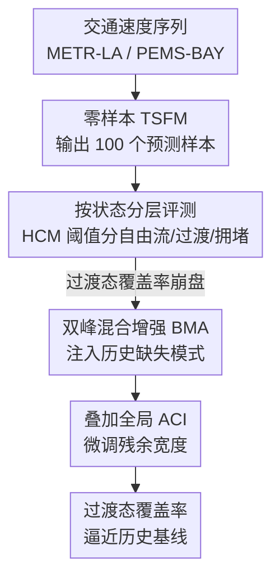

# Do Time Series Foundation Model Benchmarks Hide Regime-Dependent Failures? Evidence from Traffic Speed Forecasting

**会议**: ICML2026  
**arXiv**: [2606.18367](https://arxiv.org/abs/2606.18367)  
**代码**: 待确认  
**领域**: 时间序列 / 基础模型评测  
**关键词**: 时序基础模型, 概率预测, 状态切换, 基准评测, 校准

## 一句话总结
这篇论文指出时序基础模型（TSFM）在交通速度预测上"平均指标好看、关键时刻失灵"——它用按交通状态分层的评测揭穿了聚合指标掩盖的灾难性失败，并提出无需重训的后处理方法 BMA，把"过渡态"的预测区间覆盖率拉回接近历史基线的水平。

## 研究背景与动机
**领域现状**：时序基础模型（如 Chronos、Moirai）被定位为"通用概率预报器"，号称零样本就能给出可靠的预测分布。主流的评测基准（TSFM-Bench、GIFT-Eval）把 METR-LA、PEMS-BAY 这类交通速度数据集纳入排行榜，但只按"领域"和"采样频率"分层，从不按"同一领域内的运行状态（regime）"分层。

**现有痛点**：交通速度有个物理特性——它在自由流（约 65 mph）和拥堵（约 10–20 mph）两个状态之间**突变切换**，由通行能力阈值这种硬门槛驱动。在状态切换的"过渡态"，未来速度的真实分布是**双峰**的（要么维持高速、要么骤降），但 TSFM 在零样本下输出的是**单峰**区间，峰值卡在两个真实模式中间（约 30–45 mph）——这是个几乎不会持续存在的速度段。

**核心矛盾**：自由流样本在数据里占绝对多数，于是聚合指标被"容易的状态"拉高。一个模型可以在平均意义上看起来很准、校准很好，却恰恰在最需要预测的过渡时刻彻底失灵。问题的根子不是区间太窄（那是宽度问题），而是**分布形状**对不上——单峰区间无论怎么加宽，都覆盖不到 15 mph 和 65 mph 这两端。

**本文目标**：(1) 暴露聚合指标如何掩盖状态相关的失败；(2) 找到一种诊断协议把这种失败显形；(3) 在不重训 TSFM 的前提下修复过渡态的覆盖率。

**切入角度**：作者从交通物理出发，用《公路通行能力手册》（HCM）的速度阈值把每个预测窗口判定为自由流 / 拥堵 / 过渡三态，然后**按态分层**报告误差和区间覆盖率，而不是只看一个平均数。

**核心 idea**：用"按状态分层评测（regime-stratified evaluation）"揭穿聚合指标的假象，再用"双峰混合增强（BMA）"把历史分布里缺失的那个模式注入 TSFM 的预测样本，从而在零样本基础上修好分布形状。

## 方法详解

### 整体框架
这篇论文不是提出一个新的预报模型，而是提供一套**评测协议 + 后处理修复**的组合拳。整体流程是：先用 HCM 阈值给每个（窗口，传感器）的目标时段打上三态标签，把零样本 TSFM 的预测样本按态分层评测，暴露出"过渡态覆盖率崩盘"这个被平均数藏起来的失败；再针对这个失败，对**缓存好的 TSFM 样本**做后处理——用历史条件分布把缺失的双峰模式补回去（BMA），最后可叠加自适应保形推断（ACI）微调残余宽度。整条链路对 TSFM 本体始终是零样本的，所有修正都发生在它的输出端。

### 关键设计

**1. 按状态分层评测：让平均数藏不住的失败显形**

聚合指标的问题在于自由流样本占样本主体，把平均误差和平均覆盖率都拉到好看的水平。作者借《公路通行能力手册》的服务水平（LOS）阈值给每个目标时段分三态：所有步速度 $>55$ mph 为自由流（LOS A/B），所有步 $<25$ mph 为拥堵（LOS E/F），其余混合/中间值为过渡（LOS C/D）。这套阈值恰好对应单个拥堵敏感传感器的双峰分布——峰在约 18 mph 和约 65 mph，谷在 30–40 mph。分层之后真相就出来了：在 $h{=}12$（提前 60 分钟）上，整体 MAE 只有约 5.8 mph，但过渡态 MAE 飙到约 10–11 mph；90% 名义区间的经验覆盖率在自由流接近 90%，到过渡态却跌到最低 54.9%（Chronos-Bolt 在 PEMS-BAY），整整 35 个百分点的缺口。这一步本身不需要任何新模型，却揭示了"模型在最该预测的时刻最不可信"。

**2. 历史条件基线：量出"形状"的天花板**

作者设计了一个不含任何预报模型的"历史条件基线"：直接从训练数据估计每个传感器的经验条件分布 $P(\text{speed}_{t+h}\mid\text{speed}_t)$，测试时从中抽 100 个样本。这个基线的整体 MAE 很差（它只是查表，不是预报），但过渡态覆盖率高达 81–82%——因为它天然就是从双峰历史分布里采样的。这个对照的意义在于：它把"只靠分布形状能拿到多高的过渡覆盖率"这个天花板量了出来，同时也说明 TSFM 和历史查表是**互补**的——一个有点预测精度但形状错，一个形状对但没精度。

**3. 双峰混合增强（BMA）：把缺失的模式注回去**

这是论文的核心修复手段，专治过渡态的"形状错配"。它先从训练数据预计算每个传感器的历史过渡概率 $P(\text{speed}_{t+h}\in R\mid\text{speed}_t)$（每个状态 $R$、每个步长 $h$）。测试时，把 TSFM 的 100 个预测样本中的一小部分**替换**成从历史条件分布里抽的样本，替换比例由过渡概率调制——也就是说，当历史数据显示当前速度有不小概率切换到拥堵态时，就把约 15 mph 的那个缺失模式注进去。混合权重 $w\in[0.1,0.5]$ 在 10 个留出窗口上选定。它和加宽区间的本质区别是：ACI 只能调整单峰区间的宽度，**搬不动概率质量**去补缺失的模式；BMA 直接改分布形状，把单峰变回双峰。由于替换比例被过渡概率调制，在稳定的自由流态（$P(\text{congested})\approx 0$）几乎不替换，所以不会伤害其它态的覆盖率。

**4. BMA + ACI：先修形状，再修宽度**

BMA 把缺失模式注回去修好了形状，但因为混合权重 $w$ 在一套配置里是固定的，可能留下残余的过覆盖或欠覆盖。于是再叠一层全局 ACI：它顺序地跟踪一个错覆盖率 $\alpha_t$，当近期观测落在区间外时收缩 $\alpha_t$、从而加宽后续区间。两者是互补的——BMA 管形状（注入模式），ACI 管宽度（缩放区间收掉残余缺口）。作者特意用全局 ACI 而非按态 ACI，因为 BMA 把形状修好之后，残余覆盖误差在各态间已足够均匀，按态分别调宽度不再有额外收益。

### 损失函数 / 训练策略
本文不训练任何模型。三个 TSFM（Chronos-T5-Base、Chronos-Bolt-Small、Moirai-1.1-R-Base）全部零样本运行，14 小时上下文、生成 100 个分布样本（Bolt 通过分位数插值得到伪样本）。评测在每数据集 50 个拥堵敏感传感器池中按种子 42/43/44 各抽 30 个传感器、各取 50 个测试窗口，步长 $h\in\{3,6,12\}$（提前 15/30/60 分钟），报告 MAE 与 90% 区间的经验覆盖率，覆盖率差异以百分点（pp）计。

## 实验关键数据

### 主实验
下表是 $h{=}12$ 时按交通态分层的 MAE（mph）。TSFM 整体 MAE 远好于历史基线，证明它确实提供了真正的预报价值；但所有方法在过渡态都掉到约 10–11 mph，因为没人能预测交通会往哪个方向走。

| 数据集 | 方法 | 整体 | 自由流 | 过渡 | 拥堵 |
|--------|------|------|--------|------|------|
| METR-LA | 历史条件 | 12.90 | — | 9.47 | — |
| METR-LA | Chronos-T5 | 5.77 | 2.13 | 9.83 | 1.19 |
| METR-LA | Moirai | 5.84 | 2.16 | 9.72 | 1.89 |
| PEMS-BAY | 历史条件 | 3.11 | — | 11.05 | — |
| PEMS-BAY | Chronos-T5 | 3.07 | 1.35 | 11.04 | 2.70 |
| PEMS-BAY | Chronos-Bolt | 3.04 | 1.29 | 11.11 | 2.86 |

### 后处理覆盖率对比
下表是 $h{=}12$、90% 名义下过渡态的经验覆盖率（%）。历史基线靠从训练分布采样天然拿到 81–82%；BMA 在保住 TSFM 点精度的同时逼近这个水平。

| 数据集 | 模型 | 历史 | 原生 | 全局ACI | 按态ACI | BMA | +ACI |
|--------|------|------|------|---------|---------|-----|------|
| METR-LA | Chr-T5 | 81.6 | 68.2 | 71.3 | 70.7 | 78.3 | 81.9 |
| METR-LA | Chr-Bolt | 81.6 | 68.6 | 69.7 | 70.2 | 78.7 | 80.3 |
| PEMS-BAY | Chr-T5 | 81.7 | 65.0 | 65.5 | 67.9 | 76.7 | 77.2 |
| PEMS-BAY | Chr-Bolt | 81.7 | 54.9 | 56.1 | 57.5 | 71.2 | 73.6 |

### 关键发现
- **过渡态是重灾区**：自由流覆盖率接近 90%，拥堵态只是中度下降（宽度问题），唯有过渡态严重欠覆盖（形状问题），Chronos-Bolt 在 PEMS-BAY 跌到 54.9%，缺口 35 pp；ACI-LR 基线在过渡态甚至更差（−48 pp），证明只加宽度修不了形状。
- **BMA 提升最大、且对症**：BMA 把过渡覆盖率提升 +2.6 pp（Moirai/PEMS-BAY）到 +16.3 pp（Chronos-Bolt/PEMS-BAY），原生覆盖率越差的模型提升越大——Chronos-Bolt 从 54.9% 拉到 71.2%。
- **互补叠加**：BMA + 全局 ACI 在 BMA 基础上再加 1–2 pp，"先修形状、再修宽度"取得最佳结果；BMA 在 $w\in[0.2,0.5]$ 间结果稳定，只在 $w<0.1$ 时退化。
- **代价**：区间宽度增加约 50–80%，用锐度换覆盖率，是否可接受取决于应用。

## 亮点与洞察
- **"平均指标骗人"的具体证据**：论文没有空谈"评测要分层"，而是用交通物理（双峰速度分布）给出了一个聚合指标掩盖灾难性失败的硬例子——自由流样本占主体把平均数拉好看，这种诊断思路可迁移到电价（正常/尖峰）、风电（切入风速附近）等任何有物理阈值切换的领域。
- **区分"宽度问题"和"形状问题"**：把校准失败拆成"区间太窄"（拥堵态，ACI 能修）和"分布形状错"（过渡态，ACI 修不了）两类，是这篇论文最清醒的洞察——它直接解释了为什么所有保形方法在过渡态都失效。
- **零样本边界的巧妙处理**：BMA 用每传感器历史数据，正如保形方法用历史残差，TSFM 本体始终零样本，修正只发生在输出端，这让方法对闭源模型也适用。

## 局限与展望
- 作者承认：评测只用 30 个拥堵敏感传感器、单变量预测，上下游传感器的空间信息可能同时改善精度和覆盖率。
- BMA 的混合权重在 10 个留出窗口上调，作者承认用验证集会更规范；区间加宽 50–80% 是用锐度换覆盖率的代价。
- 一个开放问题：直接在交通数据上微调 TSFM 是否能让它原生产生双峰预测、从而关掉这个缺口，论文未做实验，BMA 在"微调不可行或用闭源模型"时仍然有价值。
- 自己的看法：三态阈值（25/55 mph）来自 HCM，换到非交通领域需要重新标定阈值，方法的"即插即用"程度有限；且只在 $h{=}12$ 详细展开，更短步长的形状失配程度未充分讨论。

## 相关工作与启发
- **vs 自适应保形推断（ACI / 各类变体）**：ACI、按态 ACI、面向状态切换和相关序列的保形方法都只调整区间**宽度**，无法搬动概率质量去补缺失的模式；本文指出过渡态是形状问题，单靠加宽（即便加到 −48 pp 那么夸张）也覆盖不到双峰两端。
- **vs 交通专用不确定性量化（Wu et al. 2023、Zheng et al. 2025）**：他们为深度交通模型做不确定性量化，但要从头训练领域专用架构，且不评测零样本 TSFM；本文聚焦零样本 TSFM 的诊断与后处理修复。
- **vs 通用 TSFM 校准研究（Adler et al. 2025）**：他们在六个通用数据集上发现基础模型"校准更好"，但没纳入高频交通数据；本文正是补上了这个会暴露问题的高频突变场景。

## 评分
- 新颖性: ⭐⭐⭐⭐ 不是新模型而是新评测视角+轻量修复，"分层揭穿聚合指标"这个角度切得很准
- 实验充分度: ⭐⭐⭐⭐ 两个标准基准、三个 TSFM、三状态分层、四种后处理对比扎实，但传感器数和步长覆盖面偏窄
- 写作质量: ⭐⭐⭐⭐⭐ 把"宽度问题 vs 形状问题"讲得极其清楚，论证链条干净
- 价值: ⭐⭐⭐⭐ 对时序基础模型评测范式有直接的警示意义，BMA 即插即用对实际部署有用

<!-- RELATED:START -->

## 相关论文

- [\[ICML 2026\] It's TIME: Towards the Next Generation of Time Series Forecasting Benchmarks](its_time_towards_the_next_generation_of_time_series_forecasting_benchmarks.md)
- [\[AAAI 2026\] A Unified Shape-Aware Foundation Model for Time Series Classification](../../AAAI2026/time_series/a_unified_shape-aware_foundation_model_for_time_series_class.md)
- [\[AAAI 2026\] ProbFM: Probabilistic Time Series Foundation Model with Uncertainty Decomposition](../../AAAI2026/time_series/probfm_probabilistic_time_series_foundation_model_with_uncertainty_decomposition.md)
- [\[ICML 2026\] Mix, Don't Pick: Why Synthetic Corpus Composition Matters for Time Series Foundation Model Pretraining](mix_dont_pick_why_synthetic_corpus_composition_matters_for_time_series_foundatio.md)
- [\[ICLR 2026\] Adapt Data to Model: Adaptive Transformation Optimization for Domain-shared Time Series Foundation Models](../../ICLR2026/time_series/adapt_data_to_model_adaptive_transformation_optimization_for_domain-shared_time_.md)

<!-- RELATED:END -->
